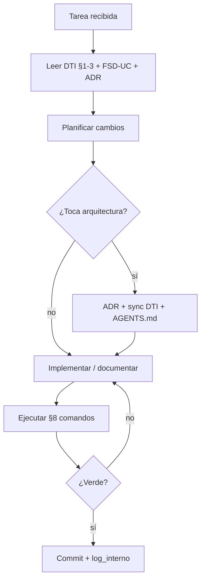

# AGENTS.md — SIGESA / AcredIA · UMSS

> **Manifiesto ejecutable para agentes IA** (Cursor, Claude Code, Copilot).  
> Gobernanza extendida: [`docs/08_agents/AGENTS.md`](docs/08_agents/AGENTS.md) (Dorada v2.2).  
> **Sincronía:** si cambia [`docs/05_dti/DTI.md`](docs/05_dti/DTI.md), actualizar este archivo en el **mismo commit**.

| Metadato | Valor |
|----------|-------|
| **Producto** | SIGESA — Sistema de Evaluación y Acreditación de Carreras |
| **Grupo** | AcredIA |
| **Dominio** | GovTech académico — acreditación CEUB/ARCU-SUR (UMSS DUEA) |
| **Versión** | v2.0 ejecutable |
| **Fecha** | 25/05/2026 |
| **Release objetivo** | `release/2.0.0` (Defensa Final DTI) |

---

## 1. Identidad del producto

- **Resumen:** plataforma web que centraliza Evidencias, dictámenes [TD] y reporting [JD] con trazabilidad append-only. **No es un ERP.**
- **DTI:** [`docs/05_dti/DTI.md`](docs/05_dti/DTI.md)
- **FSD:** [`docs/04_fsd/FSD.md`](docs/04_fsd/FSD.md)
- **PRD:** [`docs/03_prd/PRD.md`](docs/03_prd/PRD.md)
- **Roadmap [humano]:** [`docs/roadmap.md`](docs/roadmap.md)
- **PROMPT_MAPPING:** [`PROMPT_MAPPING.md`](PROMPT_MAPPING.md)
- **Prompt contracts:** [`docs/06_prompt_contracts/prompt_contracts.md`](docs/06_prompt_contracts/prompt_contracts.md)
- **Glosario:** [`context/03_domain_glossary.md`](context/03_domain_glossary.md)
- **Máquina de estados:** [`team/alexAlvarez/docs/context/04_state_machine.md`](team/alexAlvarez/docs/context/04_state_machine.md)

---

## 2. Contexto que el agente **MUST** leer antes de actuar

Al iniciar cualquier tarea, leer **en este orden**:

1. [`docs/05_dti/DTI.md`](docs/05_dti/DTI.md) — **§1** (resumen), **§2** (vistas C4/proceso), **§3** (hexagonal), **§7** (ADRs), **§19** (roadmap estratégico → `docs/roadmap.md`).
2. El **FSD-UC** tocado por la tarea en [`docs/04_fsd/casos_uso.md`](docs/04_fsd/casos_uso.md) y reglas en [`docs/04_fsd/reglas_negocio.md`](docs/04_fsd/reglas_negocio.md).
3. ADRs vigentes en [`docs/adr/README.md`](docs/adr/README.md) (estado **Aceptado**; no contradecir **Supersedido** sin ADR nuevo).
4. [`PROMPT_MAPPING.md`](PROMPT_MAPPING.md) o el contrato en [`docs/06_prompt_contracts/`](docs/06_prompt_contracts/prompt_contracts.md) si la tarea es generación documental.
5. Para código/POCs: [`docs/pocs/README.md`](docs/pocs/README.md) y el `RESULTADO.md` de la POC relacionada.

**MUST NOT** inventar requisitos CEUB/ARCU-SUR no presentes en BRD/FSD/plantillas.

---

## 3. Estructura del repositorio

```text
/
├── AGENTS.md                    ← este archivo (ejecutable)
├── PROMPT_MAPPING.md
├── README.md
├── context/                     ← glosario, estado, esquema
├── docs/
│   ├── 01_brd/ … 05_dti/        ← cadena Dorada BRD→DTI
│   ├── 05_dti/DTI.md            ← DTI canónico
│   ├── adr/                     ← ADRs (decisiones)
│   ├── pocs/                    ← POC-01, POC-02 (código validación)
│   ├── 06_prompt_contracts/
│   ├── 07_diagramas/            ← fuente única .mmd
│   ├── 08_agents/               ← gobernanza IA extendida
│   ├── 09_trazabilidad/         ← matriz, métricas AI-SDLC
│   └── roadmap.md               ← hoja de ruta [humano] DTI §19
├── team/<integrante>/           ← entregables individuales curso
└── .cursor/
    ├── skills/                  ← skills runtime (12 activas)
    └── rules/*.mdc              ← reglas globales (5)
```

**Código aplicativo v1.0:** [`app/sigesa-front/`](app/README.md) y [`app/sigesa-backend/`](app/README.md) — **submodules** apuntando a repos independientes (`AcredIA-UMSS/sigesa-front`, `AcredIA-UMSS/sigesa-backend`). **Código en este repo:** POCs en `docs/pocs/` — materializa ADR-0003, ADR-0004.

---

## 4. Stack tecnológico autoritativo

| Capa | Tecnología | Versión | ADR / fuente |
|------|------------|---------|--------------|
| Backend (objetivo v1.0) | Node.js + Express | 20 LTS / 4.x | [ADR-0009](docs/adr/ADR-0009-backend-nodejs-express.md) |
| Backend (POCs lab) | Python + FastAPI + uvicorn | 3.11+ | `docs/pocs/POC-0N/src/` |
| Frontend (objetivo v1.0) | React SPA | 18+ | DTI §8 · Design System [`figma/`](figma/README.md) |
| BD transaccional | PostgreSQL | **16** | [ADR-0006](docs/adr/ADR-0006-postgresql-16-primary-database.md) |
| Blobs Evidencia (cloud) | Amazon S3 | — | [ADR-0013](docs/adr/ADR-0013-s3-evidence-blob-storage.md) |
| Mensajería / eventos | AWS EventBridge + SQS FIFO | — | [ADR-0010](docs/adr/ADR-0010-event-driven-choreography.md), [ADR-0011](docs/adr/ADR-0011-sqs-fifo-phase-closure.md) |
| Auth | JWT stateless + RBAC | — | [ADR-0007](docs/adr/ADR-0007-jwt-rbac-authentication.md) · LDAP v1.1 [ADR-0003](docs/adr/ADR-0003-authentication-adapter.md) |
| SMTP | Institucional UMSS + cola outbox | — | FSD-UC-006 |
| IaC (objetivo) | Terraform / AWS | 1.8+ | DTI §8 · pendiente runbooks |
| Testing POCs | pytest + httpx/TestClient | — | POC-02 |
| Testing producto | Jest/Vitest + Playwright E2E | — | FSD §12 (objetivo) |
| Contenedores dev | Docker Compose | — | `docs/pocs/docker-compose.yml` |

**MUST NOT** introducir dependencias fuera de esta tabla sin **ADR nuevo** en `docs/adr/` y actualización de DTI + este AGENTS.md en el mismo commit.

**Estilo arquitectónico v1.0:** hexagonal / puertos-adaptadores dentro de servicios; coreografía event-driven entre Evidence, Audit, Orchestration, Notification (DTI §2.1).

---

## 5. Reglas de dominio invariantes

Usar lenguaje del glosario: **Fase**, **Indicador**, **Evidencia** (no «archivo» genérico en contexto normativo). Actores: **[CC]**, **[TD]**, **[JD]**, **[P]**.

- **MUST:** toda Evidencia aprobada se versiona; corrección = nueva versión + trazabilidad (append-only).
- **MUST:** ningún Indicador/Fase avanza sin reglas de máquina de estados y rol **[TD]** cuando corresponde.
- **MUST:** rechazo de indicador incluye justificación obligatoria (`motivos[]` en API).
- **MUST:** cierre de subfase solo si todos los indicadores obligatorios están `APROBADO` (validar en dominio, no solo en UI).
- **MUST:** dominio de login institucional `@umss.edu.bo` para usuarios internos v1.0.
- **MUST NOT:** `DELETE` físico de Evidencia aprobada ni sobrescritura de blobs normativos.
- **MUST NOT:** la IA aprueba/rechaza dictámenes sin supervisión humana [TD] (RB-11).
- **MUST NOT:** exponer PII masiva de estudiantes; portal [P] solo datos publicados por [JD].
- **MUST NOT:** usar términos «Cliente», «Super Admin» — usar roles DUEA del glosario.

---

## 6. Capacidades de agentes y skills

| Agente | Rol | Skill principal |
|--------|-----|-----------------|
| @ProductAgent | BRD, MRD, PRD | `sigesa-generacion-documentos-negocio` |
| @ArchAgent | FSD, DTI, API, ADR | `sigesa-dti-author`, `sigesa-arquitectura-tecnica-ia`, `sigesa-api-contract-designer` |
| @DBAgent | DDL append-only, ER | `sigesa-db-architect-append-only` |
| @QaAgent | Trazabilidad, rúbrica equipo | `sigesa-auditor-trazabilidad-dti`, `sigesa-auditoria-excelente-equipo` |
| @VisualAgent | Diagramas Mermaid | `mermaid-expert-architect` |
| @DevAgent | Frontend / backend (`app/`) | `sigesa-frontend-engineer`, `sigesa-backend-engineer` |

**Runtime:** `.cursor/skills/<nombre>/SKILL.md` (12 skills). Catálogo: [`docs/08_agents/skills.md`](docs/08_agents/skills.md).

---

## 7. Guardrails generales

- **MUST** registrar sesiones con prompt completo en `team/<nombre>/log_interno.md` (regla `02_session_prompt_logging`).
- **MUST** ejecutar verificación local **antes** de proponer cambios en POCs o código (§8).
- **MUST** actualizar ADR + DTI + este AGENTS.md si cambia una decisión arquitectónica significativa.
- **MUST** mantener trazabilidad: `PRD-US` Must → `FSD-UC` (matriz en `docs/09_trazabilidad/`).
- **MUST NOT** commitear secretos (`.env`, JWT keys, API keys) — placeholders solo.
- **MUST NOT** modificar entradas previas en `log_interno.md` (append-only).
- **MUST NOT** force-push a `main`/`release/*` sin autorización explícita.
- **MUST NOT** promover borradores de `team/` a `docs/` sin auditoría trazabilidad (skill `sigesa-auditor-trazabilidad-dti`).
- **Tamaño PR recomendado:** ≤ 400 líneas netas; dividir si es mayor.

**Políticas P-S01–P-S04:** [`docs/08_agents/AGENTS.md`](docs/08_agents/AGENTS.md) §8.

---

## 8. Comandos de verificación local

### 8.1 POCs críticas (código entregado en este repo — demo Defensa Final)

Valida ADR-0003 (upload idempotente) y ADR-0004 (workflow dictamen):

```powershell
# Windows — modo laboratorio (SQLite, sin Docker)
cd docs\pocs
.\run_local_pocs.ps1
```

```bash
# Linux/macOS — POC-02 tests directos
cd docs/pocs/POC-02-workflow-dictamen/src
python -m venv .venv && source .venv/bin/activate
pip install -r requirements.txt
POC_USE_SQLITE=1 pytest tests/ -v
```

```bash
# Docker — PostgreSQL 16 + MinIO (integración STAGE)
cd docs/pocs
docker compose up -d
```

**Criterio éxito:** POC-01 → idempotencia 100%; POC-02 → ≥ 13/13 tests PASS. Evidencia: `docs/pocs/POC-0N/evidencia/`, `RESULTADO.md`.

### 8.2 Documentación y trazabilidad

```bash
# Conteo rápido ADRs y diagramas (sanity check pre-defensa)
# PowerShell:
(Get-ChildItem docs\adr\ADR-*.md).Count
(Get-ChildItem docs\07_diagramas\*.mmd).Count
```

Revisar gate: [`docs/09_trazabilidad/report_findings.md`](docs/09_trazabilidad/report_findings.md) — objetivo **0 ERROR** Must.

### 8.3 Agente IA en Cursor

- Invocar skill: `@sigesa-dti-author` para poblar DTI §N.
- Reglas activas siempre: `.cursor/rules/02_session_prompt_logging.mdc`.

---

## 9. Sincronía DTI ↔ AGENTS ↔ código

| Decisión DTI | ADR | Código / evidencia en repo |
|--------------|-----|----------------------------|
| Upload idempotente + SHA-256 | ADR-0003 | `docs/pocs/POC-01-evidencias-upload/` |
| Máquina estados dictamen | ADR-0004 | `docs/pocs/POC-02-workflow-dictamen/` |
| Append-only Evidence | ADR-0001, ADR-0012 | `docs/05_dti/ddl_sigesa_append_only.sql` |
| EventBridge + SQS FIFO | ADR-0010, ADR-0011 | `docs/05_dti/hybrid_architecture.md` |
| S3 blobs | ADR-0013 | POC-01 (MinIO en docker compose) |
| JWT + RBAC | ADR-0007 | FSD-UC-001 · secuencia `docs/07_diagramas/seq-003-003-autenticacion-jwt.mmd` |

Si implementas en el **repo aplicativo** futuro, **MUST** respetar contratos en [`docs/04_fsd/api_contracts.md`](docs/04_fsd/api_contracts.md) y [`docs/05_dti/api_contracts_cloud.md`](docs/05_dti/api_contracts_cloud.md).

---

## 10. Flujo estándar del agente



---

## 11. Prompts prohibidos (MUST rechazar)

- Desactivar tests o linters para «entregar más rápido».
- Borrar o sobrescribir Evidencia aprobada.
- Aprobar indicadores automáticamente sin [TD].
- Alterar ADRs **Aceptados** sin crear ADR nuevo.
- Inventar métricas o carreras piloto no documentadas en BRD §14.3.

---

## 12. Referencias canónicas

| Documento | Ruta |
|-----------|------|
| Manifiesto extendido | [`docs/08_agents/AGENTS.md`](docs/08_agents/AGENTS.md) |
| Matriz trazabilidad | [`docs/09_trazabilidad/matriz_trazabilidad.md`](docs/09_trazabilidad/matriz_trazabilidad.md) |
| Métricas AI-SDLC | [`docs/09_trazabilidad/metricas_ai_sdlc.md`](docs/09_trazabilidad/metricas_ai_sdlc.md) |
| Reglas Cursor | [`docs/08_agents/cursor_rules.md`](docs/08_agents/cursor_rules.md) |
| Plantilla AGENTS curso | [`team/Marlene/templates/AGENTS_TEMPLATE.md`](team/Marlene/templates/AGENTS_TEMPLATE.md) |

---

## Registro de cambios

| Versión | Fecha | Cambio |
|---------|-------|--------|
| v1.0 | 2026-05-17 | Puntero a `docs/08_agents/AGENTS.md` |
| **v2.0** | 2026-05-25 | Manifiesto **ejecutable** en raíz: stack, MUST leer DTI §X, comandos POCs, sync DTI↔código |
| **v2.2** | 2026-05-27 | 12 skills; @DevAgent; apps en repos separados bajo `app/` (ver `app/README.md`) |
