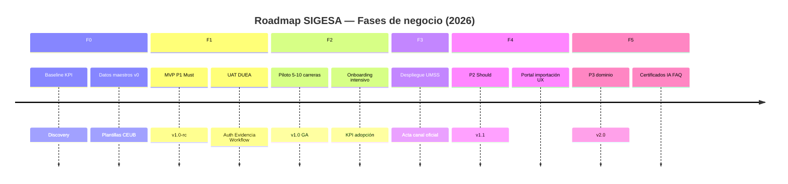
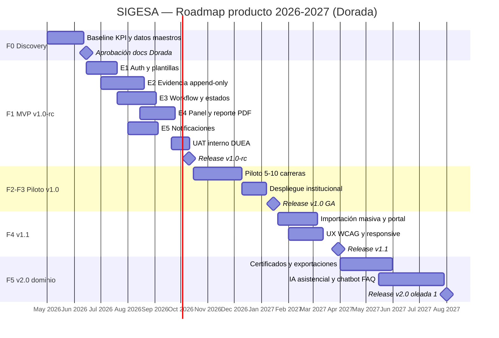

# Roadmap de producto — SIGESA / AcredIA

## Control de versión del documento

| Campo | Valor |
|-------|-------|
| **Versión** | **Dorada v1.0** |
| **Última actualización (timestamp)** | `2026-05-16T15:44:47-04:00` |
| **Resumen de cambios** | Roadmap canónico de producto: fases F0–F5 (BRD), releases v1.0/v1.1/v2.0, mapeo de épicas, user stories y requisitos; Gantt; hitos de validación; alineación MRD GTM. **No incluye ERP.** |
| **Documentos padre** | [`PRD.md`](PRD.md) · [`../01_brd/BRD.md`](../01_brd/BRD.md) v2.1 · [`../02_mrd/MRD.md`](../02_mrd/MRD.md) v1.1 |

> **Propósito:** planificar **cuándo** se entrega **qué capacidad** del producto. El [`PRD.md`](PRD.md) define el *qué*; este archivo define el *cuándo* y los **criterios de salida** por fase.

---

## 1. Principios del roadmap

| Principio | Implicación |
|-----------|-------------|
| **Automatización de acreditación** | Todo ítem debe servir CEUB/ARCU-SUR, Evidencia, Fases o transparencia [P] |
| **No-ERP** | Sin módulos SIIS, RRHH, finanzas ni integración ERP como backbone (BRD-CST-07) |
| **P1 antes que P2** | MVP cerrado (F1) solo con Must; Should entra en F2–F4 según piloto |
| **Append-only desde F1** | Evidencia versionada e inmutable en aprobados desde el primer release interno |
| **Validación con datos** | Cada fase F2+ exige medición de KPIs definidos en BRD §9 |

---

## 2. Vista ejecutiva: fases de negocio (BRD F0–F5)

Alineado a **BRD §19.1** y **MRD §8–9 (GTM)**.

| Fase | Duración orientativa | Objetivo de negocio | Release producto | Gate de salida |
|------|-------------------|---------------------|------------------|----------------|
| **F0 — Discovery y baseline** | 4–6 sem | Línea base KPI; datos maestros v0; documentación Dorada aprobada | — (sin release) | BRD/MRD/PRD firmados; baseline KPI medida |
| **F1 — MVP cerrado** | 8–12 sem | UAT interno DUEA con P1 Must | **v1.0-rc** → **v1.0** | BRD-CA-01…08 en UAT; 0 críticos seguridad |
| **F2 — Piloto facultades** | 4–8 sem | 5–10 carreras; adopción y localización en producción piloto | **v1.0** (estable) | MAU piloto ≥ 60 %; búsqueda mediana ≤ 2 min |
| **F3 — Despliegue institucional** | 4–6 sem | Acta: SIGESA canal oficial de Evidencia | **v1.0** + hotfixes | Acta firmada; observaciones ≥ 90 % en sistema |
| **F4 — Estabilización** | 4–8 sem | P2 Should completo; ajustes normativos | **v1.1** | P2 desplegado; WCAG críticos = 0 |
| **F5 — Evolución dominio** | Continuo | P3 Could: certificados, IA asistencial, exportaciones, chatbot FAQ | **v2.0+** (incremental) | Cada incremento con ROI de dominio medido |

---

## 3. Releases de producto (Delivery)

### 3.1 Resumen por versión

| Versión | Fases BRD | Prioridad | Audiencia | Fecha objetivo (orientativa) |
|---------|-----------|-----------|-----------|----------------------------|
| **v1.0-rc** | F1 | P1 Must | UAT interno DUEA | T0 + 10–14 sem |
| **v1.0** | F2–F3 | P1 Must (+ estabilización) | Piloto + institucional | T0 + 18–26 sem |
| **v1.1** | F4 | P2 Should | Todas las facultades en expansión | T0 + 26–34 sem |
| **v2.0** | F5 (oleada 1) | P3 Could seleccionado | Comunidad [P] + DUEA | T0 + 40+ sem |

*T0 = inicio de desarrollo tras cierre F0 (por validar con [JD]).*

### 3.2 v1.0 — MVP y piloto (P1 Must)

**Meta:** cerrar el ciclo **Proceso → Fase → Indicador → Evidencia → validación [TD]** sin herramientas paralelas para observaciones.

| Épica | Capacidades | User stories | PRD-REQ |
|-------|-------------|--------------|---------|
| E1 Identidad | Login local (ADR-0003), RBAC, gestión usuarios [JD], plantillas CEUB/ARCU-SUR | US-001, 002, 003, 023 | 001, 002, 003, 004, 016 |
| E2 Evidencia | Carga **desktop-first**, búsqueda, versionado, subsanación, **bloqueo borrado**; progreso > 5 MB | US-004, 005, 006, 007, 008, 025 | 005–008, 015, 022 |
| E3 Workflow | Rechazo/aprobación, avance Fase, bandeja [TD] | US-009, 010, 011, 014 | 009, 010, 017 |
| E4 Dashboards | Panel [CC] **lectura responsive**, semáforo [JD], PDF ejecutivo | US-012, 013, 021 | 011, 012, 014, **026** |
| E5 Notificaciones | Aprobación/rechazo, plazos, nueva Evidencia | US-017, 018, 019 | 013 |
| E7 Auditoría | Bitácora acciones sensibles | US-022 (parcial) | 018, 021 |

**Fuera de v1.0 (explícito):** portal público completo, importación masiva, **carga/subsanación móvil [CC]**, LDAP/SSO (v1.1), certificados, IA, chatbot, planes de mejora, **cualquier integración ERP**.

**KPIs de release v1.0:**

| KPI | Meta |
|-----|------|
| BRD-KPI-01 — Localización Evidencia | Mediana ≤ 2 min en piloto |
| BRD-KPI-06 — Observaciones en SIGESA | ≥ 90 % |
| BRD-KPI-05 — Adopción MAU | ≥ 60 % en piloto (≥ 80 % post-F3) |
| BRD-CA-01…08 | 100 % en UAT |

### 3.3 v1.1 — Estabilización y P2 Should (F4)

| Épica | Capacidades | User stories | PRD-REQ |
|-------|-------------|--------------|---------|
| E2 | Importación masiva planilla | US-024 | 020 |
| E4 | Exportación PDF proceso [CC]; export CSV observaciones [TD] | (backlog US) | 025 |
| E6 Portal | Consulta [P] estado publicado | US-016 | 019 |
| E3 | Lista observaciones abiertas [CC] | US-015 | 008 |
| E7 | Bitácora exportable [JD] | US-022 | 018 |
| UX | **Carga/subsanación móvil [CC]**; LDAP (ADR-0003); WCAG 2.2 AA | US-005, 006 | 023, NFR-012 |

**KPIs v1.1:** BRD-KPI-04 reporte P95 ≤ 5 min; 0 incumplimientos WCAG críticos.

### 3.4 v2.0 — Evolución en dominio (F5, oleada 1)

**Solo automatización de acreditación** — no ERP.

| Capacidad | User stories | PRD-REQ | BRD-REQ |
|-----------|--------------|---------|---------|
| Certificados publicados [P] | US-020 | 026 | 023 |
| Planes de mejora | — | 024 | 022 |
| Exportación Excel ampliada | — | 025 | 017 |
| IA explicable (sugerencias, no dictamen) | — | 027 | 018 |
| Chatbot FAQ normativo | — | 028 | 024 |
| Conectores opcionales datos maestros (CSV/API puntual) | — | — | Dependencia BRD §13 |

**Prohibido en v2.0 sin nuevo BRD:** módulos SIIS, nómina, tesorería, facturación.

---

## 4. Diagrama Gantt (planificación 2026–2027)

Fechas **orientativas** asumiendo T0 = julio 2026 (ajustar en BRD-Q-04).

> Fuente Mermaid externa: [`07_diagramas/gantt_roadmap_2026_2027.mmd`](07_diagramas/gantt_roadmap_2026_2027.mmd) · Release: [`gantt_release_producto.mmd`](07_diagramas/gantt_release_producto.mmd)

---

## 5. Matriz de trazabilidad: Fase × Épica × Historia

| Fase | E1 | E2 | E3 | E4 | E5 | E6 | E7 |
|------|----|----|----|----|----|----|-----|
| F1 v1.0-rc | 001–003, 023 | 004–008 | 009–011, 014 | 012–013, 021 | 017–019 | — | 022 |
| F2 piloto | — | refinamiento búsqueda | — | telemetría semáforo | tuning alertas | — | — |
| F4 v1.1 | — | 024 | 015 | exportaciones | — | 016 | 025 |
| F5 v2.0 | — | — | planes mejora | — | — | 020 | IA |

### 5.1 User stories por release (índice rápido)

| Release | Must / Should / Could | IDs |
|---------|----------------------|-----|
| **v1.0** | Must | US-001–011, 021, 023 (sin US-024 importación) |
| **v1.0** | Must (continuación) | US-012–014, 017–019, 022 |
| **v1.1** | Should | US-015, 016, 022, 024, 025 |
| **v2.0** | Could | US-020 + backlog IA/chatbot |

> Detalle Gherkin: [`PRD.md` §5](PRD.md#5-user-stories-y-criterios-de-aceptación-gherkin).

---

## 6. Roadmap de validación (Discovery)

Alineado a **PRD §3.4** y **MRD hipótesis H1–H4**.

| ID | Ciclo | Ventana | Hipótesis | Método | Criterio éxito | Historias / REQ |
|----|-------|---------|-----------|--------|----------------|-----------------|
| VAL-01 | S1 | F2 sem 1–4 | Panel [JD] reduce consultas informales | Telemetría + encuesta | ≥ 30 % reducción | US-013 |
| VAL-02 | S2 | F4 | Importación ahorra carga inicial | Tarea cronometrada | ≥ 20 % vs. manual | US-024 |
| VAL-03 | S3 | F2–F3 | Alertas mejoran hitos | Plan vs. real | +20 pp hitos a tiempo | US-018 |
| VAL-04 | S4 | F2 | Búsqueda ≤ 2 min | Cronometría 10 tareas | Mediana ≤ 2 min | US-004 |
| VAL-05 | S5 | F1 UAT | Append-only rechaza borrado | Prueba negativa | 100 % rechazos registrados | US-008 |

---

## 7. GTM y adopción (MRD)

| Etapa GTM | Fase BRD | Actividades producto | Métrica |
|-----------|---------|----------------------|---------|
| Pre-launch | F0 | Datos maestros; matriz permisos; capacitación guías | Checklist F0 completo |
| Launch piloto | F2 | 5–10 carreras; soporte intensivo; canal único observaciones | MAU ≥ 60 % |
| Post-launch | F3 | Expansión facultades; acta canal oficial | MAU ≥ 80 % |
| Estabilización | F4 | v1.1; refinamiento normativo | NPS interno (opcional) |
| Evolución dominio | F5 | v2.0 incrementos; **sin** narrativa ERP | Uso portal [P] |

---

## 8. Dependencias y riesgos del roadmap

| Dependencia | Fases afectadas | Plan mitigación |
|-------------|-----------------|-----------------|
| Datos maestros carreras/facultades | F0, F1 | CSV v0 + validación [JD] |
| Correo institucional UMSS | F1+ | Pruebas SMTP tempranas |
| IdP/LDAP (PRD-Q-02) | F1 | Decisión antes de freeze v1.0-rc |
| Acta canal oficial | F3 | Borrador en F2 |
| Plantillas CEUB validadas | F0–F1 | Comité normativo BRD-GOV-02 |

| Riesgo | Prob. | Impacto | Mitigación |
|--------|-------|---------|------------|
| Scope creep ERP | M | Alto | BRD-CST-07; revisión gate por release |
| Mobile asumido Must sin acuerdo | M | Medio | PRD-Q-01; mantener Should hasta v1.1 |
| Retraso F1 por auth institucional | Alto | Alto | Credenciales locales temporales solo UAT |

---

## 9. Fuera del roadmap (explícito)

| Ítem | Motivo |
|------|--------|
| Integración ERP / SIIS / RRHH tiempo real | BRD-CST-07, MRD |
| Pagos en línea | BRD fuera de alcance |
| Rankings internacionales | BRD fuera de alcance |
| Dictamen automático sin [TD]/[JD] | BRD-RB-14 |
| Microservicios / reescritura por moda técnica | Fuera de PRD (va a DTI si aplica) |

---

## 10. Decisiones pendientes que afectan fechas

| ID | Tema | Impacto en roadmap |
|----|------|-------------------|
| BRD-Q-04 | Carreras piloto y calendario F2 | Inicio barra «Piloto» en Gantt |
| PRD-Q-01 | Mobile [CC] en v1.0 vs v1.1 | Mueve barra UX responsive |
| PRD-Q-02 | SSO/LDAP | Puede retrasar F1 2–4 sem |
| PRD-Q-03 | Umbral barra progreso | Solo v1.1 (US-025) |

---

## 11. Criterios de go / no-go por milestone

| Milestone | Go | No-go |
|-----------|-----|-------|
| **m0** F0 cerrado | BRD/MRD/PRD Dorada aprobados; baseline KPI | Sin datos maestros mínimos |
| **m1** v1.0-rc | BRD-CA-01…08 UAT; 0 críticos seguridad | Falla append-only o RBAC |
| **m2** v1.0 GA | Acta piloto o institucional según fase; KPI búsqueda | MAU piloto < 40 % |
| **m3** v1.1 | P2 desplegado; WCAG críticos = 0 | Regresión en workflow |
| **m4** v2.0 oleada 1 | ROI dominio validado por [JD] | Petición ERP sin BRD nuevo |

---

## 12. Registro de cambios

| Versión | Timestamp | Cambio |
|---------|-----------|--------|
| **Dorada v1.0** | `2026-05-16T15:44:47-04:00` | Creación roadmap canónico desde BRD F0–F5, PRD v1.0, MRD GTM |

---

## Control de versión (cierre)

| Campo | Valor |
|-------|-------|
| **Versión** | **Dorada v1.0** |
| **Timestamp** | `2026-05-16T15:44:47-04:00` |

*Mantener sincronizado con cambios en [`PRD.md`](PRD.md) y [`../01_brd/BRD.md`](../01_brd/BRD.md) §19.1.*
