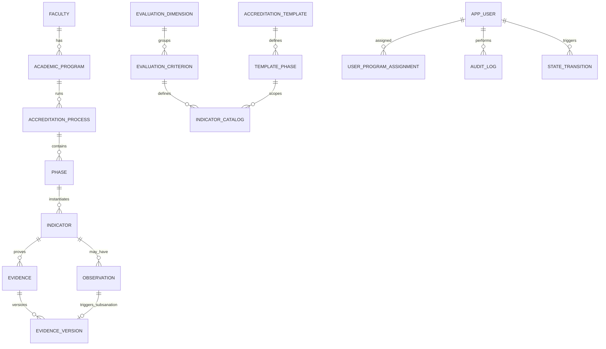

# Modelo de datos funcional — SIGESA / AcredIA

## Control de versión

| Campo | Valor |
|-------|-------|
| **Versión** | Dorada v1.0 |
| **Timestamp** | `2026-05-16T18:30:00-04:00` |
| **Vista** | Lógica / de dominio (FSD) |
| **Modelo físico (DTI)** | [`docs/05_dti/modelo_datos.md`](../05_dti/modelo_datos.md) |
| **DDL** | [`docs/05_dti/ddl_sigesa_append_only.sql`](../05_dti/ddl_sigesa_append_only.sql) |
| **Glosario** | [`glosario.md`](glosario.md) |

> Este documento describe entidades, relaciones y validaciones desde la **especificación funcional**. La implementación PostgreSQL append-only está en el DTI.

---

## 1. Principios

| Principio | Regla funcional |
|-----------|-----------------|
| Append-only | Sin borrado físico de Evidencia aprobada; subsanación = nueva `EvidenceVersion` |
| Trazabilidad | `version`, `supersedesVersion`, `observationId`, `createdBy`, `createdAt` |
| Taxonomía | CEUB/ARCU-SUR: Fase → Dimensión → Criterio → Indicador → Evidencia |
| Aislamiento [CC] | Datos acotados a `academicProgramId` del coordinador |
| Un Proceso activo | Por carrera + modalidad + periodo (FSD-BR-08) |

---

## 2. Diagrama ER lógico

---

## 3. Entidades y atributos core

### 3.1 Maestros institucionales

| Entidad (EN) | ES | Atributos clave | Notas |
|--------------|-----|-----------------|-------|
| `Faculty` | Facultad | `id`, `code`, `name` | Dato maestro UMSS |
| `AcademicProgram` | Carrera | `id`, `facultyId`, `code`, `name`, `status` | Unidad de acreditación |
| `AppUser` | Usuario | `id`, `email`, `displayName`, `status` | Email `@umss.edu.bo` |
| `UserProgramAssignment` | Asignación rol | `userId`, `programId`, `roleCode` | CC → una carrera; TD/JD alcance configurable |

### 3.2 Plantilla normativa

| Entidad | Atributos clave | Notas |
|---------|-----------------|-------|
| `AccreditationTemplate` | `modality` (CEUB \| ARCU-SUR), `version`, `status` | Activada por [JD] |
| `TemplatePhase` | `templateId`, `order`, `name`, `normativeDeadline` | No editable por [CC] (BR-17) |
| `EvaluationDimension` | `templateId`, `code`, `name` | Agrupa criterios |
| `EvaluationCriterion` | `dimensionId`, `code`, `description` | |
| `IndicatorCatalog` | `templatePhaseId`, `criterionId`, `code` | Definición en plantilla |

### 3.3 Proceso en ejecución

| Entidad | Atributos clave | Notas |
|---------|-----------------|-------|
| `AccreditationProcess` | `programId`, `templateId`, `managementYear`, `status` | EN_PROCESO \| ACREDITADO \| VENCIDO |
| `Phase` | `processId`, `templatePhaseId`, `status` | ABIERTA \| COMPLETADA |
| `Indicator` | `phaseId`, `catalogId`, `status` | Máquina de estados §4 |

### 3.4 Evidencia y auditoría

| Entidad | Atributos clave | Notas |
|---------|-----------------|-------|
| `Evidence` | `indicatorId`, `currentVersion` | Cabecera estable |
| `EvidenceVersion` | `evidenceId`, `versionNumber`, `contentHash`, `isCurrent`, `observationId`, `supersedesVersion` | Append-only |
| `Observation` | `indicatorId`, `justification`, `createdBy`, `status` | Origen de subsanación |
| `StateTransition` | `entityType`, `entityId`, `fromStatus`, `toStatus`, `actorId`, `role` | Log transiciones |
| `AuditLog` | `action`, `actorId`, `entityType`, `entityId`, `payload` | Login, DELETE denegado, etc. |
| `NotificationOutbox` | `eventType`, `recipientId`, `payload`, `sentAt` | Patrón outbox |
| `PublicationSnapshot` | `programId`, `publishedAt`, `publishedBy` | Portal [P] |

---

## 4. Máquina de estados — `Indicator.status`

| Estado | Descripción |
|--------|-------------|
| `PENDIENTE` | Sin Evidencia cargada |
| `SUBIDO` | Evidencia en revisión [TD] |
| `OBSERVADO` | Rechazado con observación activa |
| `SUBSANADO` | Nueva versión enviada; pendiente re-revisión |
| `APROBADO` | Validación [TD] completa |

Transiciones válidas: ver [`FSD.md`](FSD.md) §4.1 y `team/alexAlvarez/docs/context/04_state_machine.md`.

---

## 5. Diccionario de validación (campos críticos)

| Entidad | Atributo | Tipo lógico | Obl. | Validación |
|---------|----------|-------------|------|------------|
| `Evidence` | `indicatorId` | UUID | sí | Existe; carrera ∈ alcance [CC] |
| `EvidenceVersion` | `contentHash` | string(64) | sí | SHA-256 del blob |
| `EvidenceVersion` | `observationId` | UUID | cond. | Obligatorio si subsanación |
| `Indicator` | `status` | enum | sí | Valores §4; sin PATCH genérico desde cliente |
| `Observation` | `justification` | text | sí | min 20 caracteres (configurable) |
| `AppUser` | `email` | string | sí | Dominio `@umss.edu.bo` |
| `AuditLog` | `action` | string | sí | Catálogo cerrado (`AUDIT_LOGIN`, `AUDIT_DELETE_DENIED`, …) |

**Prohibido:** `isDeleted` / `deletedAt` en `Evidence` o `EvidenceVersion` aprobados.

---

## 6. Mapeo lógico → físico (DTI)

| Entidad lógica | Tabla física |
|----------------|--------------|
| `Faculty` | `faculty` |
| `AcademicProgram` | `academic_program` |
| `AppUser` | `app_user` |
| `AccreditationProcess` | `accreditation_process` |
| `Phase` | `phase` |
| `Indicator` | `indicator` |
| `Evidence` | `evidence` |
| `EvidenceVersion` | `evidence_version` |
| `Observation` | `observation` |
| `StateTransition` | `state_transition` |
| `AuditLog` | `audit_log` |

Detalle de columnas, índices y FK: ver DTI §2–3.

---

## 7. Reglas de datos vinculadas

| Regla FSD | Impacto en modelo |
|-----------|-------------------|
| FSD-BR-02 | Sin DELETE en `evidence_version` aprobada |
| FSD-BR-06 | FK `observation_id` en versión subsanatoria |
| FSD-BR-08 | Índice único parcial `accreditation_process` activo |
| FSD-BR-09 | Filtro `program_id` en queries [CC] |

---

## Registro de cambios

| Versión | Fecha | Cambio |
|---------|-------|--------|
| Dorada v1.0 | 2026-05-16 | Vista funcional extraída de FSD.md; enlace a DTI |
