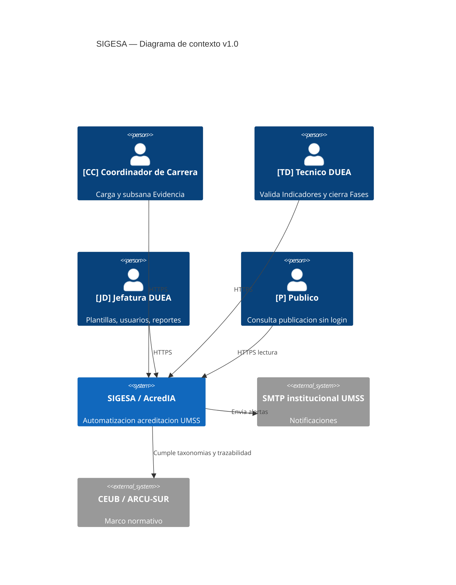
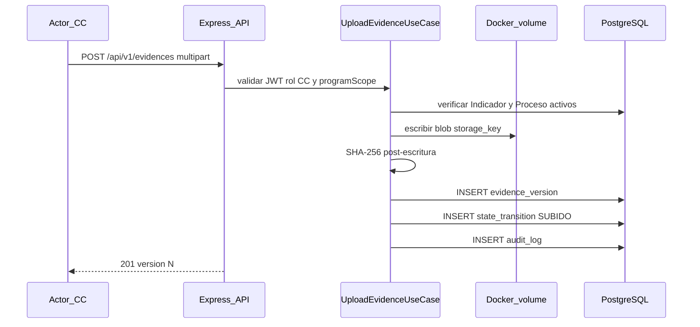
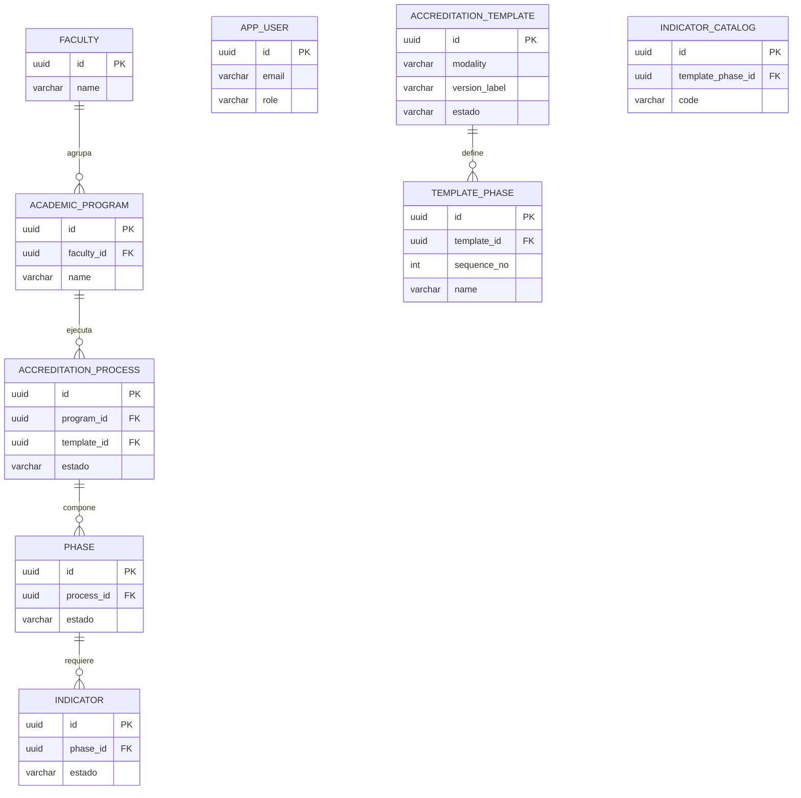
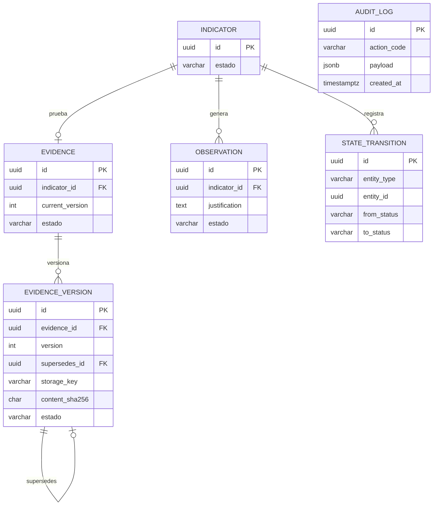

# Documento de Diseño Técnico e Infraestructura (DTI) — SIGESA / AcredIA

## Control de versión

| Campo | Valor |
|-------|-------|
| **Versión** | Dorada v1.0 (borrador compilado) |
| **Timestamp** | `2026-05-17T12:00:00-04:00` |
| **Contrato** | [PC-SIG-13] Arquitecto de Infraestructura y DTI |
| **Skills** | `sigesa-generacion-documentos-tecnicos` · `sigesa-auditor-trazabilidad-dti` · `sigesa-db-architect-append-only` |
| **Gate trazabilidad** | [`docs/09_trazabilidad/report_findings.md`](../09_trazabilidad/report_findings.md) — **APTO** |
| **Estado** | En revisión — primera versión integrada |

### Fuentes canónicas de negocio

| Artefacto | Ruta |
|-----------|------|
| BRD | [`docs/01_brd/BRD.md`](../01_brd/BRD.md) |
| MRD | [`docs/02_mrd/MRD.md`](../02_mrd/MRD.md) |
| PRD | [`docs/03_prd/PRD.md`](../03_prd/PRD.md) |
| FSD | [`docs/04_fsd/FSD.md`](../04_fsd/FSD.md) |
| NFR | [`docs/05_nfr/NFR_ISO25010.md`](../05_nfr/NFR_ISO25010.md) |
| Glosario | [`context/03_domain_glossary.md`](../../context/03_domain_glossary.md) |
| Máquina de estados | [`team/alexAlvarez/docs/context/04_state_machine.md`](../../team/alexAlvarez/docs/context/04_state_machine.md) |

### Fuentes de trabajo equipo (consolidadas en esta versión)

| Equipo | DTI / ADR |
|--------|-----------|
| AcredIA (Aylen) | [`team/aylenGonzales/09_dti/DTI_v1.md`](../../team/aylenGonzales/09_dti/DTI_v1.md) · `09_dti/adr/ADR-001…006` |
| AcredIA (Boris) | [`team/borisAngulo/docs/09_dti/DTI_v1.md`](../../team/borisAngulo/docs/09_dti/DTI_v1.md) |

> **Regla de oro:** si una decisión arquitectónica significativa no está en este DTI o en un [ADR de `docs/05_dti/adrs/`](adrs/README.md) / [`docs/adr/`](../adr/README.md), no existe para implementación v1.0.

---

## 1. Resumen ejecutivo

SIGESA es el sistema de **automatización** del ciclo de acreditación CEUB/ARCU-SUR en la UMSS. El DTI traduce el FSD Dorado en arquitectura desplegable: **monolito modular** (SPA React + API Node.js 20 + Express 4 + PostgreSQL 16 + volumen Docker para blobs), con **Evidencia append-only**, **RBAC** para [CC], [TD] y [JD], y bitácora **solo inserción**. No se prescriben microservicios ni almacenamiento cloud de pago en v1.0 (presupuesto institucional $0).

---

## 2. Vista lógica — contexto y contenedores

### 2.1 C4 — Nivel 1 (contexto)



### 2.2 C4 — Nivel 2 (contenedores)

```mermaid
C4Container
  title SIGESA — Contenedores v1.0
  Person(user, "Usuarios UMSS y publico", "")
  Container(web, "Frontend SPA", "React 18", "UI stateless")
  Container(api, "API Backend", "Node.js 20 + Express 4", "REST JWT RBAC")
  ContainerDb(db, "PostgreSQL 16", "PostgreSQL", "Transaccional + FTS + audit_log")
  Container(vol, "Volumen evidencias", "Docker named volume", "Blobs versionados")
  Container(worker, "Worker notificaciones", "Node cron", "Cola notification_outbox")
  Rel(user, web, "HTTPS")
  Rel(web, api, "JSON /api/v1")
  Rel(api, db, "TCP pg")
  Rel(api, vol, "storage_key read/write")
  Rel(api, worker, "enqueue")
  Rel(worker, smtp, "SMTP", "async")
```

**Decisiones:** ver [ADR_002](adrs/ADR_002_monolito_modular.md), [ADR_006](adrs/ADR_006_postgresql_16.md), [ADR_004](adrs/ADR_004_almacenamiento_blobs_docker.md), [ADR_009](adrs/ADR_009_backend_nodejs_express.md).

### 2.3 Flujo crítico — carga de Evidencia (FSD-UC-004)



**Invariante:** ningún paso ejecuta `DELETE` sobre blob ni fila de versión aprobada ([ADR_001](adrs/ADR_001_append_only_evidencia.md)).

---

## 3. Arquitectura interna (hexagonal)

| Capa | Contenido | Ubicación sugerida en código |
|------|-----------|------------------------------|
| Dominio | Agregados, reglas FSD-BR-*, máquina de estados | `backend/src/domain/` |
| Puertos entrada | Casos de uso (upload, approve, close phase) | `backend/src/domain/port/in/` |
| Puertos salida | Repositorios, FileStoragePort, AuditLogPort | `backend/src/domain/port/out/` |
| Adaptadores entrada | Controllers Express, middleware JWT | `backend/src/adapter/in/http/` |
| Adaptadores salida | `pg`, volumen FS, Nodemailer | `backend/src/adapter/out/` |

| Puerto | ADR / UC |
|--------|----------|
| `FileStoragePort` | ADR_004 · FSD-UC-004 |
| `AuditLogPort` | ADR_005 · transversal |
| `AuthPort` | ADR_003 · FSD-UC-001 |
| JWT middleware | ADR_007 · todos los endpoints privados |

---

## 4. Modelo físico de datos

Detalle completo: [`modelo_datos.md`](modelo_datos.md). DDL ejecutable: [`ddl_sigesa_append_only.sql`](ddl_sigesa_append_only.sql).

### 4.1 ER — Maestros y plantilla normativa



Taxonomías CEUB/ARCU-SUR: [ADR_008](adrs/ADR_008_taxonomias_ceub_arcu.md).

### 4.2 ER — Evidencia, observaciones y auditoría



**Prohibido en esquemas SIGESA:** columnas residuales de importación (`Unnamed: 0`, `gtin`, etc.) y `deleted_at` / `is_deleted` en tablas normativas.

---

## 5. Contratos de integración (API)

Especificación lógica completa: [`docs/04_fsd/api_contracts.md`](../04_fsd/api_contracts.md). OpenAPI físico: pendiente `docs/05_dti/openapi.yaml`.

### 5.1 Convenciones

| Aspecto | Valor |
|---------|-------|
| Base URL | `/api/v1` |
| Auth | `Authorization: Bearer {jwt}` |
| RBAC | Header documental `x-allowed-roles` por endpoint; middleware valida `role` y `programScope` del token |
| Estados | El cliente **no** envía `estado` en body; el backend aplica la máquina de estados |

### 5.2 Endpoints críticos y roles

| ID | Método | Ruta | Roles | UC | Notas |
|----|--------|------|-------|-----|-------|
| API-AUTH-01 | POST | `/auth/login` | — | UC-001 | Dominio `@umss.edu.bo` |
| API-EVD-01 | POST | `/evidences` | [CC] | UC-004 | multipart; hash SHA-256 |
| API-EVD-02 | GET | `/evidences/search` | [CC], [TD] | UC-007 | [CC] filtrado por carrera |
| API-EVD-04 | DELETE | `/evidences/{id}` | [CC], [TD] | UC-005 | **409** si aprobado |
| API-EVD-05 | POST | `/evidences/{id}/versions` | [CC] | UC-006 | subsanación |
| API-WF-01 | PATCH | `/indicators/{id}/reject` | [TD] | UC-008 | justificación obligatoria |
| API-WF-02 | PATCH | `/indicators/{id}/approve` | [TD] | UC-009 | semántico, no PATCH genérico |
| API-WF-03 | PATCH | `/phases/{id}/close` | [TD] | UC-010 | 409 si pendientes |

### 5.3 Matriz RBAC resumida

| Recurso | [CC] | [TD] | [JD] | [P] |
|---------|------|------|------|-----|
| Evidencia de su carrera | CR (versiones) | R + validar | R | — |
| Indicadores / Fases | R | Aprobar / observar / cerrar | R | — |
| Plantillas / usuarios | — | R limitado | CRUD normativo | — |
| Portal publicado | — | — | publicar | R |

Autenticación: [ADR_003](adrs/ADR_003_adapter_autenticacion.md) + [ADR_007](adrs/ADR_007_jwt_rbac.md).

---

## 6. Registro de decisiones arquitectónicas

| DTI | Canónico | Tema |
|-----|----------|------|
| [ADR_001](adrs/ADR_001_append_only_evidencia.md) | ADR-0001 | Versionado Evidencia |
| [ADR_002](adrs/ADR_002_monolito_modular.md) | ADR-0002 | Monolito modular |
| [ADR_003](adrs/ADR_003_adapter_autenticacion.md) | ADR-0003 | Auth local → LDAP |
| [ADR_004](adrs/ADR_004_almacenamiento_blobs_docker.md) | ADR-0004 | Blobs Docker |
| [ADR_005](adrs/ADR_005_audit_log_postgresql.md) | ADR-0005 | audit_log append-only |
| [ADR_006](adrs/ADR_006_postgresql_16.md) | ADR-0006 | PostgreSQL 16 |
| [ADR_007](adrs/ADR_007_jwt_rbac.md) | ADR-0007 | JWT + RBAC |
| [ADR_008](adrs/ADR_008_taxonomias_ceub_arcu.md) | ADR-0008 | Taxonomías en BD |
| [ADR_009](adrs/ADR_009_backend_nodejs_express.md) | ADR-0009 | Node + Express |

Índice y reglas de edición: [`adrs/README.md`](adrs/README.md).

---

## 7. Despliegue y operaciones (v1.0)

| Componente | Imagen / artefacto | Notas |
|------------|-------------------|-------|
| `sigesa-web` | build estático React | Nginx o servido por reverse proxy |
| `sigesa-api` | `node:20-alpine` | Health `GET /health` |
| `sigesa-db` | `postgres:16` | Volume `pg_data` |
| `evidencias_data` | named volume | `/data/evidencias/` — ADR_004 |

Respaldo diario: `pg_dump` + copia del volumen de evidencias (RBN-14 / MOD-AUDIT). TLS 1.3 en reverse proxy institucional (NFR-003).

---

## 8. NFRs y trazabilidad

| Referencia | Ubicación |
|------------|-----------|
| NFR ISO 25010 | [`docs/05_nfr/NFR_ISO25010.md`](../05_nfr/NFR_ISO25010.md) |
| Matriz Dorada | [`docs/09_trazabilidad/matriz_trazabilidad.md`](../09_trazabilidad/matriz_trazabilidad.md) |
| Métricas AI-SDLC | [`docs/09_trazabilidad/metricas_ai_sdlc.md`](../09_trazabilidad/metricas_ai_sdlc.md) |

NFRs con impacto directo en este DTI: NFR-001 (latencia búsqueda), NFR-003 (TLS), NFR-004 (no repudio / audit), NFR-017 (inmutabilidad Evidencia).

---

## 9. Pendientes v1.1+

| Ítem | Acción |
|------|--------|
| `openapi.yaml` | Generar desde `api_contracts.md` |
| LDAP / SSO UMSS | Implementar `LdapAuthAdapter` (ADR_003) |
| Object storage S3-compatible | Evaluar migración desde volumen Docker (ADR_004 §6) |
| Sincronizar `docs/adr/ADR-0001` y `ADR-0002` | Ampliar narrativa canónica al nivel de `docs/05_dti/adrs/` |

---

## 10. Historial

| Versión | Fecha | Cambio |
|---------|-------|--------|
| v1.0-borrador | 2026-05-17 | Primera compilación DTI + carpeta `adrs/` desde `docs/` canónico y `team/aylenGonzales/09_dti/` |
