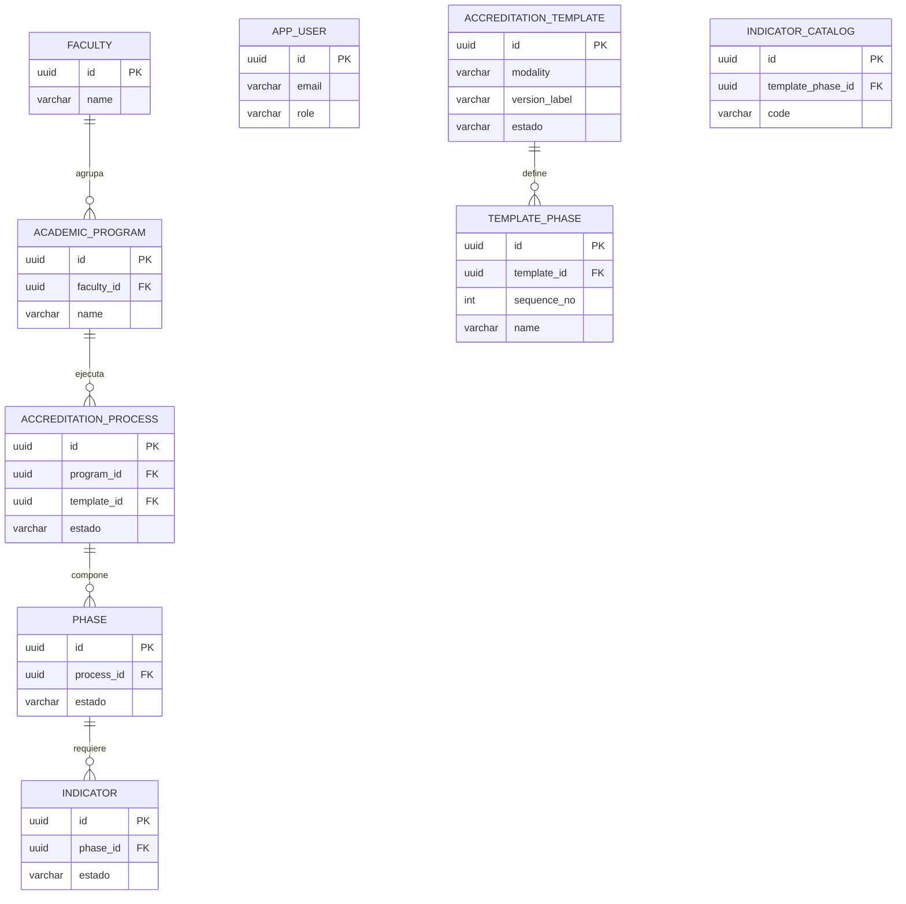
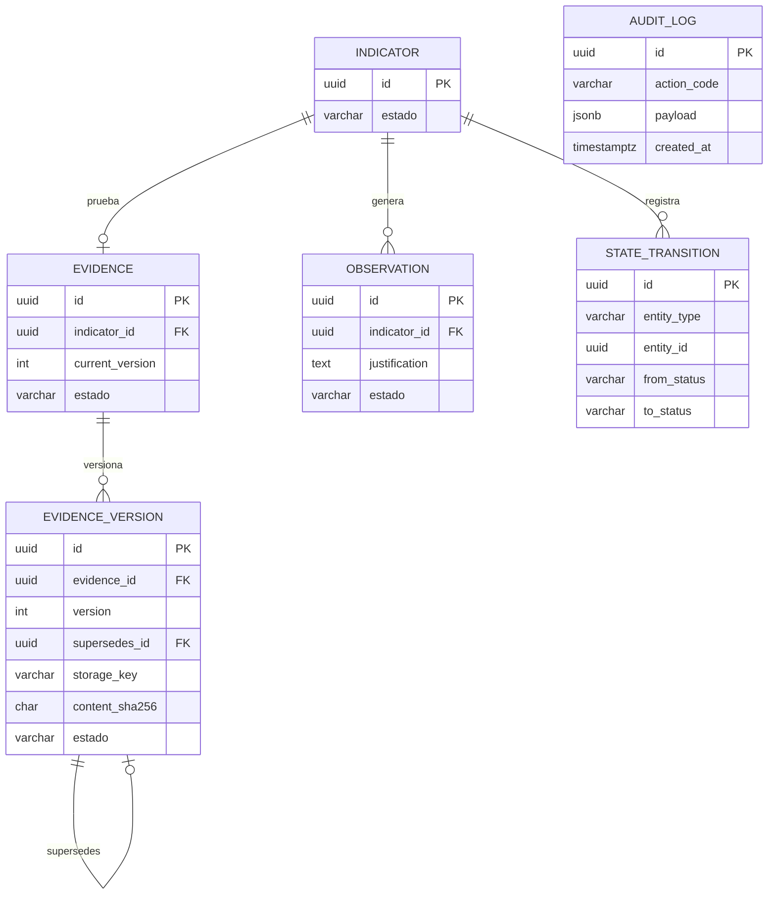

# Documento de Diseño Técnico e Infraestructura (DTI) — SIGESA / AcredIA

## Control de versión

| Campo | Valor |
|-------|-------|
| **Versión** | Dorada v1.0 (borrador compilado) |
| **Timestamp** | `2026-05-17T18:00:00-04:00` |
| **Contrato** | [PC-SIG-13] Arquitecto de Infraestructura y DTI |
| **Skills** | [`dti-author`](dti-author.md) · `sigesa-generacion-documentos-tecnicos` · `sigesa-auditor-trazabilidad-dti` · `sigesa-db-architect-append-only` |
| **Plantilla estructura** | [`templates/dti.md`](../../templates/dti.md) (§0–§21) |
| **Gate trazabilidad** | [`docs/09_trazabilidad/report_findings.md`](../09_trazabilidad/report_findings.md) — **APTO** |
| **Estado** | En revisión — primera versión integrada |

### Fuentes canónicas de negocio

| Artefacto | Ruta |
|-----------|------|
| BRD | [`docs/01_brd/BRD.md`](../01_brd/BRD.md) |
| MRD | [`docs/02_mrd/MRD.md`](../02_mrd/MRD.md) |
| PRD | [`docs/03_prd/PRD.md`](../03_prd/PRD.md) |
| FSD | [`docs/04_fsd/FSD.md`](../04_fsd/FSD.md) |
| NFR | [`docs/05_nfr/NFR_ISO25010.md`](../05_nfr/NFR_ISO25010.md) |
| Glosario | [`context/03_domain_glossary.md`](../../context/03_domain_glossary.md) |
| Máquina de estados | [`team/alexAlvarez/docs/context/04_state_machine.md`](../../team/alexAlvarez/docs/context/04_state_machine.md) |
| **Diagramas C4 (fuente única)** | [`docs/07_diagramas/`](../07_diagramas/README.md) — [`diag-06-c4-contexto-sistema.mmd`](../07_diagramas/diag-06-c4-contexto-sistema.mmd) · [`diag-07-c4-contenedores-sistema.mmd`](../07_diagramas/diag-07-c4-contenedores-sistema.mmd) |

### Fuentes de trabajo equipo (consolidadas en esta versión)

| Equipo | DTI / ADR |
|--------|-----------|
| AcredIA (Aylen) | [`team/aylenGonzales/09_dti/DTI_v1.md`](../../team/aylenGonzales/09_dti/DTI_v1.md) · `09_dti/adr/ADR-001…006` |
| AcredIA (Boris) | [`team/borisAngulo/docs/09_dti/DTI_v1.md`](../../team/borisAngulo/docs/09_dti/DTI_v1.md) |

> **Regla de oro:** si una decisión arquitectónica significativa no está en este DTI o en un [ADR de `docs/05_dti/adrs/`](adrs/README.md) / [`docs/adr/`](../adr/README.md), no existe para implementación v1.0.

---

## 1. Resumen ejecutivo

SIGESA es el sistema de **automatización** del ciclo de acreditación CEUB/ARCU-SUR en la UMSS. El DTI traduce el FSD Dorado en arquitectura desplegable: **monolito modular** (SPA React + API Node.js 20 + Express 4 + PostgreSQL 16 + volumen Docker para blobs), con **Evidencia append-only**, **RBAC** para [CC], [TD] y [JD], y bitácora **solo inserción**. No se prescriben microservicios ni almacenamiento cloud de pago en v1.0 (presupuesto institucional $0).

---

<!-- avance: iteración 1 -->
## 2. Vistas del DTI (Richardson, Cap. 1)

### 2.0 Checklist por vista

| Sección | Estado | ¿Se agrega/mejora en esta iteración? |
|---|---|---|
| 2.1 Logical View | ✅ | Se incorporan decisiones de resiliencia/particionado en dependencias e integración, conectadas a contenedores SIGESA. |
| 2.2 Process View | ✅ | Se modelan puntos de falla y recuperación en flujos de carga/cierre/notificación (circuit breaker) y cómo se particiona trabajo (consistent hashing) a nivel de “orquestación”. |
| 2.3 Development View | ✅ | Se especifican puntos de aplicación de circuit breaker/colas/outbox dentro de puertos y adaptadores hexagonales SIGESA. |
| 2.4 Physical View | ✅ | Se describe el “límite físico” donde se aplican los patrones: reverse proxy, API, worker notificaciones y dependencias externas (SMTP/IdP). |
| 2.5 Scenarios | ✅ | Se agregan escenarios concretos del dominio (upload evidencia, approve/reject, cierre de fase, notificaciones) con decisiones y comportamiento esperado. |

---

<!-- avance: iteración 1 -->
## 2.1 Logical View (vista lógica)

SIGESA en v1.0 es un **monolito modular**: un solo proceso lógico (API) y módulos internos (dominio + adaptadores). La vista lógica se describe con:

- **Contexto**: Actores [CC], [TD], [JD], [P] y externos (IdP UMSS, SMTP, marco CEUB/ARCU-SUR).
- **Contenedores lógicos**: Frontend SPA, API Backend, PostgreSQL, volumen de evidencias versionadas, worker de notificaciones, motor de reportes PDF.
- **Integraciones críticas (puntos de fallo)**:
  - **Auth** contra IdP/infra UMSS (o mecanismo local LDAP según ADR_003).
  - **Notificaciones** por SMTP institucional.

**Circuit Breaker (aplicación lógica)**
- Se aplica alrededor de llamadas a **dependencias externas** (IdP UMSS y SMTP). Para SIGESA, el “fallback” no modifica evidencia: la operación principal (p.ej. `POST /api/v1/evidences`) continúa usando append-only en BD/volumen; solo se afecta la entrega de notificación/reportes asíncronos.

**Consistent Hashing (aplicación lógica)**
- Se define como estrategia de **asignación estable de trabajo** del worker notificaciones: si SIGESA se escala a múltiples instancias de worker, la clave lógica es `program_id + indicator_id` (o `evidence_version_id` cuando corresponda) para que el “mismo” caso caiga consistentemente en la misma partición/worker.

---

<!-- avance: iteración 1 -->
## 2.2 Process View (vista por procesos)

La vista de procesos se aterriza en flujos ya documentados, con puntos explícitos donde los patrones mejoran resiliencia y escalabilidad:

1) **Carga/Versionado de Evidencia (FSD-UC-004)**
- Secuencia (resumen): API valida JWT/RBAC → dominio verifica estado del proceso/indicador → escribe blob (versionado SHA-256) → inserta `evidence_version` + transición de estado + `audit_log`.
- **Circuit Breaker**: protege llamadas a dependencias externas *solo si existen* dentro del flujo (en v1.0, el flujo crítico de evidencia no depende de SMTP/IdP para escribir append-only; el circuit breaker se usa en “producción de eventos” para notificaciones/reporte).

2) **Aprobación/Rechazo/Observaciones**
- Estados y transiciones se registran vía `STATE_TRANSITION` y `audit_log` append-only.
- **Comunicación asíncrona**: generación de notificaciones/reportes desde outbox y worker.

3) **Notificaciones (worker + outbox)**
- El worker consume `notification_outbox` y envía email vía SMTP.
- **Circuit Breaker (aquí es donde aporta más)**: ante errores repetidos de SMTP, el circuit breaker evita saturar el sistema; el mensaje permanece para reintentos controlados (sin borrar evidencia).

4) **Particionado estable (consistent hashing) en colas internas**
- Si hay N workers, el particionado estable reduce reordenamientos y reintentos inconsistentes.

---

<!-- avance: iteración 1 -->
## 2.3 Development View (vista de desarrollo)

DTI sigue arquitectura **hexagonal** (puertos/adaptadores). Los patrones se ubican en capas específicas:

- **Puertos de salida**
  - `AuditLogPort` (append-only, no negociable por resiliencia)
  - `FileStoragePort` (volumen/blobs versionados)
  - (nuevo requisito de ingeniería, aunque v1.0 sea monolito): `NotificationDeliveryPort` (adaptador SMTP) con circuit breaker.

- **Adaptadores**
  - `backend/src/adapter/out/` implementa delivery y reportes.
  - Aplicación del circuit breaker se hace *en el adaptador* SMTP/IdP (no en el dominio), manteniendo invariantes de evidencia.

- **Consistent Hashing**
  - En el adaptador del worker, antes de despachar trabajos, se calcula `partition_key` desde IDs de dominio y se enruta a la partición/consumer correspondiente.

---

<!-- avance: iteración 1 -->
## 2.4 Physical View (vista física / despliegue)

Contenedores físicos en v1.0:

- `sigesa-web` (SPA)
- `sigesa-api` (Node 20 + Express 4)
- `sigesa-db` (PostgreSQL 16)
- `evidencias_data` (volumen Docker)
- Worker notificaciones (cron/worker)

Aplicación física de patrones:

- **Circuit Breaker**: en el proceso donde ocurre la llamada externa (worker para SMTP; API/adaptador para IdP/LDAP). Límites:
  - No se protege escritura append-only (BD/volumen), se protege la *entrega*.
- **Consistent Hashing**: solo tiene efecto si existen múltiples instancias de worker/API; en v1.0 se documenta como habilitador para escalamiento horizontal sin re-procesar masivamente.

---

<!-- avance: iteración 1 -->
## 2.5 Scenarios (escenarios del sistema)

1) **S1 — Subida de evidencia con IdP/SMTP inestable**
- Entrada: [CC] hace `POST /api/v1/evidences`.
- Comportamiento esperado:
  - La operación principal no depende de SMTP; se conserva append-only (no DELETE).
  - Si hay confirmación/notificación posterior vía outbox, el delivery usa circuit breaker (evita saturar SMTP) y reintenta según política.

2) **S2 — Aprobación de indicador → notificación diferida**
- Entrada: [TD] hace `PATCH /indicators/{id}/approve`.
- Comportamiento esperado:
  - Se registra transición y audit.
  - Se genera `notification_outbox`.
  - Worker entrega con circuit breaker sobre SMTP.
  - Si hay varios workers: consistent hashing por `program_id + indicator_id` minimiza saltos entre instancias.

3) **S3 — Cierre de fase con carga concurrente**
- Entrada: [TD] `PATCH /phases/{id}/close`.
- Comportamiento esperado:
  - Si hay 409 por pendientes, se responde sin mutaciones destructivas.
  - Las notificaciones derivadas siguen outbox + worker.

4) **S4 — Reportes PDF (FSD-UC-014) bajo fallo parcial**
- Entrada: solicitud de reporte.
- Comportamiento esperado:
  - El motor de reportes se aisla como “tarea” (si aplica) y usa circuit breaker para dependencias externas (si existen en el camino).
  - La evidencia base permanece consistente por append-only.

---

## 3. Arquitectura interna (hexagonal)

| Capa | Contenido | Ubicación sugerida en código |
|------|-----------|------------------------------|
| Dominio | Agregados, reglas FSD-BR-*, máquina de estados | `backend/src/domain/` |
| Puertos entrada | Casos de uso (upload, approve, close phase) | `backend/src/domain/port/in/` |
| Puertos salida | Repositorios, FileStoragePort, AuditLogPort | `backend/src/domain/port/out/` |
| Adaptadores entrada | Controllers Express, middleware JWT | `backend/src/adapter/in/http/` |
| Adaptadores salida | `pg`, volumen FS, Nodemailer | `backend/src/adapter/out/` |

| Puerto | ADR / UC |
|--------|----------|
| `FileStoragePort` | ADR_004 · FSD-UC-004 |
| `AuditLogPort` | ADR_005 · transversal |
| `AuthPort` | ADR_003 · FSD-UC-001 |
| JWT middleware | ADR_007 · todos los endpoints privados |

---

## 4. Modelo físico de datos

Detalle completo: [`modelo_datos.md`](modelo_datos.md). DDL ejecutable: [`ddl_sigesa_append_only.sql`](ddl_sigesa_append_only.sql).

### 4.1 ER — Maestros y plantilla normativa

Taxonomías CEUB/ARCU-SUR: [ADR_008](adrs/ADR_008_taxonomias_ceub_arcu.md).

### 4.2 ER — Evidencia, observaciones y auditoría

**Prohibido en esquemas SIGESA:** columnas residuales de importación (`Unnamed: 0`, `gtin`, etc.) y `deleted_at` / `is_deleted` en tablas normativas.

---

## 5. Contratos de integración (API)

Especificación lógica completa: [`docs/04_fsd/api_contracts.md`](../04_fsd/api_contracts.md). OpenAPI físico: pendiente `docs/05_dti/openapi.yaml`.

### 5.1 Convenciones

| Aspecto | Valor |
|---------|-------|
| Base URL | `/api/v1` |
| Auth | `Authorization: Bearer {jwt}` |
| RBAC | Header documental `x-allowed-roles` por endpoint; middleware valida `role` y `programScope` del token |
| Estados | El cliente **no** envía `estado` en body; el backend aplica la máquina de estados |

### 5.2 Endpoints críticos y roles

| ID | Método | Ruta | Roles | UC | Notas |
|----|--------|------|-------|-----|-------|
| API-AUTH-01 | POST | `/auth/login` | — | UC-001 | Dominio `@umss.edu.bo` |
| API-EVD-01 | POST | `/evidences` | [CC] | UC-004 | multipart; hash SHA-256 |
| API-EVD-02 | GET | `/evidences/search` | [CC], [TD] | UC-007 | [CC] filtrado por carrera |
| API-EVD-04 | DELETE | `/evidences/{id}` | [CC], [TD] | UC-005 | **409** si aprobado |
| API-EVD-05 | POST | `/evidences/{id}/versions` | [CC] | UC-006 | subsanación |
| API-WF-01 | PATCH | `/indicators/{id}/reject` | [TD] | UC-008 | justificación obligatoria |
| API-WF-02 | PATCH | `/indicators/{id}/approve` | [TD] | UC-009 | semántico, no PATCH genérico |
| API-WF-03 | PATCH | `/phases/{id}/close` | [TD] | UC-010 | 409 si pendientes |

### 5.3 Matriz RBAC resumida

| Recurso | [CC] | [TD] | [JD] | [P] |
|---------|------|------|------|-----|
| Evidencia de su carrera | CR (versiones) | R + validar | R | — |
| Indicadores / Fases | R | Aprobar / observar / cerrar | R | — |
| Plantillas / usuarios | — | R limitado | CRUD normativo | — |
| Portal publicado | — | — | publicar | R |

Autenticación: [ADR_003](adrs/ADR_003_adapter_autenticacion.md) + [ADR_007](adrs/ADR_007_jwt_rbac.md).

---

## 6. Justificación del producto — patrones (1 línea por patrón)

- Circuit Breaker: **SÍ** — aplica a llamadas a dependencias externas (SMTP/IdP) en worker/adaptadores para evitar cascada de fallos y mantener invariantes append-only; ver **§3.5 / §3.5.1**.
- Consistent Hashing: **SÍ** — aplica como estrategia de asignación estable del trabajo del worker (partición por `program_id+indicator_id`) si SIGESA escala horizontalmente; ver **§9**.
- Comunicación asíncrona: **SÍ** — ya existe vía `notification_outbox` + worker de notificaciones, desacoplando el tiempo de respuesta del usuario del delivery; ver **§22**.
- Patrón Saga: **NO** — v1.0 mantiene consistencia por transacciones locales y append-only (sin coreografía de transacciones distribuidas); ver **§23**.

---

## 7. Registro de decisiones arquitectónicas

| DTI | Canónico | Tema |
|-----|----------|------|
| [ADR_001](adrs/ADR_001_append_only_evidencia.md) | ADR-0001 | Versionado Evidencia |
| [ADR_002](adrs/ADR_002_monolito_modular.md) | ADR-0002 | Monolito modular |
| [ADR_003](adrs/ADR_003_adapter_autenticacion.md) | ADR-0003 | Auth local → LDAP |
| [ADR_004](adrs/ADR_004_almacenamiento_blobs_docker.md) | ADR-0004 | Blobs Docker |
| [ADR_005](adrs/ADR_005_audit_log_postgresql.md) | ADR-0005 | audit_log append-only |
| [ADR_006](adrs/ADR_006_postgresql_16.md) | ADR-0006 | PostgreSQL 16 |
| [ADR_007](adrs/ADR_007_jwt_rbac.md) | ADR-0007 | JWT + RBAC |
| [ADR_008](adrs/ADR_008_taxonomias_ceub_arcu.md) | ADR-0008 | Taxonomías en BD |
| [ADR_009](adrs/ADR_009_backend_nodejs_express.md) | ADR-0009 | Node + Express |

Índice y reglas de edición: [`adrs/README.md`](adrs/README.md).

---

## 8. Despliegue y operaciones (v1.0)

| Componente | Imagen / artefacto | Notas |
|------------|-------------------|-------|
| `sigesa-web` | build estático React | Nginx o servido por reverse proxy |
| `sigesa-api` | `node:20-alpine` | Health `GET /health` |
| `sigesa-db` | `postgres:16` | Volume `pg_data` |
| `evidencias_data` | named volume | `/data/evidencias/` — ADR_004 |

Respaldo diario: `pg_dump` + copia del volumen de evidencias (RBN-14 / MOD-AUDIT). TLS 1.3 en reverse proxy institucional (NFR-003).

---

## 9. NFRs y trazabilidad

| Referencia | Ubicación |
|------------|-----------|
| NFR ISO 25010 | [`docs/05_nfr/NFR_ISO25010.md`](../05_nfr/NFR_ISO25010.md) |
| Matriz Dorada | [`docs/09_trazabilidad/matriz_trazabilidad.md`](../09_trazabilidad/matriz_trazabilidad.md) |
| Métricas AI-SDLC | [`docs/09_trazabilidad/metricas_ai_sdlc.md`](../09_trazabilidad/metricas_ai_sdlc.md) |

NFRs con impacto directo en este DTI: NFR-001 (latencia búsqueda), NFR-003 (TLS), NFR-004 (no repudio / audit), NFR-017 (inmutabilidad Evidencia).

---

## 10. Pendientes v1.1+

| Ítem | Acción |
|------|--------|
| `openapi.yaml` | Generar desde `api_contracts.md` |
| LDAP / SSO UMSS | Implementar `LdapAuthAdapter` (ADR_003) |
| Object storage S3-compatible | Evaluar migración desde volumen Docker (ADR_004 §6) |
| Sincronizar `docs/adr/ADR-0001` y `docs/adr/ADR-0002` | Ampliar narrativa canónica al nivel de `docs/05_dti/adrs/` |

---

## 11. Historial

| Versión | Fecha | Cambio |
|---------|-------|--------|
| v1.0-borrador | 2026-05-17 | Primera compilación DTI + carpeta `adrs/` desde `docs/` canónico y `team/aylenGonzales/09_dti/` |

