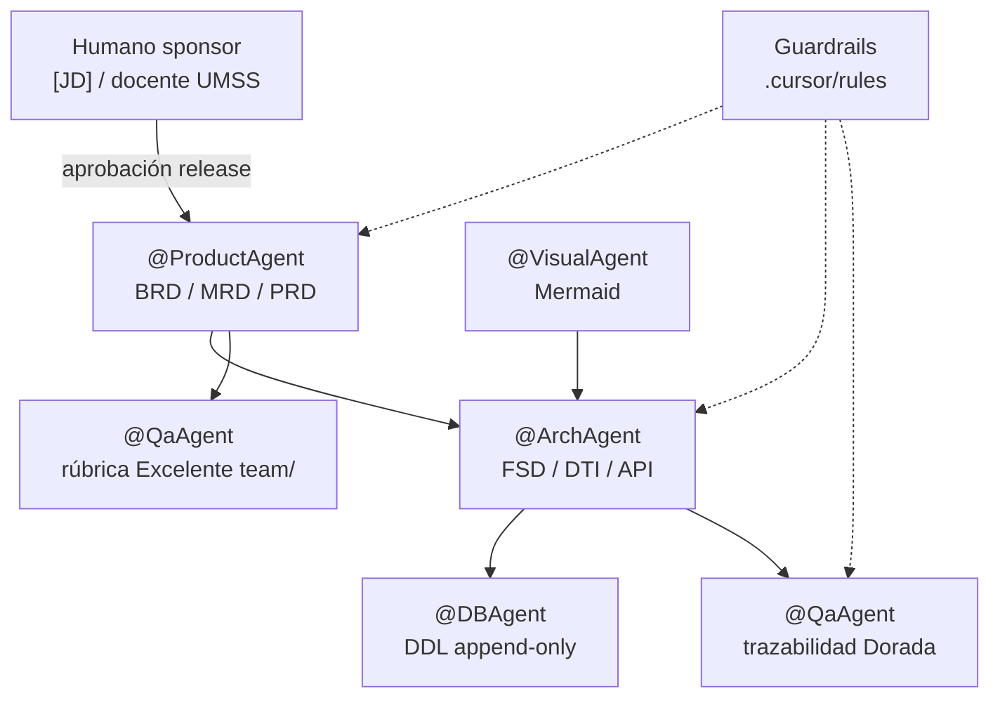

# AGENTS.md — Manifiesto de arquitectura IA y gobernanza SIGESA

## SIGESA / AcredIA · Universidad Mayor de San Simón (UMSS)

| Metadato | Valor |
|----------|-------|
| **Versión** | Dorada v2.2 |
| **Última actualización** | 2026-05-25 |
| **Ubicación** | `docs/08_agents/AGENTS.md` (gobernanza extendida) |
| **Ejecutable para agentes (Cursor)** | **[`AGENTS.md`](../../AGENTS.md) en la raíz del repo** — leer primero |
| **Runtime skills** | `.cursor/skills/` (`.claude` es enlace simbólico a `.cursor`) |
| **Runtime rules** | `.cursor/rules/*.mdc` |
| **Audiencia** | Analistas, arquitectos, desarrolladores, QA, oficiales de cumplimiento DUEA |

> **Convención Defensa Final / curso:** Cursor y Claude Code cargan automáticamente `./AGENTS.md`. Este archivo amplía políticas IA, riesgos y workflow; el stack, comandos y MUST leer DTI viven en la raíz v2.0.

Documentación hermana en esta carpeta: [`skills.md`](skills.md) (catálogo de skills) · [`cursor_rules.md`](cursor_rules.md) (reglas globales).

---

## 1. Propósito

Este manifiesto define el **ecosistema agéntico** que soporta el AI-SDLC de SIGESA: roles, skills, reglas de entorno, políticas de seguridad y controles de riesgo para acreditación CEUB/ARCU-SUR.

La automatización acelera BRD, MRD, PRD, FSD, DTI y trazabilidad en la **Golden Folder** `docs/`, pero **no sustituye** la validación humana de [TD], [JD] ni dictámenes normativos. Toda Evidencia aprobada permanece **append-only**; la IA no debe proponer `DELETE` físico ni columnas residuales de ETL (`Unnamed: 0`, `gtin`) en modelos presentados como definitivos.

---

## 2. Pirámide documental (Golden Folder)

| Capa | Ruta canónica | Agente principal |
|------|---------------|------------------|
| Negocio | [`docs/01_brd/`](../01_brd/BRD.md), [`docs/02_mrd/`](../02_mrd/MRD.md) | @ProductAgent |
| Producto | [`docs/03_prd/`](../03_prd/PRD.md) | @ProductAgent |
| Funcional | [`docs/04_fsd/`](../04_fsd/FSD.md) | @ArchAgent, @QaAgent |
| Técnica | [`docs/05_dti/`](../05_dti/DTI.md), [`docs/05_nfr/`](../05_nfr/NFR_ISO25010.md), [`docs/adr/`](../adr/README.md) | @ArchAgent, @DBAgent |
| Prompt contracts | [`docs/06_prompt_contracts/`](../06_prompt_contracts/prompt_contracts.md) | @ArchAgent |
| Diagramas | [`docs/07_diagramas/`](../07_diagramas/README.md) | @VisualAgent |
| Agentes (este documento) | `docs/08_agents/` | Lead AI Architect |
| Trazabilidad | [`docs/09_trazabilidad/`](../09_trazabilidad/README.md) | @QaAgent |

**Entregas de curso por integrante:** `team/<integrante>/docs/` (orquestadas por regla `03_sigesa_doc_orchestrator`). Antes de promover contenido a `docs/`, usar skill `sigesa-auditoria-excelente-equipo`.

**Contexto transversal:** [`context/03_domain_glossary.md`](../../context/03_domain_glossary.md).

---

## 3. Arquitectura lógica de agentes



**Principio rector:** ningún agente persiste dictámenes de acreditación ni modifica Evidencia aprobada sin flujo humano explícito (véase `docs/04_fsd/reglas_negocio.md`, FSD-BR-02, FSD-BR-11).

---

## 4. Roles de agentes

### 4.1 @ProductAgent

Responsable de la cadena de valor documental inicial. Traduce el problema de dispersión documental DUEA en BRD/MRD/PRD con actores **[CC]**, **[TD]**, **[JD]** y **[P]**, jerarquía Proceso → Fase → Dimensión → Criterio → Indicador → Evidencia, y user stories INVEST con criterios Gherkin. No diseña stack ni DDL; no redefine términos fuera del glosario.

### 4.2 @ArchAgent

Traduce PRD aprobado en FSD descompuesto, NFR ISO 25010, DTI, ADRs y contratos API con RBAC y máquina de estados del Indicador. Para poblar o revisar secciones del DTI canónico usa la skill **`sigesa-dti-author`** (`docs/05_dti/dti-author.md`). Garantiza que endpoints semánticos (`/reject`, `/approve`, `/close`) reemplacen PATCH genéricos de estado. No certifica release sin paso por @QaAgent.

### 4.3 @DBAgent

Modela persistencia **append-only**: `EvidenceVersion` con `supersedesVersion`, sin `is_deleted` en filas aprobadas. Rechaza esquemas importados de planillas con columnas basura. Entregables en `docs/05_dti/ddl_sigesa_append_only.sql` y diagramas ER en `docs/07_diagramas/`.

### 4.4 @QaAgent

Dos frentes: (1) trazabilidad extremo a extremo en `docs/09_trazabilidad/` (matriz, métricas AI-SDLC, `report_findings.md`); (2) auditoría de carpeta `team/<integrante>/` contra rúbrica Excelente. Bloquea cierre Dorado si hay `PRD-US` Must sin `FSD-UC` o terminología prohibida (Etapa, File genérico para Evidencia).

### 4.5 @VisualAgent

Produce diagramas Mermaid modulares en `docs/07_diagramas/` (secuencia, estado, ER, Gantt, C4). No inventa flujos no respaldados por casos de uso; alinea nombres al glosario EN/ES.

---

## 5. Catálogo de skills activas (runtime)

Ubicación física: **`.cursor/skills/<nombre>/SKILL.md`**. Detalle y triggers: [`skills.md`](skills.md).

| Skill | Agente | Entregables principales |
|-------|--------|-------------------------|
| `sigesa-generacion-documentos-negocio` | @ProductAgent | `docs/01_brd/`, `docs/02_mrd/`, `team/*/docs/01_brd|02_mrd/` |
| `sigesa-generacion-documentos-tecnicos` | @ArchAgent | `docs/05_dti/`, `docs/adr/`, ADRs |
| `sigesa-dti-author` | @ArchAgent | `docs/05_dti/DTI.md` (§0–§21), sync `AGENTS.md` |
| `sigesa-arquitectura-tecnica-ia` | @ArchAgent | DTI, NFR, ER, decisiones arquitectónicas |
| `sigesa-api-contract-designer` | @ArchAgent | `docs/04_fsd/api_contracts.md`, OpenAPI futuro |
| `sigesa-db-architect-append-only` | @DBAgent | DDL, modelos ORM, ER físico |
| `sigesa-auditor-trazabilidad-dti` | @QaAgent | `docs/09_trazabilidad/*`, compilación DTI si gate PASS |
| `sigesa-auditoria-excelente-equipo` | @QaAgent | `AUDITORIA_RUBRICAS_EXCELENTE.md`, inventario aportes |
| `mermaid-expert-architect` | @VisualAgent | `.mmd` en `docs/07_diagramas/` |

**Conteo verificado en disco:** 9 skills con `SKILL.md` operativo. Procedimiento detallado de `sigesa-dti-author`: [`docs/05_dti/dti-author.md`](../05_dti/dti-author.md).

---

## 6. Reglas globales de entorno

Ubicación: **`.cursor/rules/*.mdc`**. Documentación ampliada: [`cursor_rules.md`](cursor_rules.md).

| Regla | `alwaysApply` | Función |
|-------|---------------|---------|
| `01_domain_language` | false | Lenguaje ubicuo SIGESA en md/código |
| `02_session_prompt_logging` | **true** | Identificación de usuario + `team/*/log_interno.md` |
| `03_sigesa_doc_orchestrator` | false | BRD/MRD/PRD/FSD solo bajo `team/*/docs/` |
| `04_sigesa_qa_gherkin_coverage` | false | Código respaldado por Gherkin PRD/FSD |
| `06_docs_consistency_checker` | false | Coherencia README, AGENTS, glosario, `docs/` |

**Conteo verificado:** 5 reglas (no existe `05_*` en el repositorio).

---

## 7. AI-SDLC y workflow

```mermaid
flowchart TD
  Req[Requerimiento UMSS] --> Prod[@ProductAgent]
  Prod --> DocsB[docs/01_brd .. 03_prd]
  DocsB --> Arch[@ArchAgent]
  Arch --> DocsT[docs/04_fsd .. 05_dti]
  DocsT --> Qa[@QaAgent trazabilidad]
  Qa --> Trace[docs/09_trazabilidad]
  Team[team/integrante/docs] --> Qe[@QaAgent rúbrica]
  Qe -->|CUMPLE 10/10| Promote[Promoción a docs/]
  Rules[.cursor/rules] -.-> Prod
  Rules -.-> Arch
  Rules -.-> Qa
```

Métricas de adopción: [`docs/09_trazabilidad/metricas_ai_sdlc.md`](../09_trazabilidad/metricas_ai_sdlc.md). Legacy en raíz (`metricas_ai_sdlc.md`, `matriz_trazabilidad.md`) debe tratarse como copia histórica; la fuente de verdad es `docs/09_trazabilidad/`.

---

## 8. Políticas de seguridad (P-S01 a P-S04)

### P-S01 — Sin secretos en el canal agéntico

Credenciales de base de datos, JWT signing keys, API keys de proveedores LLM y contraseñas **no** deben aparecer en prompts, reglas `.mdc`, issues públicos, `log_interno.md` ni commits. Si un agente detecta un secreto, debe abortar y pedir rotación + eliminación del historial según política UMSS. Los ejemplos en documentación usan placeholders (`***`, `user@umss.edu.bo` de prueba).

### P-S02 — Minimización de contexto y JWT

El contexto inyectado al modelo debe limitarse a lo necesario para la tarea: IDs de carrera autorizados, extractos de Evidencia ya anonimizados, sin listados masivos de estudiantes. En diseño de API, JWT porta rol y `programScope`; el agente no simula bypass de RBAC «para probar más rápido».

### P-S03 — Dependencias y cadena de suministro IA

Librerías cliente de LLM, plugins y skills de terceros pasan por escaneo en CI (métrica `M-AI-011` en métricas AI-SDLC). Versiones pinneadas; prohibido `latest` en pipelines que toquen datos institucionales.

### P-S04 — Separación de entornos

`staging` y `prod` con IAM distinto. Los agentes de documentación **no** reciben credenciales de `prod` ni ejecutan DDL destructivo. Migraciones solo vía pipeline revisado por humanos.

---

## 9. Privacidad institucional

Los documentos de acreditación y metadatos de carrera son **datos institucionales sensibles** bajo normativa UMSS. Los logs de sesión en `team/*/log_interno.md` deben evitar pegar contenido completo de Evidencias o datos personales innecesarios; registrar referencia (`evidence_id`, hash) en lugar del PDF.

El portal público ([P]) solo expone snapshots publicados por [JD] (`docs/04_fsd/reglas_negocio.md`, FSD-BR-10). Cualquier despliegue de modelo cloud requiere **DPIA** institucional antes de enviar texto identificable fuera del perímetro acordado.

---

## 10. Trazabilidad y explicabilidad

Toda sugerencia IA aceptada o rechazada en producto futuro debe poder correlacionarse con: `prompt_hash`, `model_id`, `trace_id`, usuario humano y timestamp (alineado NFR-013 / bitácora append-only).

En documentación, cada `PRD-REQ` Must enlaza `BRD-REQ`, al menos un `PRD-US` o N/A justificado, y un `FSD-UC` verificable en [`docs/04_fsd/casos_uso.md`](../04_fsd/casos_uso.md). La matriz maestra vive en [`docs/09_trazabilidad/matriz_trazabilidad.md`](../09_trazabilidad/matriz_trazabilidad.md).

Las explicaciones de sugerencias IA deben ser **breves y citables** (métrica `M-AI-013`): qué regla FSD-BR o qué fragmento del input sustentan la propuesta, sin narrativa genérica.

---

## 11. Auditoría

Eventos de aceptación/rechazo de salidas IA deben registrarse en la misma línea conceptual que `AuditLog` humano (login, transiciones de estado, `AUDIT_DELETE_DENIED`).

Revisiones periódicas conjuntas DUEA + equipo AcredIA: muestreo de Human Evaluation Rate (HER) sobre prompts P0, revisión de `docs/09_trazabilidad/report_findings.md`, y verificación de que `02_session_prompt_logging` se cumple en sesiones de pair programming con IA.

---

## 12. Gestión de riesgos (IA)

| Riesgo | Descripción | Control |
|--------|-------------|---------|
| Alucinación normativa | El modelo inventa requisitos CEUB/ARCU-SUR no presentes en plantilla | RAG solo sobre corpus aprobado en `docs/`; golden set F1; prohibido cerrar matriz con cifras no presentes en input |
| Automatismo indebido | La IA aprueba Indicadores o cierra Fases sin [TD] | FSD-BR-04, FSD-BR-07; endpoints semánticos; tests `TC-SAD-*` |
| Fuga de datos | PII o datos de otra carrera en prompt o log | P-S01–P-S04; preprocesador PII (PC-SIG-12-IA en runtime); scope [CC] por `academic_program_id` |
| Esquema basura | Columnas `Unnamed: 0` / `gtin` en modelos exportados de Excel | @DBAgent + @QaAgent rechazan DDL; regla de higiene en auditoría Excelente |
| Dependencia de proveedor | Caída o cambio de modelo rompe flujos | Kill-switch (véase §13); plantillas Jinja2 sin LLM para informes críticos |

---

## 13. RAG, corpus y kill-switch

**RAG (Retrieval-Augmented Generation):** solo documentos en `docs/` y `context/` marcados como aprobados para el release activo. Prohibido mezclar borradores de `team/` no promovidos como fuente normativa en respuestas que se presenten como «oficiales».

**Kill-switch:** feature flag institucional (`featureFlag_ia_enabled`, nombre definitivo en DTI) que desactiva invocaciones LLM en rutas sensibles sin desplegar código nuevo. Con el flag en `false`, el sistema debe degradar a flujos manuales o plantillas estáticas ya validadas. Ningún agente debe reactivar IA en producción sin confirmación [JD].

---

## 14. Observaciones de cumplimiento (inventario 2026-05-17)

| Elemento | Cantidad en disco |
|----------|-------------------|
| Skills `.cursor/skills/*/SKILL.md` | 9 |
| Reglas `.cursor/rules/*.mdc` | 5 |
| Prompt contracts consolidados | 58 en `docs/06_prompt_contracts/` |
| Diagramas canónicos `.mmd` | 92 entradas en `docs/07_diagramas/` |

---

## 15. Referencias canónicas

| Documento | Ruta |
|-----------|------|
| README producto | [`README.md`](../../README.md) |
| Glosario | [`context/03_domain_glossary.md`](../../context/03_domain_glossary.md) |
| FSD maestro | [`docs/04_fsd/FSD.md`](../04_fsd/FSD.md) |
| Prompt contracts | [`docs/06_prompt_contracts/prompt_contracts.md`](../06_prompt_contracts/prompt_contracts.md) |
| Trazabilidad | [`docs/09_trazabilidad/`](../09_trazabilidad/README.md) |
| Contrato PC-SIG-08 (gobernanza) | [`docs/06_prompt_contracts/contract_sdlc_08_gobernanza_seguridad_agents.md`](../06_prompt_contracts/contract_sdlc_08_gobernanza_seguridad_agents.md) |

---

## Registro de cambios

| Versión | Fecha | Cambio |
|---------|-------|--------|
| Dorada v2.2 | 2026-05-25 | Raíz `AGENTS.md` v2.0 ejecutable; este archivo = gobernanza extendida |
| Dorada v2.1 | 2026-05-17 | Alta skill `sigesa-dti-author`; fuente en `docs/05_dti/dti-author.md` |
| Dorada v2.0 | 2026-05-17 | Golden Folder `docs/08_agents/`; alineación a `docs/01`–`09`; 8 skills; 5 rules; gobernanza ampliada |
| v1.1 | 2026-05-15 | Manifiesto en raíz (legacy) |
