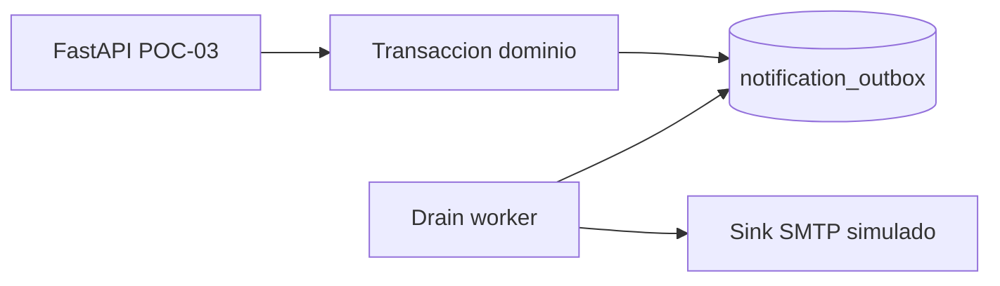

# POC-03: Cola transaccional de notificaciones (Outbox)

## 0. Metadatos

| Campo | Valor |
|-------|-------|
| ID | `POC-03-notification-outbox` |
| Título | Transactional Outbox + worker SMTP simulado |
| Grupo | AcredIA — SIGESA docs |
| Responsable(s) | Equipo módulo DTI |
| Fecha de inicio | 28/05/2026 |
| Fecha objetivo de cierre | 02/06/2026 |
| Estado | En ejecución |
| ADR relacionado | [ADR-0010](../../adr/ADR-0010-event-driven-choreography.md) (validación local del patrón outbox previo a EventBridge) |
| Trazabilidad | FSD-UC-015 · PRD-REQ-013 · PRD-US-017–019 · FSD-BR-13 |

---

## 1. Riesgo que mitiga

**RISK-NOTIF-01:** publicar eventos de dominio (aprobación/rechazo de Indicador, plazos) fuera de la transacción de negocio provoca **notificaciones huérfanas** o **pérdida de avisos** si falla SMTP/EventBridge tras el commit.

---

## 2. Hipótesis

> Creemos que un **Transactional Outbox** en la misma BD que el dominio permitirá **encolar el 100% de eventos críticos** cuando la transacción confirma, y que un **worker idempotente** entregará **0 duplicados** en el sink SMTP simulado bajo **3 reintentos** con la misma `idempotency_key`.

---

## 3. Criterio de éxito medible (SMART)

| Métrica | Umbral éxito | Umbral fracaso (obligatorio) |
|---------|--------------|------------------------------|
| Eventos encolados tras commit | 100% (n≥50 escenarios) | < 95% |
| Eventos encolados tras rollback | 0% | ≥ 1 fila outbox |
| Duplicados en sink SMTP simulado | 0 con misma `idempotency_key` | ≥ 2 entregas |
| Latencia drain worker (n≥30) | P95 ≤ 500 ms por lote de 10 | P95 > 2 s |

---

## 4. Alcance reducido (time-boxed)

**Incluye:** `POST /api/v1/domain/indicator-decision` (TX dominio+outbox), `POST /api/v1/worker/drain`, tabla `poc03_notification_outbox`, sink en memoria/archivo, pytest + `run_poc03.py`.

**Excluye:** AWS EventBridge real, plantillas HTML, colas SQS, LDAP, UI.

**Duración máxima:** **16 horas-persona** (2 integrantes × 2 días).

**Criterio de abandono:** si en **8 h-persona** no se logra atomicidad dominio+outbox en SQLite/PostgreSQL, se documenta fracaso parcial y se escala a ADR de mensajería gestionada sin extender el time-box.

---

## 5. Diseño de la prueba

### 5.1 Stack usado

| Componente | Tecnología | Versión |
|------------|------------|---------|
| API | Python FastAPI | 0.115+ |
| Runtime | uvicorn | 0.32+ |
| BD | PostgreSQL 16 / SQLite (`POC_USE_SQLITE=1`) | 16 / 3.x |
| Tests | pytest + httpx TestClient | 8.3+ / 0.28+ |

### 5.2 Arquitectura de la POC

### 5.3 Datos de prueba

- Origen: sintéticos `TEST_*`, correos `@example.invalid`.
- Volumen: 50 decisiones + 3 rollbacks forzados.
- Sesgo: sin carga concurrente multi-instancia (v2).

### 5.4 Procedimiento experimental

1. Sembrar indicador TEST y emitir decisión APROBAR/RECHAZAR con outbox en misma TX.
2. Forzar rollback (excepción post-outbox simulada) y verificar 0 filas PENDING nuevas.
3. Ejecutar `worker/drain` 3 veces con misma cola y medir duplicados en sink.
4. Capturar pytest + JSON en `evidencia/`.

---

## 6. Entorno

- **Local:** `POC_USE_SQLITE=1`, puerto **8003**.
- **Docker:** PostgreSQL 16 compartido (`docs/pocs/docker-compose.yml`).
- **Costo estimado:** 0 USD (laboratorio).

---

## 7. Herramientas de medición

- pytest (aserciones funcionales).
- `run_poc03.py` (resumen JSON en `evidencia/`).

---

## 8. Plan de ejecución

| Día | Actividad | Responsable |
|-----|-----------|-------------|
| 1 | Scaffold + esquema outbox | Equipo |
| 2 | API dominio + worker drain | Equipo |
| 3 | Tests SMART + evidencia | Equipo |
| 4 | RESULTADO.md + veredicto | Equipo |

---

## 9. Resultados

> Completar al finalizar la POC.

### 9.1 Tabla de métricas

| Métrica | Valor obtenido | Umbral éxito | Veredicto |
|---------|----------------|--------------|-----------|
| Encolado tras commit | | 100% | |
| Encolado tras rollback | | 0% | |
| Duplicados sink | | 0 | |

### 9.2 Gráficos / capturas

- `evidencia/poc03-pytest-summary.json`
- `evidencia/poc03-pytest.log`

---

## 10. Conclusiones y veredicto

- **Veredicto:** pendiente.
- **Próximos pasos:** si éxito → alinear Notification Service con outbox + EventBridge (ADR-0010).

---

## 11. Aprendizajes

- Pendiente ejecución.

---

## 12. Riesgos remanentes

- Entrega real UMSS SMTP y DLQ en cloud no cubiertos.
- Orden global entre particiones EventBridge.

---

## 13. Referencias

- [FSD-UC-015](../../04_fsd/casos_uso.md#fsd-uc-015--notificaciones-y-alertas)
- [ADR-0010](../../adr/ADR-0010-event-driven-choreography.md)

---

## 14. Historial

| Versión | Fecha | Autor | Cambio |
|---------|-------|-------|--------|
| 1 | 28/05/2026 | @ArchAgent | Creación ficha + scaffold |
