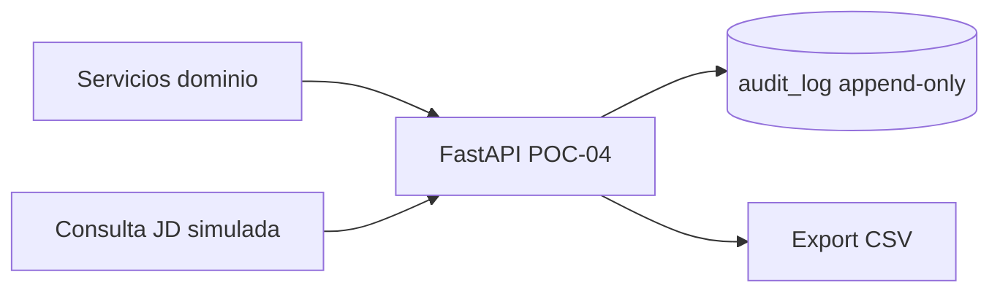

# POC-04: Consulta y exportación de bitácora append-only

## 0. Metadatos

| Campo | Valor |
|-------|-------|
| ID | `POC-04-audit-log-query` |
| Título | Bitácora append-only — filtros y export CSV |
| Grupo | AcredIA — SIGESA docs |
| Responsable(s) | Equipo módulo DTI |
| Fecha de inicio | 28/05/2026 |
| Fecha objetivo de cierre | 02/06/2026 |
| Estado | En ejecución |
| ADR relacionado | [ADR-0005](../../adr/ADR-0005-audit-log-append-only-postgresql.md) |
| Trazabilidad | FSD-UC-017 · PRD-REQ-018 · PRD-US-022 · NFR-004 |

---

## 1. Riesgo que mitiga

**RISK-AUDIT-01:** sin índices y API de consulta acotada, la bitácora append-only degrada la experiencia de [JD] (>2 min) o fuerza scans completos que violan NFR-004 en el piloto.

---

## 2. Hipótesis

> Creemos que una tabla **`audit_log` solo INSERT** con índice compuesto `(created_at, actor_id)` permitirá **P95 ≤ 300 ms** en `GET /audit/logs` filtrado sobre **10 000** registros sintéticos en SQLite local (`POC_USE_SQLITE=1`).

---

## 3. Criterio de éxito medible (SMART)

| Métrica | Umbral éxito | Umbral fracaso (obligatorio) |
|---------|--------------|------------------------------|
| P95 consulta filtrada (n≥30) | ≤ 300 ms | > 800 ms |
| Intentos UPDATE/DELETE vía API | 100% HTTP 405/403 | ≥ 1 mutación exitosa |
| Export CSV 10k filas | Completa en ≤ 2 s | > 5 s o truncado |
| Cobertura filtros actor+acción+rango | 100% casos pytest | < 90% PASS |

---

## 4. Alcance reducido (time-boxed)

**Incluye:** `POST /api/v1/audit/events`, `GET /api/v1/audit/logs`, `GET /api/v1/audit/export.csv`, seed 10k, pytest de inmutabilidad y latencia relativa.

**Excluye:** particionamiento PG, ELK, UI [JD], firma digital de export.

**Duración máxima:** **12 horas-persona**.

**Criterio de abandono:** si P95 no baja de 800 ms tras **6 h-persona** de tuning de índices, cerrar con veredicto parcial y proponer vista materializada en POC-v2.

---

## 5. Diseño de la prueba

### 5.1 Stack usado

| Componente | Tecnología | Versión |
|------------|------------|---------|
| API | Python FastAPI | 0.115+ |
| BD | PostgreSQL 16 / SQLite | 16 / 3.x |
| Tests | pytest + httpx | 8.3+ / 0.28+ |

### 5.2 Arquitectura de la POC

### 5.3 Datos de prueba

- Origen: generador `TEST_` con acciones `AUDIT_LOGIN`, `AUDIT_DECISION`, `AUDIT_DENY_DELETE`.
- Volumen: 10 000 filas seed.
- Sesgo: distribución uniforme de fechas últimos 90 días.

### 5.4 Procedimiento experimental

1. Seed vía endpoint interno o script.
2. Ejecutar 30 consultas con filtros aleatorios; medir P95.
3. Intentar DELETE/UPDATE y verificar rechazo.
4. Export CSV y validar conteo de filas.

---

## 6. Entorno

- **Local:** `POC_USE_SQLITE=1`, puerto **8004**.
- **Docker:** PostgreSQL 16 (`localhost:5433`).

---

## 7. Herramientas de medición

- pytest + `time.perf_counter` en tests de latencia.
- `run_poc04.py` → `evidencia/poc04-pytest-summary.json`.

---

## 8. Plan de ejecución

| Día | Actividad | Responsable |
|-----|-----------|-------------|
| 1 | Esquema + seed | Equipo |
| 2 | API consulta + export | Equipo |
| 3 | Tests SMART | Equipo |

---

## 9. Resultados

> Completar al finalizar.

---

## 10. Conclusiones y veredicto

- Pendiente.

---

## 11–13. Aprendizajes / Riesgos / Referencias

- [ADR-0005](../../adr/ADR-0005-audit-log-append-only-postgresql.md)
- [FSD-UC-017](../../04_fsd/casos_uso.md#fsd-uc-017--bitácora-de-auditoría)

---

## 14. Historial

| Versión | Fecha | Autor | Cambio |
|---------|-------|-------|--------|
| 1 | 28/05/2026 | @ArchAgent | Creación ficha + scaffold |
