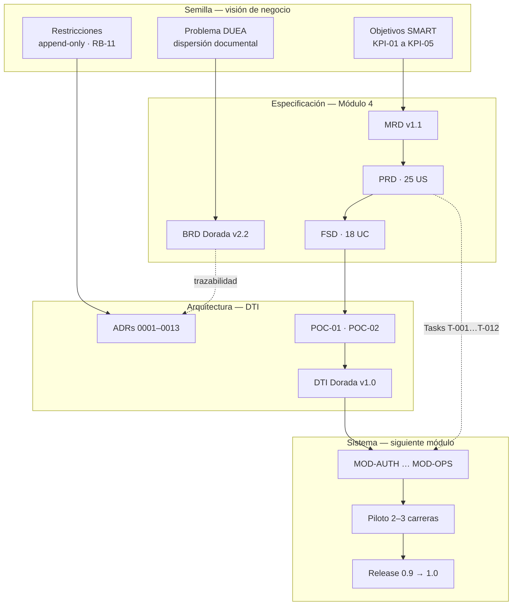
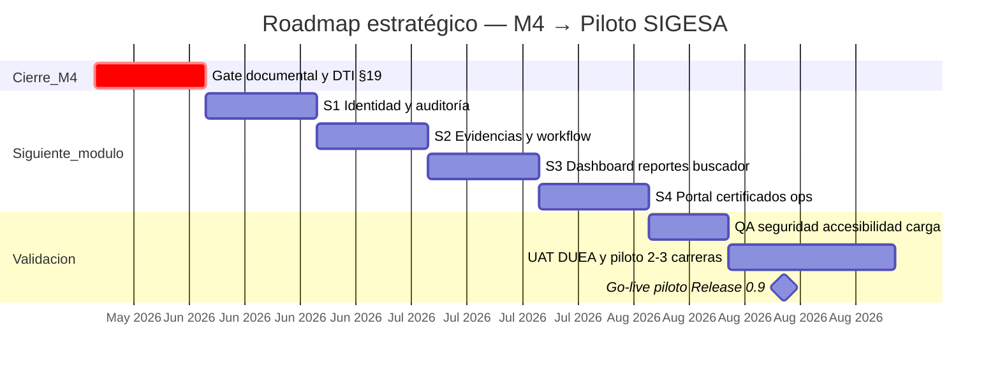

# Roadmap — SIGESA / AcredIA · UMSS

<!-- audiencia: [humano] · DTI §19 · vista estratégica para stakeholders -->

| Metadato | Valor |
|----------|-------|
| **Producto** | SIGESA — Sistema de Evaluación y Acreditación de Carreras |
| **Institución** | Universidad Mayor de San Simón (UMSS) · DUEA |
| **Versión** | v2.0 |
| **Fecha** | 25/05/2026 |
| **Audiencia** | **[humano]** — Jefatura DUEA · docente · sponsor · arquitectos · PM |
| **Rol en DTI** | Sección **§19 Roadmap técnico** (vista estratégica); detalle de despliegue en [`05_dti/DTI.md`](05_dti/DTI.md) |
| **Horizonte** | Cierre Módulo 4 (maestría) → siguiente módulo → objetivos 2026–2028 |

> **Qué es este documento:** la herramienta que permite pasar de la **visión de negocio (semilla)** a la **arquitectura técnica final (sistema)**, asegurando trazabilidad y cumplimiento de objetivos a largo plazo.  
> **Qué no es:** el cronograma de releases comerciales del producto — ese vive en [`03_prd/roadmap.md`](03_prd/roadmap.md).

---

## 1. Propósito y mandato

El roadmap cumple **cuatro funciones** en el ciclo de la maestría y en el paquete SIGESA:

| Función | Descripción |
|---------|-------------|
| **Consolidar lecciones aprendidas** | Capturar lo que el equipo descubrió al construir la cadena BRD→DTI con AI-SDLC, POCs y validación UX — para no repetir errores en el siguiente módulo. |
| **Hoja de ruta al siguiente módulo** | Orientar la transición M4 → implementación y piloto, con hitos verificables y gates institucionales. |
| **Comunicar el «por qué» estratégico** | Explicar a stakeholders humanos **por qué** la arquitectura adoptada responde al problema DUEA, no solo **qué** tecnologías se eligieron. |
| **Garantizar trazabilidad E2E** | Mantener visible el hilo **objetivo de negocio → requisito → decisión arquitectónica → módulo de sistema** a lo largo del horizonte. |

Este documento se redacta en prosa estructurada, trade-offs y narrativa de riesgos — convención **`[humano]`** del DTI (`dti-author` §4). Los detalles ejecutables (Tasks, YAML, contratos API) permanecen en FSD y DTI §3–§8 (**`[máquina]`** / **`[humano+máquina]`**).

---

## 2. De la semilla a la arquitectura

La **semilla** es el dolor documentado en el BRD: evidencias dispersas, 20+ minutos por búsqueda, observaciones desemparejadas y jefatura sin visibilidad. La **arquitectura final** es un sistema web trazable, append-only y gobernado por roles [CC], [TD] y [JD] — no un ERP ni un reemplazo de SIIS.

**Principio rector:** ninguna decisión técnica significativa entra al DTI sin ADR; ningún ADR contradice un objetivo BRD sin change request explícito. La matriz [`09_trazabilidad/matriz_trazabilidad.md`](09_trazabilidad/matriz_trazabilidad.md) v1.5 certifica ese hilo con **0 huérfanos Must** ([`report_findings.md`](09_trazabilidad/report_findings.md) v1.4).

---

## 3. El «por qué» estratégico de la arquitectura

Esta sección responde a la pregunta que [JD] y el docente formulan en revisión: *¿por qué construimos SIGESA así y no de otra forma?*

### 3.1 Por qué centralizar en un sistema de acreditación dedicado

| Pregunta del stakeholder | Respuesta estratégica | Evidencia |
|--------------------------|----------------------|-----------|
| ¿No basta con Drive o SharePoint? | No: CEUB exige vínculo **Indicador → Evidencia → dictamen [TD]** con historial inmutable; carpetas genéricas no modelan la máquina de estados ni plazos normativos. | BRD §3 · Bitácora 3 |
| ¿Por qué no adaptar un ERP? | Un ERP optimiza finanzas/RRHH; SIGESA optimiza **cumplimiento acreditatorio** con taxonomía CEUB/ARCU-SUR nativa — evita adaptaciones costosas de sistemas globales. | BRD §2.1 |
| ¿Cuál es el retorno? | De 20+ min a **≤ 2 min** por búsqueda; **0** pérdida documental; reportes en **≤ 5 min** sin depender del técnico. | BRD §1 · KPI-01…03 |

### 3.2 Por qué append-only y máquina de estados estricta

**Por qué:** una auditoría CEUB pregunta *qué se sabía en el momento del dictamen*, no solo el estado actual. Borrar o sobrescribir Evidencias destruye la defensa institucional.

**Decisión:** modelo append-only + subsanación por versionado ([ADR-0001](../adr/ADR-0001-append-only-evidence-storage.md), [ADR_001](05_dti/adrs/ADR_001_append_only_evidencia.md)) + workflow con cierre de subfase solo si todos los indicadores obligatorios están `APROBADO` ([ADR-0004](../adr/ADR-0004-workflow-state-machine.md), validado en **POC-02**).

**Trade-off aceptado:** mayor complejidad en UI de versiones a cambio de **cero riesgo reputacional** en visita de pares.

### 3.3 Por qué arquitectura hexagonal / monolito modular (v1.0)

**Por qué:** el equipo de maestría debe entregar valor en meses, no fragmentar operaciones en microservicios prematuros. Los límites de dominio (Auth, Docs, Workflow, Notif) ya están probados en la matriz MOD-*.

**Decisión:** monolito modular desplegable ([ADR-0002](../adr/ADR-0002-modular-monolith.md)) con puertos/adaptadores para SMTP, S3 y futuro LDAP.

**Trade-off:** escalado horizontal menos granular que microservicios; mitigación v1.1+ con colas async para PDF y notificaciones ([ADR-0011](../adr/ADR-0011-sqs-fifo-phase-closure.md)).

### 3.4 Por qué validar con POCs antes de construir

**Por qué:** dos riesgos podían invalidar el diseño entero: (1) duplicación de versiones en reintentos de carga; (2) cierre indebido de subfase bajo concurrencia.

**Decisión:** POC-01 (idempotencia upload + SHA-256) y POC-02 (máquina de estados + 409 con `motivos[]`) **antes** del sprint S2.

**Resultado:** ambas POCs en **éxito** — el siguiente módulo construye sobre patrones probados, no sobre suposiciones.

### 3.5 Por qué AI-SDLC con revisión humana obligatoria

**Por qué:** la velocidad de generación documental (91 % Prompt Coverage) no sustituye la responsabilidad institucional en dictámenes (RB-11: IA explicable, supervisión humana).

**Decisión:** 58 prompt contracts, skills en `.cursor/skills/`, gate auditor con 0 ERROR Must — la IA acelera la **especificación**; [TD] y [JD] conservan la **decisión**.

**Trade-off:** inversión en trazabilidad de prompts (`log_interno.md`, `PROMPT_MAPPING.md`) a cambio de reproducibilidad académica y defensa ante cambios normativos CEUB.

### 3.6 Por qué continuidad con Módulo 2 (UX) en la arquitectura de producto

**Por qué:** Bitácora 3 demostró CSAT 8,67/10 y 96,66 % tasa de éxito en carga — descartar ese trabajo sería desperdiciar validación con usuarios DUEA reales.

**Decisión:** Design System exportado en [`../figma/`](../figma/README.md) alimenta componentes del frontend; journeys del PRD alimentan E2E Playwright en implementación.

---

## 4. Lecciones aprendidas del ciclo de desarrollo (Módulo 4)

Consolidación de aprendizajes del ciclo **mayo 2026** — insumo obligatorio para el siguiente módulo de la maestría.

### 4.1 Documentación y trazabilidad

| ID | Lección | Implicación para el siguiente módulo |
|----|---------|--------------------------------------|
| **LL-DOC-01** | Consolidar en `docs/` canónico **después** de iterar en `team/<nombre>/` reduce conflictos de versión. | Congelar baseline en gate M4; cambios solo vía change request. |
| **LL-DOC-02** | La auditoría con skill `sigesa-auditor-trazabilidad-dti` detectó 0 ERROR solo tras cerrar Q-01…Q-04 en BRD §21.1. | No iniciar implementación con preguntas institucionales abiertas (Q-05 carreras piloto). |
| **LL-DOC-03** | Spec Fidelity (M-RUB-SF) sigue **POR_MEDIR** formalmente — la velocidad IA sin diff Git engaña. | Ejecutar script diff ID-level en CI antes del piloto. |
| **LL-DOC-04** | Duplicar roadmap en `03_prd/` y `docs/` confunde audiencias. | **`docs/roadmap.md`** = estrategia + maestría; **`03_prd/roadmap.md`** = releases producto. |

### 4.2 Arquitectura y POCs

| ID | Lección | Fuente |
|----|---------|--------|
| **LL-ARCH-01** | Validar tamaño/MIME **antes** de escribir en objeto evita basura en almacenamiento. | POC-01 §11 |
| **LL-ARCH-02** | Lógica pura de workflow (`workflow.py`) permite 13/13 tests sin BD — acelerar TDD en MOD-WF. | POC-02 §11 |
| **LL-ARCH-03** | La API debe devolver `motivos[]` e `indicadoresPendientes` en 409 — UX [TD] lo exige (BR-014). | POC-02 · FSD-UC-003 |
| **LL-ARCH-04** | Concurrencia en cierre de fase requiere orden por `phaseId` (SQS FIFO) — no confiar en conteo paralelo. | ADR-0011 |

### 4.3 UX, diseño y adopción

| ID | Lección | Implicación |
|----|---------|-------------|
| **LL-UX-01** | Panel [TD] pasó de satisfacción 2/5 → 5/5 tras iteración post-Bitácora 3. | Priorizar cola de revisión en S2, no posponer a v1.1. |
| **LL-UX-02** | Export Figma vía MCP tiene límites de cuota (plan Starter); XML cacheado + export manual es viable. | Completar 3 PNG pendientes antes de S1 frontend. |
| **LL-UX-03** | Confirmación automática de carga (US-005) reduce ansiedad [CC] — Must en piloto, no Should. | Incluir en demo S2 con [CC] real. |

### 4.4 AI-SDLC y gobernanza

| ID | Lección | Métrica / evidencia |
|----|---------|---------------------|
| **LL-AI-01** | Registrar cada prompt en `log_interno.md` eleva Prompt Coverage a **91 %**. | [`metricas_ai_sdlc.md`](09_trazabilidad/metricas_ai_sdlc.md) |
| **LL-AI-02** | Agent Efficiency Index **4,2–4,5** IDs/h solo es sano combinado con **0 ERROR** trazabilidad. | No usar AEI como KPI único. |
| **LL-AI-03** | Golden Folder (`docs/06`–`08`) debe referenciarse en matriz §8 — evita skills huérfanas. | 58 PCs · 92 `.mmd` · 8 skills |

### 4.5 Organización del equipo

| ID | Lección |
|----|---------|
| **LL-TEAM-01** | Paralelizar por persona en `team/<nombre>/` y consolidar en oleadas Doradas evita bloqueos en merge. |
| **LL-TEAM-02** | El diagrama Gantt de implementación debe vivir en `07_diagramas/` como fuente única, no duplicado en `.mdd`. |
| **LL-TEAM-03** | Workshop con [JD] para Q-05 (carreras piloto) es prerequisito de UAT — no delegable al equipo técnico solo. |

---

## 5. Trazabilidad: visión → sistema

| Objetivo negocio (semilla) | Requisito | Decisión arquitectónica | Módulo / evidencia |
|----------------------------|-----------|-------------------------|-------------------|
| KPI-01 búsqueda ≤ 2 min | PRD-REQ-015 · UC-007 | PostgreSQL FTS GIN · índices por carrera/facultad | MOD-SEARCH · T-010 |
| 0 pérdida documental | BRD-CST-01 · RB-04 | Append-only + SHA-256 + versionado | MOD-DOCS · ADR-0001 · POC-01 |
| Dictamen trazable | BRD-REQ-009 · UC-003 | Máquina de estados + justificación obligatoria | MOD-WF · POC-02 |
| Reporte ≤ 5 min P95 | PRD-REQ-011 · UC-005 | Job async PDF + plantilla SIGESA | MOD-REP · T-008 |
| Supervisión humana IA | RB-11 | Feature flags v2; sin auto-aprobación v1 | DTI §9 · AGENTS.md P-S01 |
| Notif. ≤ 15 min | PRD-REQ-014 · UC-006 | Outbox SMTP + cola | MOD-NOTIF · T-009 |
| Auditoría exportable | PRD-REQ-018 · UC-009 | Log append-only PostgreSQL REVOKE | MOD-AUD · ADR-0005 |

Cadena completa: [`matriz_trazabilidad.md`](09_trazabilidad/matriz_trazabilidad.md).

---

## 6. Hoja de ruta hacia el siguiente módulo de la maestría

### 6.1 Dónde estamos (Módulo 4)

| Capa | Estado | Gate |
|------|--------|------|
| BRD → FSD | ✅ Dorada · APTO trazabilidad | Cerrado |
| DTI + ADRs | 🟡 Revisión coherencia W-07 | En cierre |
| POCs críticas | ✅ 2/2 éxito | Cerrado |
| Design System Figma | 🟡 13/15 PNG | EXPORT_TODO |
| Spec Kit | Specify ✅ · Plan ✅ · Tasks 🟡 · **Implement ⬜** | **Inicio siguiente módulo** |

### 6.2 Qué es el siguiente módulo

La **fase de construcción y validación institucional**: transformar la línea base documental congelada en software operativo en staging, someterlo a UAT DUEA y ejecutar piloto en 2–3 carreras (Release **0.9**).

| Incluye | Excluye |
|---------|---------|
| Monorepo aplicativo · Tasks T-001…T-012 · CI/CD dev/staging | Reescribir BRD/PRD sin CR |
| UAT · TC-01…TC-14 · capacitación [CC]/[TD] | SIIS tiempo real · IA autónoma (v2) |
| Go-live piloto controlado | Multi-facultad 1.0.0 (oleada posterior) |

### 6.3 Oleadas estratégicas

| Oleada | Objetivo humano (por qué) | Entregable verificable |
|--------|---------------------------|------------------------|
| **O0 — Cierre M4** | Congelar verdad documental auditable | Acta gate · DTI §21 completo · Q-05 cerrado |
| **O1 — Confianza técnica** | Demostrar que el stack sostiene identidad y auditoría | MOD-AUTH operativo · log append-only |
| **O2 — Flujo trazable** | Sustituir correo/WhatsApp como canal principal en piloto | UC-002, UC-003 en staging |
| **O3 — Visibilidad [JD]** | Jefatura decide sin Excel paralelo | Dashboard + PDF + buscador KPI |
| **O4 — Transparencia** | Cumplir promesa institucional de consulta pública controlada | Portal [P] · respaldos verificados |
| **O5 — Piloto** | Medir adopción real antes de escalar a todas las facultades | UAT firmado · Release 0.9 |

Releases posteriores (1.0.0 institucional, 1.1, 2.0): [`03_prd/roadmap.md`](03_prd/roadmap.md).

### 6.4 Cronograma orientativo

Detalle de sprints técnicos: [`07_diagramas/diagrama-gantt-roadmap.mmd`](07_diagramas/diagrama-gantt-roadmap.mmd).

---

## 7. Objetivos a largo plazo (2026–2028)

| Horizonte | Objetivo estratégico | Señal de cumplimiento |
|-----------|---------------------|------------------------|
| **2026 Q3** | Piloto trazable en carreras DUEA | UAT · KPI-01/02 en verde |
| **2026 Q4** | v1.0 multi-facultad en convocatoria activa | MAU ≥ 80 % · PDF P95 ≤ 5 min |
| **2027 H1** | Hardening portal · picos CEUB | k6 formal · observabilidad prod |
| **2027 H2+** | Plataforma: SIIS lectura · IA gobernada · [EE] | ADRs v2 · DPIA · feature flags |

Estos objetivos descienden directamente de la semilla BRD §4 y se despliegan en oleadas del PRD — el roadmap asegura que la arquitectura v1 **no cierra puertas** (Adapter LDAP, EventBridge, outbox) sin sobre-construir hoy.

---

## 8. Gates y criterios de transición

Marcar antes de declarar **M4 cerrado** e iniciar el siguiente módulo:

### Documentación [humano]

- [ ] [`05_dti/DTI.md`](05_dti/DTI.md) §19 enlaza este roadmap · checklist §21 completo
- [ ] Q-05: ≥ 2 carreras piloto en BRD §14.3 con fecha CEUB
- [ ] Lecciones §4 revisadas en retrospectiva de equipo
- [ ] Figma 15/15 PNG · diagramas UC-004…012

### Implementación [humano+máquina]

- [ ] Repositorio aplicativo · entornos dev/staging
- [ ] POC-01/02 integrados en MOD-DOCS y MOD-WF
- [ ] CI con cobertura dominio core ≥ 80 %

### Validación [humano]

- [ ] UAT con [JD] · usabilidad ≥ 3 [CC]/[TD]
- [ ] CSAT piloto ≥ 4/5 · adopción indicadores ≥ 80 %

---

## 9. Riesgos estratégicos

| Riesgo | Por qué importa al stakeholder | Mitigación |
|--------|-------------------------------|------------|
| Piloto sin carreras designadas (Q-05) | UAT sin validez institucional | Workshop [JD] ≤ 1 semana |
| Arquitectura percibida como «IT por IT» | Pérdida de sponsorship DUEA | Este documento §3 + demo con datos reales |
| Deriva de alcance v2 en v1 | Retraso piloto | MoSCoW congelado en gate M4 |
| Confianza en IA sin revisión | Riesgo normativo RB-11 | Gate 0 ERROR Must + revisión humana |

---

## 10. Guía de lectura

| Stakeholder | Secciones prioritarias |
|-------------|------------------------|
| **[JD]** / sponsor DUEA | §3 por qué · §6 oleadas · §7 horizonte |
| **Docente / tribunal** | §2 semilla→sistema · §4 lecciones · §5 trazabilidad |
| **Arquitecto / Tech Lead** | §3.2–3.4 · §5 · [`05_dti/DTI.md`](05_dti/DTI.md) |
| **PM** | §6 cronograma · §8 gates · [`03_prd/roadmap.md`](03_prd/roadmap.md) |
| **Agente IA** | §5 trazabilidad · §4 LL-AI-* · [`08_agents/AGENTS.md`](08_agents/AGENTS.md) |

---

## 11. Referencias

| Documento | Ruta | Rol |
|-----------|------|-----|
| DTI canónico | [`05_dti/DTI.md`](05_dti/DTI.md) | Arquitectura `[máquina]` / `[humano+máquina]` |
| Roadmap producto | [`03_prd/roadmap.md`](03_prd/roadmap.md) | Releases 0.9→2.0 |
| Auditoría | [`09_trazabilidad/report_findings.md`](09_trazabilidad/report_findings.md) | Gate APTO |
| Métricas AI-SDLC | [`09_trazabilidad/metricas_ai_sdlc.md`](09_trazabilidad/metricas_ai_sdlc.md) | LL-AI-* |
| POCs | [`pocs/README.md`](pocs/README.md) | LL-ARCH-* |
| Design System | [`../figma/README.md`](../figma/README.md) | LL-UX-02 |

---

## Registro de cambios

| Versión | Fecha | Cambio |
|---------|-------|--------|
| v1.0 | 25/05/2026 | Creación — hoja de ruta M4 → Implementación |
| **v2.0** | 25/05/2026 | Reescritura estratégica `[humano]`: semilla→sistema, lecciones aprendidas, por qué arquitectónico, enlace DTI §19 |
