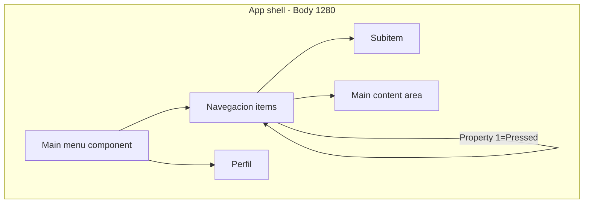
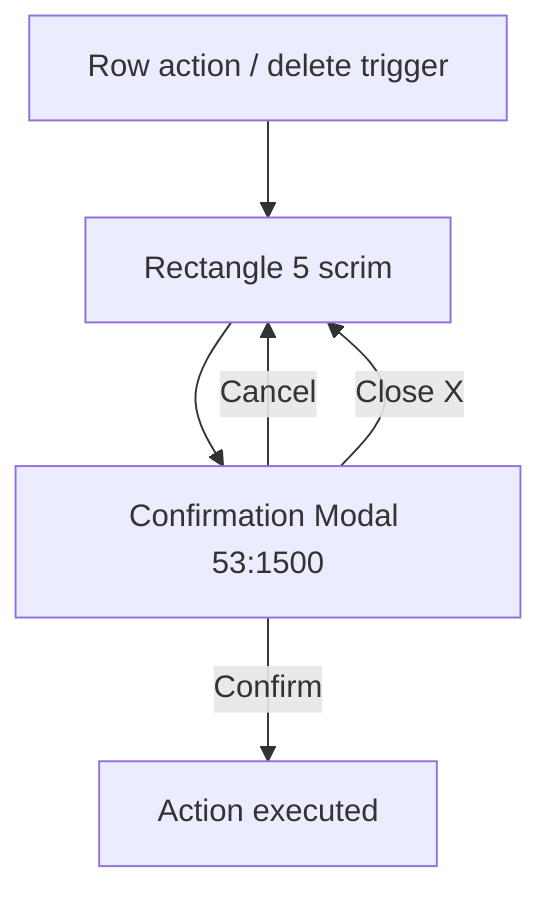
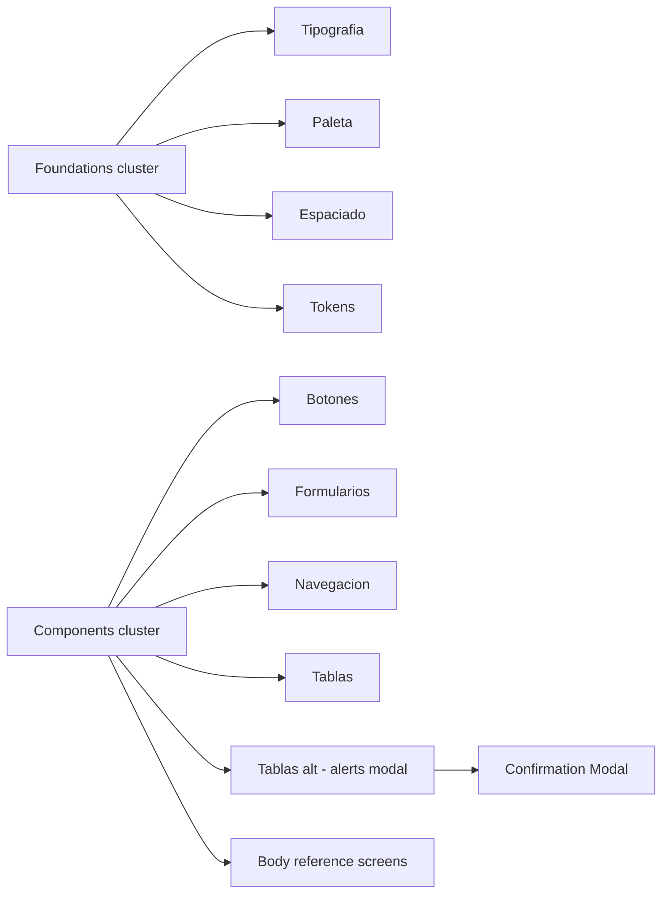

# Interaction map — AcredIA Design System

Documented relationships from component structure and variant names. Prototype links were not exported (rate limit); validate in Figma Prototype mode.

## Navigation graph



## Form interactions

```mermaid
stateDiagram-v2
  [*] --> Default: InputText click=Default
  Default --> Focused: click=Click
  Focused --> Default: blur

  [*] --> Closed: Dropdown desplegar=false
  Closed --> Open: desplegar=true
  Open --> Closed: select option

  Default --> Error: invalid email
  Error --> Default: fix input
```

| Trigger | Component | Transition | Target state |
|---------|-----------|------------|--------------|
| Click field | InputText | Default → Click | Focus ring / border |
| Click select | Dropdown | false → true | Options panel visible |
| Pick option | Option | activeTrue | Value committed, close |
| Invalid submit | Correo field | — | Error message + `!` icon |

## Modal / overlay relationships



| Pattern | Evidence | Notes |
|---------|----------|-------|
| Dropdown overlay | `Dropdown` expanded symbol (`1729:8294`, `534:389`) | Inline overlay, not modal |
| Confirmation modal | `53:1500` on `tablas-y-datos-alt` | 448×303, footer Cancel + Confirm |
| Alert banners | `53:1268`–`53:1295` | Static inline, 4 semantic variants |
| FAB / dialog | Not in AcredIA-native frames | Available in M3 library only |
| Side sheets | Not documented in-file | — |

## Button interactions

| Component | States shown in Figma |
|-----------|----------------------|
| Primary Button | default, hover (`26:51`), loading (`Cargando...`) |
| Secundary button | default, hover (`522:95`) |
| Cancelar | default, Variant2 |
| Eliminar proceso | default, hover (`26:74`) |
| Más opciones | default, hover (`26:67`) |
| — | disabled (`Deshabilitado` frame) |

Hover variants documented in [`../frames/botones-cambios.md`](../frames/botones-cambios.md).

## Linked frames (documentation flow)



## Motion / transitions

| Token | Duration | Use |
|-------|----------|-----|
| dur-rapido | ~150ms | Hover, toggle |
| dur-normal | ~250ms | Panel open |
| dur-lento | ~400ms | Page-level |

Loader frames (`Dot Loader 1–6`, `pulse-1/2`, `circle-animation`) are **reference animations**, not navigation transitions.

## Domain-specific state badges

Acreditación process UI maps badge copy to business states:

| Badge text | Domain meaning |
|------------|----------------|
| EN PROCESO | Fase activa |
| En revisión | Revisión institucional |
| ACREDITADA | Resultado positivo |
| RECHAZADA | Resultado negativo |
| NO ACREDITADA | Sin acreditación vigente |
| DUEA 2025 | Etiqueta de ciclo |

## Figma deep links (key interactive components)

| Component | Node ID | URL |
|-----------|---------|-----|
| Dropdown set | `534:389` | `?node-id=534-389` |
| InputText set | `534:161` | `?node-id=534-161` |
| Main menu | `535:222` | `?node-id=535-222` |
| Navegacion set | `285:83` | `?node-id=285-83` |

Base: `https://www.figma.com/design/DX0AyrzfJQEUog45DsGEsl/AcredIA---Design-System`
