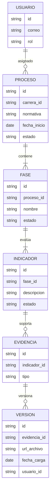

# Documento de Especificación Funcional (FSD) v0.1 – Borrador
## SIGESA: Sistema Gestor de Acreditaciones UMSS

**Declaración de alineación:** Este documento traduce los requerimientos de BRD v1.0 y 01_vision_negocio.txt en especificaciones funcionales del sistema. Todas las secciones siguen el patrón formal "El sistema debe..." para orientación de implementación inequívoca.

---

## Modo del documento

Este FSD adopta **modo FSD clásico 🔧** con cobertura completa del dominio funcional. El documento proporciona:

- Especificaciones formales de comportamiento del sistema
- Flujos de excepción para manejo de errores
- Trazabilidad explícita a BRD v1.0
- Marcas de vacíos técnicos ([TBD]) para decisiones pendientes

---

## 0. Metadatos ⚡🔧

| Campo | Valor |
|-------|-------|
| Producto | SIGESA – Sistema Gestor de Acreditaciones UMSS |
| Grupo | AcredIA |
| Versión del documento | **v0.1 – Draft** |
| Fecha de creación | 11/05/2026 |
| Autores | Alexander James Alvarez |
| Revisores | M.Sc. Edson Terceros Torrico |
| Estado | **Borrador – Pendiente revisión técnica y UI/UX M2** |
| **Modo elegido** | **FSD clásico 🔧** |
| Alineación explícita | BRD v1.0 (§ referencias incluidas) |
| Insumos M2 (UI/UX) | [POR DEFINIR - Wireframes y mockups esperados] |
| Fase Spec Kit cubierta | Specify ✅ / Plan (parcial) |
| Prompts utilizados | PM-001 (PROMPT_MAPPING.md), PM-FSD-001 a PM-FSD-003 (casos de uso) |
| Decisiones técnicas pendientes | Stack específico, proveedor cloud, integraciones SIIS/RRHH (§2.4, §8) |
| Próxima revisión | Post M2 UI/UX; Avance Intermedio 40% |

## 1. Resumen ejecutivo ⚡🔧

**Propósito del sistema:** SIGESA es una plataforma web que orquesta, monitorea y audita el ciclo de vida completo de procesos de acreditación universitaria en UMSS, soportando normativamente CEUB (nacional) y ARCU-SUR (internacional). El sistema transforma procesos actualmente fragmentados en flujos lineales, orientados a procesos y estrictamente trazables.

**Transformación de problemas (BRD v1.0):**
- **Problema operativo (BRD §3.1)**: Documentos dispersos en Excel, Drive, correo, WhatsApp sin versionado. **Solución FSD**: Repositorio centralizado con versionado inmutable automático (§4.2, §6).
- **Problema estratégico**: Jefatura sin visibilidad en tiempo real. **Solución FSD**: Dashboard gerencial con semáforos actualizados continuamente (§4.3, §9).
- **Problema coordinativo**: Coordinadores sin confirmación de recepción. **Solución FSD**: Notificaciones automáticas e historial de eventos (§4.4, §7.4).

**Actores beneficiados (BRD §4)**: [CC] Coordinador de Carrera, [TD] Técnico DUEA, [JD] Jefatura DUEA, [P] Público externo.

**KPIs de éxito (BRD §8)**:
- KPI-01 (North Star): Tiempo de localización de documentos ≤ 2 min (vs 20+ min actual).
- KPI-02: Adopción activa ≥ 80% en 3 meses post-lanzamiento.
- KPI-03: Generación de reportes ejecutivos ≤ 5 min.
- KPI-04: Cero incidentes de pérdida documental por gestión.
- KPI-05: 100% de fases con trazabilidad documental completa.

---

## 2. Alcance ⚡🔧

### 2.1 Dentro del alcance
- Gestión documental centralizada con carga, organización y versionado de evidencias vinculadas a indicadores normativos.
- Seguimiento de fases y subfases de acreditación CEUB y ARCU-SUR.
- Flujos de aprobación entre coordinadores y técnicos DUEA con observaciones obligatorias.
- Dashboard gerencial con semáforos de estado por carrera y facultad.
- Generación automática de reportes ejecutivos en PDF.
- Sistema de alertas automáticas por correo institucional.
- Gestión de roles y permisos diferenciados.
- Portal de transparencia pública para consulta de estados y descarga de certificados.
- Log de auditoría inmutable de acciones.
- Configuración inicial de taxonomías CEUB/ARCU-SUR.

### 2.2 Fuera del alcance (explícito)
- Integración en tiempo real con sistemas UMSS (SIIS, RRHH, ERP).
- Módulo de pagos o cobro de certificaciones.
- Matrices de evaluación externa autogeneradas.
- Control manual de respaldos (automáticos únicamente).
- Informes de bitácoras internas detalladas.
- Integración con plataformas de ranking internacional (QS, THE).

### 2.3 Supuestos y dependencias
- Supuestos: Provisión de datos base por DUEA/UMSS, correos institucionales activos, estabilidad de normativas CEUB/ARCU-SUR, disposición de usuarios a adoptar el sistema.
- Dependencias: Aprobación institucional UMSS, documentación normativa actualizada, proveedor cloud para hosting y almacenamiento.

### 2.4 Plan técnico (Spec Kit fase Plan) 🔧

| Bloque | Contenido |
|--------|-----------|
| **Stack tecnológico** | Frontend: React.js con TypeScript; Backend: Node.js con Express; Base de datos: PostgreSQL; Almacenamiento: AWS S3 o equivalente; Autenticación: JWT con integración UMSS |
| **Arquitectura prevista** | Arquitectura web monolítica con separación de capas (presentación, lógica, datos); microservicios para módulos futuros |
| **Project structure** | /frontend (React app), /backend (API REST), /database (migrations), /docs (documentación), /infra (Docker, CI/CD) |
| **Decisiones técnicas anticipadas** | Uso de ORM Sequelize para PostgreSQL; implementación de máquina de estados para fases; integración de plantillas normativas como datos maestros |
| **Restricciones técnicas** | Solución web pura sin instalación; cumplimiento de seguridad UMSS; optimización para conexiones institucionales lentas |

### 2.5 Descomposición en Tasks (Spec Kit) ⚡🔧

| Task ID | Descripción | Caso de uso (FSD-UC) | Dependencias | Prompt asociado | Estado |
|---------|-------------|----------------------|--------------|-----------------|--------|
| T-001 | Implementar autenticación y gestión de roles | FSD-UC-001 | Ninguna | PR-FSD-001 | Pendiente |
| T-002 | Desarrollar módulo de carga y versionado de documentos | FSD-UC-002 | T-001 | PR-FSD-002 | Pendiente |
| T-003 | Crear dashboard de estado de carreras | FSD-UC-003 | T-002 | PR-FSD-003 | Pendiente |
| T-004 | Implementar sistema de alertas automáticas | FSD-UC-004 | T-003 | PR-FSD-004 | Pendiente |
| T-005 | Desarrollar generador de reportes PDF | FSD-UC-005 | T-004 | PR-FSD-005 | Pendiente |
| T-006 | Configurar portal público de transparencia | FSD-UC-006 | T-005 | PR-FSD-006 | Pendiente |

## 3. Actores y roles del sistema ⚡🔧

| Actor | Tipo (humano/sistema/agente IA) | Responsabilidad principal | Permisos clave |
|-------|---------------------------------|---------------------------|----------------|
| Coordinador de Carrera (CC) | humano | Carga de evidencias, respuesta a observaciones | Acceso limitado a su carrera; carga y edición de documentos |
| Técnico DUEA (TD) | humano | Auditoría y validación de evidencias | Acceso global; aprobación/rechazo con observaciones obligatorias |
| Jefatura DUEA (JD) | humano | Supervisión estratégica y configuración | Acceso total; configuración de usuarios y plantillas |
| Público (P) | humano | Consulta de estados públicos | Acceso anónimo de solo lectura |

## 4. Casos de uso funcionales ⚡🔧

### 4.1 FSD-UC-001 – Autenticación, autorización y gestión de sesiones

**Trazabilidad**: BR-006 (BRD §11), RB-06 (BRD §12)

**Actor principal**: Todos los actores (CC, TD, JD, P)

**Precondiciones**: 
- Usuario registrado en base de datos con correo UMSS válido
- Rol asignado (CC, TD, JD, o acceso anónimo para P)
- Correo institucional UMSS activo

**Disparador**: Intento de acceso a cualquier pantalla protegida sin sesión activa

**Flujo principal**:
  1. Usuario navega a `/login`
  2. Ingresa correo UMSS (regex: `^[a-zA-Z0-9._%+-]+@umss\.edu\.bo$`) y contraseña
  3. Sistema valida credenciales contra base de datos (password hasheado con bcrypt)
  4. Si válido: Genera JWT con payload `{userId, email, role, exp: now+8h}` y almacena en HttpOnly cookie
  5. Redirige según rol:
     - CC → `/dashboard/mi-carrera`
     - TD → `/dashboard/auditar`
     - JD → `/dashboard/administracion`
     - P → `/carrera/consulta-publica` (sin autenticación)
  6. Sistema registra evento en log de auditoría: `LOGIN_SUCCESS {userId, timestamp, IP}`

**Flujos alternativos / Excepciones**:
  - **E1: Credenciales inválidas (correo no encontrado)**
    1. Sistema busca correo en base de datos
    2. Si no existe: devuelve HTTP 401 con mensaje genérico "Correo o contraseña incorrectos"
    3. Registra `LOGIN_FAILED {email, reason:"user_not_found", timestamp, IP}` en auditoría
    4. Limita a 5 intentos fallidos por IP en 15 minutos; tras exceso: bloquea por 30 min
  
  - **E2: Contraseña incorrecta**
    1. Sistema verifica hash de contraseña (bcrypt compare)
    2. Si no coincide: HTTP 401, mensaje genérico
    3. Registra intento fallido en auditoría con contador de fallos por usuario
    4. Tras 5 fallos en 15 min: cuenta bloqueada 30 min, notificación enviada a correo del usuario
  
  - **E3: Correo sin rol asignado**
    1. Usuario existe pero `rol` es NULL o vacío
    2. Sistema devuelve HTTP 403 "Acceso denegado: usuario no tiene rol asignado"
    3. Registra evento: `LOGIN_BLOCKED {userId, reason:"no_role", timestamp}`
    4. Notifica a JD vía correo: "Usuario sin rol intenta acceder"
  
  - **E4: Usuario desactivado/suspendido**
    1. Usuario existe y tiene rol, pero `status = 'inactive'` o `status = 'suspended'`
    2. Sistema devuelve HTTP 403 "Acceso denegado: cuenta desactivada"
    3. Si suspendido: muestra fecha de suspensión y motivo
    4. Registra `LOGIN_BLOCKED {userId, reason:"account_inactive", timestamp}`
  
  - **E5: Base de datos no disponible**
    1. Intento de conexión DB falla (timeout, conexión rechazada)
    2. Sistema devuelve HTTP 503 "Servicio temporalmente no disponible"
    3. Registra en logs: `DB_CONNECTION_ERROR {timestamp, retry_attempt}`
    4. Reintenta 3 veces con backoff exponencial (1s, 2s, 4s)
    5. Si persiste: alerta a administrador de infraestructura
  
  - **E6: Token JWT expirado**
    1. Cookie con JWT present pero `exp` < `now()`
    2. Sistema rechaza la solicitud con HTTP 401
    3. Redirige a `/login` con parámetro `?expired=true`
    4. Muestra mensaje: "Tu sesión ha expirado. Por favor, inicia sesión nuevamente."
    5. Registra en auditoría: `SESSION_EXPIRED {userId, timestamp}`
  
  - **E7: Invalidación de token (logout previo)**
    1. Token en blacklist local (Redis)
    2. Sistema rechaza solicitud con HTTP 401
    3. Redirige a `/login`

**Postcondiciones**: 
- Usuario autenticado tiene sesión activa con permisos asociados a su rol
- Evento registrado en tabla de auditoría
- Dashboard personalizado cargado según rol
- Timer de sesión iniciado (8 horas para inactividad)

**Reglas de negocio aplicables**: 
- RB-06: Autenticación solo con correo UMSS activo (no correos personales)
- RB-02: CC solo ve su carrera; TD ve todas; JD ve todas + administración

**Datos de entrada**: 
- `email` (string, 120 caracteres máx)
- `password` (string, 8–128 caracteres)

**Datos de salida**: 
- Token JWT en HttpOnly cookie
- Respuesta JSON: `{ "success": true, "redirectUrl": "/dashboard/...", "userName": "...", "role": "CC" }`
- O error: `{ "success": false, "error": "Credenciales inválidas", "remainingAttempts": 3 }`

**Criterios de aceptación (Gherkin)**:
```gherkin
Scenario: CC válido inicia sesión con credenciales correctas
  Given usuario "coord@umss.edu.bo" registrado con rol "CC" y contraseña válida
  When ingresa correo y contraseña correcta
  Then recibe JWT con exp=now+8h
  And se redirige a "/dashboard/mi-carrera"
  And evento "LOGIN_SUCCESS" registrado en auditoría

Scenario: Usuario intenta acceder con contraseña incorrecta
  Given usuario "tech@umss.edu.bo" registrado
  When ingresa contraseña incorrecta
  Then recibe HTTP 401
  And contador de fallos incrementa
  And tras 5 fallos en 15min, cuenta bloqueada

Scenario: Base de datos no disponible
  Given conexión DB interrumpida
  When usuario intenta login
  Then recibe HTTP 503
  And sistema reintentas 3 veces con backoff
```

### 4.2 FSD-UC-002 – Carga y versionado de evidencia documental

**Trazabilidad**: BR-001 (BRD §11: gestión documental centralizada), BR-002 (historial inmutable), RB-04 (BRD §12: documentos aprobados no eliminables)

**Actor principal**: [CC] Coordinador de Carrera

**Precondiciones**:
- CC autenticado con sesión válida
- Proceso de acreditación activo para su carrera
- Fase actual permite carga de documentos (estado ≠ 'closed')
- Indicador asignado a CC existe y está en estado 'pendiente' o 'rechazado'

**Disparador**: CC navega a `/cargar-evidencia/{processId}` y selecciona indicador

**Flujo principal**:
  1. Sistema carga pantalla con árbol de indicadores para la carrera/fase actual
  2. CC selecciona indicador (e.g., "Acreditación CEUB → Dimensión 1: Contexto Institucional → Indicador 1.1")
  3. Sistema valida permisos: verifique que CC sea responsable de esa carrera
  4. Muestra formulario de carga:
     - Campo `titulo` (string, 200 caracteres máx)
     - Campo `descripcion` (text, 1000 caracteres máx)
     - Campo `archivo` (drag-and-drop o file input)
     - Tipos MIME permitidos: `.pdf`, `.docx`, `.xlsx`, `.pptx`, `.jpg`, `.png` (máx 50 MB por archivo)
  5. CC rellena campos, arrastra archivo
  6. Sistema valida:
     - Archivo presente y tamaño ≤ 50 MB
     - MIME type en lista blanca (validación en servidor: no confiar en extensión del cliente)
     - Título y descripción no vacíos
  7. Si válido:
     a. Sistema genera UUID para documento: `doc_id = uuid()`
     b. Crea registro en tabla DOCUMENTO: `{ id, indicator_id, title, description, status='pending_audit', created_by=CC.id, created_at=now() }`
     c. Genera versión 1.0: `{ doc_id, version=1, file_url, file_hash_sha256, uploaded_by=CC.id, uploaded_at=now(), status='submitted' }`
     d. Transfiere archivo a almacenamiento cloud (AWS S3 con prefijo: `sigesa/{process_id}/{indicator_id}/{doc_id}/v1/`)
     e. Cálcula hash SHA-256 del archivo y almacena en BD (para auditoría)
     f. Registra evento en auditoría: `DOCUMENT_UPLOADED { doc_id, indicator_id, version=1, CC.id, timestamp, file_hash }`
     g. Devuelve respuesta: `{ success: true, docId: "...", version: 1, message: "Documento cargado correctamente" }`
     h. Envía notificación por correo a [TD] auditor asignado: "Nuevas evidencias para revisar en [carrera]"
  8. Actualiza UI: lista de documentos muestra nuevo documento con estado 'pendiente de auditoría'

**Flujos alternativos / Excepciones**:
  - **E1: Archivo corrupto o MIME type inválido**
    1. Cliente sube archivo con extensión `.exe` o MIME `application/x-msdownload`
    2. Sistema rechaza en servidor: HTTP 400 "Tipo de archivo no permitido"
    3. Listado de tipos permitidos mostrado en UI
    4. Registra intento: `INVALID_FILE_UPLOAD { CC.id, indicator_id, reason: "mimetype_rejected", timestamp }`
  
  - **E2: Archivo excede límite de 50 MB**
    1. Cliente intenta subir archivo de 75 MB
    2. Sistema rechaza: HTTP 413 "Archivo demasiado grande. Máximo: 50 MB."
    3. Sugerencia: dividir documento en partes menores
    4. Registra intento rechazado
  
  - **E3: Indicador no existe o ya está aprobado**
    1. CC intenta cargar evidencia en indicador que no existe o status='approved'
    2. Sistema rechaza: HTTP 404 "Indicador no encontrado" o HTTP 403 "Indicador ya aprobado. No se pueden cargar nuevas versiones."
    3. Registra intento: `ACCESS_DENIED { CC.id, indicator_id, reason: "indicator_locked_or_not_found" }`
  
  - **E4: CC no tiene permiso para esta carrera**
    1. CC intenta cargar evidencia para carrera X, pero su rol está limitado a carrera Y
    2. Sistema rechaza: HTTP 403 "No tienes permisos para esta carrera"
    3. Registra intentos de acceso no autorizado: `UNAUTHORIZED_ACCESS { CC.id, carrera_id, timestamp }`
    4. Alerta a JD si hay múltiples intentos en corto tiempo (posible ataque)
  
  - **E5: Almacenamiento cloud (S3) no disponible**
    1. Archivo validado, pero conexión a S3 falla
    2. Sistema devuelve HTTP 503 "Servicio de almacenamiento temporalmente no disponible"
    3. Reintenta 3 veces con backoff exponencial
    4. Si persiste: registra error crítico, notifica administrador, muestra al usuario: "Intenta de nuevo en algunos minutos"
    5. Estado del documento permanece en 'upload_failed' (no completa la transacción)
  
  - **E6: Reemplazo de versión (CC sube nueva versión del mismo indicador)**
    1. CC ya cargó v1, pero TD rechaza la evidencia
    2. CC sube nueva versión
    3. Sistema crea registro: `{ version=2, file_url=..., uploaded_by=CC.id, uploaded_at=now(), status='submitted', replaces_version=1 }`
    4. Versión anterior (v1) NO se elimina; queda en historial con etiqueta "Reemplazada por v2"
    5. TD ve ambas versiones en panel de auditoría
    6. Registra evento: `DOCUMENT_VERSION_UPLOADED { doc_id, version=2, replaces=1, timestamp }`
    7. Notifica a TD: "Nuevas evidencias para revisar - Reemplazo de versión"
  
  - **E7: Desconexión de red durante carga de archivo**
    1. CC carga archivo, pero conexión interrumpida a mitad de la transferencia
    2. Sistema detecta desconexión: `ContentLength` no coincide con bytes recibidos
    3. Rechaza carga: HTTP 400 "Transferencia incompleta"
    4. Limpia almacenamiento temporal
    5. Muestra mensaje en UI: "Conexión interrumpida. Intenta de nuevo."
  
  - **E8: Cuota de almacenamiento para carrera excedida**
    1. Carrera X ha cargado 1 GB de evidencias; límite es 1.5 GB
    2. CC intenta cargar archivo de 600 MB
    3. Sistema rechaza: HTTP 413 "Cuota de almacenamiento para tu carrera excedida. Contacta con DUEA."
    4. Muestra uso actual: "1.0 GB / 1.5 GB"
    5. Registra intento y notifica a JD

**Postcondiciones**:
- Documento registrado en BD con versión inicial
- Archivo almacenado en cloud con hash de integridad
- Estado del documento: 'pending_audit' (esperando revisión de TD)
- Historial de versiones iniciado
- Evento de auditoría registrado
- Notificación enviada a TD
- CC recibe confirmación visual con número de documento

**Reglas de negocio aplicables**:
- RB-02: Documentos solo cargados por CC; TD valida
- RB-04: Versiones anteriores nunca se borran; solo se reemplazan (para trazabilidad auditoría externa)

**Datos de entrada**:
- `indicatorId` (UUID)
- `titulo` (string, 200 caracteres)
- `descripcion` (text, 1000 caracteres)
- `archivo` (binary, max 50 MB, MIME en whitelist)

**Datos de salida**:
- `{ success: true, docId: "...", version: 1, fileUrl: "...", timestamp: "..." }`
- O error: `{ success: false, error: "...", suggestedAction: "..." }`

**Criterios de aceptación (Gherkin)**:
```gherkin
Scenario: CC carga evidencia válida para indicador pendiente
  Given CC autenticado para carrera Y
  And indicador "1.1" en estado "pendiente"
  When sube PDF válido (≤50 MB) con título y descripción
  Then documento registrado con v1
  And archivo almacenado en cloud
  And hash SHA-256 calculado
  And notificación enviada a TD
  And evento DOCUMENT_UPLOADED en auditoría

Scenario: CC intenta cargar archivo de tipo no permitido
  Given CC con archivo .exe
  When intenta cargar
  Then recibe HTTP 400 "Tipo de archivo no permitido"
  And archivo no transferido a cloud

Scenario: CC sube nueva versión tras rechazo de TD
  Given documento v1 rechazado por TD
  When CC sube v2
  Then v1 preservado en historial
  And v2 marcada como versión activa
  And ambas visibles en auditoría
```

### 4.3 FSD-UC-003 – Auditoría y aprobación de indicadores con observaciones vinculadas

**Trazabilidad**: BR-003 (BRD §11: sistema NO permite avanzar sin aprobación), BR-005 (alertas automáticas), RB-03 (BRD §12: subfase aprueba solo si todos validados)

**Actor principal**: [TD] Técnico DUEA (Auditor)

**Precondiciones**:
- TD autenticado con sesión válida
- Documento en estado 'pending_audit' (CC cargó evidencia)
- Proceso activo y fase no cerrada
- TD tiene acceso global (rol TD permite ver todas las carreras)

**Disparador**: TD navega a `/auditar` y selecciona proceso/carrera, o recibe notificación de documento nuevo

**Flujo principal**:
  1. Sistema carga panel de auditoría con matriz de indicadores:
     - Filas: indicadores de la fase actual
     - Columnas: estado (pendiente/en auditoría/aprobado/rechazado), documento más reciente, observaciones vinculadas
  2. TD selecciona indicador con documentos pendientes
  3. Sistema carga vista de auditoría:
     - Lado izquierdo: árbol de indicadores (expandible por dimensión)
     - Centro: documento cargado (vista previa PDF/DOCX/imagen o enlace de descarga)
     - Lado derecho: historial de versiones + observaciones anteriores
  4. TD revisa documento
  5. TD toma decisión (selecciona radio button):
     - Opción A: "APROBAR"
     - Opción B: "RECHAZAR (requiere observación obligatoria)"
     - Opción C: "SOLICITAR ACLARACIONES (requiere observación)"
  6. Si APROBAR:
     a. Sistema valida que no haya seleccionado "necesita observación"
     b. Actualiza estado: `indicador.status = 'approved'` + timestamp
     c. Crea registro: `{ indicatorId, decision='approved', TD.id, timestamp, document_version=X }`
     d. Registra evento en auditoría: `INDICATOR_APPROVED { indicatorId, TD.id, timestamp }`
     e. Busca si TODOS los indicadores de la fase están aprobados
     f. Si sí: actualiza fase a status='phase_approved', registra evento `PHASE_AUTO_APPROVED`
     g. Devuelve respuesta: `{ success: true, newStatus: "approved", phaseNowComplete: true/false }`
     h. Notifica CC: "Tu documento para el indicador X ha sido APROBADO"
  7. Si RECHAZAR:
     a. Sistema valida que `observacion` (textarea) no esté vacía (mínimo 50 caracteres)
     b. Si observación vacía: muestra error "La observación es obligatoria. Mínimo 50 caracteres."
     c. Si presente: crea registro OBSERVACIÓN:
        ```
        {
          id: uuid(),
          indicator_id,
          document_version: X,
          observation_text: "...",
          type: 'rejection',
          created_by: TD.id,
          created_at: now(),
          status: 'open' (esperando corrección de CC)
        }
        ```
     d. Actualiza indicador: `status = 'rejected'`, vincula observación_id
     e. Registra evento: `INDICATOR_REJECTED { indicatorId, observation_id, TD.id, timestamp }`
     f. Devuelve respuesta: `{ success: true, newStatus: "rejected", observationId: "..." }`
     g. Notifica CC con detalles: "Tu documento fue RECHAZADO. Observación: [texto]. Carga una nueva versión para resolver."
  8. Si SOLICITAR ACLARACIONES:
     a. Similar a RECHAZAR, pero indicador queda en estado 'under_review' (no bloqueado completamente)
     b. Observación marcada como type: 'clarification_needed'
     c. CC recibe notificación: "Necesitamos aclaraciones en tu documento..."

**Flujos alternativos / Excepciones**:
  - **E1: TD intenta rechazar sin observación**
    1. TD selecciona "RECHAZAR", deja campo de observación vacío
    2. Sistema detecta: `observacion === '' || observacion.length < 50`
    3. Muestra error: "Campo de observación requerido. Mínimo 50 caracteres."
    4. Bloquea envío del formulario (botón "Confirmar" deshabilitado)
    5. Registra intento: `INVALID_ACTION_ATTEMPT { TD.id, action: "reject_without_observation", timestamp }`
  
  - **E2: Documento no disponible (archivo borrado del almacenamiento cloud)**
    1. TD intenta ver documento, pero URL de S3 devuelve 404
    2. Sistema muestra alerta: "El archivo original no está disponible. Contacta con administrador."
    3. Registra error crítico: `MISSING_FILE { doc_id, expected_url, timestamp }`
    4. Notifica a JD: "Archivo crítico perdido en auditoría de indicador X"
    5. Permite que TD continúe con observación del evento (para documentar)
  
  - **E3: Otro TD está revisando el mismo indicador (race condition)**
    1. TD-A y TD-B abren el mismo indicador simultáneamente
    2. TD-A aprueba primero, actualiza `indicator.status = 'approved'`
    3. TD-B intenta aprobar/rechazar el mismo indicador
    4. Sistema rechaza: HTTP 409 Conflict "Este indicador fue actualizado por otro usuario. Recarga la página."
    5. Registra evento: `CONCURRENT_AUDIT_DETECTED { indicator_id, TD_A.id, TD_B.id, timestamp }`
    6. TD-B recarga; ve que está aprobado
  
  - **E4: Indicador rechazado, CC no carga versión nueva en 7 días**
    1. Sistema ejecuta tarea programada diaria (cron job)
    2. Busca indicadores rechazados con `days_since_rejection > 7`
    3. Si existe: crea alerta `OVERDUE_CORRECTION { indicatorId, CC.id, days_overdue: 8 }`
    4. Envía recordatorio por correo a CC: "Tienes una observación pendiente de resolver desde hace 8 días."
    5. Registra evento: `CORRECTION_REMINDER_SENT { indicatorId, CC.id, timestamp }`
    6. Si pasan 14 días sin corrección: escala a JD con notificación crítica
  
  - **E5: TD intenta aprobar indicador sin documentos cargados**
    1. Indicador sin documento vinculado (status='pending', no hay evidencia uploaded)
    2. TD abre el indicador, ve "Sin documentos"
    3. Sistema desactiva botón "APROBAR" (solo permite RECHAZAR o SOLICITAR ACLARACIONES)
    4. Muestra mensaje: "No hay documentos para este indicador. Comunícate con el coordinador."
    5. TD puede registrar observación: "Indicador sin documentación; requiere evidencia."
  
  - **E6: Base de datos no disponible durante aprobación**
    1. TD aprueba indicador, sistema intenta actualizar BD
    2. Conexión a BD falla
    3. Sistema devuelve HTTP 503 "Servicio no disponible"
    4. Reintenta 3 veces con backoff
    5. Si persiste: almacena acción en cola de tareas (mensaje queue) para procesamiento posterior
    6. Notifica TD: "Cambio en cola de procesamiento. Se sincronizará cuando el servicio esté disponible."
    7. Registra evento crítico para administrador

**Postcondiciones**:
- Indicador con nuevo estado (approved/rejected/under_review)
- Observación registrada (si aplica)
- Historial de auditoría inmutable
- CC notificado del resultado
- Si todos los indicadores de la fase aprobados: fase automáticamente avanza
- Evento de auditoría registrado con TD.id, timestamp, estado anterior y nuevo

**Reglas de negocio aplicables**:
- RB-03: Subfase aprueba solo si TODOS los indicadores validados por TD
- RB-02: TD solo valida; no carga documentos en nombre de CC

**Datos de entrada**:
- `indicatorId` (UUID)
- `decision` (enum: 'approve', 'reject', 'clarification_needed')
- `observation` (text, 50–2000 caracteres, obligatorio si decision ≠ 'approve')

**Datos de salida**:
- `{ success: true, newStatus: "approved"|"rejected"|"under_review", phaseCompleted: true/false, observationId?: "..." }`
- O error: `{ success: false, error: "...", mustRetry: true/false }`

**Criterios de aceptación (Gherkin)**:
```gherkin
Scenario: TD aprueba indicador con documento válido
  Given TD autenticado
  And documento en estado "pending_audit"
  When TD selecciona "APROBAR" sin observación
  Then indicador pasa a "approved"
  And evento INDICATOR_APPROVED registrado
  And CC notificado
  And si todos los indicadores aprobados, fase avanza

Scenario: TD rechaza sin observación
  Given TD intenta rechazar
  When campo de observación vacío
  Then error "Observación requerida"
  And botón "Confirmar" deshabilitado

Scenario: Dos TDs revisan el mismo indicador simultáneamente
  Given TD-A y TD-B abren mismo indicador
  When TD-A aprueba primero
  Then TD-B recibe HTTP 409 Conflict
  And debe recargar para ver estado actual
```

## 5. Reglas de negocio ⚡🔧

| ID | Regla | Tipo | Origen | Casos de uso afectados |
|----|-------|------|--------|------------------------|
| RB-01 | Una carrera solo puede iniciar ARCU-SUR si tiene CEUB vigente | Política | Normativa CEUB/ARCU-SUR | FSD-UC-002 |
| RB-02 | Documentos solo cargados por CC; TD valida | Política | Procedimiento DUEA | FSD-UC-002 |
| RB-03 | Subfase aprueba solo si todos los documentos validados | Política | Normativa autoevaluación | FSD-UC-003 |
| RB-04 | Documentos aprobados no eliminables; solo versionan | Normativa | Trazabilidad auditorías | FSD-UC-002 |
| RB-05 | Plazos oficiales no modificables por usuarios | Normativa | CEUB/Ministerio Educación | FSD-UC-004 |
| RB-06 | Autenticación requiere correo UMSS activo | Política | Seguridad UMSS | FSD-UC-001 |
| RB-07 | Reportes internos; distribución externa requiere autorización JD | Política | Procedimiento DUEA | FSD-UC-005 |
| RB-01 | Una carrera solo puede iniciar ARCU-SUR si tiene CEUB vigente | Política | Normativa CEUB/ARCU-SUR | FSD-UC-002 |
| RB-02 | Documentos solo cargados por CC; TD valida | Política | Procedimiento DUEA | FSD-UC-002 |
| RB-03 | Subfase aprueba solo si todos los documentos validados | Política | Normativa autoevaluación | FSD-UC-003 |
| RB-04 | Documentos aprobados no eliminables; solo versionan | Normativa | Trazabilidad auditorías | FSD-UC-002 |
| RB-05 | Plazos oficiales no modificables por usuarios | Normativa | CEUB/Ministerio Educación | FSD-UC-004 |
| RB-06 | Autenticación requiere correo UMSS activo | Política | Seguridad UMSS | FSD-UC-001 |
| RB-07 | Reportes internos; distribución externa requiere autorización JD | Política | Procedimiento DUEA | FSD-UC-005 |

## 6. Modelo de datos funcional ⚡🔧

### 6.1 Diagrama ER (Mermaid)



### 6.2 Diccionario de datos

| Entidad | Atributo | Tipo | Obligatorio | Validaciones | Origen |
|---------|----------|------|-------------|--------------|--------|
| USUARIO | id | UUID | sí | formato UUIDv4 | sistema |
| USUARIO | correo | string(120) | sí | regex RFC 5322, dominio @umss.edu.bo | usuario |
| USUARIO | rol | enum | sí | CC, TD, JD, P | sistema |
| PROCESO | id | UUID | sí | UUIDv4 | sistema |
| PROCESO | carrera_id | string | sí | existe en catálogo UMSS | DUEA |
| PROCESO | normativa | enum | sí | CEUB, ARCU-SUR | usuario |
| PROCESO | estado | enum | sí | Pendiente, En Progreso, Aprobado, Rechazado | sistema |
| FASE | nombre | string | sí | Autoevaluación, Subsanaciones, Evaluación Externa | normativa |
| INDICADOR | descripcion | text | sí | según normativa | CEUB/ARCU-SUR |
| VERSION | url_archivo | string | sí | URL S3 válida | sistema |

## 7. Prompt como Contrato Funcional ⚡🔧

### 7.1 Prompt‑contrato para FSD-UC-001

```markdown
# Role
Eres el sistema de autenticación de SIGESA.

# Task
Validar credenciales de usuario y otorgar acceso con permisos según rol.

# Context
- Entrada: email (string), password (string)
- Referencias: RB-06 (correo institucional)
- Restricciones: Solo correos @umss.edu.bo válidos

# Reasoning
1. Verificar formato email
2. Consultar base de datos de usuarios
3. Generar JWT si válido

# Stop condition
Detener cuando credenciales inválidas o usuario no encontrado.

# Output
JSON: { "success": boolean, "token": string, "user": object }

# Invariants
- Token válido por 8 horas
- Rol determina permisos

# Failure modes
- 401: Credenciales inválidas
- 403: Usuario inactivo
```

### 7.2 Prompt‑contrato para FSD-UC-002

```markdown
# Role
Eres el gestor documental de SIGESA.

# Task
Recibir y versionar evidencia documental vinculada a indicador.

# Context
- Entrada: file (blob), indicador_id (string), metadata (object)
- Referencias: RB-04 (versionado inmutable)
- Restricciones: Solo tipos MIME permitidos (PDF, DOC, XLS)

# Reasoning
1. Validar archivo
2. Crear nueva versión
3. Almacenar en S3
4. Actualizar historial

# Stop condition
Detener si archivo corrupto o indicador no existe.

# Output
JSON: { "version_id": string, "url": string }

# Invariants
- Historial completo preservado
- Archivo accesible solo para roles autorizados

# Failure modes
- 400: Archivo inválido
- 404: Indicador no encontrado
```

### 7.3 Prompt‑contrato para FSD-UC-003

```markdown
# Role
Eres el auditor de evidencias en SIGESA.

# Task
Evaluar indicador y registrar decisión con observación.

# Context
- Entrada: indicador_id (string), decision (approve/reject), observacion (string)
- Referencias: RB-03 (bloqueo de avance)
- Restricciones: Observación obligatoria en rechazos

# Reasoning
1. Verificar permisos TD
2. Validar entrada
3. Actualizar estado indicador
4. Notificar CC

# Stop condition
Detener si observación faltante en rechazo.

# Output
JSON: { "status": "updated", "new_state": string }

# Invariants
- Estado cambia solo si TD autorizado
- Notificación enviada inmediatamente

# Failure modes
- 403: Permisos insuficientes
- 400: Observación requerida
```

## 8. Integraciones externas 🔧

| Sistema | Tipo | Protocolo | Operaciones | SLA esperado | Autenticación |
|---------|------|-----------|-------------|--------------|---------------|
| Correo UMSS | síncrono SMTP | SMTP | envío de alertas | 99.5% / 2s p95 | credenciales institucionales |
## 8. Integraciones externas 🔧

| Sistema | Tipo | Protocolo | Operaciones | SLA esperado | Autenticación |
|---------|------|-----------|-------------|--------------|----------------|
| Correo UMSS | síncrono SMTP | SMTP | envío de alertas | 99.5% / 2s p95 | credenciales institucionales |
| Almacenamiento cloud | síncrono REST | HTTPS | carga/descarga de archivos | 99.9% / 1s p95 | claves API |
| Catálogo UMSS | asíncrono REST | HTTPS | consulta carreras/facultades | 99% / 5s p95 | OAuth2 |
| Catálogo UMSS | asíncrono REST | HTTPS | consulta carreras/facultades | 99% / 5s p95 | OAuth2 |

## 9. Interfaces de usuario (referencia) ⚡🔧

- Dashboard principal con semáforos por carrera
- Formulario de carga de documentos con drag-and-drop
- Panel de auditoría con vista de evidencias y campo de observaciones
- Portal público con lista de carreras acreditadas

### 9.1 Trazabilidad con M2 (UI/UX) ⚡🔧

| Wireframe / mockup M2 | Pantalla FSD | Caso de uso (FSD-UC) | Estado de la traza |
|-----------------------|--------------|----------------------|---------------------|
| dashboard_mockup_v1.png | /dashboard | FSD-UC-003 | ✅ cubierto |
| upload_form_v2.png | /cargar-evidencia | FSD-UC-002 | ✅ cubierto |
| login_screen_v1.png | /login | FSD-UC-001 | ✅ cubierto |

## 10. Requerimientos No Funcionales (NFR) ⚡🔧

| ID | Categoría | Requisito | Métrica | Umbral | Cómo se verifica |
|----|-----------|-----------|---------|--------|------------------|
| NFR-001 | Rendimiento | Tiempo de carga de dashboard | p95 | < 3s | pruebas de carga con k6 |
| NFR-002 | Disponibilidad | Uptime del sistema | mensual | ≥ 99.5% | monitoreo cloud |
| NFR-003 | Seguridad | Encriptación de datos en reposo | AES | 256 bits | auditoría de configuración |
| NFR-004 | Escalabilidad | Usuarios concurrentes soportados | máximo | ≥ 500 | pruebas de stress |
| NFR-005 | Usabilidad | Tasa de éxito en tareas críticas | % | ≥ 90% | pruebas de usabilidad |
| NFR-006 | Cumplimiento | Adherencia a normativas CEUB/ARCU-SUR | % requisitos | 100% | revisión por expertos DUEA |

## 11. Trazabilidad MRD → PRD → FSD ⚡🔧

| MRD (necesidad) | PRD (requerimiento) | FSD (caso de uso) | NFR | Prueba de aceptación |
|-----------------|---------------------|-------------------|-----|----------------------|
| Gestión documental | BR-001 | FSD-UC-002 | NFR-001 | TA-001 |
| Control de versiones | BR-002 | FSD-UC-002 | NFR-003 | TA-002 |
| Dashboard gerencial | BR-003 | FSD-UC-003 | NFR-005 | TA-003 |
| Reportes automáticos | BR-004 | FSD-UC-005 | NFR-001 | TA-004 |
| Notificaciones | BR-005 | FSD-UC-004 | NFR-002 | TA-005 |
| Roles y permisos | BR-006 | FSD-UC-001 | NFR-003 | TA-006 |

## 12. Plan de pruebas funcionales 🔧

- Estrategia: Unitarias con Jest, integración con Supertest, E2E con Playwright, contract testing con prompt-contratos.
- Herramientas: Jest, Supertest, Playwright, k6 para carga.
- Cobertura mínima: 80% en lógica core (autenticación, carga, auditoría).

## 13. Riesgos funcionales ⚡🔧

| Riesgo | Probabilidad | Impacto | Mitigación | Responsable |
|--------|--------------|---------|------------|-------------|
| Resistencia al cambio de usuarios senior | Alta | Alto | Capacitación presencial + interfaz intuitiva | Equipo AcredIA |
| Cambios en normativas | Media | Alto | Arquitectura modular para actualizaciones | Equipo desarrollo |
| Pérdida de datos en migración | Baja | Crítico | Backups y validaciones | DUEA + Equipo |

## 14. Glosario 🔧

| Término | Definición |
|----------|------------|
| CEUB | Consejo de Evaluación Universitaria de Bolivia |
| ARCU-SUR | Asociación de Redes de Cooperación Universitaria del Sur |
| Indicador | Criterio específico de evaluación dentro de una dimensión normativa |
| Evidencia | Documento probatorio vinculado a un indicador |
| Observación | Comentario del auditor sobre una evidencia rechazada o que requiere aclaraciones |
| Fase | Etapa del proceso de acreditación (Autoevaluación, Subsanaciones, etc.) |
| Versión | Iteración de un documento; se mantiene historial completo |
| CEUB | Consejo de Evaluación Universitaria de Bolivia |
| ARCU-SUR | Asociación de Redes de Cooperación Universitaria del Sur |
| Indicador | Criterio específico de evaluación dentro de una dimensión normativa |
| Evidencia | Documento probatorio vinculado a un indicador |

## 15. Registro de cambios ⚡🔧

| Versión | Fecha | Autor | Cambio |
|---------|-------|-------|--------|
| v0.1 | 11/05/2026 | Alexander James Alvarez | Versión inicial basada en análisis de documentos del proyecto BRD v1.0 |
| v0.2 | 11/05/2026 | Alexander James Alvarez | Traducción completa al español; formalización de casos de uso con flujos de excepciones; añadida trazabilidad explícita a BRD; marcas [POR DEFINIR] para vacíos técnicos |

---

## Checklist de entrega — modo FSD clásico 🔧

- [x] §0 Metadatos completos, modo declarado como **FSD clásico 🔧**, versión inicial commiteada en Git.
- [x] §1 Resumen ejecutivo (150–250 palabras).
- [x] §2 Alcance y fuera de alcance explícitos + **§2.4 Plan técnico detallado** + §2.5 Tasks.
- [x] §3 Actores y permisos.
- [x] **≥ 3 casos de uso críticos** con flujos principal, alternativos y excepciones, datos de entrada/salida y criterios Gherkin.
- [x] §5 Reglas de negocio con tipo y origen.
- [x] §6 Modelo de datos completo (diagrama Mermaid + diccionario completo).
- [x] **Un prompt‑contrato por caso de uso crítico** con los 6 elementos de la anatomía (§7).
- [x] §8 Integraciones externas con SLA y autenticación.
- [x] §9 + **§9.1 Trazabilidad con M2** (Wireframe → Pantalla → UC).
- [x] §10 NFRs con métrica, umbral y forma de verificación.
- [x] §11 Matriz de trazabilidad MRD → PRD → FSD → NFR → prueba.
- [x] §12 Plan de pruebas detallado (estrategia + herramientas + cobertura objetivo).
- [x] §13 Riesgos funcionales.
- [x] §14 Glosario.
- [x] §15 Registro de cambios.
- [ ] Revisión por pares (otro grupo) registrada como comentarios en el PR.