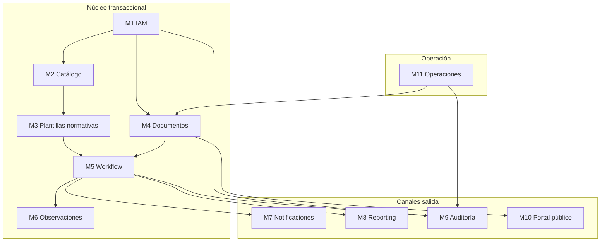
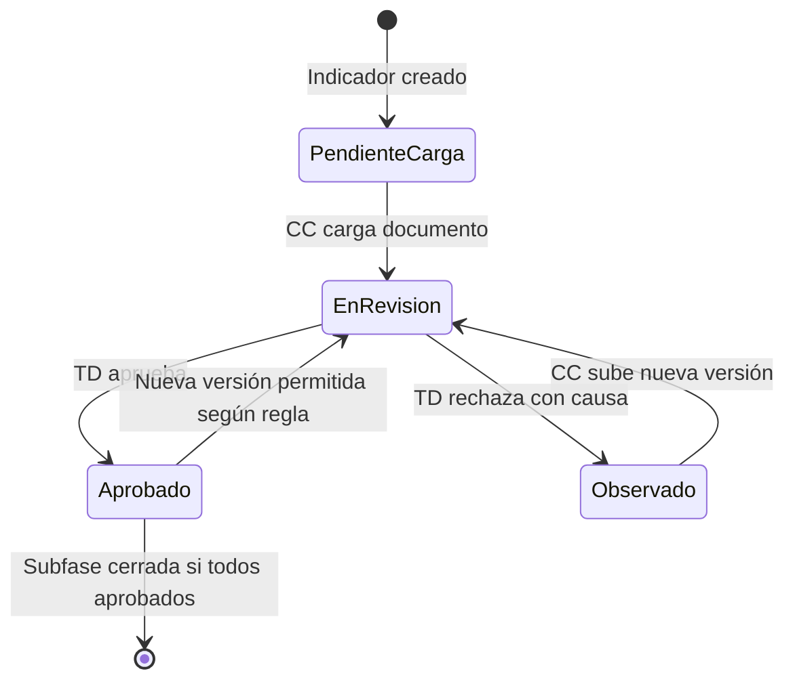
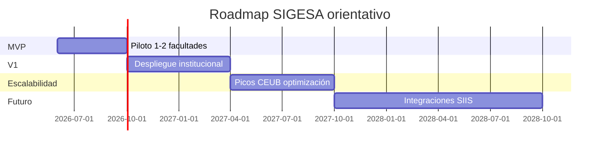

# Product Requirements Document (PRD)

## SIGESA / AcredIA — Sistema de Evaluación, Aseguramiento de la Calidad y Acreditación de Carreras

**Universidad Mayor de San Simón (UMSS)** · Dirección Universitaria de Evaluación y Acreditación (DUEA)

---

## 0. Control documental

| Campo | Valor |
|-------|-------|
| **Documento** | PRD Institucional Completo |
| **Producto** | SIGESA (AcredIA) |
| **Versión** | v1.0 |
| **Fecha** | 14/05/2026 |
| **Propietario de producto** | A definir (PM institucional / DUEA + proveedor) |
| **Estado** | Borrador para validación en Sprint 0 / PI Planning |
| **Trazabilidad ascendente** | `docs/BRD_SIGESA_Institucional_Completo.md` · `docs/BRD_v1.md` · `02_mrd/MRD_SIGESA_Institucional_Estrategico_v1.md` |
| **Trazabilidad descendente** | `docs/LFSD.md` · `docs/FSD_v1.md` |
| **Metodología** | Agile / Scrum o SAFe Lean-Agile; historias INVEST; Definition of Ready / Done alineada a este PRD |
| **Convención roles** | **[CC]** Coordinador/a de carrera · **[TD]** Técnico/a DUEA · **[JD]** Jefatura DUEA · **[P]** Público · **[DC]** Decano/a o rol de lectura facultativo (fase evolutiva) |

---

## Índice

1. [Introducción y contexto del producto](#1-introducción-y-contexto-del-producto)  
2. [Problema institucional y oportunidad](#2-problema-institucional-y-oportunidad-de-mejora)  
3. [Objetivos estratégicos y SMART](#3-objetivos-estratégicos-y-objetivos-smart-del-sistema)  
4. [Segmentación de usuarios](#4-segmentación-de-usuarios)  
5. [User personas](#5-user-personas-por-segmento)  
6. [Necesidades, pain points y expectativas](#6-necesidades-pain-points-y-expectativas)  
7. [Alcance funcional y no funcional](#7-alcance-funcional-y-no-funcional-del-sistema)  
8. [Arquitectura funcional de módulos](#8-arquitectura-funcional-de-módulos-y-componentes)  
9. [Flujos operativos y procesos clave](#9-flujos-operativos-y-procesos-clave)  
10. [User Stories (INVEST)](#10-user-stories-estándar-invest)  
11. [User Journeys](#11-user-journeys)  
12. [Roadmap por fases](#12-roadmap-del-producto-por-fases)  
13. [Requerimientos no funcionales](#13-requerimientos-no-funcionales-detallados)  
14. [KPIs y métricas de éxito](#14-kpis-y-métricas-de-éxito-del-producto)  
15. [Riesgos](#15-riesgos-funcionales-técnicos-y-organizacionales)  
16. [Restricciones y supuestos](#16-restricciones-y-supuestos-del-proyecto)  
17. [Criterios de éxito y aceptación globales](#17-criterios-de-éxito-y-criterios-de-aceptación-globales)  
18. [Recomendaciones y conclusiones](#18-recomendaciones-estratégicas-y-conclusiones)  
19. [Matriz de trazabilidad BRD / PRD / FSD](#19-matriz-de-trazabilidad-brd--prd--fsd)  
20. [Registro de cambios](#20-registro-de-cambios)

---

## 1. Introducción y contexto del producto

### 1.1 Propósito del PRD

Este documento define **qué debe construirse** en el producto digital SIGESA: capacidades funcionales, experiencias de usuario priorizadas, **historias de usuario** implementables, **criterios de aceptación** verificables, **requisitos no funcionales** y **líneas base** para diseño (`FSD`), arquitectura e implementación. Complementa al BRD (por *qué* institucional) y al MRD (por *qué mercado*), y constituye el **contrato de alcance** preferido para el *Product Backlog*.

### 1.2 Contexto UMSS

La UMSS gestiona decenas de carreras distribuidas en múltiples facultades, sometidas a ciclos de **autoevaluación**, **aseguramiento de la calidad** y **acreditación** bajo marcos **CEUB** (Bolivia) y **ARCU-SUR** (espacio regional MERCOSUR educativo). La DUEA actúa como **hub** de cumplimiento y asesoría; las carreras son **unidades ejecutoras** de evidencia; las autoridades requieren **visibilidad** y **reportabilidad**; la comunidad exige **transparencia**.

### 1.3 Visión de producto (declaración única)

> Para la UMSS, cuyos procesos de acreditación aún dependen de canales dispersos y poco auditables, **SIGESA** es la **plataforma web institucional** que **centraliza evidencias, validaciones y reporting** con **trazabilidad CEUB/ARCU-SUR**, permitiendo **defender la calidad académica** ante auditores y **comunicar el estado oficial** a la comunidad universitaria.

---

## 2. Problema institucional y oportunidad de mejora

### 2.1 Problema

La **fragmentación documental** (Excel, correo, almacenamiento compartido informal, mensajería) genera: (i) **latencia** en localizar la versión válida de una evidencia; (ii) **ambiguiedad** sobre estado de revisión; (iii) **carga cognitiva** concentrada en pocos técnicos DUEA; (iv) **riesgo** de observaciones en auditoría por deficiencias formales o de trazabilidad; (v) **asimetría informativa** entre operación y gobierno académico.

**Línea base referencial (campo 2026):** búsqueda de documento >20 min/sesión en flujo actual; reportes ejecutivos en horas o días.

### 2.2 Oportunidad de mejora (transformación digital)

| Palanca | Resultado esperado en producto |
|---------|--------------------------------|
| **Fuente única de verdad** | Repositorio con versiones y estados |
| **Workflow explícito** | Aprobación / rechazo con causa y notificaciones |
| **Automatización** | Alertas, reportes PDF, respaldos |
| **Transparencia** | Portal público con publicación gobernada |
| **Gobernanza** | Roles, auditoría, plantillas normativas versionadas |

---

## 3. Objetivos estratégicos y objetivos SMART del sistema

### 3.1 Objetivos estratégicos (nivel producto)

| ID | Objetivo estratégico |
|----|----------------------|
| OE-1 | Institucionalizar la gestión digital del **ciclo de vida** de evidencias de acreditación |
| OE-2 | Elevar la **capacidad de defensa** documental ante CEUB y ARCU-SUR |
| OE-3 | Mejorar la **experiencia** de coordinación de carrera y de técnicos DUEA |
| OE-4 | Proveer **inteligencia operativa** a jefatura y autoridades sin trabajo paralelo manual |
| OE-5 | Fortalecer **confianza social** mediante transparencia publicada |

### 3.2 Objetivos SMART (derivados del BRD, medibles en producto)

| ID | Objetivo SMART | Métrica | Meta | Plazo |
|----|------------------|---------|------|-------|
| OS-1 | Reducir tiempo de localización de evidencia desde el sistema | Minutos (muestra) | ≤ 2 min | Q4-2026 |
| OS-2 | Asegurar adopción de actores clave | % MAU sobre registrados | ≥ 80% | M+3 post go-live |
| OS-3 | Autonomía de jefatura en reportes | Tiempo generación PDF | ≤ 5 min (P95) | Q4-2026 |
| OS-4 | Trazabilidad en procesos activos | % fases con cadena completa | 100% | Q2-2027 |
| OS-5 | Confiabilidad de notificaciones críticas | % eventos notificados ≤ 15 min | 100% | Continuo |

---

## 4. Segmentación de usuarios

Se definen **cuatro segmentos** diferenciados (mínimo exigido: dos; aquí cuatro para coherencia con MRD y operación real UMSS).

| Segmento | Descripción | Actores | Valor buscado |
|----------|-------------|---------|---------------|
| **S1 — Operación de carrera** | Quienes producen y corrigen evidencia | [CC], docentes aportantes, comité de autoevaluación | Cumplimiento oportuno con guía clara |
| **S2 — Aseguramiento DUEA** | Quienes validan y orquestan el marco normativo | [TD], [JD] | Homogeneidad, trazabilidad, control |
| **S3 — Gobierno académico** | Quienes priorizan y rinden cuentas | Decanos, Vicerrectorado (lectura/reportes) | Visibilidad agregada y comparable |
| **S4 — Comunidad y externos** | Consumo de información oficial | [P], empleadores, evaluadores (futuro lectura) | Verificación rápida, baja fricción |

---

## 5. User personas por segmento

### 5.1 S1 — **María Elena Rojas** (Coordinadora de carrera, [CC])

| Atributo | Detalle |
|----------|---------|
| **Perfil** | Coordinación de carrera pregrado, ~15 años en la UMSS |
| **Objetivos** | Cerrar subfases sin reprocesos masivos; proteger tiempo docente |
| **Contexto boliviano** | Convocatorias CEUB con plazos rígidos; coordinación interinstitucional por facultad |
| **Frustraciones** | Versiones duplicadas; falta de “recibido conforme” trazable |
| **Expectativas** | Lista cerrada de pendientes; mensajes claros en castellol técnico-académico |
| **Dispositivos** | Laptop en oficina; tablet/celular en campus (responsive deseable) |

### 5.2 S2 — **Lic. Andrea Flores** (Técnica DUEA, [TD])

| Atributo | Detalle |
|----------|---------|
| **Perfil** | Validación técnica de evidencias; contacto frecuente con carreras |
| **Objetivos** | Estandarizar criterios; cerrar observaciones con trazabilidad |
| **Frustraciones** | Búsqueda en múltiples canales; rechazos mal documentados por parte de carrera (cuando el sistema no obliga calidad) |
| **Expectativas** | Buscador potente; panel de cola de revisión; export para auditoría |

### 5.3 S2/S3 — **Lic. Claudia Sevilla** (Jefatura DUEA, [JD])

| Atributo | Detalle |
|----------|---------|
| **Perfil** | Sponsor; responsable de política de publicación y reportes a autoridades |
| **Objetivos** | Semáforos confiables; PDF para Consejo/Decanato sin depender de “armar a mano” |
| **Frustraciones** | Incertidumbre; reportes inconsistentes entre facultades |
| **Expectativas** | Filtros por facultad, gestión académica, tipo CEUB/ARCU-SUR |

### 5.4 S3 — **M.Sc. Fernando Vargas** (Decano, [DC] lectura — fase evolutiva)

| Atributo | Detalle |
|----------|---------|
| **Perfil** | Supervisa múltiples carreras; agenda saturada |
| **Objetivos** | Identificar carreras en riesgo; pedir apoyo focalizado a DUEA |
| **Expectativas** | Vista de solo lectura por facultad; sin acceso a borradores ajenos |

### 5.5 S4 — **Valeria Quispe** (Estudiante / egresada, [P])

| Atributo | Detalle |
|----------|---------|
| **Perfil** | Consulta estado de acreditación de su carrera para empleabilidad o trámites |
| **Objetivos** | Confirmar **información oficial** sin filas |
| **Frustraciones** | PDFs no oficiales por WhatsApp; respuestas contradictorias |
| **Expectativas** | Portal claro, accesible, sin login obligatorio para consulta básica |

---

## 6. Necesidades, pain points y expectativas

### 6.1 Matriz consolidada

| Segmento | Necesidades explícitas | Pain points | Expectativas de producto |
|----------|------------------------|-------------|--------------------------|
| S1 | Checklist por indicador; estados; observaciones vinculadas | Caos de versiones; plazos | “Me dice qué falta” |
| S2 | Cola de revisión; buscador; bitácora | Sobrecarga pre-auditoría | “Defiendo cada decisión en el log” |
| S3 | Semáforos; PDF; filtros | Datos inconsistentes | “Para Consejo en minutos” |
| S4 | Estado publicado; certificados oficiales | Desinformación | “Lo que dice la web UMSS vale” |

### 6.2 Implicancias de priorización (MoSCoW resumido)

| Categoría | Épicas / capacidades |
|-----------|----------------------|
| **Must** | Auth UMSS, roles, carga/versiones, flujo aprobación, dashboard JD, PDF, notificaciones, buscador, auditoría, respaldo |
| **Should** | Portal público estado, filtros avanzados dashboard, plan de mejora |
| **Could** | Excel export, certificado digital, rol decano lectura |
| **Won’t (v1)** | Integración SIIS en tiempo real, pagos en línea, IA autónoma |

---

## 7. Alcance funcional y no funcional del sistema

### 7.1 Alcance funcional (v1 objetivo)

- Autenticación con **correo @umss.edu.bo** y roles [CC], [TD], [JD].  
- Catálogo: facultades, carreras, procesos por tipo (CEUB / ARCU-SUR), fases/subfases/indicadores.  
- Carga de evidencias por [CC] con **versionado** y estados (`borrador` / `en_revision` / `observado` / `aprobado` — ajustable en FSD).  
- Revisión [TD]: aprobar/rechazar con **justificación obligatoria** en rechazo.  
- Autorización de avance de fase/subfase según reglas de completitud.  
- **Dashboard** semáforos y **reporte PDF** ejecutivo.  
- **Notificaciones** por correo institucional en eventos críticos.  
- **Buscador** multi-criterio.  
- **Log de auditoría** consultable por [JD].  
- **Portal público** consulta de estado (Should para MVP institucional acotado; Must si política UMSS lo exige en go-live).  
- **Respaldo** automático y señal de salud para [JD].

### 7.2 Alcance no funcional (resumen; detalle §13)

Seguridad (autenticación, autorización, mínimo privilegio), disponibilidad, rendimiento, escalabilidad horizontal de almacenamiento, accesibilidad WCAG progresivo, auditoría append-only, trazabilidad documental y de eventos.

### 7.3 Fuera de alcance v1

Integración en tiempo real con SIIS/RRHH/ERP; pagos; rankings QS/THE; matrices autogeneradas de pares internacionales; IA autónoma de clasificación documental.

---

## 8. Arquitectura funcional de módulos y componentes

### 8.1 Mapa de módulos (dominio)

| Módulo | Responsabilidad | Actores principales |
|--------|-----------------|---------------------|
| **M1 — Identidad y acceso (IAM)** | Login, sesión, roles, permisos | Todos excepto [P] |
| **M2 — Catálogo institucional** | Facultades, carreras, responsables | [JD], lectura otros |
| **M3 — Marco normativo y plantillas** | Fases CEUB/ARCU-SUR, indicadores, plazos | [JD], uso [CC][TD] |
| **M4 — Gestión documental** | Carga, metadatos, versiones, almacenamiento | [CC], lectura [TD] |
| **M5 — Workflow de acreditación** | Transiciones de estado, reglas de paso | [CC], [TD] |
| **M6 — Observaciones y comunicación** | Comentarios, hilos, vínculo a indicador | [TD], [CC] |
| **M7 — Notificaciones** | Correo SMTP institucional, plantillas | Sistema |
| **M8 — Inteligencia y reporting** | Dashboard, KPIs, PDF/Excel | [JD], [DC] |
| **M9 — Auditoría y cumplimiento** | Log inmutable, export | [JD] |
| **M10 — Portal público** | Consulta estado, certificados publicados | [P] |
| **M11 — Operaciones** | Respaldo, salud del sistema, jobs | [JD], TI |

### 8.2 Diagrama de dependencias entre módulos (descriptivo)

---

## 9. Flujos operativos y procesos clave

### 9.1 Proceso end-to-end (macro)

1. **[JD]** configura proceso, plantilla y usuarios.  
2. **[CC]** carga evidencias por indicador/subfase.  
3. Sistema versiona, notifica a **[TD]**.  
4. **[TD]** aprueba o rechaza (con causa).  
5. Si rechazo, **[CC]** corrige y sube nueva versión.  
6. Cuando reglas lo permiten, **[TD]** autoriza avance de fase.  
7. **[JD]** monitorea semáforos y genera PDF para autoridades.  
8. Información **aprobada para publicación** expone **[P]** en portal.

### 9.2 Diagrama de flujo de estados (indicador / evidencia)

### 9.3 Procesos clave nombrados (para FSD)

| ID | Proceso | Actores | Resultado |
|----|---------|---------|-----------|
| P-01 | Configuración de ciclo de acreditación | [JD] | Proceso activable por carrera |
| P-02 | Carga y versionado de evidencia | [CC] | Documento en estado En revisión |
| P-03 | Revisión técnica | [TD] | Aprobado u Observado |
| P-04 | Cierre de subfase / avance | [TD] | Siguiente subfase habilitada |
| P-05 | Reporting ejecutivo | [JD] | PDF generado |
| P-06 | Publicación pública | [JD] | Estado visible en portal |
| P-07 | Auditoría y export | [JD] | Paquete trazable |

---

## 10. User Stories (estándar INVEST)

### 10.1 Convenciones

- **Prioridad:** `P0` crítico MVP · `P1` alto · `P2` medio.  
- **Valor de negocio:** escala **1–10** (10 máximo impacto en cumplimiento/acreditación).  
- **Dependencias:** IDs `PRD-US-xxx` o externas (`SMTP`, `LDAP/SSO`, `Datos maestros UMSS`).  
- **Reglas de negocio:** `RB-xx` según `docs/BRD_v1.md` (RB-01 … RB-07) y requerimientos `BR-00x` del mismo documento.

Cada historia incluye verificación **INVEST** en bloque estándar.

---

### PRD-US-001 — Autenticación con correo institucional UMSS

| Campo | Contenido |
|-------|-----------|
| **Descripción** | Como **usuario interno** ([CC], [TD], [JD]), **quiero** iniciar sesión con mi correo **@umss.edu.bo**, **para** acceder solo a las funciones autorizadas por mi rol. |
| **Prioridad** | P0 |
| **Valor de negocio** | 10 |
| **Dependencias** | Datos maestros UMSS (alta de usuario); servicio de autenticación |
| **INVEST** | **I** Sí (login aislado) · **N** Sí · **V** Sí · **E** Sí · **S** Sí · **T** Sí (tests login dominio/bloqueo) |

**Criterios de aceptación**

1. Dado usuario con correo `@umss.edu.bo` registrado y activo, cuando credenciales válidas, entonces JWT/sesión y redirección a dashboard por rol.  
2. Dado correo fuera del dominio institucional, cuando intenta login, entonces rechazo con mensaje explícito (sin filtrar si el usuario existe).  
3. Dado 5 intentos fallidos consecutivos, cuando nuevo intento, entonces bloqueo temporal configurable y evento en log de auditoría.  
4. Todo inicio de sesión exitoso y fallido queda en **M9 Auditoría**.

**Reglas de negocio relacionadas:** `RB-06`; `BR-006`.

---

### PRD-US-002 — Administración de usuarios y roles ([JD])

| Campo | Contenido |
|-------|-----------|
| **Descripción** | Como **[JD]**, **quiero** crear, editar y desactivar usuarios asignando roles **[CC]/[TD]/[JD]**, **para** gobernar el acceso sin dependencia del proveedor TI. |
| **Prioridad** | P0 |
| **Valor de negocio** | 9 |
| **Dependencias** | PRD-US-001 |
| **INVEST** | I Sí · N Sí (límites por política) · V Sí · E Sí · S Sí · T Sí |

**Criterios de aceptación**

1. [JD] puede CRUD usuarios con rol único primario; desactivación impide login inmediato.  
2. [CC] solo asociado a **una o más** carreras según configuración (definir cardinalidad en FSD).  
3. No es posible auto-elevarse rol sin otro [JD] o política institucional (definir).  
4. Acciones registradas en auditoría.

**Reglas:** `BR-006`; `RB-06`.

---

### PRD-US-003 — Carga de evidencia en plataforma ([CC])

| Campo | Contenido |
|-------|-----------|
| **Descripción** | Como **[CC]**, **quiero** cargar archivos de evidencia contra un indicador/subfase en el sistema, **para** dejar de usar correo o WhatsApp como canal oficial de entrega. |
| **Prioridad** | P0 |
| **Valor de negocio** | 10 |
| **Dependencias** | PRD-US-001; plantilla con indicadores (PRD-US-019 o configuración inicial) |
| **INVEST** | I Sí · N Sí (formatos/tamaño) · V Sí · E Sí · S Sí · T Sí |

**Criterios de aceptación**

1. Formatos permitidos y tamaño máximo acorde FSD (ej. PDF, DOCX, XLSX; límite MB).  
2. Tras carga exitosa, estado del indicador pasa a **En revisión** y se registra versión `vN`.  
3. Archivo almacenado en repositorio objeto; hash registrado.  
4. No permite “enviar” sin seleccionar indicador válido del proceso activo.

**Reglas:** `RB-02`; `BR-001`; `BR-002`.

---

### PRD-US-004 — Historial de versiones ([TD]/[CC])

| Campo | Contenido |
|-------|-----------|
| **Descripción** | Como **[TD]** o **[CC]**, **quiero** ver el historial de versiones de un documento con autor, fecha y descripción, **para** eliminar ambigüedad sobre la versión vigente a auditar. |
| **Prioridad** | P0 |
| **Valor de negocio** | 10 |
| **Dependencias** | PRD-US-003 |
| **INVEST** | I Sí · N Sí · V Sí · E Sí · S Sí · T Sí |

**Criterios de aceptación**

1. Lista ordenada descendente por fecha con `vN`, autor, descripción, enlace de descarga según permiso.  
2. Versiones aprobadas no eliminables (solo nueva versión encima según reglas).  
3. [CC] no ve versiones de otras carreras.

**Reglas:** `RB-04`; `BR-002`.

---

### PRD-US-005 — Confirmación de registro de carga ([CC])

| Campo | Contenido |
|-------|-----------|
| **Descripción** | Como **[CC]**, **quiero** recibir confirmación en pantalla (y opcionalmente por correo) al completar una carga, **para** tener certeza de que la evidencia quedó registrada institucionalmente. |
| **Prioridad** | P0 |
| **Valor de negocio** | 8 |
| **Dependencias** | PRD-US-003; PRD-US-014 opcional para consistencia |
| **INVEST** | I Sí · N Sí · V Sí · E Sí · S Sí · T Sí |

**Criterios de aceptación**

1. Pantalla de éxito con resumen: indicador, nombre archivo, versión, timestamp.  
2. Si correo de confirmación activado por política, envío ≤ 15 min.  
3. Idempotencia: reintento de red no duplica versión sin acción explícita de usuario.

**Reglas:** `BR-001`.

---

### PRD-US-006 — Aprobar o rechazar indicador con causa ([TD])

| Campo | Contenido |
|-------|-----------|
| **Descripción** | Como **[TD]**, **quiero** aprobar o rechazar un indicador con **justificación obligatoria** en rechazo, **para** mantener trazabilidad de dictámenes ante CEUB/ARCU-SUR. |
| **Prioridad** | P0 |
| **Valor de negocio** | 10 |
| **Dependencias** | PRD-US-003 |
| **INVEST** | I Sí · N Sí (texto mínimo causa) · V Sí · E Sí · S Sí · T Sí |

**Criterios de aceptación**

1. Rechazo sin texto mínimo (ej. ≥ 20 caracteres) → bloqueado con mensaje.  
2. Aprobación registra usuario, timestamp en auditoría.  
3. Estado resultante **Aprobado** u **Observado** visible a [CC] en tiempo casi real (definir SLA técnico en LFSD).

**Reglas:** `RB-03` (parcial — cierre subfase en US-007); `BR-003` implícito en flujo.

---

### PRD-US-007 — Autorizar avance de fase cuando completitud lo permite ([TD])

| Campo | Contenido |
|-------|-----------|
| **Descripción** | Como **[TD]**, **quiero** autorizar el avance de fase/subfase solo cuando todos los indicadores requeridos estén aprobados, **para** cumplir normativa de autoevaluación. |
| **Prioridad** | P0 |
| **Valor de negocio** | 9 |
| **Dependencias** | PRD-US-006 |
| **INVEST** | I Parcial (depende completitud) · N Sí · V Sí · E Sí · S Sí · T Sí |

**Criterios de aceptación**

1. Botón avance deshabilitado si existe indicador obligatorio no aprobado.  
2. Al avanzar, se registra evento y se notifica a [CC] (PRD-US-013).  
3. Respeta `RB-05` (fechas límite externas no editables por [TD] si sistema las modela como bloqueo).

**Reglas:** `RB-03`, `RB-05`.

---

### PRD-US-008 — Ver y responder observaciones ([CC])

| Campo | Contenido |
|-------|-----------|
| **Descripción** | Como **[CC]**, **quiero** ver las observaciones del [TD] vinculadas al indicador rechazado, **para** corregir y cargar una nueva versión sin perder el hilo. |
| **Prioridad** | P0 |
| **Valor de negocio** | 9 |
| **Dependencias** | PRD-US-006 |
| **INVEST** | I Sí · N Sí · V Sí · E Sí · S Sí · T Sí |

**Criterios de aceptación**

1. Panel de observaciones con fecha, autor [TD], texto, enlace al indicador.  
2. Estado **Observado** muestra CTA “Cargar nueva versión”.  
3. Historial de observaciones conservado (no editable por [CC]).

**Reglas:** coherencia con `RB-04` en nueva carga.

---

### PRD-US-009 — Dashboard semáforos ([JD])

| Campo | Contenido |
|-------|-----------|
| **Descripción** | Como **[JD]**, **quiero** ver un dashboard con semáforos por carrera (y agregación facultad), **para** detectar cuellos de botella sin asistencia técnica ad hoc. |
| **Prioridad** | P0 |
| **Valor de negocio** | 10 |
| **Dependencias** | PRD-US-006, PRD-US-007 (datos de estado) |
| **INVEST** | I Sí · N Sí (umbrales de color) · V Sí · E Sí · S dividir por épica si crece · T Sí |

**Criterios de aceptación**

1. Semáforo verde/amarillo/rojo con reglas documentadas (ej. % completitud y días a vencimiento).  
2. Tiempo desde login hasta vista útil ≤ 2 min en red institucional típica (NFR).  
3. Sin datos sensibles de borradores en agregados para [DC] cuando aplique.

**Reglas:** `BR-003`; `RB-07` (uso interno).

---

### PRD-US-010 — Filtros avanzados en dashboard ([JD])

| Campo | Contenido |
|-------|-----------|
| **Descripción** | Como **[JD]**, **quiero** filtrar por facultad, tipo de acreditación (CEUB/ARCU-SUR) y gestión académica, **para** focalizar reuniones de seguimiento. |
| **Prioridad** | P1 |
| **Valor de negocio** | 7 |
| **Dependencias** | PRD-US-009 |
| **INVEST** | I Sí · N Sí · V Sí · E Sí · S Sí · T Sí |

**Criterios de aceptación**

1. Filtros combinables; persistencia de filtro en sesión.  
2. Contador de carreras por estado visible.  
3. Accesibilidad: foco teclado y etiquetas en componentes de filtro (NFR accesibilidad).

**Reglas:** `RB-01` si filtro tipo proceso ARCU-SUR muestra solo carreras elegibles.

---

### PRD-US-011 — Reporte ejecutivo PDF ([JD])

| Campo | Contenido |
|-------|-----------|
| **Descripción** | Como **[JD]**, **quiero** generar un reporte ejecutivo en PDF con el estado por carrera y facultad, **para** presentarlo a autoridades en actas formales. |
| **Prioridad** | P0 |
| **Valor de negocio** | 10 |
| **Dependencias** | PRD-US-009 |
| **INVEST** | I Sí · N Sí (plantilla PDF) · V Sí · E Sí · S puede dividirse plantilla/datos · T Sí |

**Criterios de aceptación**

1. P95 tiempo generación ≤ 5 min para universo UMSS completo o subconjunto acordado.  
2. PDF incluye marca de tiempo, usuario generador, alcance de filtros.  
3. PDF marcado como uso interno; distribución externa sujeta a `RB-07`.

**Reglas:** `BR-004`; `RB-07`.

---

### PRD-US-012 — Exportación Excel de avance ([JD])

| Campo | Contenido |
|-------|-----------|
| **Descripción** | Como **[JD]**, **quiero** exportar un archivo Excel con el detalle de avance por indicador/carrera, **para** análisis offline y tableros decanales. |
| **Prioridad** | P2 |
| **Valor de negocio** | 6 |
| **Dependencias** | PRD-US-009 |
| **INVEST** | I Sí · N Sí · V Media · E Sí · S Sí · T Sí |

**Criterios de aceptación**

1. Columnas mínimas: facultad, carrera, proceso, fase, indicador, estado, última actualización.  
2. Descarga async si volumen > umbral (definir en LFSD).

**Reglas:** `RB-07`.

---

### PRD-US-013 — Alertas a [CC] por eventos críticos

| Campo | Contenido |
|-------|-----------|
| **Descripción** | Como **[CC]**, **quiero** recibir alertas por correo ante rechazos, proximidad de vencimiento y observaciones, **para** actuar antes de perder plazos CEUB/ARCU-SUR. |
| **Prioridad** | P0 |
| **Valor de negocio** | 9 |
| **Dependencias** | SMTP institucional; PRD-US-006 |
| **INVEST** | I Sí · N Sí (plantillas) · V Sí · E Sí · S Sí · T Sí |

**Criterios de aceptación**

1. Eventos críticos definidos en catálogo (rechazo, 7 días a deadline, etc.).  
2. Notificación emitida ≤ 15 min del evento (métrica BRD).  
3. Registro del envío en auditoría / cola con reintentos.

**Reglas:** `BR-005`; `RB-05`.

---

### PRD-US-014 — Notificación a [TD] por nueva carga

| Campo | Contenido |
|-------|-----------|
| **Descripción** | Como **[TD]**, **quiero** ser notificado cuando un [CC] cargue o versione evidencia, **para** priorizar mi cola de revisión sin recordatorios manuales. |
| **Prioridad** | P0 |
| **Valor de negocio** | 9 |
| **Dependencias** | PRD-US-003 |
| **INVEST** | I Sí · N Sí · V Sí · E Sí · S Sí · T Sí |

**Criterios de aceptación**

1. Enlace profundo al indicador en el correo.  
2. Agrupación configurable si hay muchas cargas en ventana corta (anti-spam).

**Reglas:** `BR-005`.

---

### PRD-US-015 — Buscador global de documentos ([TD])

| Campo | Contenido |
|-------|-----------|
| **Descripción** | Como **[TD]**, **quiero** buscar documentos por título, carrera, facultad, modalidad y gestión, **para** localizar evidencias en ≤ 2 minutos. |
| **Prioridad** | P0 |
| **Valor de negocio** | 10 |
| **Dependencias** | PRD-US-003 |
| **INVEST** | I Sí · N Sí · V Sí · E Sí · S Sí · T Sí |

**Criterios de aceptación**

1. Resultados paginados; vista previa de metadatos.  
2. P95 de consulta simple ≤ 3 s bajo carga de prueba definida en LFSD.  
3. Respeta permisos: [TD] ve todo; [CC] solo su carrera.

**Reglas:** `BR-008`.

---

### PRD-US-016 — Portal público: consulta de estado ([P])

| Campo | Contenido |
|-------|-----------|
| **Descripción** | Como **[P]** (estudiante/egresado/empleador), **quiero** consultar el **estado oficial de acreditación** de una carrera sin autenticación, **para** verificar información con respaldo institucional. |
| **Prioridad** | P1 (Must si política de go-live lo exige) |
| **Valor de negocio** | 8 |
| **Dependencias** | Flujo de publicación [JD]; datos maestros |
| **INVEST** | I Sí · N Sí (solo publicado) · V Sí · E Sí · S Sí · T Sí |

**Criterios de aceptación**

1. No expone borradores ni observaciones internas.  
2. Búsqueda por nombre de carrera/facultad con resultados claros.  
3. Leyenda de estados en lenguaje ciudadano + vínculo a resoluciones publicables.

**Reglas:** `BR-010`; `RB-07` (solo lo publicado).

---

### PRD-US-017 — Descarga de certificado publicado ([P])

| Campo | Contenido |
|-------|-----------|
| **Descripción** | Como **[P]**, **quiero** descargar un certificado o constancia **oficialmente publicada**, **para** usarla en trámites laborales o de continuidad académica. |
| **Prioridad** | P2 |
| **Valor de negocio** | 7 |
| **Dependencias** | PRD-US-016; módulo de documentos firmados (definir en FSD) |
| **INVEST** | I Sí · N Sí · V Sí · E Sí · S Sí · T Sí |

**Criterios de aceptación**

1. Solo PDFs previamente cargados y marcados como “público” por [JD].  
2. Marca de agua o código verificable opcional (fase 2 si aplica).

**Reglas:** `BR-011`.

---

### PRD-US-018 — Consulta de log de auditoría ([JD])

| Campo | Contenido |
|-------|-----------|
| **Descripción** | Como **[JD]**, **quiero** consultar y exportar el log de auditoría por rango de fechas, usuario y tipo de acción, **para** responder requerimientos de transparencia o auditoría externa. |
| **Prioridad** | P0 |
| **Valor de negocio** | 9 |
| **Dependencias** | PRD-US-001; almacenamiento append-only |
| **INVEST** | I Sí · N Sí (formato export) · V Sí · E Sí · S Sí · T Sí |

**Criterios de aceptación**

1. Log append-only: sin update/delete lógico en UI estándar.  
2. Filtros mínimos: fecha desde/hasta, usuario, acción, entidad.  
3. Export CSV/PDF con hash de archivo opcional.

**Reglas:** `BR-009`; `RB-04`.

---

### PRD-US-019 — Versionado de plantillas normativas ([JD])

| Campo | Contenido |
|-------|-----------|
| **Descripción** | Como **[JD]**, **quiero** crear una nueva versión de plantilla CEUB/ARCU-SUR sin borrar la anterior, **para** mantener trazabilidad cuando cambie la normativa. |
| **Prioridad** | P1 |
| **Valor de negocio** | 8 |
| **Dependencias** | PRD-US-002 |
| **INVEST** | I Parcial (procesos activos anclados a versión) · N Sí · V Sí · E Complejo · S dividir en 2 si aplica · T Sí |

**Criterios de aceptación**

1. Proceso activo queda anclado a versión de plantilla con la que inició.  
2. Nueva convocatoria puede usar plantilla nueva.  
3. Registro en auditoría de quién publicó la plantilla.

**Reglas:** `BR-007`; `RB-05`.

---

### PRD-US-020 — Vista de lectura para autoridad de facultad ([DC])

| Campo | Contenido |
|-------|-----------|
| **Descripción** | Como **decano** (rol **[DC]**), **quiero** ver en solo lectura el avance de las carreras de mi facultad, **para** priorizar apoyos sin intervenir en validaciones DUEA. |
| **Prioridad** | P2 |
| **Valor de negocio** | 7 |
| **Dependencias** | PRD-US-009; mapeo carrera–facultad |
| **INVEST** | I Sí · N Sí · V Sí · E Sí · S Sí · T Sí |

**Criterios de aceptación**

1. No muestra contenido de documentos salvo metadatos agregados.  
2. No permite aprobar/rechazar.  
3. Alcance estrictamente facultad asignada.

**Reglas:** `RB-07`; mínimo privilegio.

---

### PRD-US-021 — Plan de mejora vinculado al proceso ([CC]/[TD])

| Campo | Contenido |
|-------|-----------|
| **Descripción** | Como **[CC]**, **quiero** registrar acciones de mejora derivadas de observaciones, y como **[TD]** dar seguimiento y cierre, **para** cerrar el ciclo de calidad más allá del documento puntual. |
| **Prioridad** | P1 |
| **Valor de negocio** | 8 |
| **Dependencias** | PRD-US-008 |
| **INVEST** | I Parcial · N Sí · V Sí · E Medio · S puede partir en lista/detalle · T Sí |

**Criterios de aceptación**

1. Plan de mejora vinculado a carrera/proceso e indicador origen.  
2. Estados: propuesto / en ejecución / evidenciado / cerrado por [TD].  
3. Trazabilidad en auditoría.

**Reglas:** alineación a buenas prácticas de acreditación (FSD extendido LFSD).

---

### PRD-US-022 — Verificación de respaldo automático ([JD])

| Campo | Contenido |
|-------|-----------|
| **Descripción** | Como **[JD]**, **quiero** ver el estado del último respaldo automático de base de datos y binarios, **para** certificar continuidad operativa ante auditorías TI. |
| **Prioridad** | P0 |
| **Valor de negocio** | 9 |
| **Dependencias** | Infra jobs; PRD-US-002 |
| **INVEST** | I Sí · N Sí · V Sí · E Sí · S Sí · T Sí |

**Criterios de aceptación**

1. Panel muestra última ejecución, éxito/fallo, duración.  
2. Alerta a TI/[JD] si falla job.  
3. No expone credenciales de infraestructura.

**Reglas:** `BR-012`.

---

### 10.2 Resumen backlog priorizado (22 historias)

| ID | Título | P | Valor |
|----|--------|---|-------|
| PRD-US-001 | Login institucional | P0 | 10 |
| PRD-US-002 | Admin usuarios [JD] | P0 | 9 |
| PRD-US-003 | Carga evidencia [CC] | P0 | 10 |
| PRD-US-004 | Historial versiones | P0 | 10 |
| PRD-US-005 | Confirmación carga | P0 | 8 |
| PRD-US-006 | Aprobar/rechazar [TD] | P0 | 10 |
| PRD-US-007 | Avance fase [TD] | P0 | 9 |
| PRD-US-008 | Observaciones [CC] | P0 | 9 |
| PRD-US-009 | Dashboard semáforos | P0 | 10 |
| PRD-US-010 | Filtros dashboard | P1 | 7 |
| PRD-US-011 | Reporte PDF | P0 | 10 |
| PRD-US-012 | Export Excel | P2 | 6 |
| PRD-US-013 | Alertas [CC] | P0 | 9 |
| PRD-US-014 | Notif nueva carga [TD] | P0 | 9 |
| PRD-US-015 | Buscador [TD] | P0 | 10 |
| PRD-US-016 | Portal estado [P] | P1 | 8 |
| PRD-US-017 | Certificado [P] | P2 | 7 |
| PRD-US-018 | Log auditoría [JD] | P0 | 9 |
| PRD-US-019 | Plantillas versionadas | P1 | 8 |
| PRD-US-020 | Lectura decano | P2 | 7 |
| PRD-US-021 | Plan de mejora | P1 | 8 |
| PRD-US-022 | Estado respaldos | P0 | 9 |

---

## 11. User Journeys

### 11.1 Journey J-01 — “Cierre de evidencia bajo plazo CEUB” (segmento S1–S2)

| Etapa | Objetivo del usuario | Pasos e interacción con SIGESA | Puntos de dolor (antes / mitigación) | Oportunidad de mejora | Resultado esperado |
|-------|----------------------|--------------------------------|--------------------------------------|------------------------|----------------------|
| 1. Descubrimiento | Saber qué falta | [CC] abre dashboard carrera: lista indicadores pendientes/observados | Antes: correos dispersos · Ahora: lista única | Checklist guiada | Claridad de alcance |
| 2. Preparación | Reunir archivos | [CC] descarga plantilla o guía del indicador (si existe en M3) | Antes: formatos inconsistentes · Ahora: requisitos visibles | Validación pre-carga | Menos rechazos triviales |
| 3. Carga | Registrar evidencia | [CC] sube archivo + descripción; sistema confirma `v1` | Antes: “¿llegó?” · Ahora: confirmación + log | Barra progreso, reintentos | Evidencia en **En revisión** |
| 4. Revisión | Obtener dictamen | [TD] recibe notificación; abre cola; aprueba o rechaza con causa | Antes: WhatsApp sin trazabilidad · Ahora: causa obligatoria | Cola priorizada por fecha límite | Estado **Aprobado** u **Observado** trazable |
| 5. Corrección | Cerrar observación | [CC] lee observación; sube `v2` | Antes: hilos largos en correo · Ahora: hilo vinculado a indicador | Diff de metadatos entre versiones | Nueva revisión |
| 6. Cierre parcial | Avanzar subfase | [TD] valida completitud; autoriza avance | Antes: reuniones para “destrabar” · Ahora: reglas en sistema | Automatizar recordatorios 7/3/1 día | Subfase cerrada institucionalmente |

**KPIs del journey:** tiempo total ciclo carga→primera respuesta [TD]; tasa de rechazos por formato; satisfacción [CC] (encuesta corta).

---

### 11.2 Journey J-02 — “Transparencia ante empleador” (segmento S4)

| Etapa | Objetivo del usuario | Pasos e interacción | Pain points previos | Mejora | Resultado |
|-------|----------------------|---------------------|---------------------|--------|------------|
| 1 | Validar carrera | [P] ingresa a portal UMSS/SIGESA | URLs no oficiales | Dominio institucional y UI unificada | Confianza inicial |
| 2 | Buscar carrera | Búsqueda por nombre/facultad | Datos desactualizados | Solo estados **publicados** por [JD] | Resultado único y claro |
| 3 | Verificar estado | Pantalla de estado + vigencia | Rumores | Texto legal breve y fecha de actualización | Decisión informada |
| 4 (opc.) | Descargar constancia | PRD-US-017 si aplica | Filas en ventanilla | PDF firmado/publicado | Trámite reducido |

**KPIs:** tasa de abandono en portal; tiempo en página; tickets de consulta presencial antes/después.

---

## 12. Roadmap del producto por fases

### 12.1 MVP (mínimo viable institucional)

**Objetivo:** reemplazar canal informal principal por flujo trazable en **una o dos facultades piloto**.

- Incluye: PRD-US-001, 002, 003, 004, 005, 006, 007, 008, 009 (básico), 011 (PDF básico), 013, 014, 015, 018, 022.  
- Opcional MVP+: US-016 si política lo exige.

### 12.2 Versión inicial (Release institucional 1.0)

**Objetivo:** cobertura **multi-facultad** UMSS, estabilización, métricas de adopción.

- Añade: US-010, US-019, US-021, US-016, hardening de NFR, capacitación masiva.

### 12.3 Escalabilidad (Release 1.x–2.0)

**Objetivo:** volumen, picos de convocatoria, roles adicionales.

- US-020 [DC]; export async US-012; optimización de búsqueda; réplicas lectura; CDN para estáticos del portal.

### 12.4 Mejoras futuras (visión 2.x+)

- Integración SIIS/RRHH (evidencias parcialmente pobladas).  
- Firma digital avanzada y verificación QR en certificados.  
- Rol evaluador externo lectura controlada y espacio de comentarios formales.  
- IA asistiva **no autónoma** (sugerencias bajo supervisión humana).

### 12.5 Diagrama de roadmap (fases)

---

## 13. Requerimientos no funcionales (detallados)

### 13.1 Seguridad

| ID | Requisito | Criterio medible |
|----|------------|------------------|
| NFR-S-01 | Autenticación institucional; sesión con expiración configurable | Sesión idle timeout documentado |
| NFR-S-02 | Autorización RBAC estricta | 0 accesos críticos en pruebas de penetración internas |
| NFR-S-03 | Cifrado en tránsito TLS 1.2+ | A+ o equivalente en configuración servidor |
| NFR-S-04 | Cifrado en reposo para volúmenes sensibles | Política UMSS cumplida |
| NFR-S-05 | Sanitización de inputs y anti-XSS/CSRF | Checklist OWASP ASVS nivel objetivo acordado |

### 13.2 Disponibilidad

| ID | Requisito | Criterio |
|----|------------|----------|
| NFR-A-01 | Disponibilidad mensual en ventana crítica pre-CEUB | ≥ 99% (negociar con TI) |
| NFR-A-02 | RTO/RPO | Definir con TI (ej. RPO 24 h, RTO 4 h) |
| NFR-A-03 | Modo degradado lectura si falla carga | Lectura de estados ya cacheados cuando aplique |

### 13.3 Rendimiento

| ID | Requisito | Criterio |
|----|------------|----------|
| NFR-P-01 | Búsqueda simple P95 | ≤ 3 s bajo carga de prueba |
| NFR-P-02 | Generación PDF P95 | ≤ 5 min universo acordado |
| NFR-P-03 | Carga archivo 20 MB en red campus típica | UX sin bloqueo; soporte reanudación si aplica |

### 13.4 Escalabilidad

| ID | Requisito | Criterio |
|----|------------|----------|
| NFR-SC-01 | Almacenamiento de objetos escalable horizontalmente | S3-compatible |
| NFR-SC-02 | Separación de lectura/escritura opcional en 2.0 | Documento de arquitectura |

### 13.5 Accesibilidad

| ID | Requisito | Criterio |
|----|------------|----------|
| NFR-AC-01 | WCAG 2.1 nivel AA progresivo | Auditoría anual; MVP AA en flujos críticos [CC] |
| NFR-AC-02 | Contraste y foco visible en formularios de carga | Checklist UX |

### 13.6 Auditoría

| ID | Requisito | Criterio |
|----|------------|----------|
| NFR-AU-01 | Log append-only de acciones sensibles | 100% cobertura de eventos definidos |
| NFR-AU-02 | Integridad (hash cadena o WORM según política) | Aprobación TI/jurídica |

### 13.7 Trazabilidad

| ID | Requisito | Criterio |
|----|------------|----------|
| NFR-T-01 | Cada documento con cadena versional completa | Exportable en auditoría |
| NFR-T-02 | Trazabilidad requisito ↔ evidencia | IDs estables en plantilla |

---

## 14. KPIs y métricas de éxito del producto

| KPI | Descripción | Meta | Fuente |
|-----|-------------|------|--------|
| KPI-01 | Tiempo localización documento ([TD]) | ≤ 2 min | Logs + encuesta |
| KPI-02 | Adopción MAU actores clave | ≥ 80% a M+3 | Analytics |
| KPI-03 | P95 generación PDF | ≤ 5 min | APM/logs |
| KPI-04 | Notificaciones críticas a tiempo | 100% ≤ 15 min | Cola correo |
| KPI-05 | Incidentes pérdida documental | 0 por gestión | Mesa ayuda |
| KPI-06 | Defectos P0 post-release | Tendencia ↓ | Jira/Azure |
| KPI-07 | CSAT piloto [CC]/[TD] | ≥ 4/5 | Encuesta |

---

## 15. Riesgos funcionales, técnicos y organizacionales

| ID | Riesgo | Tipo | Prob. | Impacto | Mitigación |
|----|--------|------|-------|---------|------------|
| R-01 | Doble canal (fuera de SIGESA) | Org. | A | A | Política + métricas |
| R-02 | Plantilla normativa mal configurada | Func. | M | A | UAT con DUEA + PRD-US-019 |
| R-03 | Saturación SMTP | Téc. | M | M | Cola + rate limit |
| R-04 | Performance búsqueda con volumen | Téc. | M | M | Índices, async |
| R-05 | Expectativa “portal muestra todo” | Func. | M | M | Comunicación y estados |
| R-06 | Dependencia de clave persona [JD] | Org. | M | M | Suplentes y roles |

---

## 16. Restricciones y supuestos del proyecto

### 16.1 Restricciones

- Cumplimiento **CEUB/ARCU-SUR** sin relajar requisitos externos.  
- **Web pura**; sin instalación de cliente.  
- Dominio de correo **@umss.edu.bo** para usuarios internos.  
- Presupuesto y tiempos de TI UMSS acotados (filas de trabajo).  
- Documentos aprobados **no eliminación dura** (`RB-04`).

### 16.2 Supuestos

- Datos maestros de carreras/coordinadores disponibles para carga inicial.  
- SMTP institucional accesible desde ambiente productivo.  
- Ventanas de UAT acordadas con calendario académico.  
- Sponsor [JD] activo durante piloto y despliegue.

---

## 17. Criterios de éxito y criterios de aceptación globales

### 17.1 Criterios de éxito del producto (Go-Live institucional)

1. ≥ **80%** historias P0 **Done** con pruebas automatizadas mínimas acordadas.  
2. KPI-02 adopción ≥ **80%** a M+3 en universo piloto expandido.  
3. Cero defectos P0 abiertos en seguridad/trazabilidad.  
4. Satisfacción sponsor ≥ **4/5**.  
5. Al menos **un** proceso de acreditación piloto gestionado **end-to-end** en SIGESA.

### 17.2 Criterios de aceptación globales (DoD de release)

- Cobertura de pruebas críticas (auth, permisos, carga, aprobación, PDF, notificación) ≥ umbral acordado.  
- Documentación FSD actualizada para cada US P0 desplegado.  
- Runbook de operaciones (respaldo, rollback) aprobado por TI.  
- Plan de comunicación interna ejecutado (DUEA + decanatos piloto).

---

## 18. Recomendaciones estratégicas y conclusiones

1. **Congelar MVP** en torno al flujo P-02→P-04; evitar “scope creep” de integraciones hasta validar adopción.  
2. **Instrumentar desde día 1** KPI-01 a KPI-04; sin telemetría ética, el producto no demuestra valor.  
3. **Alinear portal público** con comunicación institucional para evitar expectativas irreales.  
4. **Priorizar accesibilidad** en carga de evidencias ([CC]) como señal de inclusión institucional.  
5. Mantener **una sola fuente de verdad** para reglas: PRD para backlog; FSD para comportamiento detallado; LFSD para NFR técnicos.

**Conclusión:** este PRD consolida **22 user stories INVEST**, **dos user journeys** representativos de los segmentos operativo y público, **arquitectura modular**, **NFRs** explícitos y un **roadmap** alineado a MVP → V1 → escalabilidad → futuro, sirviendo como **documento base** para diseño funcional detallado (`FSD`/`LFSD`) y para la planificación de desarrollo ágil en la UMSS.

---

## 19. Matriz de trazabilidad BRD → PRD → FSD

| BRD (ejemplos) | Épica / US principal | FSD (referencia LFSD) |
|----------------|----------------------|------------------------|
| BR-001, BR-002 | PRD-US-003, 004 | FSD-UC-002 |
| BR-003 | PRD-US-009, 010 | FSD-UC-004 |
| BR-004 | PRD-US-011 | FSD-UC-005 |
| BR-005 | PRD-US-013, 014 | FSD-UC-008 |
| BR-006 | PRD-US-001, 002 | FSD-UC-001 |
| BR-007 | PRD-US-019, 007 | FSD-UC-010 |
| BR-008 | PRD-US-015 | T-008 / buscador |
| BR-009 | PRD-US-018 | FSD-UC-011 |
| BR-010 | PRD-US-016 | FSD-UC-012 |
| BR-011 | PRD-US-017 | FSD-UC-013 |
| BR-012 | PRD-US-022 | FSD-UC-014 |

---

## 20. Registro de cambios

| Versión | Fecha | Autor | Descripción |
|---------|-------|-------|-------------|
| v1.0 | 14/05/2026 | Equipo AcredIA / SIGESA | PRD institucional completo: segmentos, personas, 22 US INVEST, journeys, roadmap, NFR, riesgos, KPIs |

---

*Fin del documento PRD SIGESA v1.0 — `03_prd/PRD_SIGESA_Institucional_Completo_v1.md`*
