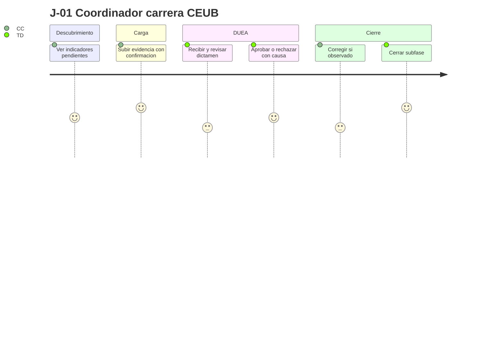
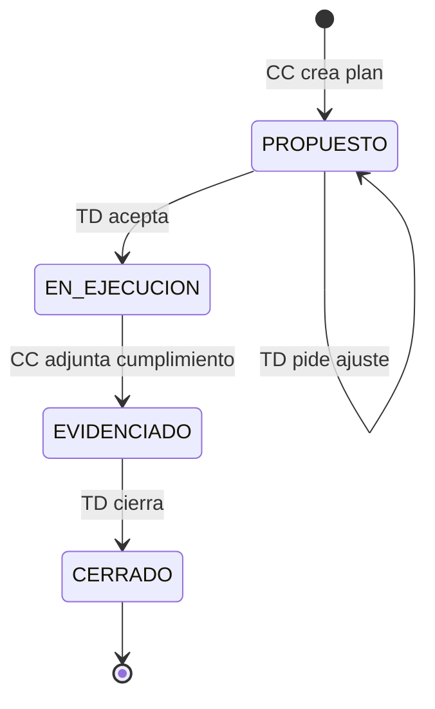

# User Journeys — SIGESA / AcredIA · UMSS

| Metadato | Valor |
|----------|-------|
| **Producto** | SIGESA — Sistema de Evaluación y Acreditación de Carreras |
| **Institución** | Universidad Mayor de San Simón (UMSS) · DUEA |
| **Versión** | v1.0 |
| **Fecha** | 14/05/2026 |
| **Documento padre** | `docs/03_prd/PRD.md` |
| **Historias relacionadas** | `docs/03_prd/user_stories.md` |
| **Segmentos MRD** | S1 operativo carrera · S2 DUEA · S3 gobierno · S4 comunidad |
| **Total journeys** | 6 (`J-01` … `J-06`) |

---

## 1. Propósito y convenciones

Un **user journey** describe la experiencia **end-to-end** de un actor en un contexto real (convocatoria CEUB, visita de auditoría, consulta pública), no solo una pantalla aislada. Sirve para:

- Diseño UX y pruebas de aceptación por flujo completo.
- Alineación con **JTBD** del MRD (`docs/02_mrd/MRD.md`).
- Priorización de **PRD-US-xxx** por valor percibido en el tiempo.

### 1.1 Estructura de cada journey

| Campo | Descripción |
|-------|-------------|
| **ID** | `J-0N` |
| **Nombre** | Título orientado al resultado del usuario |
| **Segmento MRD** | S1, S2, S3 o S4 |
| **Actores** | Roles UMSS involucrados |
| **Trigger** | Evento que inicia el recorrido |
| **PRD-US** | Historias que materializan el journey |
| **FSD-UC** | Casos de uso principales |

### 1.2 Escala emocional (opcional por etapa)

`++` muy positivo · `+` positivo · `0` neutro · `-` negativo · `--` muy negativo (estado *antes* de SIGESA vs *con* SIGESA).

---

## 2. Mapa de journeys

| ID | Nombre | Segmento | Actor principal | PRD-US clave | FSD-UC |
|----|--------|----------|-----------------|--------------|--------|
| J-01 | Cierre de evidencia bajo plazo CEUB | S1–S2 | [CC], [TD] | 003–008, 013, 014 | UC-002, UC-003 |
| J-02 | Transparencia ante empleador / egresado | S4 | [P] | 016, 017 | Portal §2.1 |
| J-03 | Visión gerencial para Consejo / Vicerrectoría | S3 | [JD] | 009, 010, 011 | UC-004, UC-005 |
| J-04 | Puesta en marcha de ciclo de acreditación | S2 | [JD], [TD] | 002, 019 | UC-003, T-012 |
| J-05 | Cola diaria de revisión técnica DUEA | S2 | [TD] | 006, 014, 015 | UC-003, T-008 |
| J-06 | Plan de mejora post-observación | S1–S2 | [CC], [TD] | 008, 021 | §2.1 LFSD |

---

## 3. Journey J-01 — Cierre de evidencia bajo plazo CEUB

| Campo | Valor |
|-------|-------|
| **Segmento** | S1 (coordinación carrera) + S2 (DUEA) |
| **JTBD ref.** | S1-J1, S1-J2, S2-J1 (MRD) |
| **Trigger** | Publicación de cronograma de convocatoria CEUB con fechas límite por subfase |
| **Meta del journey** | Entregar paquete de evidencias válidas y cerrar subfases sin reprocesos de última hora |

### 3.1 Etapas del recorrido

| # | Etapa | Objetivo | Interacción SIGESA | Dolor previo | Mitigación SIGESA | Emoción (antes → después) | PRD-US |
|---|-------|----------|-------------------|--------------|-------------------|---------------------------|--------|
| 1 | Descubrimiento | Saber qué falta | [CC] abre dashboard de carrera: indicadores pendientes / observados / vencidos | Lista dispersa en correos | Vista única por indicador y estado | `-` → `+` | 003, 009 |
| 2 | Preparación | Reunir archivos conformes | [CC] consulta requisitos del indicador (plantilla/guía) | Formatos inconsistentes | Requisitos visibles antes de subir | `0` → `+` | 019 |
| 3 | Carga | Registrar evidencia oficial | [CC] sube PDF/DOCX/XLSX + descripción; barra de progreso; confirmación `vN` | “¿Llegó el archivo?” | Confirmación + log + notificación [TD] | `-` → `++` | 003, 005, 014 |
| 4 | Revisión | Obtener dictamen | [TD] recibe alerta; abre cola; aprueba o rechaza con causa ≥ 20 caracteres | WhatsApp sin trazabilidad | Causa obligatoria y auditoría | `-` → `+` | 006, 014 |
| 5 | Corrección | Cerrar observación | [CC] lee observación vinculada; sube `v2` | Hilos de correo interminables | Hilo por indicador + historial versiones | `-` → `+` | 004, 008 |
| 6 | Cierre parcial | Avanzar subfase | [TD] valida que todos los indicadores estén aprobados; autoriza avance | Reuniones para “destrabar” | Bloqueo automático si falta indicador (`RB-03`) | `0` → `++` | 007 |

### 3.2 Diagrama de flujo (journey)

### 3.3 KPIs del journey

| KPI | Meta | Fuente |
|-----|------|--------|
| Tiempo carga → primera respuesta [TD] | Tendencia ↓ vs línea base | Logs + cola notificaciones |
| Tasa rechazo por formato/tamaño | < 15 % del total de cargas | Auditoría rechazos |
| CSAT [CC] post-carga | ≥ 4/5 en piloto | Encuesta corta |
| Ciclo observación → nueva versión | Mediana documentada | Timestamps en BD |

### 3.4 Criterios de éxito del journey

- [ ] Ninguna evidencia “oficial” queda fuera del sistema en carrera piloto.
- [ ] 100 % de rechazos con justificación trazable.
- [ ] [TD] no usa correo como canal primario de dictamen.

---

## 4. Journey J-02 — Transparencia ante empleador o egresado

| Campo | Valor |
|-------|-------|
| **Segmento** | S4 (comunidad / externos) |
| **JTBD ref.** | S4-J1 (MRD) |
| **Trigger** | Empleador o egresado necesita verificar estado de acreditación de una carrera UMSS |
| **Meta** | Obtener información **oficial** sin filas ni rumores |

### 4.1 Etapas

| # | Etapa | Objetivo | Interacción SIGESA | Dolor previo | Mitigación | PRD-US |
|---|-------|----------|-------------------|--------------|------------|--------|
| 1 | Acceso | Confiar en la fuente | [P] entra a portal institucional (dominio UMSS) | PDFs por WhatsApp | Solo datos **publicados** por [JD] | 016 |
| 2 | Búsqueda | Encontrar la carrera | Búsqueda por nombre / facultad | Datos contradictorios | Un resultado claro por carrera | 016 |
| 3 | Verificación | Entender el estado | Pantalla: estado, vigencia, leyenda ciudadana | Rumores en redes | Fecha de última actualización visible | 016 |
| 4 (opc.) | Constancia | Descargar documento | Descarga PDF publicado oficialmente | Ventanilla presencial | PRD-US-017 si política lo habilita | 017 |

### 4.2 KPIs

| KPI | Meta |
|-----|------|
| Tasa de abandono en portal | < 40 % en búsqueda exitosa |
| Tiempo medio en página de resultado | ≥ 30 s (lectura informada) |
| Consultas presenciales repetidas | Tendencia ↓ post-lanzamiento |

**Reglas:** `RB-07` — solo contenido aprobado para publicación externa.

---

## 5. Journey J-03 — Visión gerencial para Consejo o Vicerrectoría

| Campo | Valor |
|-------|-------|
| **Segmento** | S3 (gobierno académico) + S2 |
| **JTBD ref.** | S3-J1 (MRD) |
| **Trigger** | Convocatoria a Consejo Universitario o solicitud de estado de avance por facultad |
| **Actor principal** | [JD] |
| **Meta** | Responder “¿dónde estamos?” en ≤ 2 minutos con datos defendibles |

### 5.1 Etapas

| # | Etapa | Objetivo | Interacción SIGESA | PRD-US |
|---|-------|----------|-------------------|--------|
| 1 | Acceso | Entrar sin fricción | Login @umss.edu.bo → dashboard jefatura | 001 |
| 2 | Panorama | Ver riesgo global | Semáforos por carrera; filtros facultad / CEUB / gestión | 009, 010 |
| 3 | Profundización | Explicar una carrera en rojo | Drill-down: % avance, indicadores pendientes, alertas | 009 |
| 4 | Comunicación formal | Llevar evidencia a acta | Generar PDF ejecutivo ≤ 5 min; marca uso interno | 011 |
| 5 (opc.) | Distribución controlada | Compartir fuera de DUEA | Solo con autorización explícita [JD] | 011 |

### 5.2 KPIs

| KPI | Meta |
|-----|------|
| Tiempo login → vista útil dashboard | ≤ 2 min (LFSD UC-004) |
| P95 generación PDF | ≤ 5 min (NFR-002) |
| CSAT [JD] dashboard | ≥ 8,5/10 (referencia piloto Hi-Fi) |

**Reglas:** `RB-07`, `RB-09`.

---

## 6. Journey J-04 — Puesta en marcha de ciclo de acreditación

| Campo | Valor |
|-------|-------|
| **Segmento** | S2 |
| **Trigger** | Inicio de gestión académica con nuevas carreras en convocatoria CEUB o ARCU-SUR |
| **Actores** | [JD], [TD] |
| **Meta** | Proceso activo correctamente configurado sin duplicar procesos del mismo tipo (`BR-013`) |

### 6.1 Etapas

| # | Etapa | Objetivo | Interacción SIGESA | PRD-US |
|---|-------|----------|-------------------|--------|
| 1 | Configuración | Alta de usuarios y roles | [JD] asigna [CC]/[TD] a carreras | 002 |
| 2 | Plantilla | Seleccionar taxonomía | Versión plantilla CEUB o ARCU-SUR; anclaje a proceso | 019 |
| 3 | Activación | Abrir proceso por carrera | Tipo, organismo, gestión, fechas (`RB-08`) | 019, 007 |
| 4 | Validación ARCU | Verificar prerrequisito CEUB | Sistema valida `RB-01` si tipo = ARCU-SUR | — |
| 5 | Comunicación | Avisar a [CC] | Notificación inicio de ciclo y plazos | 013 |

### 6.2 Criterios de éxito

- [ ] Un solo proceso activo CEUB (o ARCU-SUR) por carrera y periodo.
- [ ] Plantilla versionada auditable.
- [ ] [CC] ve solo su carrera al iniciar sesión.

---

## 7. Journey J-05 — Cola diaria de revisión técnica DUEA

| Campo | Valor |
|-------|-------|
| **Segmento** | S2 |
| **JTBD ref.** | S2-J1, S2-J2 |
| **Trigger** | Inicio de jornada laboral [TD] o pico post-deadline de carga |
| **Actor principal** | [TD] |
| **Meta** | Priorizar revisiones y localizar documentos en minutos, no en horas |

### 7.1 Etapas

| # | Etapa | Objetivo | Interacción SIGESA | PRD-US |
|---|-------|----------|-------------------|--------|
| 1 | Priorización | Saber por dónde empezar | Panel global: cola por fecha límite / semáforo rojo | 009 (vista TD), 015 |
| 2 | Localización | Encontrar evidencia | Buscador por carrera, facultad, gestión (P95 ≤ 3 s) | 015 |
| 3 | Análisis | Revisar versión vigente | Historial versiones; descarga; comparar metadatos | 004 |
| 4 | Dictamen | Aprobar o rechazar | Justificación obligatoria en rechazo | 006 |
| 5 | Seguimiento | Cerrar el día | Log de acciones del día exportable | 018 |

### 7.2 KPIs

| KPI | Meta |
|-----|------|
| Tiempo localización documento | ≤ 2 min (KPI institucional) |
| Notificación nueva carga → bandeja [TD] | ≤ 15 min |
| Productividad dictámenes / día | Baseline + mejora en piloto |

---

## 8. Journey J-06 — Plan de mejora post-observación

| Campo | Valor |
|-------|-------|
| **Segmento** | S1–S2 |
| **Trigger** | Indicador rechazado o observación metodológica que exige mejora estructural |
| **Actores** | [CC], [TD] |
| **Meta** | Cerrar ciclo de mejora más allá de una nueva versión de archivo |

### 8.1 Etapas

| # | Etapa | Objetivo | Interacción SIGESA | PRD-US |
|---|-------|----------|-------------------|--------|
| 1 | Diagnóstico | Entender la observación | [CC] lee texto [TD] en indicador rechazado | 008 |
| 2 | Planificación | Definir acciones | [CC] crea plan: acciones, responsables, plazos | 021 |
| 3 | Validación | Alinear con DUEA | [TD] aprueba o pide ajuste al plan | 021 |
| 4 | Ejecución | Implementar en carrera | Acciones en facultad (fuera del sistema) | — |
| 5 | Evidencia | Demostrar cumplimiento | [CC] adjunta evidencia de cierre | 003, 021 |
| 6 | Cierre | Archivar mejora | [TD] marca plan **Cerrado**; auditoría | 021 |

### 8.2 Diagrama de estados (plan de mejora)

---

## 9. Journey complementario — Decano en solo lectura (S3)

| Campo | Valor |
|-------|-------|
| **ID informal** | J-03b (extensión de J-03) |
| **Actor** | [DC] |
| **PRD-US** | 020 |
| **Recorrido** | Login → filtro automático por facultad → semáforos agregados → sin descarga de contenido sensible → sin acciones de dictamen |

**Valor:** priorizar apoyo presupuestario o humano a carreras en rojo sin interferir en validación DUEA.

---

## 10. Trazabilidad journeys ↔ historias ↔ casos de uso

| Journey | PRD-US (todas) | FSD-UC | Diagrama Mermaid |
|---------|----------------|--------|------------------|
| J-01 | 003–008, 013, 014 | UC-002, UC-003 | `docs/07_diagramas/UC02_*`, `UC03_*` |
| J-02 | 016, 017 | Portal | — |
| J-03 | 001, 009–011 | UC-004, UC-005 | `UC04` dashboard |
| J-04 | 002, 019 | UC-003, T-012 | `UC03_estado` proceso |
| J-05 | 004, 006, 014, 015, 018 | UC-003, T-008 | `UC03_secuencia` |
| J-06 | 008, 021 | §2.1 | `adicionales/D-ACT-001-*` |

---

## 11. Uso en diseño y QA

| Actividad | Cómo usar este documento |
|-----------|-------------------------|
| **UX / UI** | Prototipar por etapa; validar mensajes `RB-10` en puntos de error |
| **QA E2E** | Un script Playwright por journey crítico (J-01, J-03 mínimo) |
| **Capacitación DUEA** | Guion de taller por journey para [CC] y [TD] |
| **Métricas** | Dashboard de producto con KPIs por journey en `docs/09_trazabilidad/` |

---

## 12. Registro de cambios

| Versión | Fecha | Cambio |
|---------|-------|--------|
| v1.0 | 14/05/2026 | Seis journeys + extensión [DC]; alineación PRD-US y MRD S1–S4 |

---

*Documento canónico de experiencia de usuario. Mantener coherencia con `docs/03_prd/user_stories.md` y `docs/03_prd/roadmap.md`.*
