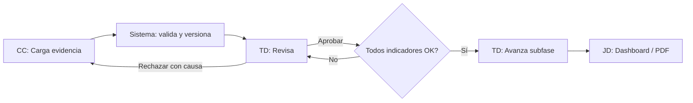
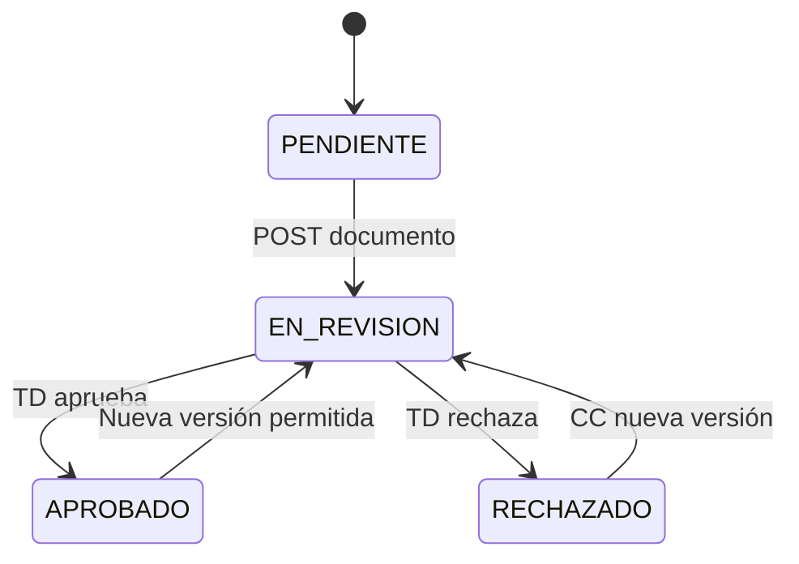
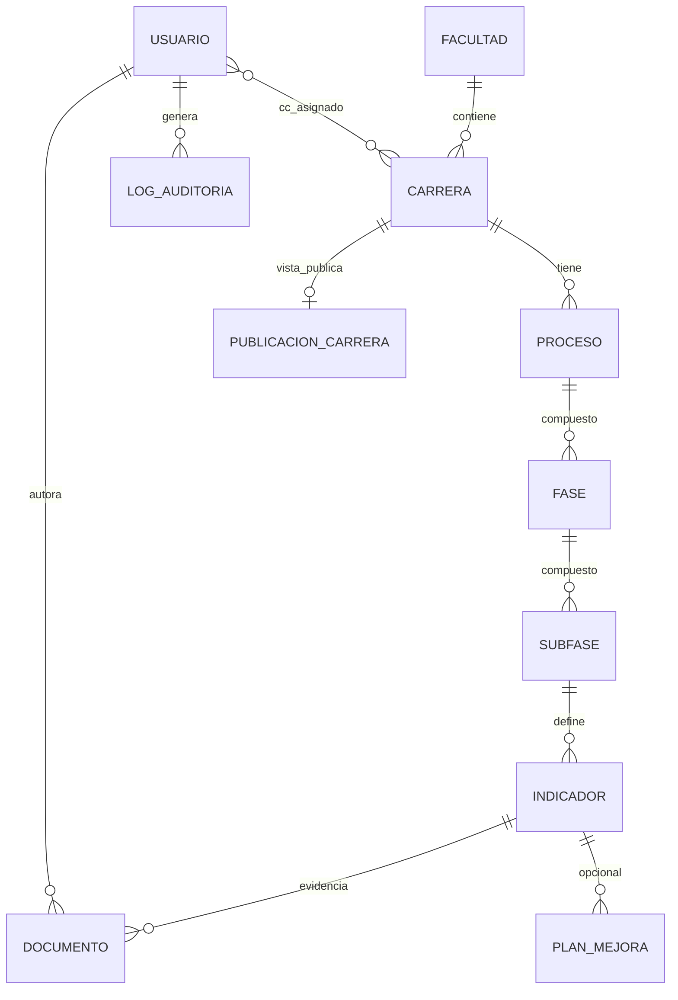
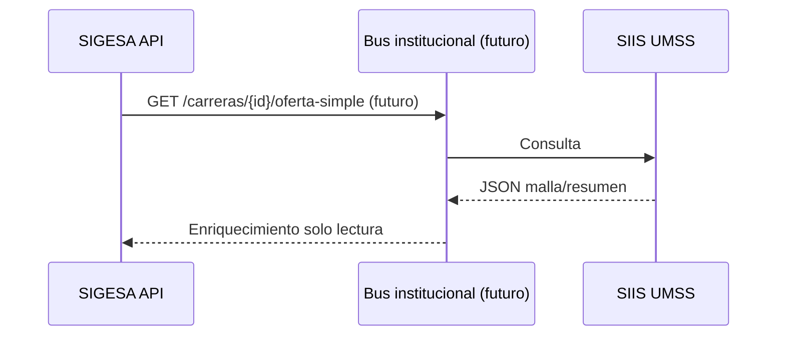

# Functional Specification Document (FSD)

## SIGESA / AcredIA — Sistema de Evaluación, Aseguramiento de la Calidad y Acreditación de Carreras

**Universidad Mayor de San Simón (UMSS)** · DUEA

---

## 0. Control documental y convenciones

| Campo | Valor |
|-------|-------|
| **Documento** | FSD técnico–funcional empresarial |
| **Versión** | v1.0 |
| **Fecha** | 14/05/2026 |
| **Estado** | Borrador para validación arquitectura / QA / TI UMSS |
| **Audiencia** | Analistas funcionales, arquitectos, desarrolladores, QA, DevOps, CISO delegado, sponsor DUEA |
| **Trazabilidad BRD** | `docs/BRD_v1.md` · `docs/BRD_SIGESA_Institucional_Completo.md` |
| **Trazabilidad PRD** | `03_prd/PRD_SIGESA_Institucional_Completo_v1.md` |
| **Documento predecesor interno** | `docs/LFSD.md` · `docs/FSD_v1.md` |
| **Versión API** | `v1` (prefijo URI `/api/v1`) |
| **Roles** | **[CC]** Coordinador/a · **[TD]** Técnico/a DUEA · **[JD]** Jefatura DUEA · **[P]** Público · **[DC]** Decano lectura (evolutivo) · **[EE]** Evaluador externo (evolutivo) |

**Convenciones:** UUID en formato RFC 4122; timestamps en ISO-8601 UTC (`Z`); enumeraciones en `SCREAMING_SNAKE_CASE`; códigos de error `SIGESA_<DOMINIO>_<N>`.

---

## Índice

1. [Introducción y propósito](#1-introducción-y-propósito-del-documento)  
2. [Contexto institucional y problemática](#2-contexto-institucional-y-problemática-actual)  
3. [Objetivos funcionales y del sistema](#3-objetivos-funcionales-y-del-sistema)  
4. [Alcance funcional y no funcional](#4-alcance-funcional-y-no-funcional)  
5. [Arquitectura funcional general](#5-arquitectura-funcional-general-del-sistema)  
6. [Módulos principales](#6-descripción-de-módulos-principales)  
7. [Catálogo de ≥35 elementos funcionales y técnicos](#7-catálogo-de-elementos-funcionales-y-técnicos-e-35)  
8. [Actores, roles y matriz de permisos](#8-actores-roles-y-matriz-de-permisos)  
9. [Diagramas de proceso](#9-diagramas-y-procesos-principales)  
10. [Casos de uso](#10-casos-de-uso-desarrollados)  
11. [Reglas de negocio](#11-reglas-de-negocio-formales)  
12. [Escenarios BDD (Gherkin)](#12-escenarios-bdd-gherkin-funcionalidades-críticas)  
13. [Requerimientos funcionales trazables](#13-requerimientos-funcionales-detallados-y-trazables)  
14. [Requerimientos no funcionales](#14-requerimientos-no-funcionales)  
15. [Modelo conceptual y lógico de datos](#15-modelo-conceptual-y-lógico-de-datos)  
16. [Diccionario de datos](#16-diccionario-de-datos-detallado)  
17. [Entidades y relaciones](#17-diseño-de-entidades-y-relaciones-principales)  
18. [Contratos API REST](#18-contratos-api-rest)  
19. [Integración con sistemas institucionales](#19-flujos-de-integración-con-sistemas-institucionales)  
20. [Validaciones y restricciones](#20-validaciones-funcionales-y-restricciones-de-negocio)  
21. [Manejo de errores](#21-manejo-de-errores-y-excepciones-del-sistema)  
22. [Trazabilidad RF–UC–RB](#22-trazabilidad-entre-requerimientos-casos-de-uso-y-reglas-de-negocio)  
23. [KPIs y métricas operativas](#23-kpis-funcionales-y-métricas-operativas)  
24. [Estrategia de pruebas](#24-estrategia-de-pruebas-funcionales)  
25. [Criterios de aceptación del sistema](#25-criterios-de-aceptación-del-sistema)  
26. [Riesgos técnicos y funcionales](#26-riesgos-técnicos-y-funcionales)  
27. [Supuestos y dependencias](#27-supuestos-y-dependencias-del-proyecto)  
28. [Glosario](#28-glosario-técnico-y-funcional)  
29. [Anexos y referencias](#29-anexos-técnicos-y-referencias)  
30. [Recomendaciones de implementación](#30-recomendaciones-finales-y-consideraciones-de-implementación)

---

## 1. Introducción y propósito del documento

### 1.1 Propósito

Este FSD especifica el comportamiento del sistema SIGESA a nivel que permita: **análisis de gap**, **diseño de software**, **estimación**, **implementación**, **pruebas** (unitarias, integración, sistema, UAT) y **operación**. Es el documento de **verdad funcional–técnica** entre el negocio (BRD/PRD) y el código (repositorios, OpenAPI, ADRs).

### 1.2 Alcance del FSD

Cubre **comportamiento observable**, **interfaces de servicio** (REST), **modelo de datos lógico**, **reglas de negocio ejecutables**, **calidad no funcional** y **estrategia de verificación**. No sustituye manuales de usuario finales ni contratos legales con terceros.

### 1.3 Relación con otros artefactos

| Artefacto | Rol |
|-----------|-----|
| BRD | Restricciones y reglas institucionales |
| PRD | *Backlog* y priorización (PRD-US-xxx) |
| **FSD (este)** | Especificación verificable |
| OpenAPI/Swagger | Generación a partir de §18 (recomendado) |
| ADR | Decisiones arquitectónicas puntuales |

---

## 2. Contexto institucional y problemática actual

La UMSS, por mandato de calidad y marcos **CEUB** y **ARCU-SUR**, debe producir y defender **evidencias** (planes, mallas, resultados de aprendizaje, infraestructura, vinculación, etc.) en ciclos con **plazos externos**. La problemática actual incluye: dispersión en Excel/correo/WhatsApp, **amnesia de versiones**, búsquedas largas (>20 min/sesión referencial), reportes manuales para autoridades y riesgo de **observaciones** por debilidad documental o de trazabilidad.

SIGESA digitaliza el **flujo de valor**: captura → validación → decisión → reporte → publicación controlada.

---

## 3. Objetivos funcionales y del sistema

| ID | Objetivo funcional | Medición |
|----|-------------------|----------|
| OF-1 | Toda evidencia obligatoria ingresa por canales auditables del sistema | % evidencias vía API carga vs fuera |
| OF-2 | Toda decisión de [TD] queda con actor, timestamp y causa (si rechazo) | Cobertura log |
| OF-3 | [JD] obtiene estado consolidado sin compilación manual | Tiempo a dashboard |
| OF-4 | Comunidad consume solo información **publicada** | 0 fugas de borrador en portal |
| OF-5 | El sistema soporta auditoría externa con export estructurado | UAT auditoría simulada |

---

## 4. Alcance funcional y no funcional

### 4.1 Funcional (v1.0 núcleo)

Autenticación dominio UMSS; RBAC; CRUD usuarios [JD]; procesos por carrera CEUB/ARCU-SUR; fases/subfases/indicadores; carga y versionado de documentos; aprobación/rechazo; avance de subfase; dashboard y reportes PDF; notificaciones SMTP; buscador; auditoría; portal público consulta; certificados publicados; respaldos; (opcional) plan de mejora.

### 4.2 No funcional (resumen; detalle §14)

Seguridad (JWT, TLS, RBAC, OWASP ASVS objetivo), rendimiento (P95 búsqueda, PDF), disponibilidad (SLO mensual), escalabilidad (S3, stateless API), auditoría append-only, accesibilidad WCAG 2.1 AA progresivo, integridad referencial y de archivos (hash).

### 4.3 Fuera de alcance v1

Integración tiempo real SIIS/RRHH/ERP; pagos; IA autónoma; rankings internacionales.

---

## 5. Arquitectura funcional general del sistema

### 5.1 Vista C4 nivel contenedor (descriptivo)

```mermaid
C4Context
  title SIGESA - Contenedores (descriptivo)
  Person(cc, "Coordinador", "[CC]")
  Person(td, "Técnico DUEA", "[TD]")
  Person(jd, "Jefatura DUEA", "[JD]")
  Person(pub, "Público", "[P]")
  System_Boundary(sig, "SIGESA") {
    Container(web, "SPA Web", "React", "UI autenticada")
    Container(api, "API REST", "Node/Express o FastAPI", "Lógica y reglas")
    ContainerDb(db, "PostgreSQL", "SQL", "Datos transaccionales")
    ContainerBlob(s3, "Object Storage", "S3-compatible", "Binarios evidencia")
    Container(mail, "Notificador", "Worker + SMTP", "Correo UMSS")
  }
  System_Ext(smtp, "SMTP UMSS", "Correo")
  System_Ext(idp, "IdP futuro", "SSO opcional")
  cc --> web
  td --> web
  jd --> web
  pub --> web
  web --> api
  api --> db
  api --> s3
  api --> mail
  mail --> smtp
```

### 5.2 Principios de diseño

- **API stateless** con JWT de corta duración + *refresh* opcional.  
- **Dominios acotados**: Identidad, Catálogo, Proceso/Workflow, Documento, Notificación, Reporting, Auditoría, Público.  
- **Eventos de dominio** para notificaciones y auditoría (*outbox pattern* recomendado).  
- **Idempotencia** en cargas mediante `Idempotency-Key` header opcional (ver §18).

---

## 6. Descripción de módulos principales

| Módulo | Responsabilidad | Expone (API / UI) |
|--------|-----------------|-------------------|
| **M1 Identidad** | Login, JWT, bloqueo intentos | `/auth/*` |
| **M2 Catálogo** | Facultad, carrera, asignación CC | `/facultades`, `/carreras` |
| **M3 Normativa** | Plantilla proceso, fases, indicadores | `/plantillas`, `/procesos`, `/indicadores` |
| **M4 Documentos** | Upload, versiones, metadatos, hash | `/documentos` |
| **M5 Workflow** | Transiciones indicador/subfase | `/indicadores/.../decision`, `/subfases/.../avance` |
| **M6 Notificaciones** | Cola, plantillas email | interno + `/notificaciones` (admin) |
| **M7 Reporting** | PDF, Excel async | `/reportes` |
| **M8 Dashboard** | Agregados, semáforos | `/dashboard/*` |
| **M9 Auditoría** | Append-only, export | `/auditoria/*` |
| **M10 Público** | Consulta sin auth | `/publico/*` |
| **M11 Operación** | Health, backups | `/health`, `/admin/backups` |

---

## 7. Catálogo de elementos funcionales y técnicos (E-35)

Cada **elemento** es una unidad verificable de producto o plataforma. Los IDs facilitan revisiones cruzadas con QA.

| ID | Elemento | Tipo | Descripción resumida | UC | RF |
|----|----------|------|----------------------|----|----|
| E-01 | Política dominio email @umss.edu.bo | Seguridad | Rechazo login si dominio inválido | UC-01 | FR-001 |
| E-02 | Hash bcrypt de contraseña | Seguridad | Almacenamiento no reversible | UC-01 | FR-001 |
| E-03 | JWT access + opcional refresh | Seguridad | Claims: sub, rol, carreraIds | UC-01 | FR-002 |
| E-04 | Bloqueo por intentos fallidos | Seguridad | Ventana temporal configurable | UC-01 | FR-003 |
| E-05 | CRUD usuario [JD] | Funcional | Alta/baja/modificación rol | UC-01 | FR-004 |
| E-06 | Asignación CC↔carrera | Funcional | Cardinalidad N:M controlada | UC-01 | FR-005 |
| E-07 | Plantilla normativa versionada | Funcional | Proceso anclado a versión | UC-10 | FR-006 |
| E-08 | Creación proceso CEUB/ARCU-SUR | Funcional | Metadatos RB-08 | UC-10 | FR-007 |
| E-09 | Validación ARCU-SUR requiere CEUB | Negocio | RB-01 enforce en API | UC-10 | FR-008 |
| E-10 | Un solo proceso activo duplicado | Negocio | BR-013 / RB duplicado | UC-10 | FR-009 |
| E-11 | Upload multipart documento | Funcional | Límite MB, MIME | UC-02 | FR-010 |
| E-12 | Cálculo SHA-256 archivo | Integridad | Almacenado en DOCUMENTO | UC-02 | FR-011 |
| E-13 | Almacenamiento objeto privado | Técnico | Key por tenant UMSS | UC-02 | FR-012 |
| E-14 | Versionado monotónico por indicador | Funcional | max(version)+1 | UC-02 | FR-013 |
| E-15 | Transición a EN_REVISION | Funcional | Post carga exitosa | UC-02 | FR-014 |
| E-16 | Notificación async carga | Funcional | Cola + reintentos | UC-06 | FR-015 |
| E-17 | Panel cola revisión [TD] | UX/Funcional | Orden por fecha límite | UC-03 | FR-016 |
| E-18 | Aprobación sin texto adicional | Funcional | Log APROBACION | UC-03 | FR-017 |
| E-19 | Rechazo con justificación ≥20 | Negocio | Validación API | UC-03 | FR-018 |
| E-20 | Bloqueo cierre subfase incompleta | Negocio | RB-03 | UC-03 | FR-019 |
| E-21 | Avance subfase siguiente | Funcional | Transacción DB | UC-03 | FR-020 |
| E-22 | Cálculo % avance carrera | Funcional | RB-09 fórmula configurable | UC-04 | FR-021 |
| E-23 | Semáforo por umbrales | Funcional | Verde/Amarillo/Rojo | UC-04 | FR-022 |
| E-24 | WebSocket o polling dashboard | Técnico | Consistencia eventual | UC-04 | FR-023 |
| E-25 | Filtros facultad/tipo/gestión | Funcional | Query params | UC-04 | FR-024 |
| E-26 | Job generación PDF | Técnico | Async + estado job | UC-05 | FR-025 |
| E-27 | Plantilla PDF institucional | Funcional | Logo UMSS, metadatos | UC-05 | FR-026 |
| E-28 | Búsqueda full-text + filtros | Técnico | Índice Postgres/pg_trgm | UC-07 | FR-027 |
| E-29 | Portal público solo publicados | Seguridad | Vista materializada o flag | UC-08 | FR-028 |
| E-30 | Certificado PDF público | Funcional | Marca agua opcional | UC-08 | FR-029 |
| E-31 | Export CSV auditoría | Funcional | Paginación cursor | UC-09 | FR-030 |
| E-32 | Log append-only | Integridad | Sin UPDATE/DELETE | UC-09 | FR-031 |
| E-33 | Job backup DB + objeto | Operación | Cron + estado | UC-11 | FR-032 |
| E-34 | Plan de mejora vinculado | Funcional | Estados propuesto/cerrado | UC-12 | FR-033 |
| E-35 | Rate limit API pública | Seguridad | Throttle /publico | UC-08 | FR-034 |

*(RF-035 reservado extensión API webhooks v2.)*

---

## 8. Actores, roles y matriz de permisos

### 8.1 Actores

| Actor | Tipo | Descripción |
|-------|------|-------------|
| [CC] | Humano | Coordinación de carrera |
| [TD] | Humano | Validación técnica DUEA |
| [JD] | Humano | Administración y reporting |
| [P] | Humano | Consulta sin sesión |
| [DC] | Humano | Lectura facultad (fase 2) |
| Notificador | Sistema | Worker SMTP |
| Auditor | Sistema | Inserción log |

### 8.2 Matriz de permisos (recursos × rol)

Leyenda: **C** crear, **R** leer, **U** actualizar, **D** borrar lógico, **X** ejecutar (transición), **—** prohibido.

| Recurso / acción | [CC] | [TD] | [JD] | [P] | [DC] |
|------------------|------|------|------|-----|------|
| Usuario | — | — | CRUD | — | — |
| Proceso carrera propia | R | R | CRU | — | R* |
| Proceso otras carreras | — | R | R | — | — |
| Documento carga | C/U* | — | R | — | — |
| Decisión indicador | — | X | R | — | — |
| Avance subfase | — | X | R | — | — |
| Dashboard global | — | R | R | — | R* |
| Reporte PDF | — | — | X | — | — |
| Auditoría export | — | R** | R | — | — |
| Portal estado | — | — | U*** | R | R |
| Backup status | — | — | R | — | — |

\* Solo versiona sobre sus indicadores; no borra aprobados. \*\* Lectura acotada si política lo permite. \*\*\* Publicación portal solo [JD] o delegado.

---

## 9. Diagramas y procesos principales

### 9.1 BPMN simplificado — Ciclo de evidencia



### 9.2 Estados del indicador



---

## 10. Casos de uso desarrollados

> **Formato por UC:** Nombre, objetivo, actores, precondiciones, flujo principal, alternos, excepciones, postcondiciones, reglas.

---

### FSD-UC-001 — Autenticación y sesión institucional

| Campo | Contenido |
|-------|-----------|
| **Objetivo** | Establecer sesión autenticada solo para cuentas UMSS válidas. |
| **Actor principal** | Usuario interno ([CC]/[TD]/[JD]) |
| **Actores secundarios** | Sistema auditoría |
| **Precondiciones** | Usuario dado de alta y `activo=true`. |
| **Disparador** | Envío formulario login. |
| **Flujo principal** | 1) Validar formato email y dominio `@umss.edu.bo`. 2) Verificar credencial. 3) Emitir JWT. 4) Registrar LOGIN en auditoría. 5) Redirigir UI según rol. |
| **Flujos alternativos** | A1 Dominio inválido → `403 AUTH_DOMAIN`. A2 Credencial incorrecta → `401 AUTH_INVALID` (mensaje genérico). A3 Usuario inactivo → `403 AUTH_INACTIVE`. |
| **Excepciones** | E1 Bloqueo por 5 intentos fallidos en 15 min → `429 AUTH_LOCKED`. E2 Falla BD → `503 DB_UNAVAILABLE`. |
| **Postcondiciones** | Sesión válida; traza auditoría. |
| **Reglas** | RB-06 |

---

### FSD-UC-002 — Carga y versionado de evidencia

| Campo | Contenido |
|-------|-----------|
| **Objetivo** | Registrar archivo de evidencia con trazabilidad y notificar revisión. |
| **Actor principal** | [CC] |
| **Secundarios** | [TD], Notificador |
| **Precondiciones** | Sesión [CC]; indicador en `PENDIENTE` o `RECHAZADO`; proceso `EN_PROCESO`. |
| **Flujo principal** | 1) Seleccionar indicador. 2) Adjuntar archivo + descripción. 3) Validar MIME/tamaño. 4) Calcular hash. 5) Subir a objeto. 6) Insertar DOCUMENTO `version++`. 7) Actualizar indicador `EN_REVISION`. 8) Encolar notificación. |
| **Alternos** | A1 Archivo >50MB → error `413 DOC_SIZE`. A2 MIME no permitido → `415 DOC_MIME`. A3 Indicador `APROBADO` → confirmación UI “nueva versión” según política reapertura. |
| **Excepciones** | E1 Falla S3 → rollback transacción DB → `502 STORAGE_ERROR`. |
| **Postcondiciones** | Nueva fila DOCUMENTO; indicador EN_REVISION; evento CARGA en log. |
| **Reglas** | RB-02, RB-04, BR-015 (evidencia ligada a criterio/indicador) |

---

### FSD-UC-003 — Aprobación, rechazo y avance de subfase

| Campo | Contenido |
|-------|-----------|
| **Objetivo** | Registrar dictamen técnico y habilitar avance conforme a completitud. |
| **Actor principal** | [TD] |
| **Secundarios** | [CC], Notificador |
| **Precondiciones** | Indicador `EN_REVISION` con documento vigente. |
| **Flujo principal** | 1) [TD] abre detalle. 2) Descarga vigente. 3) Elige APROBAR o RECHAZAR. 4) Si RECHAZAR capturar justificación ≥20. 5) Persistir decisión. 6) Notificar [CC]. 7) Si todos indicadores subfase APROBADO → habilitar comando “Cerrar subfase / Avanzar”. |
| **Alternos** | A1 Cerrar subfase con pendientes → `409 WF_INCOMPLETE`. |
| **Excepciones** | E1 Concurrencia dos [TD] → optimistic locking `409 WF_CONFLICT`. |
| **Postcondiciones** | Estado indicador/subfase consistente; log APROBACION/RECHAZO. |
| **Reglas** | RB-03, BR-014 |

---

### FSD-UC-004 — Dashboard gerencial y drill-down

| Campo | Contenido |
|-------|-----------|
| **Objetivo** | Visualizar semáforos y avance agregado en ≤2 min. |
| **Actor principal** | [JD] |
| **Secundarios** | — |
| **Precondiciones** | Sesión [JD]; existen procesos. |
| **Flujo principal** | 1) Solicitar `/dashboard/resumen`. 2) Calcular % por RB-09. 3) Aplicar umbrales semáforo. 4) Renderizar tabla + detalle carrera. |
| **Alternos** | A1 Filtros facultad/tipo/gestión. |
| **Excepciones** | Timeout cálculo → cache resultado 5 min + bandera `stale`. |
| **Postcondiciones** | Vista actualizada; opcional log ACCESO_DASHBOARD. |
| **Reglas** | RB-09, RB-10 |

---

### FSD-UC-005 — Generación de reporte ejecutivo PDF

| Campo | Contenido |
|-------|-----------|
| **Objetivo** | Emitir PDF para actas internas en P95 ≤5 min. |
| **Actor principal** | [JD] |
| **Secundarios** | Motor reportes |
| **Precondiciones** | Datos de procesos disponibles. |
| **Flujo principal** | 1) Seleccionar alcance. 2) Crear job `reportes`. 3) Worker genera PDF server-side. 4) Almacenar en objeto temporal con TTL. 5) Notificar descarga lista. |
| **Alternos** | A1 Si >5 min → correo con enlace firmado temporal. |
| **Excepciones** | Falla plantilla → `500 REPORT_TEMPLATE`. |
| **Postcondiciones** | Registro en REPORTE_HISTORICO + auditoría. |
| **Reglas** | RB-07, BR-004 |

---

### FSD-UC-006 — Notificaciones por evento de dominio

| Campo | Contenido |
|-------|-----------|
| **Objetivo** | Entregar alertas críticas en ≤15 min P95. |
| **Actor principal** | Sistema |
| **Secundarios** | [CC], [TD], SMTP UMSS |
| **Precondiciones** | SMTP configurado; plantillas registradas. |
| **Flujo principal** | 1) Evento dominio (CARGA, RECHAZO…). 2) Insert outbox. 3) Worker envía SMTP. 4) Marca ENVIADO o REINTENTO. |
| **Alternos** | Cola diferida en horario no laboral (config). |
| **Excepciones** | SMTP caído → reintentos exponenciales; alerta ops. |
| **Postcondiciones** | Trazabilidad envío. |
| **Reglas** | BR-005 |

---

### FSD-UC-007 — Búsqueda global de documentos

| Campo | Contenido |
|-------|-----------|
| **Objetivo** | Localizar evidencia en P95 ≤2 min operador. |
| **Actor principal** | [TD] |
| **Secundarios** | — |
| **Precondiciones** | Sesión [TD]. |
| **Flujo principal** | 1) Query texto + filtros. 2) Índice FTS + facetas. 3) Paginación cursor. |
| **Alternos** | Export CSV resultados (fase 2). |
| **Excepciones** | Query maliciosa longitud → `400 SEARCH_BAD_QUERY`. |
| **Postcondiciones** | Lista metadatos sin exponer URL firmada larga en log público. |
| **Reglas** | BR-008 |

---

### FSD-UC-008 — Consulta pública de estado de acreditación

| Campo | Contenido |
|-------|-----------|
| **Objetivo** | Permitir a [P] verificar estado oficial sin autenticación. |
| **Actor principal** | [P] |
| **Secundarios** | [JD] (publicación) |
| **Precondiciones** | Carrera con registro `publicado=true` en vista pública. |
| **Flujo principal** | 1) GET público por slug o id. 2) Devolver solo campos públicos. 3) Aplicar rate limit. |
| **Alternos** | Búsqueda por nombre aproximado con límite resultados. |
| **Excepciones** | No publicado → `404 PUBLIC_NOT_FOUND` sin filtrar existencia interna. |
| **Postcondiciones** | Métrica visita (anonimizada). |
| **Reglas** | BR-010, RB-07 |

---

### FSD-UC-009 — Consulta y exportación de auditoría

| Campo | Contenido |
|-------|-----------|
| **Objetivo** | Soportar revisiones internas y simulacros de auditoría externa. |
| **Actor principal** | [JD] |
| **Secundarios** | — |
| **Precondiciones** | Rol [JD]. |
| **Flujo principal** | 1) Filtros fecha/usuario/acción. 2) Paginación. 3) Export CSV firmado o sello tiempo (opcional). |
| **Alternos** | [TD] lectura parcial si política. |
| **Excepciones** | Rango >1 año → forzar async export. |
| **Postcondiciones** | Acceso auditado (meta-auditoría). |
| **Reglas** | BR-009, RB-04 |

---

### FSD-UC-010 — Configuración de proceso y plantilla normativa

| Campo | Contenido |
|-------|-----------|
| **Objetivo** | Instanciar proceso acreditación válido para carrera/gestión. |
| **Actor principal** | [JD] |
| **Secundarios** | — |
| **Precondiciones** | Plantilla CEUB/ARCU-SUR cargada. |
| **Flujo principal** | 1) Validar BR-013. 2) Si ARCU-SUR validar RB-01. 3) Crear PROCESO + clonar estructura fases/indicadores. 4) Asignar [TD] referente opcional. |
| **Alternos** | Clonación desde proceso plantilla “tipo”. |
| **Excepciones** | Violación única proceso activo → `409 PROC_DUPLICATE`. |
| **Postcondiciones** | Proceso EN_PROCESO. |
| **Reglas** | RB-01, RB-05, RB-08, BR-013 |

---

### FSD-UC-011 — Supervisión de respaldos automáticos

| Campo | Contenido |
|-------|-----------|
| **Objetivo** | Visibilidad del último backup DB y objetos. |
| **Actor principal** | [JD] |
| **Secundarios** | Job scheduler / TI |
| **Precondiciones** | Jobs desplegados. |
| **Flujo principal** | 1) GET `/health/backups`. 2) Mostrar última corrida, duración, estado. |
| **Alternos** | Webhook a Teams/ correo TI en fallo. |
| **Excepciones** | Sin permisos → `403`. |
| **Postcondiciones** | — |
| **Reglas** | BR-012 |

---

### FSD-UC-012 — Plan de mejora vinculado a indicador/proceso

| Campo | Contenido |
|-------|-----------|
| **Objetivo** | Gestionar acciones correctivas post-observación. |
| **Actor principal** | [CC] / [TD] |
| **Secundarios** | — |
| **Precondiciones** | Indicador en `RECHAZADO` o política DUEA. |
| **Flujo principal** | 1) [CC] crea ítem plan. 2) [TD] valida y cambia estado hasta CERRADO. 3) Adjuntar evidencia opcional. |
| **Alternos** | — |
| **Excepciones** | — |
| **Postcondiciones** | Trazabilidad en tabla PLAN_MEJORA. |
| **Reglas** | Política calidad UMSS (documento aparte) |

---

## 11. Reglas de negocio formales

| ID | Enunciado formal | Tipo | Origen |
|----|------------------|------|--------|
| **RB-01** | No se puede crear ni activar un proceso `ARCU_SUR` para una carrera si no existe un proceso `CEUB` en estado `ACREDITADO` o equivalente vigente según tabla `proceso` | Política | CEUB/ARCU-SUR |
| **RB-02** | Solo usuarios con rol `CC` asignados a la carrera del indicador pueden crear nuevas filas `documento` para ese indicador | Política | DUEA |
| **RB-03** | La transición de `subfase.estado` a `CERRADA` o `APROBADA` requiere que ∀ indicador obligatorio de la subfase: `indicador.estado = APROBADO` | Normativa | Autoevaluación |
| **RB-04** | No existe operación `DELETE` física sobre `documento` con `estado_aprobacion=APROBADO`; solo `INSERT` de nueva versión | Normativa | Auditoría |
| **RB-05** | Los atributos `fecha_limite_externa` de convocatoria no son editables por roles distintos de `JD` con permiso `NORMATIVA_SUPER` (por defecto: no editables) | Normativa | CEUB |
| **RB-06** | `usuario.email` debe satisfacer `*@umss.edu.bo` para autenticación local | Política | TI UMSS |
| **RB-07** | Los artefactos `reporte_pdf` son clasificación `USO_INTERNO` hasta registro de `autorizacion_distribucion_externa` por [JD] | Política | DUEA |
| **RB-08** | Totodo `proceso` debe tener: `tipo_acreditacion`, `organismo`, `gestion`, `fecha_inicio`, `fecha_fin`, `estado_proceso` | Normativa | BRD |
| **RB-09** | `porcentaje_avance` = función configurable `f(indicadores_totales, indicadores_aprobados, pesos)` documentada en tabla `config_dashboard` | Política | Producto |
| **RB-10** | Mensajes de error API/UI deben incluir `code`, `message` legible y `hint` opcional accionable | UX | FSD |
| **RB-11** | `publicacion.estado_publico` solo puede pasar a `VISIBLE` mediante transición firmada por usuario `JD` | Política | Transparencia |
| **RB-12** | Reintentos máximos de notificación por evento = 5 en ventana 24 h | Operación | NFR |

---

## 12. Escenarios BDD (Gherkin) — funcionalidades críticas

```gherkin
# Autenticación
Característica: Login institucional
  Escenario: Éxito con credenciales UMSS válidas
    Dado un usuario "maria.rojas@umss.edu.bo" activo con rol CC
    Cuando envía POST /api/v1/auth/login con password correcto
    Entonces recibe 200 y un JWT cuyo claim "rol" es "CC"
     Y se registra evento LOGIN en auditoría

  Escenario: Dominio no institucional
    Dado un email "x@gmail.com"
    Cuando envía POST /api/v1/auth/login
    Entonces recibe 403 con código AUTH_DOMAIN

# Carga documento
Característica: Versionado de evidencias
  Escenario: Primera carga exitosa
    Dado indicador I1 en estado PENDIENTE y CC autenticado con acceso a la carrera
    Cuando POST /api/v1/documentos con PDF 2MB y descripcionCambio no vacía
    Entonces respuesta 201 con version 1 y hash SHA-256
     Y indicador I1 pasa a EN_REVISION
     Y existe evento dominio NOTIF_CARGA encolado

  Escenario: Archivo excede tamaño
    Dado mismo contexto
    Cuando POST con archivo 80MB
    Entonces 413 con código DOC_SIZE

# Rechazo técnico
Característica: Dictamen técnico
  Escenario: Rechazo sin justificación suficiente
    Dado indicador EN_REVISION y TD autenticado
    Cuando PATCH decisión RECHAZAR con texto 10 caracteres
    Entonces 422 con código VAL_JUSTIFICATION_SHORT

  Escenario: Rechazo válido
    Dado mismo indicador
    Cuando PATCH decisión RECHAZAR con texto >= 20 caracteres
    Entonces 200 y estado RECHAZADO
     Y CC recibe notificación dentro de SLA
```

---

## 13. Requerimientos funcionales detallados y trazables

| RF-ID | Enunciado | Prioridad | UC principal |
|-------|------------|-----------|----------------|
| FR-001 | El sistema debe validar dominio @umss.edu.bo en autenticación | Must | UC-01 |
| FR-002 | El sistema debe emitir JWT con claims mínimos acordados | Must | UC-01 |
| FR-003 | El sistema debe bloquear tras N intentos fallidos configurables | Must | UC-01 |
| FR-004 | [JD] debe poder administrar usuarios y roles | Must | UC-01 |
| FR-005 | El sistema debe soportar asignación CC–carrera N:M | Must | UC-01 |
| FR-006 | El sistema debe versionar plantillas normativas | Should | UC-10 |
| FR-007 | El sistema debe crear procesos con metadatos RB-08 | Must | UC-10 |
| FR-008 | El sistema debe aplicar RB-01 en API de creación proceso | Must | UC-10 |
| FR-009 | El sistema debe impedir duplicado BR-013 | Must | UC-10 |
| FR-010 | Upload debe validar MIME y tamaño máximo | Must | UC-02 |
| FR-011 | Hash SHA-256 obligatorio por versión | Must | UC-02 |
| FR-012 | Binarios en almacenamiento objeto, no en fila principal | Must | UC-02 |
| FR-013 | Version monotónico por indicador | Must | UC-02 |
| FR-014 | Post-carga estado EN_REVISION | Must | UC-02 |
| FR-015 | Notificación async con outbox | Must | UC-06 |
| FR-016 | Lista de revisión ordenada por criticidad | Must | UC-03 |
| FR-017 | Aprobación registra técnico y timestamp | Must | UC-03 |
| FR-018 | Rechazo exige justificación mínima | Must | UC-03 |
| FR-019 | Cierre subfase valida completitud | Must | UC-03 |
| FR-020 | Avance transaccional de fase | Must | UC-03 |
| FR-021 | Cálculo porcentaje según config | Must | UC-04 |
| FR-022 | Semáforo con tres bandas | Must | UC-04 |
| FR-023 | Actualización dashboard ≤ intervalo T | Must | UC-04 |
| FR-024 | Filtros dashboard persistibles en sesión | Should | UC-04 |
| FR-025 | PDF async con tracking job | Must | UC-05 |
| FR-026 | Plantilla PDF con marca institucional | Must | UC-05 |
| FR-027 | Búsqueda con paginación cursor | Must | UC-07 |
| FR-028 | Portal solo datos publicados | Must | UC-08 |
| FR-029 | Descarga certificado con token de un solo uso opcional | Could | UC-08 |
| FR-030 | Export auditoría paginado | Must | UC-09 |
| FR-031 | Tabla auditoría append-only | Must | UC-09 |
| FR-032 | Job backup diario con estado visible | Must | UC-11 |
| FR-033 | Plan de mejora con estados definidos | Should | UC-12 |
| FR-034 | Rate limit en endpoints públicos | Must | UC-08 |

---

## 14. Requerimientos no funcionales

### 14.1 Seguridad

| NFR-S-# | Requisito | Criterio de aceptación |
|---------|-----------|------------------------|
| NFR-S-1 | Autenticación JWT HS256/RS256 según despliegue | Claves rotadas trimestralmente |
| NFR-S-2 | RBAC en middleware por ruta | Matriz §8.2 sin violaciones en tests |
| NFR-S-3 | TLS 1.2+ obligatorio | Config servidor |
| NFR-S-4 | Cabeceras seguridad HTTP (CSP, HSTS, X-Frame) | Verificación OWASP ZAP baseline |
| NFR-S-5 | Sanitización entrada y límite tamaño body | Tests fuzz básicos |

### 14.2 Rendimiento

| NFR-P-# | Requisito | Objetivo |
|---------|-----------|-----------|
| NFR-P-1 | P95 `/busqueda` | ≤ 3 s carga referencia |
| NFR-P-2 | P95 generación PDF universo UMSS | ≤ 5 min o async |
| NFR-P-3 | Throughput mínimo concurrente CC | Definir en prueba carga (ej. 50 usuarios) |

### 14.3 Disponibilidad

SLO mensual producción **99,0%** inicial (negociar); ventanas mantenimiento anunciadas; RPO/RTO acordados con TI.

### 14.4 Escalabilidad

API **stateless** horizontal; DB con réplica lectura opcional; objetos en bucket con *lifecycle* a política UMSS.

### 14.5 Auditoría

100% acciones `LOGIN`, `CARGA`, `APROBACION`, `RECHAZO`, `AVANCE_FASE`, `PUBLICACION`, `REPORTE` registradas; **sin UPDATE/DELETE** en `log_auditoria`.

### 14.6 Accesibilidad

WCAG 2.1 nivel **AA** en flujos [CC] críticos para v1.1; v1.0 mínimo **A** en formularios.

### 14.7 Integridad de datos

FK `ON DELETE RESTRICT` en núcleo; transacciones en operaciones multi-tabla; checksum archivo.

---

## 15. Modelo conceptual y lógico de datos

### 15.1 Modelo conceptual (entidades negocio)

**Facultad**, **Carrera**, **Usuario**, **Rol**, **ProcesoAcreditación**, **Fase**, **Subfase**, **Indicador**, **DocumentoEvidencia**, **Observación**, **Notificación**, **Reporte**, **PublicaciónCarrera**, **LogAuditoría**, **PlanMejora**, **ConfigDashboard**.

### 15.2 Modelo lógico relacional (resumen)

- `facultad(id, nombre, codigo)`  
- `carrera(id, facultad_id, nombre, codigo, modalidad)`  
- `usuario(id, email, password_hash, rol, activo, creado_en)`  
- `usuario_carrera(usuario_id, carrera_id)` — para [CC]  
- `plantilla(id, tipo, version, json_definicion, vigente_desde)`  
- `proceso(id, carrera_id, plantilla_id, tipo, organismo, gestion, fecha_inicio, fecha_fin, estado)`  
- `fase(id, proceso_id, nombre, orden, estado)`  
- `subfase(id, fase_id, nombre, orden, estado, fecha_limite)`  
- `indicador(id, subfase_id, codigo, nombre, criterio, obligatorio, estado, justificacion_rechazo)`  
- `documento(id, indicador_id, autor_id, version, nombre_archivo, storage_key, mime, tamano, hash, descripcion, creado_en)`  
- `log_auditoria(id, usuario_id, accion, entidad_tipo, entidad_id, metadatos_json, creado_en)`  
- `publicacion_carrera(carrera_id, estado_visible, texto_resumen, publicado_en, publicado_por)`  
- `plan_mejora(id, indicador_id, titulo, estado, creado_por, …)`  

---

## 16. Diccionario de datos detallado

### 16.1 `usuario`

| Atributo | Tipo lógico | Null | Descripción | Validación |
|----------|-------------|------|-------------|------------|
| id | UUID | No | PK | v4 |
| email | VARCHAR(120) | No | Login | `@umss.edu.bo`, único |
| password_hash | VARCHAR(255) | No | Bcrypt | cost ≥12 |
| rol | ENUM_ROL | No | CC/TD/JD/… | dominio |
| activo | BOOLEAN | No | Soft delete | default true |
| creado_en | TIMESTAMPTZ | No | Auditoría | default now() |

### 16.2 `documento`

| Atributo | Tipo lógico | Null | Descripción | Validación |
|----------|-------------|------|-------------|------------|
| id | UUID | No | PK | |
| indicador_id | UUID | No | FK | existe |
| autor_id | UUID | No | FK usuario | rol CC |
| version | INT | No | Monotónico | ≥1 |
| storage_key | VARCHAR(512) | No | Ruta objeto | prefijo tenant |
| hash | CHAR(64) | No | SHA-256 | hex |
| mime | VARCHAR(127) | No | Tipo MIME | whitelist |
| tamano | BIGINT | No | Bytes | ≤ max |
| descripcion | VARCHAR(1000) | No | Cambio | min 1 char |
| creado_en | TIMESTAMPTZ | No | | |

### 16.3 `log_auditoria`

| Atributo | Tipo lógico | Null | Descripción |
|----------|-------------|------|-------------|
| id | BIGSERIAL | No | PK append |
| usuario_id | UUID | Sí | Null si sistema |
| accion | VARCHAR(64) | No | Catálogo |
| entidad_tipo | VARCHAR(64) | No | Ej. INDICADOR |
| entidad_id | UUID | No | |
| metadatos_json | JSONB | Sí | Payload difuminado PII si aplica |
| creado_en | TIMESTAMPTZ | No | Inmutable |

*(Ampliar en implementación con tablas `notificacion_outbox`, `reporte_job`, etc.)*

---

## 17. Diseño de entidades y relaciones principales



---

## 18. Contratos API REST

**Base URL:** `https://sigesa.umss.edu.bo/api/v1`  
**Auth:** `Authorization: Bearer <JWT>` salvo rutas `/publico/*` y `/auth/login`.

### 18.1 POST `/auth/login`

| Aspecto | Especificación |
|---------|----------------|
| **Método** | POST |
| **Descripción** | Autenticación usuario interno |
| **Parámetros** | Body JSON |
| **Request** | `{ "email": "string", "password": "string" }` |
| **Response 200** | `{ "accessToken": "string", "expiresIn": 3600, "usuario": { "id": "uuid", "email": "string", "rol": "CC|TD|JD" } }` |
| **401** | Credenciales inválidas `AUTH_INVALID` |
| **403** | `AUTH_DOMAIN`, `AUTH_INACTIVE` |
| **429** | `AUTH_LOCKED` |
| **Validaciones** | email formato; password no vacío |
| **Seguridad** | Rate limit IP+email; no revelar usuario inexistente vs password incorrecta |

### 18.2 POST `/documentos`

| Aspecto | Especificación |
|---------|----------------|
| **Método** | POST |
| **Content-Type** | `multipart/form-data` |
| **Campos** | `archivo` (file), `indicadorId` (uuid), `descripcionCambio` (string), opcional `Idempotency-Key` (uuid) |
| **201** | `{ "id": "uuid", "version": 2, "hash": "sha256", "indicadorEstado": "EN_REVISION" }` |
| **403** | `DOC_UNAUTHORIZED` |
| **413** | `DOC_SIZE` |
| **415** | `DOC_MIME` |
| **409** | `DOC_INDICATOR_CLOSED` |
| **Seguridad** | JWT rol CC; *scope* carrera |

**Ejemplo request (metadatos):**

```http
POST /api/v1/documentos HTTP/1.1
Authorization: Bearer eyJhbGciOi...
Content-Type: multipart/form-data; boundary=----sigesa

------sigesa
Content-Disposition: form-data; name="indicadorId"

a1b2c3d4-e5f6-7890-abcd-ef1234567890
------sigesa
Content-Disposition: form-data; name="descripcionCambio"

Actualización malla 2026 según Resolución X
------sigesa
Content-Disposition: form-data; name="archivo"; filename="malla.pdf"
Content-Type: application/pdf

(binary)
------sigesa--
```

**Ejemplo response 201:**

```json
{
  "id": "f7c2b0a1-1234-5678-9abc-def012345678",
  "version": 2,
  "hash": "e3b0c44298fc1c149afbf4c8996fb92427ae41e4649b934ca495991b7852b855",
  "indicadorEstado": "EN_REVISION",
  "storageKey": "umss/2026/indicadores/a1b2.../v2.pdf"
}
```

### 18.3 PATCH `/indicadores/{id}/decision`

| Aspecto | Especificación |
|---------|----------------|
| **Método** | PATCH |
| **Request** | `{ "accion": "APROBAR" | "RECHAZAR", "justificacion": "string|null" }` |
| **200** | `{ "indicadorId": "uuid", "estado": "APROBADO|RECHAZADO", "actualizadoEn": "ISO8601" }` |
| **422** | `VAL_JUSTIFICATION_SHORT` |
| **409** | `WF_INVALID_STATE` |
| **Seguridad** | Rol TD |

### 18.4 POST `/subfases/{id}/avance`

| Request | `{ "confirmar": true }` |
|---------|-------------------------|
| **200** | `{ "subfaseId": "uuid", "nuevoEstado": "CERRADA", "siguienteSubfaseId": "uuid|null" }` |
| **409** | `WF_INCOMPLETE` con lista `indicadoresPendientes[]` |

### 18.5 GET `/dashboard/resumen`

| Query | `facultadId`, `tipo`, `gestion` opcionales |
|-------|---------------------------------------------|
| **200** | `{ "items": [ { "carreraId", "nombre", "facultad", "semaforo", "porcentaje", "alertas": [] } ] }` |
| **Seguridad** | JD (y DC filtrado si aplica) |

### 18.6 POST `/reportes/pdf`

| Request | `{ "alcance": "UNIVERSIDAD|FACULTAD|CARRERA", "referenciaId": "uuid|null", "gestion": 2026 }` |
|---------|--------------------------------------------------------------------------------------------------|
| **202** | `{ "jobId": "uuid", "estado": "ENCOLADO" }` |
| **200 sync** | Si implementación síncrona pequeña — opcional |

### 18.7 GET `/busqueda/documentos`

| Query | `q`, `facultadId`, `carreraId`, `gestion`, `cursor`, `limit` |
| **200** | `{ "items": [...], "nextCursor": "string|null" }` |

### 18.8 GET `/publico/carreras/{slugOrId}`

| **200** | `{ "nombre": "Ingeniería ...", "estadoAcreditacion": "ACREDITADA_CEUB", "vigenciaHasta": "2028-12-31", "ultimaActualizacion": "..." }` |
| **404** | `PUBLIC_NOT_FOUND` |
| **429** | Rate limit |

### 18.9 GET `/auditoria/eventos`

| Query | `desde`, `hasta`, `usuarioId`, `accion`, `cursor` |
| **200** | Lista paginada; [JD] completo |

### 18.10 GET `/health/backups`

| **200** | `{ "ultimoDb": { "estado": "OK", "fecha": "..." }, "ultimoObjetos": { ... } }` |

### 18.11 Códigos de error estándar (payload)

```json
{
  "error": {
    "code": "SIGESA_DOC_SIZE",
    "message": "El archivo supera el tamaño máximo permitido (50 MB).",
    "hint": "Comprima el PDF o divida anexos según guía DUEA."
  }
}
```

---

## 19. Flujos de integración con sistemas institucionales

### 19.1 SIIS / académico (v2)



**Nota v1:** sin acoplamiento; importación manual CSV bajo control [JD] opcional.

### 19.2 Correo SMTP UMSS

- Autenticación aplicación con credencial de servicio.  
- SPF/DKIM alineados con dominio emisor `notificaciones@umss.edu.bo` (ejemplo).

### 19.3 IdP / SSO (futuro)

SAML2 u OIDC: mapeo `sub` → `usuario.email`; desactivar password local por cartera institucional.

---

## 20. Validaciones funcionales y restricciones de negocio

| Capa | Validación |
|------|------------|
| API | JSON Schema por endpoint; límites longitud string |
| Dominio | RB-01…RB-12 en servicios |
| BD | CHECK constraints; UNIQUE parcial proceso activo |
| UI | Deshabilitar botones ilegales; mensajes RB-10 |

**Restricciones:** tamaño máximo archivo; tipos MIME; no DELETE documento aprobado; fechas límite externas inmutables (RB-05).

---

## 21. Manejo de errores y excepciones del sistema

| Código HTTP | Código interno | Cuándo |
|--------------|----------------|--------|
| 400 | `VAL_*` | Validación entrada |
| 401 | `AUTH_*` | Token ausente/inválido/expirado |
| 403 | `FORBIDDEN_*` | RBAC |
| 404 | `NOT_FOUND` | Recurso inexistente (sin filtrar existencia en público) |
| 409 | `WF_*` / `PROC_*` | Conflicto negocio |
| 413 | `DOC_SIZE` | Tamaño |
| 422 | `VAL_JUSTIFICATION_SHORT` | Regla negocio explícita |
| 429 | `RATE_LIMIT` / `AUTH_LOCKED` | Abuso |
| 500 | `INTERNAL` | Bug no controlado (log + ticket) |
| 503 | `DB_UNAVAILABLE` / `STORAGE_UNAVAILABLE` | Infra |

**Política:** no exponer stack traces al cliente; correlation-id `X-Request-Id` en cabecera respuesta.

---

## 22. Trazabilidad entre requerimientos, casos de uso y reglas de negocio

| RF | UC | RB / BR |
|----|-----|---------|
| FR-001–003 | UC-01 | RB-06, BR-006 |
| FR-010–014 | UC-02 | RB-02, RB-04 |
| FR-016–020 | UC-03 | RB-03, BR-014 |
| FR-021–024 | UC-04 | RB-09 |
| FR-025–026 | UC-05 | RB-07, BR-004 |
| FR-015 | UC-06 | BR-005 |
| FR-027 | UC-07 | BR-008 |
| FR-028–029 | UC-08 | RB-11, BR-010 |
| FR-030–031 | UC-09 | BR-009 |
| FR-007–009 | UC-10 | RB-01, RB-08, BR-013 |
| FR-032 | UC-11 | BR-012 |
| FR-033 | UC-12 | — |

---

## 23. KPIs funcionales y métricas operativas

| KPI | Definición | Umbral |
|-----|------------|--------|
| K-AUTH-01 | Latencia P95 login | < 300 ms servidor |
| K-DOC-01 | Tasa error 413/415 | < 2% de cargas |
| K-WF-01 | Tiempo medio revisión TD | Tendencia estable |
| K-PDF-01 | % jobs PDF < 5 min | ≥ 95% |
| K-NOTIF-01 | % notif < 15 min | ≥ 99% |
| K-PUB-01 | Incidentes fuga borrador | 0 |

---

## 24. Estrategia de pruebas funcionales

| Nivel | Alcance | Herramientas sugeridas |
|-------|---------|-------------------------|
| Unit | Servicios dominio, validadores RB | xUnit / pytest |
| Integración | API + DB testcontainer + MinIO | pytest + httpx |
| Contrato | OpenAPI vs respuestas reales | Schemathesis / Dredd |
| Sistema | Flujos UC-01…05 E2E | Playwright |
| UAT | Scripts Gherkin §12 | Zephyr / Excel + firmas DUEA |
| Seguridad | OWASP ZAP baseline | CI nocturno |
| Carga | k6 escenario convocatoria | k6 |

**Entrada/salida UAT:** checklist por UC firmado por [JD] y muestra [CC]/[TD].

---

## 25. Criterios de aceptación del sistema

1. Los **12 casos de uso** §10 pasan **UAT** sin defectos P0 abiertos.  
2. **100%** RF `Must` (FR-001–034 salvo Could) implementados o explícitamente aplazados con change request.  
3. Matriz permisos §8.2 sin hallazgos críticos en pentest.  
4. Portal público sin exposición de datos no publicados (prueba negativa).  
5. SLO disponibilidad piloto cumplido en ventana observada.

---

## 26. Riesgos técnicos y funcionales

| ID | Riesgo | Tipo | Mitigación |
|----|--------|------|------------|
| RT-1 | Pérdada de consistencia S3–DB | Técnico | Transacción outbox + compensación |
| RT-2 | Degradación búsqueda con volumen | Técnico | Índices, partición por gestión |
| RF-1 | Malentendido estados indicador | Funcional | Glosario UI + tooltips |
| RF-2 | Expectativa “portal tiempo real” | Funcional | Texto vigencia y fecha actualización |

---

## 27. Supuestos y dependencias del proyecto

**Supuestos:** SMTP estable; certificados TLS válidos; datos maestros carreras limpios; plantillas CEUB/ARCU-SUR validadas por DUEA.

**Dependencias:** proveedor nube; acceso VPN/TI para despliegue; ventanas UAT; aprobación jurídica textos públicos.

---

## 28. Glosario técnico y funcional

| Término | Definición |
|---------|------------|
| CEUB | Evaluación/acreditación universitaria Bolivia |
| ARCU-SUR | Acreditación regional carrera MERCOSUR educativo |
| Indicador | Unidad mínima de evidencia configurable en plantilla |
| Outbox | Tabla de eventos pendientes de envío fiable |
| JWT | Token portador de identidad |
| Semáforo | Representación agregada de riesgo/avance |

---

## 29. Anexos técnicos y referencias

- `docs/LFSD.md` — casos de uso previos y stack.  
- `03_prd/PRD_SIGESA_Institucional_Completo_v1.md` — PRD-US-001…022.  
- OWASP ASVS: https://owasp.org/www-project-application-security-verification-standard/  
- WCAG 2.1: https://www.w3.org/TR/WCAG21/  

---

## 30. Recomendaciones finales y consideraciones de implementación

1. **Generar OpenAPI 3.1** desde este §18 antes del primer sprint de API; evitar deriva documentación–código.  
2. Adoptar **migraciones versionadas** (Flyway/Liquibase) alineadas al modelo §15–16.  
3. Implementar **feature flags** para portal público y plan de mejora, permitiendo despliegue progresivo en facultades piloto Cochabamba (ej. Ciencias y Tecnología, Humanidades).  
4. Establecer **ambientes** DEV / STAGE / PROD con anonimización de datos reales solo en STAGE.  
5. **Observabilidad:** métricas RED/USE, logs estructurados con `trace_id`, dashboards operativos para DUEA+TI conjunto.

---

*Documento FSD SIGESA v1.0 — `04_fsd/FSD_SIGESA_Empresarial_Completo_v1.md` — 14/05/2026.*
