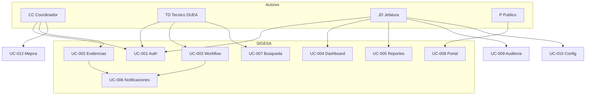

# Casos de uso — SIGESA / AcredIA · UMSS

| Metadato | Valor |
|----------|-------|
| **Producto** | SIGESA — Sistema de Evaluación y Acreditación de Carreras |
| **Institución** | Universidad Mayor de San Simón (UMSS) · DUEA |
| **Versión** | v1.0 |
| **Fecha** | 14/05/2026 |
| **FSD padre** | `team/Marlene/04_fsd/FSD.md` |
| **Fuente canónica LFSD** | `docs/LFSD.md` §4 (UC-001 … UC-005 detallados) |
| **Escenarios Gherkin** | `team/Marlene/04_fsd/gherkin.md` |
| **Reglas de negocio** | `team/Marlene/04_fsd/reglas_negocio.md` |
| **Modelo de datos** | `team/Marlene/04_fsd/modelo_datos.md` |
| **Contratos API** | `team/Marlene/04_fsd/api_contracts.md` |
| **Glosario** | `team/Marlene/04_fsd/glosario.md` |
| **Trazabilidad PRD** | `team/Marlene/03_prd/user_stories.md` |

---

## 1. Propósito y convención de identificación

Este documento especifica el comportamiento funcional de SIGESA en forma de **casos de uso** (`FSD-UC-xxx`), alineados a acreditación **CEUB** y **ARCU-SUR** en la UMSS.

| Convención | Significado |
|------------|-------------|
| **FSD-UC-NNN** | Caso de uso funcional numerado |
| **Actor** | Rol humano `[CC]`, `[TD]`, `[JD]`, `[P]` o sistema |
| **RB / BR** | Regla de negocio (`reglas_negocio.md`) |
| **Pantalla** | Ruta UI según LFSD §9 |

**Formato por caso de uso:** objetivo, actores, precondiciones, disparador, flujo principal, alternos, excepciones, postcondiciones, reglas, datos I/O, trazabilidad PRD.

---

## 2. Actores del sistema

| Actor | Tipo | Casos de uso principales |
|-------|------|--------------------------|
| **[CC]** Coordinador de carrera | Humano | UC-002, UC-008 (observaciones), UC-012 |
| **[TD]** Técnico DUEA | Humano | UC-003, UC-007 |
| **[JD]** Jefatura DUEA | Humano | UC-001 (admin), UC-004, UC-005, UC-009, UC-010, UC-011 |
| **[P]** Público | Humano | UC-008 |
| **Sistema notificaciones** | Sistema | UC-006 |
| **Motor de reportes** | Sistema | UC-005 |

Actores evolutivos (LFSD §3): `[JC]`, `[EE]`, `[DC]` — fuera del alcance detallado v1 salvo lectura agregada en dashboard.

---

## 3. Catálogo de casos de uso

| ID | Nombre | Actor principal | Prioridad | PRD-US | PRD-REQ | Pantalla (ref.) |
|----|--------|-----------------|-----------|--------|---------|-----------------|
| FSD-UC-001 | Autenticación y sesión institucional | Usuario interno | P0 | 001, 002 | REQ-001, 002 | `/login` |
| FSD-UC-002 | Carga y versionado de evidencia | [CC] | P0 | 003–005 | REQ-003, 004 | `/dashboard/coordinador` |
| FSD-UC-003 | Aprobación, rechazo y avance de subfase | [TD] | P0 | 006–008 | REQ-005 | `/dashboard/tecnico` |
| FSD-UC-004 | Dashboard gerencial y drill-down | [JD] | P0 | 009, 010 | REQ-006 | `/dashboard/jefatura` |
| FSD-UC-005 | Generación de reporte ejecutivo PDF | [JD] | P0 | 011 | REQ-007 | `/reportes` |
| FSD-UC-006 | Notificaciones por evento de dominio | Sistema | P0 | 013, 014 | REQ-008 | — (async) |
| FSD-UC-007 | Búsqueda global de documentos | [TD] | P0 | 015 | REQ-009 | `/busqueda` |
| FSD-UC-008 | Consulta pública de estado | [P] | P1 | 016, 017 | REQ-012, 013 | `/portal-publico` |
| FSD-UC-009 | Consulta y exportación de auditoría | [JD] | P0 | 018 | REQ-011 | Admin auditoría |
| FSD-UC-010 | Configuración proceso y plantilla | [JD] | P1 | 019, 002 | REQ-010 | Admin procesos |
| FSD-UC-011 | Supervisión de respaldos automáticos | [JD] | P0 | 022 | REQ-014 | Ops / health |
| FSD-UC-012 | Plan de mejora vinculado | [CC], [TD] | P1 | 021 | REQ-016 | Flujo mejora |

---

## 4. Diagrama de contexto (casos de uso)

---

## 5. Casos de uso detallados

### FSD-UC-001 — Autenticación y sesión institucional

| Campo | Contenido |
|-------|-----------|
| **Objetivo** | Establecer sesión autenticada exclusivamente para cuentas **@umss.edu.bo** activas, con redirección por rol. |
| **Actor principal** | Usuario interno ([CC], [TD], [JD]) |
| **Actores secundarios** | Subsistema auditoría |
| **Trazabilidad** | PRD-REQ-001, PRD-REQ-002 · PRD-US-001, PRD-US-002 |
| **Precondiciones** | Usuario registrado por [JD]; `activo = true`; correo institucional vigente. |
| **Disparador** | Envío del formulario de inicio de sesión. |
| **Flujo principal** | 1) Validar formato y dominio del correo. 2) Verificar credencial (hash). 3) Emitir JWT con `rol` y `carreraId` si aplica. 4) Registrar evento `LOGIN` en auditoría. 5) Redirigir a dashboard según rol. |
| **Flujos alternativos** | **A1** Dominio no `@umss.edu.bo` → `403 AUTH_DOMAIN`. **A2** Credencial incorrecta → `401 AUTH_INVALID` (mensaje genérico). **A3** Usuario inactivo → `403 AUTH_INACTIVE`. |
| **Excepciones** | **E1** Cinco intentos fallidos en ventana → `429 AUTH_LOCKED`. **E2** BD no disponible → `503 DB_UNAVAILABLE`. |
| **Postcondiciones** | Sesión válida; traza en `LOG_AUDITORIA`. |
| **Reglas** | `RB-06` |
| **Entrada** | `email`, `password` |
| **Salida** | JWT, URL de redirección |
| **Diagramas** | `team/Marlene/07_diagramas/UC01_secuencia.mmd`, `UC01_estado.mmd` |
| **Gherkin** | Ver `docs/LFSD.md` §4.1 o `gherkin.md` |

---

### FSD-UC-002 — Carga y versionado de evidencia

| Campo | Contenido |
|-------|-----------|
| **Objetivo** | Registrar evidencia normativa con versionado inmutable y notificar al [TD]. |
| **Actor principal** | [CC] |
| **Actores secundarios** | [TD], UC-006 (notificación) |
| **Trazabilidad** | PRD-REQ-003, 004 · PRD-US-003, 004, 005 |
| **Precondiciones** | Sesión [CC]; indicador en `PENDIENTE` o `RECHAZADO`; proceso `EN_PROCESO`; `indicador_id` obligatorio. |
| **Disparador** | [CC] pulsa “Cargar evidencia” en un indicador. |
| **Flujo principal** | 1) Seleccionar indicador/subfase. 2) Adjuntar archivo + descripción del cambio. 3) Validar MIME (PDF/DOCX/XLSX) y tamaño ≤ 50 MB. 4) Calcular SHA-256. 5) Persistir en almacenamiento objeto. 6) Insertar `DOCUMENTO` con `version++`. 7) Actualizar indicador a `EN_REVISION`. 8) Encolar notificación a [TD]. 9) Mostrar confirmación al [CC]. |
| **Flujos alternativos** | **A1** Archivo > 50 MB → `413 DOC_SIZE` + guía compresión. **A2** MIME inválido → `415 DOC_MIME`. **A3** Indicador `APROBADO` → advertencia y política de nueva versión (`RB-04`). **A4** Timeout de red → reintento sin duplicar versión. |
| **Excepciones** | **E1** Falla almacenamiento → rollback transaccional → `502 STORAGE_ERROR`. |
| **Postcondiciones** | Documento versionado; indicador `EN_REVISION`; evento `CARGA` en auditoría. |
| **Reglas** | `RB-02`, `RB-04`, `BR-015` |
| **Entrada** | `archivo`, `descripcionCambio`, `indicadorId` |
| **Salida** | `{ documentoId, version, hash, estado: EN_REVISION }` |
| **Diagramas** | `team/Marlene/07_diagramas/UC02_secuencia.mmd`, `UC02_estado.mmd` |

---

### FSD-UC-003 — Aprobación, rechazo y avance de subfase

| Campo | Contenido |
|-------|-----------|
| **Objetivo** | Registrar dictamen técnico del [TD] y habilitar cierre de subfase solo con completitud normativa. |
| **Actor principal** | [TD] |
| **Actores secundarios** | [CC], UC-006 |
| **Trazabilidad** | PRD-REQ-005 · PRD-US-006, 007, 008 |
| **Precondiciones** | Indicador en `EN_REVISION` con documento vigente; sesión [TD]. |
| **Disparador** | [TD] abre indicador en panel de auditoría y emite decisión. |
| **Flujo principal** | 1) Listar indicadores en revisión (global o por carrera). 2) Visualizar versiones; marcar vigente. 3) Descargar evidencia. 4) Elegir `APROBAR` o `RECHAZAR`. 5) Si `RECHAZAR`, capturar justificación ≥ 20 caracteres. 6) Persistir estado. 7) Notificar [CC]. 8) Si todos los indicadores requeridos de la subfase están `APROBADO`, habilitar “Cerrar subfase / Avanzar fase”. |
| **Flujos alternativos** | **A1** Cierre con pendientes/rechazados → `409 WF_INCOMPLETE` + lista indicadores. **A2** Rechazo sin justificación → UI bloqueada. **A3** [CC] sube nueva versión → indicador vuelve a `EN_REVISION`. |
| **Excepciones** | **E1** Conflicto de concurrencia → `409 WF_CONFLICT` (optimistic lock). |
| **Postcondiciones** | Estado indicador/subfase coherente; log `APROBACION` / `RECHAZO`. |
| **Reglas** | `RB-02`, `RB-03`, `BR-014`, `BR-013` (proceso único) |
| **Entrada** | `indicadorId`, `accion`, `justificacion?` |
| **Salida** | `{ indicadorId, nuevoEstado, tecnicoId, justificacion? }` |
| **Diagramas** | `team/Marlene/07_diagramas/UC03_secuencia.mmd`, `team/Marlene/07_diagramas/UC03_estado.mmd` |

---

### FSD-UC-004 — Dashboard gerencial y drill-down

| Campo | Contenido |
|-------|-----------|
| **Objetivo** | Ofrecer a [JD] visibilidad agregada con semáforos y detalle por carrera en ≤ 2 min. |
| **Actor principal** | [JD] |
| **Trazabilidad** | PRD-REQ-006 · PRD-US-009, 010 |
| **Precondiciones** | Sesión [JD]; al menos un proceso de acreditación configurado. |
| **Disparador** | Acceso al dashboard principal tras login. |
| **Flujo principal** | 1) Consultar agregados por carrera/facultad. 2) Calcular % avance según `RB-09`. 3) Asignar semáforo Verde (≥80 %), Amarillo (50–79 %), Rojo (<50 % o vencidos). 4) Aplicar filtros facultad / CEUB|ARCU-SUR / gestión. 5) Actualizar vista en tiempo real. 6) Drill-down: fases, indicadores pendientes, alertas. |
| **Flujos alternativos** | **A1** Sin datos en facultad filtrada → estado vacío explicativo. |
| **Excepciones** | **E1** Timeout de agregación → respuesta cacheada ≤ 5 min con flag `stale`. |
| **Postcondiciones** | [JD] informada para decisiones; opcional log de acceso. |
| **Reglas** | `RB-09`, `RB-05`, `RB-10` |
| **Salida** | Lista `{ carreraId, semaforo, porcentajeAvance, alertas[] }` |
| **NFR** | NFR-001, NFR-004 |

---

### FSD-UC-005 — Generación de reporte ejecutivo PDF

| Campo | Contenido |
|-------|-----------|
| **Objetivo** | Generar PDF de uso interno para actas y consejos en P95 ≤ 5 min. |
| **Actor principal** | [JD] |
| **Actores secundarios** | Motor de reportes (worker) |
| **Trazabilidad** | PRD-REQ-007 · PRD-US-011 |
| **Precondiciones** | Datos de avance disponibles en BD. |
| **Disparador** | [JD] configura alcance y pulsa “Generar PDF”. |
| **Flujo principal** | 1) Seleccionar facultad/carrera, tipo, gestión. 2) Previsualizar resumen. 3) Crear job asíncrono. 4) Worker renderiza PDF con marca **USO INTERNO**. 5) Almacenar en objeto con TTL. 6) Habilitar descarga / notificar [JD]. |
| **Flujos alternativos** | **A1** Duración > 5 min → notificación por correo con enlace. |
| **Excepciones** | **E1** Error plantilla → `500 REPORT_TEMPLATE`. |
| **Postcondiciones** | Registro en historial de reportes + auditoría. |
| **Reglas** | `RB-07` |
| **NFR** | NFR-002 |

---

### FSD-UC-006 — Notificaciones por evento de dominio

| Campo | Contenido |
|-------|-----------|
| **Objetivo** | Entregar alertas críticas por correo institucional en ≤ 15 min (P95). |
| **Actor principal** | Sistema (outbox + worker) |
| **Actores secundarios** | [CC], [TD], SMTP UMSS |
| **Trazabilidad** | PRD-REQ-008 · PRD-US-013, 014 |
| **Precondiciones** | SMTP configurado; plantillas aprobadas por DUEA. |
| **Disparador** | Eventos: `CARGA`, `APROBACION`, `RECHAZO`, recordatorios de plazo, etc. |
| **Flujo principal** | 1) Publicar evento en outbox. 2) Worker consume. 3) Renderizar plantilla. 4) Enviar SMTP. 5) Marcar `ENVIADO` o programar reintento. |
| **Flujos alternativos** | Agrupación anti-spam en ventana corta (múltiples cargas). |
| **Excepciones** | SMTP caído → reintentos exponenciales + alerta operaciones. |
| **Postcondiciones** | Trazabilidad de envío en log/colalocal. |
| **Reglas** | `RB-05` (plazos), política BR-005 |
| **NFR** | NFR-003 |

---

### FSD-UC-007 — Búsqueda global de documentos

| Campo | Contenido |
|-------|-----------|
| **Objetivo** | Permitir a [TD] localizar evidencias por metadatos en tiempo operativo (P95 ≤ 3 s consulta simple). |
| **Actor principal** | [TD] |
| **Trazabilidad** | PRD-REQ-009 · PRD-US-015 |
| **Precondiciones** | Sesión [TD]. |
| **Disparador** | Consulta en módulo `/busqueda`. |
| **Flujo principal** | 1) Texto libre + filtros (carrera, facultad, modalidad, gestión). 2) Búsqueda indexada. 3) Resultados paginados (solo metadatos). 4) Enlace a detalle de indicador según permiso. |
| **Excepciones** | Query inválida o excesiva → `400 SEARCH_BAD_QUERY`. |
| **Postcondiciones** | Lista acotada al ámbito de permisos ([TD] global; [CC] solo su carrera). |
| **Reglas** | Política de acceso por rol |
| **NFR** | NFR-001 |
| **Task LFSD** | T-008 |

---

### FSD-UC-008 — Consulta pública de estado de acreditación

| Campo | Contenido |
|-------|-----------|
| **Objetivo** | Exponer estado **oficial** de acreditación a [P] sin autenticación. |
| **Actor principal** | [P] |
| **Actores secundarios** | [JD] (publicación previa) |
| **Trazabilidad** | PRD-REQ-012, 013 · PRD-US-016, 017 |
| **Precondiciones** | Registro de carrera con `publicado = true` en vista pública. |
| **Disparador** | Acceso anónimo al portal. |
| **Flujo principal** | 1) Búsqueda por nombre de carrera/facultad. 2) Mostrar estado, vigencia, leyenda ciudadana. 3) Rate limiting. 4) (Opcional) descarga de constancia publicada. |
| **Excepciones** | Carrera no publicada → `404` sin filtrar existencia interna. |
| **Postcondiciones** | Métrica de visita anonimizada. |
| **Reglas** | `RB-07`, `BR-010` |

---

### FSD-UC-009 — Consulta y exportación de auditoría

| Campo | Contenido |
|-------|-----------|
| **Objetivo** | Soportar revisiones internas y requerimientos de transparencia con log inmutable. |
| **Actor principal** | [JD] |
| **Trazabilidad** | PRD-REQ-011 · PRD-US-018 |
| **Precondiciones** | Rol [JD] (lectura parcial [TD] si política futura). |
| **Disparador** | Consulta módulo auditoría. |
| **Flujo principal** | 1) Filtros: rango fechas, usuario, tipo acción, entidad. 2) Paginación. 3) Export CSV/PDF opcional. |
| **Excepciones** | Rango > 1 año → export asíncrono. |
| **Postcondiciones** | Acceso al log queda meta-registrado. |
| **Reglas** | `RB-04`, `BR-009` |
| **NFR** | NFR-013 |
| **Task LFSD** | T-009 |

---

### FSD-UC-010 — Configuración de proceso y plantilla normativa

| Campo | Contenido |
|-------|-----------|
| **Objetivo** | Instanciar proceso de acreditación válido por carrera, tipo y gestión. |
| **Actor principal** | [JD] |
| **Trazabilidad** | PRD-REQ-010 · PRD-US-019, 002 |
| **Precondiciones** | Plantilla CEUB y/o ARCU-SUR cargada en sistema. |
| **Disparador** | [JD] crea o activa proceso para una carrera. |
| **Flujo principal** | 1) Validar `BR-013` (un proceso activo por tipo/periodo). 2) Si ARCU-SUR, validar `RB-01` (CEUB vigente). 3) Registrar metadatos `RB-08`. 4) Clonar fases, subfases e indicadores. 5) Asignar [TD] referente opcional. |
| **Excepciones** | Duplicado → `409 PROC_DUPLICATE`. |
| **Postcondiciones** | Proceso en estado `EN_PROCESO`. |
| **Reglas** | `RB-01`, `RB-05`, `RB-08`, `BR-013` |
| **Task LFSD** | T-012 |

---

### FSD-UC-011 — Supervisión de respaldos automáticos

| Campo | Contenido |
|-------|-----------|
| **Objetivo** | Visibilizar último respaldo de BD y documentos para continuidad operativa. |
| **Actor principal** | [JD] |
| **Trazabilidad** | PRD-REQ-014 · PRD-US-022 |
| **Precondiciones** | Jobs de backup desplegados por TI. |
| **Disparador** | Consulta panel de salud operativa. |
| **Flujo principal** | 1) Leer estado último job (éxito/fallo, duración, timestamp). 2) Mostrar en UI admin. |
| **Excepciones** | Sin permiso → `403`. |
| **Reglas** | BR-012 (política respaldo) |
| **Task LFSD** | T-011 |

---

### FSD-UC-012 — Plan de mejora vinculado a indicador/proceso

| Campo | Contenido |
|-------|-----------|
| **Objetivo** | Gestionar acciones correctivas posteriores a observaciones de acreditación. |
| **Actor principal** | [CC] (creación); [TD] (validación y cierre) |
| **Trazabilidad** | PRD-REQ-016 · PRD-US-021 |
| **Precondiciones** | Indicador `RECHAZADO` u observación metodológica registrada. |
| **Disparador** | [CC] crea plan de mejora desde indicador observado. |
| **Flujo principal** | 1) [CC] define acciones y plazos → estado `PROPUESTO`. 2) [TD] revisa → `EN_EJECUCION` o devuelve ajustes. 3) [CC] ejecuta y adjunta evidencia de cumplimiento. 4) [TD] marca `EVIDENCIADO` y cierra → `CERRADO`. |
| **Postcondiciones** | Registro en `PLAN_MEJORA` + auditoría. |
| **Reglas** | Alineación política calidad UMSS |
| **Diagrama** | `07_diagramas/adicionales/D-ACT-001-observaciones-mejoras.mmd` |

---

## 6. Matriz UC ↔ reglas de negocio

| UC | RB / BR aplicables |
|----|-------------------|
| UC-001 | RB-06 |
| UC-002 | RB-02, RB-04, BR-015 |
| UC-003 | RB-02, RB-03, BR-014, BR-013 |
| UC-004 | RB-09, RB-05, RB-10 |
| UC-005 | RB-07 |
| UC-006 | RB-05 |
| UC-007 | — (permisos por rol) |
| UC-008 | RB-07, BR-010 |
| UC-009 | RB-04, BR-009 |
| UC-010 | RB-01, RB-05, RB-08, BR-013 |
| UC-011 | BR-012 |
| UC-012 | — (política institucional) |

---

## 7. Relación con diagramas y pruebas

| UC | Secuencia | Estado | Casos de prueba (LFSD §11) |
|----|-----------|--------|----------------------------|
| UC-001 | UC01_secuencia.mmd | UC01_estado.mmd | TC-01, TC-02 |
| UC-002 | team/Marlene/07_diagramas/UC02_secuencia.mmd | team/Marlene/07_diagramas/UC02_estado.mmd | TC-03, TC-04, TC-05 |
| UC-003 | team/Marlene/07_diagramas/UC03_secuencia.mmd | team/Marlene/07_diagramas/UC03_estado.mmd | TC-06, TC-07, TC-08 |
| UC-004 | — | — | TC-09, TC-10 |
| UC-005 | (en adicionales SEQ-004) | — | TC-11, TC-12 |
| UC-006 | — | — | TC-13 |
| UC-007 | — | — | TC-14 |

---

## 8. Registro de cambios

| Versión | Fecha | Cambio |
|---------|-------|--------|
| v1.0 | 14/05/2026 | Catálogo FSD-UC-001 … UC-012 unificado LFSD + FSD Marlene |

---

*Los escenarios Gherkin ejecutables se mantienen en `gherkin.md` para no duplicar criterios de aceptación.*
