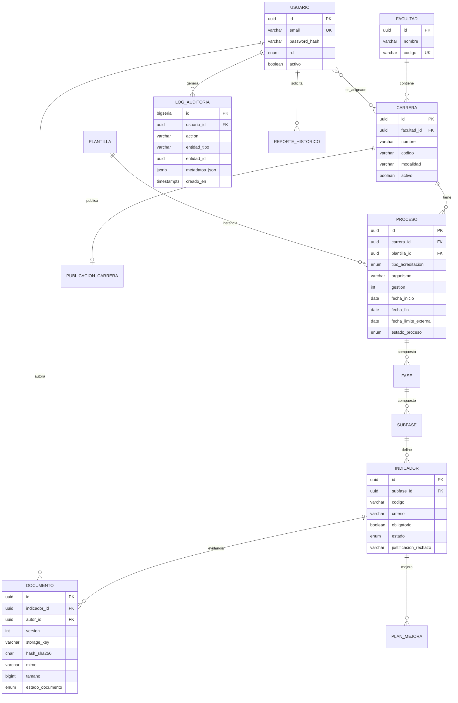

# Modelo de datos — SIGESA / AcredIA · UMSS

| Metadato | Valor |
|----------|-------|
| **Producto** | SIGESA — Sistema de Evaluación y Acreditación de Carreras |
| **Institución** | UMSS · DUEA |
| **Versión** | v1.0 |
| **Fecha** | 14/05/2026 |
| **FSD padre** | `team/Marlene/04_fsd/FSD.md` §15–17 |
| **Fuente canónica** | `docs/LFSD.md` §6 |
| **Reglas de negocio** | `team/Marlene/04_fsd/reglas_negocio.md` |
| **Contratos API** | `team/Marlene/04_fsd/api_contracts.md` |
| **Motor sugerido** | PostgreSQL 14+ (append-only auditoría) |

---

## 1. Propósito y alcance

Este documento describe el **modelo de datos lógico y físico de referencia** para SIGESA v1.0: entidades, atributos, relaciones, enumeraciones, restricciones de integridad y tablas de soporte (notificaciones, reportes, configuración).

| Nivel | Contenido en este documento |
|-------|------------------------------|
| **Conceptual** | Entidades de negocio y límites de dominio |
| **Lógico** | Tablas, columnas, tipos, FK, reglas en BD |
| **Físico** | Convenciones de nombres, almacenamiento objeto, índices |

**Fuera de alcance v1:** esquema SIIS/RRHH; data warehouse analítico; PII estudiantil.

---

## 2. Dominios acotados (DDD)

| Dominio | Entidades principales | Módulo / prefijo API |
|---------|----------------------|----------------------|
| **Identidad** | `usuario`, `usuario_carrera` | `/auth`, `/usuarios` |
| **Catálogo** | `facultad`, `carrera` | `/catalogo` |
| **Proceso / Workflow** | `plantilla`, `proceso`, `fase`, `subfase`, `indicador` | `/procesos` |
| **Documento** | `documento` | `/documentos` |
| **Notificación** | `notificacion_outbox` | (interno) |
| **Reporting** | `reporte_job`, `reporte_historico` | `/reportes` |
| **Auditoría** | `log_auditoria` | `/auditoria` |
| **Público** | `publicacion_carrera` | `/publico` |
| **Mejora** | `plan_mejora` | `/planes-mejora` |
| **Configuración** | `config_dashboard` | `/config` |

---

## 3. Diagrama entidad-relación (núcleo)

**Fuente Mermaid (completo):** `team/Marlene/07_diagramas/modelo_er.mmd` · alias `D-ER-001`

---

## 4. Modelo lógico — tablas

### 4.1 Catálogo e identidad

#### `facultad`

| Columna | Tipo | Null | Descripción |
|---------|------|------|-------------|
| `id` | UUID | NO | PK |
| `nombre` | VARCHAR(200) | NO | Nombre oficial |
| `codigo` | VARCHAR(32) | NO | Código institucional, **UK** |
| `creado_en` | TIMESTAMPTZ | NO | default `now()` |
| `actualizado_en` | TIMESTAMPTZ | NO | |

#### `carrera`

| Columna | Tipo | Null | Descripción |
|---------|------|------|-------------|
| `id` | UUID | NO | PK |
| `facultad_id` | UUID | NO | FK → `facultad.id` |
| `nombre` | VARCHAR(200) | NO | |
| `codigo` | VARCHAR(64) | NO | UK por política (global o por facultad) |
| `modalidad` | ENUM_MODALIDAD | NO | `PRESENCIAL`, `SEMIPRESENCIAL`, … |
| `activo` | BOOLEAN | NO | default `true`; desactivación lógica |
| `creado_en` | TIMESTAMPTZ | NO | |

**Índices:** `(facultad_id)`, `(codigo)` UNIQUE según política DUEA.

#### `usuario`

| Columna | Tipo | Null | Descripción |
|---------|------|------|-------------|
| `id` | UUID | NO | PK |
| `email` | VARCHAR(120) | NO | **UK**; dominio `@umss.edu.bo` (RB-06) |
| `password_hash` | VARCHAR(255) | NO | bcrypt cost ≥ 12 |
| `rol` | ENUM_ROL | NO | `CC`, `TD`, `JD` (v1); `JC`, `EE` (evolutivo) |
| `activo` | BOOLEAN | NO | default `true` |
| `creado_en` | TIMESTAMPTZ | NO | |
| `ultimo_login_en` | TIMESTAMPTZ | SÍ | |

#### `usuario_carrera` (asignación [CC] ↔ carrera)

| Columna | Tipo | Null | Descripción |
|---------|------|------|-------------|
| `usuario_id` | UUID | NO | PK compuesta, FK → `usuario` |
| `carrera_id` | UUID | NO | PK compuesta, FK → `carrera` |
| `asignado_en` | TIMESTAMPTZ | NO | |

---

### 4.2 Plantilla y proceso de acreditación

#### `plantilla`

| Columna | Tipo | Null | Descripción |
|---------|------|------|-------------|
| `id` | UUID | NO | PK |
| `tipo_acreditacion` | ENUM_TIPO | NO | `CEUB`, `ARCU_SUR` |
| `version` | INT | NO | Versión normativa |
| `json_definicion` | JSONB | NO | Fases, subfases, indicadores semilla |
| `vigente_desde` | DATE | NO | |
| `vigente_hasta` | DATE | SÍ | |

#### `proceso`

| Columna | Tipo | Null | Descripción |
|---------|------|------|-------------|
| `id` | UUID | NO | PK |
| `carrera_id` | UUID | NO | FK → `carrera` |
| `plantilla_id` | UUID | NO | FK → `plantilla` |
| `tipo_acreditacion` | ENUM_TIPO | NO | RB-08 |
| `organismo` | VARCHAR(64) | NO | p. ej. `CEUB`, `ARCU_SUR` |
| `gestion` | INT | NO | Año YYYY |
| `fecha_inicio` | DATE | NO | RB-08 |
| `fecha_fin` | DATE | NO | RB-08; ≥ `fecha_inicio` |
| `fecha_limite_externa` | DATE | SÍ | Convocatoria; **inmutable** (RB-05) |
| `estado_proceso` | ENUM_ESTADO_PROCESO | NO | `BORRADOR`, `EN_PROCESO`, `ACREDITADO`, `VENCIDO`, `CERRADO` |
| `td_referente_id` | UUID | SÍ | FK → `usuario` (rol TD) |
| `creado_en` | TIMESTAMPTZ | NO | |

**Restricciones:**

- **BR-013:** índice único parcial: una fila `EN_PROCESO` por `(carrera_id, tipo_acreditacion, gestion)`.
- **RB-01:** trigger o validación aplicación al insertar `tipo_acreditacion = ARCU_SUR`.

#### `fase`

| Columna | Tipo | Null | Descripción |
|---------|------|------|-------------|
| `id` | UUID | NO | PK |
| `proceso_id` | UUID | NO | FK → `proceso` |
| `nombre` | VARCHAR(200) | NO | |
| `orden` | INT | NO | Orden dentro del proceso |
| `estado` | ENUM_ESTADO_FASE | NO | `PENDIENTE`, `EN_CURSO`, `CERRADA` |

#### `subfase`

| Columna | Tipo | Null | Descripción |
|---------|------|------|-------------|
| `id` | UUID | NO | PK |
| `fase_id` | UUID | NO | FK → `fase` |
| `nombre` | VARCHAR(200) | NO | |
| `orden` | INT | NO | |
| `estado` | ENUM_ESTADO_SUBFASE | NO | `PENDIENTE`, `EN_CURSO`, `APROBADA`, `CERRADA` |
| `fecha_limite` | DATE | SÍ | Plazo operativo interno |

#### `indicador`

| Columna | Tipo | Null | Descripción |
|---------|------|------|-------------|
| `id` | UUID | NO | PK |
| `subfase_id` | UUID | NO | FK → `subfase` |
| `codigo` | VARCHAR(64) | NO | Código normativo / plantilla |
| `nombre` | VARCHAR(500) | NO | |
| `criterio` | TEXT | NO | Texto criterio evaluable (BR-015) |
| `obligatorio` | BOOLEAN | NO | default `true` |
| `estado` | ENUM_ESTADO_INDICADOR | NO | Ver §5.1 |
| `justificacion_rechazo` | VARCHAR(500) | SÍ | Obligatoria si `RECHAZADO`; min 20 chars |
| `peso` | NUMERIC(5,2) | SÍ | Peso para RB-09 |
| `actualizado_en` | TIMESTAMPTZ | NO | Optimistic lock (`version` opcional) |

---

### 4.3 Evidencias documentales

#### `documento`

| Columna | Tipo | Null | Descripción |
|---------|------|------|-------------|
| `id` | UUID | NO | PK |
| `indicador_id` | UUID | NO | FK → `indicador` (**BR-015**) |
| `autor_id` | UUID | NO | FK → `usuario` (rol CC, RB-02) |
| `version` | INT | NO | Monotónico por `indicador_id`; **UK** `(indicador_id, version)` |
| `nombre_archivo` | VARCHAR(255) | NO | Nombre original |
| `storage_key` | VARCHAR(512) | NO | Ruta en objeto; no binario en fila |
| `mime` | VARCHAR(127) | NO | Whitelist PDF/DOCX/XLSX (CN-02) |
| `tamano` | BIGINT | NO | Bytes; ≤ 52_428_800 (CN-01) |
| `hash_sha256` | CHAR(64) | NO | Hex lowercase |
| `descripcion` | VARCHAR(1000) | NO | Cambio de versión |
| `estado_documento` | ENUM_ESTADO_DOC | NO | `EN_REVISION`, `APROBADO`, `RECHAZADO` |
| `creado_en` | TIMESTAMPTZ | NO | |

**Reglas:**

- **RB-04:** sin `DELETE` en filas con `estado_documento = APROBADO`.
- Nueva versión = nuevo `INSERT` con `version = MAX(version)+1`.

**Almacenamiento objeto:** `storage_key` = `{tenant}/carreras/{carrera_id}/indicadores/{indicador_id}/v{version}/{uuid}_{nombre_sanitizado}`.

---

### 4.4 Auditoría, notificaciones y reportes

#### `log_auditoria`

| Columna | Tipo | Null | Descripción |
|---------|------|------|-------------|
| `id` | BIGSERIAL | NO | PK append-only |
| `usuario_id` | UUID | SÍ | Null si acción sistema |
| `accion` | VARCHAR(64) | NO | Catálogo §5.3 |
| `entidad_tipo` | VARCHAR(64) | NO | `INDICADOR`, `DOCUMENTO`, `PROCESO`, … |
| `entidad_id` | UUID | NO | |
| `metadatos_json` | JSONB | SÍ | Sin PII innecesaria |
| `creado_en` | TIMESTAMPTZ | NO | Inmutable |

**Seguridad BD:** `REVOKE UPDATE, DELETE` al rol aplicación (BR-009 / NFR-013).

#### `notificacion_outbox`

| Columna | Tipo | Null | Descripción |
|---------|------|------|-------------|
| `id` | UUID | NO | PK |
| `evento_tipo` | VARCHAR(64) | NO | `CARGA`, `RECHAZO`, `APROBACION`, … |
| `destinatario_email` | VARCHAR(120) | NO | |
| `payload_json` | JSONB | NO | Plantilla + variables |
| `estado` | ENUM_NOTIF | NO | `PENDIENTE`, `ENVIADO`, `REINTENTO`, `FALLIDO` |
| `intentos` | INT | NO | default 0; max 5 / 24 h (RB-12) |
| `programado_en` | TIMESTAMPTZ | NO | |
| `enviado_en` | TIMESTAMPTZ | SÍ | |

#### `reporte_job`

| Columna | Tipo | Null | Descripción |
|---------|------|------|-------------|
| `id` | UUID | NO | PK |
| `solicitante_id` | UUID | NO | FK → `usuario` ([JD]) |
| `alcance` | VARCHAR(32) | NO | `UNIVERSIDAD`, `FACULTAD`, `CARRERA` |
| `referencia_id` | UUID | SÍ | facultad o carrera |
| `gestion` | INT | NO | |
| `estado` | ENUM_JOB | NO | `PENDIENTE`, `PROCESANDO`, `LISTO`, `ERROR` |
| `storage_key` | VARCHAR(512) | SÍ | PDF temporal TTL |
| `creado_en` | TIMESTAMPTZ | NO | |
| `completado_en` | TIMESTAMPTZ | SÍ | |

#### `reporte_historico`

| Columna | Tipo | Null | Descripción |
|---------|------|------|-------------|
| `id` | UUID | NO | PK |
| `job_id` | UUID | NO | FK → `reporte_job` |
| `clasificacion` | VARCHAR(32) | NO | default `USO_INTERNO` (RB-07) |
| `parametros_json` | JSONB | NO | |
| `generado_en` | TIMESTAMPTZ | NO | |

---

### 4.5 Portal público, mejora y configuración

#### `publicacion_carrera`

| Columna | Tipo | Null | Descripción |
|---------|------|------|-------------|
| `carrera_id` | UUID | NO | PK, FK → `carrera` |
| `estado_visible` | ENUM_PUBLICO | NO | `OCULTO`, `VISIBLE` (RB-11-PUB) |
| `slug` | VARCHAR(120) | SÍ | UK para URL pública |
| `texto_resumen` | TEXT | SÍ | Leyenda ciudadana |
| `vigencia_desde` | DATE | SÍ | |
| `vigencia_hasta` | DATE | SÍ | |
| `publicado_en` | TIMESTAMPTZ | SÍ | |
| `publicado_por` | UUID | SÍ | FK → `usuario` ([JD]) |

#### `plan_mejora`

| Columna | Tipo | Null | Descripción |
|---------|------|------|-------------|
| `id` | UUID | NO | PK |
| `indicador_id` | UUID | NO | FK → `indicador` |
| `titulo` | VARCHAR(300) | NO | |
| `estado` | ENUM_PLAN | NO | `PROPUESTO`, `EN_EJECUCION`, `EVIDENCIADO`, `CERRADO` |
| `fecha_objetivo` | DATE | SÍ | |
| `creado_por` | UUID | NO | FK → `usuario` ([CC]) |
| `cerrado_por` | UUID | SÍ | FK → `usuario` ([TD]) |
| `creado_en` | TIMESTAMPTZ | NO | |

#### `config_dashboard`

| Columna | Tipo | Null | Descripción |
|---------|------|------|-------------|
| `id` | UUID | NO | PK |
| `gestion` | INT | NO | |
| `umbral_verde` | NUMERIC(5,2) | NO | default 80.00 (RB-09) |
| `umbral_amarillo` | NUMERIC(5,2) | NO | default 50.00 |
| `formula_json` | JSONB | NO | Pesos por criterio / indicador |
| `vigente_desde` | DATE | NO | |

#### `backup_estado` (UC-011)

| Columna | Tipo | Null | Descripción |
|---------|------|------|-------------|
| `id` | BIGSERIAL | NO | PK |
| `tipo` | VARCHAR(16) | NO | `DB`, `OBJETOS` |
| `estado` | VARCHAR(16) | NO | `OK`, `FAILED`, `RUNNING` |
| `inicio_en` | TIMESTAMPTZ | NO | |
| `fin_en` | TIMESTAMPTZ | SÍ | |
| `duracion_seg` | INT | SÍ | |
| `mensaje_error` | TEXT | SÍ | |

---

## 5. Enumeraciones y máquinas de estado

### 5.1 `ENUM_ESTADO_INDICADOR`

| Valor API | Etiqueta UI (LFSD) | Transiciones permitidas |
|-----------|-------------------|-------------------------|
| `PENDIENTE` | Pendiente | → `EN_REVISION` (carga CC) |
| `EN_REVISION` | En revisión | → `APROBADO`, `RECHAZADO` ([TD]) |
| `RECHAZADO` | Rechazado | → `EN_REVISION` (nueva carga CC) |
| `APROBADO` | Aprobado | → `EN_REVISION` (nueva versión + política reapertura) |

### 5.2 `ENUM_ESTADO_PROCESO`

`BORRADOR` → `EN_PROCESO` → `ACREDITADO` | `VENCIDO` | `CERRADO`

### 5.3 Catálogo `log_auditoria.accion`

| Acción | Disparador típico |
|--------|-------------------|
| `LOGIN` | UC-001 |
| `LOGOUT` | UC-001 |
| `CARGA` | UC-002 |
| `APROBACION` | UC-003 |
| `RECHAZO` | UC-003 |
| `AVANCE_FASE` | UC-003 |
| `REPORTE` | UC-005 |
| `PUBLICACION` | UC-008 |
| `CATALOGO_CARRERA_UPSERT` | Admin catálogo |
| `PROC_CREACION` | UC-010 |

---

## 6. Integridad referencial y políticas BD

| Política | Aplicación |
|----------|------------|
| **ON DELETE RESTRICT** | Todas las FK del núcleo acreditación |
| **Transacciones** | Carga documento + update indicador + outbox en una TX |
| **UK parcial BR-013** | `UNIQUE (carrera_id, tipo_acreditacion, gestion) WHERE estado_proceso = 'EN_PROCESO'` |
| **UK documento** | `UNIQUE (indicador_id, version)` |
| **Check fechas** | `fecha_fin >= fecha_inicio` en `proceso` |
| **Check rechazo** | `char_length(justificacion_rechazo) >= 20` cuando `estado = RECHAZADO` |
| **Append-only** | `log_auditoria` sin UPDATE/DELETE para rol app |

---

## 7. Trazabilidad reglas → datos

| Regla | Manifestación en modelo |
|-------|-------------------------|
| RB-01 | Validación en `proceso.tipo_acreditacion` + consulta CEUB vigente |
| RB-02 | `documento.autor_id` + `usuario_carrera` |
| RB-03 | `subfase.estado`, `indicador.obligatorio` + `indicador.estado` |
| RB-04 | Sin DELETE en `documento` aprobado |
| RB-05 | `proceso.fecha_limite_externa` no actualizable vía API estándar |
| RB-06 | `usuario.email` CHECK dominio |
| RB-07 | `reporte_historico.clasificacion`, `publicacion_carrera` |
| RB-08 | NOT NULL en metadatos `proceso` |
| RB-09 | `config_dashboard`, `indicador.peso` |
| BR-013 | Índice único parcial en `proceso` |
| BR-015 | `documento.indicador_id` NOT NULL |

---

## 8. Búsqueda (UC-007)

Índices recomendados para FTS / metadatos:

| Tabla | Índice |
|-------|--------|
| `documento` | `(indicador_id, creado_en DESC)` |
| `indicador` | GIN sobre `nombre`, `criterio` (español) |
| `carrera` | `(facultad_id, codigo)` |

Vista materializada opcional `mv_dashboard_resumen` para UC-004 (semáforos).

---

## 9. Convenciones de implementación

| Tema | Convención |
|------|------------|
| **PK** | UUID v4 (`gen_random_uuid()`) salvo `log_auditoria`, `backup_estado` |
| **Nombres** | `snake_case` en BD; JSON API `camelCase` |
| **Timestamps** | `TIMESTAMPTZ` UTC |
| **Migraciones** | Flyway/Liquibase alineado a este documento |
| **Seeds** | Solo datos `TEST_*` / `example.invalid` (CR-SIG-04) |
| **Multitenancy** | Single-tenant UMSS; prefijo `storage_key` por entorno |

---

## 10. Matriz entidad → caso de uso

| Entidad | UC principales |
|---------|----------------|
| `usuario`, `usuario_carrera` | UC-001 |
| `documento`, `indicador` | UC-002, UC-003 |
| `proceso`, `fase`, `subfase` | UC-003, UC-010 |
| `config_dashboard`, agregados | UC-004 |
| `reporte_job` | UC-005 |
| `notificacion_outbox` | UC-006 |
| `documento` (+ índices) | UC-007 |
| `publicacion_carrera` | UC-008 |
| `log_auditoria` | UC-009 |
| `plantilla`, `proceso` | UC-010 |
| `backup_estado` | UC-011 |
| `plan_mejora` | UC-012 |

---

## 11. Registro de cambios

| Versión | Fecha | Cambio |
|---------|-------|--------|
| v1.0 | 14/05/2026 | Modelo lógico unificado LFSD §6 + FSD §15–17 |

---

*Reglas ejecutables: `reglas_negocio.md`. Comportamiento: `casos_uso.md`.*
