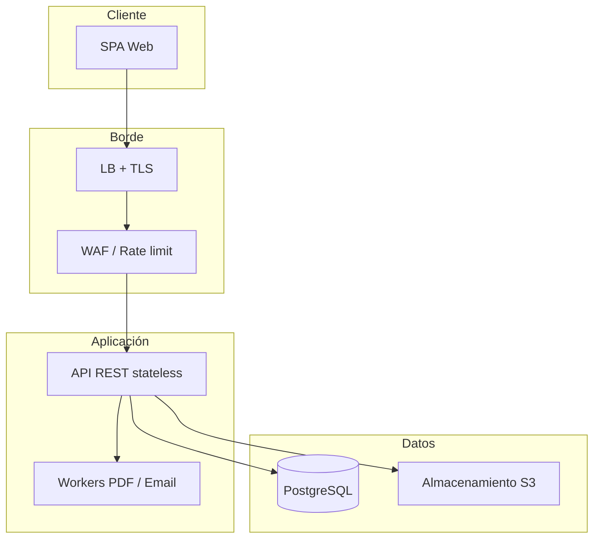

# Requerimientos no funcionales — ISO/IEC 25010

## SIGESA / AcredIA · UMSS

| Metadato | Valor |
|----------|-------|
| **Norma** | ISO/IEC 25010:2011 — *SQuaRE — System and software quality models* |
| **Producto** | SIGESA — Sistema de Evaluación y Acreditación de Carreras |
| **Institución** | UMSS · DUEA |
| **Versión** | v1.0 |
| **Fecha** | 14/05/2026 |
| **Estado** | Borrador para aprobación TI / DUEA / Seguridad |
| **FSD** | `team/Marlene/04_fsd/FSD.md` §14 |
| **Fuente LFSD** | `docs/LFSD.md` §10 |
| **Trazabilidad funcional** | `team/Marlene/04_fsd/casos_uso.md`, `api_contracts.md` |
| **Métricas IA (v2)** | `team/Marlene/09_trazabilidad/metricas_ai_sdlc.md` |
| **Documento ampliado** | `team/Marlene/06_prompt_contracts/NFR.md` (mismo catálogo ISO extendido) |

---

## 1. Propósito

Definir **requisitos de calidad del producto y del sistema en operación** para SIGESA usando el vocabulario **ISO/IEC 25010**, con umbrales **medibles**, métodos de **verificación** y trazabilidad a **FSD-UC**, **TC-xx** y **PRD-REQ**.

**Dos convenciones de ID (coexistentes):**

| Esquema | Uso | Ejemplo |
|---------|-----|---------|
| **NFR-00N** | Trazabilidad PRD / LFSD / matriz MRD→PRD→FSD | NFR-001 buscador ≤ 3 s |
| **NFR-XXX-NN** | Catálogo arquitectónico ISO 25010 (despliegue, SRE) | NFR-ED-01 latencia API |

---

## 2. Modelo ISO/IEC 25010 aplicado

ISO 25010 define **8 características** de calidad del producto. SIGESA desarrolla NFR en **siete** de ellas (la adecuación funcional se cubre en PRD/FSD):

| § ISO 25010 | Característica | Subcaracterísticas SIGESA | IDs principales |
|-------------|----------------|---------------------------|-----------------|
| 6.1 | Adecuación funcional | *(PRD / FSD-UC)* | — |
| 6.2 | Eficiencia de desempeño | Tiempo de respuesta, capacidad, utilización recursos | NFR-001, 002, 003; **NFR-ED-01**, **NFR-ED-02** |
| 6.3 | Compatibilidad | Interoperabilidad navegadores/API | NFR-011, 012; **NFR-COM-01** |
| 6.4 | Usabilidad | Errores, accesibilidad, aprendizaje | NFR-009, 010; **NFR-USA-01**, **NFR-USA-02** |
| 6.5 | Fiabilidad | Disponibilidad, recuperabilidad | NFR-004; **NFR-FIA-01**, **NFR-FIA-02** |
| 6.6 | Seguridad | Confidencialidad, integridad, autenticidad | NFR-005, 006, 007; **NFR-SEG-01** |
| 6.7 | Mantenibilidad | Modularidad, CI/CD, pruebas | **NFR-MAN-01** |
| 6.8 | Portabilidad | Contenedores, S3-compatible, IaC | **NFR-POR-01** |
| — | Trazabilidad / responsabilidad | Auditoría append-only | NFR-013 |

---

## 3. Catálogo PRD/LFSD (NFR-001 … NFR-013)

| ID | ISO 25010 | Categoría | Requisito | Métrica | Umbral | Verificación | FSD-UC |
|----|-----------|-----------|-----------|---------|--------|--------------|--------|
| **NFR-001** | 6.2 | Rendimiento | Tiempo de respuesta del buscador | P95 | ≤ **3 s** | k6 / APM en STAGE | UC-007 |
| **NFR-002** | 6.2 | Rendimiento | Generación reporte PDF ejecutivo | Absoluto | ≤ **5 min** (P95) | E2E + job metrics | UC-005 |
| **NFR-003** | 6.2 | Rendimiento | Notificación eventos críticos por correo | P95 desde evento | ≤ **15 min** | Logs outbox + SMTP | UC-006 |
| **NFR-004** | 6.5 | Disponibilidad | Uptime horario hábil UMSS | SLA mensual | ≥ **99 %** | Monitoreo sintético | Todos |
| **NFR-005** | 6.6 | Seguridad | Cifrado en tránsito | Estándar | **TLS 1.2+** (objetivo 1.3) | SSL Labs / auditoría | UC-001 |
| **NFR-006** | 6.6 | Seguridad | Cifrado en reposo (objetos) | Estándar | **AES-256** | Config cloud / bucket | UC-002 |
| **NFR-007** | 6.6 | Seguridad | Acceso no autorizado | Incidentes / gestión | **0** confirmados | Revisión auditoría + pentest | UC-001 |
| **NFR-008** | 6.4 | Accesibilidad | WCAG en componentes críticos | Cobertura criterios | **AA** flujos [CC] v1.1; mín. **A** v1.0 | axe / Lighthouse | UC-002 |
| **NFR-009** | 6.4 | Usabilidad | Retroalimentación en carga archivos | Cobertura UI | **100 %** cargas con progreso | UAT + E2E | UC-002 |
| **NFR-010** | 6.4 | Usabilidad | Validación tiempo real formularios | Cobertura | **100 %** campos obligatorios | Playwright E2E | UC-001, UC-002, UC-003 |
| **NFR-011** | 6.3 | Compatibilidad | Sin instalación cliente; navegadores | Matriz | Chrome, Firefox, Edge (n−1) | BrowserStack / Playwright | Todos |
| **NFR-012** | 6.3 | Compatibilidad | Responsive móvil [CC] | Tareas críticas | Carga + consulta en **360×640** | Pruebas dispositivo real | UC-002 |
| **NFR-013** | 6.6 / responsabilidad | Trazabilidad | Acciones en log auditoría | Cobertura | **100 %** acciones críticas | E2E + revisión log | UC-002, UC-003, UC-009 |

### 3.1 Detalle por NFR crítico (P0)

#### NFR-001 — Buscador

| Campo | Contenido |
|-------|-----------|
| **Descripción** | Consultas FTS/metadatos en `/busqueda/documentos` con filtros. |
| **Exclusiones** | Export masivo async (otro umbral). |
| **Herramienta** | k6, OpenTelemetry, Grafana. |
| **Relación ISO extendida** | Complementa **NFR-ED-01** (API general). |
| **TC** | TC-14 |

#### NFR-002 — Reporte PDF

| Campo | Contenido |
|-------|-----------|
| **Descripción** | Job server-side; async si alcance `UNIVERSIDAD`. |
| **RB** | RB-07 — clasificación USO_INTERNO. |
| **TC** | TC-11, TC-12 |

#### NFR-003 — Notificaciones

| Campo | Contenido |
|-------|-----------|
| **Descripción** | Outbox + worker SMTP; eventos CARGA, RECHAZO, APROBACION. |
| **RB** | RB-12 — máx. 5 reintentos / 24 h. |
| **TC** | TC-13 |

#### NFR-004 — Disponibilidad

| Campo | Contenido |
|-------|-----------|
| **Descripción** | API + SPA accesibles; ventanas mantenimiento ≥ 48 h aviso. |
| **Relación ISO extendida** | **NFR-FIA-01** (SLO formal). |
| **Exclusión** | Mantenimiento planificado documentado. |

#### NFR-005 / NFR-006 / NFR-007 — Seguridad

| Campo | Contenido |
|-------|-----------|
| **NFR-005** | TLS en LB y enlaces firmados descarga. |
| **NFR-006** | Cifrado bucket; política IAM mínimo privilegio. |
| **NFR-007** | RBAC 100 % rutas mutantes; 0 escalaciones no mitigadas por gestión. |
| **Relación ISO extendida** | **NFR-SEG-01** (defensa en profundidad). |
| **TC** | TC-01, TC-02 |

#### NFR-008 / NFR-009 / NFR-010 — Usabilidad y accesibilidad

| Campo | Contenido |
|-------|-----------|
| **NFR-008** | WCAG 2.1; flujos login, carga, lista indicadores. |
| **NFR-009** | Barra progreso multipart; mensajes RB-10. |
| **NFR-010** | Validación inline antes de submit. |
| **Relación ISO extendida** | **NFR-USA-01**, **NFR-USA-02** |

#### NFR-011 / NFR-012 — Compatibilidad

| Campo | Contenido |
|-------|-----------|
| **NFR-011** | Web pura; sin IE11. |
| **NFR-012** | [CC] en campus con red móvil. |
| **Relación ISO extendida** | **NFR-COM-01** |

#### NFR-013 — Auditoría

| Campo | Contenido |
|-------|-----------|
| **Descripción** | `log_auditoria` append-only; acciones LOGIN, CARGA, APROBACION, RECHAZO, AVANCE_FASE, PUBLICACION, REPORTE. |
| **RB** | RB-07 trazabilidad ante CEUB. |
| **BD** | `REVOKE UPDATE, DELETE` rol aplicación. |
| **Cruce IA** | M-AI-012 (audit linkage rate) en v2. |

---

## 4. Catálogo arquitectónico ISO (NFR-ED, SEG, FIA, …)

> Desarrollo completo campo a campo: `team/Marlene/06_prompt_contracts/NFR.md` §4.

| ID | Nombre breve | ISO | Umbral clave | Prioridad |
|----|--------------|-----|--------------|-----------|
| **NFR-ED-01** | Latencia API operaciones frecuentes | 6.2 temporal | P95 GET ≤ **800 ms**; login ≤ **300 ms** | P0 |
| **NFR-ED-02** | Capacidad concurrente picos CEUB | 6.2 capacidad | **50 VU**, 5xx **< 1 %** / 30 min | P0 |
| **NFR-SEG-01** | Seguridad defensa en profundidad | 6.6 | **0** críticos pentest go-live | P0 |
| **NFR-FIA-01** | Disponibilidad SLO mensual | 6.5 disponibilidad | ≥ **99,0 %** PROD año 1 | P0 |
| **NFR-FIA-02** | RPO / RTO / restore | 6.5 recuperabilidad | RPO ≤ **24 h**; RTO ≤ **4 h** | P0 |
| **NFR-USA-01** | Usabilidad CC/TD | 6.4 | CSAT ≥ **4/5** piloto; ≤ **10 %** error UAT | P0 |
| **NFR-USA-02** | Accesibilidad WCAG | 6.4 | **0** violaciones A críticas (axe) v1.0 | P1 |
| **NFR-COM-01** | Multi-navegador y responsive | 6.3 | **100 %** smoke en 3 navegadores | P0 |
| **NFR-MAN-01** | CI/CD y mantenibilidad | 6.7 | Rollback ≤ **15 min**; cobertura ≥ **60 %** | P0 |
| **NFR-POR-01** | Portabilidad cloud | 6.8 | STAGE en ≤ **8 h** persona con IaC | P1 |

### 4.1 NFR-SEG-01 (resumen ejecutivo)

Autenticación JWT; RBAC por ruta; bcrypt ≥ 12; cabeceras OWASP (CSP, HSTS); URLs firmadas temporales; SAST/ZAP en CI; pentest anual; sin secretos en logs.

### 4.2 NFR-FIA-02 (resumen ejecutivo)

Backups diarios BD + objetos; prueba restore trimestral documentada; alineado **UC-011** y **BR-012**.

---

## 5. Tabla de equivalencias NFR-00N ↔ NFR-ISO

| NFR-00N (LFSD) | NFR-ISO extendido | Notas |
|----------------|-------------------|-------|
| NFR-001 | NFR-ED-01 | Buscador es caso específico de latencia |
| NFR-002 | NFR-ED-01 / ED-02 | PDF puede ser async (ED-02 carga) |
| NFR-003 | NFR-ED-02 | Cola + throughput notificaciones |
| NFR-004 | NFR-FIA-01 | Mismo SLO |
| NFR-005, 006, 007 | NFR-SEG-01 | Consolidado seguridad |
| NFR-008 | NFR-USA-02 | WCAG |
| NFR-009, 010 | NFR-USA-01 | UX operativa |
| NFR-011, 012 | NFR-COM-01 | Cliente web |
| NFR-013 | NFR-SEG-01 (responsabilidad) | Auditoría |

---

## 6. Trazabilidad MRD → PRD → FSD → NFR → TC

| Necesidad (MRD) | PRD-REQ | FSD-UC | NFR | Prueba |
|-----------------|---------|--------|-----|--------|
| Gestión documental | 003, 004 | UC-002 | 009, 013 | TC-03–05 |
| Flujo aprobación | 005 | UC-003 | 003, 013 | TC-06–08 |
| Dashboard | 006 | UC-004 | 001, 004 | TC-09–10 |
| Reportes | 007 | UC-005 | 002 | TC-11–12 |
| Notificaciones | 008 | UC-006 | 003 | TC-13 |
| Buscador | 009 | UC-007 | 001 | TC-14 |
| Autenticación | 001, 002 | UC-001 | 005, 007 | TC-01–02 |
| Auditoría | 011 | UC-009 | 013 | — |
| Portal / respaldos | 012–014 | UC-008, 011 | 004, 006 | — |

---

## 7. Relación NFR ↔ arquitectura

| NFR | Componente principal |
|-----|---------------------|
| NFR-ED-01, 001 | API, índices DB, caché dashboard |
| NFR-ED-02, 003 | API, outbox, SMTP |
| NFR-SEG-01, 005–007 | WAF, API auth, bucket IAM |
| NFR-FIA-01, 004 | LB, multi-instancia |
| NFR-FIA-02, 006 | DB backup, bucket versioning |
| NFR-013 | `log_auditoria` append-only |

---

## 8. Matriz NFR ↔ módulos funcionales

| NFR | Auth | Catálogo | Proceso | Documentos | Workflow | Notif. | Reportes | Dashboard | Auditoría | Público |
|-----|------|----------|---------|------------|----------|--------|----------|-----------|-----------|---------|
| 001 / ED-01 | ○ | ○ | ○ | ● | ○ | ○ | ○ | ● | ○ | ○ |
| 002 | ○ | ○ | ○ | ○ | ○ | ○ | ● | ○ | ○ | ○ |
| 003 | ○ | ○ | ○ | ● | ● | ● | ○ | ○ | ○ | ○ |
| 004 / FIA-01 | ● | ● | ● | ● | ● | ● | ● | ● | ● | ● |
| 005–007 / SEG-01 | ● | ● | ● | ● | ● | ● | ● | ● | ● | ● |
| 008–010 / USA | ● | ○ | ○ | ● | ● | ○ | ○ | ● | ○ | ● |
| 011–012 / COM | ● | ● | ○ | ● | ● | ○ | ○ | ● | ○ | ● |
| 013 | ● | ○ | ● | ● | ● | ● | ● | ● | ● | ○ |
| MAN-01 | ● | ● | ● | ● | ● | ● | ● | ● | ● | ● |

Leyenda: **●** alto; **○** medio/bajo.

---

## 9. Estrategia de verificación y monitoreo

| Capa | Actividad | Herramienta | Frecuencia |
|------|-----------|-------------|------------|
| CI | Unit + lint + SAST + ZAP baseline | GitHub Actions, SonarQube, OWASP ZAP | Cada PR |
| STAGE | k6 smoke + E2E Playwright | k6, Playwright | Pre-release |
| STAGE | Prueba carga 50 VU | k6 | Antes go-live + anual |
| PROD | SLI disponibilidad, latencia P95, error rate | Prometheus / APM | Continuo |
| PROD | Cola notificaciones, backlog PDF | Dashboards ops | Continuo |
| Trimestral | Test restore BD/objetos | Runbook TI | Cada 3 meses |
| Anual | Pentest + revisión umbrales NFR | Externo + arquitectura | Anual |

**SLI de ejemplo:**

- `sigesa_api_latency_p95{route}` — NFR-ED-01  
- `sigesa_uptime_ratio` — NFR-004 / FIA-01  
- `sigesa_notification_lag_seconds` — NFR-003  
- `sigesa_pdf_job_duration_seconds` — NFR-002  

---

## 10. Calidad en uso de IA (v2.0) — cruce ISO 25010

Cuando se activen skills IA (**RB-11**), aplicar métricas de `metricas_ai_sdlc.md`:

| Métrica | Característica ISO | Umbral orientativo |
|---------|-------------------|-------------------|
| M-AI-002 Precisión dominio | 6.1 / riesgo funcional | ≥ 95 % golden set |
| M-AI-005 Robustez entrada | 6.4 protección errores | 100 % P0 inválidos |
| M-AI-006 Latencia inferencia | 6.2 temporal | P95 ≤ umbral JD |
| M-AI-012 Trazabilidad salida | 6.6 responsabilidad | 100 % sugerencias con `trace_id` |
| M-AI-013 Explicabilidad | 6.4 transparencia | 100 % con `rationale` |
| M-AI-015 HER | 6.4 aceptación humana | Monitoreo mensual |

---

## 11. Criterios de aceptación globales (Go-Live)

1. **NFR-SEG-01 / 005–007:** pentest sin críticos; ZAP baseline verde en release.  
2. **NFR-FIA-01 / 004:** ≥ 99 % en piloto o plan remedio aprobado por JD.  
3. **NFR-ED-01 / 001:** P95 buscador ≤ 3 s en STAGE (informe k6).  
4. **NFR-002:** PDF ≤ 5 min en escenario facultad (E2E).  
5. **NFR-003:** notificación ≤ 15 min en prueba de carga notificaciones.  
6. **NFR-ED-02:** 50 VU, error 5xx < 1 %.  
7. **NFR-FIA-02:** test restore exitoso documentado.  
8. **NFR-COM-01 / 011–012:** matriz navegadores CI verde.  
9. **NFR-USA-01 / 008–010:** UAT firmado; axe sin violaciones A críticas en flujos [CC].  
10. **NFR-013:** 100 % acciones críticas en E2E registradas en log.  
11. **NFR-MAN-01:** rollback ≤ 15 min demostrado en STAGE.

---

## 12. Riesgos por incumplimiento (resumen)

| NFR | Riesgo institucional |
|-----|---------------------|
| 001, ED-01 | Abandono del buscador; retorno a correo/carpetas |
| 002 | Reportes manuales; retraso ante Consejo/Decanato |
| 003 | [CC]/[TD] no enterados de rechazos a tiempo |
| 004, FIA-01 | Incumplimiento plazos CEUB en ventana crítica |
| SEG-01, 005–007 | Fuga de evidencias; pérdida confianza DUEA |
| 013 | Fallo en auditoría externa CEUB |
| USA-01 | Baja adopción; canales informales persisten |

---

## 13. Registro de cambios

| Versión | Fecha | Cambio |
|---------|-------|--------|
| v1.0 | 14/05/2026 | Catálogo NFR-001–013 + ISO extendido, trazabilidad, arquitectura, go-live |

---

*Funcional: `04_fsd/`. Escenarios: `04_fsd/gherkin.md`. Ampliación ISO detallada: `06_prompt_contracts/NFR.md`.*
