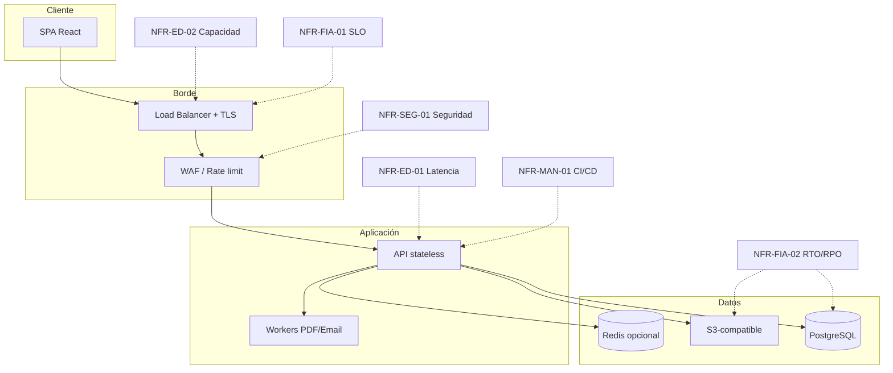

# Requerimientos No Funcionales (NFR)

## SIGESA / AcredIA — Sistema de Evaluación y Acreditación de Carreras UMSS

**Norma de referencia:** ISO/IEC 25010:2011 — *Systems and software Quality Requirements and Evaluation (SQuaRE) — System and software quality models*

---

## 0. Control documental

| Campo | Valor |
|-------|-------|
| **Producto** | SIGESA (AcredIA) |
| **Institución** | Universidad Mayor de San Simón (UMSS) |
| **Versión** | v1.0 |
| **Fecha** | 14/05/2026 |
| **Estado** | Borrador para aprobación conjunta TI / DUEA / Seguridad |
| **Audiencia** | Arquitectos de software, DevOps/SRE, CISO delegado, QA, líderes técnicos |
| **Trazabilidad** | `04_fsd/FSD_SIGESA_Empresarial_Completo_v1.md` (§14) · `03_prd/PRD_SIGESA_Institucional_Completo_v1.md` (§13) · `docs/LFSD.md` |
| **Principio** | Todo NFR es **SMART** a nivel operativo: específico, medible, alcanzable, relevante y acotado en tiempo de verificación |

---

## Índice

1. [Introducción y objetivo de los NFRs](#1-introducción-y-objetivo-de-los-nfrs)  
2. [Contexto tecnológico del sistema](#2-contexto-tecnológico-del-sistema)  
3. [Modelo ISO/IEC 25010 aplicado](#3-modelo-isoice-25010-aplicado)  
4. [Catálogo de NFRs](#4-catálogo-de-nfrs-requerimientos-desarrollados)  
5. [Relación NFRs y arquitectura](#5-relación-entre-nfrs-y-arquitectura-del-sistema)  
6. [Matriz de trazabilidad NFR ↔ módulos](#6-matriz-de-trazabilidad-nfr--módulos-funcionales)  
7. [Estrategia de monitoreo y cumplimiento](#7-estrategia-de-monitoreo-y-cumplimiento-de-calidad)  
8. [Riesgos por incumplimiento de NFRs](#8-riesgos-técnicos-asociados-a-incumplimiento-de-nfrs)  
9. [Recomendaciones arquitectónicas](#9-recomendaciones-arquitectónicas-y-tecnológicas)  
10. [Conclusiones y criterios de aceptación](#10-conclusiones-técnicas-y-criterios-de-aceptación)  
11. [Registro de cambios](#11-registro-de-cambios)

---

## 1. Introducción y objetivo de los NFRs

### 1.1 Objetivo

Definir **requisitos de calidad del producto** y del **sistema en operación** que no se deducen de una funcionalidad puntual, sino de las **características de calidad** que la UMSS exige para un sistema de **acreditación y evidencias**: confidencialidad de borradores, **trazabilidad** ante CEUB/ARCU-SUR, **disponibilidad** en ventanas pre-convocatoria, **rendimiento** perceptible en campus con redes heterogéneas, y **sostenibilidad** del ciclo de vida (despliegues, parches, observabilidad).

### 1.2 Alcance del documento

Este catálogo **complementa** y **formaliza** los NFR del FSD/PRD bajo el vocabulario ISO 25010, con **umbrales cuantificados**, **métodos de verificación** y **herramientas** sugeridas. Los valores son **negociables** entre TI UMSS y DUEA; la estructura y los mecanismos de medición son la base contractual técnica.

### 1.3 Supuestos

- Despliegue en **nube** o centro de datos con **API REST** y **SPA** (p. ej. React) según LFSD.  
- Usuarios internos en campus Cochabamba y acceso remoto institucional (VPN) en algunos roles.  
- Picos de uso alineados a **fechas CEUB** y entregas por facultad.

---

## 2. Contexto tecnológico del sistema

| Aspecto | Descripción |
|---------|-------------|
| **Arquitectura** | Cliente web (navegador) → API stateless → PostgreSQL; objetos en almacenamiento S3-compatible; workers para PDF y correo |
| **Usuarios concurrentes** | Orden de magnitud: decenas simultáneos en operación normal; **picos** pre-cierre de fase (coordinadores + técnicos DUEA) |
| **Datos sensibles** | Evidencias académicas, observaciones, datos personales en metadatos (correos, nombres) |
| **Cumplimiento** | Políticas UMSS de TI; alineación a principios de protección de datos institucionales; requisitos de **auditoría** para acreditación |
| **Entorno boliviano** | Variabilidad de latencia intercampus; necesidad de modo degradado y mensajes claros (RB-10 FSD) |

---

## 3. Modelo ISO/IEC 25010 aplicado

ISO/IEC 25010 define **8 características** de calidad del producto. Este documento desarrolla NFRs en **al menos seis** de ellas (exigencia mínima del encargo: ≥5):

| Característica ISO 25010 | Subcaracterísticas usadas en SIGESA | IDs NFR |
|--------------------------|----------------------------------------|---------|
| **6.1 Adecuación funcional** | *(cubierta en PRD/FSD; aquí solo trazas)* | — |
| **6.2 Eficiencia de desempeño** | Tiempo de respuesta, utilización de recursos, capacidad concurrente | NFR-ED-01, NFR-ED-02 |
| **6.3 Compatibilidad** | Interoperabilidad (navegadores, APIs), coexistencia | NFR-COM-01 |
| **6.4 Usabilidad** | Apropiabilidad reconocible, protección frente a errores, accesibilidad | NFR-USA-01, NFR-USA-02 |
| **6.5 Fiabilidad** | Disponibilidad, tolerancia a fallos, recuperabilidad | NFR-FIA-01, NFR-FIA-02 |
| **6.6 Seguridad** | Confidencialidad, integridad, autenticidad, responsabilidad | NFR-SEG-01 |
| **6.7 Mantenibilidad** | Modularidad, reutilización, capacidad de modificación, capacidad de prueba | NFR-MAN-01 |
| **6.8 Portabilidad** | Adaptabilidad, instalabilidad (contenedores / IaC) | NFR-POR-01 |

*Nota:* **Escalabilidad** y **disponibilidad** se modelan bajo **6.2** (capacidad) y **6.5** (disponibilidad/recuperabilidad), coherente con la norma.

---

## 4. Catálogo de NFRs (requerimientos desarrollados)

> Cada fila expande un **único NFR** con todos los campos obligatorios.

---

### NFR-ED-01 — Tiempo de respuesta de API en operación nominal

| Campo | Contenido |
|-------|-----------|
| **ID** | NFR-ED-01 |
| **Nombre** | Latencia de API (operaciones frecuentes) |
| **Categoría ISO/IEC 25010** | **6.2 Eficiencia de desempeño** — *Comportamiento temporal* |
| **Descripción técnica detallada** | Las operaciones REST más frecuentes (`GET` dashboard resumen, `GET` indicador detalle, `GET` lista documentos paginada, `POST` login) deben completarse en el servidor en un tiempo acotado bajo carga de referencia. Se excluye de este umbral la generación asíncrona de PDF masivo (NFR-ED-02) y uploads multipart completamente dominados por ancho de banda cliente. |
| **Justificación del negocio** | Durante convocatorias CEUB, **CC** y **TD** realizan muchas consultas cortas; la latencia percibida afecta adopción y genera retorno a canales paralelos (correo/WhatsApp). |
| **Métrica cuantificable** | Latencia servidor **P95** por endpoint (ms), medida en APM. |
| **Umbral / valor objetivo** | P95 ≤ **800 ms** para `GET` estándar ≤ 50 registros; P95 ≤ **1200 ms** para agregados dashboard universidad completa en **cache caliente**; P95 ≤ **300 ms** para `POST /auth/login` éxito. |
| **Método de verificación / validación** | Pruebas de carga con perfil realista (k6/Gatling) + trazas OpenTelemetry en STAGE; revisión mensual de dashboards APM en PROD. |
| **Herramienta o mecanismo de medición** | **k6** o **Gatling**; **OpenTelemetry** + **Grafana** / **Datadog** / **New Relic** (según licencia UMSS). |
| **Prioridad** | **P0** |
| **Riesgo asociado si incumple** | Degradación de UX; abandono del sistema en ventanas críticas; sobrecarga de soporte. |
| **Impacto institucional** | Riesgo de **no cumplir** plazos documentales por fricción operativa; percepción negativa de la transformación digital. |
| **Dependencias técnicas** | Índices DB adecuados; caché (Redis opcional) para agregados; CDN para estáticos SPA; conexión DB en pool sizing correcto. |

---

### NFR-ED-02 — Capacidad concurrente y throughput en picos pre-acreditación

| Campo | Contenido |
|-------|-----------|
| **ID** | NFR-ED-02 |
| **Nombre** | Capacidad concurrente y throughput en picos |
| **Categoría ISO/IEC 25010** | **6.2 Eficiencia de desempeño** — *Capacidad* |
| **Descripción técnica detallada** | El sistema debe sostener un número definido de **usuarios concurrentes** mixtos (CC/TD/JD) ejecutando escenarios: consulta dashboard, listado de cola TD, carga de documento (tasa acotada). La API debe mantener tasa mínima de transacciones exitosas sin error por saturación (>5% error rate). Autoescalado horizontal de instancias API recomendado. |
| **Justificación del negocio** | Simula el **pico** previo a cierre de fase en múltiples facultades (ej. Ciencias y Tecnología, Humanidades) subiendo evidencias el mismo día. |
| **Métrica cuantificable** | Usuarios concurrentes **VU**; **tasa de error HTTP 5xx** (%); **throughput** (req/s exitosas). |
| **Umbral / valor objetivo** | **50 VU** concurrentes, mezcla 70% lectura / 30% escritura, durante **30 min**: error rate 5xx **< 1%**; throughput ≥ **15 req/s** sostenido en STAGE con hardware acordado. *(Valores a recalibrar con dimensionamiento UMSS.)* |
| **Método de verificación** | Prueba de carga anual + antes de cada gran despliegue; revisión post-incidente si SLO violado. |
| **Herramienta** | **k6** con escenarios en Git; informe HTML adjunto a release. |
| **Prioridad** | **P0** |
| **Riesgo** | Caídas en cascada; colas SMTP/DB agotadas. |
| **Impacto institucional** | Bloqueo de entregas DUEA; riesgo de incumplimiento de hitos con CEUB. |
| **Dependencias** | Réplicas API; límites y colas; WAF/rate limit; almacenamiento multipart. |

---

### NFR-SEG-01 — Seguridad de la información y control de acceso (defensa en profundidad)

| Campo | Contenido |
|-------|-----------|
| **ID** | NFR-SEG-01 |
| **Nombre** | Confidencialidad, integridad y control de acceso (RBAC + transporte + datos) |
| **Categoría ISO/IEC 25010** | **6.6 Seguridad** — *Confidencialidad, Integridad, Autenticidad, Autorización* |
| **Descripción técnica detallada** | TLS 1.2+ obligatorio; JWT con expiración corta; RBAC en cada endpoint; contraseñas con bcrypt cost ≥12; cabeceras OWASP (*CSP*, *HSTS*, *X-Content-Type-Options*); validación de entrada; URLs firmadas temporales para descarga de objetos; logs sin secretos; pentest antes de go-live y anual. |
| **Justificación del negocio** | Las evidencias son **activos institucionales sensibles**; filtración o acceso indebido destruye confianza y puede afectar procesos de acreditación. |
| **Métrica cuantificable** | **CVSS** máximo permitido en hallazgos críticos post-remediación; **0** hallazgos críticos abiertos en go-live; cobertura **%** endpoints con chequeo de rol. |
| **Umbral / valor objetivo** | Pentest: **0** críticos, **≤3** medios abiertos con plan ≤30 días; 100% rutas mutantes con middleware de autorización; TLS **A** o superior en **SSL Labs** (o equivalente interno). |
| **Método de verificación** | OWASP ZAP **baseline** en CI; pentest manual anual; revisión de roles en UAT; SAST (SonarQube/Semgrep). |
| **Herramienta** | **OWASP ZAP**, **Burp** (externo), **SonarQube**, **Dependabot**/SCA. |
| **Prioridad** | **P0** |
| **Riesgo** | Fuga de borradores; escalada de privilegios; ransomware vía dependencia. |
| **Impacto institucional** | Daño reputacional; posibles obligaciones de reporte a autoridades; congelamiento del proyecto. |
| **Dependencias** | IdP futuro; gestión de secretos (Vault/ cloud SM); hardening OS/containers. |

---

### NFR-FIA-01 — Disponibilidad del servicio (SLO)

| Campo | Contenido |
|-------|-----------|
| **ID** | NFR-FIA-01 |
| **Nombre** | Disponibilidad mensual del servicio SIGESA |
| **Categoría ISO/IEC 25010** | **6.5 Fiabilidad** — *Disponibilidad* |
| **Descripción técnica detallada** | El servicio **API + SPA** debe estar accesible según SLO mensual, excluyendo ventanas de mantenimiento aprobadas (comunicadas con ≥48 h a DUEA). Healthchecks liveness/readiness en orquestador; página de estado institucional opcional. |
| **Justificación del negocio** | La DUEA y las carreras operan con **plazos fijos**; la indisponibilidad en fechas límite tiene costo directo en cumplimiento. |
| **Métrica cuantificable** | **Disponibilidad** = uptime / (total − ventanas planificadas). |
| **Umbral / valor objetivo** | **≥ 99,0%** mensual en PROD año 1; objetivo stretch **99,5%** año 2. *(Ajustar según SLA TI UMSS.)* |
| **Método de verificación** | Monitoreo sintético cada **5 min** desde dentro y fuera de campus; informe mensual de incidentes. |
| **Herramienta** | **Prometheus** + **Blackbox exporter** / **Pingdom** / **UptimeRobot** (según política). |
| **Prioridad** | **P0** |
| **Riesgo** | Incumplimiento de entregas; uso de canales no controlados. |
| **Impacto institucional** | Pérdida de credibilidad del canal oficial SIGESA. |
| **Dependencias** | Multi-AZ; balanceador; runbooks; proveedor estable. |

---

### NFR-FIA-02 — RTO, RPO y recuperación ante desastres

| Campo | Contenido |
|-------|-----------|
| **ID** | NFR-FIA-02 |
| **Nombre** | Recuperabilidad: RPO y RTO |
| **Categoría ISO/IEC 25010** | **6.5 Fiabilidad** — *Recuperabilidad, Tolerancia a fallos* |
| **Descripción técnica detallada** | Definir **RPO** (pérdida máxima de datos aceptable) y **RTO** (tiempo máximo de restauración) para BD y bucket de objetos. Backups automatizados diarios; prueba de restauración trimestral documentada. |
| **Justificación del negocio** | Evidencias de acreditación son **irreemplazables**; pérdida total es escenario crítico institucional. |
| **Métrica cuantificable** | RPO (horas); RTO (horas); éxito de **test restore** (sí/no). |
| **Umbral / valor objetivo** | RPO **≤ 24 h**; RTO **≤ 4 h** para restablecer servicio mínimo (lectura + carga); **100%** tests restore trimestrales exitosos en STAGE. |
| **Método de verificación** | Drill documentado; checklist post-restauración; validación de integridad hash muestra. |
| **Herramienta** | Scripts `pg_restore`, réplicas de solo lectura, versionado de buckets. |
| **Prioridad** | **P0** |
| **Riesgo** | Pérdida catastrófica; imposibilidad de auditoría CEUB. |
| **Impacto institucional** | Legal/reputacional extremo. |
| **Dependencias** | Política backup TI; almacenamiento redundante; runbook DRP. |

---

### NFR-USA-01 — Usabilidad operativa para roles CC y TD

| Campo | Contenido |
|-------|-----------|
| **ID** | NFR-USA-01 |
| **Nombre** | Eficiencia de uso y prevención de errores en flujos críticos |
| **Categoría ISO/IEC 25010** | **6.4 Usabilidad** — *Apropiabilidad reconocible, Protección frente a errores* |
| **Descripción técnica detallada** | Flujos de **carga de evidencia**, **revisión TD** y **consulta de observaciones** deben completarse con guías contextuales, estados visibles, deshabilitación de acciones ilegales y mensajes accionables (RB-10). Pruebas de usabilidad con usuarios reales UMSS. |
| **Justificación del negocio** | Perfil heterogéneo de competencia digital; errores frecuentes generan reproceso y tensión con DUEA. |
| **Métrica cuantificable** | **Tasa de error de usuario** en UAT (acciones canceladas / reintentos); **SUS** o **CSAT** post-tarea. |
| **Umbral / valor objetivo** | UAT: ≤ **10%** tareas con error de usuario en flujos críticos; CSAT ≥ **4/5** en piloto; tiempo para completar primera carga exitosa **≤ 15 min** desde onboarding asistido. |
| **Método de verificación** | Sesiones UAT grabadas (con consentimiento); encuestas cortas; análisis de funnels en product analytics. |
| **Herramienta** | **Hotjar**/Matomo (si política lo permite), **Maze**, hojas UAT firmadas. |
| **Prioridad** | **P0** |
| **Riesgo** | Baja adopción; doble canal informal. |
| **Impacto institucional** | Fracaso del cambio organizacional pese a sistema técnicamente correcto. |
| **Dependencias** | UX research; contenidos de ayuda en castellol técnico-académico. |

---

### NFR-USA-02 — Accesibilidad web (WCAG)

| Campo | Contenido |
|-------|-----------|
| **ID** | NFR-USA-02 |
| **Nombre** | Accesibilidad de la interfaz web |
| **Categoría ISO/IEC 25010** | **6.4 Usabilidad** — *Apropiabilidad accesible* (interpretación práctica alineada a WCAG 2.1) |
| **Descripción técnica detallada** | Cumplimiento progresivo **WCAG 2.1 nivel AA** en flujos críticos [CC] (carga, login, lista indicadores) y **mínimo A** global en v1.0 si se acuerda faseada. Contraste, foco visible, etiquetas en formularios, navegación teclado. |
| **Justificación del negocio** | Inclusión estudiantil y laboral; alineación a políticas de universidad pública; reducción de barreras para coordinadores. |
| **Métrica cuantificable** | **%** criterios WCAG AA aplicables sin violación **automática**; auditoría manual de muestra. |
| **Umbral / valor objetivo** | v1.0: **0** violaciones **A** automáticas en flujos críticos; v1.1: **≥95%** AA en mismos flujos según axe DevTools + auditoría humana. |
| **Método de verificación** | **axe-core** en E2E; Lighthouse accessibility; revisión manual checklist WCAG. |
| **Herramienta** | **axe DevTools**, **Lighthouse**, **WAVE**. |
| **Prioridad** | **P1** (P0 si normativa UMSS lo exige) |
| **Riesgo** | Exclusión; reclamos; deuda legal reputacional. |
| **Impacto institucional** | Compromiso con equidad en servicios digitales. |
| **Dependencias** | Biblioteca UI accesible; capacitación frontend. |

---

### NFR-COM-01 — Compatibilidad multi-navegador y dispositivos

| Campo | Contenido |
|-------|-----------|
| **ID** | NFR-COM-01 |
| **Nombre** | Compatibilidad de cliente web |
| **Categoría ISO/IEC 25010** | **6.3 Compatibilidad** — *Interoperabilidad, coexistencia* |
| **Descripción técnica detallada** | La SPA debe funcionar en **Chrome**, **Firefox** y **Edge** en versiones **n−1** (política explícita en release notes). Layout responsive para resoluciones **360×640** a **1920×1080** en flujos CC prioritarios. Sin soporte oficial para IE11. |
| **Justificación del negocio** | Laboratorios y despachos usan mezcla de navegadores; coordinadores consultan desde **móvil** en campus. |
| **Métrica cuantificable** | **%** flujos críticos pasando suite E2E por navegador. |
| **Umbral / valor objetivo** | **100%** flujos `@smoke` verdes en **3** navegadores en CI; **0** bloqueadores de layout en viewports definidos. |
| **Método de verificación** | Matriz de pruebas en BrowserStack / Playwright grid. |
| **Herramienta** | **Playwright** + **BrowserStack** (o equivalente). |
| **Prioridad** | **P0** |
| **Riesgo** | Bloqueos en decanato o carrera por navegador antiguo. |
| **Impacto institucional** | Soporte presencial saturado; percepción de “sistema roto”. |
| **Dependencias** | Polyfills mínimos; pruebas CI multi-browser. |

---

### NFR-MAN-01 — Mantenibilidad y despliegue continuo

| Campo | Contenido |
|-------|-----------|
| **ID** | NFR-MAN-01 |
| **Nombre** | Capacidad de modificación y despliegue seguro (CI/CD) |
| **Categoría ISO/IEC 25010** | **6.7 Mantenibilidad** — *Modularidad, Reutilización, Modificabilidad, Capacidad de prueba* |
| **Descripción técnica detallada** | Código modular por dominio (Auth, Documentos, Workflow, etc.); **IaC** (Terraform/OpenTofu o Bicep); pipeline CI: lint + tests unitarios + SAST + build imagen; CD a STAGE automático; PROD con aprobación manual y *rollback* en **≤ 15 min** vía versión imagen anterior. |
| **Justificación del negocio** | Cambios normativos CEUB/ARCU-SUR y mejoras UX requieren **ciclos cortos** sin paralizar la operación. |
| **Métrica cuantificable** | **Lead time** cambio merged→PROD (días); **MTTR** incidente deploy; cobertura tests **%**. |
| **Umbral / valor objetivo** | MTTR rollback **≤ 15 min**; cobertura global **≥ 60%** líneas año 1 (subir a 70%); lead time hotfix seguridad **≤ 48 h** desde aprobación. |
| **Método de verificación** | Auditoría de pipeline; tabla de releases; post-mortems. |
| **Herramienta** | **GitHub Actions** / **GitLab CI**, **Argo CD** / **Flux**, contenedores **Docker**. |
| **Prioridad** | **P0** |
| **Riesgo** | Deuda técnica; miedo a desplegar; parches de seguridad tardíos. |
| **Impacto institucional** | Incapacidad de responder a convocatorias o bugs críticos a tiempo. |
| **Dependencias** | Repositorio institucional; permisos TI; secret store. |

---

### NFR-POR-01 — Portabilidad e independencia de proveedor cloud

| Campo | Contenido |
|-------|-----------|
| **ID** | NFR-POR-01 |
| **Nombre** | Portabilidad de despliegue (contenedores + APIs estándar) |
| **Categoría ISO/IEC 25010** | **6.8 Portabilidad** — *Adaptabilidad, Instalabilidad* |
| **Descripción técnica detallada** | La aplicación debe poder desplegarse en **Kubernetes** compatible o **VM** Linux estándar; almacenamiento vía API **S3-compatible**; evitar servicios propietarios sin capa de abstracción (p. ej. adapter pattern para colas y mail). |
| **Justificación del negocio** | La UMSS puede **cambiar de proveedor** o política de nube; reduce *lock-in* y costos de salida. |
| **Métrica cuantificable** | Tiempo para levantar entorno completo en proveedor alternativo (horas); número de componentes **no portables**. |
| **Umbral / valor objetivo** | Entorno STAGE completo en **≤ 8 h** persona-horas usando IaC; **≤ 2** componentes críticos sin interfaz abstracta documentada. |
| **Método de verificación** | Ejercicio anual “**disaster relocation**” en STAGE; checklist de portabilidad. |
| **Herramienta** | **Docker Compose** local + **Terraform** modules. |
| **Prioridad** | **P1** |
| **Riesgo** | Costos de migración prohibitivos; dependencia de un solo vendor. |
| **Impacto institucional** | Riesgo en renovación de contratos estatales. |
| **Dependencias** | Disciplina arquitectura hexagonal en integraciones externas. |

---

## 5. Relación entre NFRs y arquitectura del sistema

**Lectura:** la **eficiencia** (NFR-ED-*) escala con API, caché y LB; la **fiabilidad** con multi-instancia y backups; la **seguridad** en borde + aplicación; la **mantenibilidad** con pipelines y contenedores.

---

## 6. Matriz de trazabilidad NFR ↔ módulos funcionales

| NFR ID | M1 Auth | M2 Catálogo | M3 Normativa | M4 Documentos | M5 Workflow | M6 Notif | M7 Reporting | M8 Dashboard | M9 Auditoría | M10 Público |
|--------|---------|------------|--------------|---------------|---------------|----------|--------------|--------------|--------------|-------------|
| NFR-ED-01 | ● | ○ | ○ | ● | ● | ○ | ○ | ● | ○ | ○ |
| NFR-ED-02 | ● | ○ | ○ | ● | ● | ● | ○ | ● | ○ | ○ |
| NFR-SEG-01 | ● | ● | ● | ● | ● | ● | ● | ● | ● | ● |
| NFR-FIA-01 | ● | ● | ● | ● | ● | ● | ● | ● | ● | ● |
| NFR-FIA-02 | ○ | ○ | ○ | ● | ● | ○ | ○ | ○ | ● | ○ |
| NFR-USA-01 | ● | ● | ○ | ● | ● | ○ | ○ | ● | ○ | ○ |
| NFR-USA-02 | ● | ● | ○ | ● | ● | ○ | ○ | ● | ○ | ● |
| NFR-COM-01 | ● | ● | ○ | ● | ● | ○ | ○ | ● | ○ | ● |
| NFR-MAN-01 | ● | ● | ● | ● | ● | ● | ● | ● | ● | ● |
| NFR-POR-01 | ○ | ○ | ○ | ● | ● | ● | ● | ○ | ○ | ○ |

Leyenda: **●** impacto directo alto; **○** impacto medio/bajo.

---

## 7. Estrategia de monitoreo y cumplimiento de calidad

| Pilar | Acción | Responsable |
|-------|--------|-------------|
| **SLO/SLI** | Definir SLI: disponibilidad, latencia P95, error rate; SLO acordados con DUEA | SRE + Sponsor |
| **Observabilidad** | Logs estructurados JSON, `trace_id`, métricas RED/USE | DevOps |
| **Calidad continua** | Gates CI: cobertura mínima, SAST, ZAP baseline | Dev + QA |
| **Revisiones** | Revisión trimestral de umbrales NFR según carga real post-convocatoria CEUB | Arquitectura |
| **Evidencia de cumplimiento** | Dashboard interno “NFR compliance” con semáforo por requisito | PM técnico |

**Indicadores de ejemplo:** tiempo generación PDF P95 (alineado PRD); cola notificaciones backlog; uso disco bucket.

---

## 8. Riesgos técnicos asociados a incumplimiento de NFRs

| NFR | Riesgo técnico | Prob. | Impacto | Mitigación |
|-----|----------------|-------|---------|------------|
| NFR-ED-01 | Consultas N+1 y latencia | M | A | APM + índices + revisión query |
| NFR-ED-02 | Saturación DB conexiones | M | A | Pooling, read replica, colas |
| NFR-SEG-01 | Vulnerabilidad auth | B | Cr | Pentest, dependabot, least privilege |
| NFR-FIA-01 | Caída proveedor única AZ | M | A | Multi-AZ, healthchecks |
| NFR-FIA-02 | Backup no restaurable | B | Cr | Test restore trimestral |
| NFR-USA-01 | Curva de aprendizaje alta | A | A | UX, campeones facultad |
| NFR-USA-02 | Demandas accesibilidad | B | M | Roadmap WCAG |
| NFR-COM-01 | Safari no probado (si se exige) | M | B | Ampliar matriz si política |
| NFR-MAN-01 | Pipeline frágil | M | M | Infra as code, staging paridad |
| NFR-POR-01 | Lock-in servicio mail | M | M | Adapter SMTP genérico |

---

## 9. Recomendaciones arquitectónicas y tecnológicas

1. **Definir SLO formales** en acta conjunta TI–DUEA antes de go-live (vinculados a NFR-FIA-01 y NFR-ED-01).  
2. **Feature flags** para PDF masivo y portal público, permitiendo degradar funcionalidad sin caer todo el sistema.  
3. **Outbox pattern** para notificaciones (coherencia NFR-ED-02 + trazabilidad).  
4. **Rate limiting** agresivo en `/publico/*` y en login (NFR-SEG-01).  
5. **Documentar RTO/RPO** en runbook DRP y practicar **tabletop** anual con Secretaría/DUEA.  
6. Adoptar **OpenTelemetry** desde MVP para no reconstruir observabilidad a posteriori.

---

## 10. Conclusiones técnicas y criterios de aceptación

### 10.1 Conclusiones

Los NFR bajo ISO 25010 **condicionan el éxito** de SIGESA tanto como las historias funcionales: un sistema funcionalmente correcto pero **lento, inseguro o indisponible** en convocatorias CEUB **fracasa** en el mercado institucional interno. Este documento fija **10 NFRs** en **seis características** de calidad ISO 25010, con métricas y herramientas verificables.

### 10.2 Criterios de aceptación globales (Go-Live NFR)

1. **NFR-SEG-01**: pentest sin críticos; ZAP baseline en CI verde en rama release.  
2. **NFR-FIA-01**: disponibilidad ≥99% en periodo piloto acordado o plan de remedio aprobado.  
3. **NFR-ED-01**: P95 endpoints `@smoke` cumplidos en STAGE con informe adjunto.  
4. **NFR-ED-02**: prueba de carga 50 VU sin error rate 5xx >1%.  
5. **NFR-FIA-02**: un **test restore** exitoso documentado en trimestre previo.  
6. **NFR-COM-01**: matriz navegadores en CI verde.  
7. **NFR-USA-01 / NFR-USA-02**: UAT firmado con CSAT y axe sin violaciones A críticas en flujos CC.  
8. **NFR-MAN-01**: pipeline despliega STAGE automáticamente; rollback documentado ≤15 min.  
9. **NFR-POR-01**: checklist portabilidad completada (P1, puede ser post go-live mes 3).

---

## 11. Registro de cambios

| Versión | Fecha | Descripción |
|---------|-------|-------------|
| v1.0 | 14/05/2026 | Catálogo inicial: 10 NFRs ISO 25010, arquitectura, matriz módulos, monitoreo, riesgos, criterios aceptación |

---

**Contratos de verificación:** ver [README.md](README.md) y archivos `PC-NFR-*.prompt.md` en esta carpeta.

---

*Documento NFR SIGESA — ISO/IEC 25010 — `team/Marlene/06_prompt_contracts/NFR.md`*
