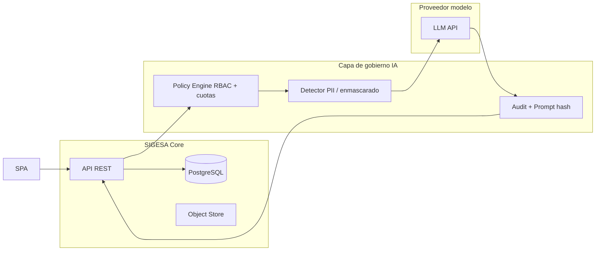

# Prompt Contracts y Especificaciones de Interacción (IA / NLP / Automatización)

## SIGESA / AcredIA — Sistema de Evaluación y Acreditación de Carreras UMSS

---

## 0. Control documental

| Campo | Valor |
|-------|-------|
| **Tipo** | Especificación de contratos de prompts y comportamiento de componentes inteligentes |
| **Versión** | v1.0 |
| **Fecha** | 14/05/2026 |
| **Estado** | Borrador — **Humano en el circuito (HITL)** obligatorio para salidas que afecten dictamen oficial |
| **Audiencia** | Arquitectos de IA/ML, ingeniería de prompts, desarrollo backend, QA, oficina de datos, CISO, DUEA |
| **Trazabilidad** | `04_fsd/FSD_SIGESA_Empresarial_Completo_v1.md` · `06_nfr/NFR_SIGESA_ISO25010_v1.md` · `05_cu_bdd/CU_BDD_SIGESA_Institucional_v1.md` |
| **Principio rector** | **Ninguna salida de modelo sustituye** decisión normativa de CEUB/ARCU-SUR ni la firma institucional; la IA **asiste**, **clasifica** o **bordea** bajo contrato verificable. |

---

## Índice

1. [Introducción y propósito](#1-introducción-y-propósito-de-los-prompt-contracts)  
2. [Arquitectura conceptual IA–Sistema](#2-arquitectura-conceptual-de-integración-ia--sistema)  
3. [Estándares de diseño de prompts](#3-estándares-de-diseño-de-prompts-utilizados)  
4. [Catálogo de NFRs para componentes inteligentes](#4-catálogo-de-nfrs-aplicados-a-componentes-inteligentes)  
5. [Prompt Contracts (PC-SIG-01 … PC-SIG-11)](#5-prompt-contracts-desarrollados)  
6. [Matriz de trazabilidad](#6-matriz-de-trazabilidad-entre-contratos-módulos-y-objetivos-institucionales)  
7. [Políticas de seguridad, ética y gobernanza](#7-políticas-de-seguridad-ética-y-gobernanza-de-ia)  
8. [Estrategia de testing y validación](#8-estrategia-de-testing-y-validación-de-prompts)  
9. [Métricas de calidad y desempeño](#9-métricas-de-calidad-y-desempeño-de-respuestas-generadas)  
10. [Riesgos operativos y técnicos](#10-riesgos-operativos-y-técnicos-asociados-al-uso-de-ia)  
11. [Recomendaciones de implementación](#11-recomendaciones-de-implementación-y-mantenimiento-evolutivo)  
12. [Registro de cambios](#12-registro-de-cambios)

---

## 1. Introducción y propósito de los Prompt Contracts

### 1.1 Propósito

Un **Prompt Contract** (PC) es un **acuerdo formal** entre el sistema SIGESA, el **orquestador** (servicio que invoca al modelo) y el **operador humano** que define: **entradas permitidas**, **salidas obligatorias** (p. ej. JSON Schema), **invariantes**, **modos de fallo**, **trazabilidad** y **límites de seguridad**. Su objetivo es lograr **consistencia**, **reproducibilidad** y **auditoría** en capacidades de PLN/IA aplicadas a acreditación universitaria, reduciendo *prompt drift* y alucinaciones no controladas.

### 1.2 Alcance

Aplica a **asistencia** en: redacción, resumen, clasificación sugerida, extracción estructurada, *gap analysis* textual y **borradores** de observaciones. **No** aplica a decisión final de aprobación/rechazo de indicadores sin intervención humana explícita (ver RB-IA-01 en §7).

### 1.3 Versión y gobierno

Cada PC tiene `version` semver; cambios de política o de esquema de salida requieren **revisiones** conjuntas DUEA + TI + QA.

---

## 2. Arquitectura conceptual de integración IA–Sistema

**Flujo obligatorio:** (1) Autenticación y autorización; (2) Recuperación solo de **contexto autorizado** (carrera, rol); (3) **Pre-filtrado** PII si aplica (PC-SIG-11); (4) Construcción de prompt desde **plantilla versionada** + `inputs` validados JSON Schema; (5) Invocación con `temperature` acotada y `max_tokens`; (6) **Post-validación** JSON Schema + reglas de negocio; (7) Persistencia de **entrada hash**, **salida**, **modelo**, **versión PC**, **usuario**; (8) Presentación como **sugerencia** editable.

---

## 3. Estándares de diseño de prompts utilizados

| Estándar / práctica | Aplicación en SIGESA |
|---------------------|----------------------|
| **Role–Task–Context–Format (RTCF)** | Plantillas base de cada PC |
| **JSON Schema en salida** | Forzar estructura parseable; rechazo si falla validación |
| **Separación sistema / usuario** | Mensajes `system` inmutables por versión PC; `user` solo datos variables |
| **Few-shot controlado** | Ejemplos fijos auditados en anexo técnico (no en runtime libre) |
| **Defensive prompting** | Instrucciones explícitas: “Si falta información, devolver `status: NEEDS_MORE_CONTEXT`” |
| **Versionado** | `pcId`, `pcVersion` en cada llamada |
| **Idempotencia lógica** | `requestId` UUID para deduplicar auditoría |

---

## 4. Catálogo de NFRs aplicados a componentes inteligentes

> Mínimo 8 NFRs; aquí **10** NFR-IA con métricas **cuantificables**.

| ID | Nombre | Métrica | Umbral objetivo | Verificación | Herramienta |
|----|--------|---------|-----------------|--------------|-------------|
| **NFR-IA-01** | Precisión factual en salidas estructuradas | **Exact match** o **F1** sobre conjunto de validación etiquetado | F1 ≥ **0,92** por PC en dominio acreditación (dataset UMSS) | Eval batch mensual | Script eval + golden files |
| **NFR-IA-02** | Consistencia semántica (misma entrada, variaciones) | **Coef. Jaccard** en claves JSON o similitud coseno embeddings | Jaccard ≥ **0,85** en 5 corridas @temp 0,2 | Prueba repetición | Python + embeddings locales |
| **NFR-IA-03** | Tiempo de respuesta LLM (P95) | Latencia end-to-end orquestador | P95 ≤ **12 s** texto ≤4k tokens; ≤ **45 s** resumen ≤30k con chunking | APM en STAGE/PROD | OpenTelemetry |
| **NFR-IA-04** | Disponibilidad del servicio IA | Uptime mensual sub-sistema IA | ≥ **99%** (acoplado a proveedor; *fallback* sin IA) | Monitoreo sintético | Prometheus / health |
| **NFR-IA-05** | Auditabilidad | % invocaciones con log completo | **100%** | Auditoría DB | Trigger + tabla `ia_invocation` |
| **NFR-IA-06** | Seguridad de datos (no fuga contexto cruzado) | **0** incidentes cross-tenant en pruebas OWASP LLM | 0 en suite seguridad trimestral | Tests acceso cruzado | Custom + checklist |
| **NFR-IA-07** | Robustez ante entradas inválidas | Tasa `INVALID_INPUT` controlada sin crash | **100%** respuestas JSON válidas o error schema; 0 uncaught | Fuzz léger sur inputs | Property-based tests |
| **NFR-IA-08** | Tasa de rechazo post-validación schema | % respuestas modelo rechazadas por validator | ≤ **8%** en PROD (si mayor, revisar prompt o modelo) | Dashboard calidad | Grafana |
| **NFR-IA-09** | Escalabilidad / costo | Tokens/mes y costo por carrera | Dentro de **presupuesto** TI; alerta al 80% cuota | Billing API proveedor | Tags `carreraId` |
| **NFR-IA-10** | Mantenibilidad de prompts | Tiempo para publicar nueva `pcVersion` | ≤ **2 días hábiles** desde PR merge + tests verdes | Proceso release | Git + CI |

---

## 5. Prompt Contracts desarrollados

> **11 contratos** (≥10). Cada uno incluye los **6 elementos fundamentales** + invariantes, failure modes, mitigación, seguridad/privacidad, ambigüedad, auditoría, ejemplos válidos/inválidos y casos borde.

---

### PC-SIG-01 — Borrador estructurado de informe de acreditación (narrativa + datos)

| Elemento | Especificación |
|----------|----------------|
| **ID** | PC-SIG-01 |
| **Objetivo del contrato** | Generar un **borrador** de informe de avance de acreditación en **español** a partir de **datos estructurados** oficiales (sin inventar cifras). |
| **Contexto funcional y alcance** | Módulo **M7 Reporting** / asistente JD. Entrada: JSON de estado por carrera/fase/indicador **ya calculado por SIGESA**. Salida: texto secciones + tabla resumen **solo** si los números vienen en input. Ámbito: CEUB y/o ARCU-SUR según `tipoProceso`. |
| **Inputs esperados** | Schema `InformeAccreditacionInput` v1: `{ "pcVersion": "1.0.0", "carrera": {...}, "proceso": {...}, "resumenIndicadores": [...], "alertas": [...] }`. Validaciones: JSON Schema; `carrera.id` UUID; `resumenIndicadores` máx. 200 ítems. |
| **Outputs esperados** | JSON: `{ "status": "OK" \| "NEEDS_MORE_CONTEXT", "markdown": "string", "tablas": [], "advertencias": [] }`. `markdown` ≤ 12.000 caracteres. **Prohibido** inventar fechas o porcentajes no presentes en input. |
| **Reglas de negocio y comportamiento** | RB-IA-01: no afirmar “acreditada” si `estadoProceso` no lo indica; citar solo datos del JSON; si faltan campos críticos → `NEEDS_MORE_CONTEXT`. |
| **Criterios de validación y aceptación** | (1) JSON output valida schema. (2) Diff automático: **0** números en salida que no estén en entrada. (3) Revisión humana JD en UAT: ≥4/5 utilidad del borrador. |

**Invariants**

- I1: Toda cifra en `markdown` aparece literalmente en `input` (normalización Unicode).
- I2: `pcVersion` y `modelId` se registran en auditoría.

**Failure Modes**

- FM1: Modelo alucina porcentaje → **validator numérico** rechaza → reintento con prompt “corrige: solo datos provistos”.
- FM2: Markdown truncado por `max_tokens` → `status: NEEDS_MORE_CONTEXT` + sección incompleta marcada.

**Mitigación y recuperación**

- Chunking por facultad; aumentar `max_tokens` solo vía config aprobada; *fallback*: plantilla Jinja2 sin LLM.

**Seguridad y privacidad**

- No incluir nombres de estudiantes en input; solo agregados. PII en `alertas` → bloqueo o enmascaramiento (PC-SIG-11).

**Ambigüedad / entradas inválidas**

- JSON malformado → 400 API sin llamar LLM. Campos opcionales ausentes → narrativa solo sobre disponibles.

**Trazabilidad y auditoría**

- Tabla `ia_invocation`: `requestId`, `userId`, `pcId`, `inputHash`, `outputHash`, `tokens`, `latencyMs`, `validationResult`.

**Ejemplo válido**

- Input contiene `porcentajeAvance: 72`. Salida incluye “72%” en contexto de avance.

**Ejemplo inválido**

- Input sin `fechaLimite`; salida inventa “vence el 30 de noviembre” → **rechazo validator**.

**Casos borde**

- `porcentajeAvance` null → texto debe decir “no disponible en el sistema” sin estimar.

---

### PC-SIG-02 — Validación asistida de evidencia contra rúbrica textual

| Elemento | Especificación |
|----------|----------------|
| **ID** | PC-SIG-02 |
| **Objetivo** | Producir **checklist asistida**: coherencia del título/archivo con **descriptor de indicador** y señales de **completitud superficial** (no sustituye lectura humana del PDF completo si el sistema no extrae texto). |
| **Contexto** | Módulo **M4 Documentos** + **M3 Normativa**; actor TD o CC (sugerencia previa a envío). |
| **Inputs** | `{ "indicador": { "codigo", "nombre", "descriptor" }, "metadatosArchivo": { "nombre", "mime", "tamanoBytes" }, "extractoTextoOpcional": "max4000chars" }`. |
| **Outputs** | `{ "status", "coincidencia": "ALTA|MEDIA|BAJA", "checklist": [{"item","cumple","motivo"}], "riesgos": [] }`. |
| **Reglas** | No marcar “cumple” en ítems que requieran contenido no presente en `extractoTextoOpcional` si este es null → `INSUFFICIENT_TEXT`. |
| **Criterios aceptación** | En golden set, **macro-F1 ≥ 0,85** en etiqueta `coincidencia` vs etiquetado TD; checklist sin contradicciones internas. |

**Invariants**

- I1: Si `extractoTextoOpcional` vacío, máximo **2** ítems de contenido profundo.

**Failure Modes**

- FM: Sobre-confianza con nombre de archivo engañoso (“malla.pdf” con contenido vacío) → riesgo `riesgos` debe incluir `ARCHIVO_POSIBLEMENTE_VACIO`.

**Mitigación**

- Combinar con validación servidor: tamaño mínimo bytes, parser PDF primera página.

**Seguridad**

- Extracto truncado y sin datos personales no esenciales.

**Ejemplo válido**

- Descriptor pide “plan de estudios”; nombre `Plan_Estudios_2026.pdf` + extracto con “malla curricular” → `coincidencia` ALTA.

**Ejemplo inválido**

- Sin extracto, modelo afirma “el PDF contiene resultados de aprendizaje” → schema fuerza `INSUFFICIENT_TEXT`.

**Caso borde**

- Idioma mixto ES/EN en extracto → checklist en español institucional.

---

### PC-SIG-03 — Evaluación asistida de alineación con criterio (no binario oficial)

| Elemento | Especificación |
|----------|----------------|
| **ID** | PC-SIG-03 |
| **Objetivo** | Clasificar **sugerencia** `ALINEADO | PARCIAL | NO_ALINEADO` con justificación breve respecto a **texto del criterio** e **extracto** evidencia. |
| **Contexto** | Asistencia a TD antes de dictamen; **no** escribe “APROBADO” en sistema. |
| **Inputs** | `{ "criterioTexto": "...", "extractoEvidencia": "max8000" }`. |
| **Outputs** | `{ "status", "clasificacion", "justificacionMax500chars", "preguntasParaHumano": [] }`. |
| **Reglas** | Justificación **≤500** caracteres; mínimo 1 pregunta si `PARCIAL` o `NO_ALINEADO`. |
| **Criterios** | Inter-annotator agreement κ ≥ 0,75 vs muestra TD en piloto. |

**Invariants**

- I1: `clasificacion` ∈ enum cerrado.

**Failure Modes**

- FM: Sesgo optimista → calibración con ejemplos negativos en *system*.

**Mitigación**

- *Temperature* ≤ 0,3; contrastar con regla determinística si `extracto` vacío → `NO_EVALUABLE`.

**Auditoría**

- Guardar solo extracto hash si política restringe texto completo.

**Ejemplos**

- Válido: criterio “vinculación social”; extracto menciona convenios municipales → PARCIAL con pregunta sobre medición de impacto.

- Inválido: salida “recomiendo aprobar” → **violación**; reemplazar por plantilla que prohíbe verbo “aprobar”.

---

### PC-SIG-04 — Asistente de redacción para coordinador (respuesta a observación DUEA)

| Elemento | Especificación |
|----------|----------------|
| **ID** | PC-SIG-04 |
| **Objetivo** | Proponer **borrador** de texto de respuesta del CC a observación TD, tono profesional, sin comprometer hechos no suministrados. |
| **Contexto** | Módulo **M6 Observaciones**; input: texto observación + bullets hechos aportados por CC. |
| **Inputs** | `{ "observacionTd": "string", "hechosAportadosPorCc": ["..."], "limitePalabras": 400 }`. |
| **Outputs** | `{ "borradorRespuesta": "string", "listaVerificacionHechosUsados": ["..."] }`. |
| **Reglas** | Cada afirmación fáctica del borrador debe mapear a un hecho en lista; si no, mover a `sugerenciasPendientes`. |
| **Criterios** | 100% afirmaciones factuales trazables a `hechosAportadosPorCc` en validador NLP ligero (regex + NER opcional). |

**Invariants**

- I1: No incluir datos de otras carreras (input no los contiene; *system* lo refuerza).

**Failure Modes**

- FM: Tonada agresiva → filtro de toxicidad; segundo pase “reescribe neutro”.

**Seguridad**

- No pegar automáticamente en campo oficial sin clic “Insertar borrador”.

**Caso borde**

- Observación en jerga; pedir aclaración a TD fuera de IA.

---

### PC-SIG-05 — Resumen neutro para evaluador externo (vista de lectura)

| Elemento | Especificación |
|----------|----------------|
| **ID** | PC-SIG-05 |
| **Objetivo** | Generar **resumen estructurado** no evaluativo del paquete de indicadores **públicos o ya aprobados para vista externa** según política. |
| **Contexto** | Rol futuro EE; solo datos explícitamente incluidos en `paqueteLiberado`. |
| **Inputs** | `{ "paqueteLiberado": { "indicadores": [...] } }` máx. 50 ítems. |
| **Outputs** | `{ "resumenPorEje": [...], "glosarioTerminos": [] }` sin adjetivos valorativos (“excelente”). |
| **Reglas** | Léxico **neutro** institucional; prohibido MERCOSUR/CEUB como “dictamen”. |
| **Criterios** | Lista negra de adjetivos vacíos; 0 apariciones en validación. |

**Invariants**

- I1: No más información que `paqueteLiberado`.

**Failure Modes**

- FM: Filtración de indicador no liberado por bug API → **pre-check** servidor antes de prompt.

**Auditoría**

- Log con `eeSessionId` si aplica.

**Ejemplo inválido**

- “La carrera cumple plenamente ARCU-SUR” → rechazado.

---

### PC-SIG-06 — Clasificación sugerida de tipo documental

| Elemento | Especificación |
|----------|----------------|
| **ID** | PC-SIG-06 |
| **Objetivo** | Sugerir `tipoDocumental` de taxonomía UMSS (enum) a partir de `nombreArchivo` + `primerasLineasTexto`. |
| **Contexto** | Etiquetado asistido en carga CC; TD puede corregir. |
| **Inputs** | `{ "nombreArchivo", "mime", "primerasLineasTexto": "max1500" }`. |
| **Outputs** | `{ "tipoSugerido": "ENUM", "confianza": 0.0-1.0, "alternativas": [] }`. |
| **Reglas** | Si `confianza` < 0,6 → UI “confirme tipo manualmente”. |
| **Criterios** | Accuracy top-1 ≥ 0,88 en set de 500 archivos etiquetados. |

**Failure Modes**

- FM: Confianza calibrada mal → *temperature* 0; *platt scaling* opcional.

**Caso borde**

- Archivo zip con nombre .pdf → baja confianza + `riesgoExtension`.

---

### PC-SIG-07 — Borrador de observación / recomendación para técnico DUEA (HITL)

| Elemento | Especificación |
|----------|----------------|
| **ID** | PC-SIG-07 |
| **Objetivo** | Proponer **borrador** de observación alineada a descriptor de indicador y *checklist* de omisiones detectadas por PC-SIG-02. |
| **Contexto** | Panel TD; salida **no envía** notificación a CC hasta TD edite y confirme. |
| **Inputs** | `{ "descriptorIndicador", "resultadoChecklistPc02": {...} }`. |
| **Outputs** | `{ "borradorObservacion": "max1500chars", "citasChecklist": ["idItem",...] }`. |
| **Reglas** | Cada párrafo debe referenciar ≥1 `citasChecklist`; tono respetuoso (RB-10). |
| **Criterios** | 100% citas existen en checklist; longitud ≤1500. |

**Invariants**

- I1: No incluir datos personales estudiantes.

**Mitigación**

- TD borra párrafos antes de enviar; plantilla “observación oficial” separada.

---

### PC-SIG-08 — Consulta institucional inteligente (RAG corporativo DUEA)

| Elemento | Especificación |
|----------|----------------|
| **ID** | PC-SIG-08 |
| **Objetivo** | Responder preguntas sobre **documentos indexados** (reglamentos CEUB/ARCU-SUR publicados, guías DUEA internas **clasificadas como RAG_ALLOWED**). |
| **Contexto** | Chat restringido a rol JD/TD; **sin** mezclar evidencias de carrera no autorizada. |
| **Inputs** | `{ "pregunta": "max500chars", "coleccion": "CEUB|ARCU|DUEA_GUIA", "topK": 5 }`. |
| **Outputs** | `{ "respuesta": "...", "citas": [{"docId","fragmentoId","textoCorto"}] }`. |
| **Reglas** | Si evidencia insuficiente en retrieval → “No consta en los documentos indexados”. |
| **Criterios** | **Faithfulness**: ≥90% respuestas evaluadas con cita verificable en golden Q&A. |

**Invariants**

- I1: `citas` no vacías si afirmación normativa; si vacías → solo “no consta”.

**Failure Modes**

- FM: *Hallucination* legal → grounding estricto; score mínimo similitud 0,75.

**Seguridad**

- Embeddings solo sobre corpus aprobado; no *web browse* libre.

**Ejemplo inválido**

- Pregunta sobre notas de estudiante → fuera de alcance → respuesta estándar rechazo.

---

### PC-SIG-09 — Asistencia para redacción de texto de indicador en plantilla

| Elemento | Especificación |
|----------|----------------|
| **ID** | PC-SIG-09 |
| **Objetivo** | Sugerir descripción corta de **qué evidencia subir** para un indicador según `plantilla` y `nombreIndicador`. |
| **Contexto** | Configuración JD de plantillas CEUB/ARCU-SUR. |
| **Inputs** | `{ "marco": "CEUB|ARCU_SUR", "nombreIndicador", "ejemplosOficiales": [] }`. |
| **Outputs** | `{ "textoAyudaCc": "max800chars", "formatoSugerido": "PDF|XLSX|..." }`. |
| **Reglas** | No contradecir `ejemplosOficiales`; si contradicción detectada → `CONFLICTO_PLANTILLA`. |
| **Criterios** | Aprobación contenido por JD en flujo editorial (ticket). |

**Caso borde**

- Indicador nuevo sin ejemplos → `textoAyudaCc` genérico + `CONFLICTO_PLANTILLA` false y flag `REVIEW_BY_JD`.

---

### PC-SIG-10 — Resumen automático de texto largo con anclas

| Elemento | Especificación |
|----------|----------------|
| **ID** | PC-SIG-10 |
| **Objetivo** | Resumir documentos extensos (PEI, reglamento carrera) en **viñetas** con referencias `[§ estimado]` o número de página si disponible en metadata OCR. |
| **Contexto** | TD revisión; máximo N páginas vía OCR preprocesado. |
| **Inputs** | `{ "textoConAnclas": "max120000", "objetivoResumen": "max200chars" }` o chunks con `chunkId`. |
| **Outputs** | `{ "bullets": [{"texto","anclaRef"}], "advertencias": [] }`. |
| **Reglas** | Máx. 15 bullets; no afirmar ausencia de tema si solo se vio chunk parcial → `advertencias` incluye `PARCIAL`. |
| **Criterios** | ROUGE-L vs resumen humano ≥ 0,35 en piloto (referencial) + revisión TD. |

**Failure Modes**

- FM: Resumen sesgado al primer chunk → *map-reduce* obligatorio para >8k tokens.

---

### PC-SIG-11 — Autoevaluación: brecha (*gap*) entre texto y lista de verificación

| Elemento | Especificación |
|----------|----------------|
| **ID** | PC-SIG-11 |
| **Objetivo** | Comparar texto de autoevaluación carrera contra **lista de verificación** (ítems CEUB/ARCU-SUR) y devolver **matriz cobertura** sugerida. |
| **Contexto** | Comité calidad carrera; entrada solo texto autorizado. |
| **Inputs** | `{ "textoAutoevaluacion": "max50000", "listaVerificacion": [{"id","textoItem"}] }`. |
| **Outputs** | `{ "cobertura": [{"itemId","estado":"CUBIERTO|PARCIAL|NO_EVIDENTE","citaFragmento":"max200"}] }`. |
| **Reglas** | `citaFragmento` debe ser substring del texto o `NO_CITA` si PARCIAL/NO. |
| **Criterios** | Validador substring exacto (normalizado); 95% ítems con estado coherente en golden. |

**Caso borde**

- Sinónimos (“RA” vs “resultado del aprendizaje”) → diccionario sinónimos curado UMSS v1.

---

### PC-SIG-12 — Preprocesador: detección y enmascaramiento de PII antes de LLM

| Elemento | Especificación |
|----------|----------------|
| **ID** | PC-SIG-12 |
| **Objetivo** | Redactar o bloquear envío a LLM si detecta **CI boliviana**, correos no institucionales, teléfonos, nombres propios fuera de lista blanca (opcional). |
| **Contexto** | Pipeline **obligatorio** antes de todos los PC que incluyan texto libre. |
| **Inputs** | `{ "textoUsuario": "string", "politica": "ENMASCARAR|BLOQUEAR" }`. |
| **Outputs** | `{ "textoSanitizado", "hallazgos": [{"tipo","posicion"}] }` o error `PII_BLOCKED`. |
| **Reglas** | Lista blanca: nombres de coordinador actual si `role=CC` y coincide con HR record. |
| **Criterios** | Recall ≥ 0,95 en dataset sintético PII; FPR ≤ 0,05. |

**Invariants**

- I1: Ningún LLM recibe texto usuario sin pasar PC-SIG-12 si `featureFlag_ia_pii=true`.

**Failure Modes**

- FM: Sobre-bloqueo → modo ENMASCARAR preferido en v1.

---

## 6. Matriz de trazabilidad entre contratos, módulos y objetivos institucionales

| PC-ID | Módulos SIGESA | Objetivo institucional | NFR-IA principal |
|--------|----------------|------------------------|------------------|
| PC-SIG-01 | M7 Reporting | Informar a autoridades con rigor | NFR-IA-01, NFR-IA-05 |
| PC-SIG-02 | M4, M3 | Reducir rechazos triviales | NFR-IA-07, NFR-IA-01 |
| PC-SIG-03 | M5 | Asistir dictamen humano | NFR-IA-01, NFR-IA-02 |
| PC-SIG-04 | M6 | Agilizar respuesta carrera | NFR-IA-06, NFR-IA-05 |
| PC-SIG-05 | M10 (futuro EE) | Transparencia controlada | NFR-IA-06 |
| PC-SIG-06 | M4 | Metadatos y orden documental | NFR-IA-01 |
| PC-SIG-07 | M5, M6 | Calidad del feedback TD | NFR-IA-02, NFR-IA-05 |
| PC-SIG-08 | M3, repositorio corpus | Capacitación normativa interna | NFR-IA-01, NFR-IA-04 |
| PC-SIG-09 | M3 | Claridad a CC | NFR-IA-10 |
| PC-SIG-10 | M4 | Eficiencia revisión | NFR-IA-03 |
| PC-SIG-11 | M3, M5 | Autoevaluación sistemática | NFR-IA-01 |
| PC-SIG-12 | Transversal | Privacidad y cumplimiento | NFR-IA-06, NFR-IA-07 |

---

## 7. Políticas de seguridad, ética y gobernanza de IA

| ID política | Enunciado |
|-------------|-----------|
| **RB-IA-01** | Ningún estado `APROBADO`/`RECHAZADO` de indicador se persiste **solo** por salida LLM; siempre confirmación humana TD. |
| **RB-IA-02** | Datos personales de terceros no autorizados no se envían a modelos cloud sin DPIA y anonimización. |
| **RB-IA-03** | Versionado de `systemPrompt` y `jsonSchema` igual que código; PR + revisión DUEA para cambios de tono o alcance. |
| **RB-IA-04** | Explicabilidad: toda sugerencia con `requestId` y, cuando aplique, `citas` o `citasChecklist`. |
| **RB-IA-05** | *Kill switch* global IA en configuración runtime sin redeploy (feature flag). |

**Ética:** evitar sesgos discriminatorios en lenguaje; revisión semestral de ejemplos few-shot.

---

## 8. Estrategia de testing y validación de prompts

| Nivel | Qué se prueba | Cómo |
|-------|----------------|------|
| **Unit** | Validadores JSON Schema post-LLM | Jest/pytest |
| **Contract** | Golden inputs → salida esperada parseada | Tabla `golden_pc_sig_xx.jsonl` |
| **Regression** | Cambio de `pcVersion` no rompe F1 | CI gate |
| **Adversarial** | Jailbreak, inyección de instrucciones en `textoUsuario` | Lista ataques OWASP LLM Top 10 subset |
| **UAT** | JD/TD firman checklist por PC | SharePoint/Acta |

**Aceptación release IA:** F1 global ≥ umbrales §4 y 0 críticos seguridad.

---

## 9. Métricas de calidad y desempeño de respuestas generadas

| Métrica | Descripción | Frecuencia |
|---------|-------------|------------|
| **Tasa de aceptación humana** | % sugerencias insertadas sin borrar >50% | Mensual |
| **Latencia P95** | Ver NFR-IA-03 | Continuo |
| **Tasa validator reject** | NFR-IA-08 | Semanal |
| **Drift semántico** | NFR-IA-02 entre versiones modelo | Al cambiar proveedor |
| **Costo/token/carrera** | NFR-IA-09 | Mensual |

---

## 10. Riesgos operativos y técnicos asociados al uso de IA

| Riesgo | Impacto | Mitigación |
|--------|---------|------------|
| Alucinación normativa | Alto | PC-SIG-08 grounding; PC-SIG-01 validator numérico |
| Fuga PII | Crítico | PC-SIG-12; minimización datos |
| Dependencia proveedor | Medio | PC-SIG-01 fallback Jinja; multi-proveedor |
| Sesgo en observaciones | Alto | RB-10; revisión TD obligatoria |
| Costo incontrolado | Medio | Cuotas por rol/carrera; alertas |
| Desalineación legal | Alto | RB-IA-03; revisión jurídica corpus RAG |

---

## 11. Recomendaciones de implementación y mantenimiento evolutivo

1. **Aislar** el servicio `ia-orchestrator` con API interna gRPC/REST y **timeouts** estrictos.  
2. **No** entrenar modelos con datos carrera sin consentimiento explícito y anonimización.  
3. Mantener **catálogo golden** por PC mínimo **200** pares (input, output esperado) creciendo con errores PROD.  
4. **A/B** prompts solo en STAGE con tráfico sintético antes de PROD.  
5. Documentar **model card** resumido por proveedor (versión, context window, fecha corte conocimiento).  
6. Revisión **trimestral** de políticas con Vicerrectorado y DUEA.

---

## 12. Registro de cambios

| Versión | Fecha | Descripción |
|---------|-------|-------------|
| v1.0 | 14/05/2026 | 11 Prompt Contracts + 10 NFR-IA + gobernanza + testing |

---

*Fin del documento — `07_ia_contracts/Prompt_Contracts_SIGESA_IA_v1.md`*
