# Arquitectura Funcional y Diagramas Mermaid — SIGESA / UMSS

## Trazabilidad con FSD y documentación de procesos

| Campo | Valor |
|-------|-------|
| **Versión** | v1.0 |
| **Fecha** | 14/05/2026 |
| **Estado** | Aprobación técnica pendiente |
| **Fuente normativa funcional** | `docs/LFSD.md` (FSD / LFSD AcredIA · SIGESA UMSS; duplicado en `docs/FSD_v1.md`) |
| **Casos de uso FSD** | FSD-UC-001 … FSD-UC-005 (§4 detallado); capacidades adicionales §2.1 (portal, auditoría, respaldos, plan de mejora) trazadas vía PRD / tareas T-00x |
| **Reglas de negocio** | RB-01 … RB-10, BR-013 … BR-015 (`docs/LFSD.md` §5) |
| **Requerimientos funcionales** | PRD-REQ-001 … PRD-REQ-009 (trazabilidad LFSD §12; no numeración FR-xxx en LFSD) |
| **Archivos `.mmd` ejecutables** | Carpeta `08_mermaid/mmd/` (mismo contenido que bloques aquí) |

---

## 1. Introducción y propósito de los diagramas

Los diagramas modelan el comportamiento y la estructura de **SIGESA** para: (1) alinear **desarrollo** y **pruebas** con el FSD; (2) comunicar a **stakeholders** académicos los flujos CEUB/ARCU-SUR; (3) soportar **revisiones arquitectónicas** y **onboarding** de equipos; (4) servir de **baseline** para detectar deriva (*drift*) entre implementación y especificación.

---

## 2. Relación entre diagramas y FSD

| Artefacto FSD | Diagramas que lo materializan |
|---------------|-------------------------------|
| FSD-UC-001 Autenticación | D-SEQ-001, D-CLASS-001 |
| FSD-UC-002 Carga evidencia | D-SEQ-002, D-STA-001, D-ER-001, D-JOURNEY-001 |
| FSD-UC-003 Aprobación / avance | D-SEQ-003, D-STA-001, D-FLOW-001, D-ACT-001 |
| FSD-UC-004 Dashboard y portal | D-COMP-001, D-ARCH-001 |
| FSD-UC-005 Reporte PDF | D-SEQ-004 |
| Notificaciones (PRD-REQ-008; T-007) | D-SEQ-002, D-SEQ-003 |
| Buscador (PRD-REQ-009; T-008) | D-COMP-001 |
| Log auditoría (§2.1; NFR-013) | D-ER-001, D-CLASS-001, D-SEQ-002 |
| Taxonomías CEUB/ARCU-SUR (T-012) | D-STA-002, D-GANTT-002, D-ER-001 |
| Respaldo automático (§2.1) | D-ARCH-001 |
| Plan de mejora (§2.1) | D-ACT-001 |
| Integración SIIS (§2.2 fuera alcance v1) | D-SEQ-005 (futuro v2) |
| Roadmap / despliegue | D-GANTT-001 |

---

## 3. Convenciones y estándares Mermaid

| Convención | Descripción |
|-------------|-------------|
| **IDs de diagrama** | `D-<tipo>-<NNN>-<slug>` en metadatos; archivos `mmd/D-*.mmd` |
| **Idioma en nodos** | Español en etiquetas visibles; **sin tildes** en identificadores técnicos (`EN_REVISION` no `EN REVISIÓN` como ID) |
| **Actores** | `CC` Coordinador carrera · `TD` Técnico DUEA · `JD` Jefatura DUEA · `API` · `DB` · `OBJ` Object storage · `SMTP` · `WORK` Worker |
| **Versionado** | Cada cambio que altere semántica del diagrama incrementa versión del `.mmd` en cabecera comentario |
| **Herramientas** | Mermaid **10.x+** (GitHub, GitLab, VS Code extension, mermaid.live) |

---

## 4. Matriz de trazabilidad (UC · RB · FR · Diagrama)

| FSD-UC / capacidad | Reglas (LFSD §5) | PRD-REQ (LFSD §12) | Diagramas |
|--------------------|----------------|---------------------|-------------|
| UC-001 | RB-06 | PRD-REQ-001, PRD-REQ-002 | D-SEQ-001, D-CLASS-001 |
| UC-002 | RB-02, RB-04, BR-015 | PRD-REQ-003, PRD-REQ-004 | D-SEQ-002, D-STA-001, D-ER-001, D-JOURNEY-001 |
| UC-003 | RB-03, BR-013, BR-014 | PRD-REQ-005 | D-SEQ-003, D-STA-001, D-FLOW-001, D-ACT-001 |
| UC-004 | RB-09, RB-05 | PRD-REQ-006 | D-COMP-001, D-ARCH-001 |
| UC-005 | RB-07 | PRD-REQ-007 | D-SEQ-004 |
| Notificaciones | — | PRD-REQ-008 | D-SEQ-002, D-SEQ-003 |
| Buscador | — | PRD-REQ-009 | D-COMP-001 |
| Auditoría / trazabilidad | RB-04 | NFR-013 (cobertura) | D-ER-001, D-CLASS-001 |
| Plan de mejora (§2.1) | — | Alcance PRD vinculado | D-ACT-001 |
| Integración v2 (§2.2) | — | Fuera alcance v1 | D-SEQ-005 |

---

## 5. Catálogo de diagramas (14)

> Cada subsección incluye: **ID**, **Nombre**, **Objetivo**, **Descripción técnica**, **Actores/componentes**, **Flujo**, **ruta `.mmd`**, y **código Mermaid**.

---

### D-SEQ-001 — Secuencia: autenticación JWT dominio UMSS

| Campo | Valor |
|-------|-------|
| **Objetivo** | Modelar FSD-UC-001 / RB-06 / PRD-REQ-001, PRD-REQ-002 |
| **Actores** | Usuario interno, API Auth, DB Usuario, Auditoría |
| **Flujo** | Credenciales → validación dominio @umss.edu.bo → bcrypt → JWT → log LOGIN |
| **Archivo** | `mmd/D-SEQ-001-auth-jwt.mmd` |

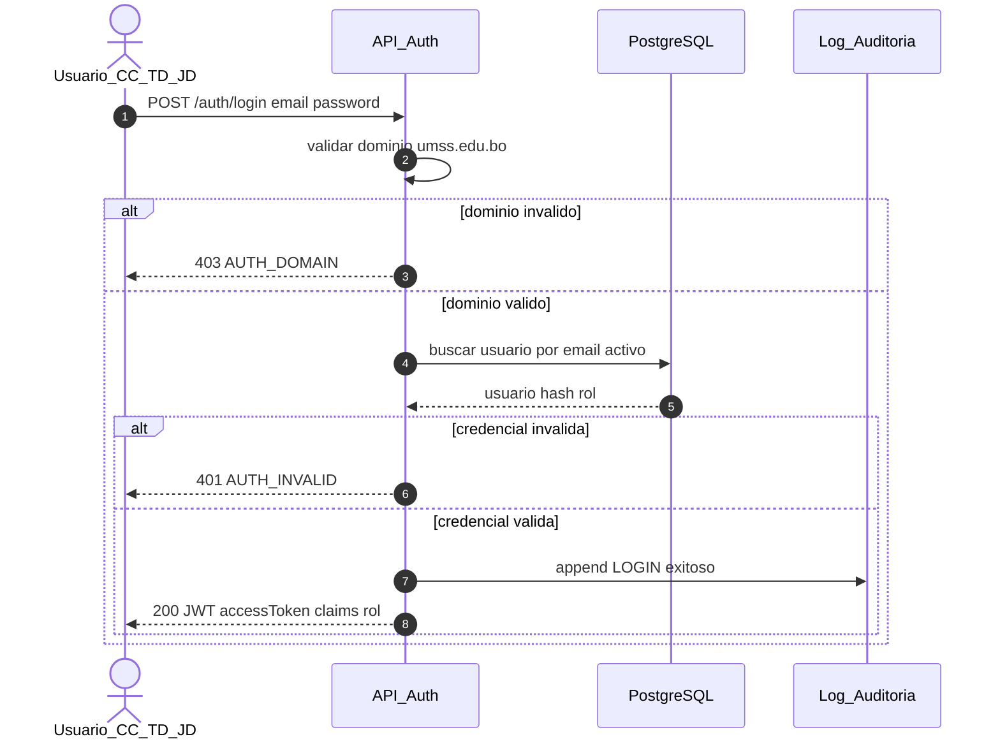

---

### D-SEQ-002 — Secuencia: carga de evidencia y notificación TD

| Campo | Valor |
|-------|-------|
| **Objetivo** | FSD-UC-002 / RB-02, RB-04, BR-015 / PRD-REQ-003, PRD-REQ-004 |
| **Flujo** | Multipart → validación → hash → S3 → versión → estado EN_REVISION → outbox notificación |
| **Archivo** | `mmd/D-SEQ-002-carga-evidencia.mmd` |

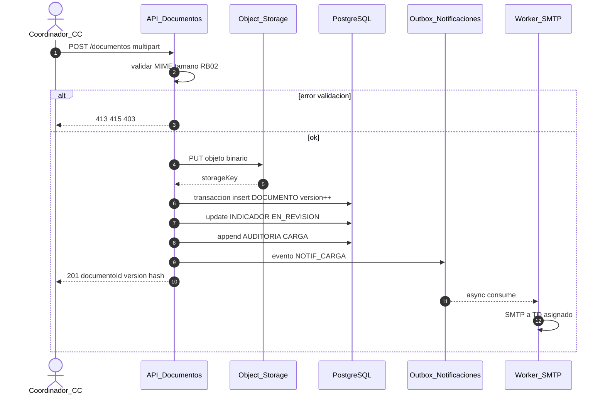

---

### D-SEQ-003 — Secuencia: dictamen TD y notificación CC

| Campo | Valor |
|-------|-------|
| **Objetivo** | FSD-UC-003 / RB-03, BR-014 / PRD-REQ-005 |
| **Archivo** | `mmd/D-SEQ-003-dictamen-td.mmd` |

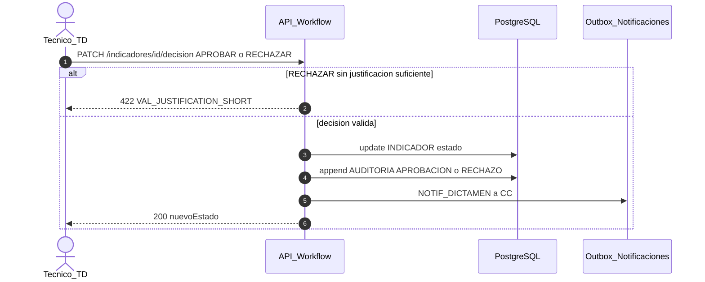

---

### D-SEQ-004 — Secuencia: generación asíncrona reporte PDF

| Campo | Valor |
|-------|-------|
| **Objetivo** | FSD-UC-005 / RB-07 / PRD-REQ-007 |
| **Archivo** | `mmd/D-SEQ-004-reporte-pdf.mmd` |

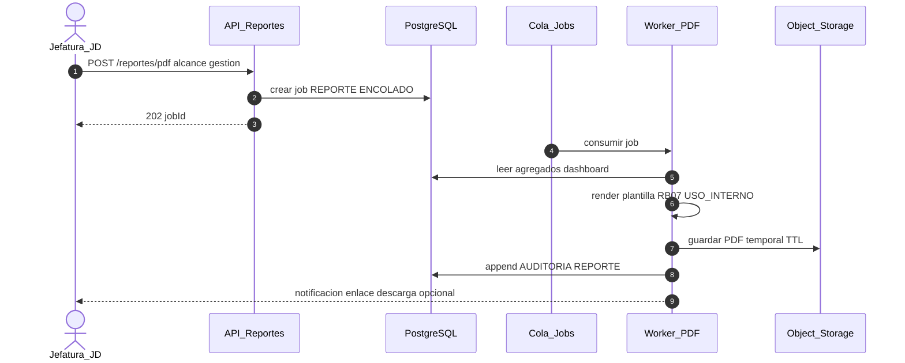

---

### D-SEQ-005 — Secuencia: integración futura datos maestros (SIIS / ESB)

| Campo | Valor |
|-------|-------|
| **Objetivo** | LFSD §2.2 integración SIIS v2 (fuera alcance v1.0) |
| **Archivo** | `mmd/D-SEQ-005-integracion-siis-futuro.mmd` |

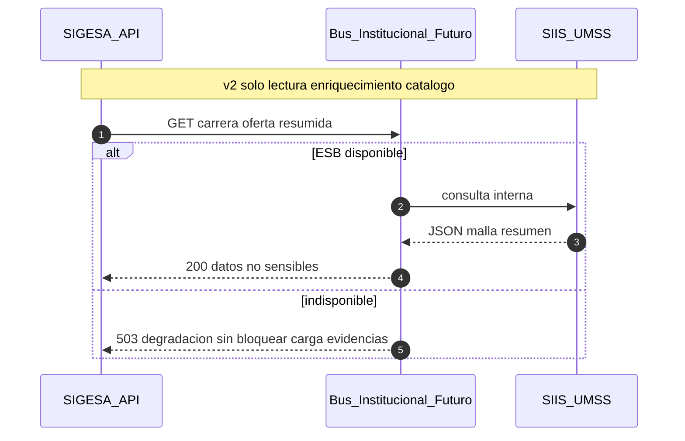

---

### D-STA-001 — Estado: ciclo de vida del indicador

| Campo | Valor |
|-------|-------|
| **Objetivo** | Estados coherente con UC-002 y UC-003 |
| **Archivo** | `mmd/D-STA-001-indicador.mmd` |

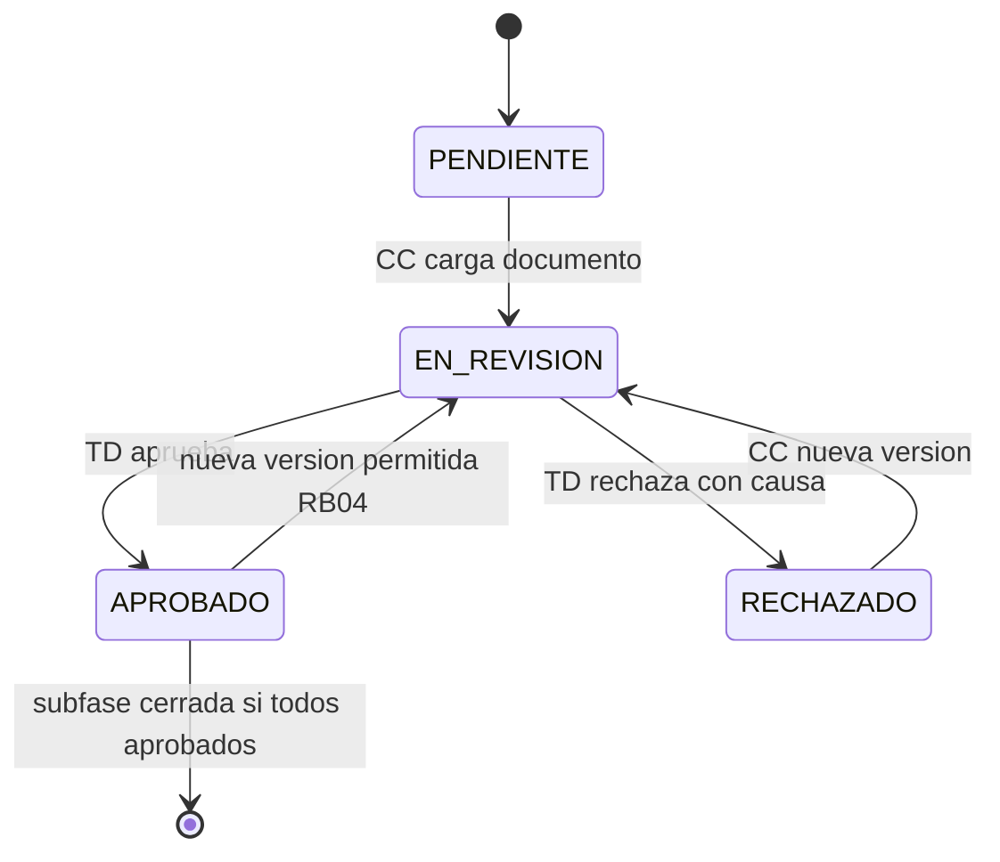

---

### D-STA-002 — Estado: proceso de acreditación instancia

| Campo | Valor |
|-------|-------|
| **Objetivo** | Taxonomías proceso CEUB/ARCU-SUR (T-012 LFSD §3; RB-01, RB-08) |
| **Archivo** | `mmd/D-STA-002-proceso-acreditacion.mmd` |

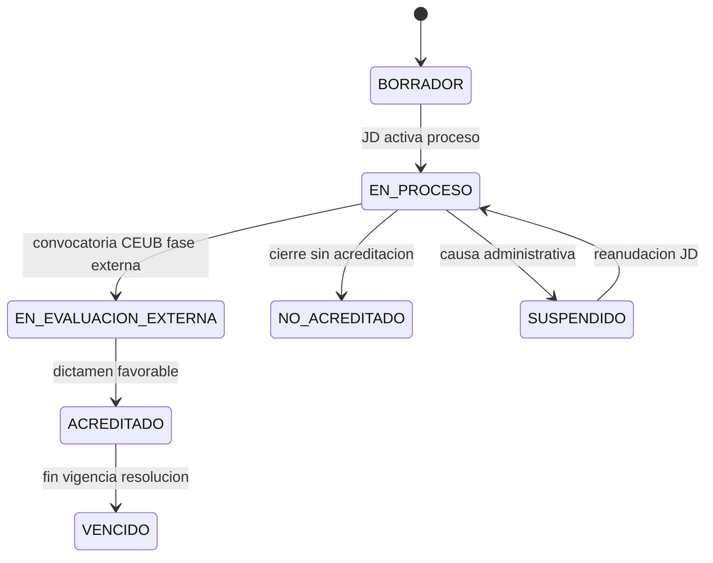

---

### D-ER-001 — ER: núcleo carrera–proceso–indicador–documento–auditoría

| Campo | Valor |
|-------|-------|
| **Objetivo** | Modelo lógico coherente con entidades descritas en LFSD §2.1 y §4 |
| **Archivo** | `mmd/D-ER-001-nucleo-sigesa.mmd` |

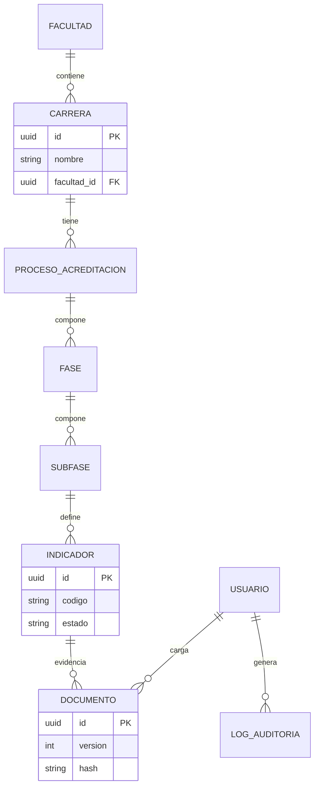

---

### D-GANTT-001 — Gantt: roadmap implementación y pruebas

| Campo | Valor |
|-------|-------|
| **Objetivo** | Plan despliegue alineado PRD/FSD |
| **Archivo** | `mmd/D-GANTT-001-roadmap-implementacion.mmd` |

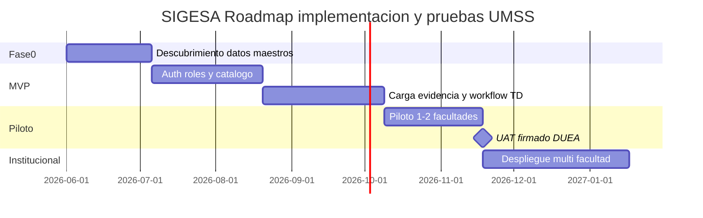

---

### D-GANTT-002 — Gantt: cronograma tipo proceso CEUB (carrera)

| Campo | Valor |
|-------|-------|
| **Objetivo** | Visualizar autoevaluacion revision y cierre |
| **Archivo** | `mmd/D-GANTT-002-cronograma-ceub-carrera.mmd` |

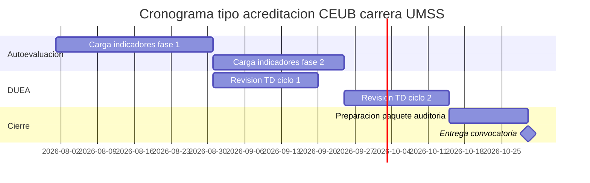

---

### D-FLOW-001 — Flujo: workflow macro aprobación institucional

| Campo | Valor |
|-------|-------|
| **Objetivo** | Vista proceso CC TD JD |
| **Archivo** | `mmd/D-FLOW-001-workflow-aprobacion.mmd` |

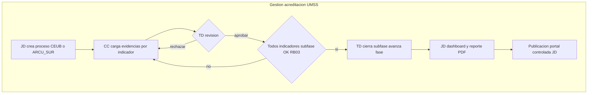

---

### D-ARCH-001 — Arquitectura: capas lógicas del sistema

| Campo | Valor |
|-------|-------|
| **Objetivo** | Separación presentación API datos mensajería |
| **Archivo** | `mmd/D-ARCH-001-capas-sistema.mmd` |

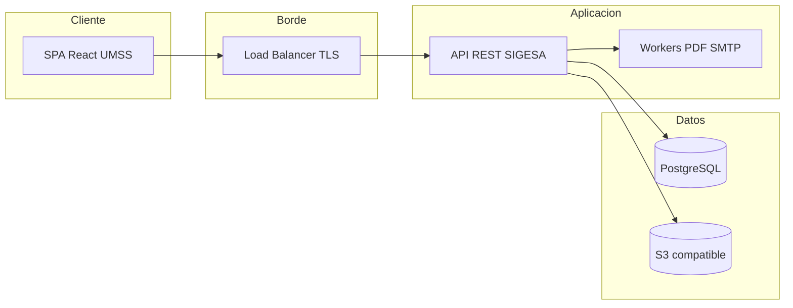

---

### D-COMP-001 — Componentes: módulos y límites

| Campo | Valor |
|-------|-------|
| **Objetivo** | Mapeo FSD módulos M1–M11 |
| **Archivo** | `mmd/D-COMP-001-modulos-sigesa.mmd` |

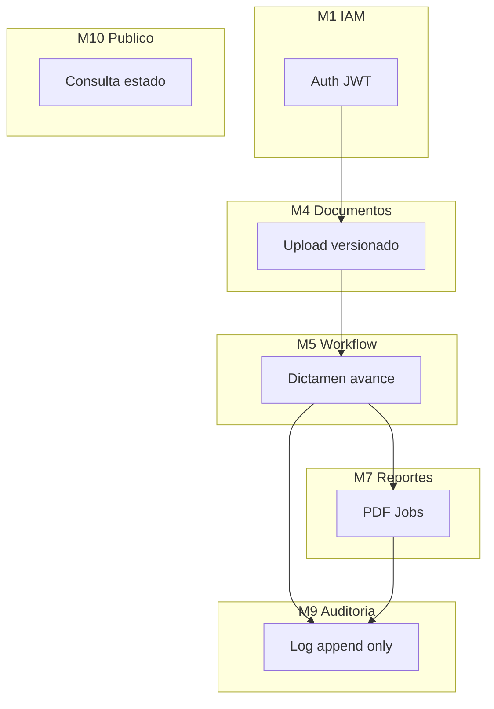

---

### D-CLASS-001 — Clases: dominio simplificado

| Campo | Valor |
|-------|-------|
| **Objetivo** | Responsabilidades y asociaciones clave (LFSD §2.1 auditoría / NFR-013) |
| **Archivo** | `mmd/D-CLASS-001-dominio-sigesa.mmd` |

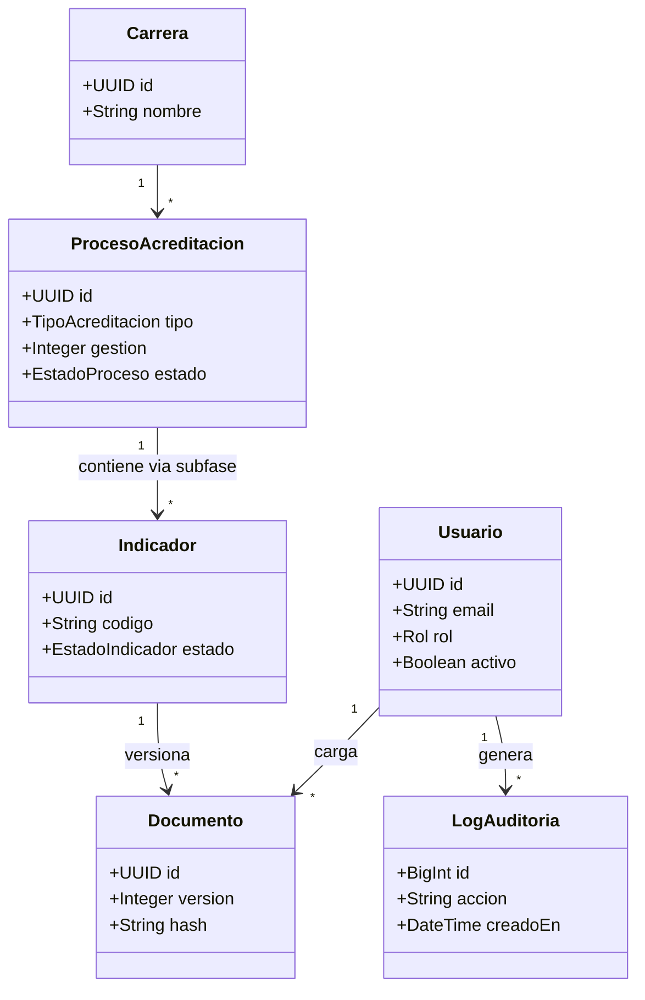

---

### D-JOURNEY-001 — User Journey: coordinador carga evidencia CEUB

| Campo | Valor |
|-------|-------|
| **Objetivo** | Experiencia CC en plazo convocatoria |
| **Archivo** | `mmd/D-JOURNEY-001-coordinador-carga.mmd` |

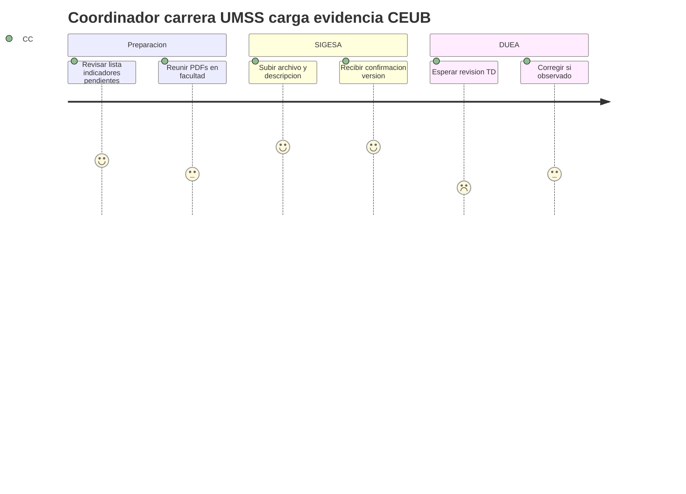

---

### D-ACT-001 — Actividad: observaciones y plan de mejora

| Campo | Valor |
|-------|-------|
| **Objetivo** | Plan de mejora post-rechazo (LFSD §2.1 alcance) |
| **Archivo** | `mmd/D-ACT-001-observaciones-mejoras.mmd` |

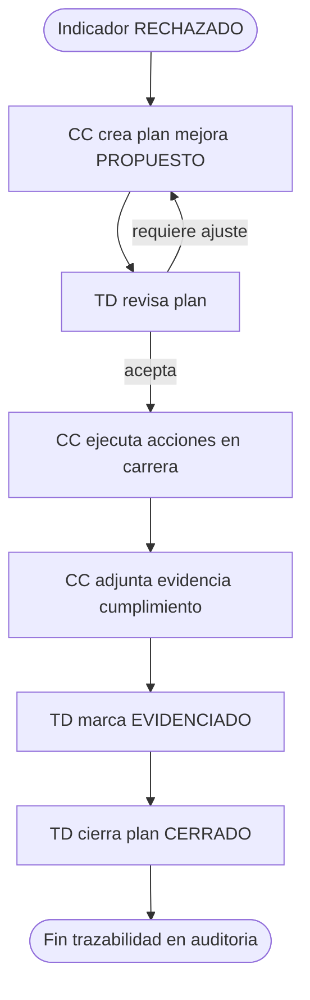

---

## 6. Criterios de aceptación de la documentación gráfica

1. Los **14** diagramas renderizan sin error en **mermaid.live** y en GitLab/GitHub.  
2. La matriz §4 cubre los **cinco** casos de uso detallados en LFSD §4 (FSD-UC-001 … UC-005) y las capacidades transversales citadas en §2.1 / §12.  
3. Cada `.mmd` incluye comentario de cabecera con `diagramId`, `fsdTrace`, `version`.

---

## 7. Registro de cambios

| Versión | Fecha | Descripción |
|---------|-------|-------------|
| v1.0 | 14/05/2026 | 14 diagramas + matriz trazabilidad FSD |

---

*Documento maestro: `08_mermaid/ARQ_Mermaid_SIGESA_FSD_Traceability_v1.md`*
