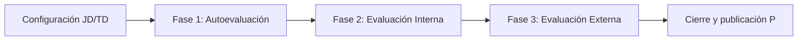

# SIGESA — Sistema Gestor de Acreditaciones UMSS

**Ámbito:** `team/alexAlvarez/docs/00_overview/`  
**Versión:** v1.0  
**Fecha:** 17/05/2026  
**Autor:** Alex Álvarez (AcredIA / UMSS)  
**Estado:** Aprobado para revisión docente  

---

## Propósito de este documento

Este README es el **punto de entrada** de la documentación del proyecto SIGESA en el espacio de trabajo `team/alexAlvarez/docs/`. Consolida la visión ejecutiva, orienta a los lectores hacia los artefactos numerados (`01_brd` … `09_trazabilidad`) y fija las **reglas de lectura** que todo implementador, revisor o agente de IA debe respetar antes de proponer cambios en código o especificaciones.

Para el detalle de límites del proyecto, ver [`alcance_proyecto.md`](alcance_proyecto.md). Para la definición formal del producto (problema, propuesta, actores, métricas), ver [`definicion_producto.md`](definicion_producto.md).

---

## Qué es SIGESA

**SIGESA** (*Sistema de Gestión y Seguimiento de Evaluación y Acreditación*) es una plataforma web institucional diseñada para la **Dirección Universitaria de Evaluación y Acreditación (DUEA)** de la Universidad Mayor de San Simón (UMSS). Su misión operativa es **orquestar, monitorear y auditar** el ciclo de vida completo de los procesos de acreditación de carreras, bajo los marcos normativos **CEUB** (evaluación nacional) y **ARCU-SUR** (evaluación internacional en el ámbito regional).

El sistema no es un gestor documental genérico. Es un **motor de procesos normativos**: cada acción del usuario ocurre dentro de un **Proceso** de acreditación activo, en una **Fase** determinada, contra un **Indicador** específico de la taxonomía oficial. La unidad de valor auditada no es un “archivo suelto”, sino la entidad de dominio **Evidencia** — documento probatorio versionado, inmutable y enlazado a observaciones cuando corresponde.

### Transformación que busca

| Situación actual (as-is) | Situación objetivo (to-be) con SIGESA |
|--------------------------|--------------------------------------|
| Evidencias dispersas en Excel, correo, Drive, USB, WhatsApp | **Única fuente de verdad** con taxonomía CEUB/ARCU-SUR integrada |
| Versiones contradictorias sin dueño claro | **Versionado append-only** con historial completo por indicador |
| Jefatura DUEA sin visibilidad en tiempo real | **Dashboards** y reportes ejecutivos con semáforos de avance |
| Observaciones desconectadas de las correcciones | **Subsanación anclada** a la Observación que la originó |
| Avance de fase negociado informalmente | **Máquina de estados** con bloqueos duros verificables en backend |

---

## Jerarquía de dominio (no negociable)

Toda la documentación y el código deben respetar esta cadena relacional. **No se permiten saltos de nivel** ni sinónimos que colapsen conceptos:

```text
Carrera → Proceso (AccreditationProcess) → Fase (Phase)
    → Dimensión → Criterio → Indicador → Evidencia (Evidence)
```

Las **Observaciones** emitidas por el **Técnico DUEA [TD]** se vinculan a un **Indicador** y a una versión concreta de **Evidencia**. Las subsanaciones del **Coordinador de Carrera [CC]** crean **nuevas versiones** de Evidencia; nunca reemplazan ni borran las anteriores.

---

## Actores oficiales

SIGESA opera con cuatro perfiles. La nomenclatura entre corchetes es **obligatoria** en toda la suite documental.

### [CC] Coordinador de Carrera

- **Rol:** Operativo — responsable de la evidencia de su programa académico.
- **Alcance de datos:** Una sola carrera (aislamiento estricto).
- **Acciones clave:** Carga inicial de **Evidencia** en Fase 1; lectura de **Observaciones**; subsanación en Fase 2; consulta de avance y plazos.
- **Prohibiciones de negocio:** No crea **Procesos**, no modifica plantillas normativas, no aprueba indicadores ni fuerza transiciones de **Fase**.

### [TD] Técnico DUEA

- **Rol:** Auditor y orquestador operativo de la calidad documental.
- **Alcance de datos:** Global (todas las carreras en proceso, según asignación institucional).
- **Acciones clave:** Revisión de **Evidencia**, emisión de **Observaciones** justificadas, transición de estados del **Indicador**, autorización de cierre de **Fase** cuando la agregación de indicadores lo permita.
- **Responsabilidad crítica:** Garantizar que ningún indicador pase a **APROBADO** sin revisión explícita cuando exista evidencia en estado **SUBIDO** o **SUBSANADO**.

### [JD] Jefatura DUEA

- **Rol:** Estratégico y de gobierno del sistema.
- **Acciones clave:** Creación de **Procesos**, parametrización de datos maestros (facultades, carreras, cronogramas), supervisión mediante paneles gerenciales, registro de dictámenes finales, publicación hacia el portal de transparencia.
- **Visibilidad:** Total sobre métricas, usuarios y configuración.

### [P] Público

- **Rol:** Consulta externa (sin sesión o con acceso de solo lectura según diseño).
- **Acciones:** Verificar estado de acreditación publicado y descargar certificaciones validadas institucionalmente.

---

## Ciclo de vida del proceso (macro)



1. **Configuración:** [JD] o [TD] instancia un **Proceso**, selecciona modalidad **CEUB** o **ARCU-SUR**; el sistema materializa el árbol normativo (Dimensiones, Criterios, Indicadores).
2. **Fase 1 — Autoevaluación:** [CC] carga **Evidencia** masivamente por indicador; [TD] audita.
3. **Fase 2 — Evaluación Interna / Subsanación:** Solo correcciones enlazadas a **Observaciones** abiertas; bucle CC↔TD hasta cumplimiento.
4. **Fase 3 — Evaluación Externa:** Acompañamiento a pares evaluadores; dictamen y certificación.
5. **Publicación:** Resultados visibles para [P] según política institucional.

**Regla de oro:** No existe avance de **Fase N** a **Fase N+1** si queda al menos un **Indicador** en estado distinto de **APROBADO** según las reglas agregadas documentadas en `context/04_state_machine.md`.

---

## Máquina de estados del Indicador (micro)

Estados válidos y transiciones principales:

| Estado | Significado | Actor responsable del siguiente paso |
|--------|-------------|--------------------------------------|
| `PENDIENTE` | Sin evidencia cargada | [CC] |
| `SUBIDO` | Evidencia en bandeja de auditoría | [TD] |
| `OBSERVADO` | Rechazo formal con Observación | [CC] |
| `SUBSANADO` | Nueva versión enviada | [TD] |
| `APROBADO` | Cumplimiento verificado | — (cerrado) |

La implementación debe tratar el bloqueo de avance de fase como **hard constraint** en API y UI (botones deshabilitados + validación transaccional en servidor).

---

## Política de Evidencia: Append-Only

Por requisitos de auditoría institucional y alineación al glosario de dominio:

- **Prohibido:** `DELETE` físico o lógico que elimine prueba normativa ya registrada.
- **Prohibido:** `UPDATE` destructivo que sobrescriba el binario o metadatos de una versión histórica.
- **Obligatorio:** Insertar **nueva fila/version** (`v2`, `v3`, …) con referencia a la **Observación** que motivó la corrección.

Esta política aplica a almacenamiento, API y modelos de datos. Cualquier diseño que proponga “reemplazar archivo” sin versionado **contradice** el BRD y los NFR de trazabilidad.

---

## Priorización funcional (referencia rápida)

| Prioridad | Capacidades |
|-----------|-------------|
| **P1 — Crítico** | RBAC por rol; máquina de estados; repositorio **Evidencia** append-only; taxonomía CEUB/ARCU-SUR |
| **P2 — Importante** | Dashboards [JD]/[TD]; alertas de plazos; módulo de **Observaciones** con justificación obligatoria |
| **P3 — Valioso** | Exportación PDF/Excel; log histórico de procesos cerrados; portal [P] |

Detalle de épicas y historias: [`../03_prd/PRD.md`](../03_prd/PRD.md).

---

## Mapa de la documentación numerada

| Carpeta | Artefacto | Estado en este workspace |
|---------|-----------|---------------------------|
| `00_overview/` | Este README + alcance + definición producto | **Completo** (v1.0) |
| `01_brd/` | `BRD.md` | Completo |
| `02_mrd/` | `MRD.md` | Completo |
| `03_prd/` | PRD, user stories, journeys, roadmap | Completo |
| `04_fsd/` | FSD (+ casos de uso, gherkin, etc.) | Parcial — solo `FSD.md` reubicado |
| `05_nfr` … `09_trazabilidad` | Según rúbrica del curso | Pendiente |

**Material de apoyo (fuera de numeración):** `context/` — glosario (`03_domain_glossary.md`), máquina de estados (`04_state_machine.md`), visiones de negocio en `.txt`.

---

## Directivas para agentes de IA y desarrolladores

Antes de generar código, DDL o contratos OpenAPI:

1. **Lenguaje ubicuo:** Usar `Evidence`, `Phase`, `Indicator`, `Observation` — no `File`, `Step`, `Stage` para conceptos de dominio.
2. **Roles en código:** `Coordinator` ([CC]), `Technician` ([TD]), `Admin` ([JD]) — no “Cliente” ni “Super Admin”.
3. **Pruebas prioritarias:** Ciclo Rechazo → Observación → Subsanación; aislamiento de carrera para [CC]; bloqueo de fase con indicadores no aprobados.
4. **Higiene de datos:** No introducir columnas residuales de importación (`Unnamed: 0`) ni campos ajenos al dominio (p. ej. `gtin`) en modelos o diccionarios.

---

## Convención de commits

```bash
git config commit.template .gitmessage.txt
```

*(Desde la raíz del repositorio `sigesa-docs`, si el template está disponible.)*

---

## Referencias cruzadas inmediatas

- Alcance formal IN/OUT: [`alcance_proyecto.md`](alcance_proyecto.md)
- Definición de producto y criterios de éxito: [`definicion_producto.md`](definicion_producto.md)
- Requerimientos de negocio: [`../01_brd/BRD.md`](../01_brd/BRD.md)
- Especificación funcional (borrador): [`../04_fsd/FSD.md`](../04_fsd/FSD.md)
- Glosario extendido: [`../context/03_domain_glossary.md`](../context/03_domain_glossary.md)
