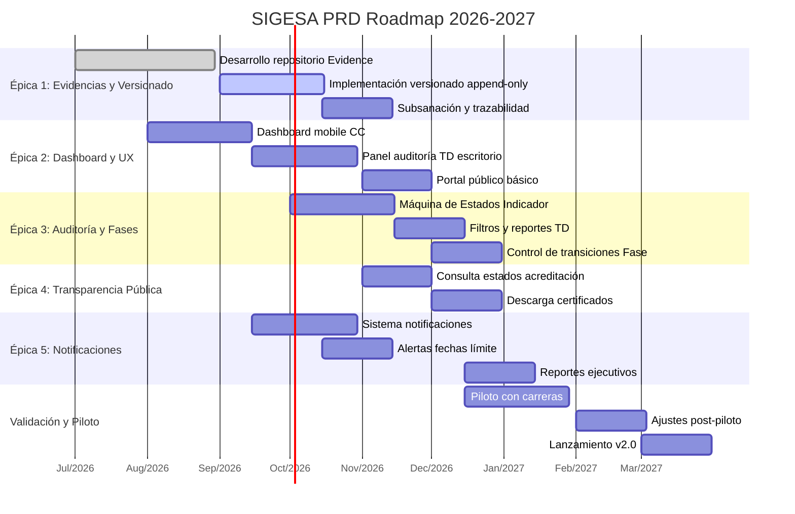

# Roadmap — SIGESA / AcredIA

> Planificación visual de entregas por hitos, mapeando Épicas desarrolladas con diagrama Gantt.

## 1. Roadmap de entregas

## 2. Desglose por hitos

- **Q3 2026**: Validación de requisitos, desarrollo base de Evidencias y UX inicial.
- **Q4 2026**: Implementación completa de Épicas 1-5, piloto institucional.
- **Q1 2027**: Ajustes basados en feedback, preparación para lanzamiento.
- **Q2 2027**: Lanzamiento v2.0 con integraciones adicionales.
