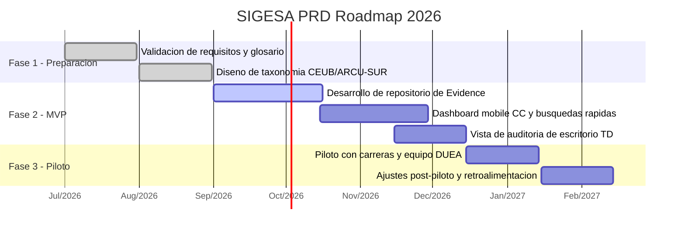

# Roadmap — SIGESA / AcredIA

> Plan de entregas dividido por fases de acreditación, con foco en el lanzamiento MVP y la validación de funcionalidades clave.

## 1. Roadmap de entregas

## 2. Desglose por fases

- **Fase 1 (Q3 2026)**: validación de requisitos, definición de glosario, diseño de taxonomía y casos de uso.
- **Fase 2 (Q4 2026)**: construcción del MVP, incluyendo repositorio de Evidence, dashboard CC mobile, búsquedas rápidas y auditoría de TD.
- **Fase 3 (Q4 2026 — Q1 2027)**: piloto institucional, ajustes con feedback y preparación para despliegue ampliado.
