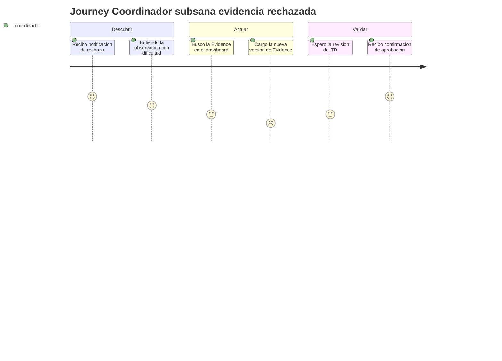

# User Journeys — SIGESA / AcredIA

> Los siguientes viajes reflejan los flujos críticos de uso para el Coordinador de Carrera [CC] y el Técnico DUEA [TD].

## 1. Viaje del Coordinador de Carrera subsanando una evidencia rechazada

El Coordinador experimenta urgencia y alivio: desde la frustración inicial por el rechazo hasta la seguridad de haber completado la corrección.

## 2. Viaje del Técnico DUEA revisando indicadores en un lote

El Técnico transita de concentración a alivio al filtrar el lote correcto y cerrar decisiones con justificación clara.

