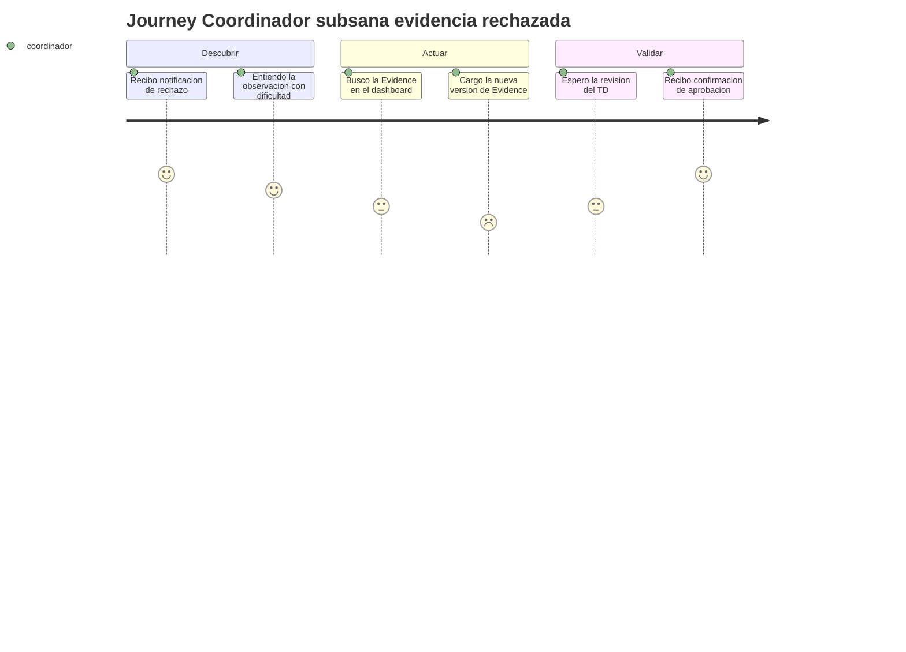
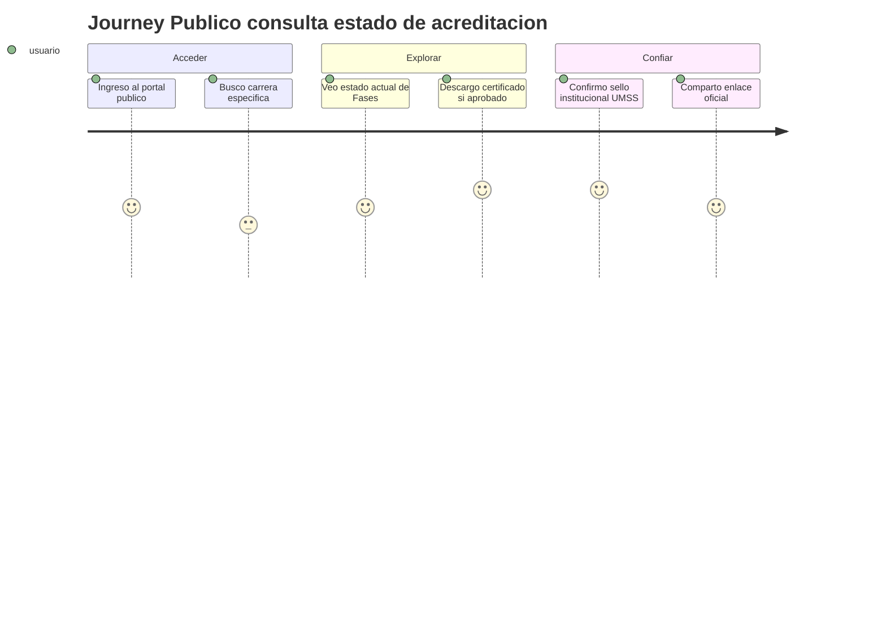
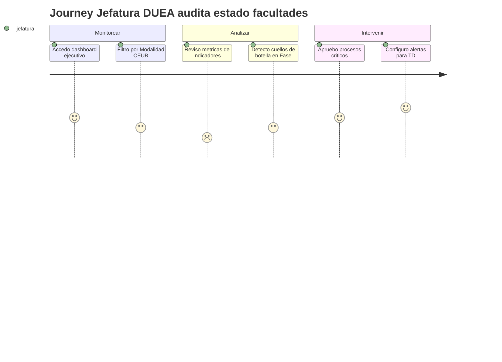
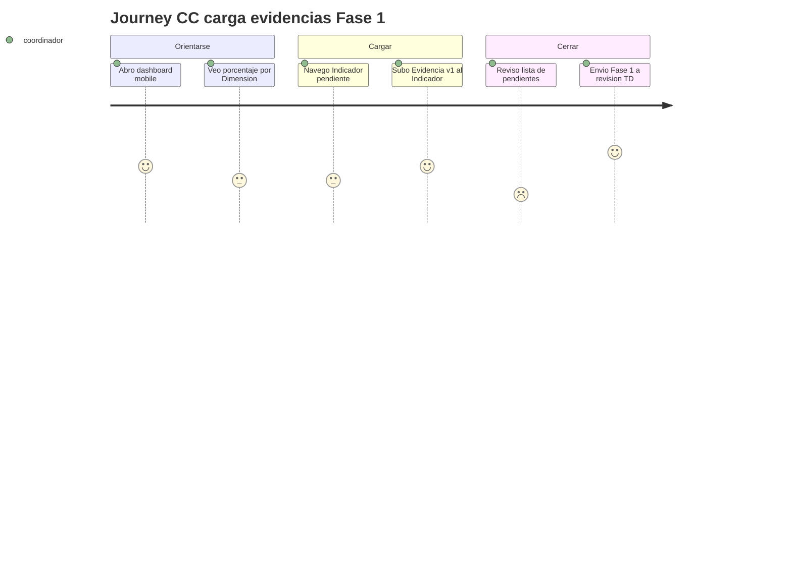

# User Journeys — SIGESA / AcredIA

> Narrativas visuales de viajes críticos de usuario, mapeadas con diagramas Mermaid (`journey`, `sequenceDiagram`, `flowchart`). Alineado a `00_overview/`, `context/04_state_machine.md` y roles oficiales [CC], [TD], [JD], [P].

| # | Journey | Actor | Diagrama |
|---|---------|-------|----------|
| 1 | Subsanación tras observación | [CC] | `journey` + `sequenceDiagram` |
| 2 | Auditoría por lote | [TD] | `journey` |
| 3 | Consulta pública | [P] | `journey` |
| 4 | Supervisión ejecutiva | [JD] | `journey` |
| 5 | Carga inicial Fase 1 | [CC] | `journey` |
| 6 | Apertura de proceso | [JD]/[TD] | `flowchart` |

---

## 1. Viaje del Coordinador de Carrera subsanando una evidencia observada

En un contexto de alta presión por fechas límite de acreditación, el [CC] enfrenta frustración y urgencia al recibir una notificación de rechazo en un Indicador clave. El problema central es la necesidad de corregir rápidamente una Evidencia sin perder versiones previas, asegurando que la Fase no se bloquee. Este flujo es crítico porque permite la subsanación append-only, manteniendo la trazabilidad auditada y liberando el proceso normativo sin interrupciones prolongadas.

### 1.1 Secuencia: subsanación anclada (camino crítico)

Flujo técnico-normativo del bucle Fase 2; el sistema **no** elimina la **Evidencia** v1.

**Diagrama canónico:** [`../07_diagramas/UC01_secuencia.mmd`](../07_diagramas/UC01_secuencia.mmd) · Estados: [`UC01_estado.mmd`](../07_diagramas/UC01_estado.mmd)

---

## 2. Viaje del Técnico DUEA revisando indicadores en un lote

El [TD] inicia con concentración técnica, pero puede sentir sobrecarga al manejar lotes grandes de Evidencias en múltiples Indicadores. El problema es filtrar eficientemente para auditar solo lo relevante, registrando rechazos con justificación clara para evitar disputas. Este viaje es crítico para la Máquina de Estados, ya que las decisiones del [TD] determinan si una Fase avanza, impactando directamente en el cumplimiento CEUB/ARCU-SUR y la eficiencia institucional.

## 3. Viaje del Público consultando estado de acreditación

El usuario público, como estudiante o empleador, busca confianza y transparencia en un entorno de incertidumbre sobre la calidad educativa. El problema es acceder a **información oficial ya publicada** por la UMSS (estado de acreditación y certificados), **sin** exponer el repositorio interno de **Evidencia** ni datos operativos de [CC]/[TD]. Este flujo es crítico para la reputación institucional y el cumplimiento de transparencia universitaria.

> **Alcance [P]:** solo lectura de vistas publicadas por [JD]; sin acceso a versiones internas de **Evidencia** (PRD-US-016, BRD visibilidad).

## 4. Viaje de la Jefatura DUEA auditando estado general de facultades

La [JD] opera bajo responsabilidad estratégica, monitoreando el rendimiento institucional para asegurar la continuidad de procesos normativos. El problema es detectar cuellos de botella en una Modalidad como CEUB, revisando métricas consolidadas en un dashboard ejecutivo para intervenir proactivamente. Este viaje es crítico porque permite a la [JD] gestionar riesgos a nivel global, aprobando Procesos y configurando datos maestros, impactando en la eficiencia de todas las Carreras y el cumplimiento regulatorio.

## 5. Viaje del Coordinador de Carrera en Fase 1 (autoevaluación)

El [CC] debe completar la carga inicial de **Evidencia** en todos los indicadores obligatorios antes de enviar la fase a revisión del [TD]. La frustración principal es no saber qué indicadores faltan en un árbol normativo extenso.

## 6. Viaje de apertura de Proceso ([JD] / [TD])

La **Jefatura DUEA** (o [TD] delegado) instancia el **Proceso**, selecciona modalidad **CEUB** o **ARCU-SUR** y activa el cronograma. El sistema materializa la taxonomía completa.

**Diagrama canónico:** [`../07_diagramas/UC03_secuencia.mmd`](../07_diagramas/UC03_secuencia.mmd) (apertura + cierre de fase)

---

## Trazabilidad a historias de usuario

| Journey | User stories |
|---------|----------------|
| §1 Subsanación | PRD-US-003, PRD-US-005, PRD-US-009 |
| §2 Auditoría lote | PRD-US-007, PRD-US-008, PRD-US-014 |
| §3 Portal [P] | PRD-US-016, PRD-US-017 |
| §4 Dashboard [JD] | PRD-US-015, PRD-US-020 |
| §5 Fase 1 [CC] | PRD-US-002, PRD-US-004, PRD-US-006 |
| §6 Apertura proceso | PRD-US-023 (configuración taxonomía) |
