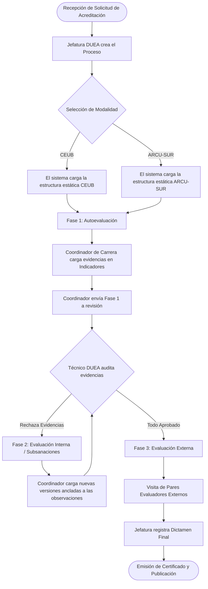
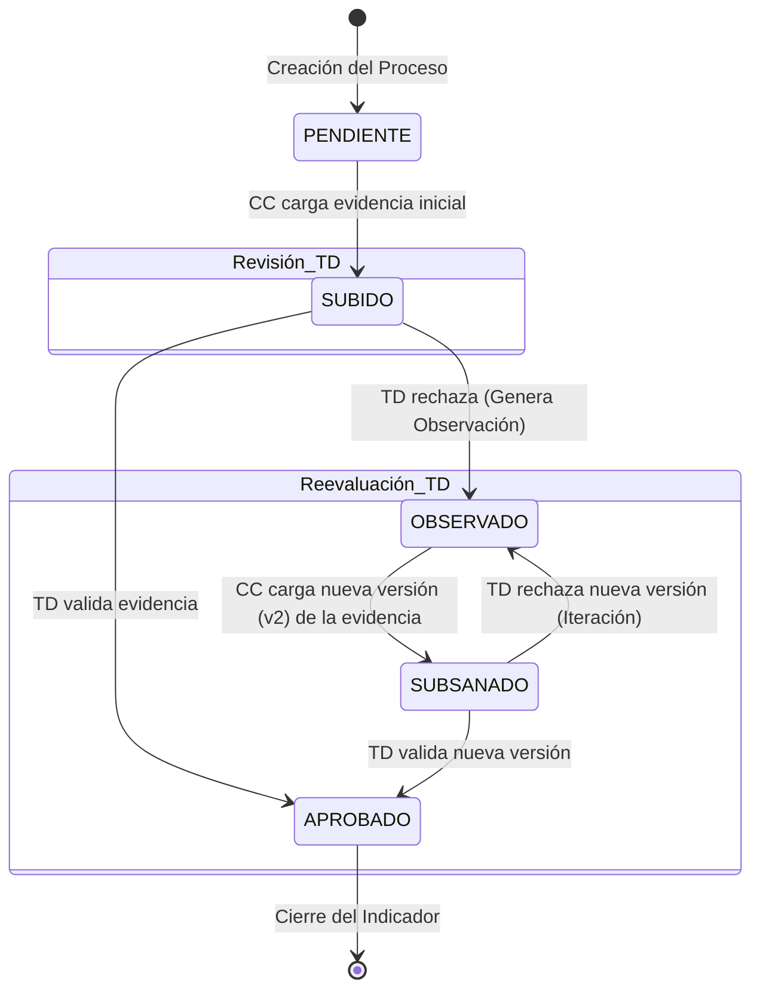

# Máquina de Estados y Flujos de Proceso (State Machine & Process Flows)

Este documento define la orquestación lógica del sistema SIGESA mediante diagramas de flujo. El sistema se divide en el **Flujo de Proceso Macro** (el ciclo de vida completo de la acreditación) y la **Máquina de Estados Micro** (el ciclo de revisión de un indicador individual).

---

## 1. Flujo Macro de Acreditación (The Accreditation Lifecycle)

El proceso general sigue una ruta estricta gobernada por las decisiones administrativas y la normativa. El flujo comienza con la creación administrativa y finaliza con la certificación pública.

---

## 2. Máquina de Estados del Indicador (Micro-Nivel)

La máquina de estados principal reside a nivel del `Indicador`. El estado de toda una `Fase` depende enteramente de la agregación de los estados de sus respectivos indicadores.

El siguiente diagrama muestra el ciclo de vida de un indicador aislado durante las interacciones entre el Coordinador de Carrera (CC) y el Técnico DUEA (TD).

### Descripción de Estados Válidos
* **PENDIENTE:** Estado inactivo inicial. El indicador requiere acción por parte del Coordinador de Carrera.
* **SUBIDO:** La evidencia ha sido provista y está en la bandeja de entrada virtual del Técnico DUEA esperando auditoría.
* **OBSERVADO:** El indicador fue evaluado y reprobado. El sistema bloquea el avance del proceso y exige acción inmediata por parte del Coordinador de Carrera.
* **SUBSANADO:** El Coordinador de Carrera ha enviado una corrección. Retorna la responsabilidad de revisión al Técnico DUEA.
* **APROBADO:** Resolución final afirmativa. El indicador ha cumplido la métrica normativa.

---

## 3. Reglas Críticas de Transición (Hard Constraints)

La arquitectura de software debe aplicar la siguiente regla infranqueable a nivel de backend:

**Regla de Cierre de Fase:**
Una `Fase` transiciona a estado `COMPLETADA` (permitiendo abrir la subsecuente) **SI Y SÓLO SI**:
* La cantidad total de Indicadores pertenecientes a la Modalidad es igual a la cantidad de Indicadores en estado `APROBADO`.
* Matemáticamente en base de datos: `COUNT(Total_Indicadores) == COUNT(Indicadores WHERE estado = 'APROBADO')`.

Cualquier indicador que permanezca en `PENDIENTE`, `SUBIDO`, `OBSERVADO` o `SUBSANADO` disparará una excepción de validación que impedirá el cambio de estado de la Fase macro.

