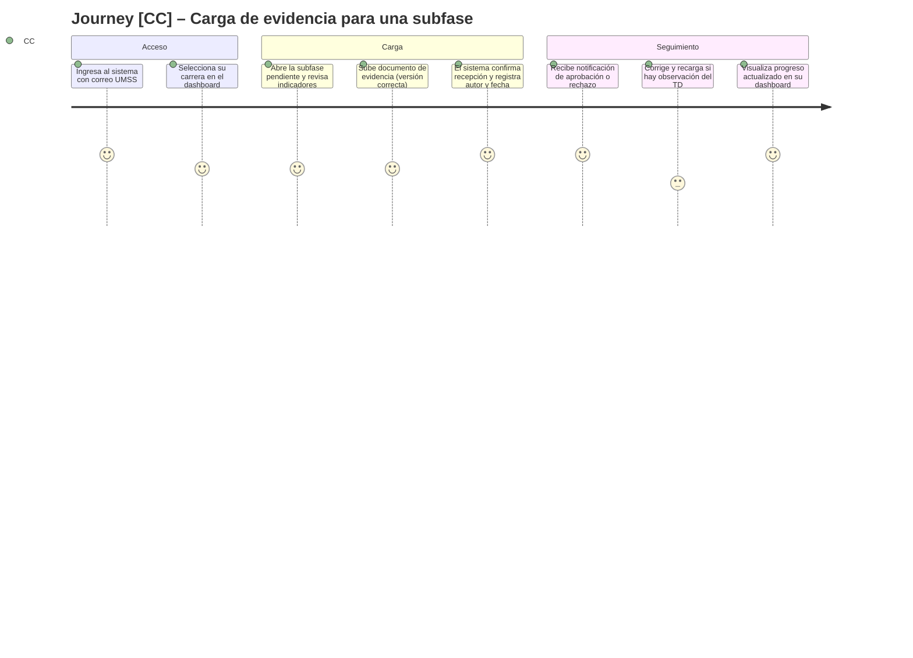
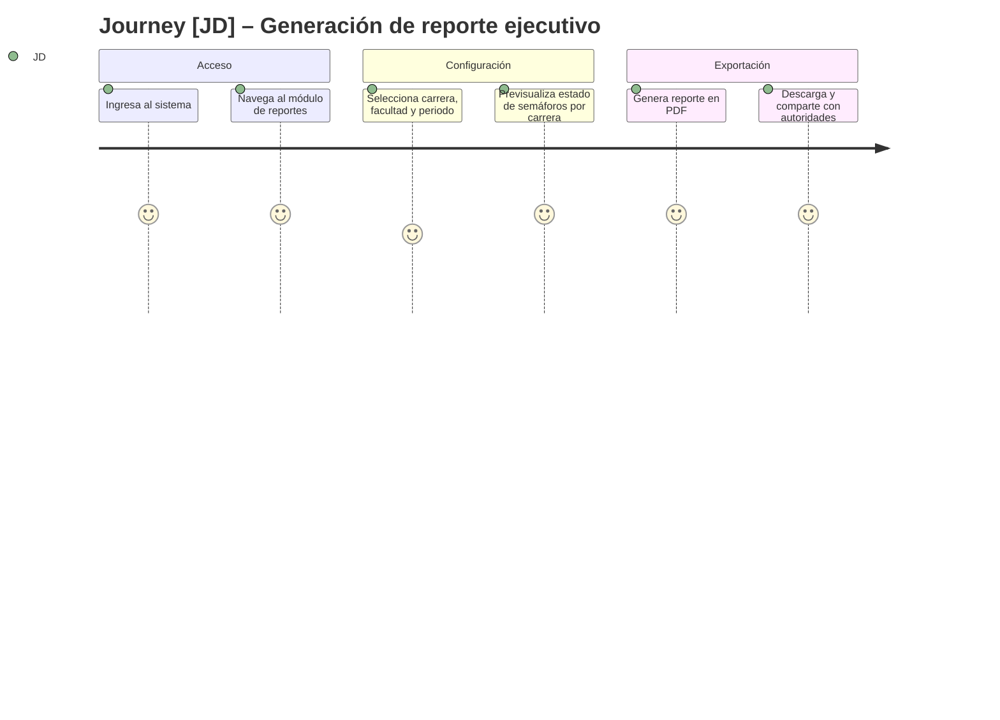
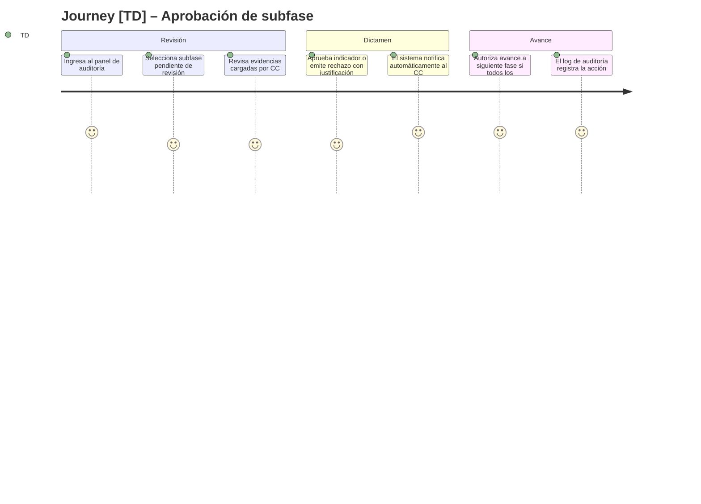

# Product Requirements Document (PRD) – AcredIA / SIGESA

> **Propósito del PRD**: describir **qué debe hacer el producto** para cumplir los requerimientos del BRD v2, con nivel suficiente para que diseño, ingeniería y QA puedan proceder. Responde a **"¿qué hace el producto?"** (no *cómo* lo hace).
>
> Audiencia: Product, Diseño (UX/UI), Ingeniería, QA.

---

## 0. Metadatos

| Campo | Valor |
|-------|-------|
| Producto | AcredIA / SIGESA — Sistema Inteligente de Gestión y Seguimiento de Acreditaciones |
| Grupo | AcredIA |
| Versión | `v1.0` |
| Fecha | 11/05/2026 |
| Product Manager / Autor | Aylen Mariangel Gonzales Alvino |
| Revisores | M.Sc. Edson Terceros Torrico · Tech Lead AcredIA · QA AcredIA |
| Estado | Borrador |
| BRD de referencia | BRD v2.0 — `team/aylenGonzales/BRD_v2.md` |
| MRD de referencia | MRD v1 (pendiente de generación) |
| Insumos M2 (UI/UX) | Prototipo Hi-Fi AcredIA (Bitácora 3) · wireframes de flujo de carga de evidencias · dashboard de semáforos |
| Fase Spec Kit cubierta | Specify ✅ / Plan ⬜ / Tasks ⬜ / Implement ⬜ |
| Prompts utilizados | PM-007 — `./PROMPT_MAPPING.md` |

---

## 0.1 Constitution

- **Principio 1**: Todo flujo crítico (carga de evidencia, aprobación de subfase, generación de reporte) debe completarse en ≤ 3 pasos desde la pantalla principal del actor.
- **Principio 2**: Ningún documento aprobado puede eliminarse; toda acción sobre evidencia queda registrada en log inmutable con usuario, fecha y hora.
- **Principio 3**: El sistema debe ser operable íntegramente desde un navegador web sin instalación de software adicional; la experiencia en móvil para [CC] debe ser funcional en tareas de consulta y carga.
- **Principio 4**: Las sugerencias asistidas por IA son orientativas; los dictámenes de acreditación y aprobaciones finales permanecen bajo responsabilidad humana institucional.

---

## 1. Resumen del producto

AcredIA / SIGESA es un sistema web activo de gestión y seguimiento de acreditaciones diseñado para la Dirección Universitaria de Evaluación y Acreditación (DUEA) de la UMSS, Cochabamba, Bolivia.

Resuelve el caos operativo actual —Excel aislado, correos, WhatsApp y pendrives— que obliga a los técnicos a invertir más de 20 minutos por sesión buscando la "versión final" de un documento, y deja a la jefatura sin visibilidad gerencial en tiempo real.

SIGESA centraliza toda la evidencia de acreditación CEUB y ARCU-SUR en una única fuente de verdad, automatiza los flujos de aprobación entre coordinadores de carrera y técnicos DUEA, y genera reportes ejecutivos en PDF en menos de 5 minutos. Es el único sistema diseñado nativamente para las normativas bolivianas de acreditación universitaria, eliminando las costosas adaptaciones manuales que exigen los sistemas globales.

Sus usuarios principales son: [CC] Coordinador de Carrera (carga y seguimiento de evidencias), [TD] Técnico DUEA (validación y auditoría), [JD] Jefatura DUEA (visibilidad estratégica y reportes) y [P] Público externo (transparencia institucional).

---

## 2. Objetivos del producto

| ID | Objetivo del producto | BRD vinculado | Métrica | Meta |
|----|------------------------|----------------|---------|------|
| OP-01 | Permitir localizar cualquier documento de acreditación en el sistema | BO-01 | Tiempo promedio de búsqueda | ≤ 2 min |
| OP-02 | Eliminar la pérdida documental en procesos de acreditación activos | BO-02 | Incidentes de pérdida por gestión | 0 |
| OP-03 | Habilitar generación autónoma de reportes ejecutivos por la jefatura | BO-03 | Tiempo promedio sin asistencia técnica | ≤ 5 min |
| OP-04 | Lograr adopción activa del sistema por todos los actores clave | BO-04 | % usuarios activos sobre total registrados | ≥ 80 % en 3 meses |
| OP-05 | Garantizar trazabilidad completa de evidencias en todos los procesos | BO-05 | % de fases con historial documental completo | 100 % |
| OP-06 | Asegurar coherencia normativa nativa con CEUB y ARCU-SUR | BR-007 | % de fases configuradas alineadas a estándares vigentes | 100 % |
| OP-07 | Notificar eventos críticos de forma automática y oportuna | BR-005 | % de eventos críticos notificados en ≤ 15 min | 100 % |

---

## 3. Alcance (*Scope*)

### 3.1 Dentro del alcance (release v1.0)

- Autenticación con correo institucional UMSS y gestión de roles diferenciados ([CC], [TD], [JD], [P]).
- Repositorio centralizado de evidencias con historial de versiones inmutable (autor, fecha, descripción).
- Flujo de aprobación/rechazo de documentos entre [CC] y [TD] con justificación obligatoria.
- Gestión de fases y subfases de acreditación CEUB y ARCU-SUR preconfiguradas.
- Dashboard gerencial con semáforos de estado por carrera y facultad para [JD].
- Generación automática de reportes ejecutivos en PDF por carrera y facultad.
- Notificaciones automáticas por correo institucional ante retrasos, rechazos y vencimientos.
- Buscador de documentos por título, carrera, facultad, modalidad y gestión.
- Log de auditoría inmutable de todas las acciones del sistema.
- Portal público de consulta de estado de acreditación sin autenticación para [P].
- Emisión y descarga de certificados de acreditación.
- Respaldo automático diario de base de datos y documentos.
- Gestión de planes de mejora vinculados al proceso de acreditación.
- Configuración inicial de 12 facultades, carreras y fases de acreditación UMSS.
- Exportación de reportes en Excel además de PDF (P3).
- Experiencia responsive para consulta y carga desde dispositivos móviles ([CC]).

### 3.2 Fuera del alcance (backlog)

- Integración en tiempo real con sistemas externos UMSS (SIIS académico, RRHH, ERP) — contemplado para v2.0.
- Módulo de pagos o cobro de certificaciones — fuera del modelo de negocio v1.
- Matrices de evaluación autogeneradas por pares evaluadores internacionales — v2.0.
- Control manual de respaldos por usuario (respaldos son automáticos).
- Integración con plataformas internacionales de ranking (QS, THE) — fuera del alcance normativo local.
- Informes de seguimiento de bitácoras internas — excluido de la versión 1.

### 3.3 Roadmap de versiones (Delivery track)

| Versión | Contenido | Fecha objetivo |
|---------|-----------|----------------|
| v1.0 | MVP: autenticación y roles, repositorio centralizado con versionado, flujo CC→TD aprobación/rechazo, fases CEUB/ARCU-SUR, dashboard JD, reportes PDF, notificaciones, buscador, log auditoría, portal público, respaldos | Q4 2026 |
| v1.1 | Planes de mejora, exportación Excel, experiencia móvil mejorada, WCAG 2.2 AA completo, gestión de cronogramas por proceso | Q1 2027 |
| v2.0 | Integración SIIS/RRHH, módulo evaluador externo [EE], IA asistencial (clasificación de evidencias, alertas de patrones de retraso), módulo de certificados digital | Q3 2027 |

### 3.4 Roadmap de validación (Discovery track)

| Sprint | Hipótesis a validar | Método | Criterio de éxito | Estado |
|--------|---------------------|--------|-------------------|--------|
| S1 | [CC] puede cargar evidencias sin capacitación previa en ≤ 3 pasos | Test de usabilidad con 3 coordinadores reales | Tasa de éxito ≥ 95 % | Abierta |
| S2 | [JD] genera reporte ejecutivo PDF de forma autónoma en ≤ 5 minutos | Test de usabilidad con jefa DUEA | Completado sin asistencia técnica | Abierta |
| S3 | [TD] aprueba/rechaza una subfase con justificación en ≤ 4 clics | Test de prototipo Hi-Fi | Tiempo de tarea ≤ 3 min, 0 errores críticos | Parcialmente validada (Bitácora 3) |
| S4 | El buscador reduce el tiempo de localización a ≤ 2 min vs. 20+ min actuales | Prueba comparativa con usuarios reales | Mediana ≤ 2 min en piloto UMSS | Abierta |
| S5 | La notificación automática elimina detección tardía de retrasos | Revisión de logs post-piloto | 100 % de eventos críticos notificados en ≤ 15 min | Abierta |

> **Regla de oro**: ninguna user story `Must` entra al Delivery track sin una hipótesis validada en el Discovery track.

---

## 4. Personas y *user journeys*

### 4.1 Personas

- **[CC] Coordinador de Carrera**: operativo, carga y corrige evidencias de su carrera, enfrenta plazos inamovibles sin confirmación de recepción. Dolor principal: incertidumbre sobre si sus documentos fueron recibidos y qué falta. Visibilidad: limitada a su carrera.
- **[TD] Técnico DUEA (Auditor)**: valida calidad técnica de evidencias, aprueba/rechaza indicadores con justificación obligatoria, orquesta el avance de fases. Dolor principal: búsqueda de versión final entre correos y carpetas (20+ min/sesión). Visibilidad: global.
- **[JD] Jefatura DUEA**: estratégica, monitorea cuellos de botella, configura el sistema, aprueba dictámenes finales. Dolor principal: depende de la memoria del equipo para saber el estado real; no puede generar reportes sin detener el trabajo técnico. Visibilidad: total.
- **[P] Público externo**: estudiantes, egresados, empleadores, organismos acreditadores. Consulta estado de acreditación y descarga certificados. Sin autenticación.

### 4.2 *User journeys* principales







---

## 5. *User stories* y criterios de aceptación

### 5.1 Épica E1 – Autenticación y gestión de roles

| ID | Historia | Prioridad | Valor | Esfuerzo | Criterios Gherkin |
|----|----------|-----------|-------|----------|-------------------|
| PRD-US-001 | Como usuario, quiero iniciar sesión con mi correo institucional UMSS para acceder al sistema según mi rol | Must | 10 | 3 | §5.1.1 |
| PRD-US-002 | Como [JD], quiero gestionar usuarios, facultades y plantillas normativas para administrar el sistema sin intervención técnica | Must | 8 | 5 | §5.1.2 |

#### 5.1.1 Criterios PRD-US-001

```gherkin
Escenario: Usuario con correo UMSS válido accede al sistema
  Dado un usuario con correo institucional @umss.edu.bo activo
  Cuando ingresa sus credenciales en la pantalla de login
  Entonces el sistema lo autentica y redirige a su dashboard según su rol ([CC], [TD] o [JD])
   Y no se admiten correos personales (@gmail, @hotmail, etc.)

Escenario: Correo no institucional intenta acceder
  Dado un usuario con correo no institucional
  Cuando intenta autenticarse
  Entonces el sistema muestra mensaje de error claro e impide el acceso
```

#### 5.1.2 Criterios PRD-US-002

```gherkin
Escenario: JD crea un nuevo usuario coordinador
  Dado la Jefatura DUEA autenticada en el panel de administración
  Cuando crea un usuario con rol [CC] asignado a una carrera específica
  Entonces el sistema registra el usuario, le asigna visibilidad solo a esa carrera
   Y envía notificación de bienvenida al correo institucional del nuevo usuario
```

---

### 5.2 Épica E2 – Repositorio de evidencias y control de versiones

| ID | Historia | Prioridad | Valor | Esfuerzo | Criterios Gherkin |
|----|----------|-----------|-------|----------|-------------------|
| PRD-US-003 | Como [CC], quiero cargar documentos de evidencia directamente en el sistema para evitar usar correo o WhatsApp | Must | 10 | 4 | §5.2.1 |
| PRD-US-004 | Como [TD], quiero ver el historial de versiones de cada documento para identificar la versión final sin ambigüedad | Must | 10 | 3 | §5.2.2 |
| PRD-US-005 | Como [CC], quiero recibir confirmación automática de recepción al cargar un documento para tener certeza de que fue registrado | Must | 9 | 2 | §5.2.3 |

#### 5.2.1 Criterios PRD-US-003

```gherkin
Escenario: Coordinador carga evidencia para un indicador
  Dado un [CC] autenticado con una subfase en estado "Pendiente"
  Cuando sube un archivo PDF al indicador correspondiente
  Entonces el sistema registra el documento con autor, fecha y número de versión automáticos
   Y el indicador cambia a estado "En revisión"
   Y el [TD] asignado recibe notificación por correo en ≤ 15 minutos
```

#### 5.2.2 Criterios PRD-US-004

```gherkin
Escenario: Técnico revisa historial de versiones
  Dado un [TD] revisando un indicador con múltiples versiones cargadas
  Cuando accede al historial de versiones del documento
  Entonces el sistema muestra todas las versiones con autor, fecha y descripción del cambio
   Y la versión actual está claramente marcada como "Vigente"
   Y las versiones anteriores están accesibles pero no pueden eliminarse
```

#### 5.2.3 Criterios PRD-US-005

```gherkin
Escenario: Confirmación automática de carga exitosa
  Dado un [CC] que acaba de subir un documento
  Cuando la carga se completa exitosamente
  Entonces el sistema muestra barra de progreso durante la carga
   Y al finalizar muestra confirmación con nombre de archivo, fecha, hora y número de versión asignado
```

---

### 5.3 Épica E3 – Flujo de aprobación y seguimiento de fases

| ID | Historia | Prioridad | Valor | Esfuerzo | Criterios Gherkin |
|----|----------|-----------|-------|----------|-------------------|
| PRD-US-006 | Como [TD], quiero aprobar o rechazar indicadores con justificación obligatoria para mantener trazabilidad de dictámenes | Must | 10 | 4 | §5.3.1 |
| PRD-US-007 | Como [TD], quiero autorizar el avance de fase solo cuando todos los indicadores requeridos estén aprobados para cumplir la normativa | Must | 9 | 4 | §5.3.2 |
| PRD-US-008 | Como [CC], quiero ver observaciones del técnico vinculadas al indicador rechazado para corregir y recargar la evidencia | Must | 9 | 3 | §5.3.3 |

#### 5.3.1 Criterios PRD-US-006

```gherkin
Escenario: Técnico rechaza un indicador con justificación
  Dado un [TD] revisando un indicador en estado "En revisión"
  Cuando selecciona "Rechazar" sin ingresar justificación
  Entonces el sistema bloquea la acción y muestra mensaje de error: "La justificación es obligatoria"

  Cuando ingresa la justificación y confirma el rechazo
  Entonces el indicador cambia a estado "Rechazado"
   Y el [CC] recibe notificación con la observación detallada en ≤ 15 minutos
   Y la acción queda registrada en el log de auditoría
```

#### 5.3.2 Criterios PRD-US-007

```gherkin
Escenario: Técnico intenta cerrar fase con indicadores pendientes
  Dado una subfase con al menos un indicador en estado "Pendiente" o "Rechazado"
  Cuando el [TD] intenta marcarla como "Aprobada"
  Entonces el sistema bloquea la acción y lista los indicadores incompletos
   Y muestra mensaje claro y accionable sobre qué falta resolver
```

#### 5.3.3 Criterios PRD-US-008

```gherkin
Escenario: Coordinador revisa observación del técnico
  Dado un [CC] con un indicador rechazado
  Cuando accede al indicador desde su dashboard
  Entonces ve la observación del [TD] con texto completo, fecha y nombre del técnico
   Y tiene disponible el botón "Recargar evidencia corregida" directamente en esa vista
```

---

### 5.4 Épica E4 – Dashboard gerencial y visibilidad en tiempo real

| ID | Historia | Prioridad | Valor | Esfuerzo | Criterios Gherkin |
|----|----------|-----------|-------|----------|-------------------|
| PRD-US-009 | Como [JD], quiero ver un dashboard con semáforos de estado por carrera para detectar cuellos de botella sin asistencia técnica | Must | 10 | 5 | §5.4.1 |
| PRD-US-010 | Como [JD], quiero filtrar el dashboard por facultad, tipo de acreditación y gestión para enfocar mi análisis | Should | 7 | 3 | §5.4.2 |

#### 5.4.1 Criterios PRD-US-009

```gherkin
Escenario: Jefatura consulta estado general de acreditaciones
  Dado la [JD] autenticada en el sistema
  Cuando accede al dashboard principal
  Entonces ve todas las carreras con semáforo: Verde (≥ 80% avance), Amarillo (50-79%), Rojo (< 50% o con indicadores vencidos)
   Y el estado se actualiza en tiempo real sin necesidad de recargar la página
   Y la información es obtenible en ≤ 2 minutos sin intervención técnica
```

---

### 5.5 Épica E5 – Reportes ejecutivos y exportaciones

| ID | Historia | Prioridad | Valor | Esfuerzo | Criterios Gherkin |
|----|----------|-----------|-------|----------|-------------------|
| PRD-US-011 | Como [JD], quiero generar un reporte ejecutivo en PDF con el estado de acreditación por carrera y facultad para compartir con autoridades | Must | 10 | 4 | §5.5.1 |
| PRD-US-012 | Como [JD], quiero exportar reportes de avance en Excel por carrera, facultad y periodo para análisis detallado | Could | 6 | 4 | §5.5.2 |

#### 5.5.1 Criterios PRD-US-011

```gherkin
Escenario: Jefatura genera reporte ejecutivo en PDF
  Dado la [JD] en el módulo de reportes
  Cuando selecciona carrera/facultad y periodo y pulsa "Generar PDF"
  Entonces el sistema genera el reporte en ≤ 5 minutos
   Y el PDF incluye estado de semáforos, % de avance por fase y alertas de retrasos activos
   Y el reporte es descargable directamente desde el sistema
```

---

### 5.6 Épica E6 – Notificaciones y alertas automáticas

| ID | Historia | Prioridad | Valor | Esfuerzo | Criterios Gherkin |
|----|----------|-----------|-------|----------|-------------------|
| PRD-US-013 | Como [CC], quiero recibir alertas automáticas por correo ante rechazos, retrasos y vencimientos para actuar a tiempo | Must | 9 | 3 | §5.6.1 |
| PRD-US-014 | Como [TD], quiero recibir notificación cuando un [CC] carga evidencia para revisarla sin depender de recordatorios manuales | Must | 9 | 3 | §5.6.2 |

#### 5.6.1 Criterios PRD-US-013

```gherkin
Escenario: Coordinador recibe alerta de vencimiento próximo
  Dado una subfase con fecha límite en 3 días con indicadores pendientes
  Cuando el sistema detecta el vencimiento próximo
  Entonces envía correo al [CC] responsable con detalle de indicadores incompletos en ≤ 15 minutos del evento
   Y la alerta incluye enlace directo a la subfase en el sistema
```

---

### 5.7 Épica E7 – Buscador y acceso rápido a documentos

| ID | Historia | Prioridad | Valor | Esfuerzo | Criterios Gherkin |
|----|----------|-----------|-------|----------|-------------------|
| PRD-US-015 | Como [TD], quiero buscar documentos por título, carrera, facultad, modalidad y gestión para localizarlos en ≤ 2 minutos | Must | 10 | 3 | §5.7.1 |

#### 5.7.1 Criterios PRD-US-015

```gherkin
Escenario: Técnico busca documento por carrera y gestión
  Dado un [TD] en el módulo de búsqueda
  Cuando ingresa "Facultad de Ciencias" y "Gestión 2025" como filtros
  Entonces el sistema retorna resultados relevantes en ≤ 3 segundos
   Y muestra nombre de archivo, carrera, versión vigente y estado de aprobación
   Y el tiempo total de localización es ≤ 2 minutos desde el inicio de la búsqueda
```

---

### 5.8 Épica E8 – Portal público y certificados

| ID | Historia | Prioridad | Valor | Esfuerzo | Criterios Gherkin |
|----|----------|-----------|-------|----------|-------------------|
| PRD-US-016 | Como [P] estudiante, quiero consultar el estado de acreditación de mi carrera sin necesidad de autenticarme para obtener información oficial | Should | 8 | 3 | §5.8.1 |
| PRD-US-017 | Como [P] egresado, quiero descargar mi certificado de acreditación directamente desde el portal para no gestionar trámites presenciales | Could | 7 | 5 | §5.8.2 |

#### 5.8.1 Criterios PRD-US-016

```gherkin
Escenario: Estudiante consulta estado de acreditación de su carrera
  Dado un estudiante que accede al portal público
  Cuando busca su carrera por nombre o facultad
  Entonces el sistema muestra el estado oficial de acreditación (Acreditada / En proceso / Vencida)
   Y el organismo acreditador (CEUB o ARCU-SUR) y la fecha de vigencia
   Y no requiere login ni registro alguno
```

---

### 5.9 Épica E9 – Plan de mejora, operaciones y accesibilidad

| ID | Historia | Prioridad | Valor | Esfuerzo | Criterios Gherkin |
|----|----------|-----------|-------|----------|-------------------|
| PRD-US-018 | Como [CC], quiero registrar acciones del plan de mejora vinculadas a un indicador rechazado para subsanar observaciones de auditoría | Should | 9 | 4 | §5.9.1 |
| PRD-US-019 | Como [JD], quiero supervisar el estado del último respaldo automático de BD y evidencias para cumplir BR-012 | Must | 8 | 2 | §5.9.2 |
| PRD-US-020 | Como usuario con discapacidad visual, quiero navegar las pantallas críticas cumpliendo WCAG 2.2 AA para operar SIGESA sin barreras | Should | 7 | 5 | §5.9.3 |

#### 5.9.1 Criterios PRD-US-018

```gherkin
Escenario: Coordinador crea ítem de plan de mejora tras rechazo
  Dado un [CC] autenticado con un indicador en estado "Rechazado"
  Cuando registra una acción correctiva con descripción y fecha objetivo
  Entonces el sistema crea el ítem en estado "Abierto" vinculado al indicador
   Y el [TD] asignado recibe notificación en ≤ 15 minutos

Escenario: Técnico cierra ítem con evidencia opcional
  Dado un ítem de plan de mejora en estado "Pendiente de cierre"
  Cuando el [TD] valida la acción y adjunta evidencia de subsanación
  Entonces el ítem pasa a estado "Cerrado"
   Y queda trazado en LOG_AUDITORIA sin eliminación física
```

#### 5.9.2 Criterios PRD-US-019

```gherkin
Escenario: Jefatura consulta salud de respaldos
  Dado la [JD] autenticada en el panel de operaciones
  Cuando accede a la vista de respaldos automáticos
  Entonces el sistema muestra fecha, duración y estado del último respaldo DB y evidencias
   Y si el último respaldo falló muestra alerta visible en ≤ 15 minutos del fallo

Escenario: Respaldo fallido sin permisos de operación
  Dado un usuario [CC] sin rol de operaciones
  Cuando intenta acceder a /health/backups
  Entonces el sistema responde 403 y no expone rutas de almacenamiento
```

#### 5.9.3 Criterios PRD-US-020

```gherkin
Escenario: Navegación por teclado en login y carga de evidencia
  Dado un usuario que navega solo con teclado
  Cuando recorre el formulario de login y la pantalla de carga de evidencia
  Entonces todos los controles interactivos son alcanzables en orden lógico
   Y el foco visible cumple contraste mínimo WCAG 2.2 AA

Escenario: Auditoría axe-core en pantallas críticas
  Dado el build de frontend desplegado en staging
  Cuando se ejecuta axe-core en login, dashboard JD y carga evidencia
  Entonces no hay violaciones nivel A ni AA en componentes prioritarios
```

---

## 6. Priorización

### MoSCoW

| Nivel | User Stories |
|-------|-------------|
| **Must** | PRD-US-001, 002, 003, 004, 005, 006, 007, 008, 009, 011, 013, 014, 015, 019 |
| **Should** | PRD-US-010, 016, 018, 020 |
| **Could** | PRD-US-012, 017 |
| **Won't (v1)** | Integración SIIS/RRHH, módulo de pagos, IA asistencial autónoma |

### Tabla RICE – Top 10 historias

| ID | Reach | Impact (0.25–3) | Confidence (%) | Effort | RICE |
|----|-------|-----------------|----------------|--------|------|
| PRD-US-003 (carga evidencias) | 500 | 3 | 90 | 4 | 337 |
| PRD-US-006 (aprobación/rechazo TD) | 200 | 3 | 90 | 4 | 135 |
| PRD-US-009 (dashboard semáforos JD) | 50 | 3 | 85 | 5 | 26 |
| PRD-US-001 (autenticación) | 750 | 2 | 95 | 3 | 475 |
| PRD-US-015 (buscador) | 700 | 3 | 90 | 3 | 630 |
| PRD-US-011 (reporte PDF) | 50 | 3 | 85 | 4 | 32 |
| PRD-US-004 (historial versiones) | 700 | 3 | 90 | 3 | 630 |
| PRD-US-013 (notificaciones CC) | 500 | 2 | 85 | 3 | 283 |
| PRD-US-007 (avance de fase) | 200 | 3 | 90 | 4 | 135 |
| PRD-US-016 (portal público) | 5000 | 1 | 70 | 3 | 1166 |

---

## 7. Requerimientos funcionales (alto nivel)

| ID | Requisito | Historia(s) | Prioridad | BRD |
|----|-----------|-------------|-----------|-----|
| PRD-REQ-001 | El sistema debe permitir autenticación exclusiva mediante correo institucional UMSS (@umss.edu.bo) | PRD-US-001 | Must | BR-006 |
| PRD-REQ-002 | El sistema debe gestionar roles diferenciados [CC], [TD], [JD] y [P] con accesos y permisos distintos | PRD-US-001, 002 | Must | BR-006 |
| PRD-REQ-003 | El sistema debe permitir carga de documentos de evidencia directamente en la plataforma, sin correo ni WhatsApp | PRD-US-003 | Must | BR-001 |
| PRD-REQ-004 | El sistema debe registrar automáticamente historial de versiones por documento (autor, fecha, descripción) | PRD-US-004 | Must | BR-002 |
| PRD-REQ-005 | El sistema debe implementar flujo de aprobación/rechazo con justificación obligatoria en rechazos | PRD-US-006, 007, 008 | Must | BR-003 |
| PRD-REQ-006 | El sistema debe mostrar dashboard gerencial con semáforos de estado actualizados en tiempo real | PRD-US-009, 010 | Must | BR-003 |
| PRD-REQ-007 | El sistema debe generar reportes ejecutivos en PDF en ≤ 5 minutos | PRD-US-011 | Must | BR-004 |
| PRD-REQ-008 | El sistema debe enviar notificaciones automáticas por correo en ≤ 15 minutos de cada evento crítico | PRD-US-013, 014 | Must | BR-005 |
| PRD-REQ-009 | El sistema debe implementar buscador de documentos por título, carrera, facultad, modalidad y gestión | PRD-US-015 | Must | BR-008 |
| PRD-REQ-010 | El sistema debe estructurar fases y subfases con taxonomías CEUB y ARCU-SUR preconfiguradas | PRD-US-007 | Must | BR-007 |
| PRD-REQ-011 | El sistema debe registrar log de auditoría inmutable de todas las acciones (carga, aprobación, rechazo, eliminación) | PRD-US-006 | Must | BR-009 |
| PRD-REQ-012 | El sistema debe implementar portal público de consulta de estado de acreditación sin autenticación | PRD-US-016 | Should | BR-010 |
| PRD-REQ-013 | El sistema debe gestionar emisión y descarga de certificados de acreditación | PRD-US-017 | Could | BR-011 |
| PRD-REQ-014 | El sistema debe ejecutar respaldos automáticos diarios de base de datos y documentos | — | Must | BR-012 |
| PRD-REQ-015 | El sistema no debe permitir más de un proceso activo del mismo tipo para la misma carrera en el mismo periodo | — | Must | BR-013 |
| PRD-REQ-018 | El sistema debe gestionar planes de mejora vinculados a indicadores rechazados con trazabilidad append-only | PRD-US-018 | Should | Política calidad UMSS |
| PRD-REQ-019 | El sistema debe exponer a [JD] el estado del último respaldo automático verificable | PRD-US-019 | Must | BR-012 |
| PRD-REQ-020 | Las interfaces prioritarias deben cumplir WCAG 2.2 nivel AA en auditoría automatizada | PRD-US-020 | Should | NFR-008 |
| PRD-REQ-016 | El sistema debe gestionar planes de mejora vinculados al proceso de acreditación (creación, seguimiento, cierre) | — | Should | BR-017 |
| PRD-REQ-017 | El sistema debe exportar reportes de avance en Excel por carrera, facultad y periodo | PRD-US-012 | Could | BR-018 |

---

## 8. Requerimientos no funcionales (alto nivel)

| ID | Categoría | Requerimiento | Métrica | Umbral |
|----|-----------|---------------|---------|--------|
| PRD-NFR-001 | Rendimiento | Tiempo de respuesta del buscador | p95 | ≤ 3 s |
| PRD-NFR-002 | Rendimiento | Tiempo de generación de reporte PDF | absoluto | ≤ 5 min |
| PRD-NFR-003 | Rendimiento | Tiempo de notificación de eventos críticos | absoluto | ≤ 15 min |
| PRD-NFR-004 | Disponibilidad | Uptime del sistema en horario hábil UMSS | SLA | ≥ 99 % |
| PRD-NFR-005 | Seguridad | Cifrado de datos en tránsito y en reposo | estándar | TLS 1.3 + AES-256 |
| PRD-NFR-006 | Seguridad | 0 incidentes de acceso no autorizado a información restringida | auditoría | 0 por gestión |
| PRD-NFR-007 | Accesibilidad | Conformidad WCAG 2.2 nivel AA en componentes críticos | auditoría de UI | 100 % componentes críticos |
| PRD-NFR-008 | Usabilidad | Validación en tiempo real en formularios de creación de proceso | cobertura | 100 % campos obligatorios |
| PRD-NFR-009 | Usabilidad | Retroalimentación determinista en cargas de archivos pesados | cobertura | barra de progreso en 100 % de cargas |
| PRD-NFR-010 | Compatibilidad | Operación sin instalación de software (web pura) | plataformas | Chrome, Firefox, Edge modernos |
| PRD-NFR-011 | Compatibilidad | Experiencia responsive funcional en móvil para [CC] | tareas cubiertas | consulta y carga desde dispositivos móviles |
| PRD-NFR-012 | Respaldo | Respaldo automático diario verificable | frecuencia | 1 respaldo/día con confirmación al administrador |
| PRD-NFR-013 | Trazabilidad | 100 % de acciones registradas en log con usuario, fecha y hora | cobertura | 100 % |

---

## 9. Dependencias e integraciones

| Sistema / Dependencia | Tipo | Propósito | Riesgo |
|-----------------------|------|-----------|--------|
| Correo institucional UMSS (@umss.edu.bo) | Consumo | Autenticación y notificaciones automáticas | Alto — si el servidor de correo UMSS falla, las notificaciones se pierden |
| Proveedor cloud (hosting + storage) | Infraestructura | Almacenamiento de documentos, base de datos y disponibilidad | Alto — disponibilidad de red institucional UMSS |
| Normativas CEUB y ARCU-SUR (documentación oficial) | Normativa | Configuración de taxonomías de fases e indicadores | Medio — cambios normativos exigen reconfiguración |
| SIIS académico UMSS | Futura (v2.0) | Datos de carreras y estudiantes en tiempo real | Bajo (v1) — datos se cargan manualmente en la configuración inicial |
| Datos iniciales DUEA (carreras, facultades, fases) | Operativa | Configuración inicial del sistema | Alto — depende de provisión oportuna por la DUEA |

---

## 10. Supuestos y restricciones

**Supuestos:**
- La DUEA y la UMSS proveerán datos actualizados de carreras, facultades y fases para la configuración inicial antes del despliegue de v1.0.
- Todos los usuarios clave cuentan con correo institucional UMSS activo (@umss.edu.bo).
- La UMSS tiene infraestructura de red que permite acceso web desde puestos de la DUEA y jefaturas de carrera.
- Las normativas CEUB y ARCU-SUR no sufrirán cambios estructurales durante la implementación de v1.0.
- Los coordinadores de carrera tienen disposición institucional para adoptar el sistema como canal oficial (resolución DUEA).
- La tasa de éxito de core tasks del prototipo Hi-Fi (96,66 % global, Bitácora 3) es indicativa del comportamiento en piloto.

**Restricciones:**
- La interfaz debe operar sin instalación adicional (web pura, sin cliente nativo).
- Usuarios con nivel técnico bajo no requieren más de una sesión de capacitación para operar funciones principales.
- Los documentos aprobados no pueden eliminarse definitivamente (restricción de trazabilidad para auditorías externas).
- Las fechas límite de convocatorias CEUB y ARCU-SUR no son modificables por usuarios del sistema.
- El presupuesto de desarrollo e infraestructura está sujeto a aprobación institucional de la UMSS.
- Reportes ejecutivos son de uso interno institucional; distribución externa requiere autorización de la Jefa DUEA.

---

## 11. Experiencia de usuario

### 11.1 Trazabilidad con M2 (UI/UX)

#### Use Cases del M2 ↔ User Stories del PRD

| Use Case M2 | User Story PRD | Estado de la traza |
|-------------|----------------|---------------------|
| UC-M2-01: Técnico DUEA busca versión final de documento | PRD-US-004, PRD-US-015 | ✅ Cubierto |
| UC-M2-02: Coordinador carga evidencia de subfase | PRD-US-003, PRD-US-005 | ✅ Cubierto |
| UC-M2-03: Jefatura consulta dashboard de estado | PRD-US-009, PRD-US-010 | ✅ Cubierto |
| UC-M2-04: Técnico aprueba/rechaza indicador | PRD-US-006, PRD-US-007 | ✅ Cubierto |
| UC-M2-05: Jefatura genera reporte ejecutivo PDF | PRD-US-011 | ✅ Cubierto |
| UC-M2-06: Coordinador consulta observaciones del técnico | PRD-US-008 | ✅ Cubierto |
| UC-M2-07: Portal público consulta estado de acreditación | PRD-US-016 | ✅ Cubierto |

#### Wireframes / Mockups M2 ↔ Pantallas del PRD

| Wireframe / Artefacto M2 | Pantalla / flujo PRD | Estado |
|--------------------------|----------------------|--------|
| Prototipo Hi-Fi: pantalla de carga de evidencias | Flujo §4.2 Journey [CC] – paso Carga | Validado (Bitácora 3, tasa de éxito 96,66 %) |
| Prototipo Hi-Fi: dashboard de semáforos JD | PRD-US-009 — Dashboard gerencial | Validado (CSAT 8,67/10, Bitácora 3) |
| Prototipo Hi-Fi: panel de auditoría TD | PRD-US-006, 007 — Flujo de aprobación | Validado (mejora 2/5 → 5/5 en satisfacción TD) |
| Evaluación heurística: mensajes de error | PRD-NFR-008 — Validación en tiempo real | Severidad alta corregida en v2 |

### 11.2 Lineamientos de diseño y accesibilidad

- **Accesibilidad**: conformidad WCAG 2.2 nivel AA en formularios, tablas y contrastes (objetivo acordado con DUEA).
- **Interfaz web pura**: sin instalación adicional, operativa en Chrome, Firefox y Edge modernos.
- **Retroalimentación determinista**: barra de progreso en cargas de archivos pesados para prevenir abandono y doble envío.
- **Mensajes de error empáticos y accionables**: verificados en pruebas de usabilidad (Bitácora 3, RB-10).
- **Modo experto**: posibilidad de ocultar tooltips de ayuda para usuarios [TD] avanzados, reduciendo densidad de ayuda.
- **Glosario único de roles**: aprobado por DUEA para evitar inconsistencia de nomenclatura en UI (riesgo §26 BRD v2).

---

## 12. Métricas de éxito del producto

- **North Star**: tiempo promedio de localización de documento ≤ 2 minutos (vs. 20+ min actuales) — KPI-01.
- **KPIs de adopción**: tasa de usuarios activos ≥ 80 % en primeros 3 meses — KPI-02.
- **KPIs de calidad operativa**: tiempo de generación de reporte ejecutivo ≤ 5 min — KPI-03; incidentes de pérdida documental = 0 — KPI-04; % fases con trazabilidad completa = 100 % — KPI-05.
- **KPIs de experiencia (validación diseño)**: tasa de éxito en core tasks ≥ 95 % en piloto — KPI-06; CSAT ≥ 8,0/10 — KPI-07; mejora documentada de satisfacción por perfil ciclo a ciclo — KPI-08; 100 % componentes críticos sin incumplimiento WCAG 2.2 AA — KPI-09.

---

## 13. Riesgos del producto

| Riesgo | Prob. | Impacto | Mitigación |
|--------|-------|---------|------------|
| Resistencia al cambio por usuarios senior con bajo nivel técnico | Alta | Alto | Diseño "cero curva de aprendizaje" + capacitación presencial + interfaz similar a ofimática conocida |
| Coordinadores no abandonan correo/WhatsApp como canal de evidencias | Alta | Alto | Resolución institucional DUEA que establezca SIGESA como único canal válido |
| Ausencia de "deshacer" tras acciones sobre evidencias genera fricción | Media | Alto | Patrón de reversión guiada o confirmación previa a acciones irreversibles |
| Incertidumbre en cargas largas (archivos pesados) provoca doble envío | Media | Medio | Barra de progreso + estimación de tiempo + límite de tamaño con guía de compresión |
| Inconsistencia de nomenclatura de roles en UI genera confusión | Media | Medio | Glosario único aprobado por DUEA antes del desarrollo de UI |
| Cambios en normativas CEUB/ARCU-SUR exigen reconfiguración | Media | Alto | Arquitectura modular para actualizar taxonomías sin rediseño completo |
| Baja disponibilidad de red institucional UMSS | Media | Alto | Pruebas en condiciones de red real + optimización de tiempos de carga |

---

## 14. Trazabilidad

| PRD ID | BRD | MRD (pendiente) | FSD (próximo) |
|--------|-----|-----------------|----------------|
| PRD-REQ-001 | BR-006 | MRD-N-06 | FSD-UC-001 |
| PRD-REQ-002 | BR-006 | MRD-N-06 | FSD-UC-002 |
| PRD-REQ-003 | BR-001 | MRD-N-01 | FSD-UC-003 |
| PRD-REQ-004 | BR-002 | MRD-N-02 | FSD-UC-004 |
| PRD-REQ-005 | BR-003 | MRD-N-03 | FSD-UC-005 |
| PRD-REQ-006 | BR-003 | MRD-N-03 | FSD-UC-006 |
| PRD-REQ-007 | BR-004 | MRD-N-04 | FSD-UC-007 |
| PRD-REQ-008 | BR-005 | MRD-N-05 | FSD-UC-008 |
| PRD-REQ-009 | BR-008 | MRD-N-08 | FSD-UC-009 |
| PRD-REQ-010 | BR-007 | MRD-N-07 | FSD-UC-010 |
| PRD-REQ-011 | BR-009 | MRD-N-09 | FSD-UC-011 |
| PRD-REQ-012 | BR-010 | MRD-N-10 | FSD-UC-012 |
| PRD-REQ-013 | BR-011 | MRD-N-11 | FSD-UC-013 |
| PRD-REQ-014 | BR-012 | MRD-N-12 | FSD-UC-014 |
| PRD-REQ-015 | BR-013 | — | FSD-UC-015 |
| PRD-REQ-016 | BR-017 | — | FSD-UC-016 |
| PRD-REQ-017 | BR-018 | — | FSD-UC-017 |

---

## 15. Anexos

- Prototipo Hi-Fi AcredIA — Bitácora 3 (validado con usuarios DUEA, febrero–marzo 2026).
- Evaluación heurística del prototipo (severidad alta: validación en tiempo real, densidad de tooltips).
- Entrevistas contextuales y mapeo de procesos DUEA (feb-mar 2026): evidencia cuantitativa de 20+ min/búsqueda.
- Análisis competitivo: DEVA UAJMS, QS, THE, AACSB, do-nothing (BRD v2 §6).
- Business Model Canvas completo (BRD v2 §7).
- Normativas CEUB y ARCU-SUR (documentación oficial para configuración de taxonomías).

---

## 16. Registro de cambios

| Versión | Fecha | Autor | Cambio |
|---------|-------|-------|--------|
| v1.0 | 11/05/2026 | Aylen Mariangel Gonzales Alvino | Versión inicial — generada a partir de BRD v2.0 (`team/aylenGonzales/BRD_v2.md`) y PRD_TEMPLATE.md |

---

## Checklist mínimo

- [x] ≥ 15 *user stories* con INVEST y Gherkin (17 historias en 8 épicas).
- [x] Priorización MoSCoW + RICE para top‑10.
- [x] ≥ 2 *user journeys* en Mermaid (3 journeys: [CC], [JD], [TD]).
- [x] NFRs alto nivel con umbrales (13 NFRs).
- [x] Roadmap de versiones (v1.0, v1.1, v2.0).
- [x] Roadmap de validación Discovery track (5 hipótesis).
- [x] Trazabilidad BRD → PRD → FSD iniciada (17 mapeos).
- [x] Constitution del producto declarada.
- [x] Trazabilidad con artefactos M2 (wireframes y use cases).
- [ ] Revisión documentada por pares (pendiente).

---

*Documento elaborado por el equipo AcredIA — UMSS, Cochabamba, Bolivia, 2026.*
*PRD v1.0 (11/05/2026): generado desde `team/aylenGonzales/BRD_v2.md` siguiendo `PRD_TEMPLATE.md`.*