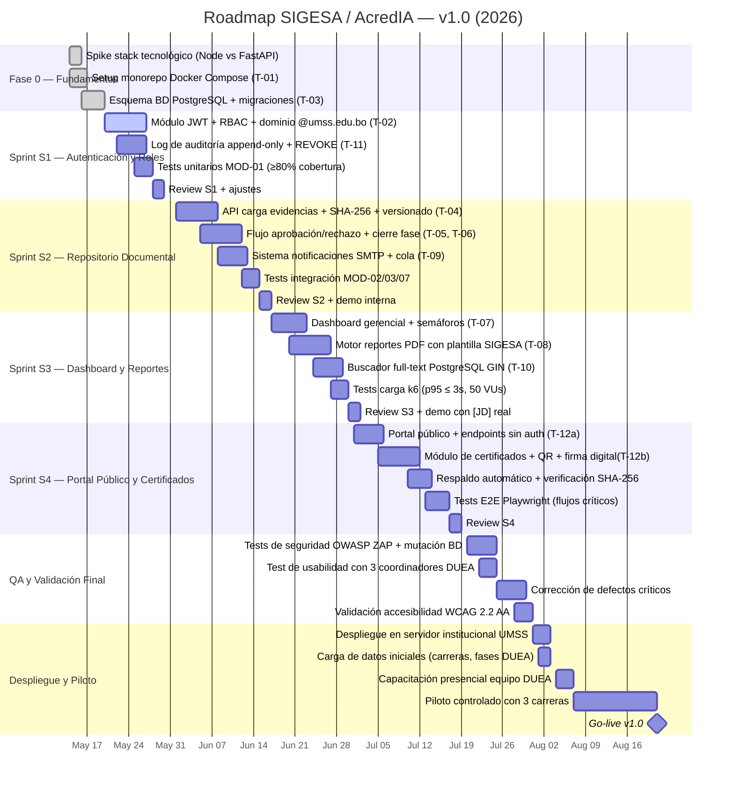

# Roadmap — SIGESA / AcredIA

> Planificación de entregas por oleadas y sprints de implementación. Alineado a [`PRD_v1.md`](PRD_v1.md), [`../BRD_v2.md`](../BRD_v2.md) y al roadmap canónico [`docs/03_prd/roadmap.md`](../../../docs/03_prd/roadmap.md).

| Metadato | Valor |
|----------|-------|
| **Producto** | SIGESA — Sistema de Evaluación y Acreditación de Carreras |
| **Autor** | Aylen Mariangel Gonzales Alvino |
| **Versión** | v1.0 |
| **Fecha** | 25/05/2026 |
| **Estado** | Borrador |
| **Horizonte** | 2026–2028 (orientativo; sujeto a calendario académico y CEUB) |

---

## 0. Vista por fases de negocio

SIGESA evoluciona en **cuatro oleadas** alineadas al calendario de acreditación boliviano:

1. **MVP / piloto (0.9)** — Flujo trazable CC→TD en 1–2 facultades.  
2. **v1.0 institucional** — Cobertura multi-facultad, portal y planes de mejora.  
3. **v1.x escalabilidad** — Picos de convocatoria, roles extendidos, exportaciones.  
4. **v2.0 plataforma** — Integraciones UMSS, IA asistida gobernada, evaluador externo.

Diagrama Gantt de implementación (sprints técnicos): [`docs/07_diagramas/gantt-003-diagrama.mmd`](../../../docs/07_diagramas/gantt-003-diagrama.mmd)

---

## 1. Roadmap de entregas (Gantt)

El diagrama anterior resume el **plan de implementación técnica** (mayo–agosto 2026). Para la vista estratégica institucional (2026–2028), ver el Gantt canónico en [`docs/07_diagramas/gantt-005-diagrama.mmd`](../../../docs/07_diagramas/gantt-005-diagrama.mmd).

Renderizar los archivos `.mmd` en el visor del repositorio o en la documentación publicada.

---

## 2. Oleadas de release (dependencias)

| Release | Nombre | Épicas / módulos | Gate de salida |
|---------|--------|------------------|----------------|
| **0.9** | Piloto / MVP | E1, E2, E3, E6 (parcial), E7 | UAT firmado DUEA; KPI búsqueda ≤ 2 min; 0 pérdida documental |
| **1.0.0** | Institucional | E4, E5, E8, E9 | Go-live multi-facultad; MAU ≥ 80 % a M+3; PDF P95 ≤ 5 min |
| **1.1.0** | Hardening | E6 (completo), E7 (optimización), gobernanza AI-SDLC | Portal estable; buscador; observabilidad en producción |
| **1.2.0** | Extensión roles | E5 (Excel masivo), rol [DC], optimización picos CEUB | Exportaciones masivas; roles extendidos operativos |
| **2.0.0** | Plataforma | E8 (certificados avanzados), SIIS, SSO, IA gobernada | Integración bus institucional; evaluador externo [EE] |

### Mapeo sprint → release

| Sprint | Ventana | Release objetivo | Épicas principales |
|--------|---------|------------------|-------------------|
| Fase 0 | May 2026 | Pre-MVP | Infra, BD, spike stack |
| S1 | May–Jun 2026 | 0.9 | E1 — Autenticación y roles |
| S2 | Jun 2026 | 0.9 | E2, E3, E6 — Evidencias, aprobación, notificaciones |
| S3 | Jun–Jul 2026 | 0.9 → 1.0 | E4, E5, E7 — Dashboard, reportes, buscador |
| S4 | Jul 2026 | 1.0 | E8, E9 — Portal, certificados, respaldos |
| QA + Piloto | Jul–Ago 2026 | 0.9 cerrado / 1.0 go-live | Validación NFR, UAT, adopción piloto |

---

## 3. Desglose por hitos

| Hito | Fecha orientativa | Entregable clave |
|------|-------------------|------------------|
| Fin Fase 0 | 2026-05-20 | Monorepo, esquema BD, taxonomías base |
| Review S1 | 2026-05-28 | JWT + RBAC + log auditoría append-only |
| Review S2 | 2026-06-15 | Ciclo carga → dictamen → notificación operativo |
| Review S3 | 2026-06-30 | Dashboard semáforos + PDF + buscador ≤ 2 min |
| Review S4 | 2026-07-17 | Portal [P] + certificados + respaldo verificado |
| QA final | 2026-07-28 | OWASP, usabilidad DUEA, WCAG 2.2 AA |
| **Go-live v1.0** | **2026-08-21** | Piloto 3 carreras + capacitación DUEA |
| Release documental 1.0.0 | 2026-10 | Baseline trazabilidad (`docs/10_aportes/release-1.0.0.md`) |
| v1.1 Hardening | 2027-Q1 | AI-SDLC operativo, portal endurecido |
| v2.0 Plataforma | 2027-Q2+ | SIIS, SSO, IA asistida bajo RB-11 |

### Criterios de salida del piloto (Release 0.9)

| Criterio | Umbral |
|----------|--------|
| Adopción [CC] carrera piloto | ≥ 80 % indicadores cargados en SIGESA |
| CSAT [CC]/[TD] | ≥ 4/5 |
| Notificaciones críticas | 100 % ≤ 15 min |
| Incidentes P0 abiertos | 0 |
| Firma UAT | Jefatura DUEA |

---

## 4. Trazabilidad épica → historias (Must)

| Épica | Historias Must en roadmap | Sprint |
|-------|---------------------------|--------|
| E1 — Autenticación y roles | PRD-US-001, PRD-US-002 | S1 |
| E2 — Repositorio de evidencias | PRD-US-003, PRD-US-004, PRD-US-005 | S2 |
| E3 — Flujo de aprobación | PRD-US-006, PRD-US-007, PRD-US-008 | S2 |
| E4 — Dashboard gerencial | PRD-US-009 | S3 |
| E5 — Reportes ejecutivos | PRD-US-011 | S3 |
| E6 — Notificaciones | PRD-US-013, PRD-US-014 | S2 |
| E7 — Buscador | PRD-US-015 | S3 |
| E8 — Portal y certificados | PRD-US-016 (Should), PRD-US-017 (Could) | S4 |
| E9 — Operaciones y accesibilidad | PRD-US-019, PRD-US-020 (Should) | S4 + QA |

Historias **Should** incluidas en v1.0 según capacidad: PRD-US-010, PRD-US-018.

---

## 5. KPIs de adopción

| KPI | Meta | Release |
|-----|------|---------|
| OP-01 — Tiempo búsqueda documento | ≤ 2 min | 0.9 |
| OP-02 — Pérdida documental | 0 incidentes | 0.9 |
| OP-03 — Generación PDF ejecutivo | ≤ 5 min P95 | 1.0 |
| OP-04 — Usuarios activos | ≥ 80 % a M+3 | 1.0 |
| OP-05 — Trazabilidad evidencias | 100 % fases | 0.9 |
| OP-07 — Notificaciones críticas | 100 % ≤ 15 min | 0.9 |

---

## 6. Riesgos del roadmap

| Riesgo | Impacto | Mitigación |
|--------|---------|------------|
| Calendario CEUB adelantado | Alto | Priorizar Must de S2–S3; congelar Could en piloto |
| Capacidad TI UMSS limitada | Medio | Entornos containerizados; despliegue documentado |
| Resistencia al cambio [CC] | Alto | Capacitación presencial + confirmación automática (US-005) |
| Picos de carga en convocatoria | Medio | Tests k6 en S3; plan v1.1 escalabilidad |

---

## 7. Referencias cruzadas

| Documento | Ruta |
|-----------|------|
| PRD (este equipo) | `team/aylenGonzales/03_prd/PRD_v1.md` |
| Roadmap canónico | `docs/03_prd/roadmap.md` |
| User stories canónicas | `docs/03_prd/user_stories.md` |
| Gantt implementación | `docs/07_diagramas/gantt-003-diagrama.mmd` |
| Release documental | `docs/10_aportes/release-1.0.0.md` |

---

## Registro de cambios

| Versión | Fecha | Autor | Cambio |
|---------|-------|-------|--------|
| v1.0 | 25/05/2026 | aylenGonzales | Creación inicial alineada a PRD_v1 y Gantt de implementación |
