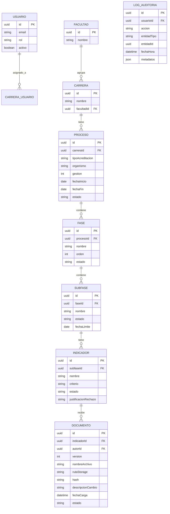

# Functional Specification Document (FSD) – AcredIA / SIGESA

> Trazabilidad: `team/aylenGonzales/BRD_v2.md` → `team/aylenGonzales/PRD_v1.md` → este FSD.
> Revisado con Claude como *reviewer*.

---

## 0. Metadatos ⚡🔧

| Campo | Valor |
|-------|-------|
| Producto | AcredIA / SIGESA — Sistema Inteligente de Gestión y Seguimiento de Acreditaciones |
| Grupo | AcredIA |
| Versión del documento | `v1.0` |
| Fecha | 11/05/2026 |
| Autores | Aylen Mariangel Gonzales Alvino |
| Revisores | M.Sc. Edson Terceros Torrico · Grupo par revisor |
| Estado | Borrador |
| **Modo elegido** | **LFSD ⚡** |
| Trazabilidad a PRD | `team/aylenGonzales/PRD_v1.md` |
| Insumos M2 (UI/UX) | Prototipo Hi-Fi AcredIA (Bitácora 3) · Evaluación heurística · Wireframes de flujo de carga de evidencias y dashboard de semáforos |
| Fase Spec Kit cubierta | Specify ✅ / Plan ✅ / Tasks ✅ / Implement ⬜ |
| Prompts utilizados | PM-008 — `./PROMPT_MAPPING.md` |

---

## 1. Resumen ejecutivo ⚡🔧

AcredIA / SIGESA es un sistema web activo de gestión y seguimiento de acreditaciones universitarias diseñado para la Dirección Universitaria de Evaluación y Acreditación (DUEA) de la Universidad Mayor de San Simón (UMSS), Cochabamba, Bolivia.

El sistema resuelve el caos operativo actual —documentación dispersa en Excel, correos, WhatsApp y pendrives— que obliga a los técnicos a invertir más de 20 minutos por sesión buscando versiones finales de documentos, y deja a la jefatura sin visibilidad gerencial en tiempo real sobre el avance de los procesos de acreditación CEUB y ARCU-SUR.

SIGESA centraliza toda la evidencia de acreditación en una única fuente de verdad con historial de versiones inmutable, automatiza los flujos de aprobación entre coordinadores de carrera ([CC]) y técnicos DUEA ([TD]), genera reportes ejecutivos en PDF en menos de 5 minutos para la jefatura ([JD]), y expone un portal público de transparencia para estudiantes y egresados ([P]).

Su diferencial es ser el único sistema diseñado nativamente para las normativas bolivianas (CEUB y ARCU-SUR), con taxonomías de fases e indicadores integradas desde la capa de datos, eliminando las adaptaciones manuales costosas que exigen los sistemas globales. Es operado íntegramente desde un navegador web sin instalación de software adicional, con experiencia responsive para [CC] en dispositivos móviles.

---

## 2. Alcance ⚡🔧

### 2.1 Dentro del alcance

- Autenticación con correo institucional UMSS y gestión de roles diferenciados ([CC], [TD], [JD], [P]).
- Repositorio centralizado de evidencias con historial de versiones inmutable (autor, fecha, descripción).
- Flujo de aprobación/rechazo de indicadores con justificación obligatoria en rechazos.
- Gestión de fases y subfases de acreditación CEUB y ARCU-SUR preconfiguradas.
- Dashboard gerencial con semáforos de estado por carrera y facultad en tiempo real.
- Generación automática de reportes ejecutivos en PDF (≤ 5 min) y exportación Excel.
- Notificaciones automáticas por correo institucional ante eventos críticos (≤ 15 min).
- Buscador de documentos por título, carrera, facultad, modalidad y gestión.
- Log de auditoría inmutable de todas las acciones del sistema.
- Portal público de consulta de estado de acreditación sin autenticación.
- Emisión y descarga de certificados de acreditación.
- Respaldo automático diario de base de datos y documentos.
- Gestión de planes de mejora vinculados al proceso de acreditación.
- Configuración inicial de 12 facultades, carreras y fases de acreditación UMSS.

### 2.2 Fuera del alcance (explícito)

- Integración en tiempo real con sistemas externos UMSS (SIIS académico, RRHH, ERP) — v2.0.
- Módulo de pagos o cobro de certificaciones.
- Matrices de evaluación autogeneradas por pares evaluadores internacionales — v2.0.
- Control manual de respaldos por usuario (son automáticos).
- Integración con plataformas internacionales de ranking (QS, THE).
- IA asistencial autónoma (clasificación de evidencias, detección de patrones) — v2.0.

### 2.3 Supuestos y dependencias

**Supuestos técnicos:**
- Todos los usuarios cuentan con correo institucional UMSS activo (@umss.edu.bo).
- La DUEA proveerá datos base (carreras, facultades, fases) antes del despliegue de v1.0.
- La red institucional UMSS permite acceso web desde puestos de la DUEA y jefaturas de carrera.
- Las normativas CEUB y ARCU-SUR no sufrirán cambios estructurales durante la implementación de v1.0.

**Dependencias externas:**
- Servidor de correo institucional UMSS para notificaciones automáticas.
- Proveedor cloud para hosting, base de datos y almacenamiento de documentos.
- Documentación oficial actualizada de CEUB y ARCU-SUR para taxonomías de fases e indicadores.

### 2.4 Plan técnico 🔧

| Bloque | Contenido |
|--------|-----------|
| **Stack tecnológico** | Frontend: React + Tailwind CSS / Backend: Node.js (Express) o Python (FastAPI) / Base de datos: PostgreSQL / Almacenamiento: S3-compatible (cloud) / Autenticación: JWT + validación dominio @umss.edu.bo |
| **Arquitectura prevista** | Layered (capas: API REST → Servicios de negocio → Repositorios → Base de datos). Módulos independientes por dominio: Auth, Documentos, Fases, Reportes, Notificaciones, Auditoría. |
| **Project structure** | `backend/` (API, servicios, repositorios, modelos) / `frontend/` (componentes, páginas, hooks) / `infra/` (docker-compose, cloud config) / `docs/` (BRD, PRD, FSD, ADR) |
| **Decisiones técnicas anticipadas** | REST sobre GraphQL (menor complejidad de cliente); almacenamiento de archivos en S3-compatible (no en DB); log de auditoría en tabla inmutable (sin DELETE ni UPDATE); PDFs generados server-side (biblioteca tipo Puppeteer o WeasyPrint). |
| **Restricciones técnicas** | Web pura sin instalación de cliente; soportar Chrome, Firefox y Edge modernos; documentos aprobados sin DELETE definitivo; autenticación exclusiva por dominio @umss.edu.bo. |

### 2.5 Descomposición en Tasks (Spec Kit) ⚡🔧

| Task ID | Descripción | Caso de uso (FSD-UC) | Dependencias | Prompt asociado | Estado |
|---------|-------------|----------------------|--------------|-----------------|--------|
| T-001 | Implementar autenticación JWT con validación dominio @umss.edu.bo | FSD-UC-001 | — | PM-008 | Pendiente |
| T-002 | Implementar CRUD de usuarios y asignación de roles ([CC], [TD], [JD]) | FSD-UC-001 | T-001 | PM-008 | Pendiente |
| T-003 | Implementar endpoint `POST /documentos` con versionado automático | FSD-UC-002 | T-001 | PM-008 | Pendiente |
| T-004 | Implementar flujo aprobación/rechazo de indicadores con justificación obligatoria | FSD-UC-003 | T-003 | PM-008 | Pendiente |
| T-005 | Implementar dashboard de semáforos con estado en tiempo real por carrera | FSD-UC-004 | T-004 | PM-008 | Pendiente |
| T-006 | Implementar generación de reporte ejecutivo PDF server-side | FSD-UC-005 | T-005 | PM-008 | Pendiente |
| T-007 | Implementar sistema de notificaciones automáticas por correo (eventos críticos) | FSD-UC-003, UC-002 | T-004 | PM-008 | Pendiente |
| T-008 | Implementar buscador de documentos con filtros múltiples | FSD-UC-002 | T-003 | PM-008 | Pendiente |
| T-009 | Implementar log de auditoría inmutable (tabla append-only) | Todos | T-001 | PM-008 | Pendiente |
| T-010 | Implementar portal público de consulta de estado sin autenticación | FSD-UC-004 | T-005 | PM-008 | Pendiente |
| T-011 | Implementar respaldo automático diario con confirmación al administrador | — | T-003 | PM-008 | Pendiente |
| T-012 | Configurar taxonomías CEUB y ARCU-SUR (fases, subfases, indicadores) | FSD-UC-003 | T-002 | PM-008 | Pendiente |

---

## 3. Actores y roles del sistema ⚡🔧

| Actor | Tipo | Responsabilidad principal | Permisos clave |
|-------|------|---------------------------|----------------|
| [CC] Coordinador de Carrera | Humano | Carga de evidencias y seguimiento del proceso de su carrera | Cargar, versionar y consultar documentos de su carrera; ver observaciones del TD; consultar estado de sus subfases |
| [TD] Técnico DUEA | Humano | Validar calidad técnica de evidencias y orquestar avance de fases | Aprobar/rechazar indicadores; emitir observaciones; autorizar avance de fases; visibilidad global de todas las carreras |
| [JD] Jefatura DUEA | Humano | Supervisión estratégica y configuración del sistema | Configurar usuarios, facultades y plantillas normativas; generar reportes ejecutivos; auditar historial; aprobar dictámenes finales |
| [P] Público externo | Humano | Consulta pública de estado de acreditación | Solo lectura de información publicada oficialmente; sin autenticación |
| [JC] Jefe de Carrera | Humano | Responsable institucional de cumplimiento de evidencias por etapa | Permisos equivalentes a [CC] con mandato de supervisión; a definir por resolución DUEA |
| [EE] Evaluador Externo | Humano | Participación en fases de evaluación externa | Visibilidad acotada al proceso asignado; registro de dictámenes; solo lectura de evidencias |
| Sistema de notificaciones | Sistema | Envío automático de alertas por correo institucional | Acceso de lectura a eventos del sistema; envío de correos vía SMTP institucional |
| Motor de reportes | Sistema | Generación de PDFs y exportaciones Excel server-side | Acceso de lectura a datos de carreras, fases y documentos |

---

## 4. Casos de uso funcionales ⚡🔧

### 4.1 FSD-UC-001 – Autenticación y gestión de acceso por rol

- **Trazabilidad**: `PRD-REQ-001`, `PRD-REQ-002`, `PRD-US-001`, `PRD-US-002`
- **Actor principal**: Cualquier usuario del sistema
- **Precondiciones**:
  1. El usuario tiene correo institucional UMSS activo (@umss.edu.bo).
  2. El administrador ([JD]) ha registrado al usuario en el sistema con su rol asignado.
- **Disparador**: El usuario accede a la URL del sistema e ingresa sus credenciales.
- **Flujo principal**:
  1. El usuario ingresa correo institucional y contraseña en la pantalla de login.
  2. El sistema valida que el dominio del correo sea @umss.edu.bo; rechaza correos personales.
  3. El sistema verifica las credenciales contra la base de datos.
  4. El sistema genera un token JWT con el rol y permisos del usuario.
  5. El sistema redirige al dashboard correspondiente según el rol ([CC], [TD] o [JD]).
- **Flujos alternativos / excepciones**:
  - A1: Correo con dominio no institucional → mensaje de error claro: "Solo se admiten correos @umss.edu.bo".
  - A2: Credenciales incorrectas → mensaje de error genérico sin revelar cuál campo falla; bloqueo tras 5 intentos fallidos.
  - A3: Usuario inactivo o sin rol asignado → mensaje de error con instrucción de contactar al administrador.
- **Postcondiciones**:
  1. El usuario está autenticado con sesión activa según su rol.
  2. El log de auditoría registra el inicio de sesión con usuario, fecha y hora.
- **Reglas de negocio aplicables**: `RB-06` (solo correo institucional UMSS)
- **Datos de entrada**: correo institucional (string, dominio @umss.edu.bo), contraseña (string, mínimo 8 caracteres).
- **Datos de salida**: token JWT con payload: `{ userId, email, rol, carreraId (si [CC]) }`, redirección a dashboard.
- **Criterios de aceptación**:

```gherkin
Escenario: Login exitoso con correo institucional
  Dado un usuario registrado con correo válido @umss.edu.bo y contraseña correcta
  Cuando ingresa sus credenciales y pulsa "Iniciar sesión"
  Entonces el sistema genera un token JWT y redirige al dashboard según su rol
   Y el log de auditoría registra el evento de inicio de sesión

Escenario: Intento con correo no institucional
  Dado un usuario con correo @gmail.com
  Cuando intenta autenticarse
  Entonces el sistema muestra "Solo se admiten correos @umss.edu.bo" y bloquea el acceso
```

---

### 4.2 FSD-UC-002 – Carga y versionado de evidencias

- **Trazabilidad**: `PRD-REQ-003`, `PRD-REQ-004`, `PRD-US-003`, `PRD-US-004`, `PRD-US-005`
- **Actor principal**: [CC] Coordinador de Carrera
- **Precondiciones**:
  1. [CC] está autenticado y tiene una subfase en estado "Pendiente" o "Rechazado".
  2. El indicador al que se cargará el documento está configurado en el sistema.
- **Disparador**: [CC] selecciona un indicador y pulsa "Cargar evidencia".
- **Flujo principal**:
  1. [CC] accede a su dashboard, selecciona su carrera y la subfase pendiente.
  2. [CC] selecciona el indicador al que desea cargar evidencia.
  3. El sistema muestra el formulario de carga con campo de archivo y descripción del cambio.
  4. [CC] selecciona el archivo (PDF, DOCX, XLSX; max 50 MB) e ingresa descripción del cambio.
  5. El sistema muestra barra de progreso durante la carga.
  6. Al completarse, el sistema registra: autor, fecha/hora, número de versión (autoincremental), descripción y hash del archivo.
  7. El indicador cambia a estado "En revisión".
  8. El sistema envía notificación automática al [TD] asignado en ≤ 15 minutos.
  9. El sistema muestra confirmación con nombre de archivo, versión asignada, fecha y hora.
- **Flujos alternativos / excepciones**:
  - A1: Archivo mayor a 50 MB → mensaje claro con guía de compresión antes de rechazar la carga.
  - A2: Formato no permitido → mensaje de error listando formatos aceptados (PDF, DOCX, XLSX).
  - A3: Pérdida de conexión durante la carga → el sistema detecta el timeout y permite reintentar sin duplicar el archivo.
  - A4: [CC] intenta cargar en un indicador "Aprobado" → el sistema permite nueva versión pero advierte que requiere justificación de [TD] para reabrir.
- **Postcondiciones**:
  1. El documento queda almacenado con historial de versiones inmutable.
  2. La versión anterior (si existe) queda accesible pero no es eliminable.
  3. El [TD] asignado recibe notificación por correo.
  4. El log de auditoría registra la carga con todos los metadatos.
- **Reglas de negocio aplicables**: `RB-02` (solo [CC] carga, [TD] no carga en su nombre), `RB-04` (documentos aprobados no se eliminan, solo se versionan), `BR-001`, `BR-002`, `BR-015` (toda evidencia asociada a criterio de evaluación).
- **Datos de entrada**: archivo (PDF/DOCX/XLSX, ≤ 50 MB), descripción del cambio (string, obligatorio), indicadorId (UUID), subfaseId (UUID).
- **Datos de salida**: `{ documentoId, version, autor, fechaHora, hash, estado: "en_revision" }`.
- **Criterios de aceptación**:

```gherkin
Escenario: Carga exitosa de evidencia
  Dado un [CC] autenticado con subfase en estado "Pendiente"
  Cuando sube un archivo PDF válido (≤ 50 MB) con descripción del cambio
  Entonces el sistema muestra barra de progreso durante la carga
   Y al finalizar muestra confirmación con nombre, versión, fecha y hora
   Y el indicador cambia a estado "En revisión"
   Y el [TD] recibe notificación por correo en ≤ 15 minutos
   Y el log de auditoría registra la acción

Escenario: Archivo demasiado grande
  Dado un [CC] intentando cargar un archivo de 80 MB
  Cuando selecciona el archivo y pulsa "Cargar"
  Entonces el sistema rechaza la carga con mensaje claro y guía de compresión
   Y no se registra ninguna entrada en el historial de versiones
```

---

### 4.3 FSD-UC-003 – Aprobación y rechazo de indicadores

- **Trazabilidad**: `PRD-REQ-005`, `PRD-US-006`, `PRD-US-007`, `PRD-US-008`
- **Actor principal**: [TD] Técnico DUEA
- **Precondiciones**:
  1. [TD] está autenticado con rol Técnico DUEA.
  2. Al menos un indicador está en estado "En revisión" con evidencia cargada.
- **Disparador**: [TD] accede al panel de auditoría y selecciona un indicador pendiente de revisión.
- **Flujo principal**:
  1. [TD] accede al panel de auditoría global de todas las carreras.
  2. [TD] selecciona la carrera y subfase con indicadores en revisión.
  3. El sistema muestra el indicador con todas las versiones de evidencia cargadas, la versión vigente marcada claramente.
  4. [TD] descarga y revisa la evidencia vigente.
  5. [TD] selecciona "Aprobar" o "Rechazar".
  6. Si aprueba: el indicador cambia a "Aprobado" y el sistema notifica al [CC].
  7. Si rechaza: el sistema exige justificación obligatoria (campo de texto, mínimo 20 caracteres). Sin justificación, bloquea la acción con mensaje de error.
  8. Al confirmar rechazo con justificación: indicador cambia a "Rechazado", [CC] recibe notificación con la observación detallada en ≤ 15 minutos.
  9. Si todos los indicadores de la subfase están "Aprobados": el [TD] puede marcar la subfase como "Aprobada" y autorizar avance a la siguiente fase.
  10. Todas las acciones quedan registradas en el log de auditoría.
- **Flujos alternativos / excepciones**:
  - A1: [TD] intenta cerrar subfase con indicadores "Pendientes" o "Rechazados" → el sistema bloquea la acción y lista los indicadores incompletos con mensaje accionable.
  - A2: [TD] intenta rechazar sin justificación → botón "Confirmar rechazo" permanece deshabilitado hasta ingresar texto válido.
  - A3: [CC] recarga evidencia tras un rechazo → el indicador vuelve a estado "En revisión" y [TD] recibe nueva notificación.
- **Postcondiciones**:
  1. El indicador queda en estado "Aprobado" o "Rechazado" con trazabilidad completa.
  2. El [CC] recibe notificación con el resultado y la observación (si aplica).
  3. El log de auditoría registra: acción, usuario, fecha/hora, justificación (si rechazo).
  4. Si subfase aprobada: el avance de fase queda habilitado.
- **Reglas de negocio aplicables**: `RB-02`, `RB-03` (subfase solo "Aprobada" si todos los indicadores requeridos fueron validados), `BR-003`, `BR-014` (no se puede cerrar con tareas pendientes).
- **Datos de entrada**: indicadorId (UUID), acción (enum: APROBAR/RECHAZAR), justificación (string, obligatoria en RECHAZAR, mínimo 20 chars).
- **Datos de salida**: `{ indicadorId, nuevoEstado, fechaHora, tecnicoId, justificacion? }`.
- **Criterios de aceptación**:

```gherkin
Escenario: Técnico rechaza indicador sin justificación
  Dado un [TD] revisando un indicador en estado "En revisión"
  Cuando selecciona "Rechazar" y deja el campo de justificación vacío
  Entonces el sistema deshabilita el botón "Confirmar" y muestra "La justificación es obligatoria"

Escenario: Técnico rechaza indicador con justificación válida
  Dado un [TD] que ingresó justificación de al menos 20 caracteres
  Cuando confirma el rechazo
  Entonces el indicador cambia a estado "Rechazado"
   Y el [CC] recibe notificación con la observación en ≤ 15 minutos
   Y el log de auditoría registra la acción con todos los metadatos

Escenario: Técnico intenta cerrar subfase con indicadores incompletos
  Dado una subfase con al menos un indicador en estado "Pendiente"
  Cuando el [TD] intenta marcarla como "Aprobada"
  Entonces el sistema bloquea la acción y lista los indicadores incompletos
```

---

### 4.4 FSD-UC-004 – Dashboard gerencial y visibilidad en tiempo real

- **Trazabilidad**: `PRD-REQ-006`, `PRD-US-009`, `PRD-US-010`
- **Actor principal**: [JD] Jefatura DUEA
- **Precondiciones**:
  1. [JD] está autenticada con rol Jefatura DUEA.
  2. Existen carreras y procesos de acreditación configurados en el sistema.
- **Disparador**: [JD] accede al dashboard principal del sistema.
- **Flujo principal**:
  1. [JD] accede al dashboard tras autenticación.
  2. El sistema muestra todas las carreras activas con semáforo de estado: Verde (≥ 80 % avance), Amarillo (50–79 %), Rojo (< 50 % o con indicadores vencidos).
  3. [JD] puede filtrar por facultad, tipo de acreditación (CEUB/ARCU-SUR) y gestión (año).
  4. El sistema actualiza los semáforos en tiempo real sin recargar la página.
  5. [JD] selecciona una carrera para ver el detalle: % de avance por fase, indicadores pendientes, alertas activas.
  6. La información es accesible en ≤ 2 minutos sin intervención técnica.
- **Postcondiciones**:
  1. [JD] tiene visibilidad completa del estado de todos los procesos activos.
  2. El log de auditoría registra el acceso al dashboard.
- **Reglas de negocio aplicables**: `BR-003`, `RB-09` (avance porcentual calculado en función de criterios configurados).
- **Datos de salida**: `{ carreras: [{ carreraId, nombre, facultad, semaforo, porcentajeAvance, alertasActivas }] }`.
- **Criterios de aceptación**:

```gherkin
Escenario: Jefatura consulta dashboard con semáforos
  Dado la [JD] autenticada en el sistema con procesos activos
  Cuando accede al dashboard principal
  Entonces ve todas las carreras con semáforo Verde/Amarillo/Rojo según su avance
   Y los semáforos se actualizan en tiempo real sin recargar la página
   Y la información es obtenible en ≤ 2 minutos sin asistencia técnica
```

---

### 4.5 FSD-UC-005 – Generación de reporte ejecutivo PDF

- **Trazabilidad**: `PRD-REQ-007`, `PRD-US-011`
- **Actor principal**: [JD] Jefatura DUEA
- **Precondiciones**:
  1. [JD] está autenticada.
  2. Existen datos de avance de carreras en el sistema.
- **Disparador**: [JD] accede al módulo de reportes y configura los parámetros.
- **Flujo principal**:
  1. [JD] accede al módulo de reportes desde el menú principal.
  2. [JD] selecciona: carrera o facultad, tipo de acreditación y periodo (gestión/año).
  3. El sistema muestra una previsualización del estado (semáforos y % de avance).
  4. [JD] pulsa "Generar PDF".
  5. El sistema genera el reporte server-side en ≤ 5 minutos.
  6. El reporte incluye: estado por carrera/facultad, % avance por fase, alertas de retraso activas, fecha de generación y nombre del solicitante.
  7. El sistema habilita el botón "Descargar PDF" y notifica al [JD] que está listo.
- **Flujos alternativos / excepciones**:
  - A1: El reporte tarda más de 5 minutos → el sistema notifica por correo cuando esté listo en lugar de mantener al usuario en espera.
- **Postcondiciones**:
  1. El PDF queda disponible para descarga y queda registrado en el historial de reportes.
  2. El log de auditoría registra: usuario, fecha/hora, parámetros del reporte.
- **Reglas de negocio aplicables**: `RB-07` (reportes de uso interno; distribución externa requiere autorización de Jefa DUEA), `BR-004`.
- **Criterios de aceptación**:

```gherkin
Escenario: Jefatura genera reporte ejecutivo en PDF
  Dado la [JD] en el módulo de reportes con parámetros seleccionados
  Cuando pulsa "Generar PDF"
  Entonces el sistema genera el reporte en ≤ 5 minutos
   Y el PDF incluye estado de semáforos, % avance por fase y alertas activas
   Y el reporte es descargable directamente desde el sistema
   Y el log de auditoría registra la generación con usuario y parámetros
```

---

## 5. Reglas de negocio ⚡🔧

| ID | Regla | Tipo | Origen | Casos de uso afectados |
|----|-------|------|--------|------------------------|
| RB-01 | Una carrera solo puede iniciar proceso ARCU-SUR si tiene resolución CEUB vigente | Política | Normativa CEUB/ARCU-SUR | FSD-UC-003, FSD-UC-004 |
| RB-02 | Solo [CC] carga documentos; [TD] valida pero no carga en nombre del coordinador | Política | Procedimiento interno DUEA | FSD-UC-002 |
| RB-03 | Una subfase solo puede marcarse "Aprobada" si todos sus indicadores fueron aprobados por [TD] | Política | Normativa CEUB/ARCU-SUR | FSD-UC-003 |
| RB-04 | Documentos aprobados no pueden eliminarse; solo se versionan | Normativa | Trazabilidad para auditorías externas | FSD-UC-002 |
| RB-05 | Las fechas límite de convocatorias CEUB/ARCU-SUR no son modificables por usuarios | Normativa | CEUB / Ministerio de Educación Bolivia | FSD-UC-003, FSD-UC-004 |
| RB-06 | El acceso requiere autenticación con correo @umss.edu.bo activo | Política | Política de seguridad institucional UMSS | FSD-UC-001 |
| RB-07 | Los reportes ejecutivos son de uso interno; distribución externa requiere autorización de Jefa DUEA | Política | Procedimiento interno DUEA | FSD-UC-005 |
| RB-08 | Todo proceso debe registrar: tipo de acreditación, organismo, gestión (año), fecha inicio y fin | Normativa | Visión de negocio v2 | FSD-UC-003, FSD-UC-004 |
| RB-09 | El avance porcentual se calcula en función del cumplimiento de criterios configurados | Política | Visión de negocio v2 | FSD-UC-004 |
| RB-10 | Los mensajes de error deben ser claros y accionables; redacción empática | Política UX | Validación prototipo Hi-Fi | Todos |
| RB-11 | Las recomendaciones asistidas por IA deben ser explicables y sujetas a supervisión humana | Política IA/ética | Visión v2 / Bitácora 3 | — (v2.0) |
| BR-013 | No más de un proceso activo del mismo tipo (CEUB/ARCU-SUR) para la misma carrera en el mismo periodo | Must | BRD v2 §23 | FSD-UC-003 |
| BR-014 | Proceso con tareas pendientes no puede cerrarse | Must | BRD v2 §23 | FSD-UC-003 |
| BR-015 | Toda evidencia debe asociarse a un criterio de evaluación; no se admite carga sin clasificación | Must | BRD v2 §23 | FSD-UC-002 |

---

## 6. Modelo de datos funcional ⚡🔧

### 6.1 Diagrama ER (Mermaid)



### 6.2 Diccionario de datos (entidades core)

| Entidad | Atributo | Tipo | Obligatorio | Validaciones |
|---------|----------|------|-------------|--------------|
| USUARIO | id | UUID | Sí | UUIDv4 autogenerado |
| USUARIO | email | string(120) | Sí | Dominio @umss.edu.bo; regex RFC 5322 |
| USUARIO | rol | enum | Sí | CC / TD / JD / P / JC / EE |
| USUARIO | activo | boolean | Sí | Default: true |
| PROCESO | tipoAcreditacion | enum | Sí | CEUB / ARCU-SUR |
| PROCESO | estado | enum | Sí | EN_PROCESO / ACREDITADO / VENCIDO |
| PROCESO | gestion | int | Sí | Año YYYY; no puede haber dos procesos activos del mismo tipo para la misma carrera en el mismo periodo (BR-013) |
| DOCUMENTO | version | int | Sí | Autoincremental por indicadorId; nunca decrece |
| DOCUMENTO | hash | string(64) | Sí | SHA-256 del archivo; previene duplicados exactos |
| DOCUMENTO | estado | enum | Sí | EN_REVISION / APROBADO / RECHAZADO |
| INDICADOR | estado | enum | Sí | PENDIENTE / EN_REVISION / APROBADO / RECHAZADO |
| INDICADOR | justificacionRechazo | string(500) | Condicional | Obligatoria cuando estado = RECHAZADO; mínimo 20 chars |
| LOG_AUDITORIA | accion | enum | Sí | LOGIN / CARGA / APROBACION / RECHAZO / AVANCE_FASE / REPORTE / LOGOUT |

---

## 7. Prompt como Contrato Funcional ⚡🔧

### 7.1 Prompt-contrato para FSD-UC-001 (Autenticación)

```markdown
# Role
Eres el módulo de autenticación de AcredIA/SIGESA, un sistema web institucional de gestión de acreditaciones universitarias.

# Task
Validar las credenciales de un usuario y emitir un token JWT con su rol y permisos, o retornar un error descriptivo según el caso de falla.

# Context
- Entrada: { email: string, password: string }
- El email debe pertenecer al dominio @umss.edu.bo; cualquier otro dominio es inválido.
- Los roles válidos son: CC (Coordinador de Carrera), TD (Técnico DUEA), JD (Jefatura DUEA).
- Referencias de dominio: RB-06 (solo correo institucional), BR-006 (roles diferenciados).
- Restricciones: no revelar si el error es de email o contraseña; bloquear tras 5 intentos fallidos.

# Reasoning
Pasos obligatorios:
1. Validar formato y dominio del email (@umss.edu.bo).
2. Buscar usuario en base de datos por email.
3. Verificar contraseña con hash bcrypt.
4. Verificar que el usuario esté activo.
5. Generar JWT con payload: { userId, email, rol, carreraId? }.
6. Registrar evento en LOG_AUDITORIA con acción LOGIN.

# Stop condition
Detente y retorna error si: dominio inválido / usuario no encontrado / contraseña incorrecta / usuario inactivo / 5+ intentos fallidos (retorna error de bloqueo).

# Output
Formato: JSON
Ejemplo éxito:
{
  "status": "ok",
  "token": "<JWT>",
  "usuario": { "id": "<uuid>", "email": "<email>", "rol": "<rol>", "carreraId": "<uuid|null>" }
}
Ejemplo error:
{
  "status": "error",
  "code": "AUTH_INVALID_CREDENTIALS",
  "message": "Credenciales inválidas. Verifique su correo y contraseña."
}
```

**Invariants**: el token JWT nunca expone la contraseña; el dominio del email siempre es @umss.edu.bo; todo intento de login queda en LOG_AUDITORIA.
**Failure modes**: `AUTH_INVALID_DOMAIN` (dominio no institucional), `AUTH_INVALID_CREDENTIALS` (usuario/contraseña incorrectos), `AUTH_USER_INACTIVE` (cuenta desactivada), `AUTH_TOO_MANY_ATTEMPTS` (5+ intentos fallidos).

---

### 7.2 Prompt-contrato para FSD-UC-002 (Carga de evidencias)

```markdown
# Role
Eres el módulo de gestión documental de AcredIA/SIGESA, responsable de registrar evidencias de acreditación con trazabilidad completa e inmutabilidad.

# Task
Registrar un documento de evidencia cargado por un Coordinador de Carrera ([CC]), asignarlo al indicador correspondiente, versionar automáticamente y notificar al Técnico DUEA asignado.

# Context
- Entrada: { archivo: File (PDF/DOCX/XLSX, ≤ 50 MB), descripcionCambio: string, indicadorId: UUID, usuarioId: UUID }
- El usuario debe tener rol CC y visibilidad sobre la carrera del indicador.
- El indicador debe pertenecer a una subfase en estado PENDIENTE o RECHAZADO.
- Referencias de dominio: RB-02 (solo CC carga), RB-04 (no se eliminan versiones), BR-001, BR-015 (toda evidencia asociada a criterio).
- Restricciones: formatos aceptados PDF/DOCX/XLSX; tamaño máximo 50 MB; descripcionCambio obligatoria.

# Reasoning
Pasos obligatorios:
1. Validar rol del usuario (debe ser CC con acceso a la carrera del indicador).
2. Validar formato y tamaño del archivo.
3. Calcular SHA-256 del archivo.
4. Determinar el número de versión (max(version) del indicadorId + 1).
5. Subir archivo al almacenamiento S3-compatible.
6. Crear registro en DOCUMENTO con todos los metadatos.
7. Actualizar estado del INDICADOR a EN_REVISION.
8. Registrar en LOG_AUDITORIA con acción CARGA.
9. Disparar notificación por correo al [TD] asignado (async, ≤ 15 min).

# Stop condition
Detente y retorna error si: usuario sin permisos / formato inválido / archivo mayor a 50 MB / indicador en estado APROBADO sin autorización de reapertura / falla en almacenamiento.

# Output
Formato: JSON
Ejemplo éxito:
{
  "status": "ok",
  "documento": {
    "id": "<uuid>",
    "version": 3,
    "nombreArchivo": "evidencia_curriculo_v3.pdf",
    "fechaCarga": "2026-05-11T23:00:00Z",
    "hash": "<sha256>",
    "indicadorEstado": "EN_REVISION"
  }
}
```

**Invariants**: la versión siempre es mayor a la anterior; el hash es único por archivo por indicador; ningún documento previo es eliminado; el estado del indicador siempre se actualiza tras carga exitosa.
**Failure modes**: `DOC_INVALID_FORMAT`, `DOC_FILE_TOO_LARGE`, `DOC_UNAUTHORIZED` (usuario sin permisos), `DOC_STORAGE_ERROR` (falla en S3), `DOC_INDICATOR_CLOSED` (indicador no aceptable).

---

### 7.3 Prompt-contrato para FSD-UC-003 (Aprobación/Rechazo de indicadores)

```markdown
# Role
Eres el módulo de auditoría y validación de AcredIA/SIGESA, que orquesta el flujo de aprobación entre Técnicos DUEA y Coordinadores de Carrera.

# Task
Registrar la decisión de aprobación o rechazo de un indicador por parte de un Técnico DUEA, con justificación obligatoria en rechazos, y notificar automáticamente al Coordinador de Carrera.

# Context
- Entrada: { indicadorId: UUID, accion: enum(APROBAR|RECHAZAR), justificacion?: string, tecnicoId: UUID }
- El usuario debe tener rol TD.
- Si accion = RECHAZAR, justificacion es obligatoria (mínimo 20 caracteres).
- Referencias de dominio: RB-03 (subfase solo aprobada si todos los indicadores lo están), BR-014 (no cerrar con tareas pendientes), BR-003.
- Restricciones: justificación mínimo 20 caracteres en rechazo; no se puede aprobar una subfase con indicadores pendientes.

# Reasoning
Pasos obligatorios:
1. Validar rol del usuario (debe ser TD).
2. Validar que el indicador esté en estado EN_REVISION.
3. Si RECHAZAR: validar que justificacion tenga ≥ 20 caracteres.
4. Actualizar estado del INDICADOR (APROBADO o RECHAZADO) con justificacion y tecnicoId.
5. Registrar en LOG_AUDITORIA con acción APROBACION o RECHAZO.
6. Disparar notificación por correo al [CC] responsable (async, ≤ 15 min).
7. Si APROBAR: verificar si todos los indicadores de la subfase están APROBADOS → habilitar opción de avance de fase para [TD].

# Stop condition
Detente con error si: usuario sin rol TD / indicador no en EN_REVISION / justificacion faltante en RECHAZAR / justificacion < 20 chars.

# Output
Formato: JSON
Ejemplo aprobación:
{
  "status": "ok",
  "indicador": { "id": "<uuid>", "estado": "APROBADO", "fechaHora": "2026-05-11T23:00:00Z" },
  "subfaseCompleta": true
}
Ejemplo rechazo:
{
  "status": "ok",
  "indicador": { "id": "<uuid>", "estado": "RECHAZADO", "justificacion": "<texto>" },
  "notificacionEnviada": true
}
```

**Invariants**: toda aprobación o rechazo queda en LOG_AUDITORIA; el [CC] siempre es notificado; la justificación nunca puede ser vacía en rechazo.
**Failure modes**: `AUDIT_UNAUTHORIZED`, `AUDIT_INVALID_STATE` (indicador no en revisión), `AUDIT_MISSING_JUSTIFICATION`, `AUDIT_JUSTIFICATION_TOO_SHORT`.

---

## 8. Integraciones externas 🔧

| Sistema | Tipo | Protocolo | Operaciones | SLA esperado | Autenticación |
|---------|------|-----------|-------------|--------------|---------------|
| Servidor de correo UMSS (SMTP) | Asíncrono | SMTP/TLS | Envío de notificaciones y alertas automáticas | 99 % / envío en ≤ 15 min del evento | Credenciales SMTP institucionales |
| Almacenamiento S3-compatible (cloud) | Síncrono | HTTPS/S3 API | PUT (carga), GET (descarga), no DELETE en aprobados | 99.9 % / p95 ≤ 2 s en carga ≤ 10 MB | IAM credentials (access key + secret) |
| Motor de reportes PDF (server-side) | Síncrono | Interno | Generación de PDF desde datos del sistema | Generación en ≤ 5 min por reporte | Sin autenticación externa (servicio interno) |

---

## 9. Interfaces de usuario (referencia) ⚡🔧

| Pantalla | Caso de uso cubierto |
|----------|----------------------|
| `/login` | FSD-UC-001 |
| `/dashboard/coordinador` | FSD-UC-002 (carga de evidencias) |
| `/dashboard/tecnico` | FSD-UC-003 (panel de auditoría) |
| `/dashboard/jefatura` | FSD-UC-004 (semáforos en tiempo real) |
| `/reportes` | FSD-UC-005 (generación de PDF) |
| `/busqueda` | PRD-REQ-009 (buscador) |
| `/portal-publico` | PRD-REQ-012 (consulta pública) |

### 9.1 Trazabilidad con M2 (UI/UX) ⚡🔧

| Wireframe / Mockup M2 | Pantalla FSD | Caso de uso (FSD-UC) | Estado de la traza |
|-----------------------|--------------|----------------------|---------------------|
| Prototipo Hi-Fi: pantalla de carga de evidencias | `/dashboard/coordinador` — flujo carga | FSD-UC-002 | ✅ Validado (Bitácora 3, 96,66 % tasa de éxito) |
| Prototipo Hi-Fi: dashboard de semáforos JD | `/dashboard/jefatura` | FSD-UC-004 | ✅ Validado (CSAT 8,67/10) |
| Prototipo Hi-Fi: panel de auditoría TD | `/dashboard/tecnico` | FSD-UC-003 | ✅ Validado (satisfacción 2/5 → 5/5) |
| Evaluación heurística: mensajes de error | Todos los formularios | FSD-UC-001, UC-002, UC-003 | ✅ Corregido en v2 del prototipo |
| Evaluación heurística: barra de progreso en carga | `/dashboard/coordinador` — carga de archivos | FSD-UC-002 | ✅ Incorporado como NFR-009 |

---

## 10. Requerimientos No Funcionales (NFR) ⚡🔧

| ID | Categoría | Requisito | Métrica | Umbral | Cómo se verifica |
|----|-----------|-----------|---------|--------|------------------|
| NFR-001 | Rendimiento | Tiempo de respuesta del buscador | p95 | ≤ 3 s | Prueba de carga k6 |
| NFR-002 | Rendimiento | Generación de reporte ejecutivo PDF | absoluto | ≤ 5 min | Prueba funcional E2E |
| NFR-003 | Rendimiento | Notificación de eventos críticos por correo | absoluto | ≤ 15 min del evento | Monitoreo de logs de envío |
| NFR-004 | Disponibilidad | Uptime del sistema en horario hábil UMSS | SLA mensual | ≥ 99 % | Monitoreo (UptimeRobot o similar) |
| NFR-005 | Seguridad | Cifrado de datos en tránsito | estándar | TLS 1.3 | Auditoría de configuración |
| NFR-006 | Seguridad | Cifrado de datos en reposo (almacenamiento S3) | estándar | AES-256 | Auditoría de configuración cloud |
| NFR-007 | Seguridad | 0 incidentes de acceso no autorizado | auditoría | 0 por gestión | Revisión de log de auditoría |
| NFR-008 | Accesibilidad | Conformidad WCAG 2.2 nivel AA en componentes críticos | auditoría de UI | 100 % componentes críticos | Axe / Lighthouse audit |
| NFR-009 | Usabilidad | Retroalimentación determinista en cargas de archivos | cobertura | Barra de progreso en 100 % de cargas | Revisión manual + pruebas de usabilidad |
| NFR-010 | Usabilidad | Validación en tiempo real en formularios | cobertura | 100 % campos obligatorios | Pruebas E2E con Playwright |
| NFR-011 | Compatibilidad | Operación sin instalación de software adicional | plataformas | Chrome, Firefox, Edge modernos | Pruebas de compatibilidad manual |
| NFR-012 | Compatibilidad | Experiencia responsive funcional en móvil para [CC] | tareas cubiertas | Consulta y carga desde dispositivos móviles | Pruebas en dispositivos reales |
| NFR-013 | Trazabilidad | 100 % de acciones registradas en log de auditoría | cobertura | 100 % | Revisión de logs tras pruebas E2E |

---

## 11. Trazabilidad MRD → PRD → FSD ⚡🔧

| MRD (necesidad) | PRD (requerimiento) | FSD (caso de uso) | NFR | Prueba de aceptación |
|-----------------|---------------------|-------------------|-----|----------------------|
| MRD-N-06 (Autenticación y roles) | PRD-REQ-001, PRD-REQ-002 | FSD-UC-001 | NFR-005, NFR-007 | TC-01: Login con correo válido / TC-02: Rechazo correo no institucional |
| MRD-N-01 (Gestión documental) | PRD-REQ-003, PRD-REQ-004 | FSD-UC-002 | NFR-009, NFR-013 | TC-03: Carga exitosa / TC-04: Versionado automático / TC-05: Rechazo por tamaño |
| MRD-N-03 (Flujo aprobación) | PRD-REQ-005 | FSD-UC-003 | NFR-003, NFR-013 | TC-06: Aprobación / TC-07: Rechazo sin justificación / TC-08: Bloqueo subfase incompleta |
| MRD-N-03 (Dashboard gerencial) | PRD-REQ-006 | FSD-UC-004 | NFR-001, NFR-004 | TC-09: Semáforos en tiempo real / TC-10: Filtros por facultad |
| MRD-N-04 (Reportes automáticos) | PRD-REQ-007 | FSD-UC-005 | NFR-002 | TC-11: Generación PDF ≤ 5 min / TC-12: Contenido del reporte |
| MRD-N-05 (Notificaciones) | PRD-REQ-008 | FSD-UC-002, FSD-UC-003 | NFR-003 | TC-13: Notificación en ≤ 15 min |
| MRD-N-08 (Buscador) | PRD-REQ-009 | — (T-008) | NFR-001 | TC-14: Búsqueda en ≤ 3 s |

---

## 12. Plan de pruebas funcionales 🔧

**Estrategia**: pruebas unitarias para reglas de negocio y validaciones; pruebas de integración para flujos CC→TD y generación de reportes; pruebas E2E con Playwright para flujos críticos (autenticación, carga, aprobación, dashboard); contract testing para prompt-contratos de §7.

**Herramientas**: Jest (unitarias backend) / Pytest (si Python) · Playwright (E2E) · k6 (carga y rendimiento) · Axe (accesibilidad WCAG 2.2 AA).

**Cobertura mínima aceptada**: ≥ 80 % en dominio core (módulos de autenticación, documentos, aprobación y notificaciones).

---

## 13. Riesgos funcionales ⚡🔧

| Riesgo | Probabilidad | Impacto | Mitigación | Responsable |
|--------|--------------|---------|------------|-------------|
| Falla del servidor de correo UMSS interrumpe notificaciones críticas | Media | Alto | Cola de reintentos (retry 3x con backoff); alerta al administrador si falla persistente | Equipo AcredIA |
| Carga simultánea de archivos pesados satura el almacenamiento S3 o la red | Media | Medio | Límite de tamaño 50 MB; cola de cargas; barra de progreso para feedback | Equipo AcredIA |
| Inconsistencia de nomenclatura de roles en UI genera confusión en usuarios | Media | Medio | Glosario único aprobado por DUEA antes del desarrollo de UI (RB-10) | PM + Jefatura DUEA |
| Cambios en normativas CEUB/ARCU-SUR exigen reconfiguración de taxonomías | Media | Alto | Arquitectura modular; taxonomías configurables sin redeploy | Equipo AcredIA |
| Ausencia de "deshacer" en acciones sobre evidencias genera fricción en [CC] | Media | Medio | Confirmación previa a acciones irreversibles; ventana de cancelación de 30 seg | Equipo AcredIA |
| Baja disponibilidad de red institucional UMSS afecta la experiencia | Media | Alto | Optimización de assets; pruebas en condiciones de red real UMSS antes del despliegue | Equipo AcredIA + DUEA |

---

## 14. Glosario 🔧

| Término | Definición |
|---------|------------|
| CEUB | Comité Ejecutivo de la Universidad Boliviana; organismo de acreditación nacional |
| ARCU-SUR | Mecanismo de Acreditación de Carreras Universitarias del MERCOSUR |
| DUEA | Dirección Universitaria de Evaluación y Acreditación (UMSS) |
| UMSS | Universidad Mayor de San Simón, Cochabamba, Bolivia |
| [CC] | Coordinador de Carrera; actor operativo de carga de evidencias |
| [TD] | Técnico DUEA; actor auditor y validador de evidencias |
| [JD] | Jefatura DUEA; actor estratégico con visibilidad total del sistema |
| [P] | Público externo; acceso anónimo al portal de transparencia |
| Subfase | Subdivisión de una fase de acreditación con indicadores específicos y fecha límite |
| Indicador | Criterio evaluable dentro de una subfase; requiere evidencia documental |
| Semáforo | Indicador visual (verde/amarillo/rojo) del avance de una carrera en el dashboard |
| Log de auditoría | Registro inmutable de todas las acciones del sistema con usuario, fecha y hora |
| SSOT | Single Source of Truth (Única Fuente de Verdad); principio central del sistema |
| JWT | JSON Web Token; mecanismo de autenticación sin estado |
| Prompt-contrato | Especificación formal de un caso de uso expresada como prompt ejecutable por un agente IA |

---

## 15. Registro de cambios ⚡🔧

| Versión | Fecha | Autor | Cambio |
|---------|-------|-------|--------|
| v1.0 | 11/05/2026 | Aylen Mariangel Gonzales Alvino | Versión inicial — generada a partir de `team/aylenGonzales/PRD_v1.md` y `team/aylenGonzales/BRD_v2.md` siguiendo `FSD_TEMPLATE.md` en modo LFSD ⚡ |

---

## Checklist de entrega — modo LFSD ⚡

- [x] §0 Metadatos completos, modo declarado como **LFSD ⚡**.
- [x] §1 Resumen ejecutivo (150–250 palabras).
- [x] §2 Alcance + §2.5 Tasks (12 tasks ejecutables con prompt asociado).
- [x] §3 Actores (8 actores con tipo, responsabilidad y permisos).
- [x] **≥ 3 casos de uso críticos** (5 casos: UC-001 a UC-005) con flujo principal y Gherkin.
- [x] §5 Reglas de negocio (15 reglas con tipo y origen).
- [x] §6 Modelo de datos básico (diagrama Mermaid ER + diccionario de entidades core).
- [x] **Un prompt-contrato por caso de uso crítico** (3 prompts-contrato en §7: UC-001, UC-002, UC-003).
- [x] §9 + **§9.1 Trazabilidad con M2 obligatoria** (Wireframe → Pantalla → UC).
- [x] §10 NFRs: 13 NFRs con métrica, umbral y forma de verificación.
- [x] §11 Trazabilidad MRD → PRD → FSD → NFR → prueba.
- [x] §12 Plan de pruebas (estrategia mínima + herramientas).
- [x] §13 Riesgos funcionales (6 riesgos con mitigación).
- [x] §14 Glosario.
- [x] §15 Registro de cambios.
- [ ] Revisión por pares registrada como comentarios en el PR (pendiente).

---

*Documento elaborado por el equipo AcredIA — UMSS, Cochabamba, Bolivia, 2026.*
*FSD v1.0 (11/05/2026): generado desde `team/aylenGonzales/PRD_v1.md` y `team/aylenGonzales/BRD_v2.md` siguiendo `FSD_TEMPLATE.md` en modo LFSD ⚡.*