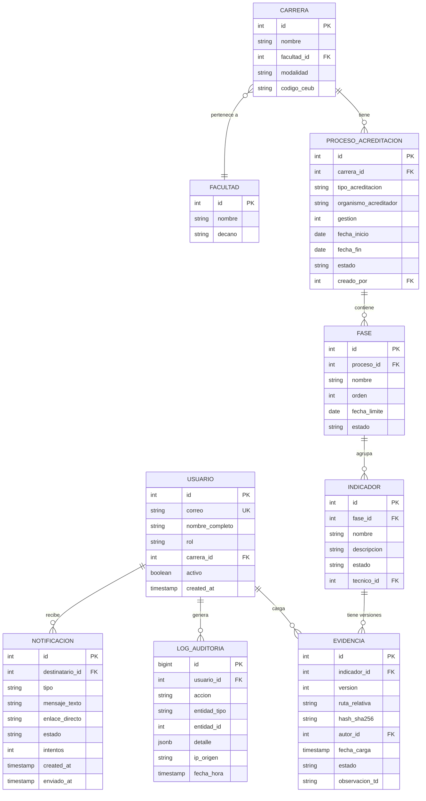

# Functional Specification Document (FSD) — AcredIA / SIGESA
## Modo LFSD ⚡

> **Propósito**: especificar *cómo* funciona el sistema para que ingeniería, diseño y QA puedan implementar y verificar cada comportamiento. Responde a **"¿cómo lo hace el producto?"**
>
> Audiencia: Ingeniería (backend/frontend), QA, Diseño UI/UX, Arquitectura.

---

## 0. Metadatos

| Campo | Valor |
|-------|-------|
| Producto | AcredIA / SIGESA — Sistema Inteligente de Gestión y Seguimiento de Acreditaciones |
| Grupo | AcredIA |
| Versión | `v1.0` |
| Modo | **LFSD ⚡** |
| Fecha | 14/05/2026 |
| Autor / Product Manager | Aylen Mariangel Gonzales Alvino |
| Revisores | M.Sc. Edson Terceros Torrico · Tech Lead AcredIA · QA AcredIA |
| Estado | Borrador |
| BRD de referencia | `team/aylenGonzales/BRD_v2.md` |
| PRD de referencia | `team/aylenGonzales/PRD_v1.md` |
| MRD de referencia | `team/aylenGonzales/docs/mrd/MRD.md` |
| Prompt registrado | PM-022 — `PROMPT_MAPPING.md` |

---

## 1. Resumen ejecutivo

AcredIA / SIGESA es un sistema web activo de gestión documental para procesos de acreditación universitaria (CEUB y ARCU-SUR) en la DUEA-UMSS, Cochabamba, Bolivia. Este FSD especifica el comportamiento funcional detallado de los **7 casos de uso críticos**, las **15 reglas de negocio** que los gobiernan, el **modelo de datos** con 9 entidades, los **10 prompt-contratos** para los módulos asistidos por IA, los **13 NFRs** con umbrales medibles, y los mecanismos de verificación para cada uno.

El sistema opera con cuatro actores autenticados — [CC] Coordinador de Carrera, [TD] Técnico DUEA, [JD] Jefatura DUEA — y un actor público sin autenticación [P]. La arquitectura es web pura (sin instalación), con stack React + Tailwind (frontend), Node.js 20 + Express 4 (backend — ADR-0006), PostgreSQL (base de datos) y almacenamiento de archivos en volumen local Docker (`/data/evidencias/`).

El objetivo funcional central es reducir el tiempo de localización de documentos de 20+ minutos a ≤ 2 minutos, eliminar la pérdida documental en procesos activos y habilitar generación autónoma de reportes ejecutivos en ≤ 5 minutos.

---

## 2. Alcance y plan técnico

### 2.1 Módulos del sistema (v1.0)

| ID | Módulo | Actor principal | PRD-REQ vinculados |
|----|--------|-----------------|-------------------|
| MOD-01 | Autenticación y gestión de roles | Todos | PRD-REQ-001, PRD-REQ-002 |
| MOD-02 | Repositorio de evidencias y versionado | CC, TD | PRD-REQ-003, PRD-REQ-004 |
| MOD-03 | Flujo de aprobación / rechazo | TD, CC | PRD-REQ-005 |
| MOD-04 | Gestión de fases y procesos | TD, JD | PRD-REQ-010, PRD-REQ-015 |
| MOD-05 | Dashboard gerencial y semáforos | JD | PRD-REQ-006 |
| MOD-06 | Reportes ejecutivos PDF | JD | PRD-REQ-007 |
| MOD-07 | Notificaciones automáticas | Sistema | PRD-REQ-008 |
| MOD-08 | Buscador de documentos | TD, JD | PRD-REQ-009 |
| MOD-09 | Log de auditoría | Sistema | PRD-REQ-011 |
| MOD-10 | Portal público | P | PRD-REQ-012 |
| MOD-11 | Certificados de acreditación | JD, P | PRD-REQ-013 |
| MOD-12 | Respaldos automáticos | Sistema | PRD-REQ-014 |

### 2.2 Supuestos y dependencias técnicas

| ID | Supuesto / Dependencia |
|----|------------------------|
| SA-01 | Todos los usuarios disponen de correo @umss.edu.bo activo y verificable |
| SA-02 | El servidor SMTP institucional UMSS es accesible desde la red de despliegue para envío de notificaciones |
| SA-03 | El volumen Docker `/data/evidencias/` tiene capacidad suficiente para el piloto (estimación: ≥ 500 GB — pendiente confirmación TI) |
| SA-04 | Las normativas CEUB y ARCU-SUR no sufrirán cambios estructurales durante la implementación de v1.0 |
| SA-05 | El sistema será desplegado en un servidor institucional o VPS con Docker disponible y acceso a Internet para dependencias npm/pip |
| SA-06 | Los datos iniciales de carreras, facultades y fases serán provistos por la DUEA antes del despliegue |

### 2.3 Stack tecnológico

| Capa | Tecnología | Versión objetivo | Justificación |
|------|-----------|-----------------|---------------|
| Frontend | React + Tailwind CSS | React 18 / Tailwind 3 | Componentes reutilizables; diseño responsive sin CSS custom extenso |
| Backend | Node.js 20 + Express 4 | Node 20 LTS | ADR-0006: spike cerrado; ecosistema npm alineado con React, JWT (ADR-0004), Jest y T-01/T-02 |
| Base de datos | PostgreSQL | 16 | ACID, soporte JSONB para `detalle` en log de auditoría, particionamiento nativo |
| Almacenamiento de archivos | Volumen Docker local `/data/evidencias/` | — | Costo $0 en v1.0; migración a S3-compatible en v2.0 solo requiere cambiar `ruta_relativa` por `url_storage` |
| Motor de reportes PDF | PDFKit | 0.15.x | ADR-0006: generación server-side en Node (T-08) |
| Autenticación | JWT + refresh token | — | Sin estado en servidor; compatible con CORS para SPA React |
| Notificaciones | Nodemailer + servidor SMTP UMSS | 6.x | ADR-0006; sin costo de servicio externo; SLA ≤ 15 min |
| Containerización | Docker + Docker Compose | Docker 25 | Despliegue reproducible; volúmenes para BD y archivos |
| Testing | Jest + Playwright + k6 | — | Unit/integration, E2E y carga |

### 2.4 Tasks ejecutables (Spec Kit)

| ID | Task | Módulo | Responsable |
|----|------|--------|-------------|
| T-01 | Configurar proyecto monorepo con Docker Compose (frontend + backend + PostgreSQL + volumen) | Infra | @DevAgent |
| T-02 | Implementar autenticación JWT con validación de dominio @umss.edu.bo y gestión de roles RBAC | MOD-01 | @DevAgent |
| T-03 | Crear esquema de BD PostgreSQL completo (migración con Flyway/Alembic) | Infra + BD | @DevAgent |
| T-04 | Implementar API REST de carga de evidencias con versionado automático y hash SHA-256 | MOD-02 | @DevAgent |
| T-05 | Implementar flujo de aprobación/rechazo con validación de justificación obligatoria | MOD-03 | @DevAgent |
| T-06 | Implementar módulo de gestión de fases y cierre condicional (bloqueo si hay pendientes) | MOD-04 | @DevAgent |
| T-07 | Implementar dashboard gerencial con lógica de semáforos y filtros por facultad/gestión | MOD-05 | @DevAgent |
| T-08 | Implementar motor de generación de reportes PDF con plantilla SIGESA | MOD-06 | @DevAgent |
| T-09 | Implementar sistema de notificaciones con cola de eventos y envío SMTP ≤ 15 min | MOD-07 | @DevAgent |
| T-10 | Implementar buscador con índices full-text PostgreSQL (título, carrera, facultad, modalidad, gestión) | MOD-08 | @DevAgent |
| T-11 | Implementar log de auditoría append-only con REVOKE DELETE, UPDATE para rol de aplicación | MOD-09 | @ArchAgent |
| T-12 | Implementar portal público (endpoints sin autenticación) y módulo de certificados | MOD-10, MOD-11 | @DevAgent |

---

## 3. Actores del sistema

| Código | Actor | Tipo | Autenticación | Visibilidad |
|--------|-------|------|--------------|-------------|
| [CC] | Coordinador de Carrera | Humano interno | JWT @umss.edu.bo | Solo su carrera asignada |
| [TD] | Técnico DUEA (Auditor) | Humano interno | JWT @umss.edu.bo | Global (todas las carreras) |
| [JD] | Jefatura DUEA | Humano interno | JWT @umss.edu.bo | Total del sistema |
| [JC] | Jefe de Carrera | Humano interno | JWT @umss.edu.bo | Su carrera + reportes de sus coordinadores |
| [EE] | Evaluador Externo | Humano externo | JWT temporal (credencial DUEA) | Proceso asignado, solo lectura |
| [P] | Público externo | Humano externo | Sin autenticación | Portal público únicamente |
| [SYS-NOTIF] | Sistema de notificaciones | Proceso automático | Rol interno | Cola de eventos del sistema |
| [SYS-RPT] | Motor de reportes | Proceso automático | Rol interno | Datos de procesos activos |

---

## 4. Casos de uso críticos

### FSD-UC-001 — Autenticación y autorización por roles

| Atributo | Valor |
|----------|-------|
| **ID** | FSD-UC-001 |
| **Actor principal** | Cualquier usuario humano |
| **Precondición** | El usuario tiene correo institucional @umss.edu.bo activo y rol asignado en el sistema |
| **Disparador** | El usuario accede a la URL del sistema |
| **PRD-REQ trazados** | PRD-REQ-001, PRD-REQ-002 |
| **BRD-BR trazados** | BR-006, RB-06 |
| **NFR aplicables** | NFR-003 (seguridad/confidencialidad), NFR-004 (no repudio) |

**Flujo principal:**

1. Usuario accede a `https://sigesa.umss.edu.bo/login`.
2. Ingresa correo institucional y contraseña.
3. El sistema valida que el dominio sea `@umss.edu.bo`; si no, bloquea con mensaje: *"Solo se admiten correos institucionales UMSS."*
4. El sistema verifica credenciales contra la BD y genera JWT + refresh token.
5. El JWT contiene: `user_id`, `rol`, `carrera_id` (si aplica), `exp` (24 h).
6. El sistema redirige al dashboard según rol: `/dashboard/coordinador`, `/dashboard/tecnico` o `/dashboard/jefatura`.
7. El sistema registra el evento `LOGIN` en `LOG_AUDITORIA`.

**Flujos alternos:**

| ID | Condición | Comportamiento del sistema |
|----|-----------|---------------------------|
| A1 | Credenciales incorrectas (≤ 3 intentos) | Muestra error genérico "Credenciales inválidas" sin revelar qué campo falló |
| A2 | 3 intentos fallidos consecutivos | Bloquea la cuenta por 15 minutos y notifica al usuario por correo |
| A3 | JWT expirado durante sesión activa | Intenta renovar con refresh token; si falla, redirige a login con mensaje "Sesión expirada" |
| A4 | Usuario sin rol asignado | Muestra pantalla de espera: "Tu acceso está pendiente de configuración por la DUEA" |

**Postcondiciones:**
- El usuario tiene sesión activa con JWT válido.
- El evento LOGIN está registrado en `LOG_AUDITORIA` con `usuario_id`, `ip_origen`, `timestamp`.

**Criterios Gherkin:**

```gherkin
Escenario: Login exitoso con correo UMSS
  Dado un usuario con correo "coord@umss.edu.bo" y contraseña válida
  Cuando ingresa sus credenciales en /login
  Entonces el sistema genera JWT y lo redirige a /dashboard/coordinador
   Y el evento LOGIN queda registrado en LOG_AUDITORIA

Escenario: Bloqueo por 3 intentos fallidos
  Dado un usuario que ha fallado 2 intentos de login
  Cuando falla el tercer intento
  Entonces el sistema bloquea la cuenta por 15 minutos
   Y envía correo de aviso al usuario en ≤ 15 minutos
   Y registra el evento BLOQUEO_CUENTA en LOG_AUDITORIA

Escenario: Correo no institucional rechazado
  Dado un usuario con correo "usuario@gmail.com"
  Cuando intenta autenticarse
  Entonces el sistema muestra: "Solo se admiten correos institucionales UMSS."
   Y no genera JWT ni token de sesión

Escenario: JWT expirado con refresh token válido
  Dado un usuario con sesión activa cuyo JWT ha expirado
  Cuando el frontend detecta respuesta 401
  Entonces el sistema renueva el JWT con el refresh token
   Y la sesión continúa sin interrumpir la tarea del usuario
```

---

### FSD-UC-002 — Carga y versionado de evidencias

| Atributo | Valor |
|----------|-------|
| **ID** | FSD-UC-002 |
| **Actor principal** | [CC] Coordinador de Carrera |
| **Precondición** | [CC] autenticado; subfase en estado `PENDIENTE` o `RECHAZADO`; proceso activo asociado a su carrera |
| **Disparador** | [CC] selecciona un indicador y pulsa "Cargar evidencia" |
| **PRD-REQ trazados** | PRD-REQ-003, PRD-REQ-004 |
| **BRD-BR trazados** | BR-001, BR-002, RB-02, RB-04 |
| **NFR aplicables** | NFR-003, NFR-004, NFR-007 (usabilidad), NFR-009 (mantenibilidad) |

**Flujo principal:**

1. [CC] navega a su carrera → proceso activo → fase → indicador pendiente.
2. Pulsa "Cargar evidencia"; el sistema muestra diálogo de carga con área drag-and-drop.
3. [CC] selecciona archivo (PDF, DOCX, XLSX; máx. 50 MB por archivo).
4. El sistema muestra barra de progreso durante la transferencia (PRD-NFR-009).
5. Al completarse, el sistema calcula `hash_sha256` del archivo y lo guarda en `/data/evidencias/{proceso_id}/{fase_id}/{indicador_id}/{version}_{nombre_original}`.
6. El sistema registra en BD: `ruta_relativa`, `hash_sha256`, `version` (incremento automático), `autor_id`, `fecha_carga`, `estado = EN_REVISION`.
7. El sistema cambia el estado del indicador a `EN_REVISION`.
8. El sistema encola notificación para [TD] asignado (cola [SYS-NOTIF]).
9. El sistema muestra confirmación: *"Evidencia registrada — versión N, [fecha hora], por [nombre CC]."*
10. El evento `CARGA` queda registrado en `LOG_AUDITORIA`.

**Flujos alternos:**

| ID | Condición | Comportamiento |
|----|-----------|----------------|
| A1 | Archivo supera 50 MB | Error antes de la carga: "El archivo supera el límite de 50 MB. Comprima el documento e intente nuevamente." |
| A2 | Formato no admitido (ej. .exe, .zip) | Error: "Formato no permitido. Solo se admiten PDF, DOCX y XLSX." |
| A3 | Falla de conexión durante la carga | El sistema cancela la operación parcial, elimina el fragmento incompleto del volumen y muestra: "Error de conexión. El archivo no fue registrado. Intente de nuevo." |
| A4 | Indicador ya tiene versión `APROBADO` | El sistema bloquea la recarga y muestra: "Este indicador ya fue aprobado. Contacte a la DUEA para gestionar una corrección." (RB-04) |

**Postcondiciones:**
- El archivo está almacenado en el volumen con `hash_sha256` verificable.
- El indicador está en estado `EN_REVISION`.
- El [TD] asignado recibe notificación en ≤ 15 minutos.
- El evento `CARGA` está en `LOG_AUDITORIA`.

**Criterios Gherkin:**

```gherkin
Escenario: Carga exitosa de evidencia con versionado automático
  Dado un [CC] autenticado con indicador en estado PENDIENTE
  Cuando sube un archivo PDF válido (≤ 50 MB)
  Entonces el sistema calcula y almacena el hash SHA-256
   Y registra versión N con autor, fecha y ruta_relativa
   Y el indicador pasa a estado EN_REVISION
   Y el [TD] recibe notificación por correo en ≤ 15 minutos

Escenario: Recarga de evidencia rechazada
  Dado un [CC] con indicador en estado RECHAZADO
  Cuando sube una nueva versión del documento
  Entonces el sistema crea versión N+1 sin eliminar la versión rechazada anterior
   Y el indicador pasa a EN_REVISION nuevamente
   Y el [TD] recibe nueva notificación

Escenario: Bloqueo por archivo demasiado grande
  Dado un [CC] que intenta subir un archivo de 80 MB
  Cuando selecciona el archivo en el diálogo
  Entonces el sistema muestra error antes de iniciar la transferencia
   Y no registra ningún archivo en el volumen ni en la BD

Escenario: Confirmación determinista post-carga
  Dado un [CC] que acaba de completar una carga exitosa
  Entonces el sistema muestra: "Evidencia registrada — versión [N], [dd/mm/yyyy hh:mm], por [nombre]"
   Y la barra de progreso alcanza el 100% antes de mostrar la confirmación
```

---

### FSD-UC-003 — Aprobación y rechazo de indicadores

| Atributo | Valor |
|----------|-------|
| **ID** | FSD-UC-003 |
| **Actor principal** | [TD] Técnico DUEA |
| **Precondición** | [TD] autenticado; indicador en estado `EN_REVISION`; evidencia cargada |
| **Disparador** | [TD] abre el panel de auditoría y selecciona un indicador para revisar |
| **PRD-REQ trazados** | PRD-REQ-005, PRD-REQ-011 |
| **BRD-BR trazados** | BR-003, RB-03, RB-04 |
| **NFR aplicables** | NFR-004 (no repudio), NFR-007 (usabilidad) |

**Flujo principal (Aprobación):**

1. [TD] accede a su panel de auditoría; ve lista de indicadores `EN_REVISION` con carrera, fase y nombre del CC.
2. Selecciona un indicador; el sistema muestra el documento vigente y el historial de versiones.
3. [TD] revisa el documento; pulsa "Aprobar".
4. El sistema solicita confirmación: *"¿Confirmar aprobación del indicador [nombre]?"*
5. [TD] confirma; el sistema cambia estado del indicador a `APROBADO`.
6. El sistema registra la acción en `LOG_AUDITORIA` (evento `APROBACION`).
7. El sistema encola notificación para [CC]: *"Tu indicador [nombre] fue aprobado por [TD]."*
8. El sistema verifica si todos los indicadores de la subfase están `APROBADO`; si sí, habilita el botón "Cerrar subfase".

**Flujo alternativo (Rechazo):**

1–2. Igual al flujo principal.
3. [TD] pulsa "Rechazar".
4. El sistema muestra campo obligatorio: *"Justificación del rechazo (requerida):"*
5. Si [TD] intenta confirmar sin texto → el sistema bloquea y muestra: *"La justificación es obligatoria para registrar un rechazo."*
6. [TD] ingresa justificación (mínimo 20 caracteres) y confirma.
7. El sistema cambia estado del indicador a `RECHAZADO`.
8. El sistema registra el evento `RECHAZO` en `LOG_AUDITORIA` con el texto de justificación.
9. El sistema encola notificación para [CC] con la observación completa.

**Flujos alternos:**

| ID | Condición | Comportamiento |
|----|-----------|----------------|
| A1 | Rechazo sin justificación | Bloqueo de acción; mensaje de error en campo |
| A2 | Justificación < 20 caracteres | Advertencia: "La justificación debe tener al menos 20 caracteres." |
| A3 | Indicador ya en estado APROBADO (intento de reaprobación) | Sistema muestra: "Este indicador ya fue aprobado. El historial es inmutable." |
| A4 | [TD] intenta eliminar documento de evidencia | Sistema bloquea: "Los documentos aprobados no pueden eliminarse." (RB-04) |

**Postcondiciones:**
- El indicador tiene estado `APROBADO` o `RECHAZADO`.
- El evento (`APROBACION` / `RECHAZO`) está en `LOG_AUDITORIA` con justificación si aplica.
- El [CC] recibe notificación en ≤ 15 minutos.

**Criterios Gherkin:**

```gherkin
Escenario: Técnico aprueba indicador con evidencia válida
  Dado un [TD] autenticado con indicador en estado EN_REVISION
  Cuando confirma la aprobación
  Entonces el indicador pasa a estado APROBADO
   Y el evento APROBACION queda en LOG_AUDITORIA con usuario y timestamp
   Y el [CC] recibe notificación en ≤ 15 minutos

Escenario: Rechazo bloqueado sin justificación
  Dado un [TD] que pulsa "Rechazar" sin ingresar texto
  Cuando intenta confirmar
  Entonces el sistema bloquea la acción
   Y muestra: "La justificación es obligatoria para registrar un rechazo."
   Y no cambia el estado del indicador

Escenario: Rechazo exitoso con justificación completa
  Dado un [TD] que ingresa justificación de al menos 20 caracteres
  Cuando confirma el rechazo
  Entonces el indicador pasa a estado RECHAZADO
   Y la justificación queda almacenada y visible para el [CC]
   Y el evento RECHAZO queda en LOG_AUDITORIA

Escenario: Intento de eliminación de documento aprobado bloqueado
  Dado un [TD] que intenta eliminar un documento con estado APROBADO
  Cuando ejecuta la acción de eliminación
  Entonces el sistema bloquea la operación
   Y muestra: "Los documentos aprobados no pueden eliminarse."
```

---

### FSD-UC-004 — Dashboard gerencial con semáforos

| Atributo | Valor |
|----------|-------|
| **ID** | FSD-UC-004 |
| **Actor principal** | [JD] Jefatura DUEA |
| **Precondición** | [JD] autenticado; al menos un proceso activo registrado en el sistema |
| **Disparador** | [JD] accede al dashboard principal o navega a `/dashboard/jefatura` |
| **PRD-REQ trazados** | PRD-REQ-006 |
| **BRD-BR trazados** | BR-003, RB-09 |
| **NFR aplicables** | NFR-001 (rendimiento), NFR-005 (disponibilidad) |

**Flujo principal:**

1. [JD] accede al dashboard; el sistema consulta todos los procesos activos (estado `ACTIVO` o `EN_FASE`).
2. El sistema calcula el semáforo por carrera según lógica:
   - 🟢 **Verde**: avance ≥ 80 % de indicadores aprobados en la fase actual.
   - 🟡 **Amarillo**: avance 50–79 % O hay indicadores `EN_REVISION` con más de 15 días sin respuesta.
   - 🔴 **Rojo**: avance < 50 % O hay indicadores `PENDIENTE`/`RECHAZADO` con fecha límite de fase en ≤ 7 días.
3. El sistema muestra tabla con: carrera, facultad, tipo de acreditación, fase actual, % de avance y semáforo.
4. [JD] puede filtrar por: facultad, tipo (CEUB / ARCU-SUR), gestión (año).
5. Los datos se actualizan en tiempo real (polling cada 30 s o WebSocket).
6. El sistema responde en ≤ 3 s para el p95 de carga (NFR-001).

**Flujos alternos:**

| ID | Condición | Comportamiento |
|----|-----------|----------------|
| A1 | Sin procesos activos | Dashboard muestra: "No hay procesos de acreditación activos. Configure uno desde el módulo de Procesos." |
| A2 | Datos de una carrera desactualizados (> 24 h sin cambio) | Indicador de advertencia junto a la carrera: "⚠ Sin actividad reciente" |
| A3 | [JD] aplica filtro y no hay resultados | Muestra: "Sin carreras que coincidan con los filtros seleccionados." |

**Postcondiciones:**
- [JD] tiene visibilidad del estado real de todos los procesos en ≤ 2 minutos.

**Criterios Gherkin:**

```gherkin
Escenario: Dashboard carga con semáforos correctos
  Dado la [JD] autenticada con 5 procesos activos en distintas facultades
  Cuando accede a /dashboard/jefatura
  Entonces el sistema muestra todas las carreras con semáforo calculado
   Y la carga del dashboard ocurre en ≤ 3 segundos (p95)

Escenario: Filtro por facultad reduce la vista
  Dado la [JD] en el dashboard con múltiples facultades
  Cuando aplica filtro "Facultad de Ciencias"
  Entonces solo se muestran carreras de esa facultad
   Y el semáforo de cada carrera se recalcula para el subconjunto filtrado

Escenario: Carrera en estado rojo visible al instante
  Dado un proceso con avance < 50% y fecha límite en 5 días
  Cuando la [JD] accede al dashboard
  Entonces esa carrera aparece con semáforo 🔴 y etiqueta "Urgente"
```

---

### FSD-UC-005 — Generación de reporte ejecutivo PDF

| Atributo | Valor |
|----------|-------|
| **ID** | FSD-UC-005 |
| **Actor principal** | [JD] Jefatura DUEA |
| **Precondición** | [JD] autenticado; al menos un proceso con datos suficientes para el reporte |
| **Disparador** | [JD] navega a "Reportes" y configura los parámetros del reporte |
| **PRD-REQ trazados** | PRD-REQ-007 |
| **BRD-BR trazados** | BR-004, RB-07 |
| **NFR aplicables** | NFR-001 (rendimiento), NFR-002 (CPU) |

**Flujo principal:**

1. [JD] navega al módulo de Reportes.
2. Configura parámetros: carrera/facultad (multi-select), periodo (gestión), tipo de acreditación.
3. Previsualiza semáforos en pantalla antes de generar.
4. Pulsa "Generar PDF".
5. El sistema muestra spinner con mensaje: *"Generando reporte… esto puede tardar hasta 5 minutos."*
6. El motor [SYS-RPT] compila los datos y genera el PDF con: portada SIGESA/UMSS, tabla de semáforos por carrera, % de avance por fase, alertas de retrasos activos, log de cambios de estado, pie de página con fecha de generación y firma digital de la DUEA.
7. Cuando el PDF está listo (≤ 5 min), el sistema habilita botón "Descargar PDF".
8. La descarga se registra en `LOG_AUDITORIA` (evento `REPORTE`).

**Flujos alternos:**

| ID | Condición | Comportamiento |
|----|-----------|----------------|
| A1 | Motor PDF falla durante la generación | El sistema notifica: "No fue posible generar el reporte. El panel principal continúa disponible. Intente de nuevo en 2 minutos." (NFR-006 — tolerancia a fallos) |
| A2 | [JD] genera reporte sin seleccionar carrera/periodo | El sistema bloquea con: "Seleccione al menos una carrera y un periodo para continuar." |
| A3 | El reporte tarda más de 5 minutos | El sistema envía notificación por correo al [JD] cuando el PDF esté listo, en lugar de mantener el spinner |

**Postcondiciones:**
- El PDF está disponible para descarga con metadatos de generación.
- El evento `REPORTE` está en `LOG_AUDITORIA`.

**Criterios Gherkin:**

```gherkin
Escenario: Generación exitosa de reporte PDF en tiempo
  Dado la [JD] con proceso activo y selección de carrera + periodo
  Cuando pulsa "Generar PDF"
  Entonces el sistema genera el PDF en ≤ 5 minutos
   Y el PDF incluye semáforos, % de avance y alertas activas
   Y la descarga queda registrada en LOG_AUDITORIA

Escenario: Reporte bloqueado sin parámetros
  Dado la [JD] que no ha seleccionado carrera ni periodo
  Cuando pulsa "Generar PDF"
  Entonces el sistema bloquea la acción
   Y muestra: "Seleccione al menos una carrera y un periodo para continuar."

Escenario: Fallo del motor PDF no afecta el dashboard
  Dado que el motor PDF lanza una excepción interna
  Cuando la [JD] intenta generar un reporte
  Entonces el sistema muestra mensaje de error específico
   Y el dashboard y todos los demás módulos permanecen operativos
```

---

### FSD-UC-006 — Notificaciones automáticas por correo

| Atributo | Valor |
|----------|-------|
| **ID** | FSD-UC-006 |
| **Actor principal** | [SYS-NOTIF] Sistema de notificaciones |
| **Precondición** | Evento crítico registrado en la cola de notificaciones |
| **Disparador** | Evento de tipo: CARGA, APROBACION, RECHAZO, VENCIMIENTO_PROXIMO, AVANCE_FASE |
| **PRD-REQ trazados** | PRD-REQ-008 |
| **BRD-BR trazados** | BR-005, RB-05 |
| **NFR aplicables** | NFR-005 (disponibilidad), NFR-010 (interoperabilidad SMTP) |

**Flujo principal:**

1. Un módulo registra un evento en la cola de notificaciones con: `tipo`, `destinatario_id`, `carrera_id`, `indicador_id` (si aplica), `mensaje_texto`, `enlace_directo`.
2. El [SYS-NOTIF] consume la cola cada 60 segundos.
3. Para cada evento pendiente, construye el correo con plantilla HTML institucional.
4. Envía via SMTP al correo institucional del destinatario.
5. Registra el resultado: `ENVIADO` o `FALLIDO` con `timestamp` y `error_detalle` si aplica.
6. Si `FALLIDO`, reintenta hasta 3 veces con backoff exponencial (1 min, 5 min, 15 min).
7. Si los 3 reintentos fallan, registra `FALLIDO_DEFINITIVO` y alerta al [JD] por canal de respaldo.

**Alertas programadas (scheduler diario):**
- 30 días antes del vencimiento de fase: alerta preventiva a [CC] y [JD].
- 15 días antes: alerta urgente a [CC], [TD] y [JD].
- 7 días antes: alerta crítica con lista de indicadores pendientes.
- 1 día antes: alerta de emergencia.

**Flujos alternos:**

| ID | Condición | Comportamiento |
|----|-----------|----------------|
| A1 | Servidor SMTP UMSS no disponible | Reintento con backoff; alerta a [JD] si los 3 reintentos fallan |
| A2 | Correo del destinatario inválido o inactivo | Registra error y notifica al [JD] para actualizar el usuario |
| A3 | Cola acumulada (> 100 eventos pendientes) | Alerta de capacidad al [JD] y @ArchAgent; procesa en lotes de 50 |

**Criterios Gherkin:**

```gherkin
Escenario: Notificación de rechazo llega en tiempo
  Dado que un [TD] rechazó un indicador con justificación
  Cuando el evento RECHAZO es registrado en la cola
  Entonces el [CC] recibe correo con texto de justificación en ≤ 15 minutos
   Y el correo incluye enlace directo al indicador en el sistema

Escenario: Alerta de vencimiento próximo (7 días)
  Dado una subfase con fecha límite en 7 días e indicadores pendientes
  Cuando el scheduler diario se ejecuta
  Entonces el [CC], [TD] y [JD] reciben correo con lista de indicadores pendientes
   Y cada correo incluye enlace directo a la subfase

Escenario: Reintento ante fallo SMTP
  Dado que el servidor SMTP no está disponible
  Cuando el sistema intenta enviar una notificación
  Entonces reintenta 3 veces con backoff (1, 5, 15 minutos)
   Y si los 3 reintentos fallan, registra FALLIDO_DEFINITIVO y alerta al [JD]
```

**Postcondiciones:**

- Cada evento queda en estado `ENVIADO`, `FALLIDO` o `FALLIDO_DEFINITIVO` en `NOTIFICACION`.
- Los envíos exitosos respetan SLA ≤ 15 min (RBN-08, NFR-011).
- Fallos definitivos generan alerta al [JD].

---

### FSD-UC-007 — Buscador de documentos

| Atributo | Valor |
|----------|-------|
| **ID** | FSD-UC-007 |
| **Actor principal** | [TD] Técnico DUEA, [JD] Jefatura DUEA |
| **Precondición** | Usuario autenticado; al menos un documento registrado en el sistema |
| **Disparador** | Usuario accede al módulo de búsqueda o usa la barra de búsqueda global |
| **PRD-REQ trazados** | PRD-REQ-009 |
| **BRD-BR trazados** | BR-008 |
| **NFR aplicables** | NFR-001 (p95 ≤ 3 s), NFR-008 (accesibilidad) |

**Flujo principal:**

1. Usuario accede a `/buscar` o usa la barra de búsqueda global.
2. Puede ingresar texto libre (título del documento) y/o aplicar filtros: carrera, facultad, modalidad, gestión (año), estado (PENDIENTE / EN_REVISION / APROBADO / RECHAZADO), tipo de acreditación.
3. El sistema ejecuta búsqueda full-text en PostgreSQL con índice GIN sobre `titulo`, `carrera.nombre`, `facultad.nombre`, `modalidad`, `gestion`.
4. Retorna resultados ordenados por relevancia (ts_rank) en ≤ 3 s (p95).
5. Cada resultado muestra: nombre de archivo, carrera, versión vigente, estado, fecha de última modificación, botón "Ver".
6. Usuario selecciona un resultado y accede al documento directamente.

**Flujos alternos:**

| ID | Condición | Comportamiento |
|----|-----------|----------------|
| A1 | Sin resultados | Muestra: "No se encontraron documentos con los criterios ingresados. Ajuste los filtros." |
| A2 | Búsqueda muy amplia (> 500 resultados) | Paginación automática (50 por página) con contador: "Mostrando 1–50 de [N]" |
| A3 | Usuario [CC] busca documento de otra carrera | El sistema filtra automáticamente por `carrera_id` del token JWT; no ve documentos de otras carreras |

**Criterios Gherkin:**

```gherkin
Escenario: Técnico localiza documento en ≤ 2 minutos
  Dado un [TD] con al menos 100 documentos en el sistema
  Cuando busca por carrera "Ingeniería de Sistemas" y gestión "2025"
  Entonces el sistema retorna resultados en ≤ 3 segundos
   Y el [TD] puede acceder al documento en menos de 2 minutos desde el inicio de la búsqueda

Escenario: Búsqueda respeta visibilidad por rol
  Dado un [CC] asignado a "Carrera de Medicina"
  Cuando busca "evidencia de docentes"
  Entonces el sistema solo retorna documentos de "Carrera de Medicina"
   Y no muestra documentos de otras carreras

Escenario: Sin resultados informa claramente
  Dado un [TD] que busca "Informe de planta fisica 2030"
  Cuando ejecuta la búsqueda
  Entonces el sistema muestra: "No se encontraron documentos con los criterios ingresados."
   Y sugiere ajustar los filtros
```

**Postcondiciones:**

- El usuario visualiza la lista de resultados o un mensaje claro de ausencia de coincidencias.
- No se modifican documentos ni metadatos de evidencias.
- Las consultas de [CC] quedan acotadas a `carrera_id` del token JWT.

---

### FSD-UC-008 — Portal público de consulta de estado

| Atributo | Valor |
|----------|-------|
| **ID** | FSD-UC-008 |
| **Actor principal** | [P] Usuario público (sin autenticación) |
| **Precondición** | Portal público habilitado; al menos una carrera con estado registrado |
| **Disparador** | Usuario externo accede a la URL pública del portal |
| **PRD-REQ trazados** | PRD-REQ-012 |
| **BRD-BR trazados** | BR-010 |
| **NFR aplicables** | NFR-003, NFR-008 |

**Flujo principal:**

1. Usuario accede al portal sin credenciales.
2. Selecciona facultad y/o carrera.
3. El sistema consulta el estado de acreditación vigente.
4. Muestra carrera, facultad, estado (`EN_PROCESO`, `ACREDITADA`, `VENCIDA`), fecha de actualización y fase CEUB actual.
5. Opcionalmente descarga resumen público en PDF (sin datos internos del expediente).

**Flujos alternos:**

| ID | Condición | Comportamiento |
|----|-----------|----------------|
| A1 | Carrera sin estado | Muestra "Información no disponible aún" |
| A2 | Error al generar PDF | Ofrece vista en pantalla como alternativa |

**Postcondiciones:**

- No se modifican datos del expediente interno.
- Se registra `PUBLIC_QUERY` en `LOG_AUDITORIA` sin datos personales del visitante.

**Criterios Gherkin:**

```gherkin
Escenario: Consulta pública de carrera acreditada
  Dado el portal público habilitado
  And la carrera "Ingeniería de Sistemas" tiene estado ACREDITADA
  When un usuario externo la consulta sin autenticarse
  Entonces ve estado ACREDITADA, facultad y fecha de actualización
  And no se exponen datos internos del expediente
```

> Especificación extendida y PC-008: `04_fsd/casos-de-uso.md`, `04_fsd/prompt-contracts.md`.

---

### FSD-UC-009 — Emisión y descarga de certificados de acreditación

| Atributo | Valor |
|----------|-------|
| **ID** | FSD-UC-009 |
| **Actor principal** | [JD] Jefatura DUEA |
| **Precondición** | Usuario autenticado con rol [JD]; carrera en estado `ACREDITADA` vigente |
| **Disparador** | [JD] solicita emitir certificado para una carrera y período |
| **PRD-REQ trazados** | PRD-REQ-013 |
| **BRD-BR trazados** | BR-011 |
| **NFR aplicables** | NFR-003, NFR-004 |

**Flujo principal:**

1. [JD] accede al módulo de certificados.
2. Selecciona carrera y período de acreditación.
3. El sistema valida estado `ACREDITADA` y vigencia.
4. Genera PDF con datos públicos del certificado, número único y QR de verificación.
5. [JD] descarga el certificado.
6. Registra `CERTIFICATE_ISSUED` en `LOG_AUDITORIA`.

**Flujos alternos:**

| ID | Condición | Comportamiento |
|----|-----------|----------------|
| A1 | Estado distinto de `ACREDITADA` | Bloquea emisión y muestra estado actual |
| A2 | Acreditación vencida | Informa fecha de vencimiento; no emite |
| A3 | Error PDF | Notifica al [JD] y registra fallo |

**Postcondiciones:**

- Certificado registrado con número único e inmutable.
- QR de verificación activo para consulta pública.

**Criterios Gherkin:**

```gherkin
Escenario: Emisión exitosa de certificado
  Dado la carrera "Ing. de Sistemas" está ACREDITADA vigente
  And el [JD] está autenticado
  When solicita emitir el certificado del período 2026-I
  Entonces el sistema genera PDF con número único y QR
  And registra CERTIFICATE_ISSUED en el log
```

> PC-009: `04_fsd/prompt-contracts.md`.

---

### FSD-UC-010 — Respaldo automático diario verificable

| Atributo | Valor |
|----------|-------|
| **ID** | FSD-UC-010 |
| **Actor principal** | [SYS] Scheduler automático |
| **Precondición** | BD y volumen de evidencias activos; scheduler 02:00 BOT |
| **Disparador** | Ejecución programada diaria |
| **PRD-REQ trazados** | PRD-REQ-014 |
| **BRD-BR trazados** | BR-012 |
| **NFR aplicables** | NFR-013 |

**Flujo principal:**

1. Scheduler dispara respaldo a las 02:00.
2. Genera dump SQL de PostgreSQL.
3. Respalda archivos de evidencias.
4. Calcula hash SHA-256 del paquete.
5. Almacena en ubicación secundaria.
6. Registra `BACKUP_COMPLETED` en `LOG_AUDITORIA`.
7. Si falla, alerta al [JD] en ≤ 15 min.

**Flujos alternos:**

| ID | Condición | Comportamiento |
|----|-----------|----------------|
| A1 | Fallo dump BD | Marca `FAILED`; reintenta en 1 h |
| A2 | Sin espacio secundario | Alerta; no sobreescribe respaldo válido anterior |

**Postcondiciones:**

- Respaldo del día disponible con hash verificable.
- Administrador notificado solo ante fallo.

**Criterios Gherkin:**

```gherkin
Escenario: Respaldo diario exitoso
  Dado el scheduler configurado a las 02:00
  When se ejecuta el respaldo
  Entonces registra BACKUP_COMPLETED con hash SHA-256
  And no envía alerta al [JD]
```

> PC-010: `04_fsd/prompt-contracts.md`. TC-011 pendiente (GAP-003).

---

### FSD-UC-011 — Validación de proceso único activo por carrera

| Atributo | Valor |
|----------|-------|
| **ID** | FSD-UC-011 |
| **Actor principal** | Sistema (validación en creación de proceso) |
| **Precondición** | Usuario [JD] o [TD] inicia o registra un proceso de acreditación |
| **Disparador** | Intento de crear proceso del mismo tipo para la misma carrera y periodo |
| **PRD-REQ trazados** | PRD-REQ-015 |
| **BRD-BR trazados** | BR-013 |
| **NFR aplicables** | NFR-004 |

**Flujo principal:**

1. Usuario solicita crear proceso (tipo CEUB o ARCU-SUR) para `carrera_id` y `periodo`.
2. El sistema consulta procesos activos del mismo tipo y carrera en el periodo.
3. Si existe uno activo, rechaza con mensaje institucional claro.
4. Si no existe, permite continuar el alta.

**Flujos alternos:**

| ID | Condición | Comportamiento |
|----|-----------|----------------|
| A1 | Proceso anterior cerrado | Permite nuevo proceso |

**Postcondiciones:**

- A lo sumo un proceso activo del mismo tipo por carrera y periodo (RBN-05).

**Criterios Gherkin:**

```gherkin
Escenario: Bloqueo de segundo proceso activo
  Dado un proceso CEUB activo para "Ing. de Sistemas" periodo 2026-I
  When el [JD] intenta crear otro proceso CEUB para la misma carrera y periodo
  Entonces el sistema rechaza con mensaje de proceso duplicado
  And no crea el segundo proceso
```

---

## 5. Reglas de negocio

| ID | Regla | Tipo | Casos de uso afectados | BRD-BR origen |
|----|-------|------|-----------------------|---------------|
| RBN-01 | Solo usuarios con dominio @umss.edu.bo pueden autenticarse | Política de seguridad | FSD-UC-001 | BR-006, RB-06 |
| RBN-02 | Los documentos aprobados no pueden eliminarse; solo se versionan | Normativa de trazabilidad | FSD-UC-002, FSD-UC-003 | BR-002, RB-04 |
| RBN-03 | El rechazo de un indicador requiere justificación de mínimo 20 caracteres | Política DUEA | FSD-UC-003 | BR-003 |
| RBN-04 | Una subfase solo puede cerrarse si todos sus indicadores están en estado APROBADO | Normativa CEUB/ARCU-SUR | FSD-UC-003 | RB-03 |
| RBN-05 | No puede haber más de un proceso activo del mismo tipo para la misma carrera en el mismo periodo | Política de datos | FSD-UC-004, FSD-UC-005 | BR-013 |
| RBN-06 | Los plazos de fases no son modificables por usuarios; solo por [JD] con resolución DUEA documentada | Normativa institucional | FSD-UC-004, FSD-UC-006 | RB-05 |
| RBN-07 | El log de auditoría es append-only; el rol de aplicación tiene REVOKE DELETE, UPDATE sobre `LOG_AUDITORIA` | Política de integridad | Todos (transversal) | BR-009 |
| RBN-08 | Las notificaciones deben enviarse en ≤ 15 minutos de ocurrido el evento | SLA de notificaciones | FSD-UC-006 | BR-005 |
| RBN-09 | Solo el [CC] designado para una carrera puede cargar evidencias en esa carrera | Política DUEA | FSD-UC-002 | RB-02 |
| RBN-10 | Cada evidencia debe asociarse obligatoriamente a un indicador y un proceso; no existe carga "huérfana" | Normativa de trazabilidad | FSD-UC-002 | BR-015 (BRD v2 §23) |
| RBN-11 | Los reportes ejecutivos son de uso interno; el PDF lleva marca de agua "USO INTERNO DUEA-UMSS" | Política institucional | FSD-UC-005 | RB-07 |
| RBN-12 | El avance porcentual de una fase se calcula como: (indicadores APROBADO / total indicadores de la fase) × 100 | Política de cálculo | FSD-UC-004 | RB-09 (BRD v2 §23) |
| RBN-13 | Una carrera ARCU-SUR solo puede iniciar si tiene acreditación CEUB vigente | Normativa CEUB/ARCU-SUR | FSD-UC-004 | RB-01 |
| RBN-14 | El respaldo automático se ejecuta diariamente a las 02:00 BOT; la DUEA recibe confirmación por correo | Política operativa | FSD-UC-010, MOD-12 | BR-012 |
| RBN-15 | Las sugerencias de IA son orientativas; no pueden aprobar ni rechazar indicadores de forma autónoma | Política de IA ética | Todos (futuro v2.0) | RB-11 (BRD v2 §23) |

---

## 6. Modelo de datos

### 6.1 Diagrama ER (Mermaid)



### 6.2 Diccionario de datos — Entidades core

#### USUARIO

| Campo | Tipo | Restricciones | Descripción |
|-------|------|--------------|-------------|
| `id` | SERIAL | PK | Identificador único |
| `correo` | VARCHAR(255) | UNIQUE, NOT NULL, CHECK @umss.edu.bo | Correo institucional — clave de autenticación |
| `nombre_completo` | VARCHAR(255) | NOT NULL | Nombre para mostrar en UI y logs |
| `rol` | ENUM('COORDINADOR','TECNICO','JEFATURA','PUBLICO') | NOT NULL | Rol RBAC del usuario |
| `carrera_id` | INT | FK → CARRERA.id, NULL si rol = JEFATURA/TECNICO | Restricción de visibilidad para COORDINADOR |
| `activo` | BOOLEAN | DEFAULT TRUE | Control de acceso; usuarios inactivos no pueden autenticarse |

#### EVIDENCIA

| Campo | Tipo | Restricciones | Descripción |
|-------|------|--------------|-------------|
| `id` | SERIAL | PK | Identificador único |
| `indicador_id` | INT | FK → INDICADOR.id, NOT NULL | Indicador al que pertenece la evidencia |
| `version` | INT | NOT NULL, DEFAULT 1 | Incremento automático por indicador |
| `ruta_relativa` | VARCHAR(500) | NOT NULL | Ruta en volumen: `{proceso_id}/{fase_id}/{indicador_id}/{version}_{nombre}` |
| `hash_sha256` | CHAR(64) | NOT NULL | Hash para verificar integridad del archivo |
| `autor_id` | INT | FK → USUARIO.id, NOT NULL | CC que realizó la carga |
| `fecha_carga` | TIMESTAMP | NOT NULL, DEFAULT NOW() | Timestamp UTC de la carga |
| `estado` | ENUM('EN_REVISION','APROBADO','RECHAZADO') | NOT NULL, DEFAULT 'EN_REVISION' | Ciclo de vida de la evidencia |
| `observacion_td` | TEXT | NULL | Texto de justificación del TD en caso de rechazo |

#### LOG_AUDITORIA

| Campo | Tipo | Restricciones | Descripción |
|-------|------|--------------|-------------|
| `id` | BIGSERIAL | PK | Identificador de gran capacidad (log de alto volumen) |
| `usuario_id` | INT | FK → USUARIO.id, NOT NULL | Actor que realizó la acción |
| `accion` | ENUM('LOGIN','LOGOUT','CARGA','APROBACION','RECHAZO','AVANCE_FASE','REPORTE') | NOT NULL | Tipo de evento auditado |
| `entidad_tipo` | VARCHAR(50) | NOT NULL | Tabla afectada (ej.: 'EVIDENCIA', 'INDICADOR') |
| `entidad_id` | INT | NOT NULL | ID del registro afectado |
| `detalle` | JSONB | NULL | Contexto adicional: IP, user-agent, texto de rechazo, etc. |
| `ip_origen` | INET | NOT NULL | IP del cliente para auditoría de seguridad |
| `fecha_hora` | TIMESTAMP | NOT NULL, DEFAULT NOW() | Timestamp UTC inmutable |

**DDL de inmutabilidad:**
```sql
CREATE TYPE accion_enum AS ENUM (
  'LOGIN','LOGOUT','CARGA','APROBACION','RECHAZO','AVANCE_FASE','REPORTE'
);

CREATE TABLE LOG_AUDITORIA (
  id BIGSERIAL PRIMARY KEY,
  usuario_id INT NOT NULL REFERENCES USUARIO(id),
  accion accion_enum NOT NULL,
  entidad_tipo VARCHAR(50) NOT NULL,
  entidad_id INT NOT NULL,
  detalle JSONB,
  ip_origen INET NOT NULL,
  fecha_hora TIMESTAMP NOT NULL DEFAULT NOW()
);

REVOKE DELETE, UPDATE ON LOG_AUDITORIA FROM sigesa_app;
CREATE INDEX idx_log_usuario ON LOG_AUDITORIA(usuario_id);
CREATE INDEX idx_log_entidad ON LOG_AUDITORIA(entidad_tipo, entidad_id);
CREATE INDEX idx_log_fecha ON LOG_AUDITORIA(fecha_hora DESC);
```

---

## 7. Prompt-contratos

### PC-001 — Autenticación y autorización (FSD-UC-001)

```json
{
  "id": "PC-001",
  "fsd_uc": "FSD-UC-001",
  "role": "Eres un arquitecto de seguridad senior especializado en sistemas web institucionales con autenticación JWT y RBAC para universidades bolivianas.",
  "task": "Especifica el comportamiento completo del módulo de autenticación de SIGESA: validación de dominio @umss.edu.bo, generación de JWT con claims de rol y carrera, flujo de refresh token, bloqueo por intentos fallidos y registro en LOG_AUDITORIA.",
  "context": {
    "br_aplicables": ["BR-006", "RB-06"],
    "nfr_aplicables": ["NFR-003", "NFR-004"],
    "restricciones": ["Solo correos @umss.edu.bo", "JWT expira en 24h", "Bloqueo tras 3 intentos fallidos por 15 min", "Todo evento LOGIN/LOGOUT en LOG_AUDITORIA"]
  },
  "reasoning": [
    "1. Validar formato del correo y dominio antes de consultar la BD",
    "2. Comparar contraseña con hash bcrypt almacenado",
    "3. Generar JWT con payload: user_id, rol, carrera_id, exp",
    "4. Generar refresh token (UUID) con TTL 7 días almacenado en BD",
    "5. Registrar evento LOGIN en LOG_AUDITORIA con ip_origen",
    "6. Incrementar contador de intentos fallidos; bloquear a los 3"
  ],
  "stop_condition": "La especificación está completa cuando incluye: esquema del JWT, flujo de refresh, lógica de bloqueo con backoff, y todos los eventos en LOG_AUDITORIA definidos.",
  "output": {
    "jwt_payload": {"user_id": "int", "rol": "string", "carrera_id": "int|null", "exp": "unix_timestamp"},
    "endpoints": [
      {"method": "POST", "path": "/auth/login", "body": {"correo": "string", "password": "string"}},
      {"method": "POST", "path": "/auth/refresh", "body": {"refresh_token": "string"}},
      {"method": "POST", "path": "/auth/logout", "headers": {"Authorization": "Bearer <token>"}}
    ],
    "invariants": [
      "Nunca se procesa un correo sin dominio @umss.edu.bo",
      "Nunca se genera JWT para usuario con activo=false",
      "Todo evento de autenticación (éxito o fallo) queda en LOG_AUDITORIA",
      "El refresh token se invalida inmediatamente tras el logout"
    ],
    "failure_modes": [
      {"code": "AUTH-001", "condition": "Dominio de correo incorrecto", "message": "Solo se admiten correos institucionales UMSS."},
      {"code": "AUTH-002", "condition": "Credenciales inválidas (intentos < 3)", "message": "Credenciales inválidas. Verifique su correo y contraseña."},
      {"code": "AUTH-003", "condition": "Cuenta bloqueada por intentos fallidos", "message": "Cuenta bloqueada por 15 minutos. Revise su correo para más información."},
      {"code": "AUTH-004", "condition": "Refresh token expirado o inválido", "message": "Sesión expirada. Por favor, inicie sesión nuevamente."},
      {"code": "AUTH-005", "condition": "Usuario sin rol asignado", "message": "Tu acceso está pendiente de configuración por la DUEA."}
    ],
    "acceptance_criteria_gherkin": "Ver FSD-UC-001 §4"
  }
}
```

---

### PC-002 — Carga y versionado de evidencias (FSD-UC-002)

```json
{
  "id": "PC-002",
  "fsd_uc": "FSD-UC-002",
  "role": "Eres un ingeniero backend senior especializado en gestión documental con versionado inmutable y almacenamiento de archivos en sistemas universitarios.",
  "task": "Especifica el endpoint de carga de evidencias de SIGESA: validación de tipo/tamaño, cálculo de hash SHA-256, escritura en volumen local, registro de metadatos en BD y encolado de notificación para el TD.",
  "context": {
    "br_aplicables": ["BR-001", "BR-002", "RB-02", "RB-04"],
    "nfr_aplicables": ["NFR-003", "NFR-004", "NFR-007"],
    "ruta_volumen": "/data/evidencias/{proceso_id}/{fase_id}/{indicador_id}/{version}_{nombre_original}",
    "tipos_permitidos": ["application/pdf", "application/vnd.openxmlformats-officedocument.wordprocessingml.document", "application/vnd.openxmlformats-officedocument.spreadsheetml.sheet"],
    "limite_tamano_mb": 50
  },
  "reasoning": [
    "1. Validar JWT y extraer carrera_id del token; verificar que el indicador pertenece a esa carrera",
    "2. Validar MIME type y tamaño del archivo antes de iniciar escritura",
    "3. Calcular versión = MAX(version) del indicador + 1",
    "4. Escribir archivo en volumen con nombre {version}_{nombre_original}",
    "5. Calcular hash SHA-256 del archivo escrito (verificación post-escritura)",
    "6. Insertar registro en EVIDENCIA con estado=EN_REVISION",
    "7. Actualizar estado del INDICADOR a EN_REVISION",
    "8. Encolar notificación para el TD asignado",
    "9. Registrar evento CARGA en LOG_AUDITORIA"
  ],
  "stop_condition": "Completo cuando el archivo está en disco, el hash verificado, el registro en BD committed y la notificación encolada — todo en transacción atómica o con rollback explícito.",
  "output": {
    "endpoint": {"method": "POST", "path": "/evidencias/{indicador_id}", "content_type": "multipart/form-data"},
    "response_success": {"status": 201, "body": {"evidencia_id": "int", "version": "int", "hash_sha256": "string", "fecha_carga": "ISO8601"}},
    "invariants": [
      "El hash SHA-256 siempre se calcula sobre el archivo efectivamente escrito en disco, no sobre el buffer de memoria",
      "La versión es siempre mayor que cualquier versión anterior del mismo indicador",
      "Un indicador en estado APROBADO nunca puede recibir nuevas cargas",
      "El evento CARGA siempre se registra en LOG_AUDITORIA, incluso si la notificación al TD falla"
    ],
    "failure_modes": [
      {"code": "EV-001", "condition": "Archivo supera 50 MB", "message": "El archivo supera el límite de 50 MB. Comprima el documento e intente nuevamente."},
      {"code": "EV-002", "condition": "Tipo MIME no permitido", "message": "Formato no permitido. Solo se admiten PDF, DOCX y XLSX."},
      {"code": "EV-003", "condition": "Indicador en estado APROBADO", "message": "Este indicador ya fue aprobado. Contacte a la DUEA para gestionar una corrección."},
      {"code": "EV-004", "condition": "Falla de escritura en volumen", "message": "Error interno al almacenar el archivo. El documento no fue registrado. Intente nuevamente."},
      {"code": "EV-005", "condition": "CC no tiene permiso sobre esa carrera", "message": "No tiene permisos para cargar evidencias en esta carrera."}
    ],
    "acceptance_criteria_gherkin": "Ver FSD-UC-002 §4"
  }
}
```

---

### PC-003 — Flujo de aprobación/rechazo (FSD-UC-003)

```json
{
  "id": "PC-003",
  "fsd_uc": "FSD-UC-003",
  "role": "Eres un ingeniero de producto senior especializado en flujos de aprobación con trazabilidad para sistemas de gestión documental normativa.",
  "task": "Especifica los endpoints de aprobación y rechazo de indicadores en SIGESA: validación de estado, justificación obligatoria en rechazos, cierre condicional de subfase y registro inmutable en LOG_AUDITORIA.",
  "context": {
    "br_aplicables": ["BR-003", "RB-03", "RB-04"],
    "nfr_aplicables": ["NFR-004"],
    "estado_requerido_para_accion": "EN_REVISION",
    "justificacion_minima_chars": 20,
    "cierre_subfase_condicion": "todos los INDICADOR de la FASE en estado APROBADO"
  },
  "reasoning": [
    "1. Verificar JWT con rol TECNICO",
    "2. Verificar que el INDICADOR está en estado EN_REVISION",
    "3. Para aprobación: cambiar estado a APROBADO, registrar en LOG_AUDITORIA, encolar notificación CC, verificar si se puede cerrar la subfase",
    "4. Para rechazo: validar que observacion_td tiene ≥ 20 caracteres, cambiar estado a RECHAZADO, guardar observacion_td en EVIDENCIA vigente, registrar en LOG_AUDITORIA, encolar notificación CC con texto completo",
    "5. Verificar cierre de subfase: si todos los indicadores de la FASE están APROBADO, habilitar botón 'Cerrar subfase'"
  ],
  "stop_condition": "Completo cuando el estado del indicador está committed en BD, el evento en LOG_AUDITORIA escrito y la notificación encolada.",
  "output": {
    "endpoints": [
      {"method": "PATCH", "path": "/indicadores/{id}/aprobar", "body": {}},
      {"method": "PATCH", "path": "/indicadores/{id}/rechazar", "body": {"justificacion": "string"}}
    ],
    "state_transitions": {
      "EN_REVISION -> APROBADO": "vía PATCH /aprobar por TECNICO",
      "EN_REVISION -> RECHAZADO": "vía PATCH /rechazar con justificación ≥ 20 chars por TECNICO",
      "RECHAZADO -> EN_REVISION": "automático al cargar nueva versión el CC"
    },
    "invariants": [
      "Solo un TECNICO puede cambiar el estado de un indicador",
      "El estado APROBADO es irreversible desde la API; no existe endpoint de des-aprobación",
      "La justificación del rechazo queda almacenada en EVIDENCIA.observacion_td y en LOG_AUDITORIA.detalle",
      "El cierre de subfase solo se habilita cuando todos sus indicadores están en APROBADO"
    ],
    "failure_modes": [
      {"code": "AP-001", "condition": "Indicador no en estado EN_REVISION", "message": "Solo se pueden aprobar o rechazar indicadores en revisión."},
      {"code": "AP-002", "condition": "Rechazo sin justificación o < 20 chars", "message": "La justificación es obligatoria y debe tener al menos 20 caracteres."},
      {"code": "AP-003", "condition": "Usuario sin rol TECNICO intenta aprobar", "message": "No tiene permisos para realizar esta acción."},
      {"code": "AP-004", "condition": "Cierre de subfase con indicadores pendientes", "message": "No se puede cerrar la subfase. Quedan [N] indicadores pendientes o rechazados."}
    ],
    "acceptance_criteria_gherkin": "Ver FSD-UC-003 §4"
  }
}
```

---

### PC-004 — Dashboard gerencial (FSD-UC-004)

```json
{
  "id": "PC-004",
  "fsd_uc": "FSD-UC-004",
  "role": "Eres un ingeniero frontend senior especializado en dashboards de gestión en tiempo real con lógica de semáforos para sistemas universitarios.",
  "task": "Especifica el endpoint y la lógica de renderizado del dashboard gerencial de SIGESA: cálculo de semáforos, filtros por facultad/gestión/tipo, actualización en tiempo real y tiempos de respuesta ≤ 3 s.",
  "context": {
    "br_aplicables": ["BR-003", "RB-09"],
    "nfr_aplicables": ["NFR-001", "NFR-005"],
    "semaforo_verde_umbral": "avance >= 80%",
    "semaforo_amarillo_umbral": "avance 50-79% O EN_REVISION > 15 dias",
    "semaforo_rojo_umbral": "avance < 50% O PENDIENTE/RECHAZADO con fecha_limite <= 7 dias",
    "actualizacion": "polling cada 30s o WebSocket"
  },
  "reasoning": [
    "1. Query SQL: JOIN PROCESO_ACREDITACION + FASE + INDICADOR, GROUP BY proceso/carrera",
    "2. Calcular avance = COUNT(estado='APROBADO') / COUNT(*) * 100 por fase activa",
    "3. Evaluar condición de semáforo según umbrales definidos",
    "4. Aplicar filtros de URL params: ?facultad_id=&tipo=&gestion=",
    "5. Serializar respuesta JSON con paginación si > 50 carreras",
    "6. Frontend: polling GET /dashboard/estado cada 30s o suscripción WS /ws/dashboard"
  ],
  "stop_condition": "Completo cuando el endpoint retorna semáforos correctos, los filtros funcionan, el tiempo de respuesta es ≤ 3 s en p95 con 50 procesos activos.",
  "output": {
    "endpoint": {"method": "GET", "path": "/dashboard/estado", "query_params": ["facultad_id", "tipo", "gestion"]},
    "response_item": {"carrera_id": "int", "carrera_nombre": "string", "facultad": "string", "tipo_acreditacion": "string", "fase_actual": "string", "avance_pct": "float", "semaforo": "VERDE|AMARILLO|ROJO", "alertas": ["string"]},
    "invariants": [
      "El avance siempre se calcula sobre la fase ACTIVA actual del proceso, no sobre todas las fases",
      "Un proceso sin fases activas no aparece en el dashboard",
      "El semáforo ROJO nunca puede mostrar avance > 49% sin alertas activas",
      "Los datos del dashboard reflejan el estado de BD con máximo 30 s de retraso"
    ],
    "failure_modes": [
      {"code": "DB-001", "condition": "Sin procesos activos", "message": "No hay procesos de acreditación activos."},
      {"code": "DB-002", "condition": "Filtro sin resultados", "message": "Sin carreras que coincidan con los filtros seleccionados."},
      {"code": "DB-003", "condition": "Tiempo de respuesta > 3s", "action": "Activar caché de 60s y alertar a @ArchAgent"},
      {"code": "DB-004", "condition": "Datos de carrera sin actividad > 24h", "message": "⚠ Sin actividad reciente — datos pueden no reflejar cambios manuales"}
    ],
    "acceptance_criteria_gherkin": "Ver FSD-UC-004 §4"
  }
}
```

---

## 8. Integraciones externas

| Sistema externo | Protocolo | Propósito | SLA requerido | Responsable |
|----------------|-----------|-----------|--------------|-------------|
| Servidor SMTP UMSS | SMTP/TLS 1.3 | Envío de notificaciones automáticas | ≤ 15 min desde el evento | Tech Lead + TI UMSS |
| Volumen Docker `/data/evidencias/` | Sistema de archivos local | Almacenamiento de archivos de evidencia | Disponibilidad = uptime del servidor | @DevAgent |
| Motor PDF (PDFKit / ReportLab) | Librería server-side | Generación de reportes ejecutivos | ≤ 5 min por reporte | @DevAgent |
| PostgreSQL 16 | TCP/IP (conexión interna Docker) | Base de datos principal | Uptime ≥ 99% en horario hábil | @DevAgent + @ArchAgent |

---

## 9. Trazabilidad M2 (UI/UX)

### 9.1 Pantallas ↔ Casos de uso

| Pantalla / wireframe M2 | FSD-UC relacionado | PRD-REQ | Estado de validación |
|--------------------------|-------------------|---------|----------------------|
| Login / autenticación (prototipo Hi-Fi) | FSD-UC-001 | PRD-REQ-001, 002 | ✅ Validado (tasa de éxito 96,66 %, Bitácora 3) |
| Dashboard de coordinador — carga de evidencias | FSD-UC-002 | PRD-REQ-003, 004 | ✅ Validado (CSAT 8,67/10, Bitácora 3) |
| Panel de auditoría del técnico | FSD-UC-003 | PRD-REQ-005 | ✅ Parcialmente validado (satisfacción 2/5 → 5/5, Bitácora 3) |
| Dashboard gerencial con semáforos | FSD-UC-004 | PRD-REQ-006 | ✅ Validado (Bitácora 3) |
| Módulo de generación de reportes | FSD-UC-005 | PRD-REQ-007 | ⏳ Pendiente prueba con [JD] real |
| Buscador de documentos | FSD-UC-007 | PRD-REQ-009 | ⏳ Pendiente sprint S4 |

---

## 10. Requerimientos no funcionales

| ID | Característica ISO 25010 | Sub-característica | Métrica | Umbral aceptable | Umbral excelente | Herramienta de verificación |
|----|--------------------------|-------------------|---------|-----------------|-----------------|---------------------------|
| NFR-001 | Eficiencia de desempeño | Comportamiento temporal | Latencia p95 en dashboard y buscador (50 VUs concurrentes) | ≤ 3 000 ms | ≤ 1 500 ms | k6 |
| NFR-002 | Eficiencia de desempeño | Utilización de recursos | CPU % durante generación de PDF simultánea (3 reportes) | < 80 % | < 60 % | Prometheus + cAdvisor |
| NFR-003 | Seguridad | Confidencialidad | % endpoints sensibles con HTTPS forzado + TLS 1.3 | 100 % | 100 % + HSTS | OWASP ZAP |
| NFR-004 | Seguridad | No repudio | % eventos críticos en LOG_AUDITORIA con actor, timestamp y entidad | ≥ 95 % | 100 % | Tests de integración específicos |
| NFR-005 | Fiabilidad | Disponibilidad | Uptime en horario hábil lun–vie 07:00–22:00 BOT | ≥ 99,0 % | ≥ 99,5 % | UptimeRobot |
| NFR-006 | Fiabilidad | Tolerancia a fallos | Módulos core disponibles tras fallo del motor PDF | 100 % módulos core | + reintento automático ≤ 30 s | Test de inyección de fallos |
| NFR-007 | Usabilidad | Capacidad de aprendizaje | Tiempo de tarea de carga de evidencia por usuario nuevo (sin capacitación) | ≤ 5 min; ≤ 2 errores | ≤ 3 min; 0 errores | Test de usabilidad (3 coordinadores reales) |
| NFR-008 | Usabilidad | Accesibilidad | Violaciones WCAG 2.2 AA en componentes prioritarios | 0 violaciones nivel A | 0 violaciones A + 0 violaciones AA | axe-core + Lighthouse |
| NFR-009 | Mantenibilidad | Modularidad | Cobertura de pruebas unitarias backend + acoplamiento eferente por módulo | Cobertura ≥ 80 %; CE ≤ 3 | Cobertura ≥ 90 %; CE ≤ 2 | Jest (Node) / Pytest + SonarQube |
| NFR-010 | Compatibilidad | Interoperabilidad | % llamadas a SMTP dentro de SLA ≤ 15 min y motor PDF ≤ 5 min | ≥ 95 % | ≥ 99 % | Logs de cola + Pact |
| NFR-011 | Rendimiento | Tiempo de notificación | Tiempo máximo desde evento hasta entrega de correo | ≤ 15 min | ≤ 5 min | Logs de cola NOTIFICACION |
| NFR-012 | Seguridad | Integridad | Intentos de DELETE/UPDATE en LOG_AUDITORIA deben fallar con error de permisos | 100 % bloqueados | 100 % bloqueados + alerta | Tests de mutación en BD |
| NFR-013 | Fiabilidad | Recuperabilidad | Frecuencia de respaldo automático verificable con confirmación al [JD] | 1 respaldo/día | 1 respaldo/día + checksum SHA-256 | Script diario + correo confirmación |

---

## 11. Matriz de trazabilidad

| MRD-N | BRD-BR | PRD-REQ | PRD-US | FSD-UC | PC | NFR |
|-------|--------|---------|--------|--------|-----|-----|
| MRD-N-01 | BR-001, BR-002 | PRD-REQ-003, PRD-REQ-004 | US-003, US-004, US-005 | FSD-UC-002 | PC-002 | NFR-004, NFR-009 |
| MRD-N-02 | BR-002 | PRD-REQ-004 | US-004 | FSD-UC-002 | PC-002 | NFR-004 |
| MRD-N-03 | BR-003 | PRD-REQ-005 | US-006, US-007, US-008 | FSD-UC-003 | PC-003 | NFR-004 |
| MRD-N-04 | BR-004 | PRD-REQ-007 | US-011 | FSD-UC-005 | — | NFR-001, NFR-002 |
| MRD-N-05 | BR-005 | PRD-REQ-008 | US-013, US-014 | FSD-UC-006 | — | NFR-010, NFR-011 |
| MRD-N-06 | BR-006 | PRD-REQ-001, PRD-REQ-002 | US-001, US-002 | FSD-UC-001 | PC-001 | NFR-003, NFR-004 |
| MRD-N-07 | BR-007 | PRD-REQ-010 | US-007 | FSD-UC-003, FSD-UC-004 | PC-003 | NFR-004 |
| MRD-N-08 | BR-008 | PRD-REQ-009 | US-015 | FSD-UC-007 | — | NFR-001 |
| MRD-N-09 | BR-009 | PRD-REQ-011 | US-006 | Transversal (todos) | PC-001, PC-002, PC-003 | NFR-004, NFR-012 |
| MRD-N-10 | BR-010 | PRD-REQ-012 | PRD-US-016 | FSD-UC-008 | PC-008 | NFR-003, NFR-008 |
| MRD-N-11 | BR-011 | PRD-REQ-013 | PRD-US-017 | FSD-UC-009 | PC-009 | NFR-003, NFR-004 |
| MRD-N-12 | BR-012 | PRD-REQ-014 | — | FSD-UC-010 · MOD-12 | PC-010 | NFR-013 |

**Gaps identificados (v1.0):**

| GAP | Capa | Descripción | Recomendación |
|-----|------|-------------|---------------|
| GAP-003 | NFR / QA | NFR-013 (respaldo): FSD-UC-010 definido; falta TC-011 automatizado | Definir script + TC-011 en sprint QA |
| GAP-004 | PRD / FSD | PRD-REQ-016 (planes de mejora): fuera de alcance v1.0 | Backlog v2.0 — formalizar FSD-UC-012 |
| GAP-005 | PRD / FSD | PRD-REQ-017 (exportación Excel): Could | Backlog v2.0 — formalizar FSD-UC-013 |

---

## 12. Plan de pruebas

### 12.1 Estrategia

| Nivel | Herramienta | Cobertura objetivo | Responsable |
|-------|-------------|-------------------|-------------|
| Unitario (backend) | Jest (Node) / Pytest (Python) | ≥ 80 % de líneas por módulo | @DevAgent |
| Integración | Jest + Supertest / pytest + httpx | Todos los endpoints de los 7 FSD-UC | @DevAgent + @QaAgent |
| E2E | Playwright | Flujos críticos: login, carga evidencia, aprobación, reporte PDF | @QaAgent |
| Carga | k6 | p95 ≤ 3 s con 50 VUs en dashboard y buscador; ≤ 5 min para PDF con 3 paralelos | @QaAgent |
| Accesibilidad | axe-core + Lighthouse | 0 violaciones WCAG 2.2 AA en componentes prioritarios | @QaAgent |
| Seguridad | OWASP ZAP + tests de mutación BD | 100 % endpoints con TLS; LOG_AUDITORIA inmutable | @ArchAgent + @QaAgent |
| Usabilidad | Test con 3 coordinadores reales | Tasa de éxito ≥ 95 % en tarea de carga sin capacitación previa | @QaAgent + DUEA |

### 12.2 Casos de prueba críticos

| ID | Tipo | Descripción | FSD-UC | Criterio de aceptación |
|----|------|-------------|--------|----------------------|
| TC-001 | E2E | Login con correo @umss.edu.bo válido redirige al dashboard correcto | FSD-UC-001 | Redirección correcta en < 2 s |
| TC-002 | E2E | Login con correo @gmail.com es bloqueado con mensaje claro | FSD-UC-001 | Error visible sin JWT generado |
| TC-003 | Integración | Carga de PDF de 45 MB registra hash SHA-256 correcto | FSD-UC-002 | Hash en BD == hash calculado post-escritura |
| TC-004 | Integración | Carga de archivo de 60 MB es rechazada antes de la transferencia | FSD-UC-002 | Error 400 sin escritura en volumen |
| TC-005 | E2E | Rechazo sin justificación bloquea la acción | FSD-UC-003 | Botón "Confirmar" inactivo; mensaje de error visible |
| TC-006 | Integración | LOG_AUDITORIA rechaza UPDATE con error de permisos | Transversal | PostgreSQL lanza `ERROR: permission denied` |
| TC-007 | Carga | Dashboard con 50 procesos activos responde en ≤ 3 s p95 (50 VUs) | FSD-UC-004 | k6 p95 < 3 000 ms |
| TC-008 | Integración | Motor PDF falla gracefully sin afectar el dashboard | FSD-UC-005 | Dashboard retorna 200 mientras /reportes retorna 503 |
| TC-009 | E2E | Notificación de rechazo llega al CC en ≤ 15 minutos | FSD-UC-006 | Timestamp en NOTIFICACION.enviado_at ≤ 15 min desde fecha_hora del evento |
| TC-010 | Integración | Buscador retorna resultados en ≤ 3 s con 1 000 documentos indexados | FSD-UC-007 | p95 < 3 000 ms medido con k6 |

---

## 13. Riesgos funcionales

| ID | Riesgo | Probabilidad | Impacto | Mitigación | Responsable |
|----|--------|-------------|---------|------------|-------------|
| RF-01 | Coordinadores siguen enviando documentos por correo por hábito | Alta | Alto | Resolución institucional DUEA + capacitación presencial + UI que confirma recepción explícitamente | @ProductAgent + Jefa DUEA |
| RF-02 | Motor PDF consume > 80% CPU en picos de generación simultánea | Media | Alto | Implementar cola de generación (máx. 3 reportes paralelos); degradar gracefully con mensaje | @ArchAgent |
| RF-03 | Servidor SMTP UMSS no disponible impide notificaciones críticas | Media | Alto | Cola con reintento x3 + backoff; alertar al [JD] por canal alternativo | @DevAgent + Tech Lead |
| RF-04 | Volumen Docker sin espacio libre bloquea cargas de evidencias | Media | Crítico | Monitoreo de disco con alerta al 70% de ocupación; política de archivado definida con TI | @ArchAgent + TI UMSS |
| RF-05 | Cambios en normativas CEUB/ARCU-SUR exigen reconfiguración de taxonomías | Media | Alto | Arquitectura modular: las taxonomías son configuración en BD, no código hardcodeado | @ArchAgent |
| RF-06 | Inconsistencia de nomenclatura de roles en UI genera confusión entre CC y JC | Media | Medio | Glosario único aprobado por DUEA antes del sprint de UI; revisión de contenido con PM | @ProductAgent + Jefa DUEA |

---

## 14. Glosario

| Término | Definición |
|---------|------------|
| **SIGESA** | Sistema Inteligente de Gestión y Seguimiento de Acreditaciones — nombre técnico del producto |
| **AcredIA** | Nombre comercial del producto y del equipo de desarrollo |
| **DUEA** | Dirección Universitaria de Evaluación y Acreditación — unidad organizacional cliente en la UMSS |
| **UMSS** | Universidad Mayor de San Simón — institución implementadora |
| **CEUB** | Comité Ejecutivo de la Universidad Boliviana — organismo acreditador nacional |
| **ARCU-SUR** | Sistema de Acreditación Regional de Carreras Universitarias del MERCOSUR — organismo acreditador regional |
| **[CC]** | Coordinador de Carrera — actor operativo que carga evidencias |
| **[TD]** | Técnico DUEA — actor auditor que aprueba o rechaza indicadores |
| **[JD]** | Jefatura DUEA — actor estratégico con visibilidad total del sistema |
| **[JC]** | Jefe de Carrera — actor con responsabilidad institucional sobre el proceso de su carrera |
| **[EE]** | Evaluador Externo — par académico con acceso de solo lectura al proceso asignado |
| **[P]** | Público externo — estudiantes, egresados y empleadores que acceden al portal público |
| **Indicador** | Unidad mínima de evaluación dentro de una fase de acreditación; tiene un estado propio |
| **Fase** | Agrupación de indicadores dentro de un proceso de acreditación (ej.: Autoevaluación) |
| **Proceso de acreditación** | Instancia de acreditación de una carrera ante CEUB o ARCU-SUR en un periodo específico |
| **Evidencia** | Documento (PDF/DOCX/XLSX) cargado para respaldar un indicador; tiene historial de versiones |
| **Hash SHA-256** | Huella digital del archivo calculada para verificar integridad; almacenada en BD |
| **Semáforo** | Indicador visual (Verde/Amarillo/Rojo) del estado de avance de una carrera en el dashboard |
| **LOG_AUDITORIA** | Tabla append-only en PostgreSQL que registra todas las acciones del sistema de forma inmutable |
| **JWT** | JSON Web Token — token de autenticación con claims de rol y carrera, TTL 24 h |
| **RBAC** | Role-Based Access Control — control de acceso basado en roles implementado via JWT claims |
| **Volumen Docker** | Directorio persistente montado en el contenedor: `/data/evidencias/` |
| **LFSD ⚡** | Lightweight Functional Specification Document — modo compacto y orientado a implementación del FSD |

---

## 15. Anexos

- Prototipo Hi-Fi AcredIA — Bitácora 3 (validado con usuarios DUEA, febrero–marzo 2026): tasa de éxito 96,66 %, CSAT 8,67/10.
- Evaluación heurística del prototipo: severidades altas corregidas en v2 (validación en tiempo real, barra de progreso, mensajes de error empáticos).
- Entrevistas contextuales DUEA (feb–mar 2026): evidencia cuantitativa de 20+ min/búsqueda.
- ADR-0001: Almacenamiento de archivos de evidencia en volumen Docker local — `team/aylenGonzales/09_dti/adr/ADR-001.md`
- ADR-0002: Log de auditoría como tabla append-only en PostgreSQL con REVOKE DELETE/UPDATE — `team/aylenGonzales/09_dti/adr/ADR-002.md`
- ADR-0003: PostgreSQL 16 como base de datos principal — `team/aylenGonzales/09_dti/adr/ADR-003.md`
- ADR-0004: Autenticación stateless JWT + RBAC por rol institucional — `team/aylenGonzales/09_dti/adr/ADR-004.md`
- ADR-0005: Taxonomías CEUB/ARCU-SUR como configuración en BD — `team/aylenGonzales/09_dti/adr/ADR-005.md`
- ADR-0006: Backend API con Node.js 20 y Express 4 — `team/aylenGonzales/09_dti/adr/ADR-006.md`
- DTI borrador: Diagrama C4 Nivel 1, stack tecnológico y decisiones arquitectónicas candidatas (`docs/dti/DTI_borrador.md`).
- Normativas CEUB y ARCU-SUR: documentación oficial para configuración de taxonomías de fases e indicadores.
- MRD v1.0: Análisis de mercado, segmentos, personas y JTBD (`team/aylenGonzales/docs/mrd/MRD.md`).

---

## 16. Registro de cambios

| Versión | Fecha | Autor | Cambio |
|---------|-------|-------|--------|
| v1.0 | 14/05/2026 | Aylen Mariangel Gonzales Alvino | Versión inicial modo LFSD ⚡ — generada a partir de BRD v2.0, PRD v1.0 y MRD v1.0 de AcredIA/SIGESA |

---

## Checklist LFSD ⚡

| Ítem | Estado |
|------|--------|
| §0 Metadatos con modo LFSD declarado | ✅ |
| §1 Resumen ejecutivo (≈200 palabras) | ✅ |
| §2 Alcance + supuestos + plan técnico + tasks | ✅ 12 tasks ejecutables |
| §3 Actores (≥ 4) | ✅ 8 actores |
| §4 Casos de uso críticos con flujo principal, alternos, postcondiciones y Gherkin | ✅ 7 FSD-UC |
| §5 Reglas de negocio (≥ 10) con tipo y casos afectados | ✅ 15 reglas |
| §6 Diagrama ER en Mermaid + diccionario de datos | ✅ 9 entidades + diccionario 3 entidades core |
| §7 Prompt-contratos (≥ 3) con 6 elementos + invariants + failure modes | ✅ 4 contratos (PC-001 a PC-004) |
| §8 Integraciones externas | ✅ 4 integraciones |
| §9 Trazabilidad M2 | ✅ 6 pantallas mapeadas |
| §10 NFRs (≥ 10) con métrica, umbral y herramienta | ✅ 13 NFRs |
| §11 Matriz de trazabilidad MRD→PRD→FSD + gaps | ✅ 12 filas + 3 gaps |
| §12 Plan de pruebas con 10 casos de prueba | ✅ 10 TC + estrategia por nivel |
| §13 Riesgos funcionales | ✅ 6 riesgos |
| §14 Glosario (≥ 15 términos) | ✅ 23 términos |
| §15 Anexos | ✅ |
| §16 Registro de cambios | ✅ |
| Revisión documentada por pares | ⏳ Pendiente |

---

## Conteo de elementos — criterio de calificación

| Categoría | Elementos incluidos | Cantidad |
|-----------|---------------------|---------|
| Casos de uso (FSD-UC) | FSD-UC-001 a FSD-UC-011 | **11** |
| Reglas de negocio | RBN-01 a RBN-15 | **15** |
| Escenarios Gherkin | 4+4+4+3+3+3+3 escenarios | **24** |
| Entidades del modelo de datos | USUARIO, CARRERA, FACULTAD, PROCESO_ACREDITACION, FASE, INDICADOR, EVIDENCIA, LOG_AUDITORIA, NOTIFICACION | **9** |
| Prompt-contratos | PC-001 a PC-004 | **4** |
| NFRs | NFR-001 a NFR-013 | **13** |
| Tasks ejecutables | T-01 a T-12 | **12** |
| Actores | CC, TD, JD, JC, EE, P, SYS-NOTIF, SYS-RPT | **8** |
| Casos de prueba | TC-001 a TC-010 | **10** |
| Términos en glosario | 23 términos del dominio | **23** |
| Integraciones externas | SMTP, Volumen, Motor PDF, PostgreSQL | **4** |
| Riesgos funcionales | RF-01 a RF-06 | **6** |
| **TOTAL** | | **✅ 135 elementos** |

> **Calificación proyectada: EXCELENTE** (≥ 30 elementos — umbral 30; este FSD contiene 135 elementos distribuidos en 12 categorías distintas).

---

*Documento elaborado por el equipo AcredIA — UMSS, Cochabamba, Bolivia, 2026.*
*FSD v2.0 (14/05/2026): generado en modo LFSD ⚡ desde `BRD_v2.md`, `PRD_v1.md` y `MRD.md` de Aylen Gonzales Alvino siguiendo el template FSD_TEMPLATE.md.*