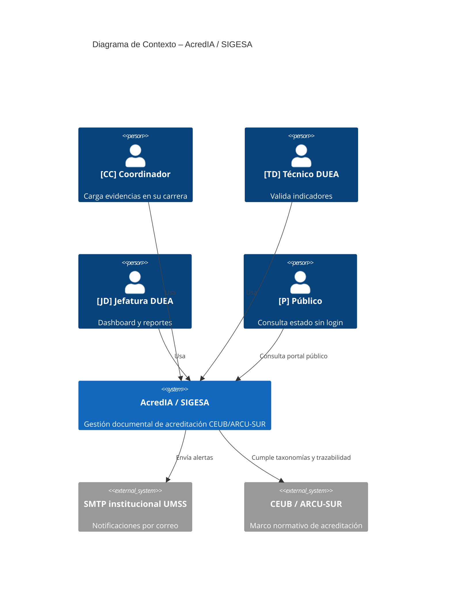
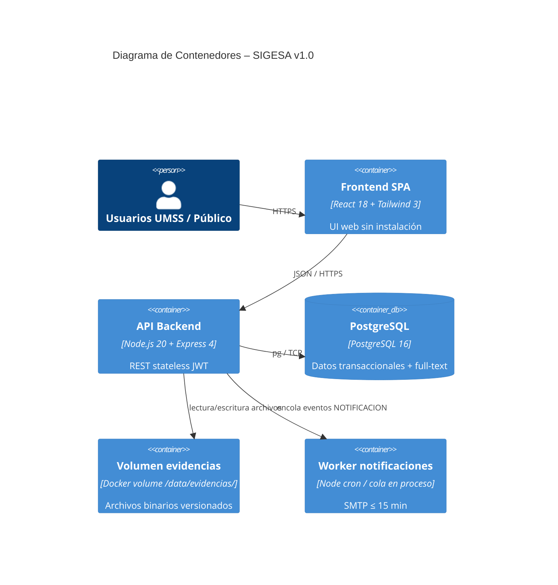
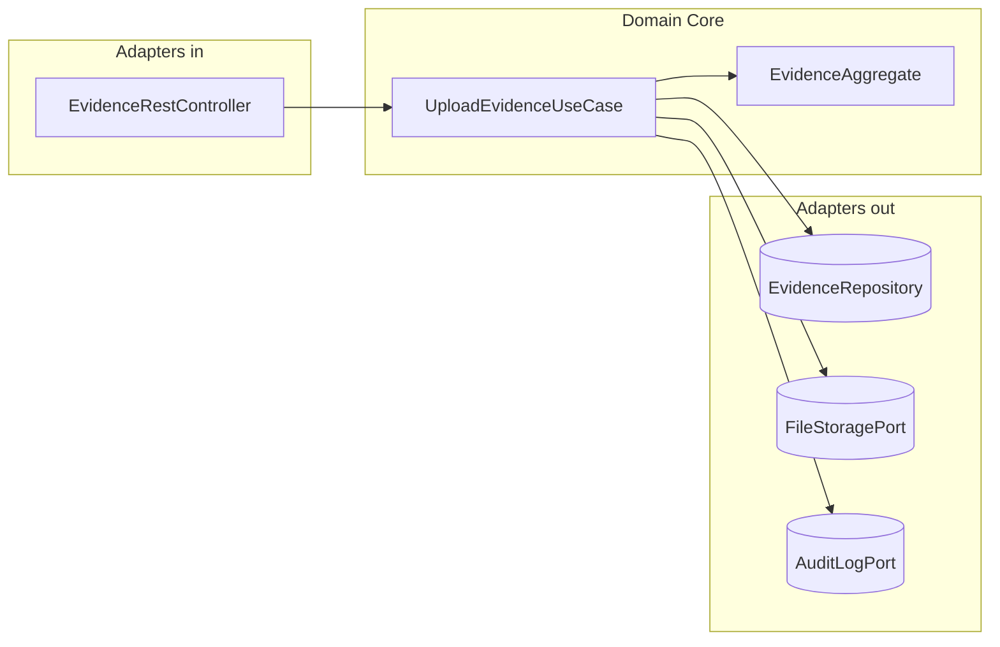
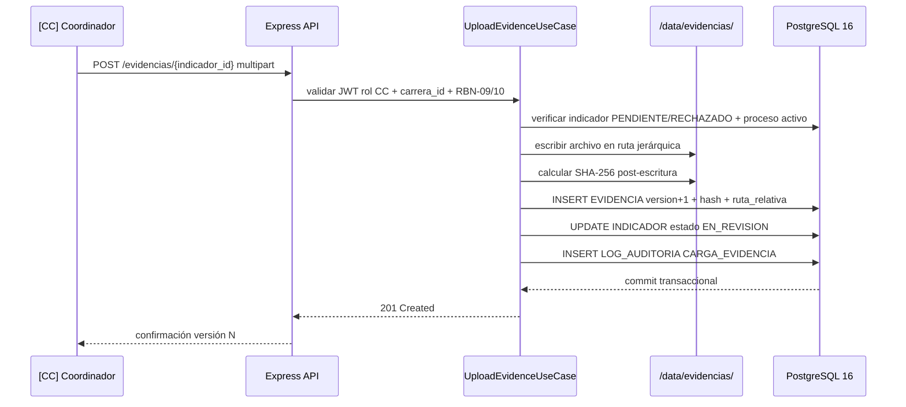
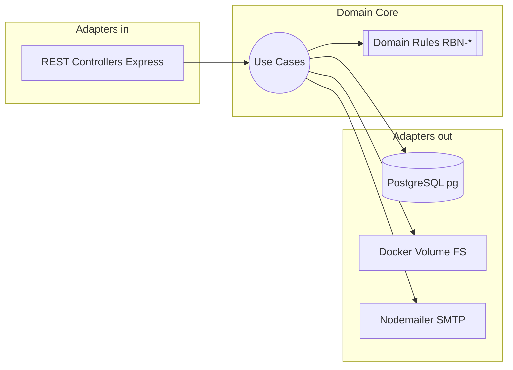
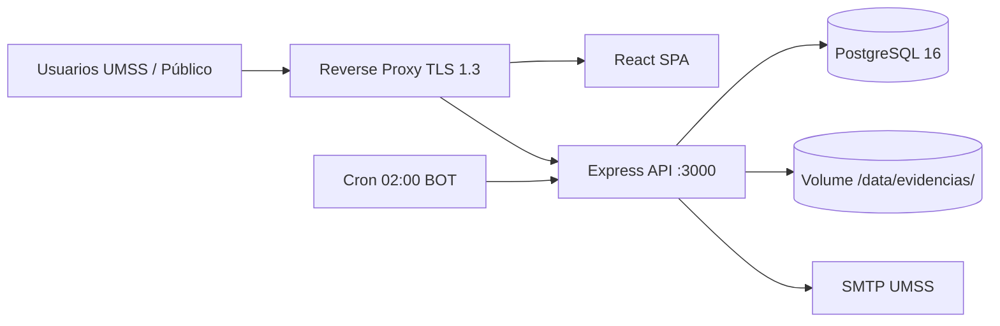
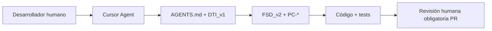

# Documento Técnico Inicial del Producto (DTI) — AcredIA / SIGESA v1.0

> **Propósito**: contrato técnico inicial del producto AcredIA / SIGESA. Legible por ingenieros humanos y agentes de IA.  
> **Audiencia dual**: arquitectos, desarrolladores, QA, product managers; Cursor Agent y agentes del equipo.  
> **Regla de oro**: si una decisión arquitectónica significativa no está aquí o en un ADR referenciado, no existe.

---

## 0. Metadatos

| Campo | Valor |
|-------|-------|
| **Producto** | AcredIA / SIGESA — Sistema Inteligente de Gestión y Seguimiento de Acreditaciones |
| **Grupo** | AcredIA (`team/aylenGonzales`) |
| **Versión** | v1.0 |
| **Fecha** | 16/05/2026 |
| **Arquitecto responsable** | Aylen Mariangel Gonzales Alvino |
| **Stakeholders** | Jefatura DUEA [JD] · Técnicos DUEA [TD] · Coordinadores de Carrera [CC] · TI UMSS · CEUB / ARCU-SUR (cumplimiento normativo) · Público [P] |
| **Estado** | En revisión |
| **Repositorio** | `sigesa-docs` (documentación) / repositorio de implementación por definir |
| **Enlace al BRD** | `team/aylenGonzales/01_brd/BRD_v2_aylen.md` |
| **Enlace al MRD** | `team/aylenGonzales/02_mrd/MRD_v1.md` |
| **Enlace al PRD** | `team/aylenGonzales/03_prd/PRD_v1.md` |
| **Enlace al FSD** | `team/aylenGonzales/04_fsd/FSD_v2.md` |
| **Enlace a `AGENTS.md`** | `team/aylenGonzales/10_agents/AGENTS.md` |
| **Enlace a `PROMPT_MAPPING.md`** | `PROMPT_MAPPING.md` (raíz del repositorio) |

---

## 1. Visión del Producto (1 página)

- **Problema**: la DUEA-UMSS gestiona acreditaciones CEUB y ARCU-SUR con Excel, correo, WhatsApp y pendrives. Los técnicos invierten **20+ minutos** por sesión buscando la versión final de un documento; la jefatura carece de visibilidad gerencial en tiempo real (BRD §3.1, PRD §1).
- **Usuarios objetivo**: [CC] Coordinador de Carrera, [TD] Técnico DUEA, [JD] Jefatura DUEA, [JC] Jefe de Carrera, [EE] Evaluador externo (lectura acotada), [P] público sin autenticación (FSD_v2 §3).
- **Propuesta de valor**: sistema web único que centraliza evidencias versionadas por indicador, automatiza aprobación/rechazo con trazabilidad, expone dashboard semaforizado y genera reportes PDF internos en **≤ 5 minutos**, con taxonomías CEUB/ARCU-SUR nativas en BD (ADR-005, PRD §1).
- **Métricas de éxito del producto**:
  - **North Star**: % de procesos activos con evidencias críticas trazables y al día — **meta ≥ 80 %** (PRD OP-04, BRD §1).
  - **Secundarias**:
    - Tiempo de búsqueda de documento — **≤ 2 min** (OP-01, BR-008).
    - Incidentes de pérdida documental por gestión — **0** (OP-02, BR-002).
    - Tiempo de generación de reporte ejecutivo — **≤ 5 min** (OP-03, BR-004).
    - % eventos críticos notificados en **≤ 15 min** — **100 %** (OP-07, RBN-08).
- **Restricciones de negocio**: solo correos `@umss.edu.bo` (RB-06); evidencias aprobadas no eliminables (RB-04, RBN-02); reportes ejecutivos uso interno con marca de agua (RB-07, RBN-11); presupuesto infraestructura **$0** en servicios cloud de pago en v1.0 (SA-05, ADR-001); piloto Q3–Q4 2026.

---

## 2. Contexto del Sistema

### 2.1 Diagrama C4 – Nivel 1 (Contexto)

### 2.2 Actores externos y dependencias

| Actor / Sistema | Tipo | Dirección | Criticidad |
|-----------------|------|-----------|------------|
| SMTP institucional UMSS | externo | salida | alta (RBN-08, BR-005) |
| Servidor / VPS institucional con Docker | externo | hospedaje | alta (SA-05) |
| CEUB / ARCU-SUR (normativa) | externo | restricciones de negocio | alta (BR-007, ADR-005) |
| TI UMSS (políticas, capacidad disco ≥ 500 GB) | externo | gobierno | alta (SA-03) |
| IdP / SSO UMSS | externo | entrada | baja en v1.0 — no disponible (ADR-004) |

---

## 3. Arquitectura de Alto Nivel

### 3.1 Estilo arquitectónico adoptado

- [x] **Monolito modular** (SPA + API REST + PostgreSQL + volumen de archivos)
- [x] **Hexagonal / Clean** en el núcleo de dominio (`src/domain/`)

> **Justificación**: el dominio exige invariantes estrictas (RBN-01…15), log append-only (ADR-002), versionado de evidencias (ADR-001) y taxonomías configurables (ADR-005). Un monolito Docker con capas hexagonales permite time-to-market Q4 2026 con equipo ~4 desarrolladores, sin operar microservicios ni AWS en v1.0. El frontend React y el backend Node 20 + Express 4 comparten ecosistema npm (ADR-006).

> **ADR**: `team/aylenGonzales/09_dti/adr/ADR-006.md` (runtime); decisiones de persistencia, auth, evidencias y taxonomías en ADR-001…005.

### 3.2 Diagrama C4 – Nivel 2 (Contenedores)

### 3.3 Diagrama C4 – Nivel 3 (Componentes) — módulo crítico MOD-02

Módulo crítico: **repositorio de evidencias y versionado** (FSD-UC-002, ADR-001).

### 3.4 Data Flow Diagram — FSD-UC-002 (carga y versionado de evidencias)

---

## 4. Modelo de Dominio

### 4.1 Bounded Contexts

| Contexto | Responsabilidad | Entidades principales | Integración |
|----------|-----------------|----------------------|-------------|
| **Identidad y acceso** | AuthN JWT, RBAC, dominio @umss.edu.bo | USUARIO | síncrona — transversal |
| **Evidencias** | Carga, versionado, hash, descarga segura | EVIDENCIA, INDICADOR | síncrona + volumen Docker |
| **Proceso de acreditación** | Procesos CEUB/ARCU-SUR, fases, cierre condicional | PROCESO_ACREDITACION, FASE, INDICADOR | síncrona |
| **Aprobación** | Aprobar/rechazar indicadores, justificación | INDICADOR, EVIDENCIA | síncrona + LOG_AUDITORIA |
| **Notificaciones** | Cola SMTP, SLA 15 min | NOTIFICACION | async en proceso (cola BD) |
| **Auditoría** | Log append-only | LOG_AUDITORIA | síncrona en misma transacción |
| **Portal público** | Consulta sin JWT | PROCESO_ACREDITACION (vista reducida) | síncrona lectura |

### 4.2 Entidades, Value Objects y Aggregates

| Tipo | Nombre | Invariantes | Ciclo de vida |
|------|--------|-------------|---------------|
| Aggregate Root | **PROCESO_ACREDITACION** | Un solo proceso activo por tipo/carrera/periodo (RBN-05); ARCU-SUR requiere CEUB vigente (RBN-13) | CREATED → ACTIVO → CERRADO |
| Entity | **FASE** | Plazos no editables por usuarios (RBN-06); cierre solo si indicadores APROBADO (RBN-04) | PENDIENTE → ACTIVA → CERRADA |
| Entity | **INDICADOR** | Estados: PENDIENTE, EN_REVISION, APROBADO, RECHAZADO | transiciones vía [TD] |
| Aggregate Root | **EVIDENCIA** | `indicador_id` obligatorio; version incremental; hash SHA-256 post-escritura; aprobada no eliminable | versionado append-only |
| Entity | **USUARIO** | correo @umss.edu.bo; rol RBAC; CC ligado a `carrera_id` | activo/inactivo |
| Value Object | **HashSHA256** | 64 caracteres hex; calculado sobre archivo en disco | inmutable |
| Entity | **LOG_AUDITORIA** | append-only; sin DELETE/UPDATE para `sigesa_app` (RBN-07) | solo INSERT |

### 4.3 DTOs principales

| DTO | Uso (capa) | Campos clave | Mapeo a entidad |
|-----|------------|--------------|-----------------|
| `LoginRequestDTO` | API → App | `correo`, `password` | USUARIO |
| `JwtPayloadDTO` | API → App | `user_id`, `rol`, `carrera_id`, `exp` | claims JWT (ADR-004) |
| `UploadEvidenceDTO` | API → App | `indicador_id`, `archivo`, `descripcion` | EVIDENCIA |
| `RejectIndicatorDTO` | API → App | `justificacion` (≥ 20 chars) | INDICADOR + EVIDENCIA.observacion_td |
| `DashboardItemDTO` | App → API | `carrera_id`, `avance_pct`, `semaforo` | agregado consulta SQL |
| `PublicCareerStatusDTO` | API → [P] | `carrera`, `estado_acreditacion`, `fecha_resolucion` | vista sin PII interna |

---

## 5. Arquitectura Hexagonal del core

### 5.1 Puertos (Ports)

| Puerto | Tipo | Definido en | Propósito |
|--------|------|-------------|-----------|
| `AuthenticateUserUseCase` | input | `domain/port/in` | Login JWT + dominio UMSS (FSD-UC-001) |
| `UploadEvidenceUseCase` | input | `domain/port/in` | Carga versionada + hash (FSD-UC-002) |
| `ApproveRejectIndicatorUseCase` | input | `domain/port/in` | Flujo TD (FSD-UC-003) |
| `UserRepository` | output | `domain/port/out` | Persistencia USUARIO |
| `EvidenceRepository` | output | `domain/port/out` | Metadatos EVIDENCIA |
| `FileStoragePort` | output | `domain/port/out` | Volumen `/data/evidencias/` (ADR-001) |
| `AuditLogPort` | output | `domain/port/out` | INSERT LOG_AUDITORIA (ADR-002) |
| `NotificationPort` | output | `domain/port/out` | Encolar NOTIFICACION / SMTP |

### 5.2 Adaptadores (Adapters)

| Adaptador | Implementa | Tecnología | Ubicación |
|-----------|-----------|------------|-----------|
| `AuthController` | `AuthenticateUserUseCase` | Express 4 + `jsonwebtoken` | `adapter/in/http` |
| `EvidenceController` | `UploadEvidenceUseCase` | Express + `multer` | `adapter/in/http` |
| `PgUserRepository` | `UserRepository` | `pg` / node-pg | `adapter/out/persistence` |
| `DockerVolumeFileStorage` | `FileStoragePort` | `fs` + `crypto` | `adapter/out/storage` |
| `PgAuditLogAdapter` | `AuditLogPort` | PostgreSQL 16 | `adapter/out/persistence` |
| `SmtpNotificationAdapter` | `NotificationPort` | Nodemailer 6.x | `adapter/out/messaging` |

### 5.3 Diagrama de puertos y adaptadores

---

## 6. Arquitectura Distribuida

**No aplica microservicios en v1.0.** SIGESA se despliega como **monolito modular** en Docker Compose (FSD §2.3, ADR-006). La única separación lógica es el worker de notificaciones en el mismo runtime o contenedor sidecar ligero.

| Componente | Responsabilidad | Datos propios | API |
|------------|-----------------|---------------|-----|
| `sigesa-api` | Toda la lógica REST v1.0 | PostgreSQL 16 | REST `/api/v1/*` |
| `sigesa-web` | SPA React | ninguno (stateless) | estático + proxy a API |

---

## 7. Arquitectura Asíncrona / Event-Driven

**Alcance limitado en v1.0:** cola de notificaciones en tabla `NOTIFICACION` procesada por worker/cron; no hay broker Kafka/SQS.

### 7.1 Catálogo de eventos (dominio / cola)

| Evento | Productor | Consumidor | Payload | Garantía |
|--------|-----------|------------|---------|----------|
| `INDICADOR_RECHAZADO` | MOD-03 | MOD-07 (SMTP) | `indicador_id`, `justificacion`, `destinatario_cc` | al menos una vez + reintento ×3 |
| `EVIDENCIA_CARGADA` | MOD-02 | MOD-07 | `evidencia_id`, `indicador_id` | al menos una vez |
| `LOGIN_FALLIDO_BLOQUEO` | MOD-01 | MOD-07 | `usuario_id`, `ip_origen` | al menos una vez |
| `RESPALDO_FALLIDO` | MOD-12 | MOD-07 → [JD] | `fecha`, `error` | al menos una vez |

### 7.2 Flujos de larga duración

No hay sagas distribuidas en v1.0. El flujo crítico de carga de evidencia es **transacción única** en PostgreSQL + escritura en volumen (PC-002, FSD-UC-002).

---

## 8. Despliegue — Entorno institucional (Docker)

**No aplica AWS en v1.0** (restricción SA-05, presupuesto $0). Despliegue objetivo: servidor institucional UMSS o VPS con Docker 25 + Docker Compose.

### 8.1 Mapeo de componentes a infraestructura

| Componente | Implementación v1.0 | Justificación |
|------------|-------------------|---------------|
| Frontend | Contenedor `nginx` o `node` sirviendo build React | SPA estática |
| API | Contenedor `node:20-alpine` + Express 4 | ADR-006 |
| Base de datos | Contenedor `postgres:16` | ADR-003 |
| Evidencias | Named volume `evidencias_data` → `/data/evidencias/` | ADR-001 |
| TLS | Reverse proxy institucional (nginx/Traefik) TLS 1.3 | NFR-003 |
| Monitoreo | Prometheus + cAdvisor (opcional piloto) | NFR-002, NFR-005 |

### 8.2 Diagrama de despliegue

### 8.3 Entornos

| Entorno | Propósito | Datos |
|---------|-----------|-------|
| **dev** | desarrollo local `docker compose up` | seeds `TEST_*` |
| **stg** | QA / piloto DUEA | datos anonimizados institucionales |
| **prd** | producción piloto UMSS | datos reales DUEA |

### 8.4 Estrategia de Disaster Recovery

- **RPO objetivo**: ≤ 24 h (respaldo diario 02:00 BOT, RBN-14, NFR-013).
- **RTO objetivo**: ≤ 4 h (restauración manual `pg_restore` + volumen evidencias, FSD-UC-010).
- **Estrategia**: Backup-Restore — `pg_dump` + `tar` del volumen evidencias; confirmación por correo a [JD] ante fallo.

---

## 9. Capa de IA / Agentes

### 9.1 Arquitectura agéntica

- **Tipo**: multi-agente supervisado por humano ([TD], [JD]) — ver `team/aylenGonzales/10_agents/AGENTS.md`.
- **Modelos**: Cursor Agent / Composer en desarrollo documental; sin modelo en producción para dictámenes en v1.0 (RBN-15).

### 9.2 Agentes del sistema

| Agente | Rol | Herramientas | Guardrails | Observabilidad |
|--------|-----|--------------|------------|----------------|
| `@DevAgent` | Implementación MOD-01…12 | read, edit, run-tests | No ADR sin aprobación; stack ADR-006 | PR + CI |
| `@ArchAgent` | Infra, BD, Docker | read, edit, terraform plan | No apply prod sin humano | ADR + diagramas |
| `@QaAgent` | TC-001…010 | read, edit, run-tests | No modificar `src/domain/` | Jest, Playwright, k6 |
| `@ProductAgent` | Docs y trazabilidad | read, edit | Solo carpetas 00–08 | matriz_trazabilidad |

### 9.3 RAG y memoria

**No aplica RAG en v1.0 productivo.** Las sugerencias IA futuras (v2.0) requerirán DPIA institucional UMSS antes de indexar documentos identificables (AGENTS raíz §7, RBN-15).

### 9.4 Diagrama de la capa IA (desarrollo)

---

## 10. Estrategia de Prompt Mapping

Documento canónico: `PROMPT_MAPPING.md`. Trazabilidad de artefactos del equipo en PM-021…PM-031.

| Artefacto | Prompts asociados | IDs |
|-----------|-------------------|-----|
| FSD_v2 §7 PC-001…004 | Generación contratos UC críticos | PM-022 |
| ADR-006 backend | Spike Node vs FastAPI | PM-026 |
| `08_trazabilidad/` | Matriz + métricas AI-SDLC | PM-028, PM-029 |
| `10_agents/AGENTS.md` | Guía agentes equipo | PM-030 |
| `09_dti/DTI_v1.md` | Contrato técnico inicial | PM-031 |
| Prompt-contratos PC-005…010 | `04_fsd/prompt-contracts.md` | PM-018 |

**Guardrails IA (v1.0):** RBN-15 — no aprobar/rechazar indicadores de forma autónoma; no modificar LOG_AUDITORIA; no hardcodear taxonomías CEUB (ADR-005).

---

## 11. NFRs Consolidados (espejo de FSD §10)

| ID | Categoría | Umbral aceptable | Verificación |
|----|-----------|------------------|--------------|
| NFR-001 | Rendimiento | p95 dashboard/buscador ≤ 3 000 ms (50 VUs) | k6 (TC-007, TC-010) |
| NFR-002 | Recursos | CPU < 80 % con 3 PDF paralelos | Prometheus + cAdvisor |
| NFR-003 | Seguridad | 100 % endpoints HTTPS TLS 1.3 | OWASP ZAP |
| NFR-004 | No repudio | ≥ 95 % eventos críticos en LOG_AUDITORIA | tests integración |
| NFR-005 | Disponibilidad | uptime ≥ 99 % lun–vie 07:00–22:00 BOT | UptimeRobot |
| NFR-006 | Tolerancia fallos | core disponible si falla PDF | TC-008 |
| NFR-007 | Usabilidad | carga evidencia ≤ 5 min usuario nuevo | test 3 [CC] |
| NFR-008 | Accesibilidad | 0 violaciones WCAG 2.2 A en componentes prioritarios | axe-core |
| NFR-009 | Mantenibilidad | cobertura backend ≥ 80 % | Jest + SonarQube |
| NFR-010 | Interoperabilidad | ≥ 95 % SMTP/PDF dentro de SLA | logs cola |
| NFR-011 | Notificaciones | ≤ 15 min evento → correo | TC-009 |
| NFR-012 | Integridad log | 100 % DELETE/UPDATE bloqueados | TC-006 |
| NFR-013 | Recuperabilidad | 1 respaldo/día verificable | FSD-UC-010, TC-011 pendiente |

Detalle extendido: `team/aylenGonzales/06_nfr/NFR-ISO25010.md`.

---

## 12. POCs Críticas

### 12.1 POC-01: Spike backend Node.js 20 + Express 4 vs FastAPI

- **Riesgo que mitiga**: bloqueo de T-01/T-02 y bifurcación de stack (FSD §2.3).
- **Hipótesis**: Express permite bootstrap Docker + JWT + multipart en ≤ 2 días para el equipo actual.
- **Criterio de éxito**: health check + PostgreSQL + JWT RBAC + upload SHA-256 operativos.
- **Resultado**: ✅ **Aceptada** — ADR-006; FastAPI descartado en v1.0.

### 12.2 POC-02: Inmutabilidad LOG_AUDITORIA (REVOKE)

- **Riesgo que mitiga**: auditoría CEUB/ARCU-SUR no demostrable (RBN-07, BR-009).
- **Hipótesis**: `REVOKE DELETE, UPDATE ON LOG_AUDITORIA FROM sigesa_app` bloquea mutaciones.
- **Criterio de éxito**: TC-006 — UPDATE falla con `permission denied`.
- **Alcance**: script SQL + test integración en contenedor PostgreSQL 16.
- **Resultado**: ✅ Validado en diseño — ADR-002; implementación en T-11.

---

## 13. Seguridad

| Tema | Decisión SIGESA v1.0 |
|------|---------------------|
| **Amenazas (STRIDE resumido)** | Suplantación (JWT robado) → TTL 24h + HTTPS; Repudio → LOG_AUDITORIA; Elevación → RBAC; Divulgación → no servir `/data/evidencias/` sin JWT |
| **AuthN / AuthZ** | JWT stateless + RBAC en claims; solo `@umss.edu.bo` (ADR-004) |
| **Secretos** | variables de entorno; prohibido en repo y prompts (P-S01) |
| **Datos en tránsito/reposo** | TLS 1.3; AES-256 en servidor institucional (NFR-003) |
| **Cumplimiento** | Ley 164 Bolivia (PII mínima en portal [P]); soberanía datos UMSS |
| **IA** | sin dictamen autónomo (RBN-15); revisión [TD]/[JD] obligatoria |

---

## 14. Observabilidad

- **Logs**: JSON estructurado con `correlationId`, `usuario_id`, `accion`; **prohibido** registrar passwords, JWT completos ni hashes SHA-256 de archivos.
- **Métricas**: latencia p95 endpoints críticos; cola NOTIFICACION; ocupación disco volumen evidencias (alerta 70 %, RF-04).
- **Trazas**: OpenTelemetry recomendado en v1.1; v1.0 — logs + métricas Prometheus opcionales.
- **IA-SDLC**: `metricas_ai_sdlc.md` — Prompt Coverage 100 %, Spec Fidelity 88,24 %, Decision Coverage 50 %.

---

## 15. DevOps y ciclo de vida

- **Branching**: `main` protegida; feature branches `feat/FSD-UC-xxx-descripcion`.
- **CI/CD**: lint + `npm test` + cobertura ≥ 80 % + Playwright smoke en PR.
- **Testing**: pirámide Jest (unit/integration) + Playwright E2E + k6 carga (FSD §12).
- **Releases**: tags semánticos; piloto Q3–Q4 2026.
- **Feature flags**: RBN-15 (IA dictamen) desactivado en v1.0.
- **Rollback**: `docker compose` imagen anterior + restore BD solo con ventana aprobada [JD].

---

## 16. Antipatrones auditados

| Antipatrón | ¿Se detectó? | Mitigación |
|------------|--------------|------------|
| Archivos en BYTEA PostgreSQL | evitado | ADR-001 volumen Docker |
| Big Ball of Mud | riesgo medio | hexagonal + MOD-01…12 |
| God Service | riesgo medio | límite responsabilidad por controlador/use case |
| Taxonomías hardcodeadas | evitado | ADR-005 configuración BD |
| Servir evidencias como static files | evitado | descarga vía API + JWT |
| Dictamen IA sin humano | evitado | RBN-15 |

---

## 17. Trade-offs arquitectónicos

| Decisión | Elegida | Descartada | Razón | Consecuencia |
|----------|---------|------------|-------|--------------|
| Almacenamiento evidencias | Volumen Docker local | S3 v1.0 | $0, time-to-market | Migración manual v2.0 |
| Backend runtime | Node 20 + Express 4 | FastAPI v1.0 | ADR-006 spike | OpenAPI manual |
| Autenticación | JWT stateless | Keycloak / sesiones | Sin IdP UMSS v1.0 | Revocación con blocklist |
| BD | PostgreSQL 16 | MongoDB | ACID + full-text + REVOKE | Un solo motor |
| Taxonomías | Tablas BD [JD] | Hardcode | ADR-005 normativa cambiante | Seeds iniciales DUEA |
| Despliegue | Docker institucional | AWS | SA-05 presupuesto | Ops manual TI UMSS |

---

## 18. Riesgos técnicos

| Riesgo | Prob. | Impacto | Mitigación | Contingencia |
|--------|-------|---------|------------|--------------|
| RF-02 CPU PDF | Media | Alto | cola máx. 3 paralelos | degradar MOD-06 |
| RF-03 SMTP caído | Media | Alto | reintento ×3 + alerta [JD] | canal alternativo manual |
| RF-04 disco lleno | Media | Crítico | alerta 70 % | pausar cargas + TI UMSS |
| RF-05 cambio normativa CEUB | Media | Alto | ADR-005 BD | seed nueva VERSION_NORMATIVA |
| Sin SSO institucional | Alta | Medio | JWT propio ADR-004 | federación v2.0 |

---

## 19. Roadmap técnico

| Fase | Entregable | Fecha objetivo |
|------|------------|----------------|
| **Ahora** | DTI v1.0 + ADR-001…006 + AGENTS.md | Mayo 2026 |
| **T-01…T-03** | Docker Compose + JWT + esquema PostgreSQL | Sprint 1 |
| **T-04…T-08** | Evidencias, aprobación, dashboard, PDF | Sprint 2–3 |
| **T-09…T-12** | Buscador, auditoría, portal, respaldos | Sprint 4 |
| **Piloto** | Despliegue DUEA 12 facultades | Q3–Q4 2026 |
| **v2.0** | PRD-REQ-016/017, S3, SSO, IA asistida con DPIA | 2027 |

---

## 20. Glosario y referencias

| Término | Definición |
|---------|------------|
| **SIGESA** | Sistema Inteligente de Gestión y Seguimiento de Acreditaciones |
| **DUEA** | Dirección Universitaria de Evaluación y Acreditación — UMSS |
| **CEUB / ARCU-SUR** | Organismos de acreditación nacional e internacional |
| **RBN-*** | Reglas de negocio normativas en FSD_v2 §5 |
| **PC-*** | Prompt-contratos para agentes IA (FSD §7 + prompt-contracts.md) |

**Referencias**: FSD_v2.md · PRD_v1.md · BRD_v2_aylen.md · ISO/IEC 25010 · C4 Model · ADR-001…006 · `AGENTS.md` · `PROMPT_MAPPING.md`.

---

## 21. Registro de decisiones arquitectónicas (ADR)

| ADR | Título | Estado | Fecha |
|-----|--------|--------|-------|
| ADR-001 | Almacenamiento evidencias volumen Docker `/data/evidencias/` | Aceptada | 14/05/2026 |
| ADR-002 | LOG_AUDITORIA append-only PostgreSQL | Aceptada | 14/05/2026 |
| ADR-003 | PostgreSQL 16 como BD principal | Aceptada | 16/05/2026 |
| ADR-004 | JWT stateless + RBAC @umss.edu.bo | Aceptada | 16/05/2026 |
| ADR-005 | Taxonomías CEUB/ARCU-SUR en BD | Aceptada | 16/05/2026 |
| ADR-006 | Node.js 20 + Express 4 backend | Aceptada | 16/05/2026 |

Rutas: `team/aylenGonzales/09_dti/adr/ADR-00N.md`.

---

## Checklist de entrega del DTI

- [x] Visión del producto + métricas de éxito
- [x] Diagramas C4 niveles 1, 2 y 3 (MOD-02)
- [x] Data flow FSD-UC-002
- [x] Modelo de dominio (bounded contexts, entidades, DTOs)
- [x] Arquitectura hexagonal (puertos y adaptadores)
- [x] N/A microservicios — monolito documentado §6
- [x] Despliegue Docker institucional (no AWS) §8
- [x] Capa IA / agentes §9
- [x] NFRs con umbrales §11
- [x] 2 POCs críticas §12
- [x] Seguridad, observabilidad, DevOps §13–15
- [x] Antipatrones y trade-offs §16–17
- [x] 6 ADRs registradas §21
- [x] `AGENTS.md` — §2 sincronizado con este DTI (PM-031)
- [x] `PROMPT_MAPPING.md` — entrada PM-031
