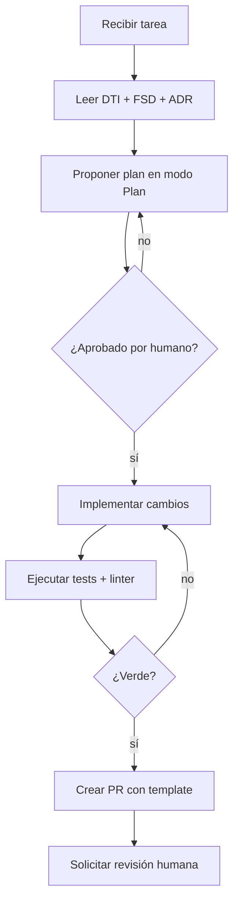

# AGENTS.md — AcredIA / SIGESA (aylenGonzales)

> Convención de la industria: README para agentes de IA del equipo. Ruta canónica del equipo: `team/aylenGonzales/10_agents/AGENTS.md`.  
> Sincronizar con `09_dti/DTI_v1.md` (cuando se publique), `04_fsd/FSD_v2.md` y `09_dti/adr/` en el mismo commit si cambia el stack o las reglas invariantes.

---

## 1. Identidad del producto

| Campo | Valor |
|-------|-------|
| **Nombre** | AcredIA / SIGESA |
| **Grupo** | AcredIA |
| **Dominio** | EdTech / GovTech universitario (acreditación CEUB y ARCU-SUR) |
| **Resumen** | Sistema web de gestión documental de acreditaciones universitarias para la Dirección Universitaria de Evaluación y Acreditación (DUEA) de la UMSS. |
| **DTI** | `team/aylenGonzales/09_dti/DTI_v1.md` *(ruta canónica; vigente hasta publicación: FSD_v2 §2–§3 + ADR-001…006)* |
| **FSD** | `team/aylenGonzales/04_fsd/FSD_v2.md` |
| **PROMPT_MAPPING** | `PROMPT_MAPPING.md` (raíz del repositorio) |
| **Trazabilidad** | `team/aylenGonzales/08_trazabilidad/matriz_trazabilidad.md` |
| **Métricas AI-SDLC** | `team/aylenGonzales/08_trazabilidad/metricas_ai_sdlc.md` |

---

## 2. Contexto que el agente MUST leer antes de actuar

Al comenzar cualquier tarea, el agente **MUST** leer en este orden:

1. `team/aylenGonzales/09_dti/DTI_v1.md` — **§0 Metadatos** (referencias BRD/PRD/FSD/ADR); **§1 Visión del Producto** (problema, métricas North Star, restricciones UMSS); **§2 Contexto del Sistema** (diagrama C4 N1 §2.1, dependencias SMTP/TI §2.2); **§3 Arquitectura de Alto Nivel** (estilo hexagonal §3.1, contenedores Docker §3.2, DFD FSD-UC-002 §3.4); **§4 Modelo de Dominio** (bounded contexts §4.1, aggregates EVIDENCIA/PROCESO §4.2); **§5 Arquitectura Hexagonal** (puertos y adaptadores §5.1–5.2).
2. El **FSD-UC-*** correspondiente al caso de uso tocado en `team/aylenGonzales/04_fsd/FSD_v2.md` §4 (y `04_fsd/casos-de-uso.md` si se requiere detalle extendido de UC-008…010).
3. `team/aylenGonzales/09_dti/adr/` — ADR-001 a ADR-006 (alineado con DTI_v1 §21).
4. `PROMPT_MAPPING.md` — entradas PM-021 a PM-031 y contratos PC del proyecto.
5. `team/aylenGonzales/08_trazabilidad/matriz_trazabilidad.md` — para no romper trazabilidad MRD → PRD → FSD.
6. `team/aylenGonzales/01_brd/BRD_v2_aylen.md` y `team/aylenGonzales/03_prd/PRD_v1.md` cuando la tarea afecte reglas de negocio (BR-*, RB-*) o requisitos (PRD-REQ-*).

---

## 3. Estructura del repositorio

Estructura real del equipo **aylenGonzales** (documentación AI-SDLC):

```text
team/aylenGonzales/
├── 00_context/
│   └── 02_vision_negocio_v2.md
├── 01_brd/
│   └── BRD_v2_aylen.md
├── 02_mrd/
│   └── MRD_v1.md
├── 03_prd/
│   └── PRD_v1.md
├── 04_fsd/
│   ├── casos-de-uso.md          ← UC extendidos (008–010)
│   ├── FSD_v1.md
│   ├── FSD_v2.md                ← FSD canónico v2.0
│   ├── glossary.md
│   └── prompt-contracts.md      ← PC-005…010 (complemento §7 FSD_v2)
├── 05_lfsd/
│   └── LFSD_v1_aylen.md
├── 06_nfr/
│   └── NFR-ISO25010.md
├── 07_diagramas/                ← Mermaid (ER, secuencia, estados, Gantt)
├── 08_trazabilidad/
│   ├── matriz_trazabilidad.md
│   └── metricas_ai_sdlc.md
├── 09_dti/
│   └── adr/
│       ├── ADR-001.md          ← evidencias volumen Docker
│       ├── ADR-002.md          ← LOG_AUDITORIA append-only
│       ├── ADR-003.md          ← PostgreSQL 16
│       ├── ADR-004.md          ← JWT + RBAC
│       ├── ADR-005.md          ← taxonomías CEUB/ARCU-SUR en BD
│       └── ADR-006.md          ← Node.js 20 + Express 4
└── 10_agents/
    └── AGENTS.md                ← este archivo
```

> Los ADRs **no** están bajo `04_fsd/adr/`; la ruta autoritativa es `09_dti/adr/`.

Código de aplicación (cuando exista en el repo de implementación):

```text
src/
├── domain/              ← entidades, agregados, puertos (MUST NOT importar adaptadores)
├── application/         ← casos de uso
└── adapter/
    ├── in/              ← HTTP, controllers Express
    └── out/             ← PostgreSQL, volumen /data/evidencias/, SMTP
tests/
├── unit/
├── integration/
└── e2e/
```

---

## 4. Stack tecnológico autoritativo

| Capa | Tecnología | Versión | ADR / fuente |
|------|------------|---------|--------------|
| Frontend | React + Tailwind CSS | React 18 / Tailwind 3 | FSD_v2 §2.3 |
| Backend | **Node.js + Express** | Node 20 LTS / Express 4.x | **ADR-006** (spike cerrado; FastAPI descartado en v1.0) |
| Base de datos | PostgreSQL | 16 | ADR-003 |
| Almacenamiento evidencias | Volumen Docker `/data/evidencias/` | — | ADR-001 |
| Autenticación | JWT stateless + refresh token + RBAC | TTL access 24 h | ADR-004 |
| Motor reportes PDF | PDFKit | 0.15.x | ADR-006, FSD_v2 §2.3 |
| Notificaciones | Nodemailer + SMTP institucional UMSS | 6.x | ADR-006, FSD_v2 §2.3 |
| Migraciones BD | Knex o node-pg-migrate | según ADR-006 | T-03 (rama Node) |
| Containerización | Docker + Docker Compose | Docker 25 | FSD_v2 §2.3 |
| Testing | Jest + Supertest + Playwright + k6 | — | FSD_v2 §12 |

El agente **MUST NOT** introducir dependencias fuera de esta tabla (p. ej. MongoDB, S3 en v1.0, Keycloak, Redis obligatorio) sin crear un **nuevo ADR** en `09_dti/adr/` y obtener aprobación humana del Tech Lead.

El agente **MUST NOT** asumir Python/FastAPI ni ReportLab: la decisión v1.0 es **Node.js 20 + Express 4** (ADR-006).

---

## 5. Convenciones de código

- **Idioma del código**: inglés.
- **Idioma de la documentación**: español (UMSS / DUEA).
- **Estilo**: ESLint + Prettier (frontend/backend); convenciones del proyecto al inicializar el monorepo (T-01).
- **Naming**: clases `PascalCase`, métodos y variables `camelCase`, constantes `UPPER_SNAKE_CASE`.
- **Arquitectura**: hexagonal. El dominio en `src/domain/` **MUST NOT** importar de `adapter/` ni de frameworks (Express, `pg`, etc.).
- **Commits**: [Conventional Commits](https://www.conventionalcommits.org/) — `feat:`, `fix:`, `docs:`, `refactor:`, `test:`, `chore:`.
- **Tamaño máximo de PR**: 400 líneas netas. PRs mayores **MUST** dividirse.

**Actores en UI y docs** (FSD / BRD): usar notación institucional `[CC]`, `[TD]`, `[JD]`, `[P]` — no sinónimos en inglés visibles al usuario final (`Reviewer`, `Admin`).

---

## 6. Reglas de dominio invariantes

Reglas derivadas de **RBN-*** (FSD_v2 §5) y **BR-*** / **RB-*** (BRD_v2_aylen). Ningún cambio puede violarlas sin revisión explícita del Tech Lead o [JD].

### Autenticación y acceso

- **MUST**: validar dominio `@umss.edu.bo` antes de autenticar (RBN-01, RB-06, ADR-004).
- **MUST NOT**: admitir correos personales ni generar JWT para usuarios sin rol asignado (FSD-UC-001).
- **MUST**: aplicar RBAC por claims JWT (`rol`, `carrera_id`) en cada endpoint privado (ADR-004).

### Evidencias y versionado

- **MUST**: calcular hash **SHA-256 sobre el archivo ya escrito en disco**, no solo sobre el buffer en memoria (RBN-02, ADR-001, TC-003).
- **MUST**: asociar cada evidencia a `indicador_id` y proceso; no existe carga huérfana (RBN-10, BR-015).
- **MUST**: permitir carga de evidencias solo al [CC] designado para la carrera (RBN-09, RB-02).
- **MUST NOT**: eliminar físicamente documentos en estado aprobado; solo versionar (RBN-02, RB-004, RB-04).

### Flujo de aprobación

- **MUST**: exigir justificación ≥ 20 caracteres en todo rechazo de indicador (RBN-03, FSD-UC-003).
- **MUST NOT**: cerrar subfase si quedan indicadores pendientes (RBN-04, RB-03).
- **MUST NOT**: aprobar o rechazar indicadores de forma autónoma sin supervisión humana [TD]/[JD] (RBN-15, RB-11).

### Procesos y normativa

- **MUST NOT**: permitir más de un proceso activo del mismo tipo (CEUB/ARCU-SUR) por carrera y periodo (RBN-05, BR-013, FSD-UC-011).
- **MUST**: validar acreditación CEUB vigente antes de iniciar proceso ARCU-SUR (RBN-13, RB-01).
- **MUST**: mantener taxonomías CEUB/ARCU-SUR en BD, editables solo por [JD] (ADR-005); **MUST NOT** hardcodear fases en código fuente.

### Auditoría y operación

- **MUST NOT**: permitir `DELETE` ni `UPDATE` sobre `LOG_AUDITORIA` con rol `sigesa_app` (RBN-07, ADR-002).
- **MUST**: registrar evento en `LOG_AUDITORIA` en la misma transacción (o flujo atómico) de cada acción crítica: carga, aprobación, rechazo, login, emisión certificado, consulta pública.
- **MUST**: enviar notificaciones críticas en ≤ 15 minutos (RBN-08, BR-005).
- **MUST**: ejecutar respaldo automático diario 02:00 BOT con confirmación ante fallo (RBN-14, BR-012, FSD-UC-010).

### Archivos y reportes

- **MUST NOT**: exponer archivos bajo `/data/evidencias/` directamente por URL estática; solo vía API con validación JWT y RBAC (ADR-001).
- **MUST**: aplicar marca de agua `USO INTERNO DUEA-UMSS` en reportes ejecutivos PDF internos (RBN-11, RB-07).
- **MUST NOT**: exponer en portal público [P] datos del expediente interno, hashes, rutas ni justificaciones de rechazo (FSD-UC-008).

---

## 7. Seguridad y privacidad

| Control | Requisito | Fuente |
|---------|-----------|--------|
| Cifrado en tránsito | TLS 1.3 obligatorio en todos los endpoints | NFR-003, ADR-004 |
| Cifrado en reposo | AES-256 para datos sensibles en servidor institucional | NFR-003 |
| Dominio institucional | Solo `@umss.edu.bo` | RB-06, RBN-01 |
| Secretos | Variables de entorno / secret manager institucional; **MUST NOT** en código, logs ni prompts | P-S01 AGENTS raíz |
| Logs de aplicación | **MUST NOT** registrar passwords, tokens JWT completos ni hashes SHA-256 de archivos | ADR-001, ADR-004 |
| Portal público | **MUST NOT** exponer correos institucionales ni PII en responses públicas | FSD-UC-008 |
| Bloqueo cuenta | 3 intentos fallidos → bloqueo 15 min | FSD-UC-001, ADR-004 |
| Cumplimiento | Datos institucionales UMSS; revisión DPIA institucional antes de modelos cloud con PII | AGENTS.md raíz §7 |

---

## 8. Capacidades y guardrails de agentes

### 8.1 Agentes permitidos en este repo

| Agente | Propósito | Herramientas | Límites |
|--------|-----------|--------------|---------|
| `@DevAgent` | Implementar módulos MOD-01 a MOD-12, tasks T-01 a T-12 | `read`, `edit`, `run-tests` | **MUST NOT** modificar `09_dti/adr/` sin ADR nuevo; **MUST NOT** cambiar stack sin ADR-006+ |
| `@ArchAgent` | Infraestructura, BD, Docker, diagramas técnicos | `read`, `edit`, `terraform plan` | **MUST NOT** `terraform apply` / despliegue prod sin aprobación humana |
| `@QaAgent` | Plan de pruebas TC-001 a TC-010 (+ TC-011 respaldo) | `read`, `edit`, `run-tests` | Solo `tests/`; **MUST NOT** modificar `src/domain/` |
| `@ProductAgent` | Documentación, trazabilidad, matrices | `read`, `edit` | Solo `00_context/` … `08_trazabilidad/`, `04_fsd/`, `10_agents/` |

### 8.2 Guardrails generales

- **MUST** ejecutar `npm test` (y `npm run test:e2e` si aplica) y verificar verde antes de proponer un PR.
- **MUST** ejecutar `npm run lint` y corregir warnings nuevos introducidos.
- **MUST NOT** realizar `force push` ni reescribir historia en `main` sin permiso explícito.
- **MUST NOT** modificar migraciones ya aplicadas en `main` (Knex/node-pg-migrate).
- **MUST** crear o actualizar tests por cada **FSD-UC** tocado.
- **MUST** actualizar el ADR correspondiente si cambia una decisión arquitectónica aceptada.
- **MUST** citar `FSD-UC-*`, `PRD-REQ-*` y `TC-*` en descripción del PR.
- **MUST** leer **ADR-006** antes de cualquier código backend; stack v1.0 = Node + Express únicamente.

### 8.3 Módulos funcionales (referencia rápida)

| Módulo | FSD-UC principal | Agente típico |
|--------|------------------|---------------|
| MOD-01 Auth | FSD-UC-001 | @DevAgent |
| MOD-02 Evidencias | FSD-UC-002 | @DevAgent |
| MOD-03 Aprobación | FSD-UC-003 | @DevAgent |
| MOD-04 Fases/procesos | FSD-UC-003, 004, 011 | @DevAgent |
| MOD-05 Dashboard | FSD-UC-004 | @DevAgent |
| MOD-06 Reportes PDF | FSD-UC-005 | @DevAgent |
| MOD-07 Notificaciones | FSD-UC-006 | @DevAgent |
| MOD-08 Buscador | FSD-UC-007 | @DevAgent |
| MOD-09 Auditoría | Transversal | @ArchAgent |
| MOD-10 Portal público | FSD-UC-008 | @DevAgent |
| MOD-11 Certificados | FSD-UC-009 | @DevAgent |
| MOD-12 Respaldos | FSD-UC-010 | @ArchAgent + @DevAgent |

---

## 9. Flujo de trabajo estándar para un agente



---

## 10. Template de prompt-contrato reutilizable

Cuando el agente ejecute un caso de uso crítico, **MUST** invocar usando esta anatomía. Ejemplo canónico: **PC-001** (autenticación) en `team/aylenGonzales/04_fsd/FSD_v2.md` §7.

```markdown
# Role
Eres un arquitecto de seguridad senior especializado en sistemas web institucionales con autenticación JWT y RBAC para universidades bolivianas (UMSS / DUEA).

# Task
Especifica o implementa el comportamiento del módulo de autenticación SIGESA: validación de dominio @umss.edu.bo, JWT con claims (rol, carrera_id), refresh token, bloqueo por 3 intentos fallidos y registro en LOG_AUDITORIA.

# Context
- Documentos: FSD-UC-001, ADR-004, RBN-01, NFR-003, NFR-004
- Restricciones: solo @umss.edu.bo; JWT 24 h; bloqueo 15 min; eventos LOGIN/LOGOUT/FAIL en LOG_AUDITORIA

# Reasoning
1. Validar formato y dominio del correo antes de consultar BD.
2. Verificar credenciales (bcrypt) y rol asignado.
3. Emitir JWT + refresh token; registrar LOGIN con ip_origen.
4. En fallos: incrementar intentos_fallidos; bloquear al tercer intento.

# Stop condition
Detente cuando: endpoints /auth/login, /auth/refresh, /auth/logout están especificados o implementados con tests TC-001 y TC-002 en verde, e invariantes de dominio cubiertos.

# Output
JSON o código según PC-001: jwt_payload, endpoints, invariants, failure_modes (AUTH-001…005), acceptance_criteria_gherkin → FSD-UC-001 §4.
```

Contratos adicionales: `FSD_v2.md` §7 (PC-001–004) y `04_fsd/prompt-contracts.md` (PC-005–010).

---

## 11. Prompts prohibidos / patrones a rechazar

El agente **MUST** rechazar y reportar cuando una instrucción:

- Pide desactivar pruebas o linters.
- Pide almacenar secretos, passwords o tokens en código o en el repositorio.
- Pide saltar revisión humana en transiciones de estado de indicadores o cierre de subfase.
- Pide modificar ADR-001…006 ya **Aceptada** sin abrir ADR nuevo que la supersede.
- Pide **aprobar o rechazar indicadores** de acreditación de forma autónoma (viola RBN-15).
- Pide **modificar taxonomías CEUB/ARCU-SUR** sin resolución documentada de la Jefa DUEA [JD] (viola ADR-005).
- Pide **eliminar o actualizar filas** de `LOG_AUDITORIA` (viola RBN-07, ADR-002).
- Pide **hardcodear fases o indicadores** de acreditación en código fuente en lugar de configuración en BD (viola ADR-005).
- Pide servir `/data/evidencias/` como carpeta pública del servidor web.
- Pide introducir **FastAPI/Python** o dependencias cloud de pago en v1.0 sin ADR.

---

## 12. Comandos de verificación locales

Stack autoritativo: **Node.js 20 + Express** (ADR-006).

```bash
# Dependencias (monorepo)
npm ci

# Tests unitarios e integración
npm test

# Tests E2E (cuando estén configurados)
npm run test:e2e

# Linter
npm run lint

# Build frontend + backend
npm run build

# Entorno local completo (API + PostgreSQL 16 + volumen evidencias)
docker compose up -d

# Verificar permisos append-only en LOG_AUDITORIA (ADR-002)
docker compose exec postgres psql -U postgres -d sigesa -c "\z LOG_AUDITORIA"

# Prueba de carga (dashboard / buscador — TC-007, TC-010)
k6 run tests/load/dashboard.js
```

---

## 13. Métricas y observabilidad esperadas del agente

Umbrales alineados a `team/aylenGonzales/08_trazabilidad/metricas_ai_sdlc.md` y FSD_v2 §10 (NFR):

| Métrica | Umbral objetivo | Valor baseline (mayo 2026) | Fuente |
|---------|-----------------|---------------------------|--------|
| **prompt_coverage** (FSD-UC con PC) | ≥ 80 % | **100 %** (10/10 UC con PC-001…010) | metricas_ai_sdlc §1 |
| **spec_fidelity** (PRD-REQ trazable a FSD-UC) | ≥ 95 % | **88,24 %** (15/17; 016–017 backlog v2.0) | metricas_ai_sdlc §2 |
| **decision_coverage** (RF-* con ADR) | ≥ 80 % | **50 %** (3/6 RF; mejorar RF-01, 03, 06) | metricas_ai_sdlc §3 |
| **chain_completeness** MRD→FSD | 100 % filas MRD | **100 %** (12/12) | matriz_trazabilidad §1 |
| Hallucination rate en PRs del agente | < 5 % | monitoreo trimestral | AGENTS raíz |
| Reverts por PRs del agente | < 10 % mensual | monitoreo trimestral | AGENTS raíz |
| **Uptime** horario hábil | ≥ 99 % | NFR-005 | FSD_v2 NFR-005 |
| Cobertura tests backend | ≥ 80 % líneas/módulo | NFR-009, FSD §12 | Jest + cobertura CI |

El agente **MUST** declarar en el PR si su cambio mejora o reduce alguna métrica.

---

## 14. Contacto y escalamiento

| Rol | Contacto |
|-----|----------|
| **Responsable técnica** | Aylen Mariangel Gonzales Alvino |
| **Docente / revisor** | M.Sc. Edson Ariel Terceros Torrico |
| **Escalamiento normativo / producto** | Jefatura DUEA [JD] para taxonomías, reportes externos y políticas RB-07 |
| **Escalamiento arquitectura** | Tech Lead AcredIA antes de merge a rama principal |

---

## 15. Registro de cambios de este AGENTS.md

| Versión | Fecha | Autor | Cambio |
|---------|-------|-------|--------|
| v1.0 | 16/05/2026 | Equipo AcredIA / Aylen Gonzales | Versión inicial del equipo en `10_agents/AGENTS.md` según plantilla y ADR-001…006 |

---

## Checklist de validez

- [x] Alineado con FSD_v2 §2.3 y ADR-001…006 (sin spike pendiente).
- [x] Sin secretos en texto plano.
- [x] Stack Node 20 + Express 4 documentado (no FastAPI).
- [x] Guardrails y reglas RBN/BR/RB referenciadas.
- [x] Sin placeholders `<…>` sin completar.
- [ ] Sincronizado con `09_dti/DTI_v1.md` cuando se publique el DTI del equipo.
- [ ] Revisado por Tech Lead / docente antes de release del piloto Q3–Q4 2026.
