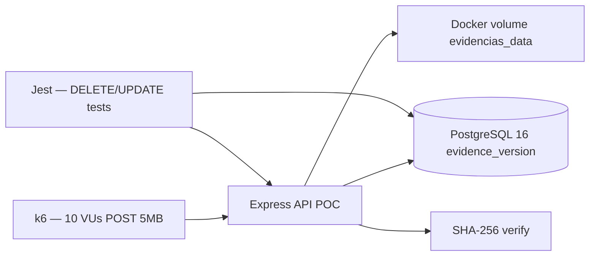

# POC-01: Inmutabilidad append-only de Evidencia (metadatos + blobs)

### 0. Metadatos

| Campo | Valor |
|-------|-------|
| ID | `POC-01` |
| Título | Inmutabilidad append-only de Evidencia (PostgreSQL + volumen Docker) |
| Grupo | AcredIA |
| Responsable(s) | **borisAngulo** (dominio Evidencia / FSD-UC-003); co-autoría **aylenGonzales** (ADR-001 origen) |
| Fecha de inicio | 16/05/2026 |
| Fecha objetivo de cierre | 20/05/2026 |
| Estado | Propuesta |
| ADR relacionado | [ADR-0001](../../../docs/adr/ADR-0001-append-only-evidence-storage.md) · [ADR-0004](../../../docs/adr/ADR-0004-evidence-blob-storage-docker.md) |

---

### 1. Riesgo que mitiga

SIGESA debe demostrar ante CEUB/ARCU-SUR que las **Evidencias aprobadas no pueden alterarse ni borrarse** (solo nuevas versiones por subsanación). La documentación asume este modelo pero **no lo valida en un prototipo integrado**:

| Señal en docs | Incertidumbre |
|---------------|---------------|
| `team/borisAngulo/docs/01_brd/BRD_v2.md` — BRD-CST-01, BR-006/007 | ¿`REVOKE DELETE` en BD + API `409` bloquean el 100 % de intentos maliciosos o erróneos? |
| `team/borisAngulo/docs/04_fsd/casos-de-uso.md` — CU-005, CU-006 | ¿Carga + nueva versión + hash SHA-256 cumplen latencia con archivos hasta 5 MB? |
| `team/aylenGonzales/09_dti/adr/ADR-001.md` (→ ADR-0004 repo) | ¿El volumen Docker preserva integridad si la app intenta sobrescribir rutas? |
| `docs/adr/ADR-0001-append-only-evidence-storage.md` | Decisión **Propuesta** en repo canónico — requiere evidencia experimental |

**Riesgo central:** si falla la combinación **metadatos append-only + almacenamiento de blobs + reglas de API**, el piloto UMSS pierde valor probatorio ante auditoría externa.

---

### 2. Hipótesis

> *Creemos que el patrón **`evidence_version` solo INSERT + REVOKE DELETE/UPDATE en PostgreSQL + escritura de blobs en volumen Docker con nombre versionado** permitirá **rechazar el 100 % de intentos de borrado o sobrescritura** sobre versiones en estado `APROBADA` y **completar carga + hash SHA-256** de un PDF de 5 MB en **≤ 5 s p95** con **10 cargas concurrentes** en entorno Docker local.*

---

### 3. Criterio de éxito medible (SMART)

| Métrica | Descripción | Umbral éxito | Umbral fracaso |
|---------|-------------|--------------|----------------|
| **M1 — Inmutabilidad BD** | `DELETE`/`UPDATE` sobre `evidence_version` con rol `sigesa_app` tras marcar fila `APROBADA` | **0** filas modificadas/eliminadas en 100 intentos automatizados | ≥ 1 fila alterada |
| **M2 — API rechazo** | `DELETE /evidences/{id}` sobre evidencia aprobada | **100 %** respuestas HTTP **409** + código `EVIDENCE_IMMUTABLE` | < 100 % o código distinto |
| **M3 — Integridad blob** | Tras carga, hash SHA-256 en BD coincide con archivo en disco; segundo `PUT` a misma ruta versionada | **100 %** coincidencia; **0** sobrescrituras in-place detectadas | Cualquier hash divergente o archivo reemplazado sin nueva versión |
| **M4 — Latencia carga** | `POST /evidences` multipart 5 MB (PDF sintético) | **p95 ≤ 5 000 ms** (alineado `team/aylenGonzales/06_nfr/NFR-ISO25010.md` NFR-001) | **p95 > 5 000 ms** |

**Condiciones de prueba (de NFR-001 aylen):** datos sintéticos — 10 carreras, 50 procesos, ≥ 200 evidencias de prueba; no requiere datos reales UMSS.

---

### 4. Alcance reducido (time-boxed)

**Duración máxima:** 4 días.

**Incluye:**

- Esquema mínimo: `evidence`, `evidence_version` (estados `BORRADOR` / `APROBADA`), `supersedes_id`.
- Script DDL con `REVOKE DELETE, UPDATE ON evidence_version FROM sigesa_app`.
- API mínima Node.js 20 + Express 4 (`POST` carga, `DELETE` prueba, `POST` nueva versión).
- Volumen Docker `evidencias_data` montado en `/data/evidencias/...`.
- Suite de tests de integración (Jest + supertest) + script que intenta `DELETE`/`UPDATE` con rol aplicación.
- 10 cargas concurrentes con k6 o Artillery sobre `POST /evidences`.

**Excluye explícitamente:**

- UI React, autenticación LDAP, notificaciones SMTP.
- Portal público, reportes PDF, búsqueda full-text.
- Cifrado AES-256 en reposo (solo hash SHA-256 en tránsito de cálculo).
- Integración SIIS / multi-nodo / S3.

---

### 5. Diseño de la prueba

#### 5.1 Stack usado

| Componente | Tecnología | Versión |
|------------|------------|---------|
| API | Node.js + Express | 20 LTS / 4.x |
| ORM / SQL | `pg` o Prisma | según spike equipo |
| BD | PostgreSQL | 16 |
| Blobs | Volumen Docker local | `evidencias_data` |
| Hash | `crypto` (SHA-256) | nativo Node |
| Carga concurrente | k6 | última estable |
| Contenedores | Docker Compose | 3 servicios: `api`, `db`, `volume` |

#### 5.2 Arquitectura de la POC

#### 5.3 Datos de prueba

- **Origen:** sintéticos.
- **Volumen:** 200 evidencias × 1–3 versiones; 50 PDFs de 5 MB generados (`dd`/random).
- **Sesgos:** sin OCR ni metadatos reales de carrera; solo valida inmutabilidad y performance de I/O local.

#### 5.4 Procedimiento experimental

1. Levantar `docker compose up` (PG + API + volumen).
2. Aplicar migraciones y `REVOKE` sobre `evidence_version`.
3. Sembrar 10 procesos / 200 indicadores ficticios.
4. **M1/M2:** aprobar evidencia vía API; ejecutar 100 intentos `DELETE`/`UPDATE` con usuario `sigesa_app`; registrar resultados.
5. **M3:** cargar versión v1; calcular hash; intentar escribir otro archivo en misma ruta; verificar que API crea v2 con nueva ruta, no sobrescribe v1.
6. **M4:** k6 — 10 VUs, 3 min, `POST` 5 MB; capturar p95.
7. Repetir pasos 4–6 **2 veces** en días distintos; reportar mediana.

---

### 6. Entorno

- **Local / contenedores:** Docker Compose en máquina dev (Windows/Linux).
- **Recursos:** 4 vCPU, 8 GB RAM (mínimo recomendado en `team/aylenGonzales/09_dti/DTI_v1.md` piloto ~150 usuarios; POC reduce carga).
- **Costo estimado:** **USD 0** (solo tiempo equipo; sin cloud).

---

### 7. Herramientas de medición

- **k6** — latencia y tasa de error en carga.
- **Jest + supertest** — contratos API 409 / 201.
- **Scripts SQL** — verificación `\z evidence_version` y intentos explícitos `DELETE`.
- **Logs estructurados** (JSON) en `evidencia/` — cada corrida con timestamp.

---

### 8. Plan de ejecución

| Día | Actividad | Responsable |
|-----|-----------|-------------|
| 1 | Setup Compose, DDL, REVOKE, seed sintético | borisAngulo |
| 2 | Implementación API mínima + tests inmutabilidad (M1, M2, M3) | borisAngulo |
| 3 | k6 carga concurrente (M4); captura logs y métricas | borisAngulo |
| 4 | Análisis, tabla §9, veredicto §10, commit evidencia/ | borisAngulo + aylenGonzales |

---

### 9. Resultados

> Completar **al finalizar** la POC.

#### 9.1 Tabla de métricas

| Métrica | Valor obtenido | Umbral éxito | Veredicto |
|---------|----------------|--------------|-----------|
| M1 — Inmutabilidad BD | | 0 filas alteradas | |
| M2 — API 409 | | 100 % | |
| M3 — Hash / sin overwrite | | 100 % | |
| M4 — p95 carga 5 MB | | ≤ 5 000 ms | |

#### 9.2 Gráficos / capturas

- Enlaces a `evidencia/` (logs k6, salida Jest, `\z` PostgreSQL).

---

### 10. Conclusiones y veredicto

- **Veredicto:** *(pendiente)*
- **Justificación:** *(pendiente)*
- **Próximos pasos:**
  - Si éxito → confirmar ADR-0001/0004 como **Aceptado**; alinear `ddl_sigesa_append_only.sql`.
  - Si parcial → POC-01b con PgBouncer o límites de tamaño distintos.
  - Si fracaso → revisar WORM/S3 o capa de storage inmutable.

---

### 11. Aprendizajes (*lessons learned*)

- *(pendiente ejecución)*

---

### 12. Riesgos remanentes

- Comportamiento bajo **superusuario** `postgres` (bypass REVOKE) — mitigación operativa UMSS, no cubierto.
- **Corrupción de volumen** por acceso SSH al host — fuera de alcance API.
- **Rendimiento** con 1 000+ evidencias y FTS en mismo host (ver POC-02).

---

### 13. Referencias

- `team/borisAngulo/docs/04_fsd/casos-de-uso.md` — CU-005, CU-006
- `team/borisAngulo/docs/09_dti/DTI_v1.md` — §4.3 módulo Evidencia
- `team/aylenGonzales/09_dti/adr/ADR-001.md` — almacenamiento blobs
- `team/aylenGonzales/06_nfr/NFR-ISO25010.md` — NFR-001 (carga ≤ 5 s p95)
- [ADR-0001](../../../docs/adr/ADR-0001-append-only-evidence-storage.md) · [ADR-0004](../../../docs/adr/ADR-0004-evidence-blob-storage-docker.md)

---

### 14. Historial

| Versión | Fecha | Autor | Cambio |
|---------|-------|-------|--------|
| 1 | 16/05/2026 | Equipo AcredIA | Creación propuesta POC-01 |

---

## Checklist de cierre de POC

- [x] Hipótesis y criterio de éxito declarados **antes** de ejecutar.
- [x] Alcance time-boxed respetado (diseño 4 días).
- [ ] Resultados numéricos con evidencia en `evidencia/`.
- [ ] Veredicto explícito (✅ / ⚠️ / ❌).
- [ ] Aprendizajes capturados.
- [ ] ADR creado o actualizado si la POC cambia una decisión arquitectónica.
