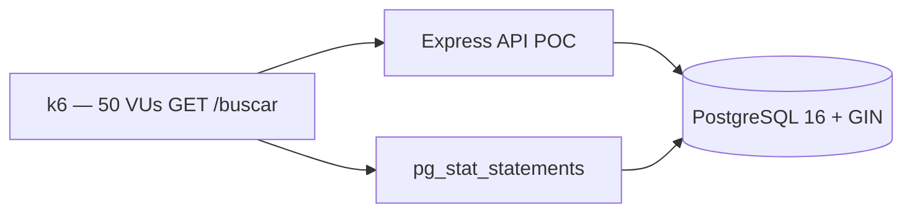

# POC-02: Búsqueda full-text de Evidencias en PostgreSQL 16

### 0. Metadatos

| Campo | Valor |
|-------|-------|
| ID | `POC-02` |
| Título | Búsqueda multifiltro con p95 ≤ 3 s (PostgreSQL GIN + tsvector) |
| Grupo | AcredIA |
| Responsable(s) | **aylenGonzales** (FSD-UC-007, NFR-001, ADR-003 equipo) |
| Fecha de inicio | 16/05/2026 |
| Fecha objetivo de cierre | 21/05/2026 |
| Estado | Propuesta |
| ADR relacionado | [ADR-0006](../../../docs/adr/ADR-0006-postgresql-16-primary-database.md) |

---

### 1. Riesgo que mitiga

El negocio exige localizar documentos de acreditación en **≤ 2 minutos** frente a **20+ minutos** hoy (`team/aylenGonzales/03_prd/PRD_v1.md` OP-01, KPI-01; `team/aylenGonzales/01_brd/BRD_v2_aylen.md` BRD-KPI-01). La arquitectura eligió **PostgreSQL 16 con índices GIN + `tsvector`** (`team/aylenGonzales/09_dti/adr/ADR-003.md` → [ADR-0006](../../../docs/adr/ADR-0006-postgresql-16-primary-database.md)), pero **no hay benchmark** que demuestre el umbral de rendimiento bajo carga piloto.

| Señal en docs | Incertidumbre |
|---------------|---------------|
| `team/aylenGonzales/06_nfr/NFR-ISO25010.md` — NFR-001 | ¿`GET /buscar` mantiene **p95 ≤ 3 000 ms** con 50 VUs y ~1 000 documentos? |
| `team/aylenGonzales/04_fsd/casos-de-uso.md` — FSD-UC-007 | ¿Filtros por carrera, facultad, gestión y texto libre escalan? |
| `team/borisAngulo/docs/06_nfr/nfr_iso25010.md` — NFR-001 | Misma métrica p95 < 3 000 ms en panel/búsqueda |
| `team/Marlene/03_prd/PRD.md` — NFR-P-01 | Búsqueda simple P95 ≤ 3 s bajo carga de prueba |
| `team/aylenGonzales/09_dti/DTI_v1.md` | PostgreSQL 16 como BD principal con FTS; sin prueba de carga documentada |

**Riesgo central:** si la búsqueda no cumple NFR bajo volumen piloto, el **North Star del producto** (localización rápida) falla y habría que replantear índices, caché o motor externo (Elastic) — impacto alto en costo y plazo Q4 2026.

---

### 2. Hipótesis

> *Creemos que **PostgreSQL 16** con columna `search_vector tsvector`, índice **GIN** y consultas `@@ plainto_tsquery('spanish', …)` permitirá que el endpoint **`GET /buscar`** alcance **p95 ≤ 3 000 ms** bajo **50 usuarios virtuales concurrentes** durante **5 minutos**, con dataset sintético de **1 000 evidencias** indexadas y filtros por `carrera_id`, `facultad_id` y `gestión`.*

---

### 3. Criterio de éxito medible (SMART)

| Métrica | Descripción | Umbral éxito | Umbral fracaso |
|---------|-------------|--------------|----------------|
| **M1 — Latencia búsqueda** | p95 de `GET /buscar?q=…&carrera_id=…` | **≤ 3 000 ms** | **> 3 000 ms** |
| **M2 — Tasa de error** | HTTP 5xx + timeouts | **< 1 %** de requests | **≥ 1 %** |
| **M3 — Exactitud funcional** | Top-20 resultados contienen término buscado en título o extracto | **≥ 95 %** de queries de prueba (muestra 50 queries) | **< 90 %** |
| **M4 — Recursos BD** | CPU PostgreSQL durante prueba | **< 85 %** sostenido | **≥ 95 %** (saturación) |

**Fuente umbrales:** `team/aylenGonzales/06_nfr/NFR-ISO25010.md` (NFR-001, condiciones 50 VU / 5 min / 1 000 docs); `team/aylenGonzales/03_prd/PRD_v1.md` (PRD-NFR-001 p95 ≤ 3 s).

---

### 4. Alcance reducido (time-boxed)

**Duración máxima:** 5 días.

**Incluye:**

- Tabla `evidence_search` o `evidence_version` con columnas: `titulo`, `extracto`, `carrera_id`, `facultad_id`, `gestion`, `search_vector`.
- Índice GIN sobre `search_vector`; índices B-tree en filtros.
- API mínima Express: `GET /buscar` con JWT mock (rol [CC] filtrado por carrera).
- Seed SQL: 1 000 filas sintéticas (español académico); extensión `unaccent` opcional si tiempo.
- Prueba k6: 50 VUs, 5 min, mix 70 % búsqueda textual + 30 % solo filtros.
- Captura `EXPLAIN (ANALYZE, BUFFERS)` para 5 queries representativas.

**Excluye:**

- UI React, ranking por relevancia avanzada, búsqueda semántica/embeddings.
- OCR de PDFs (solo metadatos ya extraídos en `extracto`).
- Réplica de lectura / PgBouncer (salvo que M1 fracase en día 4).
- Cluster multi-AZ.

---

### 5. Diseño de la prueba

#### 5.1 Stack usado

| Componente | Tecnología | Versión |
|------------|------------|---------|
| API | Node.js + Express | 20 LTS / 4.x |
| BD | PostgreSQL | 16 |
| FTS | `tsvector` + GIN + config `spanish` | PG built-in |
| Carga | k6 | última estable |
| Monitoreo | `pg_stat_statements` + `docker stats` | — |

#### 5.2 Arquitectura de la POC

#### 5.3 Datos de prueba

- **Origen:** sintético (generador script Node o `COPY` CSV).
- **Volumen:** 1 000 evidencias; 10 facultades × 10 carreras; gestiones 2024–2026.
- **Texto:** párrafos 200–500 caracteres con términos CEUB/ARCU-SUR (indicador, dimensión, autoevaluación).
- **Sesgos:** no incluye PDFs binarios reales; relevancia limitada a calidad de `extracto`.

#### 5.4 Procedimiento experimental

1. Crear esquema y seed 1 000 filas; `UPDATE` para poblar `search_vector := to_tsvector('spanish', titulo || ' ' || extracto)`.
2. `CREATE INDEX idx_evidence_search_gin ON … USING GIN(search_vector);` + índices btree filtros.
3. `VACUUM ANALYZE`.
4. Baseline: 50 queries manuales — medir latencia sin carga (p50, p95).
5. k6 — 50 VUs, 5 min, thresholds `p(95)<3000` y `http_req_failed rate<0.01`.
6. Durante carga: capturar CPU/RAM PG; exportar top 10 queries lentas.
7. Repetir corrida 2 veces; reportar mediana p95.
8. Muestra 50 queries — validar M3 (relevancia) manualmente o script.

---

### 6. Entorno

- **Local / contenedores:** Docker Compose (`db` + `api`); misma clase de VM que piloto DTI (4 vCPU / 8 GB mínimo).
- **Recursos:** PostgreSQL tunado mínimo (`shared_buffers` ~256MB para POC).
- **Costo estimado:** **USD 0**.

---

### 7. Herramientas de medición

- **k6** — p95, throughput, error rate (script alineado a snippet NFR-001 aylen).
- **PostgreSQL** — `EXPLAIN ANALYZE`, `pg_stat_statements`.
- **Grafana/Prometheus** (opcional día 3) — CPU/latencia.

---

### 8. Plan de ejecución

| Día | Actividad | Responsable |
|-----|-----------|-------------|
| 1 | Esquema, seed 1k, índices GIN, API `GET /buscar` | aylenGonzales |
| 2 | Baseline sin carga + ajuste queries / índices | aylenGonzales |
| 3 | k6 50 VU × 5 min (2 corridas) + captura métricas | aylenGonzales |
| 4 | Análisis EXPLAIN + M3 relevancia | aylenGonzales |
| 5 | Informe §9–§10, evidencia en `evidencia/` | aylenGonzales |

---

### 9. Resultados

> Completar **al finalizar** la POC.

#### 9.1 Tabla de métricas

| Métrica | Valor obtenido | Umbral éxito | Veredicto |
|---------|----------------|--------------|-----------|
| M1 — p95 búsqueda | | ≤ 3 000 ms | |
| M2 — Error rate | | < 1 % | |
| M3 — Relevancia | | ≥ 95 % | |
| M4 — CPU PG | | < 85 % | |

#### 9.2 Gráficos / capturas

- `evidencia/k6-summary.json`, `evidencia/explain-*.txt`, gráficos p95.

---

### 10. Conclusiones y veredicto

- **Veredicto:** *(pendiente)*
- **Justificación:** *(pendiente)*
- **Próximos pasos:**
  - Si éxito → ratificar ADR-0006; documentar índices en DTI.
  - Si parcial → POC-02b (PgBouncer, materialized view, o caché Redis 60 s según NFR-001).
  - Si fracaso → spike OpenSearch/Elastic o particionamiento (escalar costo).

---

### 11. Aprendizajes (*lessons learned*)

- *(pendiente ejecución)*

---

### 12. Riesgos remanentes

- Búsqueda en **contenido dentro de PDF** (no indexado en POC).
- Dataset **> 10 000** evidencias post-piloto institucional.
- Consultas con **acentos/errores ortográficos** sin `unaccent`/trigram.

---

### 13. Referencias

- `team/aylenGonzales/06_nfr/NFR-ISO25010.md` — NFR-001
- `team/aylenGonzales/04_fsd/casos-de-uso.md` — FSD-UC-007
- `team/aylenGonzales/03_prd/PRD_v1.md` — OP-01, PRD-US-015, PRD-NFR-001
- `team/borisAngulo/docs/09_dti/DTI_v1.md` — §8.2 k6 panel/evidencias
- [ADR-0006](../../../docs/adr/ADR-0006-postgresql-16-primary-database.md)
- [PostgreSQL Full Text Search](https://www.postgresql.org/docs/16/textsearch.html)

---

### 14. Historial

| Versión | Fecha | Autor | Cambio |
|---------|-------|-------|--------|
| 1 | 16/05/2026 | Equipo AcredIA | Creación propuesta POC-02 |

---

## Checklist de cierre de POC

- [x] Hipótesis y criterio de éxito declarados **antes** de ejecutar.
- [x] Alcance time-boxed respetado (diseño 5 días).
- [ ] Resultados numéricos con evidencia en `evidencia/`.
- [ ] Veredicto explícito (✅ / ⚠️ / ❌).
- [ ] Aprendizajes capturados.
- [ ] ADR actualizado si la POC confirma o refuta FTS en PostgreSQL.
