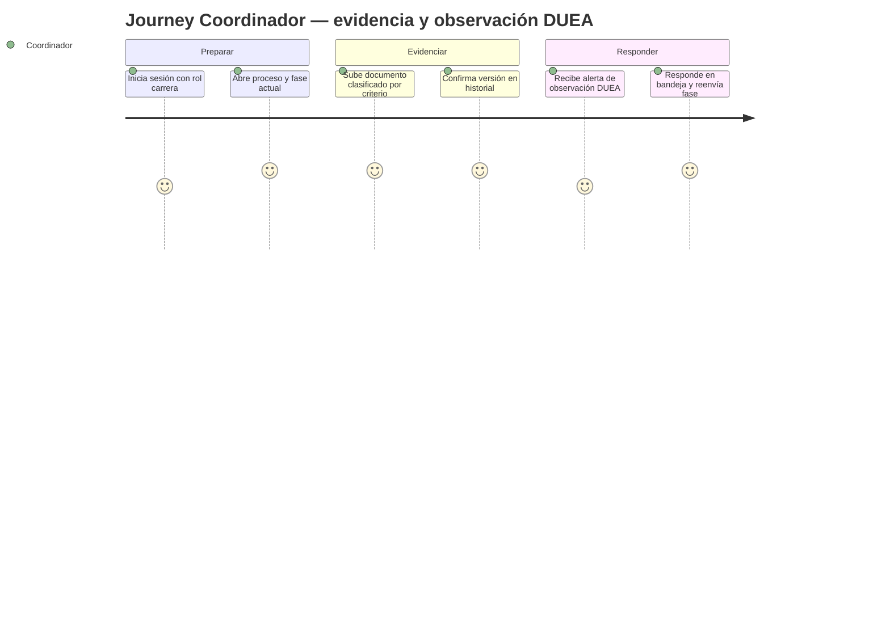
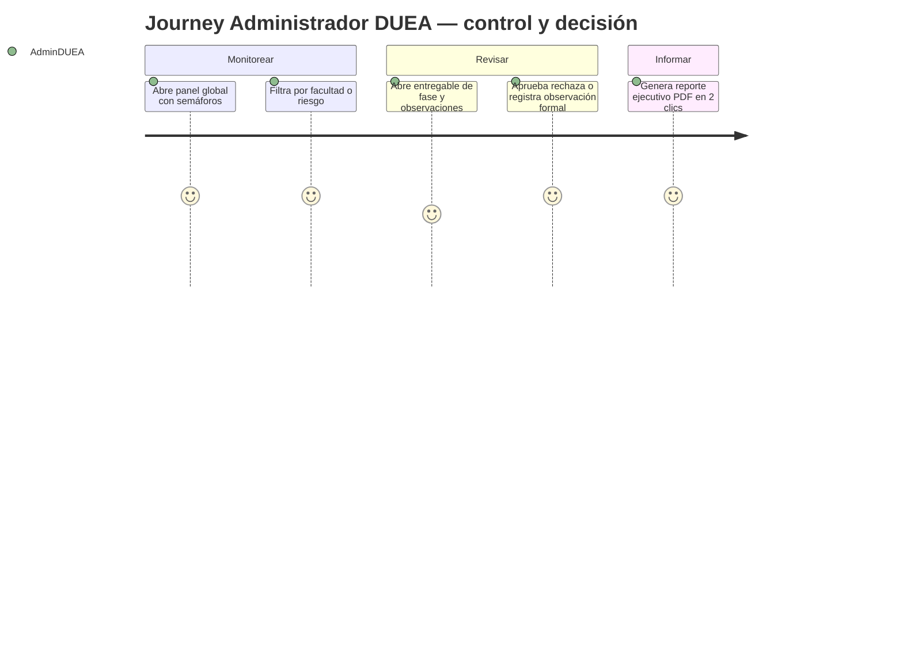

# Product Requirements Document (PRD) – SIGESA v1

> **Propósito del PRD**: describir **qué debe hacer el producto** para cumplir los requerimientos del MRD y BRD, con nivel suficiente para que diseño, ingeniería y QA puedan proceder. Responde a **"¿qué hace el producto?"** (no *cómo* lo hace).
>
> Audiencia: Product, Diseño (UX/UI), Ingeniería, QA.

---

## 0. Metadatos

| Campo | Valor |
|-------|-------|
| Producto | SIGESA — Sistema de Gestión de Evaluación y Acreditación |
| Grupo | AcredIA (`team/borisAngulo`) |
| Versión | v1.0 |
| Fecha | 11/05/2026 |
| Product Manager / Autor | Equipo AcredIA |
| Revisores | Docente + Tech Lead + QA |
| Estado | Borrador |
| BRD de referencia | `./team/borisAngulo/BRD_v2.md` (v2.0) |
| MRD de referencia | `./docs/mrd/MRD_v0.1.md` (por crear) |
| Insumos M2 (UI/UX) | Rutas por publicar: wireframes, mockups, journeys y casos de uso del Módulo 2 (vinculación en §11.1) |
| Fase Spec Kit cubierta | Specify ✅ / Plan ⬜ / Tasks ⬜ / Implement ⬜ |
| Prompts utilizados | PM-006 |

## 0.1 Constitution (opcional — Spec Kit)

> **Opcional**. Si el grupo aplica **Spec‑Driven Development con GitHub Spec Kit** (ver S04 §B7.2), declare aquí la *constitution* del proyecto: principios **no negociables** que cualquier decisión posterior debe respetar. Si no se aplica, deje vacío.

- **Principio 1**: Todo flujo crítico de evidencia (subir, versionar, observar) debe ser **trazable** (usuario, timestamp, vínculo a criterio y proceso) y **reversible solo** mediante reglas de negocio explícitas (no borrado silencioso).
- **Principio 2**: Ningún dato sensible de personas (PII) se expone en vistas de **público general** ni en logs de aplicación en claro; el cumplimiento de **Ley 164** es requisito de diseño.
- **Principio 3**: La interfaz prioriza **baja curva de aprendizaje** (lenguaje académico-administrativo, controles claros) sin sacrificar la **auditoría** ni la granularidad de permisos por rol.

> Estos principios funcionan como *invariantes a nivel de producto*: aparecerán como guardrails en los prompts del FSD y como criterios de auditoría en revisiones.

## 1. Resumen del producto

SIGESA responde a la fragmentación actual del ciclo de **evaluación y acreditación de carreras** en la UMSS (ARCU-SUR / CEUB): hojas de cálculo aisladas, correo, almacenamiento físico o removible y canales informales generan **duplicidad**, **pérdida de trazabilidad** y **retrasos** por falta de visibilidad única del avance. Los usuarios centrales son la **DUEA** (supervisión y observaciones formales), **jefatura y coordinación de carrera** (evidencias y cumplimiento de criterios), **técnicos operativos y de trámites** (precisión documental y constancias autorizadas), **evaluadores externos** con alcance acotado y el **público** para información no sensible. El producto ofrece **autenticación por roles**, **gestión de procesos y fases** (autoevaluación → resolución final), **actividades** con trazabilidad, **carga masiva** donde aplique, **evidencias versionadas** ligadas a criterios, **flujo de observaciones** DUEA–carrera, **panel con semáforo**, **alertas automáticas**, **reporte ejecutivo PDF en ≤ 2 clics** y, en versiones posteriores, reportes amplios y asistente informacional. El valor se mide en **cumplimiento de plazos**, **reducción de errores y retrabajo**, **metadatos completos en evidencias** y **satisfacción** de actores clave, alineado al BRD v2 y a la visión de negocio consolidada.

## 2. Objetivos del producto

Cada objetivo enlaza a un objetivo de negocio (BRD).

| ID | Objetivo del producto | BRD vinculado | Métrica | Meta |
|----|------------------------|---------------|---------|------|
| OP-01 | Permitir que toda acción sensible exija usuario autenticado con rol válido | BO-02 (trazabilidad) | % acciones sensibles con sesión válida | 100 % |
| OP-02 | Registrar procesos por carrera/facultad con fases y actividades trazables | BO-01 | % hitos a tiempo (piloto) | +20 pp vs. línea base |
| OP-03 | Versionar evidencias con autor, fecha e historial consultable | BO-02 | % evidencias con metadatos completos | ≥ 95 % en piloto |
| OP-04 | Visibilizar riesgo de incumplimiento (semáforo) y alertar plazos sin intervención manual por aviso | BO-01 | % alertas entregadas a tiempo (prueba) | ≥ 90 % |
| OP-05 | Generar reporte ejecutivo PDF desde el contexto de trabajo en ≤ 2 clics | BO-03 | clics en UAT | ≤ 2 |
| OP-06 | Ofrecer UX de baja curva (ofimática-like) y confirmación ante borrado irreversible de documentos | KPI-03 / satisfacción | tiempo tarea / errores | reducción ≥ 25 % vs. línea base (post‑piloto) |

## 3. Alcance (*Scope*)

### 3.1 Dentro del alcance (release v1.0)

- Autenticación y **autorización por roles** (administrador DUEA, jefe/coordinador, técnico operativo, técnico de trámites, evaluador externo acotado, público lectura).
- **Procesos** de acreditación por carrera y facultad con datos obligatorios (tipo, organismo, gestión, fechas).
- **Fases** de referencia con estados, observaciones y transiciones autorizadas: Autoevaluación → Documentación → Visita de pares → Informe externo → Resolución final.
- **Actividades** por fase con responsable y estado; **importación / planilla** para coordinador donde aplique.
- **Evidencias** vinculadas a **criterio** y proceso/fase; **historial de versiones** auditable; validación de datos obligatorios y mensajes claros.
- **Flujo de observaciones** entre DUEA y carrera (registro, respuesta, estados).
- **Panel** por carrera y facultad: etapa actual, % avance, fechas clave, **semáforo** verde/amarillo/rojo.
- **Alertas** automáticas por fechas límite e hitos (reglas configurables; disparo sin acción manual por cada recordatorio).
- **Reporte ejecutivo** en PDF con flujo de ≤ 2 clics desde panel o vista de carrera/facultad.
- **Bitácora de auditoría** de acciones relevantes (acceso según rol).
- **Vista pública** de información no sensible (estado de acreditación de carreras, datos institucionales acordados).

### 3.2 Fuera del alcance (backlog)

- **Pagos en línea** por certificaciones — *Won’t Have* versión actual (BRD §14.2).
- **Motor automático completo** de matrices de evaluación como única fuente de calificación — excluido; plantillas/vistas manuales evaluables aparte.
- **Generación automática de bitácoras legales** narrativas sin base en eventos reales — excluido; la auditoría por **eventos** sí está en alcance.
- **Chatbot informacional** y **reportes amplios PDF/Excel** — *Could*; planificados v1.1+ salvo decisión explícita de incluir en v1.0.

### 3.3 Roadmap de versiones (Delivery track)

| Versión | Contenido | Fecha objetivo |
|---------|-----------|----------------|
| v1.0 | MVP: Must + Should del MoSCoW BRD (identidad, fases, actividades, evidencias, observaciones, panel, alertas, reporte ejecutivo, tipo acreditación, perfiles técnicos) | Por acordar con DUEA (semestre piloto) |
| v1.1 | Reportes amplios PDF/Excel; refinamiento de alertas y dashboards; integraciones iniciales si aplica | Post‑piloto |
| v2.0 | Asistente informacional; recomendaciones basadas en procesos anteriores (según gobernanza de datos); integración académica amplia | Por definir en MRD |

### 3.4 Roadmap de validación (Discovery track)

> Ver S04 §B6 (*Continuous Discovery + Dual‑Track Agile*). En paralelo al *Delivery track* corre el *Discovery track*: hipótesis a validar **antes** de construir.

| Sprint / Semana | Hipótesis a validar | Método | Criterio de éxito | Estado |
|-----------------|---------------------|--------|-------------------|--------|
| S1 | El panel con semáforo reduce consultas informales a la DUEA | entrevistas + telemetría piloto | ≥ 30 % menos consultas repetitivas vs. línea base | abierta |
| S2 | La importación masiva de actividades ahorra tiempo neto al coordinador | prueba de tarea cronometrada | reducción ≥ 20 % tiempo de carga inicial | abierta |
| S3 | Las alertas automáticas mejoran cumplimiento de hitos | comparación fechas plan vs. real | alineado KPI-02 BRD | abierta |

> **Regla de oro**: ninguna *user story* `Must` entra al Delivery track sin una hipótesis validada en el Discovery track.

## 4. Personas y *user journeys*

### 4.1 Personas (resumen, extendidas en MRD)

- **Administrador DUEA**: necesita **vista única** de todas las carreras, **aprobar/rechazar/observar** fases y **historial** de ciclos.
- **Coordinador / Jefe de Carrera**: necesita **organizar evidencias**, **responder observaciones**, **importar actividades** y ver **alertas** de plazo.
- **Técnico operativo DUEA**: necesita **bandeja de pendientes**, **gestión documental** y **versiones** sin ambigüedad.
- **Técnico de trámites**: necesita flujos acotados para **constancias** ligadas al estado de acreditación (sin exponer datos indebidos).
- **Evaluador externo**: necesita acceso **mínimo necesario** a documentación e informes según fase.
- **Público general**: consulta **estado público** de acreditación sin credenciales de edición.

### 4.2 *User journeys* principales (mínimo 2)





## 5. *User stories* y criterios de aceptación

> Mínimo **15 historias** priorizadas. Formato: "Como `<rol>`, quiero `<acción>` para `<beneficio>`". Cada historia cumple INVEST.

### 5.1 Épica E1 – Autenticación, roles y administración de usuarios

| ID | Historia | Prioridad | Valor | Esfuerzo | Criterios Gherkin |
|----|----------|-----------|-------|----------|-------------------|
| PRD-US-001 | Como usuario interno, quiero **iniciar sesión** de forma segura para acceder solo a lo que mi rol permite | Must | 10 | 5 | ver §5.1.1 |
| PRD-US-002 | Como administrador DUEA, quiero **crear usuarios y asignar roles** para gobernar el acceso institucional | Must | 9 | 5 | ver §5.1.2 |
| PRD-US-003 | Como sistema, quiero **rechazar acciones sensibles** sin sesión válida para proteger integridad del proceso | Must | 10 | 3 | ver §5.1.3 |

#### 5.1.1 Criterios PRD-US-001

```gherkin
Escenario: Acceso con credenciales válidas
  Dado un usuario con rol asignado en el sistema
  Cuando ingresa credenciales correctas
  Entonces obtiene una sesión activa
   Y ve solo menús y datos permitidos para su rol

Escenario: Acceso denegado con credenciales inválidas
  Dado un visitante en la pantalla de inicio de sesión
  Cuando ingresa credenciales incorrectas
  Entonces el sistema no crea sesión
   Y muestra un mensaje claro sin revelar si el usuario existe
```

#### 5.1.2 Criterios PRD-US-002

```gherkin
Escenario: Alta de usuario con rol
  Dado un administrador DUEA autenticado
  Cuando registra un nuevo usuario y asigna al menos un rol
  Entonces el usuario puede autenticarse con ese rol
   Y el cambio queda registrado en auditoría

Escenario: Usuario sin rol no opera
  Dado un usuario sin rol asignado
  Cuando intenta acceder al sistema
  Entonces se le impide el acceso a funcionalidades internas
```

#### 5.1.3 Criterios PRD-US-003

```gherkin
Escenario: Intento de acción sin sesión
  Dado un cliente no autenticado
  Cuando invoca una operación marcada como sensible
  Entonces el sistema responde con rechazo conforme a política de seguridad
   Y no altera datos de negocio
```

### 5.2 Épica E2 – Procesos, fases, actividades y carga masiva

| ID | Historia | Prioridad | Valor | Esfuerzo | Criterios Gherkin |
|----|----------|-----------|-------|----------|-------------------|
| PRD-US-004 | Como administrador DUEA, quiero **crear y administrar fases** del proceso de acreditación para cada carrera | Must | 10 | 8 | ver §5.2.1 |
| PRD-US-005 | Como coordinador, quiero **gestionar actividades** dentro de cada fase con estado y responsable | Must | 9 | 8 | ver §5.2.2 |
| PRD-US-006 | Como administrador DUEA, quiero **definir cronograma** (inicio/fin) coherente y bloquear cierre con tareas pendientes | Must | 9 | 5 | ver §5.2.3 |
| PRD-US-007 | Como coordinador, quiero **importar actividades desde planilla** cuando el modelo lo permita para reducir carga manual | Must | 8 | 7 | ver §5.2.4 |

#### 5.2.1 Criterios PRD-US-004

```gherkin
Escenario: Secuencia de fases de referencia
  Dado un proceso de acreditación válido para una carrera
  Cuando el administrador configura las fases
  Entonces el sistema soporta el flujo Autoevaluación → Documentación → Visita de pares → Informe externo → Resolución final
   Y solo roles autorizados cambian el estado de fase según reglas
```

#### 5.2.2 Criterios PRD-US-005

```gherkin
Escenario: Actividad trazable por fase
  Dado una fase abierta del proceso
  Cuando el coordinador registra o actualiza una actividad
  Entonces queda asociada a la fase con responsable y estado
   Y es consultable en el historial de actividades del proceso
```

#### 5.2.3 Criterios PRD-US-006

```gherkin
Escenario: Fechas coherentes
  Dado un administrador DUEA autenticado
  Cuando define fecha de inicio y fin del proceso
  Entonces el sistema exige inicio estrictamente anterior al fin

Escenario: Cierre con pendientes
  Dado un proceso con tareas obligatorias pendientes
  Cuando se intenta cerrar el proceso
  Entonces el sistema impide el cierre y comunica el motivo
```

#### 5.2.4 Criterios PRD-US-007

```gherkin
Escenario: Importación válida
  Dado una plantilla de importación aprobada por el proyecto
  Cuando el coordinador carga un archivo válido
  Entonces las actividades se crean o actualizan según mapeo
   Y los errores de fila se reportan sin corromper el lote válido
```

### 5.3 Épica E3 – Proceso, tipo de acreditación y reglas de unicidad

| ID | Historia | Prioridad | Valor | Esfuerzo | Criterios Gherkin |
|----|----------|-----------|-------|----------|-------------------|
| PRD-US-008 | Como administrador DUEA, quiero **registrar el tipo de acreditación** (p. ej. ARCU-SUR / CEUB) y metadatos obligatorios del proceso | Should | 9 | 4 | ver §5.3.1 |
| PRD-US-009 | Como sistema, quiero **impedir más de un proceso activo** del mismo tipo por carrera y periodo | Must | 9 | 4 | ver §5.3.2 |

#### 5.3.1 Criterios PRD-US-008

```gherkin
Escenario: Proceso con datos obligatorios
  Dado un administrador DUEA autenticado
  Cuando crea un proceso para una carrera y facultad
  Entonces debe completar tipo de acreditación organismo acreditador gestión año fecha inicio y fin
   Y el proceso queda en un estado inicial válido
```

#### 5.3.2 Criterios PRD-US-009

```gherkin
Escenario: Unicidad de proceso activo
  Dado una carrera con un proceso activo de tipo ARCU-SUR en un periodo
  Cuando se intenta crear otro proceso activo ARCU-SUR en el mismo periodo
  Entonces el sistema rechaza la operación con mensaje explícito
```

### 5.4 Épica E4 – Evidencias, versionado y protección ante borrado

| ID | Historia | Prioridad | Valor | Esfuerzo | Criterios Gherkin |
|----|----------|-----------|-------|----------|-------------------|
| PRD-US-010 | Como jefe o coordinador de carrera, quiero **subir evidencias** clasificadas por criterio y fase | Should | 10 | 8 | ver §5.4.1 |
| PRD-US-011 | Como técnico o coordinador, quiero **ver historial de versiones** con autor y fecha para cada evidencia | Must | 10 | 7 | ver §5.4.2 |
| PRD-US-012 | Como usuario, quiero **confirmación explícita** antes de eliminar o reemplazar documentos de forma irreversible | Should | 8 | 3 | ver §5.4.3 |

#### 5.4.1 Criterios PRD-US-010

```gherkin
Escenario: Evidencia clasificada
  Dado un coordinador autenticado con permiso sobre la carrera
  Cuando sube un archivo y selecciona criterio y vínculo a proceso fase
  Entonces el sistema almacena la evidencia y muestra confirmación
   Y registra usuario y fecha de carga

Escenario: Evidencia sin clasificación
  Dado un coordinador en el formulario de carga
  Cuando intenta guardar sin criterio o sin vínculo requerido
  Entonces el sistema rechaza la operación con mensaje claro
```

#### 5.4.2 Criterios PRD-US-011

```gherkin
Escenario: Consulta de versiones
  Dado una evidencia con más de una versión
  Cuando un usuario autorizado abre el historial
  Entonces ve lista ordenada con autor fecha y referencia de versión
   Y no puede alterar entradas históricas de auditoría
```

#### 5.4.3 Criterios PRD-US-012

```gherkin
Escenario: Modal de confirmación
  Dado un usuario que solicita borrar o reemplazo destructivo
  Cuando confirma la acción en el diálogo
  Entonces el sistema ejecuta según reglas de negocio y registra el evento
  Cuando cancela
  Entonces no se produce cambio en el repositorio de evidencias
```

### 5.5 Épica E5 – Observaciones DUEA y colaboración

| ID | Historia | Prioridad | Valor | Esfuerzo | Criterios Gherkin |
|----|----------|-----------|-------|----------|-------------------|
| PRD-US-013 | Como administrador DUEA, quiero **registrar observaciones** sobre una fase entregada | Should | 9 | 6 | ver §5.5.1 |
| PRD-US-014 | Como coordinador, quiero **ver y responder observaciones** desde una bandeja centralizada | Should | 9 | 6 | ver §5.5.2 |

#### 5.5.1 Criterios PRD-US-013

```gherkin
Escenario: Observación formal
  Dado un administrador DUEA revisando una fase
  Cuando registra una observación vinculada a la fase o entregable
  Entonces la carrera correspondiente ve la observación en su bandeja
   Y el evento queda auditado
```

#### 5.5.2 Criterios PRD-US-014

```gherkin
Escenario: Respuesta del coordinador
  Dado una observación abierta de DUEA
  Cuando el coordinador registra la respuesta y adjunta evidencia si aplica
  Entonces el estado de la observación refleja el cierre o seguimiento según reglas
```

### 5.6 Épica E6 – Panel, alertas y reportes

| ID | Historia | Prioridad | Valor | Esfuerzo | Criterios Gherkin |
|----|----------|-----------|-------|----------|-------------------|
| PRD-US-015 | Como administrador DUEA, quiero un **panel con semáforo** por carrera y facultad con etapa avance y fechas | Should | 10 | 8 | ver §5.6.1 |
| PRD-US-016 | Como usuario responsable, quiero **recibir alertas automáticas** de plazos e hitos críticos | Should | 9 | 7 | ver §5.6.2 |
| PRD-US-017 | Como administrador DUEA, quiero **generar reporte ejecutivo PDF** en a lo sumo dos clics desde el panel o vista de carrera | Should | 8 | 5 | ver §5.6.3 |

#### 5.6.1 Criterios PRD-US-015

```gherkin
Escenario: Semáforo visible
  Dado un administrador DUEA en el panel global
  Cuando selecciona una facultad
  Entonces ve cada carrera piloto con indicador verde amarillo o rojo según reglas de riesgo acordadas
   Y ve etapa actual porcentaje de avance y fechas clave
```

#### 5.6.2 Criterios PRD-US-016

```gherkin
Escenario: Alerta por vencimiento próximo
  Dado una fecha límite configurada para un hito
  Cuando el reloj del sistema alcanza la ventana de alerta
  Entonces los usuarios suscritos según rol reciben la notificación por el canal configurado
   Y el evento de notificación queda registrado para auditoría operativa
```

#### 5.6.3 Criterios PRD-US-017

```gherkin
Escenario: Reporte ejecutivo en dos clics
  Dado un administrador en la vista de carrera o facultad
  Cuando ejecuta Generar reporte ejecutivo
  Entonces obtiene un PDF con datos consolidados actuales
   Y el flujo de interacción no excede dos clics desde el contexto definido en UAT
```

### 5.7 Épica E7 – Perfiles técnicos, evaluador externo y público

| ID | Historia | Prioridad | Valor | Esfuerzo | Criterios Gherkin |
|----|----------|-----------|-------|----------|-------------------|
| PRD-US-018 | Como técnico operativo DUEA, quiero **bandeja de evidencias pendientes** y gestión documental acotada a mis permisos | Should | 8 | 6 | ver §5.7.1 |
| PRD-US-019 | Como técnico de trámites, quiero **consultar y registrar acciones permitidas** sobre constancias vinculadas al estado de acreditación | Should | 7 | 6 | ver §5.7.2 |
| PRD-US-020 | Como evaluador externo, quiero **acceder solo** a la información y acciones definidas en mi rol para la fase asignada | Should | 7 | 7 | ver §5.7.3 |
| PRD-US-021 | Como ciudadano o visitante, quiero **consultar información pública** de estado de acreditación sin acceso a datos sensibles | Should | 6 | 4 | ver §5.7.4 |

#### 5.7.1 Criterios PRD-US-018

```gherkin
Escenario: Bandeja del técnico operativo
  Dado un técnico operativo autenticado
  Cuando abre su módulo de pendientes
  Entonces ve listado de evidencias o tareas asignadas según reglas
   Y no accede a carreras fuera de su alcance
```

#### 5.7.2 Criterios PRD-US-019

```gherkin
Escenario: Trámite acotado
  Dado un técnico de trámites autenticado
  Cuando consulta el estado de acreditación autorizado para un trámite
  Entonces obtiene solo los campos permitidos por política
   Y cualquier emisión queda registrada en auditoría
```

#### 5.7.3 Criterios PRD-US-020

```gherkin
Escenario: Evaluador con alcance mínimo
  Dado un evaluador externo asignado a una fase
  Cuando accede al sistema
  Entonces solo ve documentos y formularios de esa fase
   Y no puede crear usuarios ni modificar roles
```

#### 5.7.4 Criterios PRD-US-021

```gherkin
Escenario: Vista pública
  Dado un visitante sin sesión o con sesión de solo lectura pública
  Cuando consulta el estado publicado de una carrera
  Entonces ve información no sensible según configuración DUEA
   Y no ve documentos restringidos ni datos personales no autorizados
```

### 5.8 Épica E8 – Mejoras opcionales (*Could* / backlog cercano)

| ID | Historia | Prioridad | Valor | Esfuerzo | Criterios Gherkin |
|----|----------|-----------|-------|----------|-------------------|
| PRD-US-022 | Como usuario, quiero **sugerencias de organización** de evidencias por criterio para reducir errores de clasificación | Could | 6 | 5 | ver §5.8.1 |
| PRD-US-023 | Como administrador DUEA, quiero **reportes amplios** exportables en PDF y Excel por carrera facultad y periodo | Could | 7 | 8 | ver §5.8.2 |
| PRD-US-024 | Como usuario, quiero un **asistente conversacional informacional** con FAQs y enlaces a normativa aprobada | Could | 5 | 8 | ver §5.8.3 |

#### 5.8.1 Criterios PRD-US-022

```gherkin
Escenario: Sugerencia no vinculante
  Dado un coordinador en la pantalla de carga
  Cuando el sistema sugiere criterio según historial de la carrera
  Entonces el usuario puede aceptar o ignorar la sugerencia
   Y la decisión final queda registrada como selección humana
```

#### 5.8.2 Criterios PRD-US-023

```gherkin
Escenario: Export consolidado
  Dado un administrador DUEA con permiso de reportes
  Cuando solicita reporte ampliado por periodo y facultad
  Entonces el archivo generado refleja datos en tiempo real según BRD
```

#### 5.8.3 Criterios PRD-US-024

```gherkin
Escenario: Chatbot acotado
  Dado un usuario autenticado
  Cuando pregunta al asistente informacional
  Entonces las respuestas provienen solo de contenido aprobado por DUEA
   Y el sistema indica que no sustituye resoluciones formales
```

## 6. Priorización

| Método | Ranking |
|--------|---------|
| MoSCoW | Must > Should > Could > Won't (alineado a BRD §11 y visión §7) |
| RICE | `Reach × Impact × Confidence ÷ Effort` |

Tabla RICE (para las 10 historias *top*):

| ID | Reach | Impact (0.25–3) | Confidence (%) | Effort | RICE |
|----|-------|-----------------|----------------|--------|------|
| PRD-US-001 | 500 | 3 | 85 | 5 | 255 |
| PRD-US-010 | 400 | 3 | 80 | 8 | 120 |
| PRD-US-011 | 400 | 3 | 85 | 7 | 146 |
| PRD-US-004 | 200 | 3 | 80 | 8 | 60 |
| PRD-US-015 | 150 | 3 | 75 | 8 | 42 |
| PRD-US-005 | 350 | 2.5 | 80 | 8 | 88 |
| PRD-US-013 | 200 | 2.5 | 75 | 6 | 56 |
| PRD-US-016 | 450 | 2.5 | 70 | 7 | 113 |
| PRD-US-002 | 100 | 2 | 90 | 5 | 36 |
| PRD-US-017 | 120 | 2 | 80 | 5 | 38.4 |

## 7. Requerimientos funcionales (alto nivel)

| ID | Requisito | Historia(s) | Prioridad |
|----|-----------|-------------|-----------|
| PRD-REQ-001 | El sistema debe autenticar usuarios y aplicar permisos por rol en todas las vistas y operaciones sensibles | PRD-US-001, PRD-US-002, PRD-US-003 | Must |
| PRD-REQ-002 | El sistema debe permitir crear y gestionar procesos de acreditación por carrera y facultad con metadatos obligatorios | PRD-US-008, PRD-US-009 | Must / Should |
| PRD-REQ-003 | El sistema debe gestionar fases del ciclo con estados, transiciones autorizadas y observaciones | PRD-US-004 | Must |
| PRD-REQ-004 | El sistema debe gestionar actividades por fase con trazabilidad mínima (responsable, estado, historial) | PRD-US-005, PRD-US-007 | Must |
| PRD-REQ-005 | El sistema debe aplicar reglas de cronograma (inicio < fin, no cierre con pendientes) | PRD-US-006 | Must |
| PRD-REQ-006 | El sistema debe permitir cargar evidencias solo con clasificación por criterio y vínculo a proceso/fase | PRD-US-010 | Should |
| PRD-REQ-007 | El sistema debe mantener historial de versiones de documentos con autor y fecha | PRD-US-011 | Must |
| PRD-REQ-008 | El sistema debe registrar flujo de observaciones DUEA ↔ carrera | PRD-US-013, PRD-US-014 | Should |
| PRD-REQ-009 | El sistema debe mostrar panel de estado con semáforo por carrera y facultad | PRD-US-015 | Should |
| PRD-REQ-010 | El sistema debe emitir alertas automáticas configurables para plazos e hitos | PRD-US-016 | Should |
| PRD-REQ-011 | El sistema debe generar reporte ejecutivo en PDF en ≤ 2 clics desde contexto definido | PRD-US-017 | Should |
| PRD-REQ-012 | El sistema debe exponer vista pública de información no sensible configurable | PRD-US-021 | Should |
| PRD-REQ-013 | El sistema debe registrar bitácora de auditoría de acciones relevantes | PRD-US-001–PRD-US-021 | Must |

## 8. Requerimientos no funcionales (alto nivel)

| ID | Categoría | Requerimiento | Métrica | Umbral |
|----|-----------|---------------|---------|--------|
| PRD-NFR-001 | Rendimiento | tiempo de respuesta percibido en vistas principales (panel, carga de lista de evidencias) | p95 | < 3 s en red institucional típica (ajustar en FSD) |
| PRD-NFR-002 | Seguridad | protección de PII y datos académicos sensibles | cumplimiento | Ley 164 Bolivia + políticas UMSS |
| PRD-NFR-003 | Seguridad | autenticación obligatoria para funciones internas | cobertura | 100 % endpoints sensibles |
| PRD-NFR-004 | Auditoría | retención y consulta de bitácora de eventos críticos | disponibilidad de logs | según política TI UMSS (definir en FSD) |
| PRD-NFR-005 | Usabilidad | interfaz comprensible para perfiles con baja curva técnica | pruebas de usabilidad | reducción tiempo/error vs. línea base (BRD KPI-03) |
| PRD-NFR-006 | Accesibilidad | diseño alineado WCAG 2.2 AA en componentes prioritarios | auditoría | pendiente matriz de alcance en M2 |
| PRD-NFR-007 | Disponibilidad | servicio en horario de trabajo académico acordado | uptime | objetivo por acordar con TI (p. ej. 99 % en piloto) |

> Estos NFRs se detallan con mecanismo de verificación en el FSD §10.

## 9. Dependencias e integraciones

| Sistema | Tipo | Propósito | Riesgo |
|---------|------|-----------|--------|
| Identidad institucional / directorio (LDAP, SSO o cuentas UMSS) | consumo / futuro | autenticación unificada | media hasta confirmar estándar UMSS |
| Correo institucional o canal de notificación | consumo | entrega de alertas | media (configuración SPF/DMARC) |
| Sistema académico (SIIS u otro) | consumo futuro | datos maestros de carreras/estudiantes | alta — fuera de MVP salvo decisión explícita |
| Almacenamiento de objetos / archivos (servidor UMSS o nube autorizada) | infraestructura | evidencias y reportes | media |
| Motor de generación PDF | interno o librería | reporte ejecutivo | baja |

## 10. Supuestos y restricciones

- **Supuestos**: existen **datos maestros** de facultades y carreras acordados con secretarías; la DUEA valida **matriz de permisos**; los usuarios piloto tienen **conectividad** estable; se dispone de **plantilla de importación** validada para actividades.
- **Restricciones**: cumplimiento **Ley 164**; no **pagos en línea** por certificaciones en v1.0; no **motor automático** de matrices de evaluación completo; **bitácoras legales** solo como extensión de eventos auditables, no narrativa automática sin base factual; stack y hosting sujetos a política TI UMSS.

## 11. Experiencia de usuario

- Referencia a Figma / mockups (Módulo 2 UX/UI): *rutas por enlazar cuando el equipo publique artefactos M2*.
- Lineamientos: **lenguaje académico-administrativo** sin jerga innecesaria; **controles claros** (botones visibles, jerarquía simple); **modal de confirmación** en acciones destructivas; **semáforo** legible en panel global; accesibilidad objetivo **WCAG 2.2 AA** en flujos críticos (detalle en FSD).

### 11.1 Trazabilidad con M2 (UI/UX)

> Ver S04 §B8 (*Continuidad con el Módulo Anterior + Agente Explorador*). El trabajo del módulo M2 **no se pierde y no está fuera de orden**: aterriza aquí como evidencia validada.

#### Use Cases del M2 ↔ User Stories del PRD

| Use Case M2 | User Story PRD | Estado de la traza |
|-------------|----------------|---------------------|
| `<UC-M2-01: Iniciar sesión / roles>` | `PRD-US-001`, `PRD-US-002` | ⚠️ parcial — pendiente publicar UC M2 |
| `<UC-M2-02: Cargar evidencia por criterio>` | `PRD-US-010`, `PRD-US-011` | ⚠️ parcial |
| `<UC-M2-03: Panel DUEA semáforo>` | `PRD-US-015` | ⚠️ parcial |
| `<UC-M2-04: Reporte ejecutivo PDF>` | `PRD-US-017` | ⚠️ parcial |

#### Wireframes / Mockups M2 ↔ Pantallas del PRD

| Wireframe M2 | Pantalla / flujo PRD | Estado |
|--------------|----------------------|--------|
| `<mockup_login.png>` | flujo §4.2 y PRD-US-001 | pendiente |
| `<mockup_panel_duea.png>` | PRD-US-015 | pendiente |
| `<mockup_bandeja_observaciones.png>` | PRD-US-013, PRD-US-014 | pendiente |

> **Regla**: si un wireframe M2 no aparece en este PRD, declárelo como *fuera de alcance* en §3.2 con justificación. No silencie trabajo previo.

### 11.2 Exploración con Vibe Coding (opcional)

> **Opcional**. Si el grupo usó **Vibe Coding** durante Discovery o validación de UI/UX (ver S04 §B0 Ficha 6), regístrelo aquí. Esto es legítimo cuando alimenta al PRD; **no** lo es cuando reemplaza la especificación.

| Exploración | Pregunta de Discovery que valida | Prompts utilizados (PROMPT_MAPPING) | Conclusión que entra al PRD |
|-------------|----------------------------------|--------------------------------------|------------------------------|
| — | — | — | *Sin registros en esta versión* |

> **Trazabilidad obligatoria**: cada fila debe enlazar a un *prompt registrado* en `./PROMPT_MAPPING.md` y a una *user story* o *NFR* del PRD que se modificó como consecuencia.

## 12. Métricas de éxito del producto

- **North Star**: porcentaje de procesos activos en piloto con **evidencias críticas al día** respecto al cronograma (alineado a BRD KPI-01) — meta **≥ 80 %** con línea base por medir.
- **KPIs de adopción**: usuarios activos semanales por rol; número de observaciones gestionadas **100 %** en sistema en piloto (BRD BR-008); uso de reporte ejecutivo **≥ 1 / carrera / mes** en piloto (BO-03).
- **KPIs de calidad**: tasa de errores en importación masiva; tiempo p95 de carga de panel; **MTTR** de incidencias críticas en piloto (definir en operaciones).

## 13. Riesgos del producto

| Riesgo | Prob. | Impacto | Mitigación |
|--------|-------|---------|------------|
| Sobrecarga cognitiva para perfiles senior | media | alto | UX tipo ofimática, capacitación, pruebas con usuarios reales |
| Configuración incorrecta de alertas | media | medio | valores por defecto sensatos; revisión DUEA en pre‑producción |
| Dependencia de importación mal formateada | media | medio | validación de plantilla; mensajes de error por fila |
| Alcance creep (chatbot/reportes en v1.0) | media | medio | congelar Could en roadmap §3.3 |

## 14. Trazabilidad

| PRD ID | BRD | MRD | FSD (próximo) |
|--------|-----|-----|----------------|
| PRD-REQ-001 | BR-001 | MRD-N-01 | FSD-UC-AUTH-001 |
| PRD-REQ-002 | BR-006 | MRD-N-02 | FSD-UC-PROC-001 |
| PRD-REQ-003 | BR-002, BR-003 | MRD-N-01 | FSD-UC-PHASE-001 |
| PRD-REQ-004 | BR-002, BR-004, BR-005 | MRD-N-01 | FSD-UC-ACT-001 |
| PRD-REQ-005 | RB-09 | MRD-N-01 | FSD-UC-SCHED-001 |
| PRD-REQ-006 | BR-007 | MRD-N-02 | FSD-UC-EVID-001 |
| PRD-REQ-007 | BR-007, RB-07 | MRD-N-02 | FSD-UC-VER-001 |
| PRD-REQ-008 | BR-008 | MRD-N-02 | FSD-UC-OBS-001 |
| PRD-REQ-009 | BR-009 | MRD-N-03 | FSD-UC-DASH-001 |
| PRD-REQ-010 | BR-010 | MRD-N-03 | FSD-UC-ALERT-001 |
| PRD-REQ-011 | BR-011 | MRD-N-03 | FSD-UC-REP-001 |
| PRD-REQ-012 | BR-001 (público) | MRD-N-04 | FSD-UC-PUB-001 |
| PRD-REQ-013 | RB-11 | MRD-N-01 | FSD-UC-AUD-001 |
| PRD-US-022 | — inteligencia sistema visión | MRD-N-04 | FSD-UC-SUG-001 |
| PRD-US-023 | BR-012 | MRD-N-04 | FSD-UC-REPX-001 |
| PRD-US-024 | BR-013 | MRD-N-04 | FSD-UC-CHAT-001 |

## 15. Anexos

- `./team/borisAngulo/01_vision_negocio_v2.txt` — visión de negocio consolidada.
- `./team/borisAngulo/BRD_v2.md` — requerimientos de negocio y reglas RB-01–12.
- Transcripción de entrevistas Discovery — *por consolidar en `docs/discovery/`*.
- Wireframes M2 — *por enlazar*.

## 16. Registro de cambios

| Versión | Fecha | Autor | Cambio |
|---------|-------|-------|--------|
| v1.0 | 11/05/2026 | AcredIA | Versión inicial del PRD v1 derivada de BRD v2 y visión de negocio v2 |

---

## Checklist mínimo

- [ ] ≥ 15 *user stories* con INVEST y Gherkin.
- [ ] Priorización MoSCoW + RICE para top‑10.
- [ ] ≥ 2 *user journeys* en Mermaid.
- [ ] NFRs alto nivel con umbrales.
- [ ] Roadmap de versiones.
- [ ] Trazabilidad BRD → MRD → PRD → FSD iniciada.
- [ ] Revisión documentada por pares.
