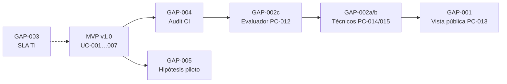
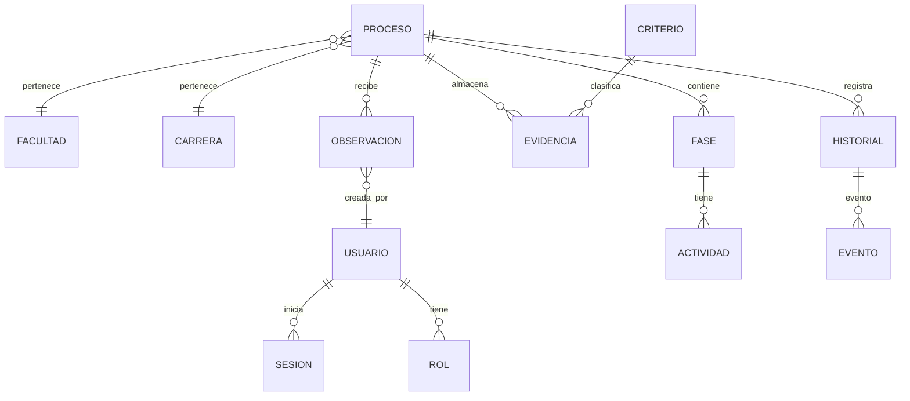

# Functional Specification Document (FSD) — SIGESA v1

> **Instrucciones para el grupo**: completen todas las secciones. Las partes en `<…>` son marcadores que deben reemplazar. Mantengan trazabilidad explícita a los ítems del PRD usando IDs (`PRD-XX` → `FSD-XX`).

---

## 0. Metadatos ✅✨

| Campo | Valor |
|-------|-------|
| Producto | SIGESA — Sistema de Gestión de Evaluación y Acreditación |
| Grupo | AcredIA (`team/borisAngulo`) |
| Versión del documento | v1.0 |
| Fecha | 12/05/2026 |
| Autores | Equipo AcredIA |
| Revisores | Docente + 1 grupo par |
| Estado | Borrador |
| **Modo elegido** | **LFSD ⚡** |
| Trazabilidad a PRD | `./team/borisAngulo/PRD_v1.md` |
| Insumos M2 (UI/UX) | Rutas por enlazar: wireframes/mockups/journeys del Módulo 2 (ver §9.1) |
| Fase Spec Kit cubierta | Plan ✓ |
| Prompts utilizados | PM-006 (derivación desde PRD) |

---

## 1. Resumen ejecutivo ⚡✨

SIGESA digitaliza y controla el ciclo de evaluación y acreditación de carreras en la UMSS (ARCU-SUR / CEUB) con un sistema de roles, procesos por carrera/facultad, fases, actividades, evidencia versionada y auditoría mínima. El valor diferencial, para DUEA y para jefatura/coordinación de carrera, se centra en eliminar la dependencia de Excel aislados, correo y repositorios no integrados: toda evidencia se asocia a criterio y fase/proceso con historial consultable, permitiendo seguimiento, control de avance y transparencia.

Para cumplir el PRD (y sus requisitos priorizados), el FSD v1 en modo Lightweight (LFSD) define casos de uso críticos: (1) autenticación y autorización por roles con control de operaciones sensibles; (2) creación/gestión de procesos, fases y actividades con reglas de cierre (sin tareas pendientes) y coherencia de fechas; (3) carga/versionado de evidencias con clasificación obligatoria, historial inalterable y confirmación en operaciones destructivas; adicionalmente incluye (4) auditoría/observaciones y (5) panel/semáforo + alertas por plazos y (6) reporte ejecutivo PDF en ≤ 2 clics.

La especificación integra invariantes y failure modes en prompt-contratos para facilitar instrumentación y pruebas, manteniendo trazabilidad a los requisitos del PRD.

---

## 2. Alcance ⚡✨

### 2.1 Dentro del alcance

- Autenticación y autorización por roles con restricciones por permisos.
- Creación/gestión de procesos de acreditación, fases y actividades; validaciones de unicidad y cronograma.
- Carga de evidencias vinculadas a criterio y proceso/fase; versionado con auditoría mínima.
- Flujo de observaciones DUEA ↔ carrera (registro, respuesta y estados con auditoría).
- Panel de estado con semáforo y cálculo de avance por criterios + fechas clave.
- Alertas automáticas por plazos e hitos (sin recordatorios manuales por evento).
- Reporte ejecutivo PDF desde contexto (≤ 2 clics).

### 2.2 Fuera del alcance (explícito)

- Pagos en línea por certificaciones.
- Motor automático completo de matrices de evaluación como única fuente de calificación.
- Generación automática de bitácoras legales narrativas sin base en eventos reales.
- Asistente informacional como funcionalidad principal (queda como backlog Could).
- Reportes amplios PDF/Excel en v1.0 (quedan para iteración posterior según PRD).

### 2.3 Supuestos y dependencias

- Existe una fuente de identidad institucional (SSO/LDAP/cuentas UMSS) y roles se asignan desde administración.
- Se dispone (o se habilita carga inicial) de datos maestros: carreras, facultades, criterios y calendario de hitos.
- Hay un servicio de generación PDF y un canal de notificaciones (correo o equivalente) para alertas.

### 2.4 Plan técnico (Spec Kit fase Plan) ⚡

> **LFSD ⚡**: en modo lightweight, esta sección mantiene alto nivel el “cómo técnico” mínimo.

| Bloque | Contenido |
|--------|-----------|
| **Stack tecnológico** | Pendiente de definir: arquitectura web con backend (API) + frontend; servicio de reportes PDF; módulo de auditoría append-only. |
| **Arquitectura prevista** | Modular por dominios: Auth, Process, Evidence, Observations, Reporting, Audit; separación de lógica de negocio de la capa de presentación. |
| **Project structure** | `backend/`, `frontend/`, `infra/`, `docs/` (propuesto). |
| **Decisiones técnicas anticipadas** | Historial de versiones inalterable para evidencias; políticas de autorización centralizadas; auditoría por eventos; generación de PDF a partir de datos consolidados. |
| **Restricciones técnicas** | Cumplimiento Ley 164/PII; operaciones sensibles requieren sesión válida; no borrar silenciosamente evidencias. |

#### 2.4.1 Componente transversal — Auditoría (cierre GAP-004)

La bitácora **no es un caso de uso de negocio independiente** en MVP v1.0: es un **componente transversal** consumido por todos los FSD-UC-001…007.

| Elemento | Especificación |
|----------|----------------|
| **ID** | `COMP-AUDIT-001` (alias CU-012 en `casos-de-uso.md`) |
| **Puerto** | `AuditEventPort` — insert append-only |
| **Eventos obligatorios** | login/logout; carga/reemplazo evidencia; cierre proceso; transición observación; envío alerta; generación PDF; gestión usuarios |
| **Payload mínimo** | `actor_id`, `timestamp`, `action`, `resource_type`, `resource_id`, `correlation_id` |
| **NFR** | NFR-004 (≥ 95 % eventos críticos); NFR-003 en tránsito |
| **PRD** | PRD-REQ-013 (Must) — satisfecho por diseño transversal, no por UC dedicado |
| **Verificación** | Tests de integración por UC + smoke en staging (`nfr_iso25010.md` §Notas) |
| **Implementación** | Tabla `LOG_AUDITORIA` append-only; ADR-0001 |

> **Estado GAP-004**: cerrado a nivel de arquitectura/documentación. Pendiente solo validación de cobertura de eventos en CI por UC.

### 2.5 Descomposición en Tasks (Spec Kit) ⚡

| Task ID | Descripción | Caso de uso (FSD-UC) | Dependencias | Prompt asociado | Estado |
|---------|-------------|----------------------|--------------|-----------------|--------|
| `T-001` | Endpoints y reglas para autenticación/autorización por rol | `FSD-UC-001` | T-000 (modelo usuarios/roles) | `PR-FSD-001` | pendiente |
| `T-002` | CRUD de procesos/fases con unicidad por tipo/carrera/periodo y cierre sin pendientes | `FSD-UC-002` | datos maestros proceso/fase/actividad | `PR-FSD-002` | pendiente |
| `T-003` | Carga y versionado de evidencias vinculadas a criterio y proceso/fase | `FSD-UC-003` | almacenamiento de archivos + metadata | `PR-FSD-003` | pendiente |
| `T-004` | Flujo de observaciones DUEA ↔ carrera con estado y auditoría | `FSD-UC-004` | modelo de fases/entregables | `PR-FSD-004` | pendiente |
| `T-005` | Panel con semáforo y cálculo de avance por criterios/fechas | `FSD-UC-005` | reglas semáforo + datos de avance | `PR-FSD-005` | pendiente |
| `T-006` | Alertas automáticas por plazos/hitos + registro de eventos | `FSD-UC-006` | scheduler + canal notificaciones | `PR-FSD-006` | pendiente |
| `T-007` | Generación de reporte ejecutivo PDF ≤ 2 clics desde contexto | `FSD-UC-007` | motor PDF | `PR-FSD-007` | pendiente |

### 2.6 Extensiones post-MVP (registro de gaps)

> **Alcance v1.0**: 7 FSD-UC canónicos (§4). Las filas siguientes son **backlog v1.1+** con IDs reservados para evitar colisión con PC-001…012.

| Gap | ID extensión | PRD-US | PC / artefacto | Prioridad | Definición de cierre (DoD) |
|-----|--------------|--------|----------------|-----------|----------------------------|
| GAP-001 | `FSD-UC-EXT-001` | PRD-US-021 | **PC-013** (borrador) | Should | UC en FSD §4; PC-013 completo; `GET /publico/carreras/{id}` sin PII; Gherkin PRD §5.7.4 verde |
| GAP-002a | `FSD-UC-EXT-002` | PRD-US-018 | **PC-014** (borrador) | Should | Bandeja evidencias pendientes; RBAC técnico operativo; trazado a BR-006/012 |
| GAP-002b | `FSD-UC-EXT-003` | PRD-US-019 | **PC-015** (por crear) | Should | Flujo constancias/trámites; solo acciones permitidas por rol |
| GAP-002c | `FSD-UC-EXT-004` | PRD-US-020 | **PC-012** (existente) | Should | PC-012 enlazado en FSD §4; UC-EXT-004; @DevAgent desbloqueado |
| GAP-003 | — (ops) | — | Runbook TI + NFR-005 | Pre-piloto | Acta UMSS: ventana 07:00–22:00 BOT, herramienta monitoreo, contacto on-call |
| GAP-004 | `COMP-AUDIT-001` | PRD-REQ-013 | §2.4.1 + CU-012 | Must | ✅ Doc cerrado; tests integración por UC en CI |
| GAP-005 | — (discovery) | H-01…H-05 | `trazabilidad-sigesa.md` §2.5 | Documental | ✅ Vínculo formal MRD→FSD-UC→NFR/KPI; medición en piloto |

**Dependencias de sprint sugeridas**



---

## 3. Actores y roles del sistema ⚡✨

| Actor | Tipo (humano/sistema/agente IA) | Responsabilidad principal | Permisos clave |
|-------|---------------------------------|---------------------------|----------------|
| Administrador DUEA | humano | control global, gestión de procesos/fases, aprobaciones/observaciones | creación/cierre/estado + auditoría |
| Jefe de Carrera / Coordinador | humano | gestión operativa, carga de actividades, evidencia y respuesta a observaciones | escritura en su alcance + lectura según rol |
| Técnico operativo / Técnico de trámites | humano | acciones documentales acotadas | permisos limitados a tareas y constancias |
| Evaluador externo | humano | consulta y revisión con alcance mínimo por fase | solo lectura/acceso restringido |
| Público general | humano | consulta de información pública no sensible | endpoints públicos |
| Scheduler/Notificador | sistema | ejecución de alertas por ventanas | disparo notificaciones |
| Motor de reportes PDF | sistema | render del reporte ejecutivo | consumo datos autorizados |
| Auditoría | sistema | registro append-only de eventos críticos | escritura append-only |

---

## 4. Casos de uso funcionales ⚡✨

> **Cobertura LFSD**: casos críticos con flujo principal y criterios Gherkin mínimos.

### 4.1 FSD-UC-001 – Autenticación y autorización por roles

- **Trazabilidad**: `PRD-REQ-001`
- **Actor principal**: Usuario humano
- **Precondiciones**:
  1. El usuario existe.
  2. El usuario tiene al menos un rol asignado.
- **Disparador**: Usuario intenta acceder e invoca operación sensible.
- **Flujo principal**:
  1. El usuario inicia sesión.
  2. El sistema valida credenciales.
  3. El sistema determina permisos según rol.
  4. El sistema registra evento en auditoría cuando aplique.
- **Flujos alternativos / excepciones**:
  - **A1**: Credenciales inválidas → rechazo de acceso.
  - **A2**: Usuario sin rol → acceso denegado a funciones internas.
  - **A3**: Operación sensible sin sesión → rechazo por política.
- **Postcondiciones**:
  1. El usuario opera únicamente con permisos permitidos.
  2. Acciones relevantes quedan registradas en auditoría.
- **Reglas de negocio aplicables** (referencia a secciones 5): `BR-001`, `BR-004`, `BR-05`, `BR-11`
- **Datos de entrada**:
  - Credenciales (o SSO), endpoint/operación solicitada, roles del usuario.
- **Datos de salida**:
  - Estado de sesión y permisos; mensajes de error sin filtrar existencia.
- **Criterios de aceptación (Gherkin)**:

```gherkin
Dado un usuario con rol asignado en el sistema
Cuando ingresa credenciales correctas
Entonces obtiene una sesión activa
  Y ve solo menús y datos permitidos para su rol
```

```gherkin
Dado un visitante en la pantalla de inicio de sesión
Cuando ingresa credenciales incorrectas
Entonces el sistema no crea sesión
  Y muestra un mensaje claro sin revelar si el usuario existe
```

### 4.2 FSD-UC-002 – Gestión de procesos/fases y cierre con pendientes

- **Trazabilidad**: `PRD-REQ-002`, `PRD-REQ-003`, `PRD-REQ-005`
- **Actor principal**: Administrador DUEA / Coordinador (según permisos)
- **Precondiciones**:
  1. Carrera y facultad existen en datos maestros.
  2. Tipo de acreditación definido.
- **Disparador**: Se crea/actualiza un proceso o se intenta cerrar.
- **Flujo principal**:
  1. Admin crea proceso asociado a carrera y facultad.
  2. El sistema registra fases del ciclo.
  3. Coordinación registra actividades con estado responsable.
  4. Al solicitar cierre, el sistema valida existencia de tareas pendientes.
  5. Actualiza estado del proceso y registra historial.
- **Flujos alternativos / excepciones**:
  - **A1**: Fecha inicio/fin incoherente → rechazo.
  - **A2**: Ya existe un proceso activo mismo tipo/carrera/periodo → rechazo.
  - **A3**: Intento de cierre con pendientes → no se cierra y se comunica razón.
- **Postcondiciones**:
  1. Proceso queda consistente y auditado.
- **Reglas de negocio aplicables**: `BR-001`, `BR-002`, `BR-003`, `BR-008`, `BR-009`, `BR-010`, `BR-12`
- **Datos de entrada**:
  - Carrera/facultad, tipo/organismo/gestión/año, fechas, actividades y estados.
- **Datos de salida**:
  - Proceso actualizado; error/razón de rechazo si aplica.
- **Criterios de aceptación (Gherkin)**:

```gherkin
Dado un administrador DUEA autenticado
Cuando define fecha de inicio y fin del proceso
Entonces el sistema exige inicio estrictamente anterior al fin
```

```gherkin
Dado un proceso con tareas obligatorias pendientes
Cuando se intenta cerrar el proceso
Entonces el sistema impide el cierre y comunica el motivo
```

### 4.3 FSD-UC-003 – Carga y versionado de evidencias vinculadas a criterio

- **Trazabilidad**: `PRD-REQ-006`, `PRD-REQ-007`, `PRD-REQ-013`
- **Actor principal**: Coordinador/Jefe/Técnico autorizado
- **Precondiciones**:
  1. Existe proceso/fase válida.
  2. Existe criterio asociado a la acreditación.
- **Disparador**: Usuario sube evidencia para un criterio.
- **Flujo principal**:
  1. Usuario selecciona criterio y vincula a proceso/fase.
  2. Usuario sube archivo.
  3. Sistema valida clasificación obligatoria.
  4. Sistema almacena evidencia y crea nueva versión.
  5. Sistema registra autor/fecha y evento en auditoría.
- **Flujos alternativos / excepciones**:
  - **A1**: Evidencia sin clasificación → rechazo.
  - **A2**: Reemplazo destructivo → requiere confirmación y registra evento.
- **Postcondiciones**:
  1. Evidencia queda almacenada con historial de versiones.
- **Reglas de negocio aplicables**: `BR-006`, `BR-007`, `BR-11`, `BR-12`
- **Datos de entrada**:
  - Archivo, metadata (criterio_id, proceso_id, fase_id, descripción), usuario responsable.
- **Datos de salida**:
  - Evidencia/version creada; acceso al historial.
- **Criterios de aceptación (Gherkin)**:

```gherkin
Dado un coordinador autenticado con permiso sobre la carrera
Cuando sube un archivo y selecciona criterio y vínculo a proceso fase
Entonces el sistema almacena la evidencia y muestra confirmación
  Y registra usuario y fecha de carga
```

```gherkin
Dado un usuario que solicita borrar o reemplazo destructivo
Cuando confirma la acción en el diálogo
Entonces el sistema ejecuta según reglas de negocio y registra el evento
Cuando cancela
Entonces no se produce cambio en el repositorio de evidencias
```

---

## 5. Reglas de negocio ⚡✨

| ID | Regla | Tipo | Origen | Casos de uso afectados |
|----|-------|------|--------|------------------------|
| BR-001 | Un proceso debe estar asociado obligatoriamente a una carrera y una facultad | negocio | visión | FSD-UC-002 |
| BR-002 | No más de un proceso activo del mismo tipo por carrera y periodo | negocio | visión | FSD-UC-002 |
| BR-003 | Todo proceso registra tipo de acreditación, organismo, gestión (año), fecha inicio y fin | normativa/operación | visión | FSD-UC-002 |
| BR-004 | Cada usuario tiene al menos un rol; acceso restringido por rol | seguridad | visión | FSD-UC-001 |
| BR-005 | Solo el Administrador crea usuarios, asigna roles y modifica permisos | política | visión | FSD-UC-001 |
| BR-006 | Toda evidencia asociada a criterio y proceso; no se guarda sin clasificación | negocio | visión | FSD-UC-003 |
| BR-007 | Registro de fecha de carga y usuario responsable; historial de versiones | auditoría | visión | FSD-UC-003 |
| BR-008 | Estados de proceso: En proceso / Acreditado / Vencido; avance según cumplimiento | negocio | visión | FSD-UC-002 |
| BR-009 | Cronograma obligatorio; no cerrar con tareas pendientes; fechas coherentes | negocio | visión | FSD-UC-002 |
| BR-010 | Cambios de estado solo por usuarios autorizados y registrados en historial | auditoría | visión | FSD-UC-002 |
| BR-11 | Autenticación obligatoria; bitácora de auditoría | seguridad/cumplimiento | visión | FSD-UC-001, FSD-UC-003 |
| BR-12 | No crear procesos sin datos obligatorios; no subir documentos incompletos; no duplicar registros críticos | validación | visión | FSD-UC-002, FSD-UC-003 |

---

## 6. Modelo de datos funcional ⚡✨

### 6.1 Diagrama ER (Mermaid)



### 6.2 Diccionario de datos

| Entidad | Atributo | Tipo | Obligatorio | Validaciones | Origen |
|---------|----------|------|-------------|--------------|--------|
| Usuario | id | UUID | sí | UUIDv4 | sistema |
| Usuario | email | string(120) | sí | regex RFC 5322 | sistema |
| Rol | id | UUID | sí | UUIDv4 | sistema |
| Proceso | id | UUID | sí | UUIDv4 | sistema |
| Proceso | tipo_acreditacion | enum | sí | permitido: ARCU-SUR/CEUB/otros | visión/BRD |
| Proceso | fecha_inicio | date | sí | inicio < fin | BR-003/BR-009 |
| Proceso | fecha_fin | date | sí | fin > inicio | BR-003/BR-009 |
| Fase | id | UUID | sí | UUIDv4 | sistema |
| Fase | estado | enum | sí | En proceso/Acreditado/Vencido | BR-008 |
| Actividad | id | UUID | sí | UUIDv4 | sistema |
| Evidencia | id | UUID | sí | UUIDv4 | sistema |
| Evidencia | version | int | sí | incremental | BR-07 |
| Evidencia | criterio_id | UUID | sí | existe criterio | BR-06 |
| Observación | id | UUID | sí | UUIDv4 | sistema |
| Observación | estado | enum | sí | abierta/cerrada/seguimiento | visión |
| Evento | id | UUID | sí | UUIDv4 | auditoría |
| Evento | actor_user_id | UUID | sí | usuario existente | BR-11 |

---

## 7. Prompt como Contrato Funcional ⚡✨

### 7.1 Prompt-contrato para FSD-UC-001

```markdown
# Role
Eres un agente IA especializado en especificación funcional y validación de contratos de prompt para autenticación/autorización por roles.

# Task
Especifica el contrato funcional del caso de uso FSD-UC-001: autenticación segura y autorización por rol ante operaciones sensibles. Produce una salida estructurada para implementación y pruebas.

# Context
- Entrada: roles disponibles (Administrador DUEA, Jefe de Carrera, Coordinador, Técnico operativo/trámites, Evaluador externo, Público general) y clasificación de operaciones sensibles.
- Referencias de dominio: BR-001, BR-004, BR-005, BR-11.
- Restricciones: no revelar existencia del usuario ante credenciales inválidas; funciones sensibles requieren sesión válida; acceso restringido por rol.

# Reasoning
Pasos obligatorios:
1. Identificar operaciones sensibles y condiciones de seguridad.
2. Definir matriz rol→acciones permitidas/denegadas.
3. Redactar invariantes, failure modes y criterios Gherkin mínimos.

# Stop condition
Detente cuando: exista un JSON con invariantes, failure modes y criterios Gherkin listo para test.

# Output
Formato: JSON
- status
- data.invariants: string[]
- data.failure_modes: [{code, message, condition}]
- data.access_control_matrix: {role:{allow_actions[], deny_actions[]}}
- data.acceptance_criteria_gherkin: string (contiene 2 escenarios mínimo)

**Invariants**:
- Toda acción sensible requiere sesión válida.
- Sin sesión válida: rechazar sin modificar datos.
- Errores por login inválido no revelan existencia.

**Failure modes**:
- AUTH_NO_SESSION
- AUTH_INVALID_CREDENTIALS
- AUTH_NO_ROLE
- AUTH_FORBIDDEN
```

### 7.2 Prompt-contrato para FSD-UC-002

```markdown
# Role
Eres un agente IA especializado en contratos de prompt para especificación funcional de procesos, fases y reglas de cierre.

# Task
Define reglas funcionales, validaciones y transiciones del caso de uso FSD-UC-002: gestión de procesos/fases con unicidad por tipo/carrera/periodo y cierre con pendientes.

# Context
- Entrada: datos de proceso (carrera, facultad, tipo, organismo, gestión/año, fechas) y actividades con estado.
- Referencias de dominio: BR-001 a BR-003, BR-008 a BR-010, BR-009, BR-12.
- Restricciones: inicio < fin; no cerrar con tareas pendientes; no duplicar proceso activo.

# Reasoning
Pasos obligatorios:
1. Validar datos obligatorios.
2. Verificar unicidad y estado del proceso.
3. Determinar lógica de cierre y reglas de transiciones.
4. Listar invariantes, failure modes y criterios Gherkin mínimos.

# Stop condition
Detente cuando: el output incluya invariantes, failure modes y Gherkin para (a) fechas coherentes y (b) cierre con pendientes y (c) unicidad.

# Output
JSON con:
- status
- data.invariants
- data.failure_modes
- data.state_transitions
- data.acceptance_criteria_gherkin
```

### 7.3 Prompt-contrato para FSD-UC-003

```markdown
# Role
Eres un agente IA especializado en contratos de prompt para gestión documental: clasificación obligatoria, versionado e inmutabilidad auditada.

# Task
Especifica el contrato funcional del caso de uso FSD-UC-003: carga y versionado de evidencias vinculadas a criterio, incluyendo confirmación en operaciones destructivas.

# Context
- Entrada: archivo + metadatos (criterio_id, proceso_id, fase_id, descripción), usuario responsable y rol.
- Referencias de dominio: BR-006, BR-007, BR-11, BR-12.
- Restricciones: no almacenar sin clasificación; registrar usuario/fecha; historial inalterable; confirmación para acciones destructivas.

# Reasoning
Pasos obligatorios:
1. Validar clasificación obligatoria.
2. Definir reglas de versionado y persistencia de historial.
3. Definir confirmación y failure modes.

# Stop condition
Detente cuando: el output incluya invariantes, failure modes y criterios Gherkin para evidencia clasificada y modal de confirmación.

# Output
JSON con:
- status
- data.invariants
- data.failure_modes
- data.versioning_rules
- data.acceptance_criteria_gherkin
```

---

## 8. Integraciones externas 🔗

| Sistema | Tipo | Protocolo | Operaciones | SLA esperado | Autenticación |
|---------|------|-----------|-------------|--------------|----------------|
| Almacenamiento de objetos | mixto | HTTPS | guardar/leer archivo y metadata | p95 < 2s upload | OAuth2/cred interna |
| Motor de reportes PDF | síncrono | HTTPS | generar reporte ejecutivo | p95 < 5s | sesión autorizada |
| Canal de notificaciones | asíncrono | SMTP/Service | enviar alertas | entrega < 1 min | token/secret |
| Scheduler | sistema | cron/worker | disparo alertas por ventana | ejecución puntual | interno |

---

## 9. Interfaces de usuario (referencia) ⚡✨

- Enlace a Figma / mockups del Módulo 2 (UX/UI): por enlazar cuando el equipo publique artefactos M2.

| Pantalla | Caso de uso cubierto |
|----------|----------------------|
| `/login` | FSD-UC-001 |
| `/procesos/{id}/fases` | FSD-UC-002 |
| `/procesos/{id}/evidencias` | FSD-UC-003 |

### 9.1 Trazabilidad con M2 (UI/UX) ⚡✨

| Wireframe / mockup M2 | Pantalla FSD | Caso de uso (FSD-UC) | Estado |
|-----------------------|--------------|------------------------|--------|
| `<mockup_login.png>` | `/login` | `FSD-UC-001` | pendiente |
| `<mockup_fases_proceso.png>` | `/procesos/{id}/fases` | `FSD-UC-002` | pendiente |
| `<mockup_carga_evidencias.png>` | `/procesos/{id}/evidencias` | `FSD-UC-003` | pendiente |

---

## 10. Requerimientos No Funcionales (NFR) ⚡✨

| ID | Categoría | Requisito | Métrica | Umbral | Cómo se verifica |
|----|-----------|-----------|---------|--------|------------------|
| NFR-001 | Rendimiento | Latencia lectura panel y carga evidencias | p95 | < 3 s | pruebas performance |
| NFR-002 | Seguridad | Protección de PII y evidencias sensibles | cumplimiento | Ley 164/UMSS | auditoría/revisión legal |
| NFR-003 | Auditoría | Trazabilidad de eventos críticos | cobertura de logs | 100% endpoints sensibles | revisión logs + tests |
| NFR-004 | Usabilidad | Tiempo de tarea para subir evidencia y abrir historial | KPI | ≥ 25% mejora vs línea base | pruebas usabilidad |
| NFR-005 | Disponibilidad | Servicio en horario académico | uptime | objetivo por acordar | monitoreo |
| NFR-006 | Accesibilidad | WCAG 2.2 AA en componentes prioritarios | auditoría | AA | checklist accesibilidad |

---

## 11. Trazabilidad MRD → PRD → FSD ⚡✨

| MRD (necesidad) | PRD (requerimiento) | FSD (caso de uso) | NFR | Prueba de acept. |
|-----------------|---------------------|-------------------|-----|----------------------|
| `MRD-N-01` | `PRD-REQ-001` | `FSD-UC-001` | NFR-003 | TC-AUTH-01 |
| `MRD-N-02` | `PRD-REQ-002/003/005` | `FSD-UC-002` | NFR-003 | TC-PROCESS-01 |
| `MRD-N-03` | `PRD-REQ-006/007` | `FSD-UC-003` | NFR-002, NFR-003 | TC-EVID-01 |

---

## 12. Plan de pruebas funcionales ⚡✨

- Estrategia: unitarias de validación (fechas, unicidad, clasificación), integración de permisos por rol, E2E para carga de evidencia y cierre de proceso, y contract testing para invariantes/failure modes declarados en prompt-contratos.
- Herramientas (propuestas): Jest/pytest (según stack) + Playwright/Cypress para E2E.
- Cobertura mínima aceptada: **≥ 80%** en dominio core.

---

## 13. Riesgos funcionales ⚡✨

| Riesgo | Probabilidad | Impacto | Mitigación | Responsable |
|--------|--------------|----------|------------|-------------|
| Permisos mal configurados por rol | media | alto | pruebas por matriz RACI y tests de autorización | PM + QA |
| Evidencias sin clasificación guardadas | media | alto | validación estricta + tests de formulario | Dev + QA |
| Historial/versionado alterable | baja | alto | diseño append-only + auditoría verificable | Tech Lead |
| Cierre de proceso con pendientes | media | medio | validación en endpoint + pruebas | Dev + QA |

---

## 14. Glosario ⚡✨

| Término | Definición |
|---------|------------|
| Evidencia | Documento asociado a criterio y proceso/fase, con historial de versiones. |
| Proceso | Ciclo de acreditación para una carrera/facultad y periodo. |
| Fase | Etapa del ciclo del proceso (autoevaluación, documentación, visita de pares, informe externo, resolución final). |
| Observación DUEA | Comentario formal con estado y vínculo a un entregable/fase. |
| Semáforo | Indicador visual de riesgo/estado en panel por carrera/facultad. |

---

## 15. Registro de cambios ⚡✨

| Versión | Fecha | Autor | Cambio |
|---------|-------|--------|--------|
| v0.1 | 12/05/2026 | AcredIA | FSD v1 en modo LFSD con casos de uso críticos y prompt-contratos mínimo |
| v1.0.1 | 16/05/2026 | AcredIA | §2.4.1 auditoría transversal; §2.6 registro gaps/extensiones FSD-UC-EXT-* |

---

## Checklist de entrega — modo LFSD ⚡

- [x] 0. Metadatos completos, modo declarado como **LFSD ⚡**.
- [x] 1. Resumen ejecutivo (150–250 palabras).
- [x] 2. Alcance + 2.5 Tasks (≥ 5 tasks ejecutables con prompt asociado).
- [x] 3. Actores (resumen).
- [x] ≥ 3 casos de uso críticos (§4) con flujo principal y Gherkin mínimo.
- [x] 5. Reglas de negocio.
- [x] 6. Modelo de datos básico (diagrama Mermaid + entidades core).
- [x] Un prompt-contrato por caso de uso crítico (§7).
- [x] 9 + 9.1 Trazabilidad con M2 obligatoria (pendiente publicación/rutas de artefactos M2).
- [x] 10 NFRs: al menos 3 críticos con métrica y umbral.
- [x] 11 Trazabilidad MRD → PRD → FSD.
- [x] 12 Plan de pruebas (estrategia mínima).
- [x] 13 Riesgos funcionales.
- [x] 15 Registro de cambios.
- [ ] Revisión por pares registrada (pendiente en PR/proceso).

