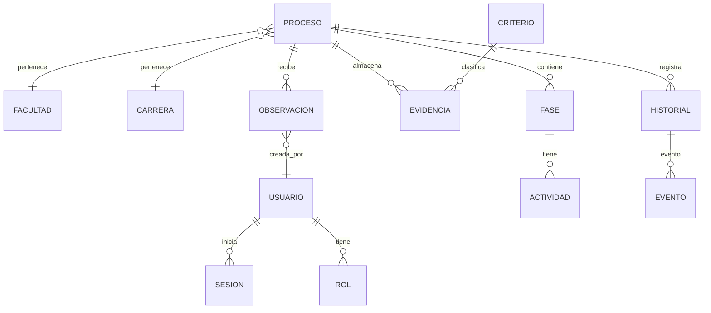

# Light Functional Specification Document (LFSD) — SIGESA v1

> **Instrucciones para el grupo**: mantener trazabilidad explícita a PRD/FSD usando IDs (`PRD-REQ-*` → `FSD-UC-*`).

---

## 0. Metadatos

| Campo | Valor |
|-------|-------|
| Producto | SIGESA — Sistema de Gestión de Evaluación y Acreditación |
| Grupo | AcredIA (`team/borisAngulo`) |
| Versión del documento | v1.0 |
| Fecha | 12/05/2026 |
| Autores | Equipo AcredIA |
| Estado | Borrador |
| **Modo LFSD** | **LFSD ⚡** |
| Trazabilidad a FSD | `./team/borisAngulo/FSD_v1.md` |
| Insumos M2 (UI/UX) | Rutas por enlazar: wireframes/mockups/journeys del Módulo 2 (ver §4.5) |

---

## 1. Resumen ejecutivo

SIGESA digitaliza y controla el ciclo de evaluación y acreditación de carreras en la UMSS (ARCU-SUR / CEUB) mediante un sistema con roles, procesos por carrera/facultad, fases y actividades, evidencia versionada y auditoría mínima. El valor central es reemplazar la dependencia de Excel, correo y repositorios no integrados por un repositorio único donde cada evidencia se vincula a un criterio y a un proceso/fase, manteniendo historial consultable y reduciendo errores y retrasos por falta de visibilidad.

El objetivo de este LFSD es derivar una especificación ligera, clara y orientada a implementación a partir del FSD v1 actual. En particular, define los **casos de uso críticos** (autenticación/autorización, gestión de procesos/fases con cierres válidos, y carga/versionado de evidencias con clasificación obligatoria y confirmación ante acciones destructivas) y los convierte en **prompt-contracts ejecutables** para IA.

---

## 2. Alcance

### 2.1 Dentro del alcance

- Autenticación y autorización por roles para operaciones sensibles.
- Gestión de procesos de acreditación con fases/actividades y reglas de cierre (no cerrar con tareas pendientes; coherencia de fechas; unicidad de proceso activo).
- Carga y versionado de evidencias vinculadas a criterio y proceso/fase con clasificación obligatoria.
- Reglas de protección ante reemplazo/eliminación destructiva con confirmación.
- Panel/semáforo y alertas por plazos/hitos (en forma resumida, como parte del sistema definido en FSD).

### 2.2 Fuera del alcance (explícito)

- Pagos en línea por certificaciones.
- Motor automático completo de matrices de evaluación como única fuente de calificación.
- Generación automática de bitácoras legales narrativas sin base en eventos reales.
- Asistente informacional como funcionalidad principal.
- Reportes amplios PDF/Excel en v1.0.

### 2.3 Dependencias

- Identidad institucional (SSO/LDAP/cuentas UMSS) y asignación de roles.
- Datos maestros: carreras, facultades, criterios y calendario de hitos.
- Servicio de generación PDF y canal de notificaciones para alertas.

---

## 3. Casos de uso críticos

> **Cobertura LFSD**: 3 casos de uso críticos con flujo principal y Gherkin mínimo.

### 3.1 FSD-UC-001 — Autenticación y autorización por roles

- **ID**: FSD-UC-001
- **Objetivo**: permitir acceso seguro y restringir operaciones sensibles por rol.
- **Actor(es)**: Usuario humano.
- **Trazabilidad**: `PRD-REQ-001`
- **Flujo principal**:
  1. El usuario inicia sesión.
  2. El sistema valida credenciales.
  3. El sistema determina permisos según rol.
  4. El sistema registra evento en auditoría cuando aplique.
- **Excepciones**:
  - A1: Credenciales inválidas → rechazo de acceso.
  - A2: Usuario sin rol → acceso denegado a funciones internas.
  - A3: Operación sensible sin sesión → rechazo por política.
- **Reglas asociadas (críticas)**: `BR-001`, `BR-004`, `BR-005`, `BR-011`

**Criterios Gherkin mínimos**

```gherkin
Dado un usuario con rol asignado en el sistema
Cuando ingresa credenciales correctas
Entonces obtiene una sesión activa
  Y ve solo menús y datos permitidos para su rol
```

```gherkin
Dado un visitante en la pantalla de inicio de sesión
Cuando ingresa credenciales incorrectas
Entonces el sistema no crea sesión
  Y muestra un mensaje claro sin revelar si el usuario existe
```

---

### 3.2 FSD-UC-002 — Gestión de procesos/fases y cierre con pendientes

- **ID**: FSD-UC-002
- **Objetivo**: crear/administrar procesos y fases con coherencia y permitir cierre solo si no existen pendientes.
- **Actor(es)**: Administrador DUEA / Coordinador (según permisos).
- **Trazabilidad**: `PRD-REQ-002`, `PRD-REQ-003`, `PRD-REQ-005`
- **Flujo principal**:
  1. Admin crea proceso asociado a carrera y facultad.
  2. El sistema registra fases del ciclo.
  3. Coordinación registra actividades con estado/responsable.
  4. Al solicitar cierre, el sistema valida existencia de tareas pendientes.
  5. El sistema actualiza estado del proceso y registra historial.
- **Excepciones**:
  - A1: Fecha inicio/fin incoherente → rechazo.
  - A2: Ya existe un proceso activo mismo tipo/carrera/periodo → rechazo.
  - A3: Cierre con pendientes → no se cierra y se comunica razón.
- **Reglas asociadas (críticas)**: `BR-001`, `BR-002`, `BR-003`, `BR-008`, `BR-009`, `BR-010`, `BR-12`

**Criterios Gherkin mínimos**

```gherkin
Dado un administrador DUEA autenticado
Cuando define fecha de inicio y fin del proceso
Entonces el sistema exige inicio estrictamente anterior al fin
```

```gherkin
Dado un proceso con tareas obligatorias pendientes
Cuando se intenta cerrar el proceso
Entonces el sistema impide el cierre y comunica el motivo
```

---

### 3.3 FSD-UC-003 — Carga y versionado de evidencias vinculadas a criterio

- **ID**: FSD-UC-003
- **Objetivo**: subir evidencias clasificadas por criterio con historial de versiones y protección ante cambios destructivos.
- **Actor(es)**: Coordinador/Jefe/Técnico autorizado.
- **Trazabilidad**: `PRD-REQ-006`, `PRD-REQ-007`, `PRD-REQ-013`
- **Flujo principal**:
  1. Usuario selecciona criterio y vincula a proceso/fase.
  2. Usuario sube archivo.
  3. El sistema valida clasificación obligatoria.
  4. El sistema almacena evidencia y crea nueva versión.
  5. El sistema registra autor/fecha y evento en auditoría.
- **Excepciones**:
  - A1: Evidencia sin clasificación → rechazo.
  - A2: Reemplazo destructivo → requiere confirmación y registra evento.
- **Reglas asociadas (críticas)**: `BR-006`, `BR-007`, `BR-11`, `BR-12`

**Criterios Gherkin mínimos**

```gherkin
Dado un coordinador autenticado con permiso sobre la carrera
Cuando sube un archivo y selecciona criterio y vínculo a proceso fase
Entonces el sistema almacena la evidencia y muestra confirmación
  Y registra usuario y fecha de carga
```

```gherkin
Dado un usuario que solicita borrar o reemplazo destructivo
Cuando confirma la acción en el diálogo
Entonces el sistema ejecuta según reglas de negocio y registra el evento
Cuando cancela
Entonces no se produce cambio en el repositorio de evidencias
```

---

## 4. Reglas de negocio críticas

| ID | Regla | Tipo | Casos de uso afectados |
|----|-------|------|------------------------|
| BR-001 | Un proceso debe estar asociado obligatoriamente a una carrera y una facultad | negocio | FSD-UC-002 |
| BR-004 | Cada usuario tiene al menos un rol; acceso restringido por rol | seguridad | FSD-UC-001 |
| BR-005 | Solo el Administrador crea usuarios, asigna roles y modifica permisos | política | FSD-UC-001 |
| BR-006 | Toda evidencia asociada a criterio y proceso; no se guarda sin clasificación | negocio | FSD-UC-003 |
| BR-007 | Registro de fecha de carga y usuario responsable; historial de versiones | auditoría | FSD-UC-003 |
| BR-008 | Estados de proceso: En proceso / Acreditado / Vencido; avance según cumplimiento | negocio | FSD-UC-002 |
| BR-009 | Cronograma obligatorio; no cerrar con tareas pendientes; fechas coherentes | negocio | FSD-UC-002 |
| BR-010 | Cambios de estado solo por usuarios autorizados y registrados en historial | auditoría | FSD-UC-002 |
| BR-011 | Autenticación obligatoria; bitácora de auditoría | seguridad/cumplimiento | FSD-UC-001, FSD-UC-003 |
| BR-012 | No crear procesos sin datos obligatorios; no subir documentos incompletos | validación | FSD-UC-002, FSD-UC-003 |

---

## 4.5 Modelo funcional resumido

- **Entidades core** (resumen): USUARIO, ROL, PROCESO, FACULTAD, CARRERA, FASE, ACTIVIDAD, CRITERIO, EVIDENCIA, OBSERVACION, HISTORIAL, EVENTO.

**Mermaid ER simplificado (derivado de FSD v1)**



---

## 5. Prompt Contracts (IA-contratos ejecutables)

> Conversión de casos de uso críticos en contratos ejecutables para IA, preservando IDs y reglas.

### 5.1 Prompt Contract para FSD-UC-001

```markdown
# Role
Eres un agente IA especializado en especificación funcional y validación de contratos de prompt para autenticación/autorización por roles.

# Task
Especifica el contrato funcional del caso de uso FSD-UC-001: autenticación segura y autorización por rol ante operaciones sensibles. Produce una salida estructurada para implementación y pruebas.

# Context
- Entrada: roles disponibles (Administrador DUEA, Jefe de Carrera, Coordinador, Técnico operativo/trámites, Evaluador externo, Público general) y clasificación de operaciones sensibles.
- Referencias de dominio: BR-001, BR-004, BR-005, BR-11.
- Restricciones: no revelar existencia del usuario ante credenciales inválidas; funciones sensibles requieren sesión válida; acceso restringido por rol.

# Reasoning
Pasos obligatorios:
1. Identificar operaciones sensibles y condiciones de seguridad.
2. Definir matriz rol→acciones permitidas/denegadas.
3. Redactar invariantes, failure modes y criterios Gherkin mínimos.

# Stop condition
Detente cuando: exista un JSON con invariantes, failure modes y criterios Gherkin listo para test.

# Output
Formato: JSON
- status
- data.invariants: string[]
- data.failure_modes: [{code, message, condition}]
- data.access_control_matrix: {role:{allow_actions[], deny_actions[]}}
- data.acceptance_criteria_gherkin: string (contiene 2 escenarios mínimo)

**Invariants**:
- Toda acción sensible requiere sesión válida.
- Sin sesión válida: rechazar sin modificar datos.
- Errores por login inválido no revelan existencia.

**Failure modes**:
- AUTH_NO_SESSION
- AUTH_INVALID_CREDENTIALS
- AUTH_NO_ROLE
- AUTH_FORBIDDEN
```

---

### 5.2 Prompt Contract para FSD-UC-002

```markdown
# Role
Eres un agente IA especializado en contratos de prompt para especificación funcional de procesos, fases y reglas de cierre.

# Task
Define reglas funcionales, validaciones y transiciones del caso de uso FSD-UC-002: gestión de procesos/fases con unicidad por tipo/carrera/periodo y cierre con pendientes.

# Context
- Entrada: datos de proceso (carrera, facultad, tipo, organismo, gestión/año, fechas) y actividades con estado.
- Referencias de dominio: BR-001 a BR-003, BR-008 a BR-010, BR-009, BR-12.
- Restricciones: inicio < fin; no cerrar con tareas pendientes; no duplicar proceso activo.

# Reasoning
Pasos obligatorios:
1. Validar datos obligatorios.
2. Verificar unicidad y estado del proceso.
3. Determinar lógica de cierre y reglas de transiciones.
4. Listar invariantes, failure modes y criterios Gherkin mínimos.

# Stop condition
Detente cuando: el output incluya invariantes, failure modes y Gherkin para (a) fechas coherentes y (b) cierre con pendientes y (c) unicidad.

# Output
JSON con:
- status
- data.invariants
- data.failure_modes
- data.state_transitions
- data.acceptance_criteria_gherkin
```

---

### 5.3 Prompt Contract para FSD-UC-003

```markdown
# Role
Eres un agente IA especializado en contratos de prompt para gestión documental: clasificación obligatoria, versionado e inmutabilidad auditada.

# Task
Especifica el contrato funcional del caso de uso FSD-UC-003: carga y versionado de evidencias vinculadas a criterio, incluyendo confirmación en operaciones destructivas.

# Context
- Entrada: archivo + metadatos (criterio_id, proceso_id, fase_id, descripción), usuario responsable y rol.
- Referencias de dominio: BR-006, BR-007, BR-11, BR-12.
- Restricciones: no almacenar sin clasificación; registrar usuario/fecha; historial inalterable; confirmación para acciones destructivas.

# Reasoning
Pasos obligatorios:
1. Validar clasificación obligatoria.
2. Definir reglas de versionado y persistencia de historial.
3. Definir confirmación y failure modes.

# Stop condition
Detente cuando: el output incluya invariantes, failure modes y criterios Gherkin para evidencia clasificada y modal de confirmación.

# Output
JSON con:
- status
- data.invariants
- data.failure_modes
- data.versioning_rules
- data.acceptance_criteria_gherkin
```

---

## 6. NFR críticos (resumen)

| ID | Categoría | Requisito | Métrica | Umbral |
|----|-----------|-----------|---------|--------|
| NFR-001 | Rendimiento | Latencia lectura panel y carga evidencias | p95 | < 3 s |
| NFR-002 | Seguridad | Protección de PII y evidencias sensibles | cumplimiento | Ley 164/UMSS |
| NFR-003 | Auditoría | Trazabilidad de eventos críticos | cobertura de logs | 100% endpoints sensibles |

---

## 7. Trazabilidad (MRD → PRD → FSD → LFSD)

| MRD (necesidad) | PRD (requerimiento) | FSD (caso de uso) | NFR | Evidencia en LFSD |
|-----------------|---------------------|-------------------|-----|-------------------|
| MRD-N-01 | PRD-REQ-001 | FSD-UC-001 | NFR-003 | §3.1 y §5.1 |
| MRD-N-02 | PRD-REQ-002/003/005 | FSD-UC-002 | NFR-003 | §3.2 y §5.2 |
| MRD-N-03 | PRD-REQ-006/007/013 | FSD-UC-003 | NFR-002, NFR-003 | §3.3 y §5.3 |

---

## 8. Riesgos funcionales (resumen)

| Riesgo | Probabilidad | Impacto | Mitigación |
|--------|--------------|----------|------------|
| Permisos mal configurados por rol | media | alto | pruebas por matriz RACI y tests de autorización |
| Evidencias sin clasificación guardadas | media | alto | validación estricta + tests de formulario |
| Historial/versionado alterable | baja | alto | diseño append-only + auditoría verificable |
| Cierre de proceso con pendientes | media | medio | validación en endpoint + pruebas |

---

## 9. Registro de cambios

| Versión | Fecha | Autor | Cambio |
|---------|-------|--------|--------|
| v0.1 | 12/05/2026 | AcredIA | Derivación de LFSD v1 desde FSD v1 con prompt-contracts y trazabilidad mínima |

---

## Checklist de entrega — modo LFSD ⚡

- [x] 0. Metadatos completos, modo declarado como **LFSD ⚡**.
- [x] 1. Resumen ejecutivo (150–250 palabras).
- [x] 2. Alcance (dentro/fuera/dependencias) + resumen funcional.
- [x] 3. Actores (implícitos) y ≥ 3 casos de uso críticos.
- [x] 4. Reglas de negocio críticas.
- [x] 5. Prompt Contracts (1 por caso de uso crítico).
- [x] 6. NFRs críticos (≥ 3).
- [x] 7. Trazabilidad MRD → PRD → FSD → LFSD.
- [x] 8. Riesgos funcionales.
- [x] 9. Registro de cambios.

