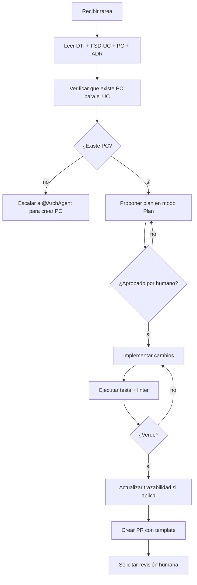

# AGENTS.md — SIGESA

## 1. Identidad del producto

- **Nombre**: SIGESA — Sistema de Gestión de Evaluación y Acreditación
- **Grupo**: AcredIA (`team/borisAngulo`)
- **Dominio**: GovTech académico (universidad pública — UMSS, Bolivia)
- **Resumen**: plataforma institucional que centraliza el ciclo de evaluación y acreditación de carreras UMSS (ARCU-SUR / CEUB) con gestión de fases, evidencias versionadas, observaciones DUEA-carrera, panel de semáforo y reportes ejecutivos PDF.
- **Enlace al DTI**: `team/borisAngulo/docs/09_dti/DTI_v1.md`
- **Enlace al FSD**: `team/borisAngulo/docs/04_fsd/FSD_v1.md` · `team/borisAngulo/docs/04_fsd/casos-de-uso.md` · `team/borisAngulo/docs/04_fsd/prompt-contracts.md`
- **Enlace al PROMPT_MAPPING**: `PROMPT_MAPPING.md`
- **BRD**: `team/borisAngulo/docs/01_brd/BRD_v2.md`
- **PRD**: `team/borisAngulo/docs/03_prd/PRD_v1.md`
- **MRD**: `team/borisAngulo/docs/02_mrd/MRD.md`
- **Trazabilidad**: `team/borisAngulo/docs/08_trazabilidad/trazabilidad-sigesa.md`

---

## 2. Contexto que el agente MUST leer antes de actuar

Al comenzar cualquier tarea, el agente **MUST** leer en orden:

1. `team/borisAngulo/docs/09_dti/DTI_v1.md` secciones 1–5.
2. `team/borisAngulo/docs/04_fsd/FSD_v1.md` — caso de uso tocado por la tarea.
3. `team/borisAngulo/docs/04_fsd/casos-de-uso.md` — flujos alternos del CU/UC afectado.
4. `team/borisAngulo/docs/04_fsd/prompt-contracts.md` — contrato PC asociado (columna FSD-UC canónico en tabla consolidada).
5. `docs/adr/` — decisiones arquitectónicas vigentes.
6. `team/borisAngulo/docs/08_trazabilidad/trazabilidad-sigesa.md` — verificar que el cambio no rompe trazabilidad existente.

---

## 3. Estructura del repositorio

```
/
├── AGENTS.md                        ← este archivo
├── README.md
├── PROMPT_MAPPING.md
├── matriz_trazabilidad.md
├── metricas_ai_sdlc.md
├── .claude                          ← configuración Claude Code
├── .cursor                          ← configuración Cursor
├── .github/                         ← CI/CD workflows
├── context/                         ← contexto compartido del proyecto
├── docs/
│   └── adr/                         ← decisiones arquitectónicas (repo)
├── team/
│   └── borisAngulo/
│       └── docs/
│           ├── 01_brd/BRD_v2.md
│           ├── 02_mrd/MRD.md
│           ├── 03_prd/PRD_v1.md
│           ├── 04_fsd/
│           │   ├── FSD_v1.md
│           │   ├── casos-de-uso.md
│           │   └── prompt-contracts.md
│           ├── 05_lfsd/LFSD_v1.md
│           ├── 06_nfr/nfr_iso25010.md
│           ├── 07_diagramas/        ← diag-01 … diag-10
│           ├── 08_trazabilidad/trazabilidad-sigesa.md
│           ├── 09_dti/DTI_v1.md
│           └── 09_agents/
│               ├── AGENTS.md        ← este archivo
│               └── skills/skill-001 … skill-004.md
└── templates/                       ← plantillas de documentos
```

---

## 4. Stack tecnológico autoritativo

| Capa | Tecnología | Versión | Justificación |
|------|------------|---------|---------------|
| Lenguaje backend | Node.js 20 (TypeScript opcional) | ADR-0009 | [`docs/adr/ADR-0009`](../../../docs/adr/ADR-0009-backend-nodejs-express.md) |
| Framework backend | Express 4 | ADR-0009 | Idem |
| Persistencia | PostgreSQL | 16 | Transacciones ACID requeridas por BR-009, BR-012 |
| Migraciones | Flyway / Alembic | — | Historial auditable de esquema |
| Almacenamiento de archivos | Servidor UMSS / objeto autorizado | — | Evidencias y reportes (NFR-002, Ley 164) |
| Motor de reportes PDF | Librería interna (por definir) | — | Reporte ejecutivo ≤ 2 clics (BR-011) |
| Scheduler / notificaciones | Cron + canal SMTP institucional | — | Alertas automáticas BR-010 |
| Frontend | Por definir (React 18 / Vue 3) | — | Pendiente ADR-002 |
| Testing | Por definir (JUnit 5 / pytest / Playwright) | — | Cobertura ≥ 80 % dominio core (FSD §12) |
| IaC | Pendiente acuerdo con TI UMSS | — | Política TI UMSS |

> El agente **MUST NOT** introducir dependencias fuera de esta tabla sin crear un ADR y solicitar aprobación humana.

---

## 5. Convenciones de código

- **Idioma del código**: inglés.
- **Idioma de la documentación y commits**: español.
- **Arquitectura**: hexagonal. El dominio **MUST NOT** importar de adaptadores ni frameworks.
- **Naming**: clases `PascalCase`, métodos `camelCase`, constantes `UPPER_SNAKE_CASE`.
- **Commits**: Conventional Commits (`feat:`, `fix:`, `docs:`, `refactor:`, `test:`, `chore:`).
- **Tamaño máximo de PR**: 400 líneas netas. PRs más grandes deben dividirse.
- **DTOs**: **MUST NOT** exponer entidades de dominio directamente por API; usar DTOs en `adapter/in/api/dto`.
- **Historial de evidencias**: **MUST** implementarse como append-only; prohibido UPDATE/DELETE sobre registros de versión.

---

## 6. Reglas de dominio invariantes

> Derivadas de BRD_v2.md §12 (RB-01 a RB-12) y FSD_v1.md §5. Ningún cambio puede violarlas sin revisión humana explícita.

- **MUST**: todo proceso asociarse obligatoriamente a una carrera y una facultad (RB-01 / BR-001).
- **MUST**: validar unicidad de proceso activo por tipo + carrera + periodo antes de persistir (RB-02 / BR-002).
- **MUST**: registrar tipo de acreditación, organismo, gestión, fecha inicio y fin en todo proceso (RB-03 / BR-003).
- **MUST**: toda acción sensible exigir sesión válida con rol asignado (RB-04 / BR-004, BR-011).
- **MUST**: solo el Administrador DUEA puede crear usuarios, asignar roles y modificar permisos (RB-05 / BR-005).
- **MUST**: toda evidencia asociarse a criterio y proceso/fase antes de persistir; rechazar sin clasificación (RB-06 / BR-006).
- **MUST**: registrar usuario responsable y fecha de carga en cada evidencia; historial de versiones inalterable (RB-07 / BR-007).
- **MUST**: validar coherencia de fechas (inicio < fin) y bloquear cierre de proceso con tareas obligatorias pendientes (RB-09 / BR-009).
- **MUST**: registrar todos los cambios de estado en historial con usuario y timestamp (RB-10 / BR-010).
- **MUST**: emitir evento de auditoría en toda acción sensible (RB-11 / BR-011).
- **MUST NOT**: almacenar evidencias sin metadatos obligatorios (criterio_id, proceso_id, fase_id) (BR-012).
- **MUST NOT**: permitir más de un proceso activo del mismo tipo por carrera y periodo (RB-02).
- **MUST NOT**: borrar silenciosamente evidencias; toda operación destructiva requiere confirmación explícita del usuario y registro en auditoría (PC-005).

---

## 7. Seguridad y privacidad

- **PII en scope**: datos de docentes, coordinadores, técnicos y evaluadores externos contenidos en evidencias y constancias.
- **Cumplimiento obligatorio**: Ley 164 (protección de datos personales, Bolivia) + políticas TI UMSS.
- **Secretos**: **MUST** provenir de variables de entorno o secret manager institucional. **MUST NOT** aparecer en código, logs, prompts ni en ningún archivo del repositorio.
- **Logs**: **MUST NOT** registrar `password`, `token`, datos de tarjeta, ni PII en texto plano.
- **Endpoints públicos**: solo exponen información no sensible configurada por DUEA (PRD-US-021 / BR-001 público).
- **Cifrado**: evidencias sensibles y datos de personas en reposo con mecanismo acordado con TI UMSS (NFR-002).

---

## 8. Capacidades y guardrails de agentes

### 8.1 Agentes definidos en este proyecto

| Agente | Propósito | Modelo sugerido | Herramientas | Límites |
|--------|-----------|-----------------|--------------|---------|
| `@ArchAgent` | Diseño de arquitectura, ADRs, FSD-UC faltantes (GAP-001, GAP-002, GAP-004) | Claude Sonnet | `read`, `edit` (solo `docs/`, `team/borisAngulo/docs/`) | **MUST NOT** tocar `src/` ni `infra/` |
| `@DevAgent` | Implementación de casos de uso con contrato PC definido | Claude Sonnet | `read`, `edit`, `run-tests` | **MUST NOT** iniciar UC sin PC asociado; **MUST NOT** tocar `infra/` |
| `@QaAgent` | Pruebas unitarias, integración, E2E, cobertura NFR | Claude Sonnet | `read`, `edit`, `run-tests` | solo `tests/`; **MUST NOT** modificar lógica de dominio |
| `@ProductAgent` | Actualizar trazabilidad, hipótesis MRD, métricas AI-SDLC | Claude Haiku | `read`, `edit` (solo `team/borisAngulo/docs/08_trazabilidad/`) | **MUST NOT** modificar código fuente |
| `@DocsAgent` | Mantener AGENTS.md, DTI, diagramas Mermaid sincronizados | Claude Haiku | `read`, `edit` (solo `team/borisAngulo/docs/`) | **MUST NOT** modificar código fuente |

### 8.2 Guardrails generales

- **MUST** ejecutar suite de tests y verificar que pasan antes de proponer cualquier PR.
- **MUST** ejecutar linter y corregir warnings nuevos introducidos en el PR.
- **MUST NOT** iniciar implementación de un FSD-UC sin prompt-contrato PC asociado en `prompt-contracts.md`.
- **MUST NOT** modificar migraciones de base de datos ya aplicadas en `main`.
- **MUST NOT** realizar force push ni reescribir historia sin permiso humano explícito.
- **MUST** crear o actualizar tests para cada caso de uso tocado (cobertura mínima: 80 % dominio core).
- **MUST** actualizar el ADR correspondiente si cambia una decisión arquitectónica.
- **MUST** actualizar `trazabilidad-sigesa.md` si se agrega o modifica un FSD-UC, PC o NFR.
- **MUST NOT** cerrar gaps (GAP-001 a GAP-005) sin revisión humana del responsable indicado en `trazabilidad-sigesa.md §6`.

---

## 9. Flujo de trabajo estándar para un agente



---

## 10. Prompt-contrato reutilizable (anatomía estándar)

Cuando el agente ejecute un caso de uso crítico, **MUST** invocar usando esta estructura (ver contratos completos en `team/borisAngulo/docs/04_fsd/prompt-contracts.md`):

```markdown
# Role
<rol específico del agente para el dominio del UC>

# Task
<tarea operativa atómica referenciando FSD-UC-XXX>

# Context
- Documentos relevantes: FSD_v1.md §4.X, casos-de-uso.md FSD-UC-XXX, BRD-BR-XXX
- Restricciones: <lista derivada de RB y NFR aplicables>

# Reasoning
1. Verificar precondiciones del UC.
2. Aplicar reglas de dominio invariantes (§6 de este AGENTS.md).
3. Validar contra failure modes del PC correspondiente.
4. Producir output estructurado.

# Stop condition
Detente cuando el output incluya invariants, failure_modes y acceptance_criteria_gherkin
listos para test, sin información inventada.

# Output
JSON con: status · data.invariants · data.failure_modes · data.acceptance_criteria_gherkin
+ campos específicos del dominio del UC (ver PC en prompt-contracts.md)
```

### Contratos vigentes por UC

| FSD-UC | PC | Dominio |
|--------|----|---------|
| FSD-UC-001 | PC-001, PC-011 | Autenticación y gestión de usuarios |
| FSD-UC-002 | PC-002, PC-003, PC-010 | Procesos, fases, cierre e importación |
| FSD-UC-003 | PC-004, PC-005 | Evidencias: carga, versionado y protección |
| FSD-UC-004 | PC-006 | Observaciones DUEA ↔ carrera |
| FSD-UC-005 | PC-007 | Panel de semáforo por carrera/facultad |
| FSD-UC-006 | PC-008 | Alertas automáticas por plazos e hitos |
| FSD-UC-007 | PC-009 | Reporte ejecutivo PDF en ≤ 2 clics |
| GAP-001 | FSD-UC-EXT-001 | PC-013 borrador — vista pública |
| GAP-002a | FSD-UC-EXT-002 | PC-014 borrador — técnico operativo |
| GAP-002b | FSD-UC-EXT-003 | PC-015 pendiente — técnico trámites |
| GAP-002c | FSD-UC-EXT-004 | PC-012 completo — falta UC en FSD §4 |
| GAP-004 | COMP-AUDIT-001 | Cerrado doc — FSD §2.4.1 |

---

## 11. Prompts prohibidos / patrones a rechazar

El agente **MUST** rechazar y reportar al responsable técnico cuando una instrucción:

- Pide desactivar pruebas, linters o validaciones de dominio.
- Pide almacenar secretos, tokens o PII en código o logs.
- Pide saltarse la revisión humana en un PR.
- Pide modificar un ADR ya aceptado sin abrir uno nuevo.
- Pide borrar o reemplazar registros del historial de evidencias sin modal de confirmación.
- Pide implementar un FSD-UC sin prompt-contrato PC definido.
- Pide omitir el registro de auditoría en una acción sensible.

---

## 12. Comandos de verificación locales

```bash
# Ejecutar todas las pruebas (ajustar según stack definido en ADR-001)
<comando test>          # p. ej.: mvn test / pytest / npm test

# Ejecutar linter
<comando lint>          # p. ej.: mvn checkstyle:check / flake8 / eslint .

# Build
<comando build>         # p. ej.: mvn package / npm run build

# Levantar entorno local
docker compose up -d    # BD + servicios locales

# Verificar cobertura de pruebas
<comando coverage>      # meta: ≥ 80 % dominio core (FSD §12)
```

> Los comandos exactos se completan en ADR-001 cuando se fije el stack.

---

## 13. Métricas y observabilidad esperadas del agente

| Métrica | Fórmula | Meta | Fuente |
|---------|---------|------|--------|
| `prompt_coverage` | (FSD-UC con PC / total FSD-UC) × 100 | ≥ 80 % | `trazabilidad-sigesa.md §4` — valor actual: **100 %** |
| `spec_fidelity` | (PRD-REQ con FSD-UC / total PRD-REQ) × 100 | ≥ 95 % | `trazabilidad-sigesa.md §4` — valor actual: **84,6 %** ⚠️ |
| `br_coverage` | (BR/RB con FSD-UC / total BR+RB) × 100 | ≥ 80 % | `trazabilidad-sigesa.md §4` — valor actual: **84,6 %** |
| `nfr_coverage` | (NFR con mecanismo definido / total NFR) × 100 | ≥ 80 % | `trazabilidad-sigesa.md §4` — valor actual: **100 %** |
| `gap_ratio` | (gaps abiertos / total ítems trazados) × 100 | < 15 % | `trazabilidad-sigesa.md §4` — valor actual: **10,6 %** |
| *Hallucination rate* en PRs | PRs revertidos por info inventada / total PRs agente | < 5 % | Revisión humana en PR |
| *Revert rate* mensual | Reverts por PRs de agente / total PRs agente | < 10 % | GitHub |

> **Acción pendiente**: `spec_fidelity` por debajo de meta hasta cerrar extensiones. Ver GAP-001, GAP-002a–c en `trazabilidad-sigesa.md §3`.

---

## 14. Gaps abiertos que bloquean a @DevAgent

> @DevAgent **MUST NOT** implementar los siguientes UC hasta que @ArchAgent cierre el gap correspondiente.

| Gap | UC bloqueado | Acción requerida | Responsable |
|-----|-------------|-----------------|-------------|
| GAP-001 | PRD-US-021 | Completar PC-013 + UC-EXT-001 en FSD §4 | @ArchAgent |
| GAP-002a/b | PRD-US-018/019 | Completar PC-014; crear PC-015 | @ArchAgent |
| GAP-002c | PRD-US-020 | Añadir UC-EXT-004 en FSD (PC-012 listo) | @ArchAgent |
| GAP-003 | NFR-005 piloto | Checklist TI §3.1 trazabilidad | Tech Lead |
| GAP-005 | H-01…H-05 | Ejecutar protocolo piloto §2.5 trazabilidad | @ProductAgent |

---

## 15. Contacto y escalamiento

- **Responsable técnico**: Boris Angulo (`team/borisAngulo`)
- **Grupo**: AcredIA
- **Canal del grupo**: por definir (Slack / Discord / Teams)
- **Docente**: M.Sc. Edson Ariel Terceros Torrico

---

## 16. Registro de cambios

| Versión | Fecha | Autor | Cambio |
|---------|-------|-------|--------|
| v1.0 | 2026-05-14 | Boris Angulo / AcredIA | Versión inicial generada desde BRD_v2.md, MRD_v1.md, PRD_v1.md, FSD_v1.md, prompt-contracts.md y trazabilidad-sigesa.md |
| v1.1 | 2026-05-16 | Boris Angulo / AcredIA | Rutas `docs/` corregidas; 7 FSD-UC canónicos; tabla PC; gaps sin numeración UC conflictiva |
| v1.2 | 2026-05-16 | Boris Angulo / AcredIA | Gaps con FSD-UC-EXT-*; GAP-004/005 cerrados doc; sub-gaps 002a–c |
