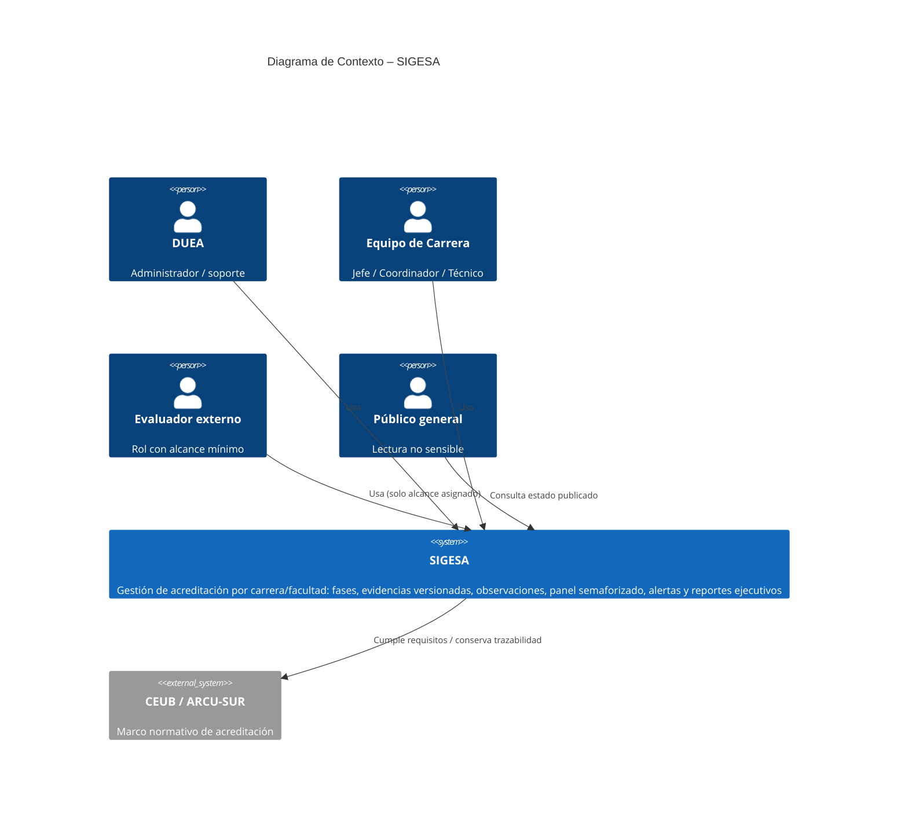
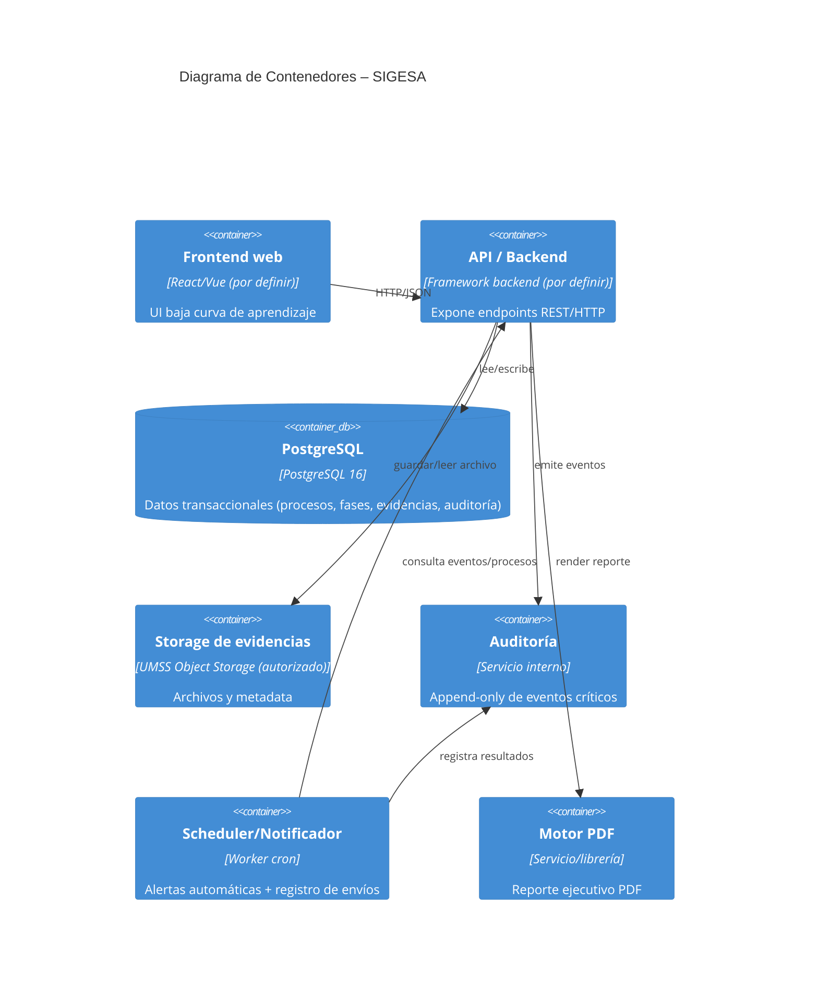
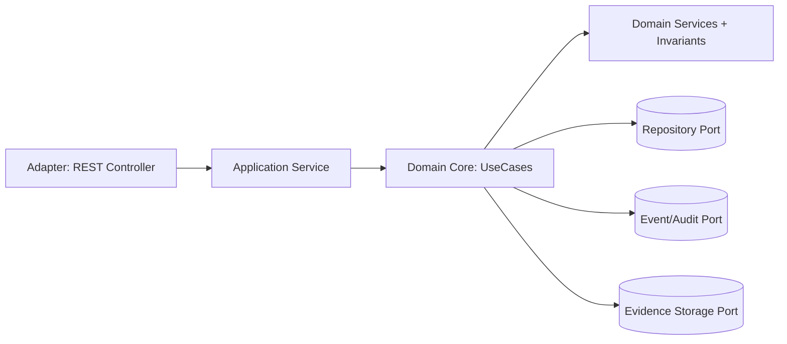
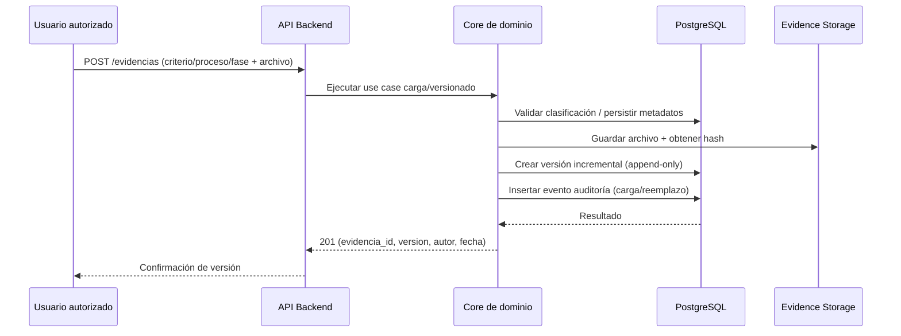
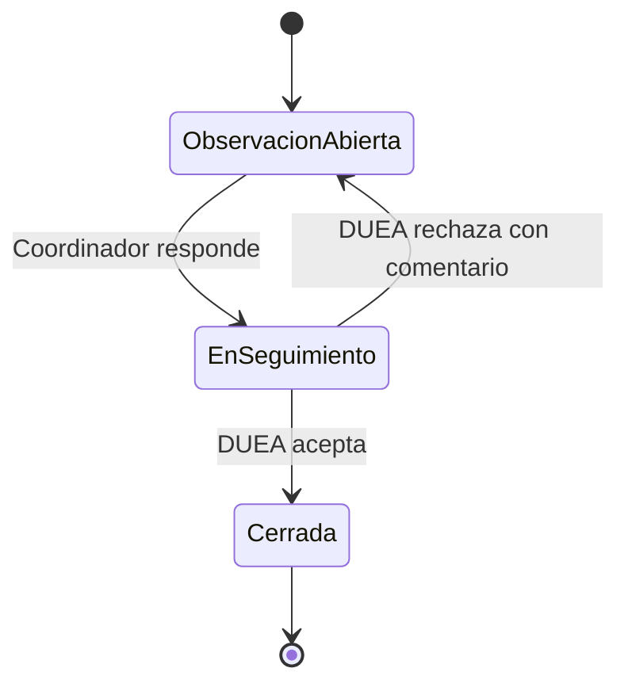
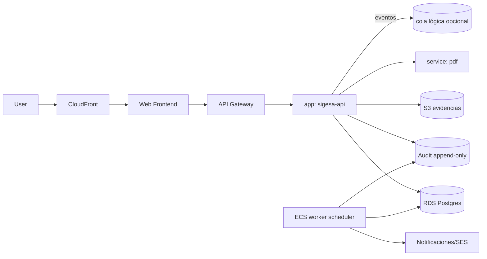

# Documento Técnico Inicial del Producto (DTI) – SIGESA v1

> **Propósito**: este documento es el **contrato técnico inicial** del producto. Debe ser legible tanto por ingenieros humanos como por agentes de IA.
> 
> **Audiencia dual**
> - **Humanos**: arquitectos, desarrolladores, QA, product managers.
> - **Agentes IA**: Claude, Cursor Agent, Copilot, agentes custom.
>
> **Regla de oro**: si una decisión arquitectónica significativa no está aquí (o referenciada desde aquí), no existe.

---

## 0. Metadatos

| Campo | Valor |
|-------|-------|
| Producto | SIGESA — Sistema de Gestión de Evaluación y Acreditación |
| Grupo | AcredIA (`team/borisAngulo`) |
| Versión | v1.0 |
| Fecha | 15/05/2026 |
| Arquitecto responsable | Boris Angulo |
| Stakeholders | DUEA (UMSS), jefaturas y coordinación de carrera, TI UMSS, CEUB / ARCU-SUR (cumplimiento), evaluadores externos (alcance acotado), público general (lectura no sensible) |
| Estado | En revisión |
| Repositorio | `<url>` |
| Enlace al BRD | `team/borisAngulo/docs/01_brd/BRD_v2.md` |
| Enlace al MRD | `team/borisAngulo/docs/02_mrd/MRD.md` |
| Enlace al PRD | `team/borisAngulo/docs/03_prd/PRD_v1.md` |
| Enlace al FSD | `team/borisAngulo/docs/04_fsd/FSD_v1.md` |
| Enlace a `AGENTS.md` | `e:/sigesa-docs/AGENTS.md` |
| Enlace a `PROMPT_MAPPING.md` | `e:/sigesa-docs/PROMPT_MAPPING.md` |

---

## 1. Visión del Producto (1 página)

- **Problema**: la UMSS gestiona acreditación mediante herramientas dispersas (Excel aislados, correo, pendrives, mensajería) que generan pérdida de trazabilidad, duplicidad y retrasos en plazos; el dolor más fuerte es localizar la **versión final aceptada** entre canales.
- **Usuarios objetivo**: DUEA (administrador y soporte operativo), jefaturas/coordinación de carrera y técnicos, evaluadores externos con alcance mínimo, público general en lectura no sensible.
- **Propuesta de valor**: SIGESA centraliza el ciclo de acreditación por carrera/facultad con **fases**, **actividades trazables**, **evidencias versionadas** por criterio, **flujo de observaciones** y **panel semaforizado** + **alertas automáticas** por hitos.
- **Métricas de éxito del producto** (validación piloto):
  - **North Star**: % de procesos activos con evidencias críticas trazables y al día según cronograma — **meta ≥ 80%**.
  - Secundarias:
    - Cumplimiento de fechas límite de fases — **mejora ≥ 20%**.
    - Tiempo medio de tareas clave (cargar evidencia, revisar estado, generar reporte ejecutivo) — **reducción ≥ 25%**.
    - Satisfacción (Likert) — **≥ 4/5**.
- **Restricciones de negocio** clave**: cumplimiento **Ley 164 (PII)**, gobernanza UMSS, alcance MoSCoW (v1.0 sin pagos en línea ni motor completo de matrices; auditoría por eventos sí aplica).

---

## 2. Contexto del Sistema

### 2.1 Diagrama C4 – Nivel 1 (Contexto)



### 2.2 Actores externos y dependencias

| Actor / Sistema | Tipo | Dirección | Criticidad |
|-----------------|------|-----------|------------|
| Identidad institucional UMSS (SSO/LDAP/cuentas) | externo | entrada | alta |
| Canal de notificaciones (SMTP institucional o equivalente) | externo | salida | media |
| Almacenamiento de objetos / archivos (servidor UMSS o autorizado) | externo | entrada/salida | media |
| Motor de generación PDF | externo | entrada/salida | media |
| TI UMSS (políticas, monitoreo, DRP) | externo | gobierno | alta |
| CEUB / ARCU-SUR (marco normativo) | externo | restricciones de negocio | alta |

---

## 3. Arquitectura de Alto Nivel

### 3.1 Estilo arquitectónico adoptado

- **Estilo**: **Clean Architecture + Hexagonal** en el core (dominio) con adaptadores hacia infraestructura.

> **Justificación**: el dominio requiere invariantes estrictas (RB-01..RB-12), auditoría por eventos y control de acceso por roles. El core debe ser independiente de frameworks y del almacenamiento de archivos para mantener trazabilidad, seguridad y consistencia a través de múltiples adaptadores (API, persistencia, mensajería, PDF). El equipo necesita evolución incremental (v1.0 MVP y backlog posterior) sin romper invariantes; Clean/Hexagonal reduce acoplamiento y favorece pruebas y contratos.

> **ADR**: crear/usar `docs/adr/0001-estilo-arquitectonico.md` (pendiente en repo).

### 3.2 Diagrama C4 – Nivel 2 (Contenedores)



### 3.3 Diagrama C4 – Nivel 3 (Componentes) del módulo crítico



### 3.4 Data Flow Diagram del caso de uso más crítico

Caso crítico (en v1.0): **FSD-UC-003** (carga/versionado de evidencias).



---

## 4. Modelo de Dominio

### 4.1 Bounded Contexts

| Contexto | Responsabilidad | Entidades principales | Tipo de integración |
|----------|-----------------|-----------------------|---------------------|
| Auth & Governance | roles, sesiones y control de acceso | Usuario, Rol, Permiso, Sesión | síncrona |
| Accreditation Process | procesos, fases y actividades con reglas | Proceso, Fase, Actividad | síncrona |
| Evidence Management | evidencias versionadas y clasificación por criterio | Evidencia, Criterio, Versión, Hash | síncrona |
| Observations Workflow | observaciones DUEA ↔ carrera con estados | Observación, Respuesta | síncrona/async (notifs) |
| Reporting | consolidación para reporte ejecutivo | ReportSnapshot (conceptual) | síncrona |
| Audit & Events | auditoría append-only por eventos | EventoAuditoría | síncrona/async |

### 4.2 Entidades, Value Objects y Aggregates

| Tipo | Nombre | Invariantes | Ciclo de vida |
|------|--------|-------------|---------------|
| Aggregate Root | Proceso | asociado a carrera/facultad (RB-01);unicidad proceso activo por tipo+carrera+periodo (RB-02); fechas coherentes (RB-09); cierre bloqueado si pendientes (RB-09) | creación → fases/actividades → cierre → archivado |
| Entity | Fase | pertenece a proceso; estado y orden de fases | creado por admin → avanza con actividades |
| Entity | Actividad | pertenece a fase; responsable/estado; contribuye a avance | create/update dentro del ciclo |
| Aggregate Root | Evidencia (con historial) | no persistir sin clasificación (RB-06); historial inalterable (RB-07, BR-007); versionado incremental | borrador → versionado → reemplazo confirmado → archivado histórico |
| Entity | Observación | creada por DUEA; estados abierta/en_seguimiento/cerrada | abierta → respondida → cerrada ↔ reabierta |
| Value Object | FechaInicio/FechaFin | inicio < fin | validado al crear/editar |
| Value Object | IdentificadorCriterio | criterio existe y aplica al proceso | validado al guardar evidencia |

### 4.3 DTOs principales

| DTO | Uso (capa) | Campos | Mapeo a entidad |
|-----|------------|--------|-----------------|
| AuthLoginRequestDTO | API → App | email, password/SSO token | Usuario/Sesión |
| ProcessCreateRequestDTO | API → App | carrera_id, facultad_id, tipo_acreditacion, organismo, gestion_anio, fecha_inicio, fecha_fin | Proceso |
| EvidenceUploadRequestDTO | API → App | criterio_id, proceso_id, fase_id, archivo (multipart) | Evidencia (nueva versión) |
| ObservationCreateRequestDTO | API → App | proceso_id, fase_id, detalle | Observación |
| ReportExecutiveRequestDTO | API → App | proceso_id | ReportSnapshot |

---

## 5. Arquitectura Hexagonal del core

### 5.1 Puertos (Ports)

| Puerto | Tipo (*input*/*output*) | Definido en | Propósito |
|--------|--------------------------|-------------|-----------|
| `AuthenticateUseCase` | input | `domain/port/in` | autenticación y decisión por rol |
| `CreateProcessUseCase` | input | `domain/port/in` | creación de proceso + fases iniciales |
| `UploadEvidenceUseCase` | input | `domain/port/in` | carga + versionado evidencias |
| `ObservationWorkflowUseCase` | input | `domain/port/in` | crear/responder/cerrar observaciones |
| `ProcessRepositoryPort` | output | `domain/port/out` | persistencia de procesos/fases/actividades |
| `EvidenceRepositoryPort` | output | `domain/port/out` | append-only de versiones + metadatos |
| `AuditEventPort` | output | `domain/port/out` | insertar eventos auditoría |
| `EvidenceStoragePort` | output | `domain/port/out` | guardar archivo + hash |
| `PdfReportPort` | output | `domain/port/out` | render de reporte ejecutivo |

### 5.2 Adaptadores (Adapters)

| Adaptador | Implementa | Tecnología | Ubicación (propuesta) |
|-----------|-----------|------------|------------------------|
| `AuthRestController` | AuthenticateUseCase | REST + framework backend | adapter/in/web/controller |
| `ProcessRestController` | CreateProcessUseCase | REST | adapter/in/web/controller |
| `EvidenceRestController` | UploadEvidenceUseCase | REST | adapter/in/web/controller |
| `EvidenceJpaRepository` | EvidenceRepositoryPort | Spring Data JPA / SQLAlchemy | adapter/out/persistence/repository |
| `EvidenceMapper` | entity ↔ domain | mapeadores | adapter/out/persistence/mapper |
| `AuditAppendOnlyAdapter` | AuditEventPort | persistencia append-only | adapter/out/persistence/audit |
| `SchedulerWorker` | consume/ejecuta alertas | cron + worker | worker/scheduler |
| `PdfAdapter` | PdfReportPort | librería interna/servicio | adapter/out/report/pdf |

### 5.3 Diagrama de puertos y adaptadores

```mermaid
flowchart LR
  subgraph in[Adapters in]
    A[REST Controller]
    B[Event Listener (notifs/inputs)]
  end
  subgraph core[Domain Core]
    C((Use Cases))
    D[[Domain Services + Invariants]]
  end
  subgraph out[Adapters out]
    E[(Repository Port: Process/Evidence)]
    F[(Audit Port: append-only)]
    G[(Storage Port: evidence files)]
    H[(PDF Port: executive report)]
  end
  A --> C
  B --> C
  C --> E
  C --> F
  C --> G
  C --> H
```

---

## 6. Arquitectura Distribuida (si aplica)

### 6.1 Microservicios y responsabilidades

v1.0 se implementa como **monolito modular** (recomendación para acelerar MVP) o módulos desplegados como **servicios separados** solo si TI requiere. El core mantiene invariantes; los adaptadores son los que se despliegan.

| Servicio | Responsabilidad | Datos propios | API expuesta |
|----------|-----------------|---------------|--------------|
| `sigesa-api` | orquesta operaciones HTTP | compartidos en DB | REST |
| `sigesa-worker` | scheduler/notificador | shared DB + auditoría | none (interno) |
| `sigesa-pdf` | render PDF | none/archivos | internal |

### 6.2 Patrones de resiliencia aplicados

| Patrón | Dónde | Configuración |
|--------|-------|---------------|
| Retry + backoff | envíos de alertas (canal SMTP) | hasta 3 intentos, exponencial |
| Circuit breaker | llamadas internas a `pdf` | failure threshold configurable |
| Idempotencia | alertas deduplicadas por ventana | unique key: (proceso_id, ventana) |

---

## 7. Arquitectura Asíncrona / Event-Driven

### 7.1 Catálogo de eventos

| Evento | Productor | Consumidor(es) | Payload (schema) | Garantía |
|--------|-----------|------------------|------------------|----------|
| `EVIDENCE_UPLOADED` | API backend | audit, (opcional) analytics | `{evidence_id, version, user_id, criterio_id, timestamp}` | at-least-once |
| `EVIDENCE_REPLACED_CONFIRMED` | API backend | audit | `{evidence_id, new_version, old_version, user_id, timestamp}` | at-least-once |
| `OBSERVATION_CREATED` | API backend | worker/notificador | `{obs_id, fase_id, proceso_id, user_id, timestamp}` | at-least-once |
| `ALERT_SENT` | worker | audit | `{proceso_id, window, destinatarios, status, timestamp}` | exactly-once *lógico* vía deduplicación |

### 7.2 Flujos de larga duración (sagas)

La saga principal es el flujo de observaciones y estados del proceso (DUEA ↔ carrera) con idempotencia por transición.



---

## 8. Despliegue – Cloud Native (AWS)

> Nota: el despliegue exacto en AWS depende de políticas TI UMSS. Aquí se documenta mapeo conceptual con servicios equivalentes.

### 8.1 Mapeo de componentes a servicios AWS

| Componente | Servicio AWS (equivalente) | Justificación |
|------------|------------------------------|--------------|
| API | ECS Fargate / EKS | control de permisos y escalado |
| Base de datos | RDS PostgreSQL | ACID + auditoría |
| Storage de evidencias | S3 | almacenamiento de archivos |
| Auditoría | tabla append-only en RDS | trazabilidad |
| Scheduler | EventBridge + Worker ECS / Lambda | alertas por ventanas |
| Notificaciones | SNS + email/SES o SMTP institucional | entrega de alertas |
| PDF | Servicio interno (container) | generación rápida |

### 8.2 Diagrama de despliegue (Mermaid)



### 8.3 Entornos

| Entorno | Región | Cuenta AWS | Propósito |
|---------|---------|------------|-----------|
| dev | por definir | por definir | desarrollo |
| stg | por definir | por definir | QA/UAT |
| prd | por definir | por definir | producción |

### 8.4 Estrategia de Disaster Recovery

- RPO objetivo: *por definir con TI.*
- RTO objetivo: *por definir con TI.*
- Estrategia elegida: **Backup-Restore** (por defecto, sujeto a ADR y TI).

---

## 9. Capa de IA / Agentes

v1.0 incluye IA como apoyo documental (contratos/prompt mapping) y como parte del pipeline de especificación; el core del producto no depende de IA para decisiones críticas.

### 9.1 Arquitectura agéntica

- Tipo (proyecto): *single-agent* (supervisor) + contratos ejecutables.
- Modelos usados (en proceso SDLC): Claude Sonnet/Haiku.
- Tree of models: *router* por etapa (especificación vs pruebas), no por runtime del sistema.

### 9.2 Agentes del sistema (en desarrollo)

| Agente | Rol | Herramientas (tools) | Guardrails | Observabilidad |
|--------|-----|----------------------|-------------|----------------|
| `@ArchAgent` | arquitectura/ADRs/gaps PC | read/edit docs | no tocar `src/`/infra | logs de PR |
| `@DevAgent` | implementación de UC con PC | run-tests | no iniciar sin PC | CI checks |
| `@QaAgent` | tests y NFR verificación | tests/ | cobertura mínima | cobertura, resultados |
| `@ProductAgent` | trazabilidad métricas AI-SDLC | docs | coherencia de métricas | revisión humana |

### 9.3 RAG y memoria

> En runtime del producto v1.0, el DTI no adopta RAG. Si se usa en iteraciones, requiere ADR y especificación de chunking/freshness.

### 9.4 Diagrama de la capa IA (SDLC)

```mermaid
flowchart LR
  Input --> Router{Router (SDLC)}
  Router -->|Arquitectura| Arch[@ArchAgent]
  Router -->|Implementación| Dev[@DevAgent]
  Router -->|QA| QA[@QaAgent]
  Arch --> OutputDocs[Docs: DTI/FSD/ADR]
  Dev --> OutputCode[Codigo + tests]
  QA --> OutputProof[Resultados de verificación]
```

---

## 10. Estrategia de Prompt Mapping

- El documento vive en `PROMPT_MAPPING.md` y se referencia aquí.
- Se mantiene trazabilidad artefacto ↔ prompt ↔ contrato ↔ caso de uso ↔ NFR.

| Artefacto | Prompts asociados | IDs |
|-----------|-------------------|-----|
| FSD-UC-001 | PC-001, PC-010 | PRD-US-001..003 |
| FSD-UC-002 | PC-002, PC-003 | PRD-US-004..009 |
| FSD-UC-003 | PC-004, PC-005 | PRD-US-010..012 |
| FSD-UC-004 | PC-006 | PRD-US-013..014 |
| FSD-UC-005 | PC-007 | PRD-US-015 |
| FSD-UC-006 | PC-008 | PRD-US-016 |
| FSD-UC-007 | PC-009 | PRD-US-017 |

---

## 11. NFRs Consolidados (espejo de FSD §10)

| ID | Categoría | Umbral | Mecanismo de verificación |
|----|-----------|--------|---------------------------|
| NFR-001 | Rendimiento | p95 < 3 000 ms | k6/Locust |
| NFR-002 | Seguridad | cifrado en tránsito + reposo + protección PII | auditoría legal + revisión configuraciones |
| NFR-003 | Auditoría | 100% endpoints sensibles con log append-only | tests de integraciones y revisión de logs |
| NFR-004 | Usabilidad | ≥ 25% mejora en tiempo/errores vs baseline | pruebas usabilidad |
| NFR-005 | Disponibilidad | uptime en horario crítico (umbral por acordar) | monitoreo |
| NFR-006 | Accesibilidad | WCAG 2.2 AA | axe-core/Lighthouse + checklist |
| NFR-007 | Disponibilidad ampliada | SLA por acordar con TI | monitoreo + reporte |

---

## 12. POCs Críticas

> Nota: se deben definir en `pocs/<id>/` siguiendo `plantillas/POC_TEMPLATE.md`. En el repo no existen POCs versionados en esta ruta para v1.0; quedan pendientes.

### 12.1 POC-101 — Rendimiento del panel y carga de evidencias

- **Riesgo que mitiga**: degradación de experiencia por latencia y consultas pesadas.
- **Hipótesis**: diseño con índices/queries optimizadas + caching breve mantiene p95 < 3s.
- **Criterio de éxito medible**: p95 < 3 000 ms en GET /panel y GET /evidencias con 50 VUs.
- **Alcance (scope reducido)**: solo endpoints panel y listado evidencias; dataset sintético.
- **Cronograma**: 7-10 días.
- **Resultado**: ✅/❌ (pendiente).

### 12.2 POC-102 — Auditoría append-only + resiliencia alertas

- **Riesgo que mitiga**: pérdida de trazabilidad o duplicación de alertas.
- **Hipótesis**: deduplicación por ventana + audit insert asegura consistencia.
- **Criterio de éxito medible**: 0 duplicados por ventana + inserción de auditoría para cada intento de envío.
- **Alcance (scope reducido)**: scheduler en staging con casos forzados (fallo canal, reintentos).
- **Cronograma**: 7-10 días.
- **Resultado**: ✅/❌ (pendiente).

---

## 13. Seguridad

- Modelo de amenazas (STRIDE resumido):
  - **Spoofing**: credenciales/SSO falsos → mitigación: autenticación obligatoria + token.
  - **Tampering**: manipulación de evidencias/estados → mitigación: core invariants + persistencia append-only + autorización por rol.
  - **Repudiation**: negación de acciones → mitigación: auditoría append-only (actor/timestamp).
  - **Information Disclosure**: fuga de PII → mitigación: políticas Ley 164, endpoints públicos no sensibles y cifrado.
  - **Denial of Service**: saturación panel → mitigación: NFR-001 + rate limiting (por definir en ADR).
  - **Elevation of Privilege**: rol mal asignado → mitigación: BR-005 (solo admin crea/edita roles) y tests de autorización.

- AuthN/AuthZ: autenticación requerida; autorización por roles (RB-04, RB-05).
- Gestión de secretos: secretos por variables de entorno/secret manager institucional (no en repositorio).
- Protección de datos: cifrado en tránsito y reposo; control de acceso a evidencia y metadatos.
- Seguridad específica de la capa IA (SDLC): prompt-contracts con guardrails; no usar IA para decisiones financieras/legales sin eventos reales.

---

## 14. Observabilidad

- Logs estructurados con `correlationId` (recomendado para endpoints sensibles).
- Métricas: latencia p95, tasa de errores, volumen de alertas y evidencias.
- Trazas distribuidas: OpenTelemetry (por definir en ADR).
- Dashboards/alertas mínimas (propuesta):
  - Latencia p95 panel/evidencias.
  - Error rate de API.
  - Estado del scheduler y tasa de fallos de envío.
  - Auditoría: fallos de append.
- Observabilidad de agentes IA (en SDLC): tokens/latencia de modelo no aplica en runtime; se mide por CI y cobertura.

---

## 15. DevOps y ciclo de vida

- Estrategia de branching: por definir (CI debe validar tests, cobertura y linter).
- CI/CD: pipelines para build, tests unit/integration, security scans (OWASP ZAP staging) y generación de artifacts.
- Estrategia de testing:
  - pirámide: unit domain → integración adaptadores → E2E.
  - contract testing para prompt-contratos (garantizar invariants/failure_modes).
- Releases: feature flags para capacidades Could (reportes amplios/asistente) si se habilitan.
- Rollback: rollback por despliegue seguro + restore de DB a punto válido (TI define).

---

## 16. Antipatrones auditados

| Antipatrón | ¿Se detectó? | Mitigación |
|------------|--------------|------------|
| Big Ball of Mud | no | modular por bounded context + puertos |
| God Service | no | límites por casos de uso + services de aplicación |
| Distributed Monolith | riesgo medio | core invariants + puertos; si distribuido, contratos asíncronos versionados |
| Chatty Services | no | BFF/consulta consolidada para panel (evitar N+1) |
| Data Swamp | no | data contracts (DTOs) + metadatos mínimos evidencias |

---

## 17. Trade-offs arquitectónicos

| Decisión | Opción elegida | Alternativas descartadas | Razones | Consecuencias |
|----------|----------------|--------------------------|---------|---------------|
| Persistencia | PostgreSQL | DynamoDB | transacciones ACID, auditoría consistente | replicación/lecturas con read replicas (si aplica) |
| MVP deploy | monolito modular | microservicios desde el inicio | acelerar v1.0 manteniendo invariantes | posible refactor posterior |
| Historial evidencias | append-only | update sobre versiones | trazabilidad y no borrado silencioso | crecimiento de almacenamiento; requiere archivado |

> ADRs deben existir por cada trade-off significativo en `docs/adr/`.

---

## 18. Riesgos técnicos

| Riesgo | Prob. | Impacto | Mitigación | Plan de contingencia |
|--------|-------|---------|------------|----------------------|
| Latencia del panel bajo carga | media | alto | optimizar queries + índices + pruebas k6 | limitar VUs o cache breve temporal |
| Auditoría append-only inconsistente | baja | alto | tests de integraciones + constraint DB | re-proceso de eventos en staging |
| Errores en autorizaciones por rol | media | alto | tests de permisos por matriz | hotfix con policy central |
| Resiliencia del canal de alertas | media | medio | retry/backoff + deduplicación | fallback: cola/manual de auditoría |

---

## 19. Roadmap técnico

- **Ahora (módulo 4)**: DTI v1 + POCs definidos; base de decisiones de arquitectura.
- **Siguiente módulo**: implementación core hexagonal + adaptadores (Auth/Process/Evidence/Observations/Reporting/Audit).
- **+2 módulos**: integración distribuida (worker/scheduler/pdfs) y despliegue con monitoreo completo.

---

## 20. Glosario y referencias

- **Referencias**: Clean Architecture (R. C. Martin), C4 Model (S. Brown), AWS Well-Architected, ISO/IEC 25010, Anthropic Claude docs (SDLC), OpenTelemetry.
- **Glosario**:
  - **Evidencia**: documento asociado a criterio y proceso/fase, con historial de versiones.
  - **Proceso**: ciclo de acreditación para una carrera/facultad y periodo.
  - **Fase**: etapa del proceso.
  - **Observación DUEA**: comentario formal con estado y vínculo a entregable/fase.
  - **Semáforo**: indicador visual de riesgo/estado en panel.

---

## 21. Registro de decisiones arquitectónicas (ADR)

> Usar `templates/ADR_TEMPLATE.md`. En este DTI se declaran al menos 3 ADRs; en repo deben existir.

| ADR | Título | Estado | Fecha |
|-----|--------|--------|-------|
| 0001 | Estilo arquitectónico hexagonal/Clean | Propuesta | 15/05/2026 |
| 0002 | Persistencia y auditoría append-only | Propuesta | 15/05/2026 |
| 0003 | Integración de alertas (scheduler) y deduplicación | Propuesta | 15/05/2026 |

---

## Checklist de entrega del DTI (30 % de la nota final)

- [x] Visión del producto + métricas de éxito.
- [x] Diagramas C4 niveles 1, 2 y 3 del módulo crítico.
- [x] Data flow diagram del caso de uso más crítico.
- [x] Modelo de dominio con aggregates/entities/VOs/DTOs.
- [x] Arquitectura hexagonal documentada.
- [x] Catálogo de microservicios/eventos (conceptual para v1.0 modular).
- [ ] Mapeo AWS con costo aproximado (pendiente de TI).
- [x] Capa de agentes IA/SDLC descrita.
- [x] NFRs con umbrales y verificación.
- [ ] 2 POCs críticas con criterio de éxito (pendiente migración de archivos pocs/).
- [x] Seguridad, observabilidad, DevOps cubiertos.
- [x] Antipatrones y trade-offs auditados.
- [ ] Al menos 3 ADRs registradas en docs/adr/ (pendiente).
- [ ] `AGENTS.md` sincronizado con este DTI (pendiente: ajustar enlace a docs/dti/DTI.md real).
- [ ] `PROMPT_MAPPING.md` sincronizado con artefactos del DTI (pendiente).

