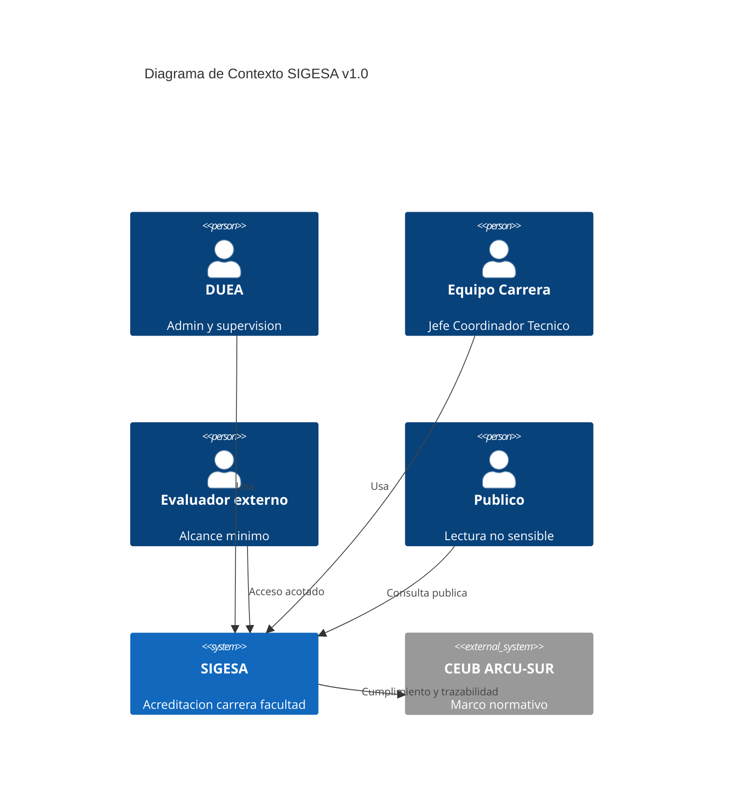
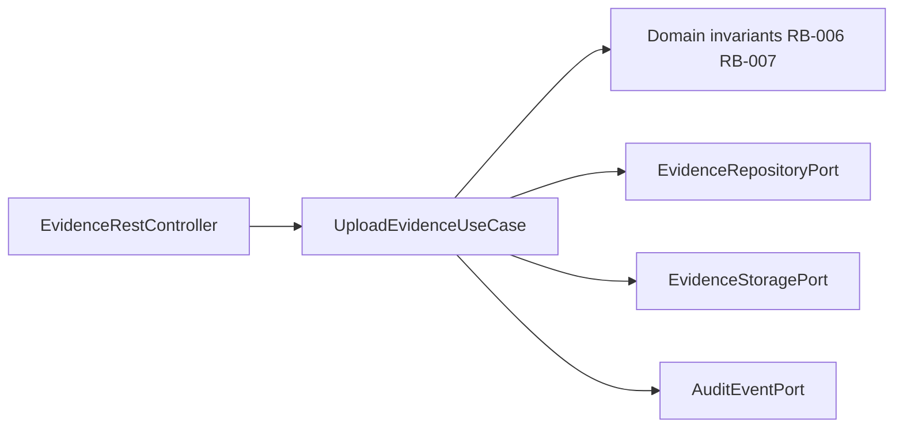

# Documento Técnico Inicial del Producto (DTI) – SIGESA v1.1

> **Propósito**: contrato técnico inicial del producto SIGESA para el equipo AcredIA (`team/borisAngulo`). Legible por humanos y agentes IA.
>
> **Regla de oro**: si una decisión arquitectónica significativa no está aquí (o referenciada), no existe para implementación v1.0.

---

## 0. Metadatos

| Campo | Valor |
|-------|-------|
| Producto | SIGESA — Sistema de Gestión de Evaluación y Acreditación |
| Grupo | AcredIA (`team/borisAngulo`) |
| Versión DTI | **v1.1** |
| Fecha | 16/05/2026 |
| Arquitecto responsable | Boris Angulo |
| Estado | En revisión |
| BRD | `team/borisAngulo/docs/01_brd/BRD_v2.md` |
| MRD | `team/borisAngulo/docs/02_mrd/MRD.md` |
| PRD | `team/borisAngulo/docs/03_prd/PRD_v1.md` |
| FSD | `team/borisAngulo/docs/04_fsd/FSD_v1.md` |
| LFSD | `team/borisAngulo/docs/05_lfsd/LFSD_v1.md` |
| NFR | `team/borisAngulo/docs/06_nfr/nfr_iso25010.md` |
| Diagramas | `team/borisAngulo/docs/07_diagramas/` (`diag-01` … `diag-10`) |
| Trazabilidad | `team/borisAngulo/docs/08_trazabilidad/trazabilidad-sigesa.md` |
| Agentes / Skills | `team/borisAngulo/docs/09_agents/AGENTS.md`, `skills/skill-001` … `skill-004` |
| ADRs (repo) | `docs/adr/ADR-0001-append-only-evidence-storage.md`, `ADR-0002-modular-monolith.md`, `ADR-0003-authentication-adapter.md` |
| AGENTS global | `AGENTS.md` (raíz) |
| PROMPT_MAPPING | `PROMPT_MAPPING.md` (raíz) |

---

## 1. Visión del producto

- **Problema**: acreditación UMSS fragmentada (Excel, correo, almacenamiento removible) → pérdida de trazabilidad y retrasos; dolor principal: localizar la **versión final aceptada** de una Evidencia.
- **Usuarios**: Administrador DUEA, jefatura/coordinación de carrera, técnicos operativos y de trámites, evaluador externo (alcance mínimo), público general (solo lectura no sensible).
- **Propuesta**: ciclo por carrera/facultad con **Fases**, **actividades**, **Evidencias versionadas** por criterio, **observaciones** DUEA–carrera, **panel semaforizado**, **alertas** y **reporte ejecutivo PDF** (≤ 2 clics).
- **North Star (BRD)**: % procesos activos con evidencias críticas trazables y al día — meta **≥ 80 %** en piloto.
- **Restricciones**: Ley 164 (PII), gobernanza UMSS; v1.0 sin pagos en línea ni motor completo de matrices; auditoría por **eventos append-only**.

---

## 2. Modelo canónico de casos de uso (reconciliación de IDs)

El repositorio del equipo usa **tres capas de identificadores**. El DTI y la implementación MUST usar la columna **FSD-UC (v1.0)** como referencia arquitectónica única.

| FSD-UC (v1.0) — **canónico** | Tareas FSD | CU (`casos-de-uso.md`) | PC (`prompt-contracts.md`) | Alcance MVP |
|------------------------------|------------|------------------------|----------------------------|-------------|
| **FSD-UC-001** | T-001 | CU-001 | PC-001, PC-010, PC-011 | Auth y roles |
| **FSD-UC-002** | T-002 | CU-002, CU-003, CU-004 | PC-002, PC-003 | Procesos, fases, cierre sin pendientes |
| **FSD-UC-003** | T-003 | CU-005, CU-006 | PC-004, PC-005 | Carga/versionado Evidencia + confirmación destructiva |
| **FSD-UC-004** | T-004 | CU-007, CU-008 | PC-006 | Observaciones DUEA ↔ carrera |
| **FSD-UC-005** | T-005 | CU-009 | PC-007 | Panel y semáforo |
| **FSD-UC-006** | T-006 | CU-010 | PC-008 | Alertas automáticas |
| **FSD-UC-007** | T-007 | CU-011 | PC-009 | Reporte ejecutivo PDF |
| — | — | CU-012 | COMP-AUDIT-001 | Auditoría transversal (GAP-004 cerrado doc) |
| **FSD-UC-EXT-001** | — | — | PC-013 | Vista pública (GAP-001) |
| **FSD-UC-EXT-002** | — | — | PC-014 | Técnico operativo (GAP-002a) |
| **FSD-UC-EXT-003** | — | — | PC-015 | Técnico trámites (GAP-002b) |
| **FSD-UC-EXT-004** | — | — | PC-012 | Evaluador externo (GAP-002c) |

> **Convención**: 7 **FSD-UC canónicos** (MVP v1.0) agrupan 12 **PC** granulares. Los encabezados de `prompt-contracts.md` usan `agrupa FSD-UC-00X canónico`; la tabla consolidada al final del archivo es la referencia de implementación.

### 2.1 Reconciliación documental (2026-05-16)

| # | Hallazgo | Estado |
|---|----------|--------|
| I-01 | Encabezados PC vs 7 FSD-UC canónicos | ✅ Resuelto en `prompt-contracts.md` |
| I-02 | Diagramas diag-02/03 con ID incorrecto | ✅ Comentarios `%%` → UC-003 y UC-004 |
| I-03 | Rutas obsoletas en `AGENTS.md` | ✅ Árbol y enlaces corregidos |
| I-04 | NFR DTI vs `nfr_iso25010.md` | ✅ Espejo en DTI §12 (10 NFR) |
| I-05 | `MRD_v1.md` en trazabilidad | ✅ → `MRD.md` |
| I-06 | BR-010 → panel (incorrecto) | ✅ → FSD-UC-002 en trazabilidad |
| I-07 | Métricas 7 vs 10 NFR | ✅ Trazabilidad §4 alineada |
| I-08 | `BR-05` en LFSD | ✅ → `BR-005` |
| I-09 | Rutas `e:/sigesa-docs/` | ✅ Rutas relativas §0 |

---

## 3. Contexto del sistema

### 3.1 C4 – Nivel 1 (contexto)

Ver también: `07_diagramas/c4-007-07-contenedores-sistema.mmd` (nivel contenedores).

### 3.2 Dependencias externas

| Sistema | Criticidad | Uso |
|---------|------------|-----|
| Identidad UMSS (SSO/LDAP) | Alta | FSD-UC-001 |
| PostgreSQL 16 | Alta | Transaccional + auditoría |
| Object storage UMSS | Media | Blobs de Evidencia |
| SMTP / notificaciones | Media | FSD-UC-006 |
| Motor PDF | Media | FSD-UC-007 |
| TI UMSS (DRP, políticas) | Alta | Despliegue y NFR-005 |

---

## 4. Arquitectura de alto nivel

### 4.1 Estilo

- **Clean Architecture + Hexagonal** (monolito modular v1.0).
- **ADR-0002**: monolito modular frente a microservicios prematuros.
- **ADR-0001**: Evidencia append-only (`evidence_version`, sin DELETE físico).
- **ADR-0003**: adaptador de autenticación institucional (local v1.0 → LDAP v1.1).
- **ADR-0004–0009**: storage, audit log, PostgreSQL, JWT/RBAC, taxonomías, runtime Node — ver [`docs/adr/README.md`](../../../docs/adr/README.md).

### 4.2 Contenedores

Fuente canónica: `c4-007-07-contenedores-sistema.mmd`.

| Contenedor | Tecnología | UC principales |
|------------|------------|----------------|
| Frontend web | React o Vue (ADR pendiente stack UI) | Todos |
| API Backend | Node.js 20 + Express 4 ([ADR-0009](../../../docs/adr/ADR-0009-backend-nodejs-express.md)) | UC-001 … UC-007 |
| PostgreSQL 16 | RDBMS ([ADR-0006](../../../docs/adr/ADR-0006-postgresql-16-primary-database.md)) | Proceso, Fase, Evidencia, auditoría |
| Storage evidencias | Volumen Docker ([ADR-0004](../../../docs/adr/ADR-0004-evidence-blob-storage-docker.md)) | UC-003 |
| Servicio auditoría | Append-only interno | Transversal RB-011 |
| Worker scheduler | Cron | UC-006 |
| Motor PDF | Servicio/librería | UC-007 |

### 4.3 Componentes – módulo crítico (Evidencia)

**Caso crítico v1.0**: **FSD-UC-003** (carga y versionado de Evidencia).

**Flujo de secuencia**: `07_diagramas/seq-002-02-evidencias.mmd` (actualizar etiqueta a FSD-UC-003).

### 4.4 Flujo de cierre de proceso

`07_diagramas/flow-008-08-cierre-proceso-pendientes.mmd` — FSD-UC-002, BR-009, CU-004.

---

## 5. Modelo de dominio

### 5.1 Bounded contexts

| Contexto | Entidades | UC |
|----------|-----------|-----|
| Auth & Governance | Usuario, Rol, Sesión | UC-001 |
| Accreditation Process | Proceso, Fase, Actividad | UC-002 |
| Evidence Management | Evidencia, Criterio, Versión, Hash | UC-003 |
| Observations Workflow | Observación, Respuesta | UC-004 |
| Reporting | Panel, ReportSnapshot | UC-005, UC-007 |
| Notifications | Alerta, Ventana deduplicación | UC-006 |
| Audit & Events | EventoAuditoría | Transversal |

Diagrama de clases: `class-009-09-dominio-agregados.mmd`.

### 5.2 ER físico (resumen)

Diagrama completo: `er-005-05-modelo-datos.mmd`. Reglas: append-only en versiones de Evidencia; `LOG_AUDITORIA` para RB-011.

### 5.3 Estados

- Proceso: `state-002-04a-proceso.mmd` (BR-008, BR-009, BR-010).
- Observación y Evidencia: `state-003-04b-obs-evidencia.mmd`.

---

## 6. Arquitectura hexagonal

### 6.1 Puertos de entrada (use cases)

| Puerto | FSD-UC |
|--------|--------|
| `AuthenticateUseCase` | UC-001 |
| `CreateProcessUseCase` / `CloseProcessUseCase` | UC-002 |
| `UploadEvidenceUseCase` | UC-003 |
| `ObservationWorkflowUseCase` | UC-004 |
| `GetAccreditationDashboardUseCase` | UC-005 |
| `ScheduleDeadlineAlertsUseCase` | UC-006 |
| `GenerateExecutiveReportUseCase` | UC-007 |

### 6.2 Puertos de salida

| Puerto | Política |
|--------|----------|
| `ProcessRepositoryPort` | ACID |
| `EvidenceRepositoryPort` | Solo INSERT en versiones |
| `EvidenceStoragePort` | Hash + URL |
| `AuditEventPort` | Append-only |
| `NotificationPort` | Retry + deduplicación |
| `PdfReportPort` | Degradación graceful (NFR-006) |

### 6.3 Skills operativas del equipo

| Skill | Uso |
|-------|-----|
| `skill-001` | Implementar UC con PC en hexagonal |
| `skill-002` | Generar PC para cerrar GAPs |
| `skill-003` | Diagramas en `07_diagramas/` |
| `skill-004` | Módulo panel/alertas/PDF (UC-005–007) |

---

## 7. Reglas de dominio (invariantes técnicas)

Derivadas de BRD §11–12 y FSD §5. Prefijos: **BR-** (negocio), **RB-** (restricción).

| ID | Invariante | UC |
|----|-----------|-----|
| BR-001 / RB-01 | Proceso ligado a carrera y facultad | UC-002 |
| BR-002 / RB-02 | Un proceso activo por tipo+carrera+periodo | UC-002 |
| BR-006 / RB-06 | Evidencia sin clasificación por criterio no se persiste | UC-003 |
| BR-007 / RB-07 | Historial de versiones inalterable | UC-003 |
| BR-009 / RB-09 | No cerrar con actividades pendientes; fechas coherentes | UC-002 |
| BR-011 / RB-11 | Auth obligatoria; eventos en auditoría | Transversal |
| BR-005 / RB-05 | Solo admin DUEA gestiona usuarios/roles | UC-001 |

---

## 8. Lógica de panel y semáforo (FSD-UC-005)

Fuente: **PC-007** en `prompt-contracts.md` (encabezado `FSD-UC-007` = id de PC, no UC canónico).

| Color | Condición |
|-------|-----------|
| Verde | Avance ≥ 70 % y fecha crítica a más de 15 días |
| Amarillo | Avance 40–69 % o fecha crítica en ≤ 15 días y > 0 |
| Rojo | Avance < 40 % o fecha crítica vencida |

- Cálculo avance: `actividades_completadas / actividades_totales`.
- Recalcular en cada carga; cache máximo **5 min** (PC-007).
- Endpoint objetivo: `GET /panel` — NFR-001 p95 < 3 000 ms (50 VUs).

---

## 9. Eventos y alertas

| Evento | Productor | UC |
|--------|-----------|-----|
| `EVIDENCE_UPLOADED` | API | UC-003 |
| `OBSERVATION_CREATED` | API | UC-004 |
| `ALERT_SENT` | Worker | UC-006 |
| `PROCESS_STATE_CHANGED` | API | UC-002 |

Scheduler diario (UC-006): identificar vencimientos → notificar → registrar en auditoría. Retry con backoff; deduplicación por `(proceso_id, ventana)`.

Secuencia observaciones: `seq-003-03-observaciones.mmd` → etiquetar **FSD-UC-004**.

---

## 10. Despliegue (conceptual)

Monolito modular o API + worker desacoplado. Mapeo AWS conceptual (sujeto a TI UMSS): ECS/EKS (API), RDS PostgreSQL, S3 (evidencias), EventBridge + worker, SES/SMTP.

| Entorno | Propósito |
|---------|-----------|
| dev | Desarrollo |
| stg | QA / UAT |
| prd | Producción piloto |

DRP: RPO/RTO por acordar con TI (backup-restore por defecto).

---

## 11. Capa IA / SDLC

IA en v1.0 solo para **especificación y desarrollo asistido**, no en runtime de decisiones de acreditación.

| Agente | Rol |
|--------|-----|
| @ArchAgent | ADR, PC, gaps |
| @DevAgent | Implementación con skill-001 |
| @QaAgent | NFR, Gherkin |
| @ProductAgent | Trazabilidad, métricas |
| @VisualAgent | Diagramas skill-003 |

Trazabilidad de prompts: `PROMPT_MAPPING.md` (PM-034 diagramas, PM-035 skills).

---

## 12. NFRs consolidados (espejo de `nfr_iso25010.md`)

| ID | Característica | Umbral aceptable | Verificación | FSD-UC (canónico) |
|----|----------------|------------------|--------------|-------------------|
| NFR-001 | Rendimiento | p95 < 3 000 ms panel/evidencias | k6/Locust 50 VUs | UC-005, UC-003 |
| NFR-002 | Rendimiento PDF | CPU < 80 % bajo 5 PDFs simultáneos | Prometheus/Grafana | UC-007 |
| NFR-003 | Seguridad | 100 % HTTPS + cifrado reposo | OWASP ZAP, TLS | UC-001, UC-003 |
| NFR-004 | No repudio | ≥ 95 % eventos críticos auditados | Tests integración | UC-001, UC-003 |
| NFR-005 | Disponibilidad | ≥ 99 % horario académico | UptimeRobot/Pingdom | UC-002, UC-005 |
| NFR-006 | Tolerancia fallos PDF | Core 100 % si PDF cae; error ≤ 5 s | Chaos test | UC-007 |
| NFR-007 | Usabilidad | Carga evidencia ≤ 5 min, ≤ 2 errores | Test usuarios | UC-003 |
| NFR-008 | Accesibilidad | 0 violaciones A críticas | axe-core/Lighthouse | UC-001, UC-003 |
| NFR-009 | Mantenibilidad | Cobertura dominio ≥ 80 % | CI SonarQube | Todos |
| NFR-010 | Interoperabilidad | ≥ 95 % llamadas externas en SLA | Contract tests | UC-003, UC-007 |

Distribución ISO 25010: `pie-010-10-pie-cobertura-nfr-iso25010.mmd`.

---

## 13. Gaps (registro v1.2)

| Gap | Estado | ID / artefacto | Bloquea @DevAgent |
|-----|--------|----------------|-------------------|
| GAP-001 | Abierto | `FSD-UC-EXT-001` + PC-013 borrador | Vista pública |
| GAP-002a | Abierto | `FSD-UC-EXT-002` + PC-014 borrador | Técnico operativo |
| GAP-002b | Abierto | `FSD-UC-EXT-003` + PC-015 pendiente | Técnico trámites |
| GAP-002c | Parcial | `FSD-UC-EXT-004` + PC-012 completo | Evaluador — falta UC en FSD §4 |
| GAP-003 | Abierto | Runbook OPS-SLA-001 | Despliegue piloto (ops) |
| GAP-004 | Cerrado doc | `COMP-AUDIT-001` §2.4.1 FSD | — |
| GAP-005 | Cerrado doc | `trazabilidad` §2.5 protocolo piloto | — |

Detalle completo: `08_trazabilidad/trazabilidad-sigesa.md` §3.

---

## 14. POCs críticas

| ID | Objetivo | Criterio éxito |
|----|----------|----------------|
| POC-101 | Rendimiento panel y evidencias | p95 < 3 s, 50 VUs |
| POC-102 | Auditoría + alertas sin duplicados | 0 duplicados por ventana; audit en cada envío |

---

## 15. Seguridad (STRIDE resumido)

| Amenaza | Mitigación |
|---------|------------|
| Spoofing | Auth institucional UC-001 |
| Tampering | Append-only Evidencia ADR-0001 |
| Repudiation | `LOG_AUDITORIA` NFR-004 |
| Information disclosure | Ley 164; RBAC por rol |
| DoS | NFR-001; rate limiting (ADR futuro) |
| Elevation | BR-005; tests de matriz de permisos |

---

## 16. Observabilidad y DevOps

- Logs JSON con `correlationId` en endpoints sensibles.
- Métricas: latencia p95, error rate API, fallos scheduler, fallos append auditoría.
- CI: build, tests unit/integración, cobertura ≥ 80 % dominio, axe en UI crítica.
- Commits: Conventional Commits en español para mensaje descriptivo.
- PR máximo 400 líneas netas.

---

## 17. Trade-offs

| Decisión | Elegido | Alternativa descartada |
|----------|---------|------------------------|
| Persistencia | PostgreSQL | NoSQL sin transacciones |
| MVP | Monolito modular | Microservicios día 1 |
| Evidencia | Append-only | UPDATE/DELETE silencioso |
| PDF | Servicio acoplado con degradación | Bloqueo total si PDF falla |

---

## 18. Roadmap técnico

| Fase | Entregable |
|------|------------|
| Actual | DTI v1.1, 10 diagramas, 4 skills, 12 PC |
| Siguiente | ADR stack backend/frontend; POC-101/102 |
| +1 | Core hexagonal UC-001–004 |
| +2 | UC-005–007 + worker; cierre GAP-001/002 |

Cronograma acreditación (referencia): `gantt-001-06a-ciclo-acreditacion.mmd`.

---

## 19. Glosario

| Término | Definición |
|---------|------------|
| **Fase** | Etapa del proceso de acreditación (no usar Etapa/Stage) |
| **Evidencia** | Documento normativo versionado ligado a criterio |
| **Observación** | Comentario formal DUEA con ciclo Abierta/Respondida/Cerrada |
| **Semáforo** | Indicador Verde/Amarillo/Rojo en panel |

---

## 20. ADRs y checklist

| ADR | Título | Estado |
|-----|--------|--------|
| ADR-0001 | Append-only Evidencia | Propuesta (`docs/adr/`) |
| ADR-0002 | Monolito modular | Propuesta |
| ADR-0003 | Adaptador autenticación | Propuesta |

### Checklist DTI v1.1

- [x] Visión y métricas North Star
- [x] Reconciliación IDs UC/CU/PC
- [x] C4 + contenedores + hexagonal
- [x] Modelo dominio + diagramas referenciados
- [x] 10 NFR alineados a `nfr_iso25010.md`
- [x] Gaps y POCs
- [x] Skills y PROMPT_MAPPING
- [x] Corregir diagramas diag-02/03 (I-02)
- [x] Harmonizar encabezados `prompt-contracts` (I-01)
- [x] Actualizar `AGENTS.md` rutas (I-03)
- [ ] Costeo AWS con TI

---

## 21. Registro de cambios

| Versión | Fecha | Autor | Cambio |
|---------|-------|-------|--------|
| v1.0 | 15/05/2026 | Boris Angulo | Versión inicial |
| v1.1 | 16/05/2026 | Boris Angulo / Cursor | Reconciliación UC/CU/PC; NFR-001–010; rutas `docs/`; diagramas diag-07–10; gaps; skills |
| v1.1.1 | 16/05/2026 | Boris Angulo / Cursor | Cierre I-01…I-09: prompt-contracts, trazabilidad, AGENTS, skills, diag-04b |
